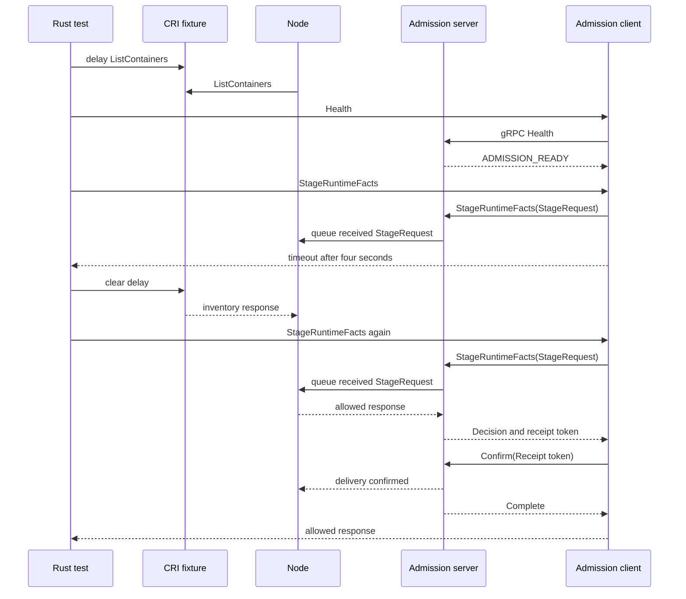

# Live-Node Admission Stall Review

This guide reviews the live-Node admission-stall test and its Unix gRPC
transport. The test checks the production admission client and Node while a
Container Runtime Interface (CRI) inventory response is late.

## Intended end state

A live Node can fail to answer a runtime admission request before its deadline.
The caller must fail closed. The same request must succeed when Node can
process the external inventory response.

## Review route

[live_node_stall_is_closed](src/platform/shared.rs) starts Control and Node, installs a signed policy, confirms readiness, and supplies a CRI Created observation.
  -> [CriFixture](src/platform/cri.rs) delays `ListContainers` for eight seconds.
  -> [Node reconciliation](../mithril-node/src/identity/binding.rs) waits for the CRI inventory response.
  -> [RuntimeAdmissionClient::available](../mithril-node/src/runtime_admission.rs) calls the gRPC Health method.
  -> [RuntimeAdmissionGrpc::health](../mithril-node/src/runtime_admission.rs) checks the Unix peer identity and returns `ADMISSION_READY`.
  -> [RuntimeAdmissionClient::stage_runtime_facts](../mithril-node/src/runtime_admission.rs) calls the typed gRPC StageRuntimeFacts method with a four-second deadline.
  -> [RuntimeAdmissionGrpc::stage_runtime_facts](../mithril-node/src/runtime_admission.rs) queues the received Protobuf request for Node.
  -> [RuntimeAdmissionClient::stage_runtime_facts](../mithril-node/src/runtime_admission.rs) returns a fail-closed timeout before Node answers.

[live_node_stall_is_closed](src/platform/shared.rs) removes the CRI delay.
  -> [Node admission](../mithril-node/src/node.rs) answers a new Stage request after reconciliation continues.
  -> [RuntimeAdmissionGrpc::decide](../mithril-node/src/runtime_admission.rs) returns the decision and a receipt token to the client.
  -> [RuntimeAdmissionClient::confirm](../mithril-node/src/runtime_admission.rs) calls the typed Confirm method with that token.
  -> [RuntimeAdmissionCall::deliver](../mithril-node/src/runtime_admission.rs) completes only after the server verifies the same Unix process and token.
  -> [live_node_stall_is_closed](src/platform/shared.rs) requires an allowed response and stops the fixture.



`CriFixture` owns the delayed response and its call counter. `Shared` owns
Control, Node, policy, the CRI fixture, and cleanup. The
[socket owner](../mithril-node/src/unix_socket.rs) creates a root-owned,
mode-0600 Unix socket and removes its inode during Node shutdown.
[UnixIncoming](../erebor-runtime-ipc/src/transport.rs) supplies kernel peer
credentials to tonic. The server checks root UID and a valid process ID.
The [Protobuf contract](../erebor-runtime-ipc/proto/erebor/runtime/ipc/v1/mithril.proto)
defines Health, StageRuntimeFacts, PrepareContainer,
PrepareDeclaredEntries, and Confirm. Each operation has a distinct generated
request type. Path fields carry Unix path bytes. The client and server enforce
message limits and deadlines. [Admission limits](../mithril-node/src/admission_limits.rs)
belong to Mithril, not to the generic IPC contract.
The Node event loop owns policy and kernel state. The server puts the typed
request, peer process ID, deadline, and reply channels in a local
`RuntimeAdmissionCall`. This item is not a wire message. The delivery
channel lets Node roll back a grant when the hook does not confirm receipt.
The test does not publish a binding or activate a runtime root itself. This
change adds no BPF program, map, or kernel Application Binary Interface (ABI)
field.

## Proof and limit

The typed gRPC revision `e44978d8` passed the exact privileged Host test in 42.88
seconds with typed gRPC and Mithril-owned limits. The repository Rust
verification script passed after the final Rust edit. It includes all 249 Node
library tests, three OCI hook tests, and the Protobuf descriptor contract. The
Node tests include receipt peer binding and replay denial. The earlier
Kubernetes TCP result and full identity lifecycle results used the old
admission transport. They do not verify this gRPC change. The unchanged
`application_read_uses_default` scenario passed on Host in 45.82 seconds,
direct `runc` in 83.77 seconds, and Kubernetes in 77.53 seconds with the new
transport. The Kubernetes run used the Node image built from this working
tree and a retained K3s cluster. The first full Rust script run failed in an
unrelated CLI test that read temporary JSON. The exact CLI test and the
unchanged full script rerun passed. The cause of the first failure is not
known.

The lightweight test reproduces a live Node with a timed-out production Stage
request. The Kubernetes test uses the real OCI hook and actor. Neither result
identifies the cause of the earlier intermittent Kubernetes stall. The test
does not replace the actor scenario or prove that CRI caused that stall.

## Node loop review

[NodeChassis::run](../mithril-node/src/node.rs) transfers the chassis to its run owner.
  -> [NodeRun::start](../mithril-node/src/node/run.rs) starts the local services and effect tasks.
  -> [NodeRun::run](../mithril-node/src/node/run.rs) selects Control, runtime, timer, task-exit, and shutdown events.
  -> [NodeChassis::answer_runtime_admission](../mithril-node/src/node.rs) handles the typed admission call.
  -> [NodeRun::finish](../mithril-node/src/node/run.rs) stops the effect tasks, kernel host, and local services.

`NodeRun` owns connection attempts, reconnect delay, readiness state, upload
acknowledgements, and task handles. It does not add another policy owner.
One connection attempt remains active while the loop handles admission.
A failed connection closes admission and schedules a bounded retry. The last
valid local policy remains installed.

`NodeChassis::await_control_rpc` continues to handle admission
requests while a Control operation waits. This inner wait is necessary:
the main select loop cannot run while its selected handler awaits that operation.
The test `pending_control_unary_still_answers_runtime_admission` checks this
case. It is distinct from the delayed CRI test above.

`NodeRun::listener_exit` handles both admission and seccomp listener exits.
An unexpected exit closes admission and returns an error. A requested shutdown
preserves any listener error. The test `listener_exit_closes_admission` checks
both listeners. The effect-reader and effect-worker exit tests still require
an unexpected exit to fail Node.

The loop stores one pending coverage acknowledgement because it sends only
one coverage interval at a time. A stale acknowledgement still closes the
Control session. The refactor changes no wire message, BPF map, or kernel ABI.

This section covers the uncommitted Node loop refactor on 2026-09-26.
`bash .github/scripts/verify-rust-ci.sh` passed after the final Rust edit.
This run includes formatting, workspace checks, clippy, and workspace tests.
All 249 Node library tests passed. The privileged
`platform::shared::tests::live_node_stall_is_closed` test passed in 52.61
seconds in the retained VM with the rebuilt Rust test binary.

The VM's old copied test binary did not contain this test. A later setup
attempt lacked `MITHRIL_TEST_PIN`. Neither attempt exercised admission.
The successful run used the new binary from `target/debug/deps` and explicit
Host output, pin, lease, and cgroup paths. It changed no scenario assertions
or deadlines. Kubernetes qualification was not rerun for this loop refactor.

## Policy synchronization review

This section covers the policy synchronization working tree on 2026-09-26.
The intended result is one session owner that advances policy delivery.
The scheduler must not manage transfer steps or translate each RPC result.

[NodeRun::poll_policy](../mithril-node/src/node/run.rs) checks identity and evidence readiness.
  -> [PolicyControlWorkV1::advance](../mithril-node/src/node/sync.rs) starts one synchronization step.
  -> [PolicyControlWorkV1::transfer](../mithril-node/src/node/sync.rs) gets inventory, stores one chunk, or prepares and activates the complete policy.
  -> [NodeChassis::activate_control_policy](../mithril-node/src/node.rs) installs the prepared policy and completes local readback.
  -> [PolicyControlWorkV1::acknowledge](../mithril-node/src/node/sync.rs) sends the pending acknowledgement on a later step.
  -> [NodePolicyDeliveryOwner::acknowledge_control](../mithril-node/src/policy_delivery.rs) checks and stores the Control receipt.
  -> [PolicyControlWorkV1::exceptions](../mithril-node/src/node/sync.rs) observes counters and delivers exception results and candidates.

[NodeChassis::await_control_rpc](../mithril-node/src/node.rs) waits for each Control response and handles queued admission requests.
  -> [PolicyControlWorkV1::finish](../mithril-node/src/node/sync.rs) handles a Control failure once and selects a delayed retry or reconnect.
  -> [NodeRun](../mithril-node/src/node/run.rs) resets session work after a new connection succeeds.

`PolicyControlWorkV1` owns session progress, retry pacing, and rejected
candidate state. `NodeRun` creates and drops this owner. The delivery owner
still owns durable chunks, activation records, and receipts. Reconnect does
not delete those records. The refactor removes `PolicyControlRpcV1` and the
repeated conversion at each call. Local errors still stop synchronization.

The tests `control_failure_preserves_progress` and
`local_failure_is_not_retried` check retry selection, retained progress,
pacing, and local failure handling. The existing admission responsiveness
test remains unchanged. No public API, wire message, durable format, BPF
program, or kernel ABI changes.

### Synchronization verification

All 250 Node library tests passed. The focused `control_tls::` run passed
19 tests and left its two existing release-only tests ignored.

The rebuilt Rust test binary passed these unchanged privileged Host cases
in the retained VM:

| Test | Result |
| --- | --- |
| `live_node_stall_is_closed` | Pass, 56.22 seconds |
| `running_task_uses_new_policy::identity_host` | Pass, 46.10 seconds |
| `one_use_after_replace::exception_host` | Pass, 49.47 seconds |

Two earlier stall runs and the first policy replacement run exceeded the
60-second Node startup limit. These runs stopped before policy
synchronization. A CPU profile sampled the kernel verifier under
`KernelHostOwner::start`, through libbpf load and `bpf_check`. The unchanged
tests passed after heavy compilation ended. These results support, but do
not prove, a load-sensitive startup cause. No timeout or BPF code changed.

The first complete Rust gate passed formatting, workspace checks, and
clippy. Its partition reconnect test then stopped making progress for more
than five minutes. The test process was terminated. The same test passed
in the focused Control run. A stack trace was not available because host
ptrace access was denied and sudo required a password. This result does
not establish the cause of the stalled test.

The final gate passed with independent tests run in sequence:

```sh
RUST_TEST_THREADS=1 bash .github/scripts/verify-rust-ci.sh
```

This command ran after the last Rust edit. It passed formatting, workspace
checks, clippy with warnings denied, and workspace tests. The partition
reconnect test and all 250 Node library tests passed. Each test retained its
internal concurrency. The earlier parallel-run stall remains unexplained.

Direct runc and Kubernetes qualification were not rerun for this refactor.

## Runtime preparation review

This section covers the runtime preparation working tree after `82c4fee1`.
The intended result is one preparation owner that records each completed
publication and provides one explicit rollback operation.

[NodeChassis::answer_runtime_preparation](../mithril-node/src/node.rs) checks whether the request can wait for policy convergence.
  -> [RuntimePreparation::prepare](../mithril-node/src/node/admission.rs) validates readiness, staged identity, CRI Created state, and the resolved configuration.
  -> [RuntimePreparation::publish](../mithril-node/src/node/admission.rs) retires the previous lifetime, publishes the held root, and verifies its kernel identity.
  -> [RuntimePreparation::persist](../mithril-node/src/node/admission.rs) stores the runtime binding and replaces the live configuration.
  -> [RuntimeAdmissionCall::deliver](../mithril-node/src/runtime_admission.rs) sends the response and waits for the authenticated receipt.
  -> [RuntimeAdmissionGrpc::confirm](../mithril-node/src/runtime_admission.rs) checks the receipt token, peer process, and deadline before completing delivery.

[RuntimePreparation::rollback](../mithril-node/src/node/admission.rs) handles a preparation failure or an unconfirmed response.
  -> [WorkloadBindingOwner::retire_binding_id](../mithril-node/src/identity/binding.rs) closes published kernel authority.
  -> [NodePolicyDeliveryOwner::rollback_runtime_binding](../mithril-node/src/policy_delivery.rs) restores the preceding durable lifetime.
  -> [NodeChassis::reconcile_runtime_exact_bindings](../mithril-node/src/node.rs) runs only after kernel and durable cleanup succeed.

The preparation owner borrows the chassis for one serialized admission.
The chassis creates this owner before preparation. The owner records the
kernel binding only after publication succeeds. After persistence succeeds,
the owner retains the durable rollback record and previous configuration
together. These records do not introduce another durable store.

| Completed publication | Rollback work |
| --- | --- |
| None | No cleanup |
| Kernel only | Retire the new kernel binding |
| Kernel and durable | Retire the kernel binding, restore durable state, restore configuration, and reconcile exact bindings |

Rollback attempts durable cleanup even if kernel cleanup fails. Configuration
is restored only when durable cleanup succeeds. Cleanup errors remain fatal
and visible with the preparation error. Kernel publication and readback
errors retain their fatal classification. Cancellation checks remain before
publication and after kernel and durable publication. No `Drop` method
performs rollback.

The Node tests `rollback_tracks_kernel_publication` and
`rollback_errors_remain_fatal` check publication-dependent cleanup and error
visibility. The physical `unconfirmed_prepare_rolls_back` test uses the
generated gRPC client to receive an allow decision without confirming it.
The test checks both the prepared kernel binding and durable runtime record
before expiry. It then requires kernel termination, durable restoration,
receipt rejection, and continued Node readiness. It uses the existing
process fixture and `ready.py`; the actor remains held.

No BPF program, kernel ABI, wire message, or durable format changes.

### Preparation verification

The preparation refactor is implemented. All 252 Node library tests passed.
The following privileged tests passed in the retained VM with the rebuilt
test binary:

| Test | Result |
| --- | --- |
| `unconfirmed_prepare_rolls_back` | Pass, 76.28 seconds |
| `application_read_uses_default::identity_host` | Pass, 59.40 seconds |
| `application_read_uses_default::identity_runc` | Pass, 46.13 seconds |

The first runc command lacked `MITHRIL_TEST_RUNC`. A later command omitted
`--ignored` and did not execute the test. The successful command supplied
`MITHRIL_TEST_RUNC=/usr/sbin/runc`, the rebuilt `MITHRIL_TEST_OCI_HOOK`, and
`--exact --ignored --nocapture --test-threads=1`. No assertion or timeout
changed.

The final `RUST_TEST_THREADS=1 bash .github/scripts/verify-rust-ci.sh` run
passed after the last Rust edit. It includes formatting, workspace checks,
clippy with warnings denied, and workspace tests. The partition reconnect
test passed in this run. Kubernetes qualification was not rerun for this
preparation refactor.
