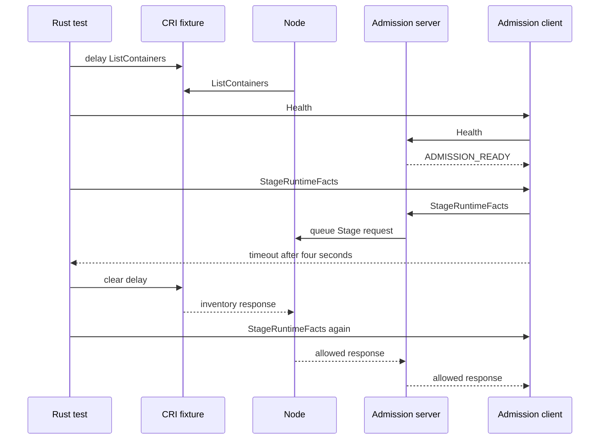

# Live-Node Admission Stall Review

This guide reviews the lightweight admission-stall test in this commit. The
test checks the production admission client and Node while an external
Container Runtime Interface (CRI) inventory response is late.

## Intended end state

A live Node can fail to answer a runtime admission request before its deadline.
The caller must fail closed. The same request must succeed when Node can
process the external inventory response.

## Review route

[The test](src/platform/shared.rs) starts Control and Node, installs a signed
policy, confirms readiness, and supplies a CRI Created observation.
  -> [CRI fixture](src/platform/cri.rs) delays the next `ListContainers`
     response for eight seconds.
  -> [Node reconciliation](../mithril-node/src/identity/binding.rs) waits for
     the external CRI inventory response.
  -> [Admission server](../mithril-node/src/runtime_admission.rs) answers a
     Health request directly and queues `StageRuntimeFacts` for Node.
  -> [Admission client](../mithril-node/src/runtime_admission.rs) returns a
     fail-closed timeout after four seconds without a Stage response.

[The test](src/platform/shared.rs) removes the CRI delay.
  -> [Node admission](../mithril-node/src/node.rs) answers the same production
     Stage request after reconciliation can continue.
  -> [The test](src/platform/shared.rs) requires an allowed response and stops
     the fixture.

`CriFixture` owns the delayed response and its call counter. `Shared` owns
Control, Node, policy, the CRI fixture, and cleanup. Production code owns the
admission socket, timeout, request queue, and decision. The test does not
publish a binding or activate a runtime root itself. It adds no BPF program,
map, or Application Binary Interface (ABI) field.

## Proof and limit

The exact privileged Host test passed twice in 35.76 and 35.98 seconds. The
paired Kubernetes TCP scenario passed alone in 65.31 seconds. The full identity
lifecycles passed on Host (55 tests), direct `runc` (50 tests), and Kubernetes
(50 tests). The repository Rust verification script passed with one Cargo job
and incremental compilation off.

The lightweight test reproduces a live Node with a timed-out production Stage
request. The Kubernetes test uses the real OCI hook and actor. Neither result
identifies the cause of the earlier intermittent Kubernetes stall. The test
does not replace the actor scenario or prove that CRI caused that stall.
