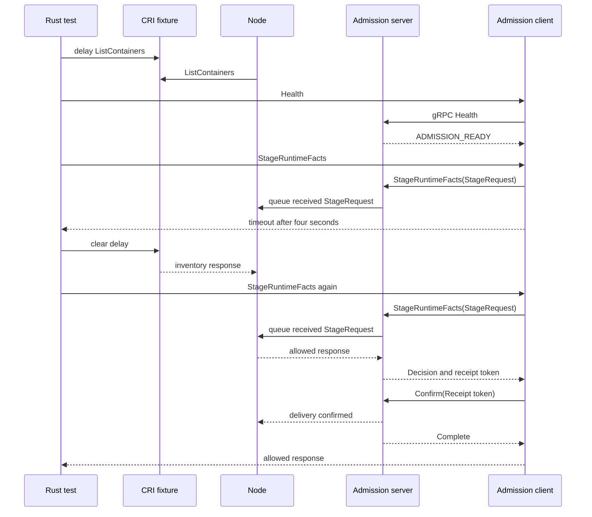

# Live-Node Admission Stall Review

This guide reviews the live-Node admission-stall test and its Unix gRPC
transport. The test checks the production admission client and Node while a
Container Runtime Interface (CRI) inventory response is late.

## Intended end state

A live Node can fail to answer a runtime admission request before its deadline.
The caller must fail closed. The same request must succeed when Node can
process the external inventory response.

## Review route

[live_node_stall_is_closed](src/platform/shared.rs) starts Control and Node, installs a signed policy, confirms readiness, and supplies a CRI Created observation.
  -> [CriFixture](src/platform/cri.rs) delays `ListContainers` for eight seconds.
  -> [Node reconciliation](../mithril-node/src/identity/binding.rs) waits for the CRI inventory response.
  -> [RuntimeAdmissionClient::available](../mithril-node/src/runtime_admission.rs) calls the gRPC Health method.
  -> [RuntimeAdmissionGrpc::health](../mithril-node/src/runtime_admission.rs) checks the Unix peer identity and returns `ADMISSION_READY`.
  -> [RuntimeAdmissionClient::stage_runtime_facts](../mithril-node/src/runtime_admission.rs) calls the typed gRPC StageRuntimeFacts method with a four-second deadline.
  -> [RuntimeAdmissionGrpc::stage_runtime_facts](../mithril-node/src/runtime_admission.rs) queues the received Protobuf request for Node.
  -> [RuntimeAdmissionClient::stage_runtime_facts](../mithril-node/src/runtime_admission.rs) returns a fail-closed timeout before Node answers.

[live_node_stall_is_closed](src/platform/shared.rs) removes the CRI delay.
  -> [Node admission](../mithril-node/src/node.rs) answers a new Stage request after reconciliation continues.
  -> [RuntimeAdmissionGrpc::decide](../mithril-node/src/runtime_admission.rs) returns the decision and a receipt token to the client.
  -> [RuntimeAdmissionClient::confirm](../mithril-node/src/runtime_admission.rs) calls the typed Confirm method with that token.
  -> [RuntimeAdmissionCall::deliver](../mithril-node/src/runtime_admission.rs) completes only after the server verifies the same Unix process and token.
  -> [live_node_stall_is_closed](src/platform/shared.rs) requires an allowed response and stops the fixture.

`CriFixture` owns the delayed response and its call counter. `Shared` owns
Control, Node, policy, the CRI fixture, and cleanup. The
[socket owner](../mithril-node/src/unix_socket.rs) creates a root-owned,
mode-0600 Unix socket and removes its inode during Node shutdown.
[UnixIncoming](../erebor-runtime-ipc/src/transport.rs) supplies kernel peer
credentials to tonic. The server checks root UID and a valid process ID.
The [Protobuf contract](../erebor-runtime-ipc/proto/erebor/runtime/ipc/v1/mithril.proto)
defines Health, StageRuntimeFacts, PrepareContainer,
PrepareDeclaredEntries, and Confirm. Each operation has a distinct generated
request type. Path fields carry Unix path bytes. The client and server enforce
message limits and deadlines. [Admission limits](../mithril-node/src/admission_limits.rs)
belong to Mithril, not to the generic IPC contract.
The Node event loop owns policy and kernel state. The server puts the typed
request, peer process ID, deadline, and reply channels in a local
`RuntimeAdmissionCall`. This item is not a wire message. The delivery
channel lets Node roll back a grant when the hook does not confirm receipt.
The test does not publish a binding or activate a runtime root itself. This
change adds no BPF program, map, or kernel Application Binary Interface (ABI)
field.

## Proof and limit

The current working tree passed the exact privileged Host test in 42.88
seconds with typed gRPC and Mithril-owned limits. The repository Rust
verification script passed after the final Rust edit. It includes all 249 Node
library tests, three OCI hook tests, and the Protobuf descriptor contract. The
Node tests include receipt peer binding and replay denial. The earlier
Kubernetes TCP result and full identity lifecycle results used the old
admission transport. They do not verify this gRPC change. The unchanged
`application_read_uses_default` scenario passed on Host in 45.82 seconds,
direct `runc` in 83.77 seconds, and Kubernetes in 77.53 seconds with the new
transport. The Kubernetes run used the Node image built from this working
tree and a retained K3s cluster. The first full Rust script run failed in an
unrelated CLI test that read temporary JSON. The exact CLI test and the
unchanged full script rerun passed. The cause of the first failure is not
known.

The lightweight test reproduces a live Node with a timed-out production Stage
request. The Kubernetes test uses the real OCI hook and actor. Neither result
identifies the cause of the earlier intermittent Kubernetes stall. The test
does not replace the actor scenario or prove that CRI caused that stall.
