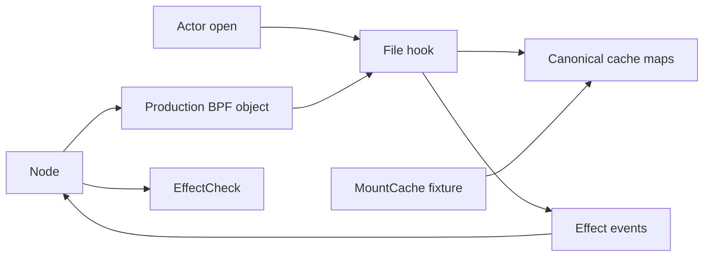

# Stale Mount Cache Rebuild Review

This guide covers `stale_cache_keeps_deny` and its pinned-map fixture. The
test replaces the rebuild assertion in the legacy runtime probe. It does not
replace old-row collection.

## Intended end state

A governed read stays denied after a READY cache row has an incorrect mount
count. BPF builds a newer READY generation. The mount namespace, mountinfo,
and mutation epoch stay unchanged. The same Rust test runs on each qualified
platform.

## Read the implementation

[stale_cache_keeps_deny](src/identity/scenarios/cache_rebuild.rs) starts Control and Node, installs the signed policy, and starts the actor.
  -> [read_path.py](fixtures/process/read_path.py) opens the protected path and reports the real errno and byte count.
  -> [EffectCheck](src/effect/check.rs) requires the actor's fresh `PATH_TREE_POLICY_DENY` File/OpenRead result.
  -> [MountCache::snapshot](src/physical/mount_cache.rs) reads the READY keys, generation, epoch, namespace, and mountinfo.
  -> [MountCache::stale](src/physical/mount_cache.rs) decreases each selected READY row's mount count by one.
  -> [read_path.py](fixtures/process/read_path.py) repeats the same protected read.
  -> [ensure_canonical_mount_cache](../../bpf/erebor-interceptor/programs/identity_path.bpf.h) detects the count mismatch and builds a newer generation.
  -> [stale_cache_keeps_deny](src/identity/scenarios/cache_rebuild.rs) requires denial, fresh attributed evidence, new READY keys, and unchanged topology.
  -> [MountCache::rows](src/physical/mount_cache.rs) counts current and obsolete rows in both cache maps through checked typed keys.
  -> [stale_cache_keeps_deny](src/identity/scenarios/cache_rebuild.rs) requires obsolete object and state rows and retained current rows.
  -> [ProcessFixture::stop](src/process.rs) stops the actor before Platform cleanup.

The actor performs both real opens. The test does not write an expected errno
into its result. The test changes only the existing cache-state count. It
does not construct a cache, deliver policy, admit a process, or call Node
reconciliation from a helper.

## Owners and lifetime

`Platform` owns physical setup and the shared Control and Node lifecycle.
The `mount_late` lifecycle is reused. The scenario owns action order, policy
choice, and assertions. `ProcessFixture` owns actor readiness, result waits,
and cleanup. Result waits report a bounded timeout, path, exit state, and
stderr.

`MountCache` owns one libbpf map handle and a production map reader. It reads
the actor's real `/proc` entries. Rust closes the handle at scope exit. The
handle does not own the BPF pin, policy, Node, or process.

## BPF and ABI boundary

The test runs the production object that Node loads. No BPF code changes.
The read enters the production file hook and path evaluator:

| Map | Key and value ABI | Userspace writer | BPF writer | Readers | Lifetime |
| --- | --- | --- | --- | --- | --- |
| `canonical_mount_cache` | Named C object key and selected mount value | Node removes obsolete rows | Cache builder publishes selected mounts | Path evaluator and fixture | Pinned under the test root |
| `canonical_mount_cache_states` | Named C cache-state key and count/state value | Test decreases an existing count | Cache builder publishes READY | Path evaluator and fixture | Pinned under the test root |
| `canonical_mount_cache_generation` | Native-endian u32 key and u64 generation | Production initialization | Cache builder advances generation | Path evaluator and fixture | Pinned under the test root |
| `mount_global_mutation_epoch` | Native-endian u32 key and u64 epoch | Production initialization | Mount hooks advance epoch | Path evaluator and fixture | Pinned under the test root |

The fixture's `repr(C)` layouts match the named structures in
[identity_maps.h](../../bpf/erebor-interceptor/programs/identity_maps.h).
The constructor checks the loaded map's key and value sizes. `zerocopy`
rejects a wrong input size. Integer fields are all-bit-valid; the snapshot
selects only the named READY state at the current epoch and generation.
The object key contains the complete state key and one root-dentry address.
The row counter reads the complete typed key for each map. A row is obsolete
when its epoch or generation precedes the corresponding current counter.
The fixture uses no literal byte offsets. `MapFlags::EXIST` prevents fault
injection from creating a new row.

The builder reads the real namespace count. A mismatch advances the cache
generation. The builder checks the namespace event, mutation epoch, and
generation before and after READY publication. Its bounded mount scan uses
`bpf_loop`. A failed proof follows the production fail-closed path. A valid
rebuild does not change the signed path-tree decision.

A pin keeps a map alive after a local handle closes. The Platform teardown
removes test pins when it releases its lifecycle. The scenario checks actor
cleanup; the VM command also checks pin, lease, and cgroup removal.

## Verification limits

The 86-line Host case passed in 28.17 seconds on the retained VM. The Host
addition is committed in `c06a6892`. The unchanged direct-`runc` case passed
in 28.79 seconds through stock `runc` and the production OCI hook. Its pin,
lease, and cgroup cleanup passed. That registration is committed in
`abb5e75e`. The unchanged Kubernetes case passed in 68.10 seconds with
deployed Control, Node, policy CRDs, and the actor Pod. Its namespace, pin,
and lease cleanup passed. No production or Platform API changed.
The final repository Rust CI procedure passed. It checked formatting,
workspace compilation, strict Clippy, and workspace tests.

The legacy corruption/read setup and unreachable-row assertions remain.
The test does not prove Node collection or the concurrent 32-exec condition.
After all three platforms passed, retirement removed the duplicate Rust
rebuild comparison, result field, and VM predicate: 21 Rust lines and one
shell line. The two focused runc regressions and VM harness checks passed.
The real Kubernetes shell still waits for rebuild before checking collection.
That wait cannot be removed until the collector has a shared replacement.
The final repository Rust CI procedure passed after the retirement edit.

The typed row counter is verified through the same rebuild case. The test
now has 89 lines. It passed on Host in 30.28 seconds, direct `runc` in 31.89
seconds, and Kubernetes in 72.03 seconds on 2026-10-01. Each run requires
obsolete object and state rows and retained current rows after rebuild.
Cleanup, local VM harness checks, and the final Rust CI procedure passed.
This addition reads state only. It does not prove Node collection or change
Platform, Node, Control, or BPF behavior.

## Collection boundary

The separate 95-line Host collector draft failed on 2026-10-01. Both opens
returned `EACCES` with fresh attributed denial evidence. BPF rebuilt the
READY cache. Nine obsolete object rows and one obsolete state row remained
after the 30-second collection wait. The complete run took 58.78 seconds.
The actor, pins, lease, and cgroup were removed. The old checks remain.

[NodeBindingReconciliation::reconcile](../mithril-node/src/node.rs) reads the runtime inventory.
  -> [NodeBindingReconciliation::reconcile](../mithril-node/src/node.rs) returns when CRI is unchanged and no binding is recovering.
  -> Not implemented: a BPF cache-generation change triggers obsolete-row collection.

[reconcile_cri_exact_bindings](../mithril-node/src/policy.rs) runs exact-binding reconciliation.
  -> [retire_unreachable_mount_cache_rows](../mithril-node/src/policy.rs) removes rows older than the current epoch or generation.

[NodeRun::poll_policy](../mithril-node/src/node/run.rs) runs policy maintenance.
  -> [retirement_pending](../mithril-node/src/policy.rs) permits generation retirement only when holders still need cleanup.

The old direct-runc test calls `reconcile_cri_exact_bindings` explicitly.
That call does not prove that the deployed Node notices a cache-only change.
Keep the unchanged-CRI early return. A proposed Node change observes the
mount epoch and cache generation in the existing reconciliation path. The
owner would collect obsolete rows only after that pair changes. This proposal
does not require policy installation, exact-binding reconciliation, a BPF
change, or a new public API. No production change is approved or implemented.

The failed draft is outside the crate at
`/tmp/mithril-cache-collection-repro-20261001.rs`. Its run log is
`/tmp/mithril-cache-collection-host-20261001.log`. This draft is not a passing
replacement. No collector case ran on direct runc or Kubernetes.
The final Rust CI procedure passed after the draft was removed from the crate.
