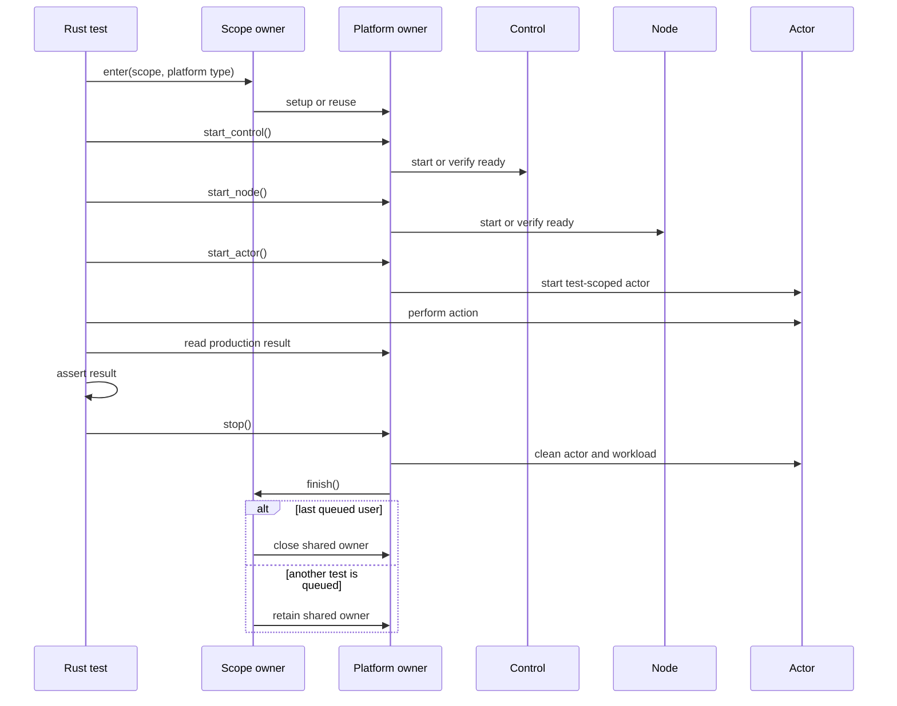

# Platform Scope Implementation Review

This guide reviews the shared platform-scope implementation at revision
`80695da`. The implementation keeps scenario functions unchanged and reuses
Control and Node only when standard Rust tests select the same named scope.

The wider scenario-maintainability work is not complete. The authoritative
rules and remaining inventory are in
[SCENARIO_MAINTAINABILITY_TODO.md](SCENARIO_MAINTAINABILITY_TODO.md).

## Intended end state

- One small scenario function supplies setup, component order, actor action,
  assertions, and teardown.
- `#[platform_test(...)]` generates one standard ignored `#[test]` for each
  selected platform.
- `#[scope = "name"]` selects shared lifecycle ownership without changing the
  scenario body.
- A named scope can retain one Control and one Node for its concrete platform.
- Actor processes, workload resources, policy state, and results remain
  test-scoped.
- Host, direct-`runc`, and Kubernetes keep separate physical operations.

## Primary review route

Read these transitions in order:

1. [`platform_test`](../mithril-e2e-macros/src/lib.rs) validates the function
   shape, consumes `scope`, and generates standard platform test functions.
2. [`test_scope`](src/platform/scope.rs) records the scope name and concrete
   platform type for the generated test call.
3. [`enter`](src/platform/scope.rs) selects one synchronized state slot by the
   concrete platform `TypeId`.
4. [`Platform::setup`](src/platform.rs) enters the physical platform owner.
5. [`Shared::setup`](src/platform/shared.rs) retains lightweight Control and
   Node state for Host and direct `runc` when the scope name is unchanged.
6. [`Kubernetes::setup`](src/platform/kubernetes.rs) retains the Helm release,
   Node DaemonSet, and runtime integration when the scope name is unchanged.
7. The scenario runs its visible calls. The PID-reuse example is
   [`pid_reuse_is_fresh`](src/identity/pid_reuse.rs).
8. [`Host::stop`](src/platform/host.rs), [`Runc::stop`](src/platform/runc.rs),
   or [`Kubernetes::stop`](src/platform/kubernetes.rs) removes the current
   actor and workload resources.
9. [`ScopeGuard::finish`](src/platform/scope.rs) reports whether the current
   test is the last queued user of that concrete platform.
10. The last user removes Control, Node, and other shared resources. A queued
    user keeps only the common owner and receives clean test-scoped state.
11. A different scope name closes the retained owner before its setup starts.

## Ownership

| Owner | Responsibility | Must not own |
| --- | --- | --- |
| `platform_test` macro | Test syntax validation and standard test generation | Scenario actions or lifecycle operations |
| `scope.rs` | Current scope selection, per-platform serialization, and retained state slot | Host, `runc`, or Kubernetes behavior |
| `SharedState` | Lightweight Control, Node, policy, cgroup, pin, readiness, and cleanup resources | Host mounts or `runc` commands |
| `Host` | Host rootfs mounts, PID namespace actor startup, and host process entry | `runc` or Kubernetes behavior |
| `Runc` | OCI bundle setup, `runc run`, `runc exec`, state reads, and forced container deletion | Host emulation or Kubernetes behavior |
| `KubernetesState` | Kubernetes objects, Helm release, deployed owners, runtime integration, and namespace cleanup | In-process substitutes for deployed Control or Node |
| Scenario function | Component order, actor action, and explicit result assertions | Platform branches or async runtime setup |

## Lifetime and concurrency

The standard Rust harness remains the scheduler. A generated test records its
scope before it calls the shared scenario. Tests for one concrete platform
use one mutex and cannot operate on the same kernel or Kubernetes node at the
same time.

Queued tests increment the platform user count before they wait for the mutex.
The current test keeps the shared owner only when another platform test is
queued. An exact single-test invocation has no queued user, so it performs full
bounded cleanup. A scope-name change also performs full cleanup before the new
owner starts.

## Production and ABI boundaries

The scope owner does not install policy, publish bindings, activate roots,
recover identities, or acknowledge evidence. The unchanged scenario calls the
platform API in the required order. The lightweight owner calls production
owners. The Kubernetes owner uses the deployed Control and Node and receives
real Kubernetes and runtime events.

[`Platform::state`](src/platform.rs), `coordinate`, `edge`, and related readers
use `KernelStateReader` and checked `zerocopy` decoding. Invalid map value sizes
or layouts fail the test. The scope implementation does not change map keys,
values, BPF programs, or ABI structures.

## Failure and cleanup behavior

- Readiness waits keep their existing bounded limits.
- Host unmounts its test rootfs and removes its actor bundle.
- Direct `runc` uses `runc delete --force` for its test container.
- Kubernetes deletes its actor namespace and work directory after each test.
- The last Kubernetes user removes runtime integration, the Helm release, and
  the system namespace.
- `Drop` remains an idempotent fallback. An explicit `stop` returns cleanup
  failure to the test.

## Verification record

The following checks passed for implementation revision `80695da`:

- Focused `child_exec`: Host `1/1` in 35.52 seconds.
- Focused `child_exec`: direct `runc` `1/1` in 31.18 seconds.
- Focused `child_exec`: Kubernetes `1/1` in 106.89 seconds.
- Complete Host lane: `25/25` in 720.23 seconds.
- Complete direct-`runc` lane: `16/16` in 385.05 seconds.
- Complete Kubernetes lane on real retained K3s: `18/18` in 1028.03 seconds.
- Required Rust CI script: passed; `mithril-e2e` reported `89` passed and `60`
  ignored in the nonphysical run.
- `cargo fmt --all -- --check`: passed.
- `cargo test -p mithril-e2e --lib --no-run`: passed.
- Strict crate Clippy: passed.

The retained qualification VM is `mithril-runtime-qualification-1945196`.
Its work directory is
`target/mithril-vm-work/mithril-vm-test.rhpo0Y`. This implementation does not
complete the remaining scenario migrations or the repository-wide 2,000-line
source-file limit.
