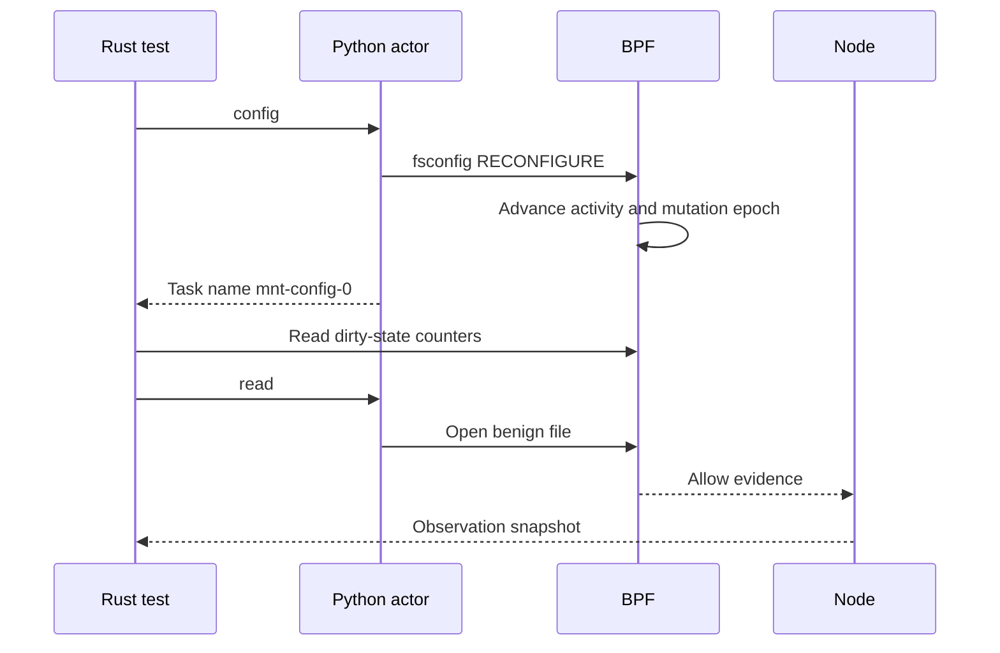
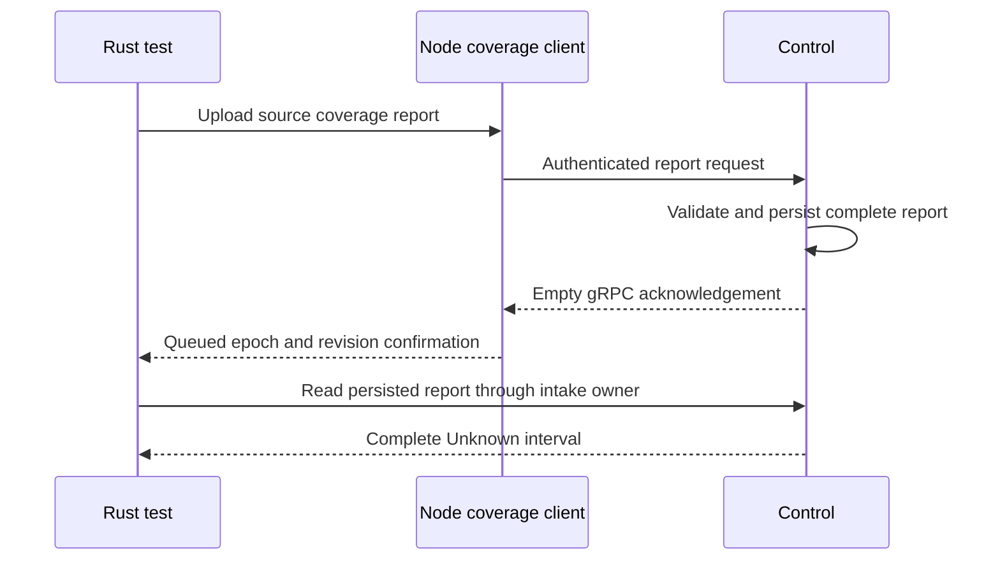
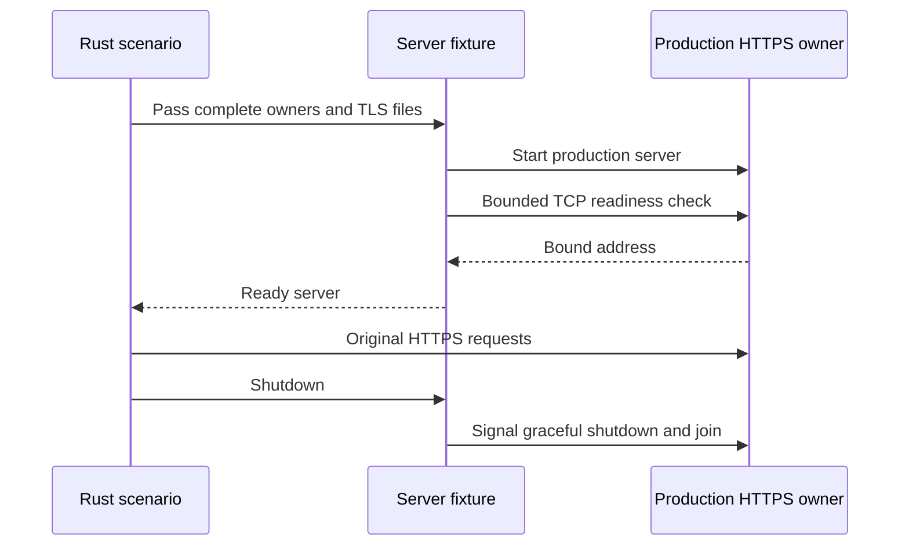
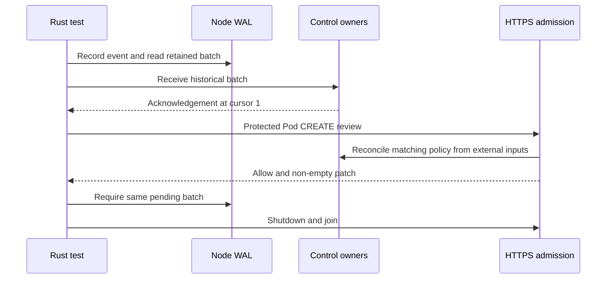
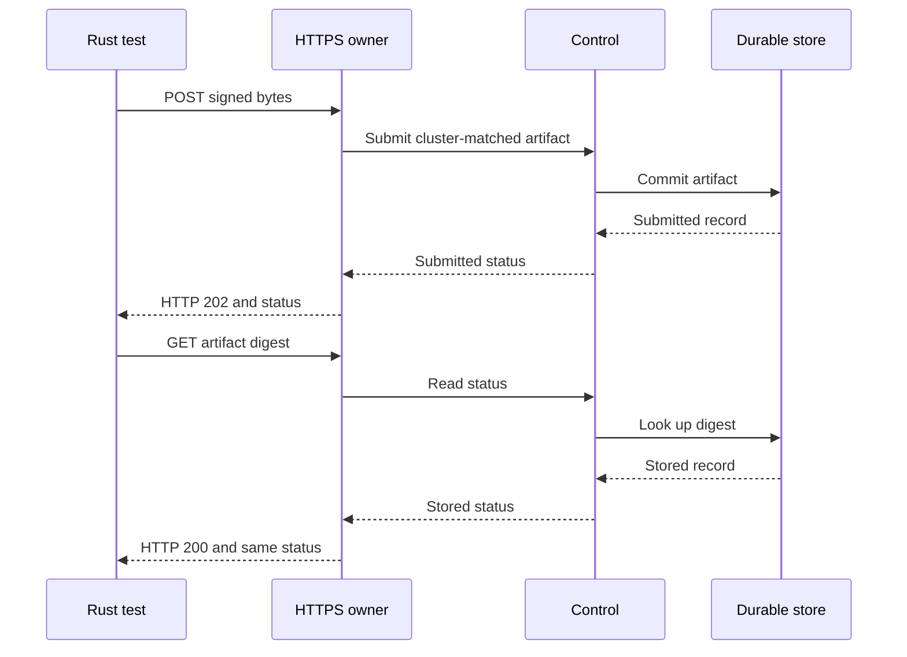

# Mithril End-To-End Qualification

Mithril end-to-end qualification runs shared Rust scenarios on Host, direct
`runc`, and Kubernetes. Run Host and direct `runc` before Kubernetes. Some
legacy physical probes still run during the migration.

## Lightweight Qualification

Rust code in `src/` owns the scenarios. Host and direct `runc` run production
owners without a Kubernetes cluster. Direct `runc` uses the stock runtime and
the production OCI hook. Kubernetes runs the same Rust test body against real
Control, Node, CRDs, and actor Pods.

The direct-`runc` lane also qualifies a kernel-host binary upgrade. It starts
with a different build of the production identity object, activates policy for
a running container, and restarts with the bundled production object. The
result must preserve the pinned map IDs, canonical link paths, running
application identity, and path-tree decision. It must replace each program
whose tag changed. The corresponding Kubernetes check is a retained
DaemonSet rollout on two nodes.

The lightweight case must reproduce the state transitions, failure condition,
and observable verdicts that the physical case will use. Owner-local unit and
integration tests can support this case, but they do not replace it.

## Physical Kubernetes Qualification

Scripts in `harness/` prepare VMs, K3s, images, and test binaries. New shared
Rust tests own the actor actions and result assertions. Legacy shell probes
still own some scenarios until a verified Rust replacement exists. Kubernetes
manifests and other inputs are in `fixtures/`.

The harness owns VM and cluster cleanup. A shared test owns its scenario
resources and checks its production evidence. Automated tests must not read
or execute files from `examples/`. Manual operator examples remain separate.

## Protocol Transfer Fixture

`GrpcTransfer` supplies the raw mutual-TLS transfer baseline for the evidence
budget. Its intended result is a complete byte count and a synchronized file
before a durable receipt. It does not send Mithril evidence or acknowledge
the Node WAL. The backlog test retains those production operations.

[GrpcTransfer::measure](src/control_tls/transfer.rs) binds one listener before it starts the server.
  -> [GrpcTransfer::measure](src/control_tls/transfer.rs) connects with the existing fixture certificates and streams bounded chunks.
  -> [GrpcTransfer::upload](src/control_tls/transfer.rs) counts every byte and synchronizes the optional file before returning its receipt.
  -> [GrpcTransfer::measure](src/control_tls/transfer.rs) requires the complete count, requests shutdown, and waits for the server.

[GrpcTransfer::measure](src/control_tls/transfer.rs) handles a transfer failure.
  -> [GrpcTransfer::measure](src/control_tls/transfer.rs) requests shutdown and retains the transfer and cleanup errors.
  -> [GrpcTransfer::measure](src/control_tls/transfer.rs) aborts and joins the server only if normal shutdown exceeds its deadline.

The fixture owns the bound listener, transfer futures, and server task. A
30-second deadline covers connection and transfer. Normal shutdown has a
five-second deadline. There is no readiness sleep or detached upload task.
Tonic and Prost use the existing throughput service and messages. There is
no BPF, kernel ABI, production protocol, or Platform API change.

Run the focused fixture check:

```sh
cargo test -p mithril-e2e --lib \
  control_tls::transfer_tests::transfer_keeps_complete_file -- --exact
```

The check verifies multiple chunks, a partial final chunk, complete durable
file bytes, and a receiver failure. It supplements the release backlog test;
it does not prove the 107.1 MiB/s budget. This guide covers the transfer
fixture change after `942c7ece`. The legacy backlog scenario remains.

### Backlog resource setup

Intended end state: The existing TLS fixture owns the budget's temporary
directory on the original target filesystem. The test keeps every production
upload, acknowledgement, timing measurement, and throughput assertion.

[MtlsFixture::in_directory](src/control_fixture.rs) receives the owned temporary directory and issues the existing certificates.
  -> [MtlsFixture::control_with_store](src/control_fixture.rs) returns Control with the same permitted Node, tenant, trust generation, and Retain store.
  -> [MtlsFixture::wal](src/control_fixture.rs) creates the existing durable Node log with the same canonicalizer and batch limits.
  -> [mtls_evidence_backlog_exceeds_the_previous_baseline](src/control_tls.rs) builds the original records, measures both raw transfers and direct intake, then sends and checks every production evidence group.
  -> [ControlServerFixture::shutdown](src/control_fixture.rs) joins normal server shutdown after the connection closes.

Before: The budget repeats certificate, permitted-Node, trust, WAL, and
connector setup. After: The existing fixture owns that setup. The test keeps
the 4,096-record batches, more than 512 MiB of payload, production group
limits, six measurements, source identity, exact acknowledgement count, zero
pending records, and 107.1 MiB/s threshold. The change removes 24 Rust lines
net. It does not move the scenario or hide upload sequencing.

```sh
cargo test -p mithril-e2e --release --lib \
  control_tls::mtls_evidence_backlog_exceeds_the_previous_baseline \
  -- --exact --ignored --nocapture --test-threads=1
```

The release test passed in 14.66 seconds on 2026-10-01. It acknowledged
536,989,928 bytes through five cumulative receipts at 143.4 MiB/s. The source
review covers the working tree after `e70c2dee`. Existing `MtlsFixture::new`
callers retain the same directory allocation and certificate behavior.
The related Control/TLS run passed 19 tests in 29.75 seconds, with two
existing ignored budgets. Harness checks and the final repository Rust CI
procedure exited with status 0 after the last Rust edit.
No Platform or production source changed. The legacy budget is still above
100 lines. Its scenario migration remains open; this fixture step is not
a size-rule exception or physical Kubernetes qualification.

## Destination Rewrite Fixture

The shared nftables fixture installs two destination rewrite rules in one
explicit network namespace. Its intended result is reliable rule removal,
including cleanup after the actor exits. It does not own Mithril decisions.

[NetworkRewriteOwner::install](src/effect/network_rewrite.rs) opens and retains the target network namespace.
  -> [NetworkRewriteOwner::configure](src/effect/network_rewrite.rs) installs both DNAT rules in that namespace.
  -> [NetworkRewriteOwner::run](src/effect/network_rewrite.rs) captures a failed command's exit status, namespace path, arguments, and stderr.
  -> [NetworkRewriteOwner::cleanup](src/effect/network_rewrite.rs) removes the table and closes the namespace descriptor.
  -> [NetworkRewriteOwner::drop](src/effect/network_rewrite.rs) retries removal only if explicit cleanup did not complete.

Run `effect::network_rewrite::tests::rewrite_cleanup_is_idempotent` by its
exact name with `--ignored --nocapture --test-threads=1` in the retained VM.
The check needs Linux `CAP_SYS_ADMIN`, `CAP_NET_ADMIN`, `nsenter`, and `nft`.
It proves rule installation, table removal, and repeated cleanup. It does
not prove Mithril packet attribution or durable evidence intake. The legacy
rewritten-flow actions remain until their shared replacement passes.

## Add And Run A Shared Scenario

Add one actor program under `fixtures/process/`. Reuse an existing signed
policy there when it states the required authority. Put one small Rust test
under the relevant `src/` scenario module and register the module. Use
`#[platform_test(host, runc, kubernetes)]` for the platforms that pass. Put
`#[lifecycle = name]` below it when tests share Control and Node resources.
The test must show the Control, Node, policy, and actor start order. Keep the
action, production result, security assertions, and stop calls in the test.
Use `ProcessFixture` for the actor and the existing `Platform` methods for
physical setup. Do not add a second process wrapper or reproduce Node work
inside a helper. A fixture owns placement, readiness, and cleanup. The test
owns component order, policy installation, actor actions, and assertions.

`install_policy("fixture.json")` returns that policy's `matchLabels` map.
Pass it to `start_actor("actor.py", &[], &labels)`. For simultaneous policies,
use fixtures with distinct selectors and retain both returned actors. Control
and Node remain shared. There is no workload-selection method in the test.
For recovery, read the labels from the policy fixture before starting the
actor. Install the policy at the required later step. Do not write labels by
hand or install policy early to obtain labels. Automatic label extraction
requires `matchLabels` only; it rejects `matchExpressions`.
See [the simultaneous policy test](src/identity/scenarios/multi_policy.rs)
and [its ownership review](MULTI_POLICY_REVIEW.md). Host tests also need the
production `mithril-oci-hook` binary. Set `MITHRIL_TEST_OCI_HOOK` when the binary
is not at `target/debug/mithril-oci-hook` under `MITHRIL_TEST_ROOT`.

For two containers under one policy, give each container match its own
`applicationEntry` role. Set each `GroupActor.kind` to the required production
container kind. Pass both actors to
`start_actor_group(&actors, &labels, |_, _| Ok(()))`. One call starts one Pod
with two container PID-1 processes on Kubernetes. Host and direct `runc` start
two separate PID-1 roots in one workload. See [the group-role test](src/identity/scenarios/group_roles.rs).
The test does not pass a Pod YAML name. For a special Kubernetes Pod, place
`<setup-name>-pod-v1.yaml` in `fixtures/kubernetes/`. Kubernetes uses that
fixture; otherwise it uses the standard actor Pod. Host and direct `runc` use
the actor kinds, not Kubernetes YAML. The
[native network-probe test](src/identity/scenarios/network_probes.rs) keeps its
HTTP, TCP, and gRPC probe definitions in its Kubernetes Pod fixture.

For a Kubernetes Ephemeral container, include an Application actor and an
Ephemeral actor in the same group call. The Application name must match the
policy selector. Kubernetes creates one Pod, then adds the Ephemeral container
through the `ephemeralcontainers` subresource. The Ephemeral container targets
the first Application container's PID namespace. Each container keeps its own
cgroup, entry role, and process identity.

Read the implemented path in this order:

[ephemeral_actor_is_isolated](src/identity/scenarios/ephemeral_container.rs) starts Control, Node, and the signed policy.
  -> [Kubernetes::start_group](src/platform/kubernetes/actor.rs) creates the Application Pod and patches the Ephemeral subresource.
  -> [KubernetesAdmissionOwner](../mithril-control/src/policy/kubernetes_workloads.rs) validates the Pod against its admitted policy revision.
  -> [Kubernetes::task](src/platform/kubernetes.rs) reads both identities through the production inspector.
  -> [ephemeral_actor_is_isolated](src/identity/scenarios/ephemeral_container.rs) checks distinct roles, rules, identities, profiles, and cgroups in one PID namespace.
  -> [ProcessFixture::stop](src/process.rs) stops both actors before per-test cleanup.

Run the generated `ephemeral_actor_is_isolated::identity_kubernetes` case by
its full name in the retained VM. This test proves signed container admission.
The old identity-only Ephemeral probe remains until a small test also proves
its late-discovery conservative-root condition.

The SysV shared-memory test passes on Host, direct `runc`, and Kubernetes. Run
`identity::scenarios::ipc_stat::ipc_stat_is_closed::ipc_recovery_host` with the
Host environment and exact-test flags below. Its intended result is a physical
permission denial for a recovered restricted actor in Protect and Observe
modes on all three platforms. Both modes are qualified at this source state.
Use `ipc_recovery_runc` or `ipc_recovery_kubernetes` for the other platforms.

[ipc_stat_is_closed](src/identity/scenarios/ipc_stat.rs) starts Control and holds both actors before Node.
  -> [Segment](fixtures/process/ipc_stat.py) creates, attaches, and marks a private segment for deletion before readiness.
  -> [Platform recovery](src/platform/shared.rs) waits for the production recovered binding and actor identity.
  -> [Segment::stat](fixtures/process/ipc_stat.py) calls libc `shmctl(IPC_STAT)`.
  -> [EffectCheck](src/effect/check.rs) requires fresh attributed `UNSUPPORTED_OBJECT` IPC/Access evidence with `EACCES` and no policy object.
  -> [ipc_stat_is_closed](src/identity/scenarios/ipc_stat.rs) requires successful segment detach, then releases the actor and checks its exit before cleanup.

The actor uses the Linux 64-bit libc SysV structures on x86-64 and AArch64.
The actor detaches the segment on normal exit. Linux removes a segment marked
for deletion when its last attachment closes, including process exit. The
matching legacy SysV action and result flag are removed after both policy modes
passed on every platform. The adjacent Unix-stream IPC checks remain.
The 70-line test passed Host in 28.01 seconds, direct `runc` in 35.04 seconds,
and Kubernetes in 69.70 seconds. The final Rust CI procedure passed. The
existing lightweight `transport_waits_for_actor` test proves that a failed
exec transport can return status 1 after its actor exits with status 0. The
SysV actor reports successful detach through its task name before exit. The
test does not use a transport status as an actor status.
The [Observe test](src/identity/scenarios/ipc_stat_observe.rs) uses the same
actor and recovery flow with `memory_observe.json`. Host passed in 28.09
seconds and direct `runc` passed in 32.32 seconds. Run
`observe_ipc_is_closed::ipc_observe_host` or its `ipc_observe_runc` counterpart
by the full generated name. The test checks external role ID 1 and recovered class
`fail_closed_unknown`. A policy role ID does not imply a witnessed runtime
entry. The recovered class keeps that identity limit. Observe Kubernetes
passed in 78.84 seconds. Use the `ipc_observe_kubernetes` generated suffix.
The final Rust CI gate passed. Its first command failed because an unchanged
Control log test did not find its record. That test passed in isolation, then
the unchanged full gate passed. The cause of that log-test failure is not
established.
Before this migration, `PreparedOperations` allocated the segment inside the
large legacy actor, dispatched a private operation, and set a result flag.
The replacement has two standard tests of 70 and 75 lines. Both use one Python
actor, existing signed policies, production recovery, and the same explicit
physical-denial and evidence assertions on all three platforms.

The retirement removes 69 lines from the two legacy Rust files. Nine focused
child regressions passed. The remaining legacy physical probe fails its
baseline file-open assertion before the IPC action. An exact pre-deletion
comparison fails the same way in Observe and Protect. That runner remains
open for migration; this SysV result does not qualify its other actions.
The final repository Rust CI procedure passed after the retirement edit.

The Observe device test replaces the legacy unclassified PTMX ioctl action.
Its intended result is physical `EACCES` and attributed `UNRESOLVED_OBJECT`
Device/Ioctl evidence on Host, direct `runc`, and Kubernetes. Read this flow:

[observe_ioctl_is_closed](src/identity/scenarios/ioctl_observe.rs) starts Control and both actors before Node.
  -> [Device::number](fixtures/process/device_ioctl.py) verifies `TIOCGPTN` output before actor readiness and retains the PTMX descriptor.
  -> [Platform recovery](src/platform/shared.rs) waits for the recovered actor with rule zero and its signed Observe policy.
  -> [Device::number](fixtures/process/device_ioctl.py) issues `TIOCGPTN` after recovery and reports its errno.
  -> [EffectCheck](src/effect/check.rs) requires the actor's fresh Device/Ioctl denial with no policy object.
  -> [Device::close](fixtures/process/device_ioctl.py) closes the descriptor and reports cleanup before actor exit.
  -> [ProcessFixture::stop](src/process.rs) completes normal process cleanup before platform teardown.

The request uses the Linux ioctl encoding on x86-64 and AArch64. The
[production ioctl gate](../../bpf/erebor-interceptor/programs/identity_device_process.bpf.h)
requires an exact device object for a recovered actor. Observe mode does not
permit this unresolved object. The generic actor gate rejects the unresolved
path before the typed ioctl stage records the command. The evidence command
field is zero; the Python actor still calls the original `TIOCGPTN` request.
The old Observe check requires the same physical denial and reason.
The Host root now includes `/dev/pts` through
its existing mount owner. The owner removes that mount during teardown.
Stock `runc` and Kubernetes already provide devpts. No production or Platform
API changes are required. Run the full generated name
`identity::scenarios::ioctl_observe::observe_ioctl_is_closed::ioctl_observe_host`
with the exact-test flags below. Platform qualification is recorded in the TODO.
The matching legacy Observe action is removed after all three platforms pass.
The Protect-mode exact PTMX Allow, derived-peer denial, zero-device denial,
and shared descriptor resources remain for their separate migrations.
The 74-line Host case passed in 29.15 seconds. The complete Host matrix then
passed 135 tests in 41 lifecycle groups, including each group's resource
cleanup. The final repository Rust CI gate passed after the last Rust edit.
The same test passed direct `runc` in 39.00 seconds through the production OCI
hook. Its resource cleanup passed. Use the `ioctl_observe_runc` suffix. No
runc fixture or production source changed.
Kubernetes passed in 92.49 seconds with the same test, actor, policy, and
assertions. Its namespace, pin, and lease cleanup passed. Use the
`ioctl_observe_kubernetes` suffix. The final Rust CI procedure passed.
The retirement deletes 10 Rust lines. Nine child regressions passed. The
final Rust CI procedure passed after the retirement edit. Its first command
failed in the unchanged Control log test recorded above. That test passed in
isolation, then the unchanged full procedure passed. No logging fix is claimed.

The [fd-exec test](src/effect/exec_fd_allow.rs) holds the Python actor and its
open executable descriptor before Node starts. After production recovery,
the actor calls file-descriptor exec. Its signed external role allows the
executable action but declares no entry for the executable. The test requires
the real syscall errno `EACCES`, fresh same-task `EXACT_POLICY_ALLOW` and
`UNSUPPORTED_OBJECT` evidence, and entry rule zero. The actor closes its
descriptor before it reports the errno through its task name. A release file
permits normal exit. An exec transport status is not an actor syscall result.
Run `effect::exec_fd_allow::exec_fd_allow_cannot_admit::exec_fd_recovery_host`
with the exact-test flags below. Use the `exec_fd_recovery_runc` or
`exec_fd_recovery_kubernetes` suffix for the other platforms. The test uses
the same actor, signed policy, and assertions on all three platforms.
The replacement has 82 lines. It removes the legacy allowed-exec dispatch,
stored descriptor, path field, and result flag after qualification. The
separate denied-fexecve replacement is described below. The executable path
fixture remains for signed policy installation and independent mmap/mprotect Allow
lowering checks. The retirement deletes 57 Rust lines.
Nine focused child regressions and the final repository Rust CI procedure
passed after retirement. No production or Platform API changed.

The [denied fd-exec test](src/effect/exec_fd_deny.rs) replaces the legacy
forked `Fexecve` action. Its 80-line test holds an executable descriptor before
Node starts. Production recovery assigns the external role. The shared
[Python actor](fixtures/process/exec_on_release.py) forks a child, then waits
for a release file before descriptor exec. The test checks the child's distinct
cookie, parent creator, inherited role, and zero entry rule. It then requires
the actual `EACCES` and fresh child-attributed Exec/Execute
`EXACT_POLICY_DENY` evidence through [EffectCheck](src/effect/check.rs).
The [signed policy](fixtures/process/exec_deny_policy.json) denies the sleep
executable. No policy rule or production behavior is changed for readiness.
The parent reaps the child before exit. The test confirms both processes are
gone, then stops the process and platform owners.
Run `effect::exec_fd_deny::forked_fd_exec_is_denied::exec_deny_recovery_host`
with the exact-test flags below. Host passed in 28.07 seconds with pin, lease,
and cgroup cleanup. Direct `runc` passed in 28.48 seconds with the same checks
and cleanup. Use the `exec_deny_recovery_runc` suffix. Kubernetes passed in
71.21 seconds with the same checks and namespace, pin, and lease cleanup.
Use the `exec_deny_recovery_kubernetes` suffix. The matched legacy `Fexecve`
dispatch and result flag are removed. This deletes seven Rust lines. Nine
child regressions and the final repository Rust CI procedure passed after
retirement. Ordinary `Exec` remains for Observe mode and its descriptor
transfer control. Later sections cover the other exec replacements.
No production or Platform API changed.

### Path-exec denial

Intended end state: replace the legacy forked `Execve` dispatch with one
shared test. Preserve actual denial and every path-object evidence check.

[forked_path_exec_is_denied](src/effect/exec_path_deny.rs) starts both actors before Node.
  -> [Platform::install_policy](src/platform.rs) installs the common [policy input](fixtures/process/exec_deny_policy.json).
  -> [Platform::sync_policy](src/platform.rs) waits for Control compilation and signed policy delivery after Node starts.
  -> [Platform recovery](src/platform.rs) observes the recovered actor.
  -> [exec_on_release.py](fixtures/process/exec_on_release.py) forks a child and waits for the test's release file.
  -> [forked_path_exec_is_denied](src/effect/exec_path_deny.rs) checks the distinct child cookie, parent creator, inherited role, and zero entry rule.
  -> [exec_on_release.py](fixtures/process/exec_on_release.py) calls path exec and reports the syscall errno in its task name.
  -> [EffectCheck](src/effect/check.rs) requires the child's fresh Exec/Execute exact-policy denial and the four path-object fields.
  -> [exec_on_release.py](fixtures/process/exec_on_release.py) lets the parent reap the child after the final release file.
  -> [ProcessFixture](src/process.rs) confirms both processes are gone before normal platform cleanup.

The replacement has 80 lines and reuses the actor, policy, and evidence owner.
It adds no Platform or production API. Run
`effect::exec_path_deny::forked_path_exec_is_denied::exec_path_recovery_host`
with the exact-test flags below. Host passed in 28.23 seconds with pin, lease,
and cgroup cleanup. Direct `runc` passed in 28.63 seconds with the same
assertions and cleanup. Use the `exec_path_recovery_runc` suffix. Kubernetes
passed in 71.88 seconds with the same checks and namespace, pin, and lease
cleanup. Use the `exec_path_recovery_kubernetes` suffix. The matched legacy
`Execve` dispatch and result flag are removed. This deletes seven Rust lines.
Nine child regressions and the final repository Rust CI procedure passed after
retirement. Later sections cover the execveat and script replacements.
This review covers the path-exec replacement based on `8373b68b`. Production
kernel and result schemas do not change.

### Execveat denial

Intended end state: replace the legacy forked `Execveat` dispatch. Preserve
the actual syscall denial and every path-object evidence check.

[forked_at_exec_is_denied](src/effect/exec_at_deny.rs) uses the same production recovery order and policy as the path-exec test.
  -> [exec_on_release.py](fixtures/process/exec_on_release.py) forks the child and holds it before exec.
  -> [forked_at_exec_is_denied](src/effect/exec_at_deny.rs) checks the distinct cookie, parent creator, inherited role, and zero entry rule.
  -> [exec_on_release.py](fixtures/process/exec_on_release.py) calls libc `execveat` with `AT_FDCWD`, an absolute path, and flags zero.
  -> [EffectCheck](src/effect/check.rs) requires the real `EACCES` and fresh child-attributed Exec/Execute exact-policy denial with every path-object field.
  -> [ProcessFixture](src/process.rs) confirms parent and child exit before normal platform cleanup.

The actor uses the Linux `AT_FDCWD` constant and the libc function signature.
It does not select a syscall number from the CPU architecture. Existing actor
modes do not load the new symbol. The test has 80 lines and adds no Platform or
production API. Run
`effect::exec_at_deny::forked_at_exec_is_denied::exec_at_recovery_host`
with the exact-test flags below. Host passed in 27.41 seconds with pin, lease,
and cgroup cleanup. Direct `runc` passed in 28.54 seconds with the same actor,
policy, assertions, and cleanup. Use the `exec_at_recovery_runc` suffix.
Kubernetes passed in 69.33 seconds with the same checks and namespace, pin,
and lease cleanup. Use the `exec_at_recovery_kubernetes` suffix. The matched
legacy action and result flag are removed. The remaining syscall helper now
has one path-exec operation and no mode switch. Its constructor keeps the
path needed for descriptors and mappings, but not an unused stored copy.
The retirement removes 16 Rust lines net. The existing native control now
checks real path exec and descriptor exec. All nine child regressions and the
final repository Rust CI passed after the last Rust edit. Later sections cover
the script and worker replacements. This review covers the replacement based on `87511d7f`.
Production kernel and result schemas do not change.

### Script execution denial

The [script test](src/effect/script_deny.rs) replaces the forked `ScriptExec`
action in baseline `95775f48`. The old probe builds a shell script inside
Rust. The replacement uses one checked Python shebang target and the existing
exec actor. The test file has 99 lines.

Intended end state: a valid script cannot run under its signed Deny rule.
The physical errno and fresh child evidence must agree. Read this flow:

[forked_script_is_denied](src/effect/script_deny.rs) starts the actor environment before Node.
  -> [exec_target.py](fixtures/process/exec_target.py) runs without Node and creates its marker.
  -> [ProcessFixture](src/process.rs) reports successful control exit. The test removes the marker.
  -> [Platform recovery](src/platform/shared.rs) recovers the held exec actor under the [signed script policy](fixtures/process/script_deny_policy.json).
  -> [exec_on_release.py](fixtures/process/exec_on_release.py) forks a child and holds its script exec.
  -> [forked_script_is_denied](src/effect/script_deny.rs) checks the distinct child cookie, creator, inherited role, and zero entry rule.
  -> [exec_on_release.py](fixtures/process/exec_on_release.py) calls real path exec on the shebang script and reports `EACCES`.
  -> [EffectCheck](src/effect/check.rs) requires fresh child-attributed `EXACT_POLICY_DENY` Exec/Execute evidence.
  -> [forked_script_is_denied](src/effect/script_deny.rs) checks every legacy object field and requires no marker.
  -> [ProcessFixture::stop](src/process.rs) completes cleanup after the parent reaps its child.

Run `effect::script_deny::forked_script_is_denied::script_recovery_host`
with the exact-test flags below. Host passed in 27.86 seconds with pin, lease,
and cgroup cleanup. Direct `runc` passed in 28.88 seconds with the same checks
and cleanup. Use the `script_recovery_runc` suffix. The final repository Rust
CI passed. Kubernetes passed in 69.74 seconds with the same checks and
namespace, pin, and lease cleanup. Use the `script_recovery_kubernetes` suffix.
The matching legacy action, result flag, embedded shell target, selector, and
path-exec helper are removed after all three platforms pass. The retirement
removes 65 Rust lines net. The physical script control replaces the old
path-helper control. Original descriptor-transfer and descriptor-exec checks
remain. All nine child regressions and the final repository Rust CI pass.
The script retirement changes the remaining non-leader loop to direct calls.
The worker replacement below retires those calls after qualification.
This review covers the replacement based on `5d2f8fe0`. No Platform or
production code changes are required. The remaining legacy runners are not
complete.

### Deleted executable denial

The [deleted-exec test](src/effect/exec_deleted.rs) replaces the baseline
`DeletedExec` action. The old runner prepares, unlinks, and executes the image
inside its large physical probe. The replacement keeps that condition visible
in one 95-line platform test. It reuses the exec actor and signed exec policy.

Intended end state: a retained descriptor cannot execute an unlinked image
under protection. Read this flow:

[exec_on_release.py](fixtures/process/exec_on_release.py) copies the runtime ELF image, opens it, and unlinks it before Node starts.
  -> [deleted_exec_is_denied](src/effect/exec_deleted.rs) verifies the deleted descriptor, ELF header, executable mode, and absent path.
  -> [Platform::recovered](src/platform.rs) confirms production recovery of the held actor under the [signed exec policy](fixtures/process/exec_deny_policy.json).
  -> [exec_on_release.py](fixtures/process/exec_on_release.py) forks a child and waits before descriptor exec.
  -> [deleted_exec_is_denied](src/effect/exec_deleted.rs) checks the distinct cookie, creator, inherited role, and zero entry rule.
  -> [exec_on_release.py](fixtures/process/exec_on_release.py) calls real descriptor exec and reports `EACCES`.
  -> [EffectCheck](src/effect/check.rs) requires fresh child-attributed `UNSUPPORTED_OBJECT` Exec/Execute evidence.
  -> [deleted_exec_is_denied](src/effect/exec_deleted.rs) requires zero composite, exact-object, and inode fields.
  -> [ProcessFixture::stop](src/process.rs) completes cleanup after the parent reaps its child.

Run `effect::exec_deleted::deleted_exec_is_denied::deleted_recovery_host`
with the exact-test flags below. Host passed in 28.78 seconds with pin, lease,
and cgroup cleanup. Direct `runc` passed in 28.58 seconds with the same checks
and cleanup. Use the `deleted_recovery_runc` suffix. The final repository Rust
CI passed. Kubernetes passed in 68.54 seconds with the same checks and
namespace, pin, and lease cleanup. Use the `deleted_recovery_kubernetes`
suffix. The matched legacy exec action, enum arm, and result flag are removed
after all three platforms pass. The retirement removes 22 Rust lines net.
The deleted-file mapping, its preparation path, and its retained descriptor
remain for the independent memory checks. All nine child regressions and the
final repository Rust CI pass after retirement. This review covers the
replacement based on `b3194333`. No Platform or production code changes are
required. The remaining legacy runners are not complete.

### Memfd execution denial

The [memfd test](src/effect/exec_memfd.rs) replaces the baseline `MemfdExec`
action with one 91-line test. It reuses the exec actor and signed policy.
Intended end state: an executable memfd cannot run under protection. Read
this flow:

[exec_on_release.py](fixtures/process/exec_on_release.py) creates a memfd with `MFD_EXEC`, copies the ELF bytes, and holds its descriptor before Node starts.
  -> [memfd_exec_is_denied](src/effect/exec_memfd.rs) verifies the memfd link, ELF header, and executable mode.
  -> [Platform::recovered](src/platform.rs) confirms production recovery under the [signed exec policy](fixtures/process/exec_deny_policy.json).
  -> [exec_on_release.py](fixtures/process/exec_on_release.py) forks a child and holds descriptor exec.
  -> [memfd_exec_is_denied](src/effect/exec_memfd.rs) checks the child's distinct cookie, creator, inherited role, and zero entry rule.
  -> [exec_on_release.py](fixtures/process/exec_on_release.py) attempts descriptor exec and reports `EACCES`.
  -> [EffectCheck](src/effect/check.rs) requires fresh child-attributed `UNSUPPORTED_OBJECT` Exec/Execute evidence.
  -> [memfd_exec_is_denied](src/effect/exec_memfd.rs) requires zero composite, exact-object, and inode fields.
  -> [ProcessFixture::stop](src/process.rs) completes cleanup after the parent reaps its child.

The actor uses the same Linux `MFD_EXEC` flag as the old `memfd_copy` helper.
Run `effect::exec_memfd::memfd_exec_is_denied::memfd_recovery_host` with the
exact-test flags below. Host passed in 29.18 seconds with pin, lease, and
cgroup cleanup. Direct `runc` passed in 28.81 seconds with the same checks
and cleanup. Use the `memfd_recovery_runc` suffix. The final repository Rust
CI passed. Kubernetes passed in 71.16 seconds with the same checks and
namespace, pin, and lease cleanup. Use the `memfd_recovery_kubernetes` suffix.
The matched legacy exec action, enum arm, and result flag are removed after
all three platforms pass. The retirement removes 23 Rust lines net. The
memfd descriptor, preparation helper, mapping, and mprotect checks remained
until the memfd image protection test below passed on all three platforms.
All nine child regressions, `bash harness/vm/test.sh` from this crate, and
the final repository Rust CI pass after retirement. This review covers the
replacement based on `5b07f137`. No Platform or production code changes are
required. The remaining legacy runners are not complete.

### Non-leader descriptor execution denial

The [worker exec test](src/effect/exec_thread.rs) replaces the baseline
`NonLeaderExec` action with one 95-line test. It reuses the exec actor and
signed policy. Intended end state: a worker thread cannot execute the denied
image from its held descriptor. Read this flow:

[exec_on_release.py](fixtures/process/exec_on_release.py) opens the executable before Node starts.
  -> [Platform::recovered](src/platform.rs) confirms production recovery under the [signed exec policy](fixtures/process/exec_deny_policy.json).
  -> [exec_on_release.py](fixtures/process/exec_on_release.py) forks a child and starts one worker thread.
  -> [ProcessFixture::wait_thread](src/process.rs) finds the worker through `/proc/<child>/task`; Linux status supplies its namespace TID.
  -> [thread_exec_is_denied](src/effect/exec_thread.rs) checks both creator edges, distinct task cookies, the worker TGID, and shared process state.
  -> [exec_on_release.py](fixtures/process/exec_on_release.py) attempts descriptor exec from the worker and reports `EACCES` through its task name.
  -> [EffectCheck](src/effect/check.rs) requires fresh worker-attributed `EXACT_POLICY_DENY` Exec/Execute evidence.
  -> [thread_exec_is_denied](src/effect/exec_thread.rs) checks role, generation, zero entry rule, and every legacy path-object field.
  -> [ProcessFixture::stop](src/process.rs) completes cleanup after the worker exits and the parent reaps its child.

The process fixture accepts an absent namespace TID when the actor has one
worker. Existing known-TID callers keep their same match condition. The actor
does not create a TID report file. Host syscall traces show that the restricted
worker cannot create or write that file. No policy permission is added for
test readiness.

Run `effect::exec_thread::thread_exec_is_denied::thread_deny_recovery_host`
with the exact-test flags below. Host passed in 27.85 seconds with pin, lease,
and cgroup cleanup. The related leader descriptor-exec case passed in 27.10
seconds. The script positive control and denial passed in 29.13 seconds.
Known-TID reuse passed in 34.12 seconds. The final repository Rust CI passed.
Direct `runc` passed in 28.87 seconds with the same checks and cleanup. Use
the `thread_deny_recovery_runc` suffix. The final repository Rust CI passed.
Kubernetes passed in 70.30 seconds with the same checks and namespace, pin,
and lease cleanup. Use the `thread_deny_recovery_kubernetes` suffix. The final
repository Rust CI passed. The matched legacy action, enum arm, result flag,
and pthread helper are removed after all three platforms pass. Ordinary
descriptor exec remains for Observe mode and descriptor transfer. The
retirement removes 72 Rust lines net. All nine child regressions and the
final repository Rust CI pass after retirement. The large runners remain
incomplete.
This review covers the replacement based on `e0c7d334`. No Platform or
production code changes are required.

### Deleted image protection denial

The [deleted mapping test](src/effect/mprotect_deleted.rs) replaces the
baseline `DeletedMprotectExec` action with one 93-line test. It reuses the
image actor and signed exec policy. Intended end state: an unlinked image
cannot gain execute permission through its retained mapping. Read this flow:

[exec_on_release.py](fixtures/process/exec_on_release.py) copies the ELF image, opens it, and maps the complete file read-only with `MAP_PRIVATE` before Node starts.
  -> [exec_on_release.py](fixtures/process/exec_on_release.py) unlinks the path after mapping and retains both resources before readiness.
  -> [deleted_mprotect_is_denied](src/effect/mprotect_deleted.rs) checks the ELF descriptor, absent pathname, and actual `r--p` deleted mapping through Linux proc files.
  -> [deleted_mprotect_is_denied](src/effect/mprotect_deleted.rs) retains its read-only proc maps descriptor before recovery.
  -> [Platform::recovered](src/platform.rs) confirms production recovery under the [signed exec policy](fixtures/process/exec_deny_policy.json).
  -> [exec_on_release.py](fixtures/process/exec_on_release.py) calls real `mprotect(PROT_READ | PROT_EXEC)` and retains its errno.
  -> [exec_on_release.py](fixtures/process/exec_on_release.py) unmaps the region, closes the descriptor, and reports `EACCES` through its task name.
  -> [EffectCheck](src/effect/check.rs) requires fresh actor-attributed `UNSUPPORTED_OBJECT` Exec/Mprotect evidence.
  -> [deleted_mprotect_is_denied](src/effect/mprotect_deleted.rs) checks the zero-object fields, unmapping, descriptor close, and actor exit.
  -> [ProcessFixture::stop](src/process.rs) completes normal cleanup.

Run `effect::mprotect_deleted::deleted_mprotect_is_denied::deleted_map_recovery_host`
with the exact-test flags below. Host passed in 28.44 seconds with pin, lease,
and cgroup cleanup. The existing descriptor-exec mode passed in 33.73 seconds
after the shared actor change. Direct `runc` passed in 28.11 seconds with the
same checks and cleanup. Use the `deleted_map_recovery_runc` suffix. The final
repository Rust CI passed. This review covers
the replacement based on `75bc112d`. No Platform or production code changes
are required. The exact-file and memfd mapping actions remain in the old runner.

The first Kubernetes case returned `EACCES`. A manual Host reproduction
waited for the denied syscall and fresh evidence. A reader outside Node's
controller cgroup then failed to open the protected actor's proc maps. The
trusted reader passed. The test now rewinds its retained descriptor to read
the current mappings after `munmap`. It does not reopen protected proc maps
or change production permissions. The revised case passed on Host in 28.21
seconds and direct `runc` in 27.71 seconds. Both cleanup checks and the final
repository Rust CI passed. This correction is based on `d6061a22`.
Kubernetes then passed in 71.37 seconds with the same assertions and complete
namespace, pin, and lease cleanup. Use the `deleted_map_recovery_kubernetes`
suffix. The final repository Rust CI passed. This qualification is based on
`67594de4`. The change does not broaden production permissions.
The matched legacy action and deleted mapping resources are removed after
all three platforms pass. The actor-only deleted mapping test is also
removed. The replacement checks the real ELF descriptor, read-only mapping,
and absent path. This retirement removes 102 Rust lines net. All eight
remaining child regressions and the final repository Rust CI pass. The old
runner keeps its independent exact-file mappings. The memfd mapping test
below also replaces the old memfd action. The large runners
remain incomplete.

### Memfd image protection denial

The [memfd mapping test](src/effect/mprotect_memfd.rs) replaces the baseline
`MemfdMprotectExec` action with one 93-line test. It reuses the image actor
and signed exec policy. Intended end state: an unclassified executable
memfd cannot gain execute permission through its retained mapping.

[exec_on_release.py](fixtures/process/exec_on_release.py) creates the same `MFD_EXEC` memfd as the old fixture, copies the full ELF image, and maps it read-only with `MAP_PRIVATE` before Node starts.
  -> [memfd_mprotect_is_denied](src/effect/mprotect_memfd.rs) checks the memfd link, ELF header, executable mode, and actual `r--p` mapping.
  -> [memfd_mprotect_is_denied](src/effect/mprotect_memfd.rs) retains a read-only proc maps descriptor before recovery.
  -> [Platform::recovered](src/platform.rs) confirms production recovery under the [signed exec policy](fixtures/process/exec_deny_policy.json).
  -> [exec_on_release.py](fixtures/process/exec_on_release.py) calls real `mprotect(PROT_READ | PROT_EXEC)`, unmaps the region, closes the descriptor, and reports `EACCES` through its task name.
  -> [EffectCheck](src/effect/check.rs) requires fresh actor-attributed `UNSUPPORTED_OBJECT` Exec/Mprotect evidence.
  -> [memfd_mprotect_is_denied](src/effect/mprotect_memfd.rs) checks every legacy zero-object field, current mapping absence, descriptor close, and actor exit.
  -> [ProcessFixture::stop](src/process.rs) completes normal cleanup.

Before: the old runner prepares several unrelated memory and descriptor
operations through `PreparedOperations` and selects `MemfdMprotectExec`.
After: the standard test names one actor mode, sends `protect`, and checks
the physical result and fresh production evidence in the same function.

Run `effect::mprotect_memfd::memfd_mprotect_is_denied::memfd_map_recovery_host`
with the exact-test flags below. Host passed in 28.28 seconds with pin, lease,
and cgroup cleanup. The unchanged deleted mapping and memfd exec modes
passed in 34.26 and 34.48 seconds after the shared actor change. The final
repository Rust CI passed. Direct `runc` then passed in 29.35 seconds with the same
assertions and complete pin, lease, and cgroup cleanup. Use the
`memfd_map_recovery_runc` suffix. The final repository Rust CI passed.
Kubernetes passed in 72.54 seconds with the same assertions and complete
namespace, pin, and lease cleanup. Use the `memfd_map_recovery_kubernetes`
suffix. The final repository Rust CI passed. The matched legacy action,
retained memfd, mapping, copy helper, and unused unsupported-object observer
are removed after all three platforms pass. The retirement removes 103 Rust
lines net. All 25 non-privileged effect regressions, the focused exact matcher,
and the final repository Rust CI pass. Exact-object and operation-argument
checks remain in the combined matcher test. Unsupported-object fields stay
explicit in the new physical tests. The old runner keeps its independent
exact-file mappings. The large runners remain incomplete.
This review covers the replacement based on `099875a2` and
the shared actor commit `9f0fca50`. No Platform or production code changes
are required.

### Observe-mode descriptor execution

Intended result: the signed executable Deny records `WOULD_DENY` in Observe
mode. The policy decision has kernel result zero and configured `EACCES`.
This result does not bypass entry admission or guarantee that a later loader
or executable succeeds.

[forked_fd_exec_is_observed](src/effect/exec_observe.rs) starts Control and holds the workload and external actor before Node starts.
  -> [exec_on_release.py](fixtures/process/exec_on_release.py) opens the executable descriptor before recovery.
  -> [Platform::recovered](src/platform.rs) confirms production recovery under the [signed Observe policy](fixtures/process/exec_observe_policy.json).
  -> [forked_fd_exec_is_observed](src/effect/exec_observe.rs) requires the external role and zero admission rule, forks the child, and checks its distinct cookie, creator, and inherited role.
  -> [exec_on_release.py](fixtures/process/exec_on_release.py) attempts real descriptor exec after the test writes the release file.
  -> [EffectCheck](src/effect/check.rs) reads the production observation snapshot and requires fresh child-attributed `WOULD_DENY` Exec/Execute evidence.
  -> [forked_fd_exec_is_observed](src/effect/exec_observe.rs) checks kernel result zero, configured `EACCES`, nonzero composite atom, and zero exact-object and inode fields.
  -> [ProcessFixture](src/process.rs) observes parent and child exit and performs normal cleanup.

Before: `EffectTestRunner::physical_probe` prepares unrelated operations,
selects `HardClosedOperation::Exec`, and uses a path-result helper.
After: the 76-line standard test uses the existing actor and Platform APIs.
The signed policy, descriptor action, child identity, and result assertions
remain visible. The test keeps the baseline rule-zero recovered actor.
It adds child attribution and both result fields. No fixture or production
API changes are required.

Build with `cargo test -p mithril-e2e --lib --no-run`. Use the current test
binary and the launcher-prepared VM environment. Run this exact name with
`--exact --ignored --nocapture --test-threads=1`:

```text
effect::exec_observe::forked_fd_exec_is_observed::exec_observe_recovery_host
effect::exec_observe::forked_fd_exec_is_observed::exec_observe_recovery_runc
effect::exec_observe::forked_fd_exec_is_observed::exec_observe_recovery_kubernetes
```

Host passed in 29.00 seconds. Its pin, lease, cgroup, and output paths are
absent after cleanup. The unchanged Protect companion passed in 28.12 seconds.
Strict E2E Clippy, formatting, and local VM harness checks passed. Source
review: the replacement working tree based on inventory commit `fd0da52`.
Direct `runc` passed in 28.98 seconds with the same body. Pin, lease, cgroup,
and output cleanup passed. Formatting passed. No actor, Platform, or
production source changed. Kubernetes passed in 68.23 seconds after both
lightweight platforms. The same body used real Control, Node, recovery,
and pod exec. Its actor namespace and scenario output path were removed.
The matched legacy Observe branch and both unused path observation helpers
are removed. This removes 64 Rust lines net. Descriptor transfer, positive
controls, and executable mappings remain. Final repository Rust CI and local
VM harness checks passed. Rust CI ran all 91 non-privileged E2E tests;
the physical case passed separately on all three platforms. No actor,
Platform, or production source changed. Qualification commits: Host
`2544ba0`, direct `runc` `c4e8d37`, and Kubernetes `3b909f0`.

The [cache-rebuild test](src/identity/scenarios/cache_rebuild.rs) repeats a
denied actor read after it decreases a READY cache row's mount count. It
requires a newer READY generation, fresh attributed path-tree denial, and
unchanged mount topology. It reuses `read_path.py`, the signed mount policy,
and the `mount_late` lifecycle. Run
`identity::scenarios::cache_rebuild::stale_cache_keeps_deny::mount_late_host`
with the exact-test flags below. See the
[source review](CACHE_REBUILD_REVIEW.md) for the fault input and map lifetime.
Use the `mount_late_runc` suffix for the qualified direct-`runc` case.
Use the `mount_late_kubernetes` suffix for the qualified real Kubernetes case.
Old-row collection remains in the legacy probe until a separate test passes.
The duplicate rebuild comparison, result flag, and VM result predicate are
removed after all three platforms passed. The collector still owns its old
corruption/read setup and its real Kubernetes rebuild readiness wait.

The [clean-host test](src/identity/scenarios/clean_host.rs) qualifies the kernel
owner lifecycle without a container. Its intended result is two clean starts
and shutdowns, exclusive ownership, and an unchanged worker fixture.
It uses the original qualification object, not retained identity-map recovery.
Read this flow:

[clean_host_restarts](src/identity/scenarios/clean_host.rs) verifies the worker and the absent pin root.
  -> [BpfPrototypeCompiler::compile](src/capability.rs) compiles the qualification object.
  -> [KernelHostOwner::start](../erebor-interceptor/src/host.rs) loads and pins the maps and links.
  -> [clean_host_restarts](src/identity/scenarios/clean_host.rs) checks readiness and live manifest readback.
  -> [KernelHostOwner::start](../erebor-interceptor/src/host.rs) rejects the same populated root with `StalePinRoot` before lease acquisition.
  -> [KernelHostLease](../erebor-interceptor/src/lease.rs) rejects an unpinned contender with `LeaseOwned`.
  -> [KernelHost::shutdown](../erebor-interceptor/src/host.rs) removes the first owner's pins and releases its lease.
  -> [clean_host_restarts](src/identity/scenarios/clean_host.rs) restarts the same configuration, checks readback, shuts down, and verifies the unchanged worker.

The first owner owns the loaded object, links, pins, and lease. The test keeps
that owner alive during both rejected starts. The test then checks pin absence
after each fallible shutdown. `ProbeFile` removes the instance lease file;
the platform removes its temporary paths and cgroups. `Drop` is a fallback.
The qualification compiler requires `clang` and libbpf development headers.
Run `identity::scenarios::clean_host::clean_host_restarts::identity_physical_host`
with the Host environment and exact-test flags below. This kernel-only test
does not start Control, Node, or an actor. It does not qualify container policy
behavior. The 71-line test passed in the retained privileged VM in 26.50
seconds. Cleanup and final repository Rust CI passed. This review compares
the replacement with the host-lifecycle runner in `95775f48`. No production
or Platform code changes are required. The legacy lifecycle runner, result
bundle, CLI, and Cargo registration are removed after this qualification.
The unchanged retained-map recovery test also passed in 49.56 seconds with
its resource cleanup checks.
The separate retirement removes 187 Rust lines net and four Cargo lines.
The last two callers of the deleted error wrapper use existing Snafu context.
VM harness checks and final repository Rust CI pass after that edit. The
verified 71-line scenario body is unchanged from `3f71d642`. The other large
legacy runners remain incomplete.

For example, the old direct-`runc` PreStop probe restarted its own kernel host,
started `/bin/dd`, scanned the admission map, and returned two literal-path
result flags for a shell gate. The 41-line
[`src/effect/prestop_path.rs`](src/effect/prestop_path.rs) test now starts
Control, Node, policy, and `ready.py`. It restarts Node, starts the declared
PreStop actor, and checks the observed role and installed admission rule. The
same test runs on Host, direct `runc`, and Kubernetes. The duplicate flags and
shell gates are gone. The separate file-denial and runtime-inventory omission
checks remain in the old probe until their own replacements pass.

For a small in-process check, run the ring-accounting test. It checks health
arithmetic without a VM. It does not replace a running-actor test:

```bash
cargo test -p mithril-e2e --lib \
  effect::support::tests::health_delta_preserves_ring_accounting -- --exact
```

From the repository root, build and list the standard tests, then check the
local harness:

```bash
cargo test -p mithril-e2e --lib --no-run
cargo test -p mithril-e2e --lib -- --list
bash crates/mithril-e2e/harness/vm/test.sh
```

Run the current disposable VM qualification lanes. These commands still run
legacy probes and selected shared lifecycles; they do not run every generated
test. Add `--with-k3s` for the Kubernetes lane:

```bash
crates/mithril-e2e/harness/vm/run.sh --output-directory /tmp/mithril-e2e-vm
crates/mithril-e2e/harness/vm/run.sh --with-k3s \
  --output-directory /tmp/mithril-e2e-k3s
```

For one Kubernetes test, start and enter a retained VM as shown in
[`harness/vm/README.md`](harness/vm/README.md#manual-testing-in-a-vm). In that
guest, run one exact generated test with the prepared environment:

```bash
sudo -i
. /var/tmp/mithril-manual.env
"$MITHRIL_TEST_BIN" \
  effect::prestop_path::prestop_uses_literal_path::node_restart_kubernetes \
  --exact --ignored --nocapture --test-threads=1
```

To run all tests in one lifecycle, filter by its full generated suffix, such
as `identity_host`, `identity_runc`, or `identity_kubernetes`. Run each suffix
in a separate test process. A broad `_host` filter mixes lifecycles and fails
their resource ownership check.

The same VM can run the matching Host and direct-`runc` cases. Use a new
output, pin, lease, and cgroup path for each run. The manual environment sets
`MITHRIL_TEST_ROOT`, `MITHRIL_TEST_BIN`, and `MITHRIL_BIN_DIRECTORY`.

```bash
env MITHRIL_TEST_OUTPUT=/var/tmp/mithril-prestop-host \
  MITHRIL_TEST_PIN=/sys/fs/bpf/mithril-prestop-host \
  MITHRIL_TEST_LEASE=/var/tmp/mithril-prestop-host/owner.lock \
  MITHRIL_TEST_CGROUP=/sys/fs/cgroup/mithril-prestop-host \
  "$MITHRIL_TEST_BIN" \
  effect::prestop_path::prestop_uses_literal_path::node_restart_host \
  --exact --ignored --nocapture --test-threads=1

env MITHRIL_TEST_OUTPUT=/var/tmp/mithril-prestop-runc \
  MITHRIL_TEST_PIN=/sys/fs/bpf/mithril-prestop-runc \
  MITHRIL_TEST_LEASE=/var/tmp/mithril-prestop-runc/owner.lock \
  MITHRIL_TEST_CGROUP=/sys/fs/cgroup/mithril-prestop-runc \
  MITHRIL_TEST_RUNC=/var/lib/rancher/k3s/data/current/bin/runc \
  MITHRIL_TEST_OCI_HOOK="$MITHRIL_BIN_DIRECTORY/mithril-oci-hook" \
  "$MITHRIL_TEST_BIN" \
  effect::prestop_path::prestop_uses_literal_path::node_restart_runc \
  --exact --ignored --nocapture --test-threads=1
```

Run one lifecycle and one platform per test process. After the final Rust or
verification-script edit, run the repository CI check:

```bash
bash .github/scripts/verify-rust-ci.sh
```

## Exact-File Replacement And Restoration

Intended result: replace the legacy overmount and restoration checks with
small shared Protect and Observe tests. Keep the separate cache checks open.

[mount_replacement_stays_closed](src/effect/file_replacement.rs) starts Control and the actor before Node.
  -> [Platform recovery](src/platform/shared.rs) waits for the recovered application root and the signed exact-file policy.
  -> [exception.py](fixtures/process/exception.py) opens the original file and reports `EACCES`.
  -> [EffectCheck](src/effect/check.rs) requires fresh actor-attributed exact denial with a nonzero object key and composite atom.
  -> [exception.py](fixtures/process/exception.py) bind-mounts a benign file over the protected path and reports mount success without file I/O.
  -> [Platform::state](src/platform.rs) reads the original mount namespace's Dirty security view.
  -> [exception.py](fixtures/process/exception.py) opens the replaced path and reports `EACCES`.
  -> [EffectCheck](src/effect/check.rs) requires fresh `UNRESOLVED_OBJECT` File/OpenRead evidence for the same actor.
  -> [exception.py](fixtures/process/exception.py) removes the overmount, then opens the restored path.
  -> [mount_replacement_stays_closed](src/effect/file_replacement.rs) requires `EACCES`, fresh exact denial, and the original object key, composite atom, and task cookie.
  -> [ProcessFixture::stop](src/process.rs) stops the actor before normal platform cleanup.

```mermaid
sequenceDiagram
    participant Test
    participant Actor
    participant Linux
    Test->>Actor: replace
    Actor->>Linux: bind mount over protected file
    Linux-->>Actor: mount succeeds
    Actor-->>Test: process-name marker
    Test->>Linux: read pinned mount-security view
    Test->>Actor: read
    Actor->>Linux: open protected path
    Linux-->>Actor: EACCES
    Actor-->>Test: process-name marker
```

The shared actor owns the mount calls. Node owns policy installation and
production recovery. The test reads maps and evidence; it does not perform
Node reconciliation. The existing `file_mount_change_policy.json` supplies
the exact-file Deny and mount capability. The map key uses the event's native
`u32` namespace inode. The existing reader validates the typed map value.
Process-name waits have a five-second limit. Evidence waits have a 30-second
limit and include the last observed records on failure.

Before this change, one large runner performed the mounts, policy
reconciliation, reads, and evidence checks. The replacement is a 91-line
standard test with explicit actions and assertions. Run
`effect::file_replacement::mount_replacement_stays_closed::mount_replace_host`
with the exact-test flags and Host environment above. Confirm that the current
test binary lists that name; an older binary can report zero selected tests.
Host passed in 35.70 seconds. The existing first-bind and bind-alias Host
cases passed in 34.72 and 40.82 seconds. Output, pin, lease, and cgroup cleanup
passed. Direct `runc` passed in 42.73 seconds. Its existing first-bind and
bind-alias cases passed in 43.55 and 43.65 seconds. Their output, pin, lease,
and cgroup cleanup passed. Use the `mount_replace_runc` generated suffix.
Kubernetes passed in 79.16 seconds. Its existing bind-alias case passed in
79.17 seconds. Namespace, output, pin, lease, and socket cleanup passed.
Use the `mount_replace_kubernetes` generated suffix. The same test body,
actor, policy, and assertions run on all three platforms.
The VM harness checks and the final repository Rust CI procedure passed.
The [Observe replacement](src/effect/file_replacement_observe.rs) has 90 lines.
It uses the same actor commands, recovery order, map reader, and evidence owner.
The existing `file_observe.json` supplies the Observe policy without a copy.

[observe_replacement_stays_closed](src/effect/file_replacement_observe.rs) performs the same recovery and policy installation.
  -> [exception.py](fixtures/process/exception.py) reports a successful original read.
  -> [EffectCheck](src/effect/check.rs) records the original exact key, composite, and task from fresh `WOULD_DENY` evidence.
  -> [exception.py](fixtures/process/exception.py) reports successful overmount without file I/O.
  -> [Platform::state](src/platform.rs) requires the replaced mount view to be Dirty before the replaced read.
  -> [observe_replacement_stays_closed](src/effect/file_replacement_observe.rs) requires actual `EACCES` and fresh actor-attributed `UNRESOLVED_OBJECT` for the replaced read.
  -> [exception.py](fixtures/process/exception.py) removes the overmount and reports a successful restored read.
  -> [EffectCheck](src/effect/check.rs) requires fresh `WOULD_DENY` with the original exact key, composite, and task.

Run
`effect::file_replacement_observe::observe_replacement_stays_closed::mount_replace_observe_host`
with the exact-test flags and Host environment above. Host passed in 35.91
seconds. Direct `runc` passed in 43.01 seconds with the same body and assertions.
Its output, pin, lease, and cgroup cleanup passed. Use the
`mount_replace_observe_runc` generated suffix. Kubernetes passed in 79.70
seconds. Namespace, output, pin, lease, and socket cleanup passed. Use the
`mount_replace_observe_kubernetes` generated suffix.
Host cleanup, VM harness checks, and the final repository Rust CI gate passed.
Both modes pass on all three platforms. The matching legacy overmount and
restoration pair is removed. The retirement deletes 55 Rust lines. Eight
related child regressions, VM harness checks, and the final repository Rust
CI gate passed after the deletion. The separate first-read, cache-snapshot,
and propagation blocks remain. This result does not qualify those blocks.
Source review: `7b4a914d` plus the legacy retirement edit.
The baseline comparison uses `95775f48`.

## Filesystem Reconfiguration

### Intended result

Resize tmpfs to 4 MiB through `fspick` and `fsconfig` in Protect and Observe
modes. Require global mount invalidation and a later allowed control read.
Keep the same actor and assertions on Host, direct `runc`, and Kubernetes.

Before: the legacy probe calls a syscall helper through a child command and a
held namespace owner. It checks counters inside a large scenario.
After: [reconfigure_dirties_mounts](src/effect/mount_reconfigure.rs) sends
`mount`, `config`, `read`, and `unmount` to the existing actor. The test keeps
the counter, policy-mode, file-content, size, and evidence assertions visible.
No new Platform operation is required.

### Source review

[reconfigure_dirties_mounts](src/effect/mount_reconfigure.rs) starts Control and the actor before Node.
  -> [Platform](src/platform.rs) installs the signed policy and starts Node through the selected environment.
  -> [mount_alias.py](fixtures/process/mount_alias.py) mounts tmpfs and performs an initial control read.
  -> [Platform::process](src/platform.rs) reads the process's current generation. The native task snapshot reports its birth generation.
  -> [reconfigure_dirties_mounts](src/effect/mount_reconfigure.rs) checks the typed generation descriptor's mode and records both counters.

[mount_alias.py](fixtures/process/mount_alias.py) opens a filesystem context with `fspick`, sets `size=4194304`, and calls `FSCONFIG_CMD_RECONFIGURE`.
  -> [erebor_mount_sys_enter_fsconfig](../../bpf/erebor-interceptor/programs/identity_path.bpf.h) records mount activity and starts global invalidation.
  -> [mount_alias.py](fixtures/process/mount_alias.py) closes the context and reports completion through `PR_SET_NAME`. It performs no file I/O at this boundary.
  -> [reconfigure_dirties_mounts](src/effect/mount_reconfigure.rs) requires both counters to advance. It requires a mutation/clean epoch difference or a nonzero pending-mutation count.

[mount_alias.py](fixtures/process/mount_alias.py) opens the benign file after the dirty-state check.
  -> [reconfigure_dirties_mounts](src/effect/mount_reconfigure.rs) requires successful readback, the original content, and a 4 MiB tmpfs capacity.
  -> [EffectCheck](src/effect/check.rs) requires fresh, actor-attributed `EXACT_POLICY_ALLOW` File/OpenRead evidence with result zero.
  -> [mount_alias.py](fixtures/process/mount_alias.py) unmounts tmpfs. The test requires completion before the next mode.
  -> [ProcessFixture](src/process.rs) and the selected Platform perform explicit normal cleanup. Drop is only a fallback.



The test reads the existing counter maps with native-endian `u32` key zero
and validated `u64` values. It reads the existing generation descriptor with
a native-endian `u64` key and the checked ABI type. The test does not write
kernel maps or execute Node reconciliation steps. The policy fixtures grant
`SysAdmin` and the explicit benign OpenRead operation. The Observe fixture
does not contain a recursive denial.

Build with `cargo test -p mithril-e2e --lib --no-run`. In a retained VM, source
the launcher-prepared environment, set `RUST_LOG=warn`, and use the newly
built test binary. Do not use an old binary path from a previous environment.
Run the exact name below with `--exact --ignored --nocapture --test-threads=1`:

```text
effect::mount_reconfigure::reconfigure_dirties_mounts::mount_config_host
```

The direct-`runc` and Kubernetes names use `mount_config_runc` and
`mount_config_kubernetes`. Use the Host/runc path variables and VM/K3s setup
commands above. Each platform uses the ordinary actor start operation.
Run `bash crates/mithril-e2e/harness/vm/test.sh` for local launcher checks.
The complete physical matrix remains a separate delivery gate.
The 95-line Host test passed both modes in 40.59 seconds. Direct `runc` passed
both modes in 47.57 seconds with the same body. Normal output, pin, lease,
and cgroup cleanup passed on both platforms. Kubernetes passed both modes in
81.13 seconds. Namespace, output, pin, lease, and socket cleanup passed.
The matching legacy reconfiguration block, result field, child command, and
unused helper chain are removed. The retirement removes 141 net Rust lines.
The separate propagation, cache, and mount-attribute checks remain. Eight
child regressions and the local VM launcher checks pass after removal.
The shared actor's preexisting-bind and mount-setattr Host regressions passed
in 27.94 and 33.57 seconds. No platform or production code changes.
Source review: `2082c24d` plus the legacy retirement working-tree changes.
The baseline comparison uses `95775f48`.
The final repository Rust CI procedure passes after the last Rust edit:

```bash
env CARGO_PROFILE_DEV_DEBUG=0 CARGO_PROFILE_TEST_DEBUG=0 CARGO_BUILD_JOBS=4 \
  RUST_TEST_THREADS=1 bash .github/scripts/verify-rust-ci.sh
```

Formatting, workspace check, strict Clippy, and workspace tests pass. This
result does not replace the complete physical matrix delivery gate.

## In-Process Control And TLS Scenarios

### Intended result

A registered Node reconnects with a fresh nonce. Both registrations remain in
Control. Control acknowledges the complete trust generation. Each test calls
the production connector and checks production state without an actor or VM.
These protocol tests support physical qualification; they do not replace it.

### Source review

[MtlsFixture](src/control_fixture.rs) creates certificates, durable Control state, and a ready server.
  -> [registration_renews_nonce](src/control_tls/registration.rs) calls the production connector twice and drops the first connection before the second call.
  -> [NodeControlConnector::connect](../mithril-node/src/control.rs) awaits registration, installs trust, and awaits the trust acknowledgement.
  -> [ControlPlane](../mithril-control/src/service.rs) registers the nonce and calls the trust owner before returning each RPC response.
  -> [TrustBundleOwner::acknowledge](../mithril-control/src/trust.rs) persists the acknowledgement before returning success.
  -> [registration_renews_nonce](src/control_tls/registration.rs) checks the fresh nonce, two registrations, and complete acknowledged trust generation.
  -> [ControlServerFixture::shutdown](src/control_fixture.rs) stops and joins the server before the fixture removes its temporary files.

The fixture owns certificates and temporary files. The server fixture owns
the shutdown sender and server task. The test owns the connector, connections,
and trust cache. A dropped server fixture sends shutdown as a fallback. Normal
cleanup awaits shutdown and reports server errors. No production operation is
reproduced in a test helper. This flow has no BPF or kernel ABI changes.

At baseline `95775f48`, the test creates certificates and Control state in its
body, then polls after reconnect. The replacement uses the existing fixture
and checks the completed RPC results directly. All four baseline assertions
remain in the 38-line test file. To add another protocol case, reuse this
fixture and keep production requests and security assertions in the test.

Run the focused case, then its protocol regressions:

```bash
cargo test -p mithril-e2e --lib \
  control_tls::registration::registration_renews_nonce -- --exact
cargo test -p mithril-e2e --lib control_tls::
```

This source review covers the registration replacement based on `8915332c`.
The two ignored throughput and release-startup budgets remain separate checks.
No Host, direct-`runc`, or Kubernetes fixture changes are included.

### Readiness keeps one authenticated session

Intended result: readiness changes without a reconnect or a new session.

[readiness_keeps_session](src/control_tls/readiness.rs) starts the existing TLS fixture and connects one Node.
  -> [ControlPlane::bind_kubernetes_node_session](../mithril-control/src/service.rs) binds the original Node name and UID.
  -> [readiness_keeps_session](src/control_tls/readiness.rs) requires one initial Ready session and one registered nonce.
  -> [renew_readiness](../mithril-node/src/control.rs) renews the unchanged readiness report while the test leaves the connection idle.
  -> [readiness_keeps_session](src/control_tls/readiness.rs) waits 2.3 seconds and requires the same session with a 1.5-second freshness limit.
  -> [ControlConnection::report_readiness](../mithril-node/src/control.rs) reports NotReady and then Ready through the same connection and awaits each production acknowledgement.
  -> [readiness_keeps_session](src/control_tls/readiness.rs) checks the ready set, complete restored session identity, unchanged trust nonce, and one registration at each stage.
  -> [ControlServerFixture::shutdown](src/control_fixture.rs) stops and joins Control after the connection closes.

Before: the legacy function repeats ready-set and registration checks.
The initial replacement has 43 lines. It shows both transitions and checks their common
invariants in one loop. It adds complete session equality and nonce equality.
Production requests and assertions remain in the test. No helper owns them.

Run `cargo test -p mithril-e2e --lib
control_tls::readiness::readiness_keeps_session -- --exact`, then
`cargo test -p mithril-e2e --lib control_tls:: -- --test-threads=1`.
The exact case passed in 0.04 seconds. The related family passed 20 tests in
25.35 seconds. Formatting, strict E2E Clippy, and local harness checks passed.
Source review: replacement commit `9bae626`, based on inventory `56712bb`.
The legacy function is removed after that commit. Final Rust CI passed
after the last Rust edit, including all 91 non-privileged E2E tests. This is
a real mTLS protocol check, not kernel, runtime, or Kubernetes qualification.

The idle-renewal extension uses the same connection before these transitions.
The test does not send a readiness report during the idle interval. It requires
the same complete session, one registered nonce, and the same trust nonce.
The current file has 50 lines. Its exact check passed in 2.34 seconds. The
related family passed 19 tests in 11.36 seconds. Formatting, strict Clippy,
and local harness checks passed. Inventory `51533fa7` owns this extension.
Qualification commit `5a718396` precedes removal of the duplicate idle test.
The retirement removes its extra Control/client startup and 25 parent lines.
The combined change removes 18 Rust lines net. Final repository Rust CI passes
after the last Rust edit, including all 90 in-process E2E tests. Both idle
renewal and reported readiness transitions remain in the combined test. No
physical platform matrix is rerun for this protocol-only consolidation.

### Consumption reclaims complete evidence segments

Intended result: A two-record Block limit rejects a third record until both
records in the retained segment have durable consumption acknowledgements.
Consumption at cursor 1 must not remove the segment. Consumption at cursor 2
must remove it and let intake accept cursor 3. A store reopen must keep both
the consumption watermark and the new retained record.

[consumption_reclaims_segments](src/control_tls/retention.rs) uses the existing
[MtlsFixture WAL setup](src/control_fixture.rs). Three denied ABI samples
enter the production observation store. Its one-record batches supply the
production framing; the test does not encode lengths or checksums.
[EvidenceIntakeOwner::receive](../mithril-control/src/evidence.rs) accepts the
first two batches and rejects the third at capacity. The test calls
[EvidenceRetentionOwner::acknowledge](../mithril-control/src/evidence.rs) at
cursors 1 and 2 and checks the segment count after each call. It then requires
cursor 3, exactly one retained record, and complete record equality. A local
block releases all store owners before the existing bounded lease wait
reopens the same path. The durable watermark, cursor, count, and complete
record equality are checked again. The fixture removes its temporary files.

At baseline `95775f48`, the test seeds records through a test-only writer and
builds the third protobuf frame by hand. The 98-line replacement sends all
three records through public WAL and intake APIs. It keeps each capacity,
segment, and durable-state assertion. It adds intake acknowledgement checks
and complete retained-record equality. The later lease-readiness fix remains.

```bash
cargo test -p mithril-e2e --lib \
  control_tls::retention::consumption_reclaims_segments -- --exact
cargo test -p mithril-e2e --lib control_tls::
```

This source review covers the replacement at `281200d2`. This is a storage API test,
not an mTLS authentication, physical syscall, or Kubernetes test. No server,
Platform, production API, or kernel ABI change is included.

The exact replacement passed before the old function was removed. The related
Control/TLS run passed 20 tests; two release-budget tests remain ignored.
Harness checks and final Rust CI passed. The final gate passed 91 in-process
E2E tests and ignored 438 tests. The ignored tests are not physical proof.
`control_tls.rs` decreases from 1,598 to 1,497 lines. The final verification
log is `/tmp/mithril-retention-final-ci-20261001.log`.

### Evidence replay after disconnect

Intended result: Control receives each record once when Node disconnects
before it reads the first durable acknowledgement. Node replays the unchanged
batch through one replacement connection. That connection also uploads the
second CPU source.

[MtlsFixture](src/control_fixture.rs) creates certificates, the durable WAL, and a ready Control server.
  -> [evidence_replays_once](src/control_tls/replay.rs) records three ABI samples on two CPU sources through the production observation store.
  -> [ControlConnection::send_evidence_batch](../mithril-node/src/control.rs) sends the first batch through the authenticated evidence stream.
  -> [ControlPlane::receive_evidence_stream_group](../mithril-control/src/service.rs) authenticates the session and calls the durable intake owner.
  -> [EvidenceIntakeOwner::receive_group](../mithril-control/src/evidence.rs) persists records and the contiguous cursor before returning an acknowledgement.
  -> [evidence_replays_once](src/control_tls/replay.rs) waits for that cursor and drops the connection without reading its acknowledgement.
  -> [evidence_replays_once](src/control_tls/replay.rs) reconnects and requires the unchanged batch before uploading both sources.
  -> [EffectObservationStore::acknowledge_evidence](../mithril-node/src/observation.rs) advances the WAL only after the test receives each production acknowledgement.
  -> [evidence_replays_once](src/control_tls/replay.rs) checks distinct sources, both cursors, complete accepted records, exactly-once counts, two registrations, and an empty WAL.
  -> [ControlServerFixture::shutdown](src/control_fixture.rs) stops and joins the server after both connections close.

At baseline `95775f48`, the 141-line function creates certificates and transport
configuration, repeats three event literals, and uses fixed sleeps. The
96-line replacement reuses the existing fixture and the later durable-cursor
readiness fix. It removes the mutable cursor cell, manual error reconstruction,
and duplicate upload/acknowledgement code. The first acknowledgement remains
unread at disconnect. Each later acknowledgement wait has a bounded timeout
that identifies its source and resource path. The test adds complete-record
equality; it does not replace record-count assertions.

Run this protocol case without root, a VM, or a container runtime:

```bash
cargo test -p mithril-e2e --lib \
  control_tls::replay::evidence_replays_once -- --exact
cargo test -p mithril-e2e --lib control_tls::
```

The source review covers the replay replacement based on `fc255510`.
The samples enter the production WAL through its ABI input. This case does not
claim physical syscall generation, Node daemon restart, or Kubernetes outage
coverage. Those cases remain separate. No production or Platform source changes
are included.

### Durable evidence gap across Control restart

Intended result: Control retains cursor 3 without an acknowledgement while
cursors 1 and 2 are absent. A Control restart keeps that gap. One later group
closes the gap and receives the cumulative acknowledgement at cursor 3.

[evidence_gap_survives_restart](src/control_tls/gap.rs) sends cursor 3 and requires rejection, Control cursor 0, one pending Control record, and three retained Node records.
  -> [ControlServerFixture::shutdown](src/control_fixture.rs) stops and joins Control; the test releases the first store handles.
  -> [ControlStore::open](../mithril-control/src/store.rs) reopens the durable store after its lease is released; the test checks the unchanged cursor and pending record before starting Control again.
  -> [ControlConnection::send_evidence_group](../mithril-node/src/control.rs) sends cursors 1 and 2 together, then replays all three batches through the same connection.
  -> [evidence_gap_survives_restart](src/control_tls/gap.rs) requires matching acknowledgements at 3, no pending Control records, exactly three accepted records, and no retained Node records after applying the received acknowledgement.

At baseline `95775f48`, the test constructs certificates and transport
configuration in the scenario. The 99-line replacement uses the existing
fixture. A local block owns the first store and intake handles. The test keeps
both server lifetimes explicit. A two-group loop removes repeated upload and
acknowledgement code. Response waits have bounded timeouts and identify the
store path. The existing bounded lease-readiness check remains in place.

```bash
cargo test -p mithril-e2e --lib \
  control_tls::gap::evidence_gap_survives_restart -- --exact
cargo test -p mithril-e2e --lib control_tls::
```

This source review covers the replacement based on `01488296`. This protocol
test uses production WAL, TLS, and Control-store operations. It does not claim
physical syscall, daemon restart, or Kubernetes outage qualification. No
fixture, Platform, or production source changes are included.

### Storage failure and unchanged evidence replay

Intended end state: A Control filesystem or capacity failure leaves both
unacknowledged Node records intact. Control accepts the unchanged batch after
its store is restored. Only the received durable acknowledgement retires the
Node records.

[storage_failure_keeps_evidence](src/control_tls/storage.rs) replaces the store directory with a file and requires the public store open to fail without changing the WAL batch.
  -> [ControlStore::open_with_evidence_limits](../mithril-control/src/store.rs) reopens the restored directory with a one-record Block limit.
  -> [ControlConnection::send_evidence_group](../mithril-node/src/control.rs) sends the two-record batch through the authenticated stream.
  -> [EvidenceIntakeOwner::receive_group](../mithril-control/src/evidence.rs) returns the production capacity error without an acknowledgement; the test requires no Control cursor and the unchanged two-record WAL.
  -> [ControlServerFixture::shutdown](src/control_fixture.rs) stops and joins Control before the next iteration reopens its store with the original ten-record limit.
  -> [storage_failure_keeps_evidence](src/control_tls/storage.rs) replays the same group, requires acknowledgement cursor 2 and complete accepted-record equality, then applies the received acknowledgement and requires zero retained Node records.

```mermaid
sequenceDiagram
    participant T as Rust test
    participant C as Control
    participant S as Control store
    T->>C: Upload two-record batch
    C->>S: Persist batch
    S-->>C: Capacity error at limit 1
    C-->>T: Error; no acknowledgement
    T->>C: Stop, reopen with limit 10, start
    T->>C: Replay unchanged batch
    C->>S: Persist batch and cursor 2
    S-->>C: Durable commit
    C-->>T: Acknowledgement at cursor 2
```

The 95-line replacement reuses `MtlsFixture`. The explicit capacity loop
removes duplicate server and connection setup. Each iteration stops Control
and releases its store handles before the next open. The existing bounded
lease wait remains. Response timeouts identify the capacity and store path.
The baseline filesystem fault, capacity fault, and WAL retention checks from
`95775f48` remain. Exact batch and accepted-record equality checks are added.

```bash
cargo test -p mithril-e2e --lib \
  control_tls::storage::storage_failure_keeps_evidence -- --exact
cargo test -p mithril-e2e --lib control_tls::
```

This source review covers the replacement based on `7ab35fe6`. The test uses
production WAL, filesystem, TLS, and durable Control-store operations. It does
not claim physical syscall or Kubernetes outage qualification. No fixture,
Platform, or production source changes are included.

### Retained WAL across restart

Intended result: All 303 records remain in the Node WAL despite its
three-record soft limit. Reopening the WAL preserves the first two records
and the source identity. Only Control's durable acknowledgement retires them.

[retained_wal_survives_restart](src/control_tls/retained.rs) uses
[MtlsFixture](src/control_fixture.rs) to start a ready TLS server and open the
production WAL. The test writes two ABI records, drops the WAL, reopens the
same path, and writes 301 more records with the Retain capacity policy.
[EffectObservationStore::next_evidence_batches](../mithril-node/src/observation.rs)
then prepares one complete batch.
[ControlConnection::send_evidence_group](../mithril-node/src/control.rs)
uploads it. [EvidenceIntakeOwner](../mithril-control/src/evidence.rs) persists
the records and cursor before returning acknowledgement 303. The test applies
that received acknowledgement, requires an empty WAL and complete accepted
record equality, closes the connection, and stops the server.

```mermaid
sequenceDiagram
    participant T as Rust test
    participant W as Node WAL
    participant C as Control
    T->>W: Write two records; drop and reopen
    W-->>T: Two pending records
    T->>W: Write 301 more; prepare complete batch
    W-->>T: 303 records with retained prefix and source
    T->>C: Upload complete group
    C-->>T: Durable acknowledgement at 303
    T->>W: Apply received acknowledgement
    W-->>T: No pending records
```

At baseline `95775f48`, the test constructs certificates and transport
configuration in the scenario. The 93-line replacement reuses the existing
fixture and removes the mutable source tracker and unbounded response loop.
The retained prefix, source identity, cursors, counts, and complete records
remain explicit assertions. The response wait has a bounded timeout that
identifies the source and store path. Batch preparation selects an in-flight
group; do not use it as a passive check before writing the remaining records.

```bash
cargo test -p mithril-e2e --lib \
  control_tls::retained::retained_wal_survives_restart -- --exact
cargo test -p mithril-e2e --lib control_tls::
```

This source review covers the replacement based on `21148042`. The test uses
production WAL, TLS, and durable Control-store operations. It proves a WAL
restart, not a Node daemon restart or physical syscall generation. Kubernetes
outage cases remain separate. No fixture, Platform, or production source
changes are included.

### Coverage truth across upload

Intended result: Control stores both initial CPU coverage intervals without
promoting Unknown coverage to Healthy. Neither source supports a negative
claim before a kernel health sample establishes complete coverage.

[coverage_upload_keeps_truth](src/control_tls/coverage.rs) records the baseline CPU 0 and CPU 1 Application Binary Interface (ABI) events through the public WAL input.
  -> [CoverageHealthOwner](../mithril-node/src/observation/coverage.rs) creates two current Unknown intervals with distinct source identities and no gap reason.
  -> [ControlConnection::send_coverage_report](../mithril-node/src/control.rs) uploads one source report through the authenticated unary gRPC operation.
  -> [ControlPlane::report](../mithril-control/src/service.rs) validates the Node session and sends the report to the durable intake owner.
  -> [EvidenceIntakeOwner::receive_coverage](../mithril-control/src/evidence.rs) validates and persists the complete report before returning success.
  -> [ControlConnection::send_coverage_report](../mithril-node/src/control.rs) queues the report epoch and revision only after the gRPC operation succeeds.
  -> [coverage_upload_keeps_truth](src/control_tls/coverage.rs) checks that confirmation and every persisted report field before repeating the operation for the second source.
  -> [ControlServerFixture::shutdown](src/control_fixture.rs) stops and joins Control after the connection closes.



The gRPC acknowledgement has no fields. The Node client supplies its local
epoch and revision confirmation after success. Complete durable readback
proves that Control retains the source, CPU, epoch, revision, interval ID,
state, sequence bounds, counters, and empty gap reasons. The test does not
claim that an absent health sample proves a detected sequence gap.

At baseline `95775f48`, the 107-line function constructs transport and WAL
configuration, repeats event literals, and uses three source passes with a
parallel acknowledgement vector. The 99-line replacement uses `MtlsFixture`,
one event loop, and one upload-confirm-readback loop. Both response waits are
bounded and identify their operation, CPU, and store path. The original
one-current-interval and not-Healthy assertions remain explicit.

```bash
cargo test -p mithril-e2e --lib \
  control_tls::coverage::coverage_upload_keeps_truth -- --exact
cargo test -p mithril-e2e --lib control_tls::
```

This source review covers the replacement based on `001a4c7f`. The test uses
production ABI decoding, coverage, WAL, TLS, and durable Control-store APIs.
It does not claim kernel health sampling, physical syscall generation, or
Kubernetes qualification. No fixture, Platform, or production source changes
are included.

### Shared HTTPS server fixture

Intended end state: Both HTTPS scenarios use one ready-server constructor.
Each scenario keeps its complete production owners, requests, assertions,
and shutdown order visible.

[ControlServerFixture::admission](src/control_fixture.rs) receives TLS files and complete Kubernetes-client, Control, policy, and Node-readiness owners.
  -> [KubernetesAdmissionOwner::serve_with_client](../mithril-control/src/policy/kubernetes_workloads.rs) validates the unchanged configuration and creates the production admission and decommission routes.
  -> [ControlServerFixture::from_running](src/control_fixture.rs) waits at most five seconds for the bound address; a failure reports the address and server-task state.
  -> [Retained-evidence admission](src/control_tls/admission.rs) and [HTTPS decommission](src/control_tls/decommission.rs) receive the ready server and perform their requests and result checks.
  -> [ControlServerFixture::shutdown](src/control_fixture.rs) signals production graceful shutdown and joins the server; errors remain visible.



The constructor replaces two identical startup blocks. It keeps the original
one-MiB request limit, one-second server request deadline, TLS files, bounded
readiness, and fallible shutdown. Production supplies the five-second graceful
shutdown bound. Drop only signals an idempotent fallback. The constructor
does not sign, deliver, admit, acknowledge, or assert a scenario result.

This source review covers the shared fixture based on `cfaf4f1a`. Its callers
are the retained-evidence admission and HTTPS decommission tests. Their
actions and assertions remain unchanged in this tooling step. This step does
not retire either scenario. The Kubernetes client supplies external API
fixtures; the production HTTPS owner runs. No Platform or production source
changes are included.

### Admission with retained evidence

This case replaces the legacy retained-evidence admission function. It keeps
the production request and all result checks in one 98-line Rust test file.

Intended end state: Control admits the protected Pod with a constraint patch
while historical evidence remains in Control and the Node WAL. No live Node
session is added. Admission does not consume or change the retained batch.

[admission_keeps_retained_evidence](src/control_tls/admission.rs) records the original event through [EffectObservationStore](../mithril-node/src/observation.rs) and keeps its batch.
  -> [EvidenceIntakeOwner::receive](../mithril-control/src/evidence.rs) stores the batch for the historical Node identity and returns cursor 1; the test does not apply this acknowledgement to the WAL.
  -> [ControlPlane](../mithril-control/src/service.rs) receives no allowed Node identities and a complete empty workload inventory.
  -> [ControlServerFixture::admission](src/control_fixture.rs) starts the production HTTPS owner with the original external API fixture.
  -> [KubernetesAdmissionOwner::admit](../mithril-control/src/policy/kubernetes_workloads.rs) reads namespace, service-account, policy, and Node DaemonSet inputs and returns the admission result.
  -> [admission_keeps_retained_evidence](src/control_tls/admission.rs) requires successful HTTP status, the original UID, Allow, a non-empty patch, one Control cursor, and the unchanged pending WAL batch.
  -> [ControlServerFixture::shutdown](src/control_fixture.rs) stops and joins HTTPS before temporary resources are removed.



Before: The baseline repeats certificate, WAL, and HTTPS startup operations.
After: Existing fixtures return ready resources. The request and original
assertions stay in the test. Cursor and WAL-preservation checks are added.
The two-second client request bound is unchanged.

```sh
cargo test -p mithril-e2e --lib control_tls::admission::admission_keeps_retained_evidence -- --exact
cargo test -p mithril-e2e --lib control_tls::
bash crates/mithril-e2e/harness/vm/test.sh
```

This source review covers the scenario change after `234b80bd`, compared with
`95775f48`. The HTTPS service and policy/evidence owners are real production
code. The Kubernetes API response fixture is not a real cluster. The test does
not create a Pod, choose a Node, execute a runtime actor, or prove kernel
enforcement. Physical qualification remains separate. No production or
Platform code changes are included.

The exact replacement passed before legacy removal. The related Control/TLS
run passed 19 tests; two existing release-budget tests remain ignored. Harness
checks and final Rust CI passed. The final gate includes the replacement and
all 91 in-process E2E tests. Existing ignored tests are not physical proof.

### HTTPS decommission submission and status

This case replaces the legacy HTTPS decommission function. It keeps signed
submission and durable status checks in one 88-line Rust test file.

Intended end state: The production HTTPS route accepts the signed artifact
for the registered Node boot. A digest lookup returns the complete submitted
status. The returned digest identifies the exact submitted bytes.

[https_decommission_keeps_status](src/control_tls/decommission.rs) starts ready gRPC and HTTPS servers with the existing fixtures and keeps the authenticated Node connection open.
  -> [SignedNodeDecommissionV1::sign](../mithril-control/src/decommission.rs) signs the original target, boot ID, expiry, signer ID, and nonce.
  -> [NodeDecommissionHttpOwner::submit](../mithril-control/src/decommission.rs) parses the POST bytes, checks the cluster, and calls Control.
  -> [ControlPlane::submit_node_decommission](../mithril-control/src/service.rs) commits the artifact through [ControlStore](../mithril-control/src/store.rs) before it attempts command delivery and returns Submitted.
  -> [NodeDecommissionHttpOwner::status](../mithril-control/src/decommission.rs) reads the same durable record by its digest for GET.
  -> [https_decommission_keeps_status](src/control_tls/decommission.rs) checks both HTTP codes, Submitted state, artifact digest, and complete status equality before normal shutdown.



Before: The baseline test repeats certificate, server, and endpoint setup.
After: Existing TLS and server fixtures return usable resources. One URL
serves both requests. Signing and all result assertions remain in the test.
The digest assertion is new. HTTPS stops before the Node connection closes;
gRPC stops last. The client request bound remains two seconds.

Run the exact test, then related tests and harness checks:

```sh
cargo test -p mithril-e2e --lib control_tls::decommission::https_decommission_keeps_status -- --exact
cargo test -p mithril-e2e --lib control_tls::
bash crates/mithril-e2e/harness/vm/test.sh
```

This source review covers the scenario change after `e40bcd1e`, compared with
`95775f48`. The test uses real production HTTPS and gRPC services. Its
Kubernetes client supplies external API fixtures. The test does not prove
Node execution of the command, signature verification by Node, kernel
retirement, or physical Kubernetes cleanup. No production or Platform code
changes are included.

The exact replacement passed before the old function was removed. The related
Control/TLS run passed 19 tests; two existing release-budget tests remain
ignored. Harness checks passed. The final repository Rust CI gate passed after
the last Rust edit, including 91 in-process E2E tests. Existing ignored tests
are not new physical qualification evidence.

### Administrative service routing and cancellation

Intended end state: Resolve and arm requests use their separate authenticated
services and return their complete matching results. Cancelling a requester
closes its waiter. A late response cannot complete that cancelled request.

[admin_services_keep_requests](src/control_tls/administrative.rs) opens one ready authenticated connection through `MtlsFixture`.
  -> [ControlPlane::resolve_administrative_exec](../mithril-control/src/service.rs) registers request ID 1 and sends it through the resolution stream.
  -> [ControlConnection::next_administrative_request](../mithril-node/src/control.rs) returns the typed resolve request; the test checks its exact ID and sends its result.
  -> [ControlPlane::deliver_resolution](../mithril-control/src/service.rs) matches the Node, operation, and request ID, then completes the waiting call.
  -> [ControlPlane::arm_administrative_exec](../mithril-control/src/service.rs) repeats that exchange for request ID 2 through the separate arm service.
  -> [admin_services_keep_requests](src/control_tls/administrative.rs) receives resolve request ID 3; selecting that receive branch drops the pending requester future before the late response is sent.
  -> [ControlPlane::deliver_resolution](../mithril-control/src/service.rs) removes the pending entry and returns gRPC Cancelled because the waiter receiver is closed.
  -> [admin_services_keep_requests](src/control_tls/administrative.rs) requires the typed cancellation status and exact reason, closes the connection, and stops the server.

```mermaid
sequenceDiagram
    participant T as Rust requester
    participant C as Control
    participant N as Node client
    loop Resolve ID 1, then arm ID 2
        T->>C: Start typed request
        C->>N: Request on matching service
        N->>C: Matching typed response
        C-->>T: Complete matching result
    end
    T->>C: Start resolve ID 3
    C->>N: Resolve request ID 3
    T->>T: Drop pending requester future
    N->>C: Late resolution result
    C-->>N: Cancelled; waiter receiver is closed
    N-->>T: Typed cancellation error
```

The 99-line replacement removes all three detached requester tasks and the
extra Control handles from the baseline `95775f48` scenario. Standard async
joins own the two normal exchanges. An explicit select cancels the final
request after Node receives it. The resolve request and confirmed response
are reused with the final request ID. No scenario helper hides this sequence.
The test keeps complete response equality and service separation checks. It
adds exact request IDs and rejects an unrelated error in the cancellation
case. One-second waits identify the operation and resource path on failure.

Cancellation closes the local waiter receiver. Cancellation does not itself
remove the Control pending entry. The late result removes that entry and
cannot deliver to the closed receiver. This case tests protocol routing and
waiter lifetime, not administrative approval or kernel execution authority.

```bash
cargo test -p mithril-e2e --lib \
  control_tls::administrative::admin_services_keep_requests -- --exact
cargo test -p mithril-e2e --lib control_tls::
```

This source review covers the replacement based on `b026ac9f`. The test uses
production authenticated services and public client APIs. No fixture,
Platform, Node, Control, or BPF source changes are included. Kernel, OCI, and
Kubernetes qualification remain separate.

## Quiet Runtime Event Reproduction

The lightweight CRI fixture can forward containerd events through a private
native endpoint. Set `MITHRIL_TEST_EVENT_SOCKET` to that endpoint. The fixture
keeps its typed CRI responses and publishes native update and delete events.
Do not use the K3s endpoint for these fixture events.
Use this endpoint for the focused quiet-stream test, not a complete lifecycle.
The endpoint does not receive actor task-exit events. The normal Host and
direct-`runc` fixtures retain their original inventory fallback. Real Kubernetes
uses the complete containerd event stream.

In the retained guest, start the separate event service and check readiness.
Reuse the service if `systemctl is-active mithril-events-test.service`
reports `active`.

```bash
sudo systemd-run --unit=mithril-events-test --collect \
  --property=Type=notify --property=TimeoutStartSec=5s \
  --property=RuntimeMaxSec=900 \
  /var/lib/rancher/k3s/data/current/bin/containerd \
  --address=/var/tmp/mithril-events-test.sock \
  --root=/var/tmp/mithril-events-test-root \
  --state=/var/tmp/mithril-events-test-state --log-level=error
sudo /var/lib/rancher/k3s/data/current/bin/ctr \
  --address=/var/tmp/mithril-events-test.sock --timeout=5s version
```

Run `identity::scenarios::evidence_gap::evidence_gap_recovers::identity_host`
with the Host environment shown above and
`MITHRIL_TEST_EVENT_SOCKET=/var/tmp/mithril-events-test.sock`. Keep K3s and the
VM running. Use the test binary from the current source. Require one test to
run; zero tests is not a pass. Stop only this service after the check:
`sudo systemctl stop mithril-events-test.service`.

[evidence_gap_recovers](src/identity/scenarios/evidence_gap.rs) denies a real incomplete exec and supplies one runtime update.
  -> [CriFixture](src/platform/cri.rs) forwards the native event to the quiet containerd stream.
  -> [NodeRun](../mithril-node/src/node/run.rs) starts binding reconciliation on that event.
  -> [EffectObservationStore](../mithril-node/src/observation.rs) records the gap and requires a durable recovery probe.
  -> [EffectObservationWorker](../mithril-node/src/observation.rs) writes the records to the local evidence log and signals progress.
  -> [NodeRun::resume_evidence](../mithril-node/src/node/run.rs) checks recovery and completes interrupted runtime work.
  -> [evidence_gap_recovers](src/identity/scenarios/evidence_gap.rs) requires recovery within four seconds before another actor starts.

The original lightweight run failed while the runtime event stream was quiet.
The approved Node change uses a retained `watch` notification from the evidence
owner. It confirms the recovery checkpoint with fresh kernel counters. If the
records are not yet durable, admission stays closed until evidence progress
wakes Node. A completed write before waiting is not lost. Healthy evidence
batches do not start binding reconciliation. Node completes only runtime work
that evidence health interrupted. Evidence recovery does not restore unverified
identity claims. Historical gap intervals remain in the durable coverage log.

The completion-order unit test and focused Host reproduction passed. The
final Host identity lifecycle passed all 65 tests in 705.64 seconds. The final
direct-`runc` lifecycle passed all 59 tests in 670.16 seconds. The focused
quiet-stream test passed in 42.51 seconds. Paired Kubernetes verification is
passing: the unchanged `stock_probes_are_entries` test passed in 84.28 seconds.
The complete Kubernetes identity lifecycle passed 59 tests and failed
`exited_peer_loses_authority` in 1593.46 seconds. Its first actor did not start.
Node returned `POLICY_CONVERGENCE_PENDING` because the new Pod did not resolve
to one signed scheduled target. The four-second staging deadline expired.
This is not the quiet-stream evidence failure. The cause of the missing target
is not yet known. The complete Kubernetes gate has not passed. Reproduce this
condition in lightweight before another production change or Kubernetes run.
BPF, production policy, assertions, and admission timeouts remain unchanged.

## Signed Target Delay Reproduction

Run `platform::shared::admission::signed_target_delay_is_closed` by its full
name with the Host VM environment shown above. Use
`--exact --ignored --nocapture --test-threads=1`. Unset
`MITHRIL_TEST_EVENT_SOCKET`. This case does not need the private containerd
event service. Use new output, pin, lease, and cgroup paths for each run.

The test uses the socket-stale policy and valid facts for its first worker.
Control has no workload target during the four-second staging deadline.
Node must answer a separate invalid Stage request during that wait. The valid
request must time out with no active target or runtime binding. The existing
fixture then supplies the matching workload target. The unchanged request
must succeed through signed production policy delivery and gRPC admission.
This case does not identify why the real Kubernetes target was absent.
The socket-stale actor scenario and all its security assertions remain.
The 99-line reproduction passed in the retained VM in 43.33 seconds.
Its output, pin root, lease, and cgroup were removed after the run.

## Abstract Unix-Stream Round Trip

Intended end state: Two distinct protected roles exchange request byte `1`
and response byte `2` through a real abstract Unix stream. No file is created.

[unix_stream_is_allowed](src/effect/unix_stream.rs) starts Control and Node, installs its signed policy, and starts two application actors with the existing actor-group operation.
  -> [UnixPeer::prepare](fixtures/process/unix_stream.py) creates both sockets and binds the server to an abstract address after actor readiness.
  -> [Platform::process](src/platform.rs) reads each live process generation; the test checks equal generations, distinct roles and bindings, and the same network namespace.
  -> [UnixPeer::exchange](fixtures/process/unix_stream.py) connects, sends byte `1`, and checks response byte `2`; the server checks the request and sends the response.
  -> [ipc_unix_stream_connect_effect](../../bpf/erebor-interceptor/programs/identity_ipc.bpf.h) validates the live endpoints and applies the signed role relationship.
  -> [unix_stream_is_allowed](src/effect/unix_stream.rs) requires fresh attributed IPC Allow evidence for exactly Connect, Send, and Receive, checks each live generation, and rejects a new file-create event before it stops both actors.

Before: The legacy child owner retains shared mailboxes, a forked server,
and raw socket setup inside a large effect probe. After: One 99-line standard
test uses one Python actor file and existing platform readiness and cleanup.
The public policy is [unix_stream_policy.json](fixtures/process/unix_stream_policy.json).
The old connection setup remains because later descriptor-transfer checks
still use it. Observe-mode coverage also remains.
The unused legacy round-trip result flag is removed after the replacement
passes on all three platforms. The connection success and no-file-create
checks remain for the descriptor-transfer setup. The final Host case passed
again in 29.08 seconds after this retirement. Related tests, harness checks,
cleanup, and repository Rust CI passed after the last Rust edit.

Run `effect::unix_stream::unix_stream_is_allowed::identity_host` by its exact
name in the retained VM with the Host environment above and
`--exact --ignored --nocapture --test-threads=1`. The final body passed on
Host in 29.12 seconds, direct runc in 29.89 seconds, and real Kubernetes in
64.72 seconds on 2026-10-01. Select the `identity_runc` or
`identity_kubernetes` leaf and its environment above for those platforms.
All cleanup checks passed. K3s and prepared images remain for later runs.
This source review covers the working tree based on `dc514668`. No Platform
or production source changed. The test reads the current generation through
the existing process-state API. The task snapshot generation is the immutable
birth generation and can differ between actors that start at different times.
All 25 non-privileged effect tests and local harness checks passed. The final
repository Rust CI procedure passed after the last Rust edit. It includes 91
in-process E2E tests; ignored physical tests are not new qualification evidence.

## Required Order And Result Contract

Run the lightweight case before its physical Kubernetes case. Both cases must
report the same decision for every shared oracle. Dynamic values such as Pod
UIDs, candidate digests, Node names, and timestamps can differ. Their meaning,
state transitions, result fields, and pass or fail decisions must agree.

If the physical case detects a condition that the lightweight case did not
detect, stop the physical retry loop. Add the exact condition and expected
verdict to the lightweight case first. Fix the implementation until that case
passes. Then rerun the physical case.

This order makes a lightweight pass a useful prediction of the Kubernetes
result. A lightweight case that omits a known physical failure is incomplete.
