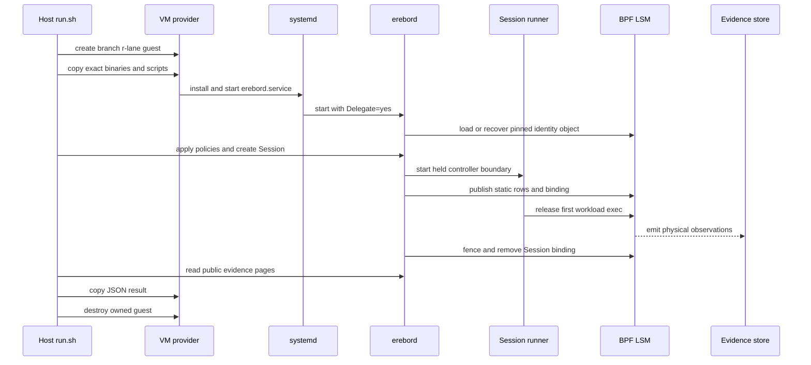
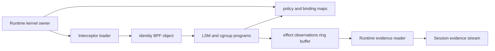

# Runtime Interceptor VM Proof Review Guide

This guide covers the isolated Runtime Interceptor virtual machine (VM) lane.
The lane uses public Runtime commands and the installed systemd service. It
does not add a product API or a test-only daemon protocol.

Physical status: **Not run**.

The source branch is `codex/erebor-runtime-interceptor`. Before a physical
run, use the source commit and dirty-state fields in the result record as the
qualification identity. Do not infer the tested source from this document's
Git revision.

## Review Route

Read these owners in order:

1. [`codex_v1_fixture.rs`](../../crates/erebor-runtime-e2e/src/bin/codex_v1_fixture.rs)
   writes the deterministic Agent trust fixture, three static-probe packages,
   and seven Runtime policy packages.
2. [`codex_v1_fixture.rs` tests](../../crates/erebor-runtime-e2e/tests/codex_v1_fixture.rs)
   check the generated package names, rule counts, and decisions.
3. [`runtime-file-probe.S`](../../crates/mithril-e2e/harness/vm/runtime-file-probe.S)
   and [`runtime-file-probe.ld`](../../crates/mithril-e2e/harness/vm/runtime-file-probe.ld)
   make each file denial operation explicit. The linker creates one
   execute-only load segment.
4. [`identity.sh`](../../crates/mithril-e2e/harness/vm/identity.sh) assigns the
   `r` lane to a bounded branch-scoped VM name.
5. [`run.sh`](../../crates/mithril-e2e/harness/vm/run.sh) builds and stages the
   exact Runtime binaries. It also creates, reads, and destroys the guest
   through the existing provider.
6. [`daemon-systemd-control-plane.sh`](../../.github/scripts/daemon-systemd-control-plane.sh)
   installs the normal service users and checks the installed daemon control
   plane. One opt-in environment value selects the Runtime probe.
7. [`runtime-interceptor.sh`](../../crates/mithril-e2e/harness/vm/runtime-interceptor.sh)
   configures the guest, runs the cases, reads public evidence, and writes the
   result record.
8. [`linux.rs`](../../crates/erebor-runtime-session/src/runners/linux.rs) and
   [`cgroup.rs`](../../crates/erebor-runtime-session/src/controller_support/linux/cgroup.rs)
   create the delegated systemd scope and the empty child workload cgroup.
9. [`session_manager.rs`](../../crates/erebor-runtime-session/src/session_manager.rs),
   [`app_server.rs`](../../crates/erebor-runtime-session/src/agents/codex/app_server.rs),
   and [`linux_controller.rs`](../../crates/erebor-runtime-session/src/linux_controller.rs)
   own structured input, output validation, terminal reaping, and bounded
   controller failure convergence.
10. [`policy.rs`](../../crates/erebor-runtime-daemon/src/runtime_interception/policy.rs)
   compiles the five portable policy classes into one static policy image.
11. [`host.rs`](../../crates/erebor-runtime-daemon/src/runtime_interception/host.rs)
   owns kernel activation, durable binding records, cleanup, and recovery.
12. [`evidence.rs`](../../crates/erebor-runtime-daemon/src/runtime_interception/evidence.rs)
    routes effect observations and the final coverage record to the session.
13. [`identity_exec.bpf.h`](../../bpf/erebor-interceptor/programs/identity_exec.bpf.h),
    [`identity_effects.bpf.h`](../../bpf/erebor-interceptor/programs/identity_effects.bpf.h),
    and [`identity_ipc.bpf.h`](../../bpf/erebor-interceptor/programs/identity_ipc.bpf.h)
    contain the kernel hooks used by the exec, file, and socket cases.

## Owner Boundaries

| Owner | State | Create and destroy rules | Proof input and output |
| --- | --- | --- | --- |
| VM runner | Provider record, staged files, host result | `run.sh` creates one `r`-lane guest. Its exit trap asks the provider to destroy that guest unless `--keep-vm` is set. | Input is the current branch and built artifacts. Output is one JSON result or one `.partial` file. |
| Installed service probe | Service users, group, socket, and daemon config | The reused control-plane script creates the accounts and removes them in its exit trap. systemd owns the service process. | Input is the opt-in probe environment. Output is a successful guest command or diagnostics on standard error. |
| Guest Runtime probe | Agent fixture, policies, sessions, case files, and facts | The script installs fixed-path binaries, creates fixture state, and removes its temporary targets. VM destruction is the outer cleanup boundary. | Input is the staged directory, bpffs pin root, and result path. Output is the physical-proof JSON record. |
| Static file probe | Three syscall sequences and three success markers | The fixture creates three root-curated Agent packages for one staged binary. The guest creates and removes each target. | Input is the package-owned mode and target. Output is one explicit file operation or a success marker. |
| Session runner | Controller scope and child workload cgroup | The Linux runner creates a held empty cgroup. The controller removes the workload cgroup after it terminates all members. | Input is the public Session request. Output is a held boundary and then an active Session. |
| App Server transport | Structured-input lease, request ledger, validated output projection, and monitor | The daemon registers one ledger before launch. One monitor validates durable stdout and reaps the Session. Cleanup removes the ledger and lease. | Input is bounded JSON-RPC JSONL. Output is a validated frame projection and one terminal Session result. |
| Runtime kernel owner | Static image rows, kernel binding, pins, durable binding record, and evidence reader | The daemon starts this owner. Activation publishes one binding. Session cleanup tombstones the durable record and removes session rows. Restart recovery fences old bindings. | Input is the held boundary and resolved PolicySet. Output is a physical decision and durable evidence. |
| Kernel programs | Task state, binding state, policy rows, and effect observations | The Interceptor loader attaches and pins the programs. The production identity object retains pins across daemon exit for recovery. | Input is a kernel hook and pinned map state. Output is allow or negative errno, plus a bounded observation. |

The daemon and the kernel owner are product owners. The VM scripts only drive
their public configuration and command paths. The scripts do not write kernel
maps directly.

## Control And Runtime Flow



The service unit in
[`erebord.service`](../../packaging/systemd/erebord.service) sets
`Delegate=yes`. Each Session controller runs in its own delegated scope. The
controller creates `erebor-workload` below that scope before it reports the
held boundary. The Runtime kernel owner verifies that the controller and
workload cgroup inode identifiers are nonzero and different. It publishes the
binding before the runner releases the first exec.

The static image compiler evaluates these portable classes in a fixed order:

| Class | Runtime event | Representative kernel operation in the VM record |
| --- | --- | --- |
| `process_exec` | `terminal/process_exec` | `Execute` (`1`) |
| `file_open` | `filesystem/file_open` | `OpenRead` (`2`) without a read syscall |
| `file_read` | `filesystem/file_read` | `Read` (`4`) |
| `file_mutation` | `filesystem/file_mutation` | `OpenWrite` (`3`) |
| `socket_connect` | `network/network_request` | `Connect` (`12`) |

The guest reads the durable binding record and requires the exact 40
operation-family rows. It also checks the relevant decisions for each case. A
policy with `command_contains` cannot produce a static image. The
dynamic-reject case checks that the Session fails, no binding record appears,
no scope stays active, and no workload process starts.

## Fixture Policies

| Package | Static result |
| --- | --- |
| `runtime-allow-all` | Allow all five portable classes. |
| `runtime-deny-exec` | Deny `process_exec`. Allow the other four classes. |
| `runtime-deny-file-open` | Deny `file_open`. Allow the other four classes. |
| `runtime-deny-file-read` | Deny `file_read`. Allow the other four classes. |
| `runtime-deny-file-mutation` | Deny `file_mutation`. Allow the other four classes. |
| `runtime-deny-socket-connect` | Deny `socket_connect`. Allow the other four classes. |
| `runtime-dynamic-reject` | Place a reachable `command_contains` rule before the exact exec allow rule. Static image compilation rejects this package. |

The fixture generator writes normal PolicyPackage directories. The guest
applies each directory with `erebor policy package apply`. It creates each
PolicySet with `erebor policyset create`. No package enters daemon-private
storage through a test hook.

## Physical Oracles

The guest writes the final result only when all checks pass.

| Oracle | Physical or durable check |
| --- | --- |
| Delegated containment | The installed service reports `Delegate=yes`. The configured pin root contains `maps` and `links`. |
| Cgroup separation | The durable workload and controller identifiers differ and match the live cgroup inode identifiers. |
| No first exec | The deny-exec Session has no live workload and no remaining workload cgroup. Its evidence has a denied `Execute` observation. |
| Allow exec | The allow Session succeeds and reaches its file and socket postconditions. Evidence records `Execute` with physical result `0`. This result means `UnknownAfterPreEffect`; the Session result and postconditions prove completion. |
| Allow file read and mutation | The fixture writes and reads one target. The target contents match. Evidence records read-family and mutation-family operations with physical result `0`. The result means `UnknownAfterPreEffect`; the target postcondition proves completion. |
| Deny file open | The static probe cannot complete `openat` with `O_RDONLY|O_CLOEXEC`. The probe does not issue a read syscall. The Session fails before it writes its success marker. The target stays unchanged. Evidence has a denied `OpenRead` (`2`) operation and no `OpenPath` (`39`) operation. |
| Deny file read | The static probe cannot read one byte from its inherited pseudo-terminal. The Session fails before the probe opens its target or writes its success marker. The target stays unchanged. Evidence has a denied `Read` (`4`) operation and no `OpenRead` (`2`) operation. |
| Deny file mutation | The static probe cannot open the sentinel target with `O_WRONLY|O_CLOEXEC`. The Session fails before it writes a replacement byte or its success marker. The sentinel stays unchanged. Evidence has a denied `OpenWrite` (`3`) operation and no denied `Write` (`5`) or `MmapWrite` (`8`) fallback. |
| Allow and deny socket connect | The allow command completes its connection and writes its marker. Its `Connect` observation has physical result `0`, which means `UnknownAfterPreEffect`. The deny case receives a failed connect and a denied `Connect` observation. |
| Pipe transport | The App Server exchanges bounded JSON-RPC JSONL frames through its normal pipe transport. Prompt ingress is durable before delivery. Response IDs match one owned request. A write timeout or invalid output terminates and reaps the Session. This is not exact pipe policy proof. |
| PTY transport | The detached TTY Session reports readiness and kernel terminal size, accepts `exit`, and reaches complete evidence coverage. This is not exact PTY policy proof. |
| Stop and kill descendants | A Session contains the fixture, shell, and `sleep` descendant. Public stop and kill commands remove the cgroup and all recorded PIDs. |
| Activation cancellation | Dynamic static-image rejection leaves no binding, active scope, or workload process. |
| Restart fence and no adoption | The daemon restarts during a live descendant case. Recovery removes the old cgroup and PIDs, tombstones the binding, and marks coverage as recovery-incomplete. No old workload becomes a new Session. |
| Evidence coverage | Every normal binding is tombstoned with complete non-recovery coverage. Route processed and persisted counts match. Parse and write failures are zero. |

The evidence reader uses `erebor audit evidence-trace`. The guest requests at
most 256 records per page. It advances the public durable cursor until a page
contains fewer than 256 records. It accepts at most 64 pages per Session. The
result parser reads only JSON payloads from those public records.

## BPF Relationship And Maps

The harness does not install a test-only BPF object or write a BPF map. The
Runtime kernel owner uses the shared identity object and the normal
Interceptor loader. The qualified object includes the operation-scoped
default-decision path used by Runtime.



| Map | Runtime use | Writer | Lifetime |
| --- | --- | --- | --- |
| `identity_config` | Enables identity and effect policy for one boot ID and label epoch. It also records the daemon controller cgroup and first-effect errno. | Runtime kernel owner | One zero-key row for the host lifetime. Recovery reopens and validates it. |
| `mount_global_mutation_epoch`, `mount_global_clean_epoch`, `mount_global_pending_mutations`, `mount_global_ambiguous_epoch` | Establish the required global mount-state rows. Runtime does not publish path graphs or exact-object rules for its operation-scoped image. | Runtime initializes the zero-key rows. Mount programs update the rows when topology changes. | Host-global and pinned. |
| `profile_generation_descriptors` | Publishes one `Preparing`, `ReadBack`, then `Active` descriptor for the Session generation. | Runtime kernel owner | Retires only after all generation references are zero. |
| `active_profile_generations` | Binds the derived Runtime profile ID to its active generation. | Runtime kernel owner | One Session row from activation through retirement. |
| `profile_generation_task_refs`, `profile_generation_socket_refs`, `profile_generation_async_refs` | Prevent retirement while a task, socket, or asynchronous request still refers to the generation. | Runtime creates zero rows. BPF programs change the reference counts. | One row in each map per Session generation. Runtime removes zero rows during retirement. |
| `effect_defaults` | Stores exactly 40 `(effect_family, operation)` decisions. Keys use operation scope, the initial role, the conservative process-state vector, and active binding lifecycle. | Runtime kernel owner | Forty Session rows from generation preparation through retirement. |
| `binding_activation_targets` | Proves the complete binding value that may become active for the derived binding and generation IDs. | Runtime kernel owner | One Session row from activation through retirement. |
| `controller_signal_authorities` | Allows the Session controller, daemon owner, and a durable recovery controller to terminate only the matching binding. | Runtime kernel owner | Session-scoped rows. Recovery can add its controller row before it terminates the cgroup. |
| `execution_set_bindings` | Binds the verified empty workload cgroup ID to the Runtime profile, generation, role, and lifecycle. | Runtime publishes and retires the row. BPF consumes the initial-root state and tombstones the row on cgroup release. | The row becomes `Active` only after exact readback and the final empty-cgroup check. Runtime deletes it last. |
| `effect_observations` | Carries fixed-size `effect_observation_v1` records to the Runtime evidence reader. | BPF effect gates | Pinned ring buffer. Consumption is not durable until the Runtime evidence stream append completes. |
| `effect_observation_health` | Counts attempted, requested, emitted, lost, suppressed, unresolved, and classifier-miss observations. | BPF effect gates | Pinned per-CPU zero-key rows. Runtime reads activation and final snapshots. |

Runtime publishes a Session in this order:

1. Verify the owner identity and the empty held cgroup by open directory file
   descriptor and inode.
2. Write the initial durable `Preparing` record. Register the evidence route,
   read its userspace and kernel baselines, then rewrite `Preparing` with
   those baselines before map publication.
3. Publish the descriptor, three zero reference rows, and 40 operation rows.
   Move the descriptor through `ReadBack` to `Active` with exact readback at
   each mutation.
4. Publish the active-profile pointer, activation target, signal authorities,
   and a `Preparing` execution binding.
5. Verify that the held cgroup is still empty. Publish and read back the
   `Active` binding, then write the durable `Active` record.
6. Release the controller. Its first workload child enters the bound cgroup
   with `clone3(CLONE_INTO_CGROUP)`.

Cleanup first commits durable `Terminating` intent. It then verifies the owned
rows, fences the execution binding, terminates and empties the cgroup, waits
for all three reference rows to reach zero, and tombstones and deletes owned
rows. After a reader barrier, it appends final coverage and commits the durable
`Tombstoned` record. A daemon restart registers all durable evidence routes
before it starts the reader. It then fences and reclaims each old binding.
Recovery coverage is always incomplete because a crash can lose process-local
routing state.

The loader pins maps and links under the configured bpffs root. A pin keeps the
kernel object alive after `erebord` exits. The production identity object does
not remove these pins in its local drop path. Restart recovery reopens the
pins, validates the program and map identities, and fences durable bindings.
The disposable VM is the outer pin cleanup owner for this lane.

The exec proof uses `lsm/bprm_check_security`. File proof uses the LSM file,
permission, and path mutation hooks. Socket proof uses `lsm/socket_connect` for
Internet sockets. These gates read the current task identity, binding,
generation, and default decision. An unresolved protected identity fails
closed. An allow decision returns the prior hook result. A deny decision
returns the configured negative errno. The common gate writes an observation
to the ring buffer and updates the health counters.

The userspace evidence reader decodes `EffectObservationV1` with
`FromBytes::read_from_bytes`. The function requires the exact ABI size. The
record uses integer fields for enum-like values, so this decode does not prove
that each integer is a known enum discriminator. The evidence adapter writes
the raw ABI bytes and normalized numeric fields to the required Session
evidence stream.

## Qualification Boundary

This lane qualifies only Runtime-owned Linux launches with delegated systemd
containment and explicit Runtime Interceptor configuration. Direct
containment, an unsupported host, a second loader, and an owner-identity
change reject before an intercepted workload starts.

The admitted policy subset is exact and static. Rules can use the known
surface, action, and risk level. Every mandatory package must cover each of
the five portable classes. A reachable `target_contains`,
`payload_contains`, or `command_contains` matcher rejects admission.
`require_approval` and `mediate` also reject because a synchronous kernel
decision cannot implement those flows.

The proof does not qualify an existing-process adoption path, hostname or
scheme policy, arbitrary terminal-child substitution, or managed-browser
launch replacement. Restart recovery proves that an old workload is fenced
and does not become a new Session. It does not claim adoption support. The
managed-browser row in the removed-code replacement map still needs an
admitted launch-route and endpoint contract; a kernel deny cannot create and
return a governed CDP endpoint.

The certified App Server path admits only `terminate` daemon-failure mode.
Recovery cannot reconstruct its in-flight request ledger, so a recovered
registration is marked invalid and the normal recovery owner terminates and
reaps the workload. Input and output frames are newline-delimited JSON-RPC.
The daemon permits at most 128 in-flight requests. It releases a request
identifier after its terminal response. A cancellation keeps the original
request owner until that response arrives, so it cannot bind a reused
identifier. Server-initiated requests are unsupported. Notifications and
correlated responses remain supported.

Evidence is honest but not lossless. A ring-buffer reservation failure can
occur after the physical decision. Normal coverage is complete only when the
reader barrier, route counters, and kernel health deltas stay consistent.
Recovery coverage is incomplete by design.

## Run And Result Contract

After VM provisioning is approved, run:

```bash
crates/mithril-e2e/harness/vm/run.sh --runtime-interceptor \
  --output-directory /tmp/erebor-runtime-interceptor-evidence
```

The output directory must be empty. Success produces
`runtime-interceptor-physical-proof.json`. The record contains platform facts,
artifact hashes, policy names, cgroup identities, Session identifiers, and a
boolean result for each oracle. The host validates the JSON before it renames
the `.partial` file.

Do not treat an absent record as a partial pass. Do not reuse this record for a
different artifact, kernel, or retained host. Review the artifact hashes and
all oracle values before you qualify the result.

## Current Verification

Status: **Not run** for the VM lane.

The source state has local Rust, fixture, syntax, and harness checks. The
focused App Server suite, Session lifecycle suite, Linux runner tests, daemon
Session API tests, CLI Session tests, and warnings-as-errors Clippy pass. The
Unix peer-credential broker test passes outside the restricted sandbox. The VM
harness behavior test and shell syntax checks pass. No guest exists from this
work. No physical oracle has a result. These checks do not qualify a guest,
kernel, staged artifact set, or restart recovery path.
