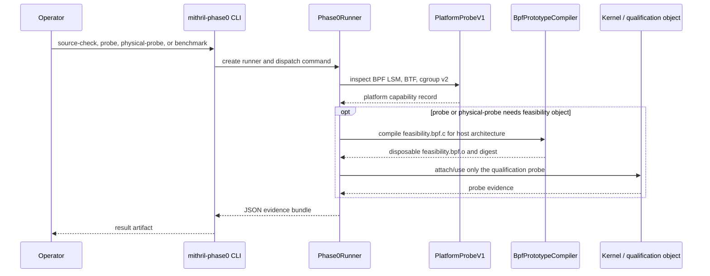
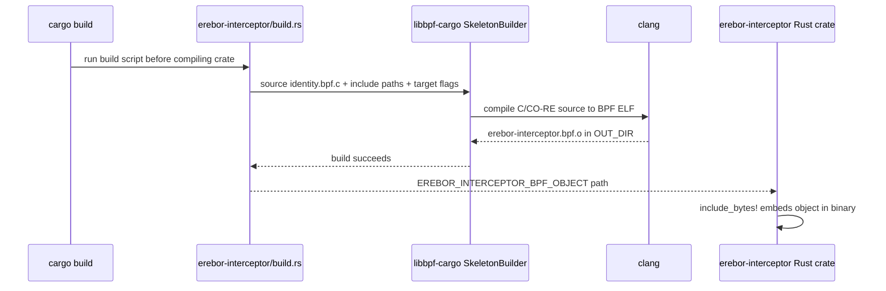
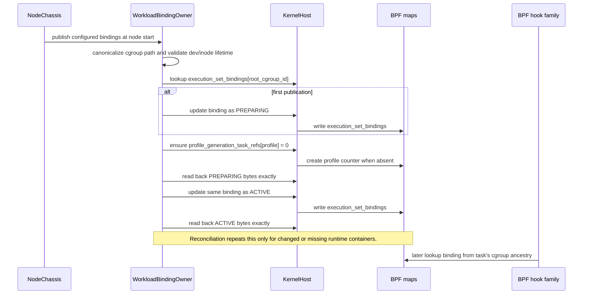

# Mithril Phase 0–3 Implementation Review Guide

Status: review/reference material for the current implementation through the
Phase 3 compiler, Meta path/mount, exact-file observation, and honest
simulation implementation. The production object/native-task privileged probe
and the complete self-cleaning privileged Phase 3 effect probe passed on
2026-08-10. The latter covers exact open, hard-link and bind aliases, concurrent
protected mount denial, hostile external mount replacement and reconciliation,
ring saturation, network hard safety, latency, and cleanup. Real Docker/CRI
acceptance remains unrecorded.
This is not a new implementation plan and does not widen the phase result.

Companion documents:

- [Master plan](./README.md)
- [Phase 0 result](./phase-0-substrate-license-abi-and-incident-baseline.md)
- [Phase 1 result](./phase-1-one-binary-node-chassis.md)
- [Phase 2 result](./phase-2-exact-native-identity.md)
- [Phase 3 result](./phase-3-effect-observation-and-profile-simulation.md)
- [Readable architecture](./policy-and-protection-algorithm-architecture-readable.md)

This guide answers six implementation-reading questions in source order:

1. Which implemented phase owns each concern?
2. What loads the BPF object, when, and who owns the links, pins, and maps?
3. Which component writes each map, and which BPF path reads it?
4. Exactly what does the `lsm/task_alloc` program do before a new task can run?
5. How does a signed Phase 3 candidate reach inactive BPF map rows?
6. Which effects are really classified and observed, and which remain hard-safe
   unsupported?

The detailed walk-through deliberately covers the transitive helper closure of
`erebor_task_alloc`: the helpers it calls, and the helpers needed by either
its native-child or external-root branch. Exec-only and effect-only helpers
are listed as separate hook families, but are not presented as if they run
from `task_alloc`.

## Start with these code paths

Read these in order. Each row names the owner, what that owner means in the
running node, and the first code location to open. The links are intentionally
to constructors or entry points, not to an arbitrary helper in the middle of a
file.

| Reading order | Owner / meaning | Start here | Follow next |
| --- | --- | --- | --- |
| 1 | `mithril-node` executable: parses the node config and owns process lifetime. | [`main.rs::run`](../../../crates/mithril-node/src/main.rs#L22-L30) | `NodeChassis::start` |
| 2 | `NodeChassis`: assembles the one node. It coordinates owners; it does not itself implement BPF map semantics. | [`NodeChassis::start`](../../../crates/mithril-node/src/node.rs#L52-L195) | `KernelHostOwner::start`, binding publication, candidate installation, then identity/observation activation |
| 3 | `KernelHostOwner`: the sole production BPF object/link/pin/lease owner. It loads one object for the node, not one object per container. | [`KernelHostOwner::start`](../../../crates/erebor-interceptor/src/host.rs#L289-L490) | BPF build path and loaded-object methods |
| 4 | `WorkloadBindingOwner`: turns one configured or discovered container cgroup into an active `execution_set_bindings` map record. | [`WorkloadBindingOwner::publish_all`](../../../crates/mithril-node/src/identity/binding.rs#L106-L265) | `KernelHost::update_map` and BPF `binding_for_cgroup` |
| 5 | `NativeSecurityStateOwner`: enables the identity runtime config and reconciles live tasks after maps/bindings exist. | [`NativeSecurityStateOwner::activate`](../../../crates/mithril-node/src/identity/native.rs#L36-L85) | BPF task iterator and health aggregation |
| 6 | BPF translation unit: combines ABI, maps, helpers, lifecycle, exec, effect, and exit hook families into one object. | [`identity.bpf.c`](../../../bpf/erebor-interceptor/programs/identity.bpf.c#L3-L27) | `identity_maps.h`, then `identity_lifecycle.bpf.h` |
| 7 | Exact Rust/C identity contract: every map value and task record uses these `repr(C)` types. | [`TaskLabelV1` and adjacent models](../../../crates/erebor-interceptor-abi/src/abi/identity.rs#L286-L390) | The generated C ABI header and map declarations |
| 8 | `PolicyCompiler` and `PolicyArtifactOwner`: parse the restricted source shape, lower finite cells, sign/verify the candidate, and simulate it in userspace. | [`PolicyCompiler::compile`](../../../crates/mithril-control/src/policy/compiler.rs#L66-L86) and [`PolicyArtifactOwner`](../../../crates/mithril-control/src/policy/artifact.rs#L15-L98) | Candidate artifact and anti-rollback store |
| 9 | `NodePolicyGenerationOwner`: verifies candidates, derives node-local handles, and stages decisions, exact objects, the component graph, and mount-view snapshot rows under a `READ_BACK` descriptor. | [`NodePolicyGenerationOwner::load_and_install`](../../../crates/mithril-node/src/policy.rs#L22-L100) | `LoweredGeneration::install`, mount reconciliation, and candidate maps |
| 10 | Phase 3 effect gate: validates current identity, reconstructs the bounded canonical path for file effects, resolves the exact object, simulates one decision, fixes the physical result, then emits best-effort evidence. | [`identity_effect_gate`](../../../bpf/erebor-interceptor/programs/identity_effects.bpf.h#L162-L410) | `identity_path.bpf.h`, then explicit LSM wrappers |
| 11 | Observation reader and store: libbpf-rs drains the one ring into a bounded in-process history exposed by the read-only Runtime socket. | [`KernelHost::effect_observation_reader`](../../../crates/erebor-interceptor/src/host.rs#L889-L914) and [`EffectObservationStore`](../../../crates/mithril-node/src/observation.rs#L15-L106) | `NodeChassis::run` and `RuntimeObservationServer` |
| 12 | `EffectTestRunner`: assertion-bearing privileged oracle for the complete Phase 3 host path; it owns only disposable test state and uses the production loader, binding, and policy owners. | [`EffectTestRunner::physical_probe`](../../../crates/mithril-e2e/src/effect.rs) | [`effect/child.rs`](../../../crates/mithril-e2e/src/effect/child.rs) and [`effect/support.rs`](../../../crates/mithril-e2e/src/effect/support.rs) |

The shortest route to understand a new-task birth is therefore:

```text
mithril-node main
  -> NodeChassis::start
  -> KernelHostOwner::start
  -> WorkloadBindingOwner::publish_all
  -> NativeSecurityStateOwner::activate
  -> identity.bpf.c
  -> identity_maps.h
  -> identity_lifecycle.bpf.h: erebor_task_alloc
```

For the Phase 3 slice, continue from node startup as follows:

```text
signed candidate artifact
  -> NodePolicyGenerationOwner::load_and_install
  -> profile_generation_descriptors + decision/default/object rows
  -> NativeSecurityStateOwner::activate_with_effect_observation
  -> identity_effect_gate
  -> effect_observations ring
  -> libbpf-rs RingBufferBuilder
  -> EffectObservationStore
  -> RuntimeObservationServer snapshot
```

## 1. Phase 0–3 implementation map

| Phase | What was introduced | Start reading | Boundary of this phase |
| --- | --- | --- | --- |
| 0 | `mithril-e2e` qualification, source/ABI closure, hostile fixtures, and the disposable feasibility object | [`capability.rs`](../../../crates/mithril-e2e/src/capability.rs#L13-L137) and the [Phase 0 result](./phase-0-substrate-license-abi-and-incident-baseline.md) | The feasibility object is a test artifact, not the production identity object. |
| 1 | `erebor-interceptor` load/link/map/pin owner; one `mithril-node`; one `mithril-control`; mTLS control stream; read-only Runtime observation | [`NodeChassis`](../../../crates/mithril-node/src/node.rs#L39-L195) and [`KernelHostOwner`](../../../crates/erebor-interceptor/src/host.rs#L235-L490) | Control does not decide a syscall and Runtime is not a second BPF owner. |
| 2 | Production identity object, native task/process/exec state, runtime cgroup binding, replay foundations, and restart/reuse state | [`identity.bpf.c`](../../../bpf/erebor-interceptor/programs/identity.bpf.c#L3-L27), then [`identity_lifecycle.bpf.h`](../../../bpf/erebor-interceptor/programs/identity_lifecycle.bpf.h#L6-L78) | Phase 2 itself did not activate an effect policy; Phase 3 owns the later observe-candidate tables, and local effect prevention is still unsupported. |
| 3 | Closed source-policy/compiler, signed inactive candidates, bounded Meta component graph and mount-view CAS, exact-file observe decisions, explicit hard-safety/non-prevention simulation, one ring reader, and bounded Runtime snapshots | [`mithril-control::policy`](../../../crates/mithril-control/src/policy/mod.rs), [`NodePolicyGenerationOwner`](../../../crates/mithril-node/src/policy.rs#L22-L116), [`identity_path.bpf.h`](../../../bpf/erebor-interceptor/programs/identity_path.bpf.h), and [`identity_effects.bpf.h`](../../../bpf/erebor-interceptor/programs/identity_effects.bpf.h) | No active policy-denial switch exists. File and mount-view state are code-backed; unqualified socket/channel/device/VMA/provenance families return explicit hard safety. Privileged verifier/runtime evidence is still pending. |

### Phase 0 qualification sequence

This occurs only when an operator runs `mithril-phase0`; it is not node
startup and it does not load the production identity object.



The production object contains effect hooks. Without a verified candidate they
serve only as the Phase 2 identity/exec-safety gate. With a Phase 3 candidate,
the exact-file path first validates a clean mount snapshot and runs the bounded
canonical component graph, then simulates signed decisions and emits
observation records. Simulated policy denial remains an allow; broken
identity/generation/object state and unsupported protected objects remain hard
denials. `mithril-node` still advertises `LOCAL_EFFECT_PREVENTION` as
unsupported in [`node.rs`](../../../crates/mithril-node/src/node.rs#L125-L145).

## 2. Ownership: one durable writer per concern

| Concern | Sole durable owner now | What it owns | First code location | What it does not own |
| --- | --- | --- | --- | --- |
| Rust/C layout | `erebor-interceptor-abi` | `repr(C)` identity types, closed enums, generated C header | [`identity.rs`](../../../crates/erebor-interceptor-abi/src/abi/identity.rs#L286-L474) | Kernel loading, policy compilation, or a runtime daemon |
| Production C-to-BPF build | `erebor-interceptor` build script through `libbpf-cargo` | Compiles `identity.bpf.c`, checks CO-RE headers, and embeds object bytes | [`build_bpf`](../../../crates/erebor-interceptor/build.rs#L15-L72), then [`BUNDLED_BPF_OBJECT`](../../../crates/erebor-interceptor/src/bundled.rs#L1-L8) | Runtime compilation or container-specific objects |
| Object, links, pins, and map file descriptors | `KernelHostOwner` / `KernelHost` | Preflight, object load, attach, map/link pinning, manifest/readback, recovery, lease | [`KernelHostOwner::start`](../../../crates/erebor-interceptor/src/host.rs#L289-L490) | Meaning of a Mithril identity record |
| Node process lifetime | `NodeChassis` in `mithril-node` | Starts the host, bindings, candidate installation, identity/observation activation, control connection, observation server, shutdown | [`NodeChassis::start`](../../../crates/mithril-node/src/node.rs#L52-L195), then [`run`](../../../crates/mithril-node/src/node.rs#L203-L318) | A second loader process |
| Cgroup-to-workload identity | `WorkloadBindingOwner` | Validates cgroup lifetime and publishes `execution_set_bindings` | [`publish_all`](../../../crates/mithril-node/src/identity/binding.rs#L106-L265) | Task labels or policy effect decisions |
| Task/process identity | BPF program family plus `NativeSecurityStateOwner` activation | Allocates and checks BPF-native state; boot/epoch configuration; reconciliation health | [`activate`](../../../crates/mithril-node/src/identity/native.rs#L36-L85), then [`erebor_task_alloc`](../../../bpf/erebor-interceptor/programs/identity_lifecycle.bpf.h#L6-L78) | Container/runtime metadata discovery |
| Source policy and signed candidate | `PolicyCompiler` plus `PolicyArtifactOwner` in `mithril-control` | Restricted parse/validation, deterministic finite-cell lowering, userspace simulation, Ed25519 artifact creation and verification | [`compiler.rs`](../../../crates/mithril-control/src/policy/compiler.rs#L64-L86) and [`artifact.rs`](../../../crates/mithril-control/src/policy/artifact.rs#L15-L98) | Node-local BPF handles, map installation, or activation |
| Node-local candidate generation | `NodePolicyGenerationOwner` | Candidate verification/anti-rollback, deterministic handle lowering, inactive exact-file decision/default/object rows, descriptor readback | [`policy.rs`](../../../crates/mithril-node/src/policy.rs#L22-L374) | Source-policy authorship, active-generation CAS, or physical deny enablement |
| Local effect decision and telemetry production | BPF `identity_effect_gate` | Task-first safety validation, current decision lookup, fixed physical result, ring submission, per-CPU loss/unresolved counters | [`identity_effects.bpf.h`](../../../bpf/erebor-interceptor/programs/identity_effects.bpf.h#L19-L389) | Policy parsing, candidate installation, durable evidence, or unsupported-object classification |
| Effect ring consumption and recent history | `EffectObservationReader` plus `EffectObservationStore` | One libbpf-rs ring manager, ABI decode, bounded 1,024-record in-process history, decoder/loss health aggregation | [`host.rs`](../../../crates/erebor-interceptor/src/host.rs#L889-L914) and [`observation.rs`](../../../crates/mithril-node/src/observation.rs#L15-L106) | A second loader, unbounded/durable audit history, or policy decisions |
| Control trust persistence | `TrustCache` | Monotonic, replay-safe Control trust generation cache | [`trust.rs`](../../../crates/mithril-node/src/trust.rs#L20-L154) | BPF map or policy activation |
| Control service | `mithril-control` | mTLS node registration, nonce/sequence checking, trust delivery/readiness acceptance | [`mithril-control::main`](../../../crates/mithril-control/src/main.rs#L14-L50) | Local BPF programs and maps |
| Runtime observation | `RuntimeObservationServer` | One read-only Unix socket, a static capability/manifest snapshot, scoped recent effect copies, and health lookup | [`RuntimeObservationServer`](../../../crates/mithril-node/src/local.rs#L21-L163) | Policy, role assignment, map writes, or durable evidence; its present peer-PID/cgroup check has the limitation recorded in Section 15 |
| Qualification and test evidence | `mithril-e2e` | Phase 0 compiler/probes, fixture/closure validation, native identity probe, and the self-cleaning Phase 3 effect runner | [`PlatformProbeV1` / `BpfPrototypeCompiler`](../../../crates/mithril-e2e/src/capability.rs#L13-L137) and [`EffectTestRunner`](../../../crates/mithril-e2e/src/effect.rs) | A second production loader or a container-specific BPF object |

The central rule is visible in the master plan: `erebor-interceptor` is a
component family embedded by `mithril-node`, not another daemon. The same node
process owns the only lease for the pin root. A Runtime client can read a
scoped observation but cannot load programs or assign roles.

The ABI uses the Linux field's real width rather than widening every coordinate
to `u64`: namespace inodes, encoded `dev_t`, legacy mount IDs, and inode
generations are `u32`. Unique mount IDs, filesystem inode numbers, cookies,
timestamps, epochs, generations, and counters remain `u64`. The namespace
mount-view maps therefore use four-byte keys. The generated C header and Rust
layout tests are the contract; there is no second handwritten layout.

## 3. Artifact, startup, and container-binding data flow

### 3.1 Build-time artifact flow

```text
bpf/erebor-interceptor/programs/identity.bpf.c
  + checked vmlinux headers + generated erebor_interceptor_abi.h
                    |
                    | libbpf-cargo SkeletonBuilder at Cargo build time
                    v
       OUT_DIR/erebor-interceptor.bpf.o
                    |
                    | include_bytes! in erebor-interceptor
                    v
          BUNDLED_BPF_OBJECT in mithril-node binary
                    |
                    | libbpf-rs ObjectBuilder at node startup
                    v
        loaded maps + attached links + optional bpffs pins
```



[`build.rs`](../../../crates/erebor-interceptor/build.rs#L15-L72) is the only
production C-to-BPF build path. `mithril-node` never invokes clang: it asks
`KernelHostOwner` to open the bytes embedded by
[`bundled.rs`](../../../crates/erebor-interceptor/src/bundled.rs#L1-L8).

Phase 0 deliberately differs. `BpfPrototypeCompiler` compiles only
`qualification/feasibility.bpf.c` for a disposable qualification probe. That
helper remains in `mithril-e2e`; it is not used by production startup.

### 3.2 Fresh node startup

```mermaid
sequenceDiagram
    participant C as NodeConfig
    participant N as NodeChassis
    participant H as KernelHostOwner
    participant K as Kernel / bpffs
    participant B as WorkloadBindingOwner
    participant P as NodePolicyGenerationOwner
    participant I as NativeSecurityStateOwner
    participant O as Effect observation reader
    participant M as mithril-control

    C->>N: validated config
    N->>H: identity(runtime BTF, lease, pin root, boot, epoch)
    H->>K: preflight, load one object, attach hooks, pin/read back maps+links
    K-->>H: manifest with map/link IDs
    N->>B: resolve configured/CRI cgroups
    B->>K: execution_set_bindings: PREPARING -> ACTIVE
    opt signed Phase 3 candidate configured
        N->>P: verify, anti-rollback, lower candidate
        P->>K: descriptor PREPARING; rows; descriptor READ_BACK
    end
    N->>I: install identity_config; run task iterator reconciliation
    I->>K: identity_config + health readback
    opt candidate installed
        N->>O: build one libbpf-rs ring reader
        O->>K: poll effect_observations
    end
    N->>M: mTLS registration, trust ack, truthful readiness
```

The code order is intentional:

1. `NodeChassis::start` validates config and allocates the boot and label epochs.
2. It calls `KernelHostOwner::start` before publishing workload bindings.
3. It publishes each binding and verifies both the preparing and active map
   values by readback.
4. When candidates are configured, it verifies/anti-rolls them, lowers the
   current exact-file slice, writes candidate rows, and marks their descriptor
   `READ_BACK` only after row readback.
5. It enables the identity runtime config, enables effect observation only
   when a candidate was installed, and runs the task iterator to check existing
   tasks.
6. It builds one libbpf-rs ring reader and the optional read-only Runtime
   server, then registers and connects to Control.

See [`node.rs`](../../../crates/mithril-node/src/node.rs#L51-L195),
[`host.rs`](../../../crates/erebor-interceptor/src/host.rs#L289-L490), and
[`binding.rs`](../../../crates/mithril-node/src/identity/binding.rs#L106-L265).

The first start loads the object and attaches each persistent hook once. It
pins every map and persistent link under the configured pin root and verifies
their IDs. On recovery with an existing valid pin root, it reuses the pinned
maps, opens the existing links, and verifies that the configured object's
program tags match the linked programs. It does not attach one new hook set per
container. The temporary task iterator link is separately attached only while
`NativeSecurityStateOwner::activate` runs reconciliation.

The manual effect cases intentionally start their probe with identity enabled
but effect observation disabled, then restart onto the same pinned state after
the signed candidate has been installed. Recovery preserves every boot, epoch,
errno, enablement, and allocator field exactly and permits only the monotonic
`effect_observation_enabled: 0 -> 1` transition. It cannot disable observation
or change enforcement configuration. The final observation socket is the
readiness oracle before the paused probe is released.

### 3.3 Normal shutdown and restart recovery

This distinction matters: the production identity object deliberately keeps
its bpffs pins so a restart can recover the same maps and persistent links. The
disposable qualification object removes its own pins on shutdown.

```mermaid
sequenceDiagram
    participant N as NodeChassis
    participant H as KernelHost
    participant K as Kernel / bpffs
    participant R as restarted NodeChassis

    N->>H: shutdown after signal
    alt production identity object
        H->>K: close process-held link handles; retain pinned maps and links
        Note over K: Pinned links/maps remain for validated recovery.
        R->>H: start with same pin root and lease
        H->>K: open pins, verify map/link IDs and program tags
        K-->>H: recovered host using existing object state
    else disposable qualification object
        H->>K: remove its map/link pins and pin directories
        H->>K: close links
    end
```

The code is [`NodeChassis::run`](../../../crates/mithril-node/src/node.rs#L140-L239)
calling [`KernelHost::shutdown`](../../../crates/erebor-interceptor/src/host.rs#L943-L992).
The `remove_pins_on_shutdown` flag is true only for the qualification object;
identity recovery is the `KernelHostOwner::recover` path entered from
[`KernelHostOwner::start`](../../../crates/erebor-interceptor/src/host.rs#L289-L320).

### 3.4 Container binding and map publication

```text
configured binding or CRI ListContainers snapshot
  -> canonical live cgroup path + opened cgroup handle + dev/inode check
  -> root cgroup ID (the map key)
  -> execution_set_bindings[root_cgroup_id] = PREPARING
  -> read back exact bytes
  -> ensure profile_generation_task_refs[profile_generation] exists
  -> execution_set_bindings[root_cgroup_id] = ACTIVE
  -> read back exact bytes

task_alloc / cgroup_attach_task / effect hook
  -> obtain live task cgroup from task->cgroups->dfl_cgrp
  -> bounded parent walk, at most 64 cgroups
  -> execution_set_bindings[kernel cgroup / kernfs ID]
  -> live binding + binding nonce must match the task label
```



`WorkloadBindingOwner`, not the loader, performs the per-container map update.
For CRI bindings it takes a full `ListContainers` snapshot on the configured
interval. A new observed matching container is published; a missing/stopped
one is transitioned to `Terminating`; an error terminates all bindings rather
than retaining authority. This is current recovery-oriented polling, not a
CRI-event state machine. See
[`binding.rs`](../../../crates/mithril-node/src/identity/binding.rs#L299-L355)
and [`node.rs`](../../../crates/mithril-node/src/node.rs#L203-L318).

The BPF program mutates a binding only for its own lifecycle:

- the first root atomically changes `initial_root_state: AVAILABLE -> CONSUMED`
  and increments `transition_version`;
- `cgroup_release` sets `lifecycle_state` to `TOMBSTONED`, forces
  `initial_root_state` to `CONSUMED`, and increments `transition_version`.

It never creates, activates, rebinds, or deletes a workload binding. Those
remain `WorkloadBindingOwner` operations on the same cgroup-authority record.

## 4. BPF map ownership and update matrix

The production object has 35 maps, declared together in
[`identity_maps.h`](../../../bpf/erebor-interceptor/programs/identity_maps.h).
`KernelHost` is the sole userspace mechanism that can mutate a loaded map, but
the domain owners below decide *which* records it writes. `KernelStateReader`
and `NativeIdentityInspector` are read-only consumers of pinned maps.

| Map (type, capacity) | Userspace writer | BPF writer | Main reader / purpose |
| --- | --- | --- | --- |
| `identity_config` (array, 1) | `NativeSecurityStateOwner` installs/revalidates the boot/epoch config | `allocate_id` atomically advances `next_id` | Every identity hook reads `enabled`, boot/epoch, allocator, and deny errno. |
| `identity_health` (per-CPU array, 1 per CPU) | none after map creation | All identity hook families increment health counters | `NativeSecurityStateOwner` aggregates each CPU's counters. |
| `identity_scratch` (per-CPU array, 1 per CPU) | none | Current BPF invocation fills temporary records directly | Staging only. No later hook treats it as durable state. |
| `task_labels` (task storage) | none | `publish_task` creates/copies labels; rollback explicitly deletes them | All hot paths start with this immutable task identity. The kernel releases normal-exit task storage with its task; the inspector reads it through a pidfd key while it exists. |
| `task_coordinates` (hash, 65,536) | none | Birth creates; wake/exec finalizes; exit/reconciliation marks state | Maps a task cookie to reusable Linux coordinates and lifecycle state. |
| `kernel_real_parent_intervals` (hash, 131,072) | none | Birth writes; effects refresh; exit closes interval | Immutable creator edge is separate from changing Linux parent identity. |
| `created_by_edges` (hash, 65,536) | none | Native-child birth writes; rollback removes | Records the creator that actually requested child creation. |
| `process_states` (hash, 32,768) | none | Root/native birth writes; exec/exit transition fields | Sole mutable current process authority state. |
| `process_state_vectors` (hash, 32,768) | none | Root/native birth writes; exec/exit transition fields | Current finite process-state vector for a process record. |
| `profile_generation_task_refs` (hash, 4,096) | `WorkloadBindingOwner` creates the zero counter during binding publication | Birth increments; exit decrements | Retains an installed profile generation while labeled tasks use it. |
| `entry_states` (hash, 32,768) | none | Root birth creates; child/exit/exec adjust references/state | One independent root's admission and task lifetime. |
| `authority_domains` (hash, 32,768) | none | Root birth creates; native birth/exit adjust process refs | Restriction state shared only by a native family. |
| `execution_set_bindings` (hash, 4,096) | `WorkloadBindingOwner`: preparing, active, terminating | First-root CAS consumes initial-root availability; cgroup release tombstones | Bounded live cgroup-to-execution-set placement authority. |
| `external_root_classifications` (hash, 65,536) | none | Root birth creates; qualified admin exec may refine it | Conservative class/role for an independent protected root. |
| `pending_execs` (hash, 32,768) | none | Exec hooks create, advance, and delete | One bounded exec transaction per task. |
| `image_provenance` (hash, 65,536) | none | Root and exec paths create records | Exact mount/device/inode-generation executable candidates. |
| `process_execution_instances` (hash, 65,536) | none | Root/native birth and exec create; exit completes | Execution instance, distinct from process lineage. |
| `approved_exec_slots` (hash, 1,024) | `AuthorizationProofOwner` installs, expires, or retires exact one-use slots | Exec path atomically consumes/marks a matching slot | Phase-2 identity foundation for the later Phase-4 administrative flow. |
| `pending_administrative_matches` (hash, 32,768) | none | Exec tracepoints create/delete a short-lived exact argv match | Bridges exact syscall argv matching to the BPRM transaction. |
| `task_reference_tombstones` (hash, 65,536) | none | Birth creates; exit atomically records exactly-once releases | Prevents double-decrement and turns cleanup loss into reconciliation work. |
| `profile_generation_descriptors` (hash, 4,096) | `NodePolicyGenerationOwner` writes `PREPARING`, then `READ_BACK` after row readback | none | Effect gate admits only the current boot/epoch/profile descriptor in `READ_BACK`; there is no active-generation pointer yet. |
| `effect_decisions` (hash, 65,536) | `NodePolicyGenerationOwner` writes exact-object cells | none | Effect gate reads the full exact key first. |
| `effect_defaults` (hash, 65,536) | `NodePolicyGenerationOwner` writes finite expanded class defaults | none | Effect gate falls back here only after exact-object lookup misses. |
| `exact_file_objects` (hash, 65,536) | `NodePolicyGenerationOwner` writes configured identities | Effect gate may insert a bounded dynamic exact object after canonical path resolution | Maps mount namespace, unique mount ID, device, inode, and inode generation to signed object/class handles. Dynamic IDs use the reserved high-bit namespace. |
| `mount_security_views` (hash, 4,096) | `NodePolicyGenerationOwner` installs one initial state keyed by mount-namespace inode | A covered mutation by any task already in that represented namespace marks DIRTY and advances pending/version; syscall exit publishes completion by decrementing pending last; the path gate commits one exact proposal | Namespace-global clean/dirty/topology/snapshot authority. It is not keyed through the mutating task's cgroup, so a privileged host task cannot bypass invalidation after joining the namespace. |
| `mount_security_view_locks` (hash, 4,096) | `NodePolicyGenerationOwner` installs one zeroed lock row per represented mount namespace | Only LSM mount/file paths take the value's BPF spin lock; tracing programs cannot reference this map | Serializes the namespace-global LSM-side epoch/CAS transaction. Exit-side counters use BPF atomics because Linux rejects spin-lock maps from tracing program types. |
| `mount_reconciliation_proposals` (hash, 4,096) | `NodePolicyGenerationOwner` writes one complete read-back proposal per mount namespace | The path gate validates and commits the exact proposal under the namespace-view lock | Userspace-to-BPF half of the `(epoch, pending=0, DIRTY) -> CLEAN` CAS. Reconciliation first proves the configured exact mount/device/inode/generation is unchanged. |
| `mount_mutation_epochs` (hash, 4,096) | `NodePolicyGenerationOwner` installs the initial namespace epoch | Covered mount hooks increment it before the topology mutation can take effect | Defeats stale userspace proposals when another task or external namespace entrant races reconciliation. |
| `canonical_mount_roots` (hash, 65,536) | `NodePolicyGenerationOwner` installs and reconciles snapshot-derived roots | none | Maps a verified mount-root identity to the lowest-unique-ID canonical mount and the precomputed graph-prefix state. |
| `path_graph_exact_transitions` (hash, 65,536) | `NodePolicyGenerationOwner` installs compiler output | none | Exact component transition for the deterministic bounded path graph. |
| `path_graph_wildcard_transitions` (hash, 4,096) | `NodePolicyGenerationOwner` installs compiler output | none | Explicit wildcard fallback when the exact transition is absent. |
| `path_graph_terminals` (hash, 4,096) | `NodePolicyGenerationOwner` installs compiler output | none | Final signed composite/rule handle after all canonical components are consumed. |
| `mount_mutation_attempts` (task storage) | none | Mount hooks create; syscall-exit/task-exit completion clears | Retains only the active mount-namespace identity needed to pair entry with syscall exit. Epoch/version authority stays in the namespace maps rather than being copied into task storage. |
| `effect_observations` (ring buffer, 4 MiB) | none | Effect gate reserves/copies/submits after the result is fixed | The one libbpf-rs reader drains best-effort effect records; ring pressure cannot change the result. |
| `effect_observation_health` (per-CPU array, 1 per CPU) | none after map creation | Effect gate increments attempted/emitted/lost/unresolved counters | Runtime snapshots aggregate all CPU values and disclose whether the health lookup was available. |

Two details are easy to miss during review:

- `identity_scratch` is per CPU, not per task. It is deliberately a temporary
  work area. A CPU/task switch does not invalidate a durable identity because
  the program publishes durable state into task storage or hash maps before it
  returns. No later hook reads an old scratch value as task state.
- A map pointer returned by `bpf_map_lookup_elem` is a pointer to kernel-owned
  map value memory. The program can alter fields in that value directly, but
  it cannot retain that pointer after the invocation. BPF verifier rules enforce
  that lifetime.

The mount topology and the policy path graph are not copied into task storage.
Topology state is shared per mount-namespace inode. Canonical root rows add the
profile generation, binding, topology generation, filesystem device, and root
inode; graph transitions are shared per profile generation. `TaskLabelV1`
retains task identity and its birth generation, while the authoritative process
state and live cgroup binding supply the active generation and binding used by
the effect gate.

KubeArmor's checked `HASH_OF_MAPS` maps select per-container rule or visibility
maps through PID/mount namespace keys. Mithril currently uses the architecture's
equivalent flat indirection: immutable rows include the profile-generation key,
the descriptor reaches `READ_BACK` only after exact row readback, and a binding
selects one generation. This avoids an inner-map create, pin, publish, retire,
and garbage-collection lifecycle for the current static Phase 3 activation.
Map-of-maps remains a valid later representation if live generation replacement
needs a whole-inner-map swap or isolated per-tenant capacity; it is not needed
to represent namespace-global mount mutation state.

## 5. Data models used by task allocation

These are the actual shared Rust/C `repr(C)` models. Their field order and
size are checked in Rust and asserted in the C translation unit; C receives
the generated snake_case view in `erebor_interceptor_abi.h`.

| Model | Key fields used at task allocation | Meaning in this implementation |
| --- | --- | --- |
| `IdentityRuntimeConfigV1` | `node_boot_id`, `label_epoch`, `next_id`, `first_effect_errno`, `enabled` | One record controlling the current node/epoch and opaque-ID allocator. |
| `ExecutionSetBindingStateV1` | binding ID/nonce, execution set, active profile handle, root cgroup ID/lifetime, roles, lifecycle, initial-root state | The one cgroup placement authority. The nonce stops a reused cgroup path/ID from matching an old label. |
| `TaskLabelV1` | task cookie; process lineage/instance/state; entry; birth execution/domain; placement expectation | Immutable task birth identity. It does **not** select current role directly. |
| `TaskCoordinateV1` | task cookie, process IDs, TID/TGID, PID namespace, start/finalization time, state | Allocated before PID data exists; later finalized at `wake_up_new_task`. |
| `CreatedByEdgeV1` | child/creator task cookies and process lineages, clone attempt, clone flags | Immutable proof of which task called clone, independent of Linux's later `PPid`. |
| `KernelRealParentIntervalV1` | optional Mithril parent cookie, current Linux parent coordinates, start/end, reason | A changing observation. The cookie is present only when it is already proven from a trusted task; exact kernel coordinates are the fallback. It never replaces `CreatedByEdgeV1` as inheritance authority. |
| `ProcessSecurityStateV1` | process/entry IDs, current execution/role/profile/domain, guard, thread refs, state | Sole mutable current authority owner for one process. Task allocation validates the parent before copying/deriving a child. |
| `ProcessStateVectorV1` | compiled vector ID, bits, profile handle, state | Current bounded state-vector record associated with a process state. |
| `EntrySecurityStateV1` | entry ID, root task/process, committed execution, task refs, admission/lifetime state | Lifetime owner for one independent root. Threads and native children add task refs. |
| `AuthorityDomainStateV1` | domain ID, process refs, restriction/response handles, state | Native-family state. Independent runtime roots do not join this domain. |
| `ImageProvenanceV1` / `ProcessExecutionInstanceV1` | exact executable candidate; execution ID/lineage/image/lifetime | Root birth snapshots the already running executable; fork creates a new execution pointing to the inherited image. |
| `TaskReferenceTombstoneV1` | acquired/released bits and entry/process/profile references | Records exactly-once release ownership before a task becomes runnable. |
| `identity_scratch_v1` (C-only staging aggregate) | one instance of all above birth records plus temporary argv/image fields | Per-CPU construction area. It is intentionally not an authority record. |

For complete fields, see [`identity.rs`](../../../crates/erebor-interceptor-abi/src/abi/identity.rs#L297-L474)
and [`identity.rs`](../../../crates/erebor-interceptor-abi/src/abi/identity.rs#L636-L743).
The readable architecture's intent is the same: label first, then current
process state, then entry/binding/domain; never choose current authority from
the label's `birth_*` fields.

## 6. `lsm/task_alloc`: contract before reading the source

Source: [`identity_lifecycle.bpf.h`](../../../bpf/erebor-interceptor/programs/identity_lifecycle.bpf.h#L6-L78).

`task_alloc` is an LSM hook run while Linux is allocating a task. The typed
`BPF_PROG` function receives:

| Parameter | Meaning |
| --- | --- |
| `task` | The new child task being allocated. It is not yet a runnable user task. |
| `clone_flags` | Standard Linux clone flags. This program uses `CLONE_THREAD` to decide thread versus new process, and records `CLONE_PARENT` as parent-change evidence. |
| `ret` | Result already returned by an earlier BPF LSM program in the chain. Nonzero means another LSM has denied/errored; Mithril must preserve it. |

At this point PID/TGID/start-time/pidfd coordinates are not complete. The hook
therefore allocates opaque IDs and fixed map/task-storage state only. The
`fentry/wake_up_new_task` hook later fills the coordinate fields and makes the
coordinate `Runnable`. If finalization fails, later effect hooks deny instead
of treating the task as completely identified.

The branch decision is deliberately only kernel identity and cgroup placement:

```text
creator has a valid Mithril task label
  -> native child: inherit the creator's native authority safely

creator has no label, child cgroup has an active binding
  -> independent external/initial container root: create a conservative root

creator has no label, child has no protected binding
  -> outside Mithril scope: return 0 and leave host policy to other LSMs

any cgroup lookup failure, stale label/binding, missing parent identity,
capacity failure, or partial publication
  -> return configured deny errno; never create a runnable protected child
```

### Task-birth runtime sequence

This is the exact time ordering around `task_alloc`: it runs before the new
task is runnable; `wake_up_new_task` fills the Linux PID coordinates only after
the birth records have been published.

```mermaid
sequenceDiagram
    participant L as Linux task allocator
    participant A as lsm/task_alloc
    participant M as BPF maps / task storage
    participant W as fentry/wake_up_new_task
    participant E as Later effect hooks

    L->>A: new child task, clone flags, earlier LSM result
    A->>A: return earlier nonzero LSM result unchanged
    A->>M: read identity_config + this CPU's scratch
    A->>M: read creator label and child cgroup binding
    alt labeled creator and active matching binding
        A->>M: create native-child records and publish task label
    else unlabeled creator outside protection, child in active binding
        A->>M: create external/initial-root records and publish task label
    else child outside protected bindings
        A-->>L: return 0, no Mithril state
    else any ambiguous or partial state
        A-->>L: return deny errno
    end
    A-->>L: allow only after successful publication
    L->>W: make accepted task runnable
    W->>M: fill TID/TGID/namespace/start time; mark coordinate Runnable
    E->>M: later verify label, binding, process state, coordinate, and exec state
```

## 7. BPF language and helper vocabulary

| Syntax/API | Exact role here |
| --- | --- |
| `SEC("...")` | Places the function in an ELF section that libbpf uses to select its BPF program type and attach point. `lsm/task_alloc` becomes a BPF LSM program. |
| `BPF_PROG(name, ...)` | libbpf typed-program macro. It supplies the BPF trampoline-compatible function shape while the body uses the declared typed arguments. |
| `bpf_get_current_task_btf()` | Returns a BTF-typed pointer to the current task, the creator in `task_alloc`. |
| `bpf_task_storage_get(map, task, 0, flags)` | Looks up task-local storage. Its task argument must retain the verifier's trusted/BTF pointer type. This program therefore uses only a typed hook task or `bpf_get_current_task_btf()` result, never a pointer copied out by `BPF_CORE_READ_INTO`. With `BPF_LOCAL_STORAGE_GET_F_CREATE`, it creates storage for the specified new task; without it, it only reads. |
| `bpf_task_storage_delete` | Removes a task's local label during rollback. |
| `bpf_map_lookup_elem` | Looks up a map value. A non-null pointer is valid only during this BPF invocation. |
| `bpf_map_update_elem(..., BPF_NOEXIST)` | Inserts only if no entry already exists. A collision is treated as failure, never overwriting another task's identity. |
| `bpf_map_delete_elem` | Removes a previously inserted rollback record. |
| `BPF_CORE_READ_INTO` | CO-RE read: compiler records field access relocations and libbpf adjusts them to the running kernel BTF layout. A read failure is an identity failure. |
| `bpf_core_field_exists` | Tests whether a BTF field exists, allowing a defined old/new kernel layout fallback. |
| `bpf_ktime_get_ns()` | Monotonic boot-time clock used for intervals and execution times. |
| `__sync_val_compare_and_swap` | Atomic compare-and-swap. Used for allocator, first-root consumption, and transition guards. |
| `__sync_fetch_and_add/sub/or` | Atomic increment/decrement/bit-set for references and tombstone ownership. |
| `#pragma unroll` | Forces a compile-time-bounded loop expansion, giving the verifier a finite maximum. |
| `#pragma clang loop unroll(disable)` | Retains the explicitly bounded 64-step cgroup walk rather than expanding it into 64 copies. |
| `container_of` | Converts a pointer to an embedded member back to the enclosing C structure. It is used only after a successful CO-RE read of the embedded member. |
| `-EACCES` | Standard Linux permission-denied negative errno. `identity_deny` uses it when the configured first-effect errno is outside the verifier-safe negative errno range. |

## 8. Line-by-line: `erebor_task_alloc`

Every nonblank source line, including a brace or the second physical line of a
wrapped expression, has its own row below. A blank line carries no execution
meaning. Line links point to that exact physical source line.

| Source line | What that exact physical line does |
| --- | --- |
| [6](../../../bpf/erebor-interceptor/programs/identity_lifecycle.bpf.h#L6) | Places the following function in the `lsm/task_alloc` ELF section, so libbpf attaches it as a BPF LSM program. |
| [7](../../../bpf/erebor-interceptor/programs/identity_lifecycle.bpf.h#L7) | Starts the typed `BPF_PROG` declaration, names the program `erebor_task_alloc`, and declares `task` as Linux’s newly allocated child task. |
| [8](../../../bpf/erebor-interceptor/programs/identity_lifecycle.bpf.h#L8) | Finishes the signature: `clone_flags` contains standard Linux clone bits and `ret` is the prior BPF-LSM result. |
| [9](../../../bpf/erebor-interceptor/programs/identity_lifecycle.bpf.h#L9) | Opens the function body and starts this invocation’s stack scope. |
| [10](../../../bpf/erebor-interceptor/programs/identity_lifecycle.bpf.h#L10) | Declares `config`, later pointing at `identity_config[0]`. |
| [11](../../../bpf/erebor-interceptor/programs/identity_lifecycle.bpf.h#L11) | Declares `health`, later pointing at this CPU’s health counters. |
| [12](../../../bpf/erebor-interceptor/programs/identity_lifecycle.bpf.h#L12) | Declares `scratch`, later pointing at this CPU’s temporary construction area. |
| [13](../../../bpf/erebor-interceptor/programs/identity_lifecycle.bpf.h#L13) | Declares `creator`, the current task that asked Linux to allocate `task`. |
| [14](../../../bpf/erebor-interceptor/programs/identity_lifecycle.bpf.h#L14) | Declares and null-initializes the child’s cgroup pointer, so failed lookup cannot leave a usable pointer. |
| [15](../../../bpf/erebor-interceptor/programs/identity_lifecycle.bpf.h#L15) | Declares and null-initializes the creator’s cgroup pointer. |
| [16](../../../bpf/erebor-interceptor/programs/identity_lifecycle.bpf.h#L16) | Declares `parent_label`, the creator’s optional immutable task-storage label. |
| [17](../../../bpf/erebor-interceptor/programs/identity_lifecycle.bpf.h#L17) | Declares `binding`, the execution-set binding found for the child cgroup. |
| [18](../../../bpf/erebor-interceptor/programs/identity_lifecycle.bpf.h#L18) | Declares `creator_binding`, the binding found for the creator cgroup only in the unlabeled branch. |
| [19](../../../bpf/erebor-interceptor/programs/identity_lifecycle.bpf.h#L19) | Declares the child cgroup ancestry-walk result: zero is complete; nonzero is an unreadable or over-depth walk. |
| [20](../../../bpf/erebor-interceptor/programs/identity_lifecycle.bpf.h#L20) | Declares the equivalent ancestry-walk result for the creator. |
| [21](../../../bpf/erebor-interceptor/programs/identity_lifecycle.bpf.h#L21) | Declares `result`, which receives native-child or external-root construction outcome. |
| [23](../../../bpf/erebor-interceptor/programs/identity_lifecycle.bpf.h#L23) | Tests whether a preceding BPF LSM already made a nonzero decision. |
| [24](../../../bpf/erebor-interceptor/programs/identity_lifecycle.bpf.h#L24) | Propagates that earlier result unchanged; Mithril never replaces another LSM’s deny/error. |
| [25](../../../bpf/erebor-interceptor/programs/identity_lifecycle.bpf.h#L25) | Looks up the sole runtime configuration record at array key zero. |
| [26](../../../bpf/erebor-interceptor/programs/identity_lifecycle.bpf.h#L26) | Tests whether config lookup failed or the loaded identity runtime is disabled. |
| [27](../../../bpf/erebor-interceptor/programs/identity_lifecycle.bpf.h#L27) | Contributes no LSM decision while identity is not enabled. |
| [28](../../../bpf/erebor-interceptor/programs/identity_lifecycle.bpf.h#L28) | Looks up this CPU’s health counter record; absence is tolerated because it is diagnostic state. |
| [29](../../../bpf/erebor-interceptor/programs/identity_lifecycle.bpf.h#L29) | Looks up this CPU’s scratch record; absence is not tolerated because construction would be unsafe. |
| [30](../../../bpf/erebor-interceptor/programs/identity_lifecycle.bpf.h#L30) | Tests whether the required per-CPU scratch record is unavailable. |
| [31](../../../bpf/erebor-interceptor/programs/identity_lifecycle.bpf.h#L31) | Returns the configured deny errno, or `-EACCES` fallback, because a protected child cannot be constructed correctly. |
| [32](../../../bpf/erebor-interceptor/programs/identity_lifecycle.bpf.h#L32) | Gets the BTF-typed current kernel task. At `task_alloc`, it is the creator, not `task`. |
| [33](../../../bpf/erebor-interceptor/programs/identity_lifecycle.bpf.h#L33) | Reads the creator’s task storage without creating one. Null selects the independent-root path. |
| [34](../../../bpf/erebor-interceptor/programs/identity_lifecycle.bpf.h#L34) | Reads the child’s effective default cgroup from kernel task state, including `CLONE_INTO_CGROUP` placement. |
| [35](../../../bpf/erebor-interceptor/programs/identity_lifecycle.bpf.h#L35) | Starts the failure branch for unreadable child cgroup placement. |
| [36](../../../bpf/erebor-interceptor/programs/identity_lifecycle.bpf.h#L36) | Increments `placement_mismatches` only when diagnostic health storage exists. |
| [37](../../../bpf/erebor-interceptor/programs/identity_lifecycle.bpf.h#L37) | Denies because it cannot prove whether the child belongs to protected scope. |
| [38](../../../bpf/erebor-interceptor/programs/identity_lifecycle.bpf.h#L38) | Closes the child-cgroup failure branch. |
| [39](../../../bpf/erebor-interceptor/programs/identity_lifecycle.bpf.h#L39) | Walks the child cgroup and up to 63 ancestors to find `execution_set_bindings`; stores completeness in `binding_lookup`. |
| [40](../../../bpf/erebor-interceptor/programs/identity_lifecycle.bpf.h#L40) | Starts the failure branch for an incomplete or failed child binding lookup. |
| [41](../../../bpf/erebor-interceptor/programs/identity_lifecycle.bpf.h#L41) | Tests whether health storage exists before writing diagnostics. |
| [42](../../../bpf/erebor-interceptor/programs/identity_lifecycle.bpf.h#L42) | Counts the ambiguous placement. |
| [43](../../../bpf/erebor-interceptor/programs/identity_lifecycle.bpf.h#L43) | Denies rather than interpreting an incomplete ancestry walk as outside protection. |
| [44](../../../bpf/erebor-interceptor/programs/identity_lifecycle.bpf.h#L44) | Closes the child-binding lookup failure branch. |
| [45](../../../bpf/erebor-interceptor/programs/identity_lifecycle.bpf.h#L45) | Starts the native-child branch only when the actual creator has a Mithril task label. |
| [46](../../../bpf/erebor-interceptor/programs/identity_lifecycle.bpf.h#L46) | Tests that the parent label belongs to this boot/epoch and that the child cgroup resolved to some binding. |
| [47](../../../bpf/erebor-interceptor/programs/identity_lifecycle.bpf.h#L47) | Tests whether health storage exists before recording a native-placement mismatch. |
| [48](../../../bpf/erebor-interceptor/programs/identity_lifecycle.bpf.h#L48) | Increments the mismatch counter for stale label or missing child binding. |
| [49](../../../bpf/erebor-interceptor/programs/identity_lifecycle.bpf.h#L49) | Denies this ambiguous native-child allocation. |
| [50](../../../bpf/erebor-interceptor/programs/identity_lifecycle.bpf.h#L50) | Closes the native-child precondition failure branch. |
| [51](../../../bpf/erebor-interceptor/programs/identity_lifecycle.bpf.h#L51) | Starts the `create_native_child` call with the child, standard clone flags, runtime config, and immutable parent label. |
| [52](../../../bpf/erebor-interceptor/programs/identity_lifecycle.bpf.h#L52) | Supplies the validated binding and scratch record, then stores the constructor result in `result`. |
| [53](../../../bpf/erebor-interceptor/programs/identity_lifecycle.bpf.h#L53) | Starts the alternative branch for an unlabeled creator. |
| [54](../../../bpf/erebor-interceptor/programs/identity_lifecycle.bpf.h#L54) | Reads the creator’s cgroup so the program can distinguish an outside helper from a protected task missing identity. |
| [55](../../../bpf/erebor-interceptor/programs/identity_lifecycle.bpf.h#L55) | Tests whether health storage exists in the creator-cgroup failure branch. |
| [56](../../../bpf/erebor-interceptor/programs/identity_lifecycle.bpf.h#L56) | Records an ambiguous placement because the creator cgroup was unreadable. |
| [57](../../../bpf/erebor-interceptor/programs/identity_lifecycle.bpf.h#L57) | Denies because an unlabeled creator cannot safely be classified without cgroup placement. |
| [58](../../../bpf/erebor-interceptor/programs/identity_lifecycle.bpf.h#L58) | Closes the creator-cgroup failure branch. |
| [59](../../../bpf/erebor-interceptor/programs/identity_lifecycle.bpf.h#L59) | Starts the bounded lookup of a binding for the creator’s cgroup. |
| [60](../../../bpf/erebor-interceptor/programs/identity_lifecycle.bpf.h#L60) | Supplies the output variable for lookup completeness and completes the creator-binding lookup assignment. |
| [61](../../../bpf/erebor-interceptor/programs/identity_lifecycle.bpf.h#L61) | Starts the failure branch for an incomplete creator binding lookup. |
| [62](../../../bpf/erebor-interceptor/programs/identity_lifecycle.bpf.h#L62) | Tests whether health storage exists before accounting. |
| [63](../../../bpf/erebor-interceptor/programs/identity_lifecycle.bpf.h#L63) | Counts the creator placement mismatch. |
| [64](../../../bpf/erebor-interceptor/programs/identity_lifecycle.bpf.h#L64) | Denies because creator placement remains unknown. |
| [65](../../../bpf/erebor-interceptor/programs/identity_lifecycle.bpf.h#L65) | Closes the incomplete creator-binding branch. |
| [66](../../../bpf/erebor-interceptor/programs/identity_lifecycle.bpf.h#L66) | Tests whether an unlabeled creator is nevertheless inside a configured protected binding. |
| [67](../../../bpf/erebor-interceptor/programs/identity_lifecycle.bpf.h#L67) | Tests whether health storage exists for a missing-identity denial. |
| [68](../../../bpf/erebor-interceptor/programs/identity_lifecycle.bpf.h#L68) | Counts that protected creator as missing its required task identity. |
| [69](../../../bpf/erebor-interceptor/programs/identity_lifecycle.bpf.h#L69) | Denies rather than allowing it to create an apparently external root. |
| [70](../../../bpf/erebor-interceptor/programs/identity_lifecycle.bpf.h#L70) | Closes the protected-but-unlabeled creator branch. |
| [71](../../../bpf/erebor-interceptor/programs/identity_lifecycle.bpf.h#L71) | Tests whether the child is outside every configured protected binding. |
| [72](../../../bpf/erebor-interceptor/programs/identity_lifecycle.bpf.h#L72) | Returns success for outside scope; other LSMs or host policy remain free to decide. |
| [73](../../../bpf/erebor-interceptor/programs/identity_lifecycle.bpf.h#L73) | Constructs an external or initial root for a child inside protected scope whose creator is outside and unlabeled. |
| [74](../../../bpf/erebor-interceptor/programs/identity_lifecycle.bpf.h#L74) | Closes the unlabeled-creator branch. |
| [75](../../../bpf/erebor-interceptor/programs/identity_lifecycle.bpf.h#L75) | Tests whether the selected constructor failed and health storage is available. |
| [76](../../../bpf/erebor-interceptor/programs/identity_lifecycle.bpf.h#L76) | Increments `allocation_failures` for that construction failure. |
| [77](../../../bpf/erebor-interceptor/programs/identity_lifecycle.bpf.h#L77) | Returns constructor success or its fail-closed errno to the LSM framework. |
| [78](../../../bpf/erebor-interceptor/programs/identity_lifecycle.bpf.h#L78) | Closes `erebor_task_alloc`; no map pointer or stack pointer escapes this invocation. |

## 9. Line-by-line: helpers used before the branch

### 9.1 Config, health, and scratch lookup

| Source line(s) | What it does |
| --- | --- |
| [`identity_maps.h` 183-187](../../../bpf/erebor-interceptor/programs/identity_maps.h#L183-L187) | `identity_runtime_config` forms the fixed `u32 0` key and looks up the one array entry. It does not allocate or mutate it. |
| [189-193](../../../bpf/erebor-interceptor/programs/identity_maps.h#L189-L193) | `identity_health_record` looks up the current CPU's per-CPU health value at key zero. |
| [195-199](../../../bpf/erebor-interceptor/programs/identity_maps.h#L195-L199) | `identity_scratch_record` looks up the current CPU's scratch value at key zero. |
| [201-205](../../../bpf/erebor-interceptor/programs/identity_maps.h#L201-L205) | `id128_equal` compares both 64-bit halves. Every identity comparison in this path is exact, not string/prefix based. |
| [207-210](../../../bpf/erebor-interceptor/programs/identity_maps.h#L207-L210) | `id128_is_zero` recognizes the reserved all-zero absent value. |

### 9.2 Opaque ID allocator

| Source line(s) | What it does |
| --- | --- |
| [`identity_maps.h` 212-214](../../../bpf/erebor-interceptor/programs/identity_maps.h#L212-L214) | Declares `allocate_id(config, target)`: it creates an `Id128V1` from the current label epoch and a monotonic low counter. |
| [215](../../../bpf/erebor-interceptor/programs/identity_maps.h#L215) | Requests full unrolling of the bounded retry loop. |
| [216](../../../bpf/erebor-interceptor/programs/identity_maps.h#L216) | Makes at most eight CAS attempts, bounding contention work. |
| [217](../../../bpf/erebor-interceptor/programs/identity_maps.h#L217) | Reads the current allocator value. |
| [219-220](../../../bpf/erebor-interceptor/programs/identity_maps.h#L219-L220) | Refuses zero and all-ones values; zero is reserved and all-ones prevents wraparound. |
| [221-226](../../../bpf/erebor-interceptor/programs/identity_maps.h#L221-L226) | Atomically changes `next_id` from `value` to `value + 1`. Only the successful caller writes `target.high = label_epoch` and `target.low = value`, then returns success. |
| [227-228](../../../bpf/erebor-interceptor/programs/identity_maps.h#L227-L228) | Contention beyond eight attempts is an access-denied failure, causing task creation to deny rather than reuse an ID. |

### 9.3 Read a task's cgroup and find its binding

| Source line(s) | What it does |
| --- | --- |
| [`identity_maps.h` 231-244](../../../bpf/erebor-interceptor/programs/identity_maps.h#L231-L244) | `task_cgroup` clears the output, rejects null task, CO-RE reads `task->cgroups`, then `css_set->dfl_cgrp`. Any missing read returns `-EACCES`; success returns zero with a live cgroup pointer. |
| [246-260](../../../bpf/erebor-interceptor/programs/identity_maps.h#L246-L260) | `cgroup_id` CO-RE reads the cgroup's `kernfs_node`. It supports old kernels with `id.id` and newer layout with `id`; an unreadable/null value produces ID zero, which callers treat as failure. |
| [263-290](../../../bpf/erebor-interceptor/programs/identity_maps.h#L263-L290) | `cgroup_parent` clears its output and returns the immediate parent. On kernels exposing `cgroup.ancestors[]`, it validates `level` in the 64-step bound and reads `ancestors[level - 1]`. On older layout it reads `self.parent` then uses `container_of` to recover the parent `struct cgroup`. A root has no parent and returns success with null output. |
| [292-299](../../../bpf/erebor-interceptor/programs/identity_maps.h#L292-L299) | `binding_for_cgroup` initializes the lookup result to failure and declares current binding/parent/ID locals. |
| [300-301](../../../bpf/erebor-interceptor/programs/identity_maps.h#L300-L301) | Keeps a verifier-bounded, non-unrolled 64-step loop. |
| [302-304](../../../bpf/erebor-interceptor/programs/identity_maps.h#L302-L304) | Obtains the current cgroup's stable ID. Zero means the walk cannot be trusted, so it returns null while leaving lookup failed. |
| [305-309](../../../bpf/erebor-interceptor/programs/identity_maps.h#L305-L309) | Looks up `execution_set_bindings[id]`; on a match it sets lookup success and returns that map-value pointer. |
| [310-311](../../../bpf/erebor-interceptor/programs/identity_maps.h#L310-L311) | Asks for the parent. A parent-read failure returns null with lookup failed. |
| [312-315](../../../bpf/erebor-interceptor/programs/identity_maps.h#L312-L315) | A null parent means a complete walk reached the cgroup root with no binding: set lookup success and return null, proving outside configured scope. |
| [316](../../../bpf/erebor-interceptor/programs/identity_maps.h#L316) | Advances to the parent for the next bounded step. |
| [317-318](../../../bpf/erebor-interceptor/programs/identity_maps.h#L317-L318) | Exhausting 64 steps returns null with lookup failed. Over-depth is ambiguous, never outside. |
| [445-458](../../../bpf/erebor-interceptor/programs/identity_maps.h#L445-L458) | `identity_deny` sign-extends the configured `i32`, bounds the LSM result to `[-MAX_ERRNO, -1]` with the verifier-visible pattern used by established BPF enforcement code, and uses standard `-EACCES` for a missing or invalid value. |
| [328-333](../../../bpf/erebor-interceptor/programs/identity_maps.h#L328-L333) | `label_matches_runtime` verifies that a task label belongs to the current boot ID and label epoch. |
| [335-344](../../../bpf/erebor-interceptor/programs/identity_maps.h#L335-L344) | `binding_matches_label` requires non-null values, exact binding ID and nonce equality, and `ACTIVE` lifecycle. This rejects cgroup reuse and a moved task. |
| [346-357](../../../bpf/erebor-interceptor/programs/identity_maps.h#L346-L357) | `consume_initial_root` CASes only `AVAILABLE` to `CONSUMED`. Only the winner increments binding version and returns true; later roots remain external. |

## 10. Line-by-line: native-child construction

### 10.1 Small construction helpers

| Source line(s) | What it does |
| --- | --- |
| [`identity_maps.h` 394-397](../../../bpf/erebor-interceptor/programs/identity_maps.h#L394-L397) | `copy_ancestors` unrolls the fixed eight-entry copy. Each child starts with exactly the parent’s ancestry array. |
| [398](../../../bpf/erebor-interceptor/programs/identity_maps.h#L398) | Copies the parent’s recorded ancestry depth. |
| [399-403](../../../bpf/erebor-interceptor/programs/identity_maps.h#L399-L403) | Only a new process with remaining capacity appends the parent’s process lineage and increments depth. A thread deliberately adds no process-lineage step. |
| [410-412](../../../bpf/erebor-interceptor/programs/identity_maps.h#L410-L412) | `prepare_coordinate` writes the stable task cookie and newly selected process instance/state IDs. |
| [413-420](../../../bpf/erebor-interceptor/programs/identity_maps.h#L413-L420) | Clears unavailable Linux PID coordinates/times, starts parent-interval sequence and transition version at one, and marks the coordinate `Allocating`. `wake_up_new_task` finalizes the Linux coordinates later. |
| [421-423](../../../bpf/erebor-interceptor/programs/identity_maps.h#L421-L423) | Clears all coordinate padding deterministically. |
| [429-437](../../../bpf/erebor-interceptor/programs/identity_maps.h#L429-L437) | `prepare_tombstone` derives the birth transaction and records the task, entry, process, domain, and profile-release identities. |
| [438-443](../../../bpf/erebor-interceptor/programs/identity_maps.h#L438-L443) | Declares all three references acquired, none released, version one, no observed task free/WAL acknowledgement, and `Owned` lifecycle. It does not decrement anything. |
| [444-446](../../../bpf/erebor-interceptor/programs/identity_maps.h#L444-L446) | Clears tombstone padding. |
| [`identity_task_helpers.h` 117-125](../../../bpf/erebor-interceptor/programs/identity_task_helpers.h#L117-L125) | `read_real_parent_interval` receives an already proven optional parent cookie, then declares the parent and PID-namespace intermediates. All pointers begin null. |
| [127-129](../../../bpf/erebor-interceptor/programs/identity_task_helpers.h#L127-L129) | Requires a child task, output interval, and readable non-null `task->real_parent`; otherwise identity proof is incomplete and it returns `-EACCES`. |
| [130-143](../../../bpf/erebor-interceptor/programs/identity_task_helpers.h#L130-L143) | Stores the child and supplied optional parent cookies, then CO-RE reads parent host TID/TGID and, through `thread_pid->numbers[level].ns`, its PID-namespace inode. The CO-RE parent pointer is used only for field reads; passing it to task storage would lose the verifier-required trusted pointer type. |
| [144-149](../../../bpf/erebor-interceptor/programs/identity_task_helpers.h#L144-L149) | Uses the kernel’s `start_boottime` field when present; otherwise reads the older `start_time` layout. |
| [150-154](../../../bpf/erebor-interceptor/programs/identity_task_helpers.h#L150-L154) | Rejects the interval if any required kernel coordinate is zero; an incomplete parent observation cannot become authority. |
| [155-164](../../../bpf/erebor-interceptor/programs/identity_task_helpers.h#L155-L164) | Starts the interval at monotonic boot time, clears its end, sets version/reason/direct-kernel proof, clears reserved bytes, and returns success. |
| [166-176](../../../bpf/erebor-interceptor/programs/identity_task_helpers.h#L166-L176) | Compares the complete kernel coordinate tuple independently of the optional Mithril cookie. Coordinates, not a possibly absent correlation cookie, decide whether Linux reparented the task. |
| [178-209](../../../bpf/erebor-interceptor/programs/identity_task_helpers.h#L178-L209) | Reads the current interval, captures fresh coordinates with no invented cookie, returns when coordinates are unchanged, or closes the old interval and inserts the next sequence on a real change. |
| [222-238](../../../bpf/erebor-interceptor/programs/identity_task_helpers.h#L222-L238) | `prepare_execution` copies the supplied execution/lineage/image identities, timestamps start, clears end, stores version/origin/state, and clears padding. |
| [292-310](../../../bpf/erebor-interceptor/programs/identity_task_helpers.h#L292-L310) | `prepare_child_process` assigns the new child’s process/boot/epoch/lineage/instance/entry/execution fields while inheriting current role, vector, profile, domain, and response-set authority from the validated parent. |
| [311-325](../../../bpf/erebor-interceptor/programs/identity_task_helpers.h#L311-L325) | Clears every pending-exec/guard field, starts one live thread in `Allocating`, and clears padding. This record is not active until post-publication validation. |
| [327-341](../../../bpf/erebor-interceptor/programs/identity_task_helpers.h#L327-L341) | `prepare_process_vector` copies boot/epoch, inherited state bits/profile, uses the conservative vector ID and `Preparing` state, then clears padding. |

### 10.2 Publish a task label atomically enough for fail-closed rollback

| Source line(s) | What it does |
| --- | --- |
| [`identity_task_helpers.h` 240-247](../../../bpf/erebor-interceptor/programs/identity_task_helpers.h#L240-L247) | `publish_task` creates the initial real-parent key from the newly allocated task cookie and sequence one. |
| [249-251](../../../bpf/erebor-interceptor/programs/identity_task_helpers.h#L249-L251) | Inserts the parent interval with `BPF_NOEXIST`; collision/failure aborts before task storage is installed. |
| [252-256](../../../bpf/erebor-interceptor/programs/identity_task_helpers.h#L252-L256) | Inserts the allocating coordinate. If it fails, deletes the just-inserted parent record before returning failure. |
| [257-263](../../../bpf/erebor-interceptor/programs/identity_task_helpers.h#L257-L263) | Inserts the ownership tombstone. If that fails, deletes coordinate and parent interval. |
| [264-272](../../../bpf/erebor-interceptor/programs/identity_task_helpers.h#L264-L272) | Requests creation of the child task's `task_labels` local-storage value using the trusted `task_alloc` hook argument. A null result rolls back tombstone, coordinate, and parent interval. |
| [273-281](../../../bpf/erebor-interceptor/programs/identity_task_helpers.h#L273-L281) | Copies the completed immutable label into task storage, uses a compiler memory barrier, then verifies task cookie, process-state ID, entry ID, and binding ID before accepting publication. |
| [282-288](../../../bpf/erebor-interceptor/programs/identity_task_helpers.h#L282-L288) | Failed readback deletes task storage and all three auxiliary records, then returns denial. |
| [289](../../../bpf/erebor-interceptor/programs/identity_task_helpers.h#L289) | Only after all prior inserts and checks succeed does `publish_task` return zero. |
| [212-220](../../../bpf/erebor-interceptor/programs/identity_task_helpers.h#L212-L220) | `delete_initial_real_parent` is the rollback helper for the sequence-one parent interval. |
| [`identity_maps.h` 379-382](../../../bpf/erebor-interceptor/programs/identity_maps.h#L379-L382) | `release_transition_guard` CASes a guard from one to zero. It is idempotent for an already-cleared guard. |

### 10.3 `create_native_child`, line by line

Source: [`identity_task_helpers.h`](../../../bpf/erebor-interceptor/programs/identity_task_helpers.h#L343-L552).

| Source line(s) | What it does |
| --- | --- |
| [343-347](../../../bpf/erebor-interceptor/programs/identity_task_helpers.h#L343-L347) | Declares the constructor and its inputs: child task, clone flags, current config, validated parent label, validated child binding, and per-CPU scratch. |
| [348](../../../bpf/erebor-interceptor/programs/identity_task_helpers.h#L348) | Computes `thread` from the standard Linux `CLONE_THREAD` bit. No Mithril replacement constant is used. |
| [349-355](../../../bpf/erebor-interceptor/programs/identity_task_helpers.h#L349-L355) | Declares the new task ID and pointers to every parent authority/reference record that must exist. |
| [357-364](../../../bpf/erebor-interceptor/programs/identity_task_helpers.h#L357-L364) | Looks up parent process, parent vector, and entry using immutable IDs from the parent label; missing records deny. |
| [365-381](../../../bpf/erebor-interceptor/programs/identity_task_helpers.h#L365-L381) | Looks up the native authority domain and verifies domain/process/vector/entry active states and reference counts, vector/profile agreement, and child binding versus parent label. Any stale state or placement denies. |
| [382-384](../../../bpf/erebor-interceptor/programs/identity_task_helpers.h#L382-L384) | A new process whose ancestor vector is full denies; threads do not consume lineage capacity. |
| [385-386](../../../bpf/erebor-interceptor/programs/identity_task_helpers.h#L385-L386) | Atomically claims the parent process transition guard. Any concurrent clone/exec holder causes denial. |
| [387-390](../../../bpf/erebor-interceptor/programs/identity_task_helpers.h#L387-L390) | While holding the guard, rejects an exec in progress, an `AT_EXECVE_CHECK` marker, or a state that ceased to be active; then jumps to lock cleanup. |
| [391-395](../../../bpf/erebor-interceptor/programs/identity_task_helpers.h#L391-L395) | Looks up the parent's active execution and requires it to be active before its image may be inherited. |
| [397-400](../../../bpf/erebor-interceptor/programs/identity_task_helpers.h#L397-L400) | Starts the child label as a copy of the parent label, then snapshots the parent's active profile handle and domain into immutable birth fields. |
| [401-406](../../../bpf/erebor-interceptor/programs/identity_task_helpers.h#L401-L406) | Looks up the profile-generation reference counter and requires it to exist and be nonzero before child creation. |
| [407-409](../../../bpf/erebor-interceptor/programs/identity_task_helpers.h#L407-L409) | Allocates a new opaque ID and uses its low half as the child task cookie. |
| [410-418](../../../bpf/erebor-interceptor/programs/identity_task_helpers.h#L410-L418) | A thread shares its parent execution ID. A new process allocates distinct execution, lineage, process-instance, and process-state IDs. Any allocator failure takes the rollback path. |
| [419-422](../../../bpf/erebor-interceptor/programs/identity_task_helpers.h#L419-L422) | Copies ancestry, appending the parent lineage only for a new process, then creates the child coordinate in `Allocating` state. |
| [423-432](../../../bpf/erebor-interceptor/programs/identity_task_helpers.h#L423-L432) | Captures the Linux real-parent interval. An ordinary fork can prove `real_parent == creator`, so it supplies the already trusted creator cookie. Linux makes `CLONE_PARENT` and `CLONE_THREAD` reuse `current->real_parent`; those cases use exact coordinates with cookie zero instead of passing a probe-read pointer to task storage. `CloneParent` is recorded only for that standard flag. |
| [433-444](../../../bpf/erebor-interceptor/programs/identity_task_helpers.h#L433-L444) | Allocates a unique clone-attempt ID, fills the immutable creator edge, and prepares the tombstone that owns entry, process/thread, and profile reference releases. |
| [446-479](../../../bpf/erebor-interceptor/programs/identity_task_helpers.h#L446-L479) | New-process branch only: constructs process/vector/execution records, inserts execution then vector then process with `BPF_NOEXIST`, and removes earlier records on each later insertion failure. A thread creates none of these because it shares parent process state. |
| [480-486](../../../bpf/erebor-interceptor/programs/identity_task_helpers.h#L480-L486) | Acquires references after child records exist: every child adds an entry and profile task reference; a thread adds a parent-process thread reference, while a new process adds one domain process reference. |
| [487-493](../../../bpf/erebor-interceptor/programs/identity_task_helpers.h#L487-L493) | Inserts the immutable creator edge, then publishes parent interval, coordinate, tombstone, and task label. Failure removes the edge and rolls references back. |
| [494-523](../../../bpf/erebor-interceptor/programs/identity_task_helpers.h#L494-L523) | New-process post-publication validation reads the installed process, verifies its instance ID, then makes process and vector `Active`. If either record disappeared, it goes through publication rollback. |
| [524-525](../../../bpf/erebor-interceptor/programs/identity_task_helpers.h#L524-L525) | Releases the parent's transition guard and returns success. This is the only success exit. |
| [527-534](../../../bpf/erebor-interceptor/programs/identity_task_helpers.h#L527-L534) | `rollback_published` removes task storage, tombstone, coordinate, parent interval, and creator edge before reference rollback. |
| [536-548](../../../bpf/erebor-interceptor/programs/identity_task_helpers.h#L536-L548) | `rollback_references` reverses entry/profile counts. It reverses either thread count or domain count and deletes new-process maps. It never decrements the domain for a thread. |
| [549-551](../../../bpf/erebor-interceptor/programs/identity_task_helpers.h#L549-L551) | `fail_locked` releases the parent guard and returns configured denial. Every error route arrives here only after its own inserted state is removed. |

## 11. Line-by-line: external/initial root construction

The no-label branch is not allowed to inherit the application process. It
creates an independent root with the configured initial role only for the
single armed initial root; later independent roots use the restricted external
role.

### 11.1 Capture the existing executable for a root

| Source line(s) | What it does |
| --- | --- |
| [`identity_task_helpers.h` 9-20](../../../bpf/erebor-interceptor/programs/identity_task_helpers.h#L9-L20) | `candidate_from_file` declares kernel traversal pointers, then zeros every output identity field first. A failed traversal therefore leaves an invalid candidate, never stale scratch data. |
| [21-25](../../../bpf/erebor-interceptor/programs/identity_task_helpers.h#L21-L25) | Requires a file, inode, superblock, and VFS mount through CO-RE reads. Any null/read failure returns with the zero candidate. |
| [26](../../../bpf/erebor-interceptor/programs/identity_task_helpers.h#L26) | Uses `container_of` to recover the enclosing `struct mount` from the embedded `vfsmount`. |
| [27-37](../../../bpf/erebor-interceptor/programs/identity_task_helpers.h#L27-L37) | Reads mount namespace, a positive mount ID, namespace inode, filesystem device, inode number, and inode generation. Any missing/zero required identity returns with the zero candidate. |
| [38](../../../bpf/erebor-interceptor/programs/identity_task_helpers.h#L38) | Only after all reads validate does it publish the mount ID, making the candidate valid for its caller. |
| [45-50](../../../bpf/erebor-interceptor/programs/identity_task_helpers.h#L45-L50) | `prepare_task_image` reads `task->mm->exe_file`. A task without readable memory/executable file cannot be identified exactly, so it returns `-EACCES`. |
| [51-55](../../../bpf/erebor-interceptor/programs/identity_task_helpers.h#L51-L55) | Assigns the already allocated image ID, declares one candidate, and clears its first reserved area with an unrolled fixed loop. |
| [56-58](../../../bpf/erebor-interceptor/programs/identity_task_helpers.h#L56-L58) | Builds candidate zero from the executable and rejects it unless `mount_id` was published as valid. |
| [59-66](../../../bpf/erebor-interceptor/programs/identity_task_helpers.h#L59-L66) | Clears every field in all unused candidate slots. Scratch storage cannot leak a previous invocation’s image candidates. |
| [67-72](../../../bpf/erebor-interceptor/programs/identity_task_helpers.h#L67-L72) | Sets initial image transition version and `Active` state, clears final reserved bytes, and returns success. |

### 11.2 Construct and publish the root records

| Source line(s) | What it does |
| --- | --- |
| [`identity_root_helpers.h` 11-19](../../../bpf/erebor-interceptor/programs/identity_root_helpers.h#L11-L19) | `prepare_root_state` takes the label inside the per-CPU scratch, stamps the current boot/epoch, and allocates distinct lineage, instance, process-state, and entry IDs. Any allocation failure returns `-EACCES`. |
| [20-28](../../../bpf/erebor-interceptor/programs/identity_root_helpers.h#L20-L28) | Copies the binding execution-set/profile handle, allocates birth execution/domain/image IDs, uses the new execution low half as task cookie, and starts lineage depth at zero. |
| [29-38](../../../bpf/erebor-interceptor/programs/identity_root_helpers.h#L29-L38) | Clears label padding and every ancestor slot, then writes binding ID/nonce placement and clears descendant-policy/padding fields. |
| [40-42](../../../bpf/erebor-interceptor/programs/identity_root_helpers.h#L40-L42) | Prepares the `Allocating` task coordinate and the exactly-once reference tombstone before any map publication. |
| [44-72](../../../bpf/erebor-interceptor/programs/identity_root_helpers.h#L44-L72) | Builds the root process-state record: its own IDs, birth execution/domain, selected role, conservative vector/profile, no pending exec/guard, one live thread, `Allocating` state, and cleared padding. |
| [73-75](../../../bpf/erebor-interceptor/programs/identity_root_helpers.h#L73-L75) | Builds the companion vector in `Preparing` using the active binding profile and zero state bits. |
| [77-98](../../../bpf/erebor-interceptor/programs/identity_root_helpers.h#L77-L98) | Builds a committed, active entry rooted at this task/process. The initial root is `ContainerStart`; all other roots are `UnknownExternal`; claim/terminal/guard/padding fields are zeroed. |
| [99-117](../../../bpf/erebor-interceptor/programs/identity_root_helpers.h#L99-L117) | Builds one active authority domain with one live process, retained profile generation, zero restriction/response evidence/guards, version one, and cleared padding. |
| [119-143](../../../bpf/erebor-interceptor/programs/identity_root_helpers.h#L119-L143) | Builds the external-root classification with boot/epoch/task/process/entry/execution-set/binding-lifetime identity, no creator/admin proof, selected role/class, unknown purpose, timestamp, and no padding. It then builds the active process-birth execution record. |
| [144](../../../bpf/erebor-interceptor/programs/identity_root_helpers.h#L144) | Returns successful scratch construction; no durable map has been changed yet. |
| [152-158](../../../bpf/erebor-interceptor/programs/identity_root_helpers.h#L152-L158) | `create_root` looks up the profile task-reference counter for the binding and denies if absent. A root cannot exist without a retained profile generation. |
| [159-169](../../../bpf/erebor-interceptor/programs/identity_root_helpers.h#L159-L169) | Calls the scratch constructor, then captures real-parent coordinates with cookie zero because an external root has no trusted Mithril creator label, and captures the exact executable before changing a map. Any failure denies immediately. |
| [170-196](../../../bpf/erebor-interceptor/programs/identity_root_helpers.h#L170-L196) | Inserts image, execution, domain, entry, vector, process, and classification with `BPF_NOEXIST`, ordered by dependency. Each failure jumps to the label that deletes everything already inserted. |
| [197-203](../../../bpf/erebor-interceptor/programs/identity_root_helpers.h#L197-L203) | Acquires the profile task reference only after all root records exist. `publish_task` then installs parent/coordinate/tombstone/task storage; its failure reverses that reference and classification before common rollback. |
| [204-223](../../../bpf/erebor-interceptor/programs/identity_root_helpers.h#L204-L223) | Reads back the installed process and checks its process-instance ID. A mismatch deletes published task-local state and references, then rolls back. A match promotes process state to `Active` and bumps its version. |
| [224-242](../../../bpf/erebor-interceptor/programs/identity_root_helpers.h#L224-L242) | Looks up the installed vector. Missing vector causes the same explicit publication cleanup; a match promotes it to `Active` and bumps version. |
| [245](../../../bpf/erebor-interceptor/programs/identity_root_helpers.h#L245) | Returns success only after both process and vector are active. |
| [247-263](../../../bpf/erebor-interceptor/programs/identity_root_helpers.h#L247-L263) | Falls through reverse-order deletion—process, vector, entry, domain, execution, image—then returns configured denial. |
| [270-274](../../../bpf/erebor-interceptor/programs/identity_root_helpers.h#L270-L274) | `create_external_root` starts with an external-runtime restricted role and atomically tries to consume the one initial-root state. |
| [276-283](../../../bpf/erebor-interceptor/programs/identity_root_helpers.h#L276-L283) | A non-active binding selects unresolved/fail-closed identity. Otherwise the one CAS winner becomes `InitialContainerRoot` with the initial role; all other roots keep restricted external role. |
| [284-285](../../../bpf/erebor-interceptor/programs/identity_root_helpers.h#L284-L285) | Delegates the finalized classification to `create_root`, which performs the durable publication and rollback. |

## 12. What runs after `task_alloc`

| Hook family | Why it exists | Relationship to task allocation |
| --- | --- | --- |
| `fentry/wake_up_new_task` | Fills PID/TGID/namespace/start-time coordinate and marks it runnable | Does not allocate a second task identity. Failure changes the coordinate to `FailClosedUnknown`. |
| `tp_btf/cgroup_attach_task` | Detects moves into/out of a cgroup | Validates placement for labeled tasks; an unlabeled task entering an active binding is constructed as an independent root. |
| `raw_tracepoint/cgroup_release` | Handles cgroup lifetime end | Tombstones the binding; a reused cgroup cannot silently retain active placement. |
| `sched_process_exit` | Releases task/process/profile references exactly once | Uses the birth tombstone; cleanup loss keeps restrictions and raises reconciliation health. |
| Exec hooks | Build one staged BPRM/exec transaction and optional exact admin-slot match | They must see the task/process state installed at `task_alloc`; a concurrent exec guard prevents a child birth from crossing an exec transition. |
| Identity effect hooks | Gate covered effects on current identity, placement, current process state, and exec safety | They read the label first. Missing identity in a protected binding denies instead of falling back to cgroup-only or host policy. |
| `iter/task` | Startup/recovery reconciliation | Checks live labeled tasks against all required maps/binding/ref counts and turns inconsistency into fail-closed/reconciliation health. |

## 13. Phase 3 signed-candidate sequence

Phase 3 has two compilation stages with different owners. Control owns the
portable, signed content. The node owns platform-local numeric handles and BPF
map bytes. The BPF program never parses YAML, verifies signatures, or assigns
handles.

```mermaid
sequenceDiagram
    participant O as Operator / Control CLI
    participant C as PolicyCompiler
    participant A as PolicyArtifactOwner
    participant N as NodePolicyGenerationOwner
    participant R as AntiRollbackStore
    participant K as KernelHost / BPF maps

    O->>C: restricted source policy
    C->>C: validate closed shape; expand finite exact cells
    C-->>A: deterministic canonical bytes + compiled profile
    A->>A: sign source header and compiled-content binding
    A-->>O: immutable candidate artifact
    O->>N: node config names artifact and verification key
    N->>A: load and verify signature, validity, source/recompile binding
    N->>R: accept monotonic profile version/issuer sequence
    N->>N: derive deterministic local handles; select binding cells
    N->>K: descriptor = PREPARING
    loop every exact decision/default/object row
        N->>K: write row
        N->>K: read back exact bytes
    end
    N->>K: descriptor = READ_BACK
    N->>K: read back descriptor
```

Read the sequence in these source blocks:

| Source | Responsibility and current limit |
| --- | --- |
| [`PolicyCompiler::compile`](../../../crates/mithril-control/src/policy/compiler.rs#L66-L86) | Validates and deterministically lowers the currently implemented restricted source shape into finite cells. It is only the partial D3.1 shape listed in the Phase 3 result, not complete Appendix A.11. |
| [`PolicyArtifactOwner`](../../../crates/mithril-control/src/policy/artifact.rs#L20-L98) | Owns compile/sign, load/verify, and userspace simulation file flows. It uses existing Ed25519/serde/CBOR crates rather than a custom cryptographic or serialization stack. |
| [`AntiRollbackStore::accept`](../../../crates/mithril-control/src/policy/rollback.rs#L126-L195) | Persists issuer/profile high water and accepts identical content idempotently; an older target needs a separate exact one-use signed authorization. |
| [`NodePolicyGenerationOwner::load_and_install`](../../../crates/mithril-node/src/policy.rs#L24-L87) | Joins verified artifacts to configured bindings, derives local handles, merges rows sharing one generation handle, and invokes installation. |
| [`LoweredGeneration::for_binding`](../../../crates/mithril-node/src/policy.rs#L97-L307) | Builds exact decision/default/object bytes and a descriptor digest. Exact file identity is still operator/resolver supplied; there is no rotation-aware dynamic owner. |
| [`LoweredGeneration::install`](../../../crates/mithril-node/src/policy.rs#L329-L374) | Writes `PREPARING`, reads back each row, then writes/reads back `READ_BACK`. Partial new content cannot be used by the BPF gate, but the reinstall/recovery defect in Section 15 means this is not yet the architecture's complete immutable-generation transaction. |

There is deliberately no Phase 4 active-generation pointer or prevention
switch. `READ_BACK` means that this observe candidate passed the current row
copy check; it does **not** mean the complete architecture was probed or made
authoritative for physical denial.

## 14. Phase 3 effect-decision and observation sequence

The implemented hot path is task first, then current authority, then the
actor's clean mount view and canonical component graph, then exact object and
decision. It does not choose policy from a caller pathname or immutable birth
fields.

```mermaid
sequenceDiagram
    participant L as Linux LSM hook
    participant G as identity_effect_gate
    participant I as Identity maps
    participant M as Mount view + path graph
    participant P as Candidate maps
    participant R as effect_observations ring
    participant U as libbpf-rs reader
    participant S as bounded Runtime snapshot

    L->>G: typed hook arguments + prior LSM result
    G->>I: task label, cgroup binding, coordinate, process, entry, domain
    G->>I: execution, image, vector, profile references
    alt prior LSM result is nonzero
        G->>G: keep prior result unchanged
    else broken identity or generation
        G->>G: choose configured hard deny
    else observation disabled
        G->>L: return prior result
    else file-backed effect
        G->>M: require CLEAN view at current epoch and snapshot
        G->>M: collect bounded in-mount components
        G->>M: load oldest-mount graph prefix; exact/wildcard transitions
        G->>M: revalidate the same CLEAN snapshot
        G->>P: bind exact live object; read exact/default cell
        alt signed candidate says deny
            G->>G: return 0; classify WOULD_DENY
        else signed candidate says allow/audit-allow
            G->>G: return 0; classify exact allow/audit-allow
        end
    else unsupported or unresolved protected object
        G->>G: choose configured hard deny
    end
    G->>R: best-effort reserve/copy after result is fixed
    G->>L: return fixed result even if the ring is full
    U->>R: poll one native libbpf-rs ring manager
    U->>S: decode ABI event; retain newest 1,024
```

Mount mutations use a separate pre-effect transaction. `sb_mount`,
`sb_umount`, `sb_pivotroot`, and `move_mount` increment the view epoch and
pending count and mark it DIRTY before the common policy gate. These maps are
keyed by mount-namespace identity, not by the current task's cgroup, so the
same ordering applies when a privileged external task first joins the
represented namespace. The raw syscall
exit path keeps the view DIRTY, atomically advances its version, and decrements
the exact task-local attempt's pending count last. It cannot reference the BPF
spin-lock map because Linux rejects that map/program-type combination.
Userspace snapshots the whole represented view only at `pending=0`, first
requires the configured exact mount/device/inode/generation to remain equal,
writes and
reads back canonical root rows, and submits an exact epoch/version proposal.
The next file decision commits that proposal under the LSM-side BPF spin lock
only if no newer mutation won the race. A strict file decision cannot use a
DIRTY or unequal snapshot.

```mermaid
sequenceDiagram
    participant A as Any task in represented mount namespace
    participant H as mount LSM hook
    participant V as Mount view maps
    participant X as syscall exit
    participant N as NodePolicyGenerationOwner
    participant F as Later file hook

    A->>H: protected or external mount/move/unmount attempt
    H->>V: epoch++; pending++; state=DIRTY
    alt protected task and unsupported mount object
        H->>H: hard safety => EACCES/EPERM
        H-->>A: physical denial
    else external privileged namespace entrant
        H-->>A: prior LSM result; topology remains DIRTY
    end
    A->>X: syscall returns
    X->>V: keep DIRTY; atomic version++; atomic pending-- last
    N->>V: read epoch/pending/version
    N->>N: require unchanged exact object + stable snapshot + Meta prefixes
    N->>V: write/read back roots and exact reconciliation proposal
    F->>V: CAS exact proposal to CLEAN or remain hard unresolved
    F->>V: canonical graph + exact-object decision under the clean snapshot
```

### 14.1 Read `identity_effect_gate` in this order

| Source line(s) | Exact responsibility |
| --- | --- |
| [`identity_effects.bpf.h` 19-92](../../../bpf/erebor-interceptor/programs/identity_effects.bpf.h#L19-L92) | Obtains per-CPU health, initializes a fresh observation, fixes a caller-selected return value before best-effort ring reservation, counts loss, and preserves an earlier nonzero LSM result. |
| [94-159](../../../bpf/erebor-interceptor/programs/identity_effects.bpf.h#L94-L159) | Copies the validated actor fields and constructs the complete exact decision key; only an exact-row miss falls back to the matching finite default key. |
| [162-223](../../../bpf/erebor-interceptor/programs/identity_effects.bpf.h#L162-L223) | Loads config/scratch/current task, resolves its live cgroup binding, and distinguishes an unlabeled task outside protection from an unlabeled task in protected placement. |
| [224-283](../../../bpf/erebor-interceptor/programs/identity_effects.bpf.h#L224-L283) | Revalidates boot/epoch, binding nonce/lifecycle, coordinate, real parent, process, entry, domain, execution, image, state vector, and retained profile reference before populating the actor. |
| [284-323](../../../bpf/erebor-interceptor/programs/identity_effects.bpf.h#L284-L323) | Records binding/execution-set identity, preserves a prior LSM result, and applies the separate hard exec-transaction guard before observe policy is considered. |
| [324-342](../../../bpf/erebor-interceptor/programs/identity_effects.bpf.h#L324-L342) | Returns without policy simulation when observation is disabled; otherwise requires the exact boot/epoch/profile generation in `READ_BACK` and hard-denies a missing classifier input. |
| [343-396](../../../bpf/erebor-interceptor/programs/identity_effects.bpf.h#L343-L396) | Derives the live file tuple, requires a unique mount ID, runs `canonical_path_candidate`, creates/reads the exact live object binding, and constructs the exact/default decision key. Any dirty view, failed bound, missing graph edge, snapshot race, or unequal atom is hard unresolved. |
| [397-421](../../../bpf/erebor-interceptor/programs/identity_effects.bpf.h#L397-L421) | Converts candidate `DENY` to observe-only `WOULD_DENY` with return zero, records allow/audit-allow, and treats an unknown decision enum as corrupt generation. |
| [424-680](../../../bpf/erebor-interceptor/programs/identity_effects.bpf.h#L424-L680) | Keeps each Linux hook prototype explicit and stops a multi-operation wrapper after its first nonzero result. File-backed hooks pass a file; ioctl and remaining unqualified object families pass null and take hard-safe `UNSUPPORTED_OBJECT` for protected tasks. Mount hooks first invoke the DIRTY transaction. |

### 14.2 What is actually supported now

“A program is attached” is not the same claim as “its object and operation are
classified.” Review capability statements against this table.

| Hook/effect surface | Current behavior | Honest Phase 3 claim |
| --- | --- | --- |
| `file_open`, `file_permission`, file-backed `mmap_file`, file-backed `file_mprotect`, and exec file gate | Build the live file tuple, require a clean actor mount view, combine the userspace-resolved oldest-mount prefix with BPF-collected components, run exact/wildcard graph transitions, revalidate the snapshot, then resolve the exact/default cell. | Code-backed Meta/exact-file observation. Existing Phase 0 evidence covers x86 file-open; the new production path still needs the privileged Phase 3 verifier/runtime run. |
| `file_ioctl` | Linux supplies `cmd` and `arg`, but the current ABI has no qualified command/argument-shape axis. The wrapper deliberately passes no file object. | Explicit hard-safe unsupported, not an exact device/ioctl simulation claim. |
| Mount mutations | Covered mount hooks mark a represented mount namespace DIRTY before the common gate, including an external privileged task that joined it; task-local syscall completion and userspace proposal reconciliation implement the bounded epoch/version CAS. Reconciliation will not clean a replaced exact object. | The current protected mount object is unqualified and physically hard-denied. A pre-existing represented bind alias is canonicalized, but an ordinary signed file denial remains observe-only until Phase 4. Propagation/fan-out platforms still require privileged qualification. |
| IPC, network, ptrace, signal, other path mutation, capability, and BPF hooks | Explicit typed programs are attached, but pass no qualified object to the common gate. A protected task receives hard-safe `UNSUPPORTED_OBJECT` when observation is enabled. | Exact actor/operation plus hard-safe unsupported handling only; no classified object-policy claim. |
| `CanonicalPathGraphV1`, `ExactFileObjectResolver`, and BPF `canonical_path_candidate` | The compiler determinizes the finite component graph; the resolver snapshots the mount tree and chooses the lowest unique mount; BPF consumes the verified prefix plus live components under one clean snapshot. | D3.3 code path. No final decision cache exists, so a pre-existing hard-link alias cannot borrow a path candidate. |
| Observation ring and recent Runtime history | Best-effort ring emission with per-CPU health; one libbpf-rs poller; newest 1,024 decoded records exposed from memory. | Bounded, non-durable diagnostic observation. Not a complete negative-history or WAL claim. |

The per-CPU `identity_scratch` remains the simplest correct BPF construction
area for these records. Tetragon uses the same one-entry per-CPU heap pattern,
and libbpf-rs already supplies the ring manager. Scratch is never authority:
the current invocation copies durable state into it, completes the lookup, and
publishes an event before returning. No later invocation relies on its bytes.

## 15. Phase 3 correctness and simplicity audit

Audit snapshot: 2026-08-10. This is a review of the current code and documented
contract; it does not mark Phase 3 done and does not silently fix the findings.

### 15.1 Confirmed correctness properties

- `identity_effect_gate` reads current task/process/entry/binding/generation
  state before policy, and broken protected state remains a hard denial.
- One gate invocation preserves a prior nonzero LSM return exactly. The result
  is selected before ring reservation; ring failure only raises loss health.
- A simulatable signed policy denial returns zero and records `WOULD_DENY`;
  physical prevention is still explicitly unsupported.
- Candidate rows cannot be consumed unless the matching boot/epoch/profile
  descriptor is `READ_BACK`.
- Exact-file lookup includes mount namespace, unique mount identity, device,
  inode, and nonzero inode generation; a path string is not authority.
- The canonical path graph is installed in BPF. A file decision requires one
  clean mount snapshot before and after the bounded walk; a mount mutation
  marks the view DIRTY before policy and a stale reconciliation proposal loses
  the epoch/version CAS.
- Mount DIRTY state is namespace-global. A privileged external task that joins
  the protected namespace cannot evade invalidation by remaining outside the
  workload cgroup, and reconciliation cannot clean the view while a different
  exact mount/device/inode/generation covers the configured path.
- The raw syscall-exit tracepoint has no spin-lock helper or reference to the
  spin-lock map. Its atomic version increment precedes its pending decrement,
  so `pending=0` cannot expose a partially published completion.
- The source compiler compares complete local action-plan digests for exact
  conflicts, lowers effect-family defaults only into missing finite cells, and
  validates bounded exception/proof/response/reference shapes.
- The 50-case simulation oracle covers every Phase 4/5 fixture named by the
  Phase 3 plan plus managed, pure-memory, and outside-authority HF branches.
  Unsupported state models stay named hard safety rather than fake support.
- Userspace uses the existing Ed25519, deterministic serialization,
  libbpf-cargo, and libbpf-rs facilities. Per-CPU scratch and one ring reader
  follow the checked-in Linux BPF implementations; there is no reason to add
  Aya, bpf2go, a custom ring implementation, or a per-container program.

### 15.2 Open correctness findings

| Priority | Location | Finding | Required direction |
| --- | --- | --- | --- |
| Medium | [`RuntimeObservationServer::handle`](../../../crates/mithril-node/src/local.rs#L171-L227) | `SO_PEERCRED` supplies connection-time PID/UID, but cgroup scope is read later through `/proc/<pid>/cgroup`. PID reuse and passing an already-connected Unix socket can detach the request actor from that live `/proc` check. `PEER_CREDENTIAL_AND_CGROUP_SCOPED` is therefore stronger than the proof. | Pin/revalidate a non-reusable process identity for the request or downgrade the capability/reason to the exact UID/socket-permission guarantee. Keep Runtime read-only; it is not an enforcement boundary. |
| High | [`begin_mount_mutation`](../../../bpf/erebor-interceptor/programs/identity_path.bpf.h#L21-L77) | Direct represented mount syscalls are ordered and fail closed, but propagation, automount, network-filesystem referral, and fan-out into another namespace have not been physically qualified on this host. | Keep the affected platform capability unsupported unless the privileged `MOUNT-PROPAGATION-003` run proves every affected view becomes DIRTY before a strict file decision. |
| Medium | [`identity_effect_gate`](../../../bpf/erebor-interceptor/programs/identity_effects.bpf.h#L162-L421) | Socket/channel/device/derived-capability and complete mm/VMA/provenance state models are explicit hard-safe unsupported results, not classified observe models. Post-placement anonymous mappings, including newly allocated thread stacks, therefore deny in Phase 3; the mount-race fixture creates parked workers before placement and executes only their mount syscalls after activation. | Return each family to physical/type qualification before replacing its unsupported result. Do not add inactive placeholder maps. |

These findings do not show a fail-open protected mount or exact-file safety
path. They delimit claims: ordinary signed file denial is still observe-only,
propagation is unqualified, and unsupported object families are not silently
treated as observed allows.

### 15.3 Simplicity result

The current runtime layering is already close to the minimum useful split:

- `PolicyArtifactOwner`, `NodePolicyGenerationOwner`, `KernelHost`, the BPF
  gate, and `EffectObservationStore` each own a real trust/lifecycle boundary.
  Collapsing them would blur ownership without deleting a protocol or durable
  state model.
- The 604-line effect header is cohesive: shared gate first, explicit typed
  Linux hook wrappers second. Splitting it solely to meet a line count or
  hiding hook prototypes behind macros would make verifier/kernel review
  harder, not simpler.
- The Meta implementation uses one compiler graph, one mount-view state owner,
  and one BPF candidate function. It does not add a second path-policy engine
  or cache final decisions.
- The remaining unsupported object families should stay unsupported until
  their real state owners are implemented; empty framework maps would weaken
  reviewability without adding correctness.

Ponytail review result: no speculative abstraction is the main problem here.
The likely net code reduction is negligible; correctness comes from removing
unsupported claims and state transitions, not adding layers or performing a
cosmetic file split.

## 16. Review checklist

Use this order when reviewing a change to the implemented surfaces:

1. Does it preserve exactly one `KernelHostOwner`/pin-root lease on the node?
2. Does it keep production BPF compilation in `libbpf-cargo` and runtime
   loading in bundled `libbpf-rs`, without compiling per container?
3. Does `WorkloadBindingOwner` remain the only userspace writer for workload
   binding lifecycle and profile-counter initialization?
4. Does a map update have a defined owner, bounded capacity, readback where it
   crosses the userspace/kernel boundary, and a fail-closed result on failure?
5. Does a task label remain immutable birth identity while current authority is
   read through `ProcessSecurityStateV1` and validated placement?
6. In `task_alloc`, can any failure leave a labeled-but-partially-published or
   unlabeled protected child that reaches a protected effect? The answer must
   stay no.
7. Does a thread share process/domain state while a new process gets distinct
   process/execution IDs and one domain-process reference?
8. Does rollback reverse only references acquired on that path, exactly once?
9. Does an unsupported or incomplete physical test remain an honest
   `Unsupported`, `Blocked`, or start-gap result rather than a prevention claim?
10. Does a Phase 3 candidate remain immutable and inactive until every row and
    descriptor is read back, without downgrading an old complete generation?
11. Does every effect key include the operation-specific identity required by
    the architecture (for example ioctl command/shape), or take explicit
    hard-safe unsupported instead?
12. In a wrapper that represents multiple requested operations, does the first
    nonzero result stop later gates instead of being relabeled as another LSM's
    denial?
13. Is observation health truthful about ring loss, decoder errors, reader
    liveness, authentication scope, and the absence of durable coverage?

## 17. Verification evidence and remaining review limits

The repository CI procedure passed after the final Phase 3 Rust source and test
edits: formatting, workspace check, all-target/all-feature clippy with denied
warnings, and full workspace tests. The unprivileged production identity
verifier reports 33 programs and 35 maps.

The first privileged load exposed and rejected a spin-lock map reference from
`erebor_mount_mutation_sys_exit`, as required by the Linux tracing-program
verifier. The next load advanced to `erebor_task_alloc` and exposed the separate
zero-extension of its configured `i32` errno. The exit path now uses the
existing BPF atomic counter pattern. The deny helper uses the established
verifier-bounds pattern, explicitly sign-extends the configured errno, accepts
only `[-MAX_ERRNO, -1]`, and otherwise returns `-EACCES`. Object regressions
cover both rejected instruction shapes. The corrected object compiles against
all four checked architectures. The complete self-cleaning privileged effect
probe passed on 2026-08-10 after loading that production object.

As a focused post-review check,
`cargo test -p mithril-control -p mithril-node -p erebor-interceptor` passed 52
tests in 13 suites. The first sandboxed attempt blocked only the three local
mTLS integration tests with `Operation not permitted`; rerunning the same
command with local-socket permission passed all suites.

That does not replace the remaining runtime-integration operator evidence:

- applicable Docker, CRI, Kubernetes, and `nsenter` manual case shells;
- failure-injection/runtime-container matrix.

The privileged raw-namespace BPF/hostile cases now pass; the real Docker/CRI
transport cases remain unrun. The committed 50-case simulation matrix passes,
but it cannot replace those runtime integrations. The open findings in Section
15 prevent a complete physical correctness claim, so the authoritative Phase 3
state remains `Blocked`.

Nor does this restore the withdrawn Phase-0 throughput comparison. Rerun the
baseline/protected benchmark pair after the warmup timing correction before
making a performance claim.
