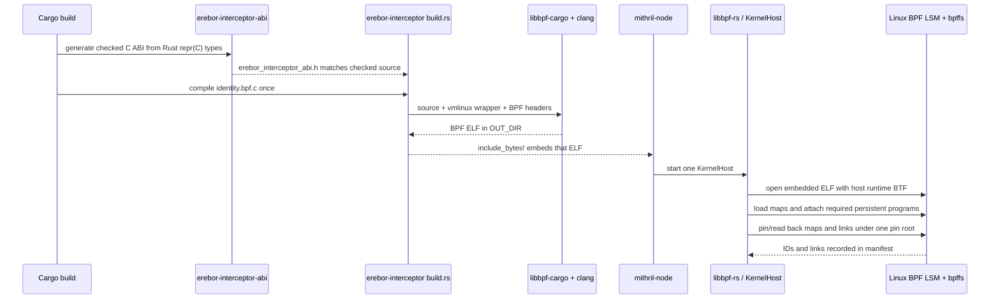
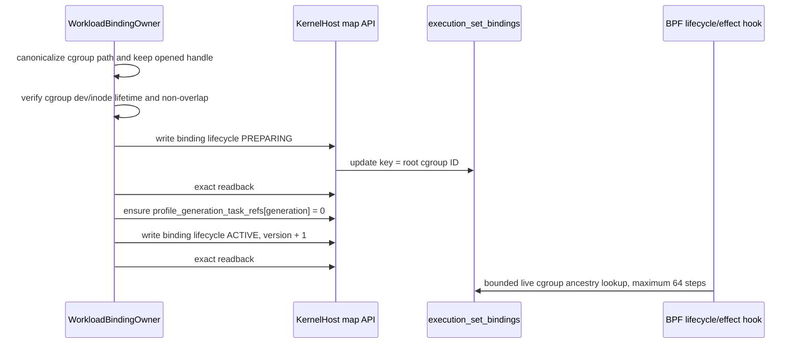
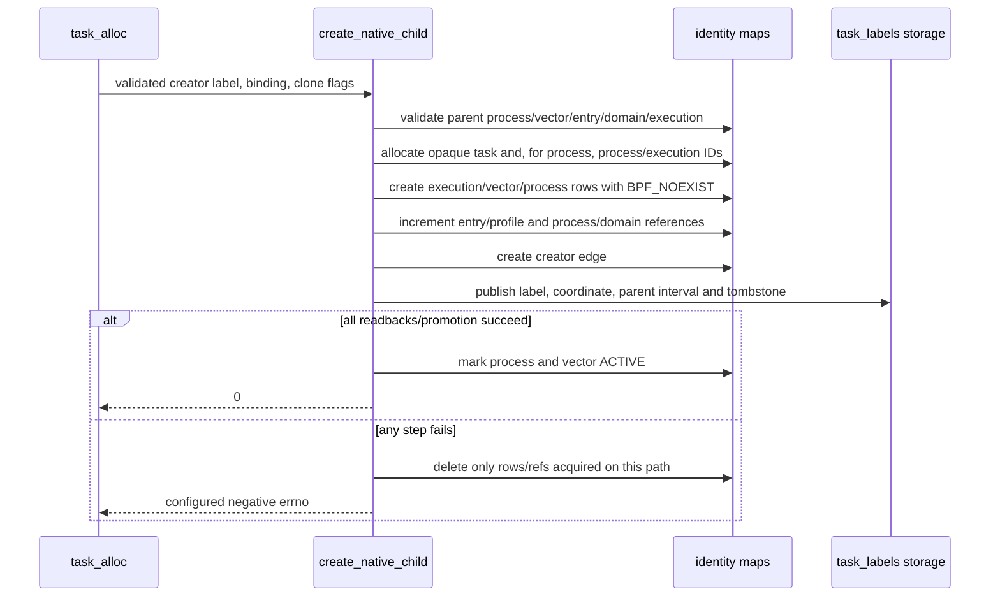

# Mithril Phase 0–4 Implementation Review Guide

This is a source-grounded reading guide for the implementation currently in
this repository. It replaces the earlier guide because the ownership and BPF
control flow changed materially after the original Phase 1–3 work.

Status as of 2026-08-11:

- Phase 1 is complete.
- Phase 2 and Phase 3 have substantial code-backed implementation, but their
  phase documents still correctly record unrun real container/runtime
  acceptance work.
- The current signed exact-file Phase 4 increment is implemented. The
  self-cleaning privileged host probe was reported passing on the current
  committed source. This replaces the old statement that its probe was still
  pending.
- The Phase 4 plan remains **Not done**. Its complete D4.2–D4.8 policy-aware
  surface is intentionally not claimed by this guide. An attached hook is not
  automatically a supported policy surface.

This guide is explanatory only. The authoritative scope and acceptance records
remain the phase documents and the readable architecture:

- [Master plan](./README.md)
- [Readable architecture](./policy-and-protection-algorithm-architecture-readable.md)
- [Phase 0 result](./phase-0-substrate-license-abi-and-incident-baseline.md)
- [Phase 1 result](./phase-1-one-binary-node-chassis.md)
- [Phase 2 result](./phase-2-exact-native-identity.md)
- [Phase 3 result](./phase-3-effect-observation-and-profile-simulation.md)
- [Phase 4 result](./phase-4-signed-local-pre-effect-enforcement.md)

## What to review, in order

Start at an owner boundary, not in a BPF helper. The following path gives the
smallest complete explanation of who does what.

| Order | Open this code first | What to establish before continuing |
| --- | --- | --- |
| 1 | [`mithril-node` main](../../../crates/mithril-node/src/main.rs#L22-L31) | The CLI only builds `NodeConfig` and starts one `NodeChassis`; it does not load a second object or decide effects. |
| 2 | [`NodeChassis::start`](../../../crates/mithril-node/src/node.rs#L49-L195) | Startup order is: load/recover one object, publish bindings, install an optional signed generation, enable/reconcile identity, then start observation/control. |
| 3 | [`KernelHostOwner::start`](../../../crates/erebor-interceptor/src/host.rs#L288-L498) | `KernelHostOwner` is the only production loader, linker, pin, object-manifest, and lease owner. It loads one object per node, not one object per container. |
| 4 | [`WorkloadBindingOwner::publish_all`](../../../crates/mithril-node/src/identity/binding.rs#L106-L265) | A binding owner turns a live cgroup into `execution_set_bindings`; it is the userspace owner of container-to-workload placement. |
| 5 | [`NodePolicyGenerationOwner::load_and_install`](../../../crates/mithril-node/src/policy.rs#L37-L125) | A verified candidate becomes node-local map rows. It is not active until all required rows have been read back and the descriptor becomes `ACTIVE`. |
| 6 | [`NativeSecurityStateOwner::activate_with_effect_policy`](../../../crates/mithril-node/src/identity/native.rs#L40-L91) | The identity owner writes the one runtime configuration record and runs the task iterator; it does not load another BPF object. |
| 7 | [`identity.bpf.c`](../../../bpf/erebor-interceptor/programs/identity.bpf.c#L3-L76) | One C translation unit includes the maps and every hook family into the one ELF object. Read this before individual BPF headers. |
| 8 | [`identity_maps.h`](../../../bpf/erebor-interceptor/programs/identity_maps.h#L52-L340) | This is the BPF state schema and the shared helper vocabulary. It explains what is durable and what is merely per-invocation scratch. |
| 9 | [`erebor_task_alloc`](../../../bpf/erebor-interceptor/programs/identity_lifecycle.bpf.h#L6-L63) | Read the complete, line-by-line explanation in [Task allocation](#task-allocation-line-by-line). |
| 10 | [`identity_effect_gate`](../../../bpf/erebor-interceptor/programs/identity_effects.bpf.h#L186-L438) | The common effect gate validates current state, resolves a qualified file object, makes the physical decision, and only then attempts best-effort observation. |
| 11 | [`LoweredGeneration::install`](../../../crates/mithril-node/src/policy.rs#L655-L778) | See exactly how policy rows are filled and why a partially written generation cannot become `ACTIVE`. |
| 12 | [`EffectTestRunner`](../../../crates/mithril-e2e/src/effect.rs) and [manual phase examples](../../../examples/mithril-phase4-manual/README.md) | Tests use the production loader and self-clean their own test pin/cgroup/output paths; manual shells are separate human exercises. |

The most useful first pass is this short chain:

```text
NodeChassis::start
  -> KernelHostOwner::start
  -> WorkloadBindingOwner::publish_configured
  -> NodePolicyGenerationOwner::load_and_install (when configured)
  -> NativeSecurityStateOwner::activate_with_effect_policy
  -> identity.bpf.c
  -> identity_maps.h
  -> identity_lifecycle.bpf.h: erebor_task_alloc
```

## Current implementation, without phase-document ambiguity

| Area | Implemented owner | Current, honest claim |
| --- | --- | --- |
| Build and ABI | `erebor-interceptor-abi`, `erebor-interceptor` build script | Rust `repr(C)` ABI is generated to a checked-in snake_case C header by cbindgen. `libbpf-cargo` compiles one C BPF object at Cargo build time. |
| Runtime loading | `KernelHostOwner` in `erebor-interceptor` | `libbpf-rs` opens the embedded object, applies the host BTF, loads, attaches, pins, reads back, and recovers it. |
| Binding and task identity | `WorkloadBindingOwner`, `NativeSecurityStateOwner`, BPF lifecycle hooks | Cgroup binding is userspace-published; task/process/entry/execution state is BPF-native and fail closed when it cannot be proven. |
| Signed policy generation | `PolicyArtifactOwner`/compiler in `mithril-control`, then `NodePolicyGenerationOwner` | Control-side policy stays portable and signed. The node verifies it, applies anti-rollback, derives local numeric handles, and publishes BPF map rows. |
| Exact-file observation and narrow prevention | BPF effect/path headers, `NodePolicyGenerationOwner` | The current qualified slice is exact-file policy over the current actor, clean mount view, canonical component graph, and exact kernel object tuple. `OBSERVE` emits `WOULD_DENY`; `PROTECT` returns the configured negative errno before the effect. |
| Other attached hooks | Explicit typed BPF wrappers | Most do not yet have an exact object/state model. Protected requests reach explicit hard-safe `UNSUPPORTED_OBJECT` or unresolved results rather than being advertised as policy-aware enforcement. |
| Observation | one `EffectObservationReader` plus `EffectObservationStore` | One `libbpf-rs` ring reader copies best-effort records into a bounded in-process history. It does not authorize and is not durable evidence. |

## One object, one loader, one node

The production binary embeds an already-built BPF ELF. It never compiles BPF
at node startup and it does not instantiate a BPF program for each container.



Read the concrete build path in [`erebor-interceptor/build.rs`](../../../crates/erebor-interceptor/build.rs#L15-L74).
It names the four checked BTF headers and invokes
[`libbpf_cargo::SkeletonBuilder`](../../../crates/erebor-interceptor/build.rs#L6-L6).
The embedded bytes are in
[`bundled.rs`](../../../crates/erebor-interceptor/src/bundled.rs#L1-L8), and
the runtime `libbpf-rs` open/load/attach path is in
[`host.rs`](../../../crates/erebor-interceptor/src/host.rs#L301-L379).

`vmlinux.h` is present. It is the small architecture selector at
[`bpf/erebor-interceptor/include/vmlinux.h`](../../../bpf/erebor-interceptor/include/vmlinux.h#L1-L22),
which chooses checked generated x86, arm64, arm, or riscv definitions through
the standard `__TARGET_ARCH_*` Clang target macro. CO-RE reads make the program
adapt to the runtime BTF layout within the supported kernel field variants.

The ABI header is also intentionally generated, not hand duplicated:

```mermaid
flowchart LR
    R[Rust ABI types\nrepr(C)] --> G[cbindgen]
    G --> C[checked erebor_interceptor_abi.h\nsnake_case C names]
    C --> B[identity.bpf.c]
    R --> A[Rust map readers/writers]
    A -. same bytes and offsets .- C
    B -. _Static_assert size and offset checks .- C
```

[`erebor-interceptor-abi/build.rs`](../../../crates/erebor-interceptor-abi/build.rs#L12-L55)
rejects a build when cbindgen produces a header different from the
checked-in one. The BPF translation unit adds size and offset assertions at
[`identity.bpf.c`](../../../bpf/erebor-interceptor/programs/identity.bpf.c#L12-L62).
The small BPF-only `exception_runtime_state_bpf_v1` wrapper is not a second
ABI: its first field must be the literal C `struct bpf_spin_lock` so the kernel
BTF recognizes it as a spin lock. The following assertions prove that it has
the same bytes and field offsets as the generated Rust ABI value.

### Loader startup and recovery

```mermaid
sequenceDiagram
    participant N as NodeChassis
    participant H as KernelHostOwner
    participant L as PinRootLease
    participant K as Kernel / bpffs
    participant B as WorkloadBindingOwner
    participant P as NodePolicyGenerationOwner
    participant I as NativeSecurityStateOwner

    N->>H: start(identity config, host BTF, pin root)
    H->>H: validate config, preflight, calculate ELF digest
    H->>L: nonblocking exclusive flock on lease file
    alt fresh pin root
        H->>K: load one ELF and attach persistent programs
        H->>K: pin every map/link; read ID back
    else populated identity pin root
        H->>K: reuse each pinned map
        H->>K: open each pinned link and verify program tag
    end
    H-->>N: one ready KernelHost and manifest
    N->>B: publish cgroup bindings PREPARING then ACTIVE
    opt candidate configured
        N->>P: verify/lower/install/activate policy rows
    end
    N->>I: write or recover identity_config; run task iterator
```

[`PinRootLease`](../../../crates/erebor-interceptor/src/lease.rs#L10-L43)
is a nonblocking exclusive `flock` held as the `_lease` field of the live
`KernelHost`. Its role is narrow: prevent a second loader from owning the same
pin root. It is not a policy lock and it does not serialize BPF map operations.

The recovery branch starts at
[`KernelHostOwner::recover`](../../../crates/erebor-interceptor/src/host.rs#L501-L606).
It reuses existing map pins and verifies the complete expected link set. It
does not attach another persistent hook set. The task iterator is the one
exception: [`KernelHost::reconcile_tasks`](../../../crates/erebor-interceptor/src/host.rs#L930-L955)
attaches the iterator only while it is read to completion during activation.

On normal node shutdown the production identity pins intentionally remain, so
a later process can validate and recover them. The disposable qualification
object removes its pins. See
[`KernelHost::shutdown`](../../../crates/erebor-interceptor/src/host.rs#L957-L985).

## Ownership and publication boundaries

| State or capability | Durable owner | First implementation location | Not owned here |
| --- | --- | --- | --- |
| BPF ELF, map/link lifecycle, pins and manifest | `KernelHostOwner` / `KernelHost` | [`host.rs`](../../../crates/erebor-interceptor/src/host.rs#L255-L498) | Workload semantics or policy compilation |
| One node process and shutdown/reconnect loop | `NodeChassis` | [`node.rs`](../../../crates/mithril-node/src/node.rs#L35-L195) | A second privileged daemon |
| Cgroup workload binding | `WorkloadBindingOwner` | [`binding.rs`](../../../crates/mithril-node/src/identity/binding.rs#L51-L265) | Task labels, process state, policy decision rows |
| Identity configuration and reconciliation health | `NativeSecurityStateOwner` | [`native.rs`](../../../crates/mithril-node/src/identity/native.rs#L22-L117) | Object loading or container discovery |
| Portable policy/signature/simulation | `mithril-control` policy owners | [`mithril-control/src/policy`](../../../crates/mithril-control/src/policy) | BPF map handles or node startup |
| Node-local policy rows and mount reconstruction | `NodePolicyGenerationOwner` | [`policy.rs`](../../../crates/mithril-node/src/policy.rs#L31-L288) | Signature creation or cgroup binding lifecycle |
| Task/process/exec state | BPF lifecycle, exec, and exit programs | [`identity_lifecycle.bpf.h`](../../../bpf/erebor-interceptor/programs/identity_lifecycle.bpf.h), [`identity_exec.bpf.h`](../../../bpf/erebor-interceptor/programs/identity_exec.bpf.h), [`identity_exit.bpf.h`](../../../bpf/erebor-interceptor/programs/identity_exit.bpf.h) | Userspace task enrollment after the fact |
| Per-effect result | BPF `identity_effect_gate` | [`identity_effects.bpf.h`](../../../bpf/erebor-interceptor/programs/identity_effects.bpf.h#L186-L438) | Control round trips, ring-buffer delivery |
| Ring consumption and recent records | `EffectObservationReader` / `EffectObservationStore` | [`host.rs`](../../../crates/erebor-interceptor/src/host.rs#L903-L928), [`observation.rs`](../../../crates/mithril-node/src/observation.rs) | Policy decisions or durable audit |

### Node startup order

```mermaid
sequenceDiagram
    participant Config as NodeConfig
    participant Node as NodeChassis
    participant Host as KernelHost
    participant Binding as WorkloadBindingOwner
    participant Policy as NodePolicyGenerationOwner
    participant Native as NativeSecurityStateOwner
    participant Ring as EffectObservationReader
    participant Control as mithril-control

    Config->>Node: validated configuration
    Node->>Host: start or recover one identity object
    Node->>Binding: publish configured or CRI-resolved cgroups
    opt policy candidates exist
        Node->>Policy: verify and install local generation
    end
    Node->>Native: enable identity; enable effect policy iff candidate exists
    Native->>Host: run task reconciliation iterator; aggregate health
    opt candidate exists
        Node->>Ring: create the only ring-buffer reader
    end
    Node->>Control: register capabilities and begin reconnect loop
```

This is the exact ordering in
[`NodeChassis::start`](../../../crates/mithril-node/src/node.rs#L49-L195).
It matters that bindings and an optional generation exist *before* identity is
enabled and live tasks are reconciled.

## The BPF object: source relationship and hook families

`identity.bpf.c` is intentionally a single translation unit. The include order
is the source-level dependency graph:

```text
vmlinux.h + generated ABI + libbpf headers
        |
        v
identity_maps.h        -- maps, shared helpers, BPF-only spin-lock wrappers
identity_task_helpers  -- native child construction and rollback
identity_root_helpers  -- root construction and coordinate finalization
identity_path.bpf.h    -- bounded canonical component and mount-view logic
        |
        +--> identity_lifecycle.bpf.h -- task/cgroup/wakeup/reconcile
        +--> identity_exec.bpf.h      -- exec transaction and argv proof
        +--> identity_effects.bpf.h   -- common gate plus explicit LSM hooks
        +--> identity_exit.bpf.h      -- reference release
```

The loader requires 37 named programs from the one ELF; the list is at
[`REQUIRED_IDENTITY_PROGRAMS`](../../../crates/erebor-interceptor/src/host.rs#L64-L102).
They fit five review families:

| Family | Programs / sections | Relationship to the others |
| --- | --- | --- |
| Task lifecycle | `lsm/task_alloc`, `tp_btf/cgroup_attach_task`, `raw_tracepoint/cgroup_release`, `fentry/wake_up_new_task`, `iter/task` | Establishes or rechecks task identity and cgroup placement. The iterator is temporary; the other four stay attached. |
| Exec transaction | `sys_enter_execve`, `sys_enter_execveat`, `lsm/bprm_check_security`, `security_bprm_committing_creds`, both exec syscall exits, `sched_process_exec` | Stages argv/executable candidates and commits or conservatively closes an execution transition. It reads identity created by lifecycle hooks. |
| Exact-file and effect gate | `file_open`, `file_permission`, `mmap_file`, `file_mprotect`, `file_ioctl`, IPC/socket/ptrace/signal, mutation, mount, capability and BPF LSM hooks | Every wrapper calls the common gate with an explicit effect family and operation. Only a qualified file-backed wrapper supplies a file object for exact resolution. |
| Mount completion | `erebor_mount_mutation_sys_exit` | Completes the task-local mount attempt after a mount LSM hook dirties the namespace view. It uses atomics, not a BPF spin lock, because tracing programs cannot use that lock. |
| Task exit | `sched_process_exit` | Uses the birth tombstone to release profile/entry/domain/process references exactly once. |

The 37 required names are a load-time completeness check, not a statement that
all 37 have a complete policy model. Review a hook's current claim through the
data it can actually provide to `identity_effect_gate`.

## Maps: what they store, who fills them, and who reads them

The authoritative declarations are all in
[`identity_maps.h`](../../../bpf/erebor-interceptor/programs/identity_maps.h#L78-L340).
The important simplification is that each map has one domain publisher on the
userspace side, while BPF owns event-time identity transitions. The kernel
loader has the file descriptor; it does not invent map contents.

### 1. Bootstrap and temporary state

| Map | Filled by | Read by | Plain meaning |
| --- | --- | --- | --- |
| `identity_config` (array, one record) | `NativeSecurityStateOwner`; `allocate_id` advances `next_id` atomically | Every identity/effect hook | Node boot ID, label epoch, enabled flags, configured deny errno, and opaque-ID allocator. |
| `identity_health` (per-CPU array) | BPF hook families increment counters | `NativeSecurityStateOwner` aggregates all CPU values | Diagnostic counters; missing health storage never authorizes anything. |
| `identity_scratch` (per-CPU array) | The currently running BPF invocation | That same invocation only | Reusable temporary construction area, not durable task identity. One invocation completes on one CPU. A later invocation uses the slot for its current CPU. Durable data is published to task storage or hash maps before return. |
| `effect_observation_health` (per-CPU array) | Effect gate | Runtime observation | Attempted/emitted/lost/unresolved observation counters. |
| `effect_observations` (4 MiB ring buffer) | Effect gate after selecting the result | One `libbpf-rs` ring reader | Best-effort evidence. Ring pressure can lose evidence but cannot change allow/deny. |

### 2. Binding and identity state

| Map(s) | Filled by | Read by | Plain meaning |
| --- | --- | --- | --- |
| `execution_set_bindings` | `WorkloadBindingOwner`: `PREPARING` → exact readback → `ACTIVE`; BPF consumes the single initial-root marker and tombstones a released cgroup | Lifecycle and effect gate | The live cgroup-to-workload authority record, including nonce, profile generation and roles. BPF never creates or activates a binding. |
| `profile_generation_task_refs` | Binding owner creates the zero value; BPF birth increments and exit decrements | BPF lifecycle and node recovery | Keeps a generation retained while labelled tasks exist. |
| `task_labels` (task storage) | BPF `publish_task`; BPF rollback deletes partial publication | Every hot BPF path | Immutable birth identity attached directly to the kernel task. There is no delayed PID enrollment. |
| `task_coordinates`, `kernel_real_parent_intervals`, `created_by_edges` | BPF birth/wakeup/exec/exit/reconcile | Identity and effect paths; inspection | Reusable Linux coordinates, current kernel-parent observation, and immutable creator proof. |
| `process_states`, `process_state_vectors`, `entry_states`, `authority_domains` | BPF root/native birth; BPF exec and exit transitions | Lifecycle, exec and effect paths | Current mutable authority state for a process, its finite state vector, entry lifetime, and native-family domain. |
| `external_root_classifications`, `pending_execs`, `image_provenance`, `process_execution_instances`, `task_reference_tombstones` | BPF lifecycle/exec/exit | Lifecycle, exec, effect and reconciliation paths | Root kind, in-flight exec state, exact executable provenance, execution instances, and exactly-once release bookkeeping. |

### 3. Authorization-proof state

| Map(s) | Filled by | Read or changed by | Plain meaning |
| --- | --- | --- | --- |
| `approved_exec_slots`, `approved_exec_arguments` | `AuthorizationProofOwner` | Exec path consumes one matching slot; exec path reads bounded argument bytes | Current identity-side foundation for exact administrative exec proof. It is not a broad command-string allow list. |
| `pending_administrative_matches` | Exec entry path | BPRM/exec completion path | Short-lived bridge from verified syscall argv to the BPRM transaction. |

### 4. Signed policy, exact file, and mount state

| Map(s) | Filled by | Read or changed by | Plain meaning |
| --- | --- | --- | --- |
| `profile_generation_descriptors` | `NodePolicyGenerationOwner` writes `PREPARING`, `READ_BACK`, then `ACTIVE` | Effect gate | The generation is usable only when its boot/epoch/profile descriptor is `ACTIVE`. Its mode says `OBSERVE` or `PROTECT`. |
| `effect_decisions`, `effect_defaults` | `NodePolicyGenerationOwner` | Effect gate | Exact-object row first, then finite default fallback. A decision contains the physical disposition and errno/exception handle. |
| `exception_runtime_states` | Policy owner writes exact signed initial state and validates a recovered state | BPF locks one value, checks deadline/count, and consumes one use | The implemented bounded-exception counter. It owns `maximum_uses`, `consumed_uses`, expiry and terminal state atomically. |
| `exact_file_objects` | Policy owner writes configured tuple rows; BPF attempts a generation-scoped dynamic binding after canonical resolution | Effect gate | Exact object key: mount namespace, unique mount identity, device, inode, generation. It is not a pathname-only policy key. |
| `mount_security_views`, `mount_mutation_epochs`, `mount_security_view_locks`, `mount_reconciliation_proposals` | Policy owner initializes/reconciles; BPF mount hooks dirty/advance state; BPF file gate commits an exact proposal | BPF path and policy reconciliation | Namespace-global topology safety state. A dirty or racing view cannot produce a strict file decision. |
| `canonical_mount_roots`, `path_graph_exact_transitions`, `path_graph_wildcard_transitions`, `path_graph_terminals` | Policy owner after resolving the represented mount view | BPF canonical path candidate | The bounded Meta component graph and trusted root prefix used to turn live dentry components into a signed class candidate. |
| `mount_mutation_attempts` (task storage) | BPF mount and exit paths | BPF mount completion | A small task-local pairing record only. Namespace topology authority stays in namespace-keyed maps. |

The rest of this section gives the map-fill order for review.

### Binding publication



The concrete writes are in
[`WorkloadBindingOwner::publish_all`](../../../crates/mithril-node/src/identity/binding.rs#L106-L265).
For a configured runtime socket, the same owner reconciles a CRI inventory;
it still publishes exactly the same binding record rather than loading another
BPF program.

### Signed generation publication

```mermaid
sequenceDiagram
    participant A as signed artifact
    participant N as NodePolicyGenerationOwner
    participant R as anti-rollback store
    participant H as KernelHost map API
    participant M as policy maps
    participant G as BPF effect gate

    A->>N: candidate path and public key from node config
    N->>N: verify signature, validity, source/compiled binding
    N->>R: accept monotonic artifact version
    N->>H: descriptor = PREPARING
    loop every decision/default/object/graph row
        N->>H: write row
        N->>H: read exact row back
    end
    N->>H: write/read exception state and mutable mount rows
    N->>H: descriptor = READ_BACK; read back
    N->>H: descriptor = ACTIVE; read back
    G->>M: use rows only after matching ACTIVE descriptor
```

[`LoweredGeneration::install`](../../../crates/mithril-node/src/policy.rs#L655-L778)
contains that sequence. It keeps a recovered active descriptor only if the
immutable rows still match; this is why a node restart does not silently turn a
changed candidate into the old generation.

### Identity birth and use

```mermaid
sequenceDiagram
    participant T as creator task
    participant A as lsm/task_alloc
    participant C as cgroup_attach_task
    participant W as wake_up_new_task
    participant E as later effect hook
    participant M as identity maps

    T->>A: clone/fork/thread allocation request
    A->>M: read creator label and creator cgroup binding
    alt labelled valid creator
        A->>M: construct/publish child task/process state
    else unlabelled creator in protected binding
        A-->>T: deny; missing identity
    else unlabelled creator outside binding
        A-->>T: do not label here
    end
    C->>M: Linux provides target cgroup; construct external/initial root if needed
    W->>M: finalize child Linux PID/namespace/start-time coordinate
    E->>M: require label + current binding + current process state
```

This is a deliberate simplification from the earlier code: `task_alloc` no
longer tries to construct an external root from a speculative child cgroup.
It constructs only a native descendant of a labelled creator. The
`cgroup_attach_task` hook handles independent roots once placement is known.

### Exact-file decision and observation

```mermaid
sequenceDiagram
    participant L as typed LSM wrapper
    participant G as identity_effect_gate
    participant I as identity/binding maps
    participant P as mount view + path graph
    participant D as decision/exception maps
    participant R as ring buffer
    participant U as one libbpf-rs reader

    L->>G: file/object arguments, operation, prior LSM result
    G->>I: validate current task label, cgroup binding, process/entry/domain
    alt prior LSM denied or identity is broken
        G->>G: keep prior result or hard-deny
    else policy disabled
        G-->>L: return prior success
    else qualified file object
        G->>P: require CLEAN view; build bounded components; revalidate snapshot
        G->>D: exact object then exact/default policy key
        alt OBSERVE deny
            G->>G: result = 0, reason = WOULD_DENY
        else PROTECT deny
            G->>G: result = signed negative errno
        else exception-backed allow
            G->>D: lock/check/increment bounded counter once
        end
    else unsupported protected object
        G->>G: result = hard deny, reason = UNSUPPORTED_OBJECT
    end
    G->>R: best-effort copy after result is fixed
    G-->>L: return fixed result
    U->>R: poll and decode
```

Start the full gate at
[`identity_effect_gate`](../../../bpf/erebor-interceptor/programs/identity_effects.bpf.h#L186-L438).
The wrappers below it deliberately retain visible Linux hook prototypes; they
do not hide unrelated operations behind a macro. A wrapper with no qualified
object passes `NULL`, causing protected state to take the explicit hard-safe
unsupported path rather than pretending it has a complete policy model.

### Mount invalidation and reconciliation

```mermaid
sequenceDiagram
    participant A as task in represented mount namespace
    participant L as mount LSM hook
    participant V as namespace view maps
    participant X as syscall exit hook
    participant N as NodePolicyGenerationOwner
    participant F as later exact-file hook

    A->>L: mount, unmount, pivot_root, or move_mount
    alt protected unsupported mutation
        L-->>A: deny before mutation; view stays unchanged
    else allowed external entrant
        L->>V: epoch++; pending++; state = DIRTY
        L-->>A: allow Linux mutation
        A->>X: syscall completion
        X->>V: version++; decrement pending last; remain DIRTY
    end
    N->>V: read epoch/version/pending
    N->>N: prove configured exact object and snapshot still match
    N->>V: write/read root rows and exact reconciliation proposal
    F->>V: under LSM spin lock, CAS matching proposal to CLEAN
    F->>V: only then walk path graph for strict file decision
```

The view key is the mount-namespace inode, not the task cgroup. That prevents a
host task that enters the represented mount namespace from bypassing topology
invalidation merely because it is outside the workload cgroup. The LSM-side
map lock is used only in LSM programs; the tracing exit program uses atomics as
required by the verifier.

## BPF vocabulary needed for review

| Item | Meaning here |
| --- | --- |
| `SEC("...")` | Puts a function in an ELF section. libbpf uses the section to select program type/attach behavior. `SEC("lsm/task_alloc")` is a BPF LSM hook for the kernel `task_alloc` security hook. |
| `BPF_PROG(name, ...)` | libbpf tracing macro that gives C a typed function view of the BPF context while preserving the ABI Linux expects. It is not Rust and does not itself attach a program. |
| `BPF_CORE_READ_INTO` | CO-RE field read: Clang records field relocation information so libbpf can adapt a supported kernel field layout using runtime BTF. |
| `bpf_get_current_task_btf()` | Returns a verifier-trusted pointer to the task that is currently executing the hook. In `task_alloc`, that is the creator, not the half-created `task` argument. |
| `bpf_task_storage_get` | Looks up a BPF task-storage value. Passing flags `0, 0` means lookup only; it does not create a label. |
| `bpf_map_lookup_elem` | Returns a temporary pointer to a map value for this BPF invocation or `NULL`. The verifier prevents retaining it after return. |
| `BPF_NOEXIST` | Map-update mode that fails rather than replacing a key that already exists. Birth code uses it to avoid silently overwriting identity state. |
| `__sync_*` | Clang lowers these operations to BPF atomics. They implement bounded counters/CAS without a userspace lock in the hot path. |
| BPF spin lock | A special lock field recognized from BTF in a map value. It is used only where Linux permits it; it is not interchangeable with an ordinary `u32`. |
| Return `0` from an LSM BPF program | Adds no denial. It does not override another LSM's prior nonzero decision. A negative errno denies the operation. |

## Task allocation: contract before reading the source

The exact function under review is:

```c
SEC("lsm/task_alloc")
int BPF_PROG(erebor_task_alloc, struct task_struct *task,
             unsigned long clone_flags, int ret)
```

It is at
[`identity_lifecycle.bpf.h` lines 6–63](../../../bpf/erebor-interceptor/programs/identity_lifecycle.bpf.h#L6-L63).

Its contract is deliberately narrow:

1. Preserve a denial from an earlier LSM program.
2. Do nothing while Mithril identity is disabled.
3. Read the *creator's* label and the creator's live cgroup binding.
4. If that creator has a valid Mithril label, create a fail-closed native child
   before Linux can run it.
5. If it is unlabelled but is inside a protected binding, deny it as missing
   identity.
6. If it is unlabelled and outside every configured binding, make no identity
   claim. A later `cgroup_attach_task` hook creates an external or initial root
   only after Linux provides the target protected cgroup.

`clone_flags` is the standard Linux UAPI word. The child helper uses standard
`CLONE_THREAD` and `CLONE_PARENT` from
[`linux_uapi.h`](../../../bpf/erebor-interceptor/include/linux_uapi.h), rather
than an invented Mithril clone-flag copy. Threads retain the process-level
identity; a process child receives distinct process/execution identifiers.

### Task allocation line by line

Blank source lines are formatting only. Every nonblank source line in this
function is described below, including braces where they define a branch.

| Source line | Exact effect |
| --- | --- |
| [6](../../../bpf/erebor-interceptor/programs/identity_lifecycle.bpf.h#L6) | Places this function in the `lsm/task_alloc` ELF section. libbpf loads it as an LSM program and attaches it to Linux's task-allocation security hook. |
| [7](../../../bpf/erebor-interceptor/programs/identity_lifecycle.bpf.h#L7) | Starts the typed `BPF_PROG` declaration. `erebor_task_alloc` is the stable program name the loader requires. `task` is the newly allocating kernel task, not necessarily safe to treat as the current creator. |
| [8](../../../bpf/erebor-interceptor/programs/identity_lifecycle.bpf.h#L8) | Completes the parameters: `clone_flags` preserve Linux clone semantics; `ret` is the accumulated result from preceding LSM programs. |
| [9](../../../bpf/erebor-interceptor/programs/identity_lifecycle.bpf.h#L9) | Opens the function body. All stack pointers and map-value pointers created inside must be gone before its return. |
| [10](../../../bpf/erebor-interceptor/programs/identity_lifecycle.bpf.h#L10) | Declares the pointer to the one runtime configuration map value. It is assigned at line 22. |
| [11](../../../bpf/erebor-interceptor/programs/identity_lifecycle.bpf.h#L11) | Declares the optional pointer to this CPU's diagnostic counters. The code tolerates a missing health record. It never authorizes. |
| [12](../../../bpf/erebor-interceptor/programs/identity_lifecycle.bpf.h#L12) | Declares the pointer to this CPU's temporary construction area. Unlike health, construction without it is unsafe. |
| [13](../../../bpf/erebor-interceptor/programs/identity_lifecycle.bpf.h#L13) | Declares the BTF-typed pointer to the currently executing creator task. It is assigned at line 29. |
| [14](../../../bpf/erebor-interceptor/programs/identity_lifecycle.bpf.h#L14) | Declares and clears the creator's cgroup pointer. Clearing first prevents an uninitialized pointer from being used after a failed helper read. |
| [15](../../../bpf/erebor-interceptor/programs/identity_lifecycle.bpf.h#L15) | Declares the creator's immutable `task_labels` map value pointer. `NULL` means no Mithril label exists. |
| [16](../../../bpf/erebor-interceptor/programs/identity_lifecycle.bpf.h#L16) | Declares the optional binding map value found from the creator's live cgroup ancestry. |
| [17](../../../bpf/erebor-interceptor/programs/identity_lifecycle.bpf.h#L17) | Declares a separate success/failure result for the bounded ancestry walk. This separates “outside all bindings” from “walk not proven.” |
| [18](../../../bpf/erebor-interceptor/programs/identity_lifecycle.bpf.h#L18) | Declares the native-child constructor return value, which becomes this hook's final LSM decision. |
| [20](../../../bpf/erebor-interceptor/programs/identity_lifecycle.bpf.h#L20) | Tests the prior LSM result before doing any Mithril work. |
| [21](../../../bpf/erebor-interceptor/programs/identity_lifecycle.bpf.h#L21) | Returns that nonzero result unchanged. Mithril neither masks nor relabels another LSM denial. |
| [22](../../../bpf/erebor-interceptor/programs/identity_lifecycle.bpf.h#L22) | Looks up array key zero in `identity_config`. This is a read; it does not allocate configuration. |
| [23](../../../bpf/erebor-interceptor/programs/identity_lifecycle.bpf.h#L23) | Treats absent config or `enabled == 0` as identity disabled. |
| [24](../../../bpf/erebor-interceptor/programs/identity_lifecycle.bpf.h#L24) | Adds no LSM decision while identity is disabled. Other Linux security mechanisms remain authoritative. |
| [25](../../../bpf/erebor-interceptor/programs/identity_lifecycle.bpf.h#L25) | Obtains this CPU's `identity_health` value for optional diagnostics. |
| [26](../../../bpf/erebor-interceptor/programs/identity_lifecycle.bpf.h#L26) | Obtains this CPU's `identity_scratch` value. It is scratch for this invocation, not a task record. |
| [27](../../../bpf/erebor-interceptor/programs/identity_lifecycle.bpf.h#L27) | Tests the required scratch lookup. |
| [28](../../../bpf/erebor-interceptor/programs/identity_lifecycle.bpf.h#L28) | Returns the configured fail-closed errno. `identity_deny` validates/sign-extends the configured `i32` and falls back to standard `-EACCES`. |
| [29](../../../bpf/erebor-interceptor/programs/identity_lifecycle.bpf.h#L29) | Obtains the verifier-trusted current task. At this hook, it is the task requesting clone/fork, so it is the creator. |
| [30](../../../bpf/erebor-interceptor/programs/identity_lifecycle.bpf.h#L30) | Looks up the creator's task-storage label without creating one. A label is established only by an earlier BPF lifecycle publication. |
| [31](../../../bpf/erebor-interceptor/programs/identity_lifecycle.bpf.h#L31) | Reads the creator's effective default cgroup. This intentionally checks the creator, not a speculative final cgroup for the child. |
| [32](../../../bpf/erebor-interceptor/programs/identity_lifecycle.bpf.h#L32) | Starts the failure branch for an unreadable creator cgroup. |
| [33](../../../bpf/erebor-interceptor/programs/identity_lifecycle.bpf.h#L33) | Records a placement mismatch when the optional diagnostic record exists. |
| [34](../../../bpf/erebor-interceptor/programs/identity_lifecycle.bpf.h#L34) | Denies because the program cannot determine whether the creator is inside protected scope. |
| [35](../../../bpf/erebor-interceptor/programs/identity_lifecycle.bpf.h#L35) | Closes the unreadable-cgroup branch. |
| [36](../../../bpf/erebor-interceptor/programs/identity_lifecycle.bpf.h#L36) | Begins a bounded cgroup-ancestry lookup from the creator's live cgroup. |
| [37](../../../bpf/erebor-interceptor/programs/identity_lifecycle.bpf.h#L37) | Passes the separate completion result. A complete root walk with no binding is valid and returns `NULL` with result zero. |
| [38](../../../bpf/erebor-interceptor/programs/identity_lifecycle.bpf.h#L38) | Starts the fail-closed branch for an incomplete/invalid binding lookup. |
| [39](../../../bpf/erebor-interceptor/programs/identity_lifecycle.bpf.h#L39) | Checks whether health diagnostics are available. |
| [40](../../../bpf/erebor-interceptor/programs/identity_lifecycle.bpf.h#L40) | Increments the placement-mismatch counter. |
| [41](../../../bpf/erebor-interceptor/programs/identity_lifecycle.bpf.h#L41) | Denies rather than classifying a truncated or unreadable ancestor walk as outside protection. |
| [42](../../../bpf/erebor-interceptor/programs/identity_lifecycle.bpf.h#L42) | Closes that binding-lookup failure branch. |
| [43](../../../bpf/erebor-interceptor/programs/identity_lifecycle.bpf.h#L43) | Selects the native-child path when the creator already carries a Mithril label. |
| [44](../../../bpf/erebor-interceptor/programs/identity_lifecycle.bpf.h#L44) | First half of the native precondition: verifies the label's boot ID and epoch match the current runtime configuration. |
| [45](../../../bpf/erebor-interceptor/programs/identity_lifecycle.bpf.h#L45) | Second half: requires the live creator binding to match the label's binding ID, nonce and active lifecycle. A moved/reused cgroup is not accepted. |
| [46](../../../bpf/erebor-interceptor/programs/identity_lifecycle.bpf.h#L46) | Starts optional accounting for either failed precondition. |
| [47](../../../bpf/erebor-interceptor/programs/identity_lifecycle.bpf.h#L47) | Counts the stale-label or binding mismatch. |
| [48](../../../bpf/erebor-interceptor/programs/identity_lifecycle.bpf.h#L48) | Denies this ambiguous native-child allocation before any child state is published. |
| [49](../../../bpf/erebor-interceptor/programs/identity_lifecycle.bpf.h#L49) | Closes the native precondition branch. |
| [50](../../../bpf/erebor-interceptor/programs/identity_lifecycle.bpf.h#L50) | Calls the only native-child constructor with the new task, trusted creator, standard clone flags, current config, label and binding. |
| [51](../../../bpf/erebor-interceptor/programs/identity_lifecycle.bpf.h#L51) | Supplies the scratch area and stores the constructor's `0`/negative result. The helper publishes all durable child state or rolls it back. |
| [52](../../../bpf/erebor-interceptor/programs/identity_lifecycle.bpf.h#L52) | Starts the branch for an unlabelled creator. It does not mean the new task is automatically an external root. |
| [53](../../../bpf/erebor-interceptor/programs/identity_lifecycle.bpf.h#L53) | Detects whether that unlabelled creator is nevertheless in a configured protected binding. |
| [54](../../../bpf/erebor-interceptor/programs/identity_lifecycle.bpf.h#L54) | Begins optional missing-identity accounting. |
| [55](../../../bpf/erebor-interceptor/programs/identity_lifecycle.bpf.h#L55) | Counts a protected creator without its required task identity. |
| [56](../../../bpf/erebor-interceptor/programs/identity_lifecycle.bpf.h#L56) | Denies. This prevents a corrupted protected creator from minting a misleading root. |
| [57](../../../bpf/erebor-interceptor/programs/identity_lifecycle.bpf.h#L57) | Closes the protected-but-unlabelled branch. |
| [58](../../../bpf/erebor-interceptor/programs/identity_lifecycle.bpf.h#L58) | A complete lookup found no binding and no creator label, so this hook adds no decision. The later cgroup-attach hook handles a task that is subsequently moved into protection. |
| [59](../../../bpf/erebor-interceptor/programs/identity_lifecycle.bpf.h#L59) | Closes the unlabelled-creator branch. |
| [60](../../../bpf/erebor-interceptor/programs/identity_lifecycle.bpf.h#L60) | After the native constructor path, checks whether it failed and diagnostics exist. |
| [61](../../../bpf/erebor-interceptor/programs/identity_lifecycle.bpf.h#L61) | Counts the native allocation failure. The count itself cannot recover or weaken the denial. |
| [62](../../../bpf/erebor-interceptor/programs/identity_lifecycle.bpf.h#L62) | Returns `0` for complete native publication or the helper's negative fail-closed errno. |
| [63](../../../bpf/erebor-interceptor/programs/identity_lifecycle.bpf.h#L63) | Ends the program. The verifier ensures no temporary pointer escapes this invocation. |

### The helpers `task_alloc` depends on

The line-by-line table above is the complete hook. These four helpers are the
minimum transitive reading set needed to understand its nontrivial lines.

| Helper | Start | What to verify |
| --- | --- | --- |
| `identity_runtime_config`, `identity_health_record`, `identity_scratch_record` | [`identity_maps.h`](../../../bpf/erebor-interceptor/programs/identity_maps.h#L341-L355) | All use fixed key zero. Config is authority; health is diagnostic; scratch is temporary. |
| `task_cgroup`, `cgroup_id`, `cgroup_parent`, `binding_for_cgroup` | [`identity_maps.h`](../../../bpf/erebor-interceptor/programs/identity_maps.h#L388-L476) | CO-RE reads the current default cgroup and walks at most 64 ancestors. It distinguishes a complete no-binding result from an error. |
| `identity_deny` | [`identity_maps.h`](../../../bpf/erebor-interceptor/programs/identity_maps.h#L478-L494) | The inline BPF instruction sequence sign-extends an ABI `i32`, bounds the result to a legal negative errno range for the verifier, and falls back to `-EACCES`. This is BPF bytecode-level inline assembly, not host x86/arm assembly. |
| `label_matches_runtime`, `binding_matches_label` | [`identity_maps.h`](../../../bpf/erebor-interceptor/programs/identity_maps.h#L549-L571) | Label boot/epoch plus binding ID/nonce/active-state matching prevents stale state and cgroup reuse from becoming authority. |
| `create_native_child` | [`identity_task_helpers.h`](../../../bpf/erebor-interceptor/programs/identity_task_helpers.h#L375-L591) | Validates parent authority, allocates IDs, constructs records in scratch, writes no-replace rows, publishes task storage last, then either promotes state or reverses every acquired reference. |

### Native child publication order



The helper uses `CLONE_THREAD` only to distinguish a new thread from a new
process. A thread retains the parent process state and increments its thread
reference; a process child receives new process/execution identities and adds a
domain process reference. `CLONE_PARENT` is handled using the kernel's
`real_parent` observation, but does not rewrite the immutable
`CreatedByEdgeV1` proof of the actual creator.

### External and initial roots occur later

`task_alloc` intentionally contains no `create_external_root` call. Read
[`erebor_cgroup_attach_task`](../../../bpf/erebor-interceptor/programs/identity_lifecycle.bpf.h#L65-L127)
next, then [`create_external_root`](../../../bpf/erebor-interceptor/programs/identity_root_helpers.h#L266-L286).
That hook receives the cgroup to which Linux is attaching the task. It
uses `consume_initial_root` as a compare-and-swap: exactly one initial root
gets the initial role; other independent entries are external/restricted.

`wake_up_new_task` then runs
[`finalize_task_coordinate`](../../../bpf/erebor-interceptor/programs/identity_root_helpers.h#L288-L326)
to fill Linux TID/TGID, namespace inode and start time once those coordinates
are available. A failure changes the coordinate to fail-closed unknown rather
than pretending the task has an exact coordinate.

## Effect gate and current Phase 3/4 boundary

Read the gate in this order:

| Source | What happens |
| --- | --- |
| [`identity_effects.bpf.h` 19–92](../../../bpf/erebor-interceptor/programs/identity_effects.bpf.h#L19-L92) | Initializes an observation and preserves the physical result independently of best-effort ring delivery. |
| [94–180](../../../bpf/erebor-interceptor/programs/identity_effects.bpf.h#L94-L180) | Builds exact/default keys and obtains a generation-scoped exact object binding only after canonical path classification. |
| [186–306](../../../bpf/erebor-interceptor/programs/identity_effects.bpf.h#L186-L306) | Looks up current task identity and validates binding, coordinate, process, entry, domain, execution and retained generation reference. |
| [307–366](../../../bpf/erebor-interceptor/programs/identity_effects.bpf.h#L307-L366) | Preserves prior LSM result, applies exec safety, then requires an active descriptor if effect policy is enabled. |
| [367–438](../../../bpf/erebor-interceptor/programs/identity_effects.bpf.h#L367-L438) | Resolves file tuple and clean canonical path, looks up the decision, handles observe/protect, and atomically consumes a bounded exception only for its matching allow. |
| [440–700](../../../bpf/erebor-interceptor/programs/identity_effects.bpf.h#L440-L700) | Explicit hook wrappers. Qualified file hooks provide a `struct file *`; unsupported families deliberately pass `NULL` and become hard-safe unsupported for protected tasks. |

The current distinction reviewers must preserve is:

| Case | Physical result |
| --- | --- |
| No active effect policy | Identity/exec safety still runs; no policy table makes an allow/deny decision. |
| Active `OBSERVE` generation, signed deny | The effect is allowed by Mithril (`0`) and observation reason is `WOULD_DENY`. |
| Active `PROTECT` generation, signed deny | The configured verified negative errno is returned before the effect and observation says exact policy denial. |
| Broken protected identity, dirty/unresolved exact object, missing active generation, unsupported protected object | Hard denial. No case becomes an observe-only allow. |
| Prior LSM result is nonzero | That result is retained; Mithril does not replace it with its own reason or errno. |

### What is supported versus merely attached

| Surface | Current code behavior | Correct review claim |
| --- | --- | --- |
| Exact file `open`, read/permission, and file-backed `mmap` | Uses live object tuple, clean namespace view, graph and exact/default policy lookup. | Current signed exact-file observation/protection increment. |
| File-backed `mprotect` and executable BPRM path | Reaches the same common gate but full executable-memory/image provenance qualification is not complete. | Fail-closed code path, not complete D4.2. |
| File mutations, ioctl, IPC, socket, ptrace, signal, capability, BPF | Typed hooks are attached, but their current wrapper has no complete qualified object/state model. | Explicit hard-safe unsupported for protected tasks, not policy-aware support. |
| Mount mutation | Protected unsupported mutation is denied; allowed external mutation dirties global namespace state before mutation and strict file decisions wait for reconciliation. | Current invalidation/reconciliation model; propagation/fan-out and broader positive policy support remain unqualified. |
| Bounded exception | Exact file-open allow can atomically check expiry and consume up to `maximum_uses`; state is preserved across loader recovery pins. | Narrow current counter, not the full architecture's stable receipt/WAL/cross-generation exception system. |
| Network policy | Socket hooks exist but the complete network model is not implemented. | Deferred to Phase 5; no positive network-policy claim. |

## Review checklist

Use this checklist against any change to current Mithril implementation.

1. Is there still exactly one `KernelHost` lease and one production object per
   node/pin root?
2. Is BPF still built by `libbpf-cargo` at build time and loaded by
   `libbpf-rs` at runtime, with no per-container compiler or program load?
3. Does every userspace map update have a named domain owner and readback where
   it crosses into a decision-critical BPF map?
4. Does task identity remain BPF-native, immutable at birth, and unavailable
   for protected work when publication/finalization is incomplete?
5. Does a cgroup binding remain the only userspace container-placement record,
   with lifecycle/nonce checks preventing reused cgroups from matching?
6. Does `task_alloc` preserve an earlier LSM denial, validate the creator, and
   avoid constructing external roots before final cgroup attachment?
7. Does native-child rollback remove exactly the state/refs it created, and
   never leave a labelled partial child on a failed path?
8. Is a policy generation still unusable until all relevant rows are read back
   and its descriptor is exactly `ACTIVE` for this node boot and label epoch?
9. Does any asserted exact-file decision include the live mount namespace,
   unique mount, device, inode and generation—not a pathname string alone?
10. Do mount changes make the namespace view dirty before a permitted mutation,
    and can only a matching epoch/version proposal clean it?
11. Is the return result fixed before ring-buffer reservation, so telemetry
    loss cannot alter enforcement?
12. Is an incomplete object family still explicit hard safety rather than a
    falsely broad policy-capability claim?

## Evidence and remaining limits

The current source includes Rust/unit/object regression tests and
assertion-bearing privileged e2e probes. The self-cleaning host Phase 4 probe
has been reported passing for the current committed implementation. This guide
does not convert that host evidence into unrun Docker, CRI, Kubernetes,
`nsenter`, mount-propagation, saturation, latency, or full Phase 4 surface
acceptance.

Review those remaining cases under their phase documents and the per-phase
shell examples. The important invariant is simple: keep unsupported work
unsupported until it has both a real state/object model and a physical oracle.
