# Implemented Phase Review

This guide explains the current implementation. It uses source links so that a
reviewer can follow each owner, state transition, and BPF decision. It does not
replace an acceptance record.

Source reviewed: code commit `53fbd287aad8b6012eb4f80dcd4fe83e34ed5470`
plus the current documentation changes on `mithril-phase-2-4`. The production
identity object loaded by the 2026-08-17 VM has SHA-256
`3269516fcd2714ab7fbe29df26386c40f0c912b6284007b641d8bbf68842b876`.
The checked kernel-qualification object has SHA-256
`4d56e05b36bb310af66c7ec553aa13fa4b29d4839096a7dd0e5708edddaa1eac`.
The current architecture digest is
`31e2ab2590a6781db6e1bf61c0147090d790f201756d08c87753981b79ebfe37`.

The source contains one production BPF object, native task identity, signed
local policy rows, exact file decisions, typed device and process decisions,
exact Unix-stream relationships, restricted io_uring read and write ownership,
global mount invalidation, restart-safe bounded exceptions, generation
activation and retirement owners, and a Kubernetes administrative-exec path.
The latest identity, OBSERVE, and PROTECT probes passed on the qualified VM.
They prove only their stated local slices. The administrative-exec lane reaches
Control, admission, and slot arm, but stock runc fails closed before the target
exec. The source therefore does not have one complete final VM acceptance
record.

The latest phase results remain:

- Phase 0: **Done** for its narrow x86-64 BPF Linux Security Module (LSM)
  capability and performance claim.
- Phase 1: **Done**.
- Phase 2: **Blocked**. Native identity and the direct CRI, non-TTY and TTY
  Kubernetes exec, copy, identical native-child, lifecycle-sleep, network-
  probe, and container-identity rows have current source, manual, and
  privileged VM evidence. The exact closure matrix lists the remaining entry,
  reuse, coordinate, native-reference, authorization-identity, and failure
  cases.
  Phase 4 owns saturation, raced-policy, IPC-policy, and protected-effect
  results.
- Phase 3: **Blocked**. Exact observation has current privileged VM and K3s
  direct-CRI exact-file `OBSERVE` and `PROTECT` evidence. The full manual
  matrix is not complete.
- Phase 4: **Not done**. The source now contains narrow positive and negative
  enforcement for the listed file, exec, IPC, process, device, io_uring,
  mount, exception, generation, and administrative paths. The final current
  VM record, administrative approval transaction, complete provenance and
  lifetime models, and branch-specific incident proofs are not complete.

## Phase 4 Concurrent-Exec Linux Control — 2026-08-17

This review update covers normal Linux two-thread exec behavior only. It is a
control for the later Phase 4 race fixture.

1. [`IdentityTestRunner::physical_probe`](../../../crates/mithril-e2e/src/identity.rs#L619)
   starts two sibling Python workers through the existing
   `NativeProcessFixture`. It holds both workers before `exec`, then releases
   both through one barrier.
2. [`task_coordinate_for_host_tid`](../../../crates/mithril-e2e/src/identity.rs#L1827)
   reads the existing `task_coordinates` map. It selects one runnable entry
   for each live TID. This is necessary because Linux `pidfd_open` does not
   open a non-leader thread. It adds no map, runner, or durable type.
3. The fixture requires two distinct worker task cookies, one shared process
   state, and exactly four identity-ID allocations. After Linux selects one
   exec winner, the fixture requires that worker cookie, root creator, same
   restricted role, changed execution and image IDs, and no exec guard.
4. [`native-child.sh`](../../../examples/mithril-identity-manual/native-child.sh)
   provides the matching root-only manual VM case. It creates and removes its
   Kubernetes Pod, CRI binding, node, pin, lease, cgroup, and fixture. The VM
   uses the K3s distribution.

The privileged VM result passed on kernel `6.8.0-137-generic`. Its JSON SHA-256
is `6438be6817109b6592fb60bd39fd50e061528fcc8615f5403037c4bcc5a0ee08`.
The BPF object SHA-256 is
`69ee79417f875f7c7a7065d18e08918e9d9bc32359711b57013eba77879fbcbe`.
This result does not qualify `EXEC-CONCURRENT-002`. That Phase 4 fixture needs
real source-role and target-role transitions plus a raced protected-effect
oracle. It is not a Phase 2 closure gate.

## Labeled Native Mount-Namespace Entry — 2026-08-17

This review update covers source commit `da4e1996c8e3ec4450d5b9e0ca5da7d6bacd6f89`
for the automated fixture and commit
`af1e1c3eae202354b413beda085032930776fee3` for the manual shell. The
automation adds one JSON field to the existing physical bundle. It adds no BPF
map, BPF program, runner, role, or durable type.

Review this path in order:

1. [`CloneIntoCgroupFixture`](../../../crates/mithril-e2e/src/identity/clone3.rs#L18)
   owns the external root, stopped native child, mount-namespace target, and
   release pipe. It starts the target with `unshare --mount`, verifies that the
   namespace is distinct, and removes all three child processes on failure or
   shutdown.
2. [`IdentityTestRunner::physical_probe`](../../../crates/mithril-e2e/src/identity.rs#L276)
   starts that fixture through the existing physical runner. It snapshots the
   stopped child, releases its namespace entry, and requires preserved task,
   creator, parent, process, and role identities with changed execution and
   image identities.
3. [`IdentityPhysicalProbeBundleV1`](../../../crates/mithril-e2e/src/identity.rs#L145)
   records the post-entry snapshot in the existing JSON bundle. The command
   entry point writes that bundle only after the complete probe returns.
4. [`NativeIdentityInspector::snapshot`](../../../crates/mithril-node/src/identity/inspection.rs#L54)
   reads existing pinned task, process, execution, image, coordinate, parent,
   and classification records through a pidfd. It does not create state.
5. [`nsenter-move.sh`](../../../examples/mithril-identity-manual/nsenter-move.sh#L17)
   provides the operator form. It uses the shared runtime owner, creates a
   restricted external Bash root by exec in the configured cgroup, and starts
   one stopped child only after that root has a task record.

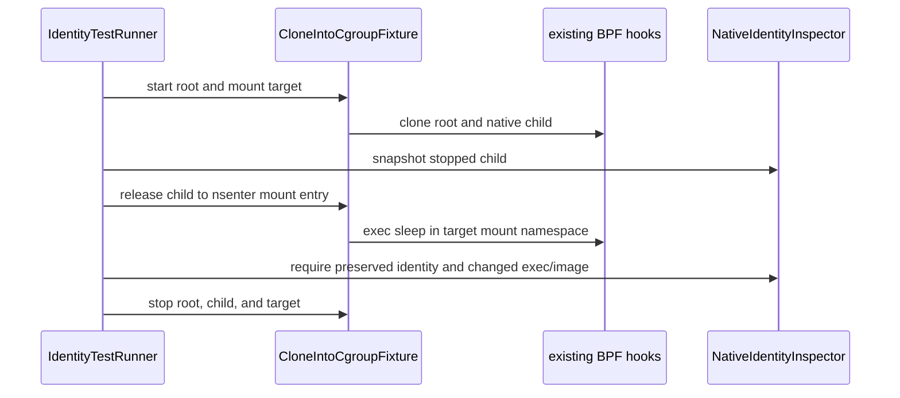

The existing [`task_alloc` hook](../../../bpf/erebor-interceptor/programs/identity_lifecycle.bpf.h#L35)
creates the child identity before it runs. The existing
[`wake_up_new_task` hook](../../../bpf/erebor-interceptor/programs/identity_lifecycle.bpf.h#L181)
finalizes its coordinate. The existing
[`security_bprm_committing_creds` hook](../../../bpf/erebor-interceptor/programs/identity_exec.bpf.h#L677)
commits the new execution and image identity. This change does not alter those
hooks or their maps.

The physical VM used kernel `6.8.0-137-generic`. Its schema-8 JSON SHA-256 is
`a079d291aa17bf7a19d8ef281b37ce773f325e2a014014072e75d6761d34c161`.
The BPF object SHA-256 is
`69ee79417f875f7c7a7065d18e08918e9d9bc32359711b57013eba77879fbcbe`.
The physical runner and the root-only manual shell removed their pin, lease,
cgroup, node, fixture, and Kubernetes Namespace resources. This historical
evidence covers a labeled native child that enters one mount namespace. The
current entry-migration recheck below completes the Phase 2 identity scope.

## Manual VM Controller

Review this flow in this order:

1. [`manual.sh`](../../../crates/mithril-e2e/harness/vm/manual.sh) owns one
   local provider record. It accepts `start`, `ssh`, and `destroy`.
2. [`run.sh`](../../../crates/mithril-e2e/harness/vm/run.sh) handles
   `--manual`. It builds the node, inspector, and policy compiler in the
   mounted source. It installs K3s, `netstat`, and K9s. It does not run the
   qualification probes.
3. [`libvirt.sh`](../../../crates/mithril-e2e/harness/vm/providers/libvirt.sh)
   creates the VM, waits for a DHCP address, mounts the source read-only, and
   owns the SSH transport and exact domain destruction. `manual.sh` then
   removes the verified local work directory.
4. [`test.sh`](../../../crates/mithril-e2e/harness/vm/test.sh) checks the
   command contract and the normal DHCP-not-ready path.

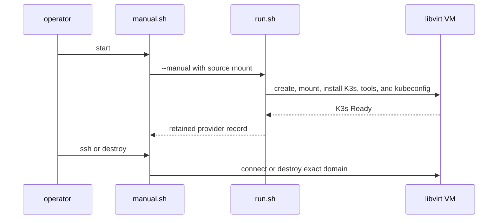

The controller stores the provider record under the local XDG state directory.
The operator does not enter a domain name or a provider work directory.
The runner installs `kubectl` and `crictl` in the guest PATH. It installs the
K3s configuration for `ubuntu` and `root`. K9s uses the same configuration.
The guest environment file sets only the mounted Mithril source and binaries.
It also provides `netstat` and K9s.
Manual scripts start `mithril-node` on the guest host. They do not deploy
Mithril into Kubernetes.

The current working tree was verified in one disposable VM. The guest mounted
the source as read-only. K3s was active. `kubectl get nodes`, `crictl info`,
`netstat -lnt`, and `k9s version` passed. The controller then destroyed the
guest. This is manual workflow proof. It is not a phase qualification result.

## Current-source update — 2026-08-15

This section supersedes older HTTP 400 and earlier-VM statements in this guide.
Those statements remain as historical diagnostics only.

### Review route for the current changes

1. Read [`KernelHostOwner::start`](../../../crates/erebor-interceptor/src/host.rs#L415).
   It takes the fixed host lease and the selected instance lease before it
   loads or attaches a fresh object. It then rejects retained Mithril LSM links
   outside the requested recovery root.
2. Read [`KernelHostOwner::recover`](../../../crates/erebor-interceptor/src/host.rs#L602).
   Recovery opens its expected pinned links, permits only their link IDs, and
   rejects another retained Mithril LSM link. It does not detach or reuse a
   foreign link.
3. Read [`commit_mount_reconciliation_proposal`](../../../bpf/erebor-interceptor/programs/identity_path.bpf.h#L217).
   The non-attached BPF command commits one exact proposal under the existing
   view spin lock. It accepts a DIRTY view or a CLEAN view from an older global
   generation. It rejects an UNKNOWN view, a current CLEAN view, pending work,
   a changed epoch, or a changed transition version.
4. Read [`NodePolicyGenerationOwner::reconcile_mount_views`](../../../crates/mithril-node/src/policy.rs#L595).
   The node writes a proposal, asks BPF to commit every view, reads every view
   back, and then publishes the global clean epoch. A workload file access is
   not an activation step.
5. Read the physical owners:
   [`IdentityTestRunner::physical_probe`](../../../crates/mithril-e2e/src/identity.rs#L269)
   and
   [`EffectTestRunner::physical_probe`](../../../crates/mithril-e2e/src/effect.rs#L639).
   They load the production object and check cleanup after each probe.
6. Read [`KernelHostOwner::start`](../../../crates/erebor-interceptor/src/host.rs#L415).
   Fresh pin directories now exist before the object attaches.
7. Read [`ControlPlane::register`](../../../crates/mithril-control/src/service.rs#L218).
   It preserves the nonce sequence ledger after a stream closes.
8. Read the [pre-PONR branch](../../../crates/mithril-e2e/src/identity.rs#L526).
   It snapshots one stopped native task before failure, after rollback, and
   after a later successful exec.
9. Read the CRI effect lane in
   [`guest.sh`](../../../crates/mithril-e2e/harness/vm/guest.sh#L520).
   It qualifies direct CRI and non-TTY `kubectl exec` tasks together.
10. Read the [stale-proposal branch](../../../crates/mithril-e2e/src/effect.rs#L2665).
    It rejects an old clean proposal after an external mount mutation.

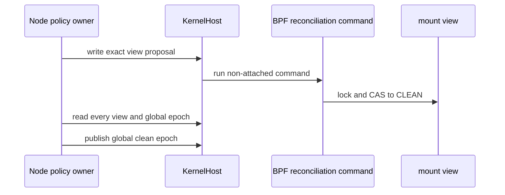

The reconciliation change adds no map, daemon, hook, or workload warmup. The
existing maps have these narrow current roles:

| Map | Writer | Reader | Lifetime |
| --- | --- | --- | --- |
| `mount_reconciliation_proposals` | Node policy owner | BPF reconciliation command | Pin-root lifetime; one exact view proposal. |
| `mount_security_views` and `mount_security_view_locks` | Node initializes; BPF mutation and reconciliation paths change state | BPF file path and node readback | Pin-root lifetime; the lock remains BPF-owned. |
| `mount_global_mutation_epoch`, `mount_global_pending_mutations`, and `mount_global_clean_epoch` | Node initializes; BPF mutation paths advance epoch and pending state; node publishes clean state last | BPF file path and node readback | Pin-root lifetime; `clean < epoch` denies exact access. |

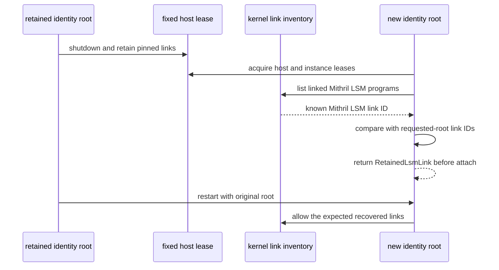

The host guard uses discovered kernel LSM link and program IDs. It compares the
kernel program-name width, not the longer source name. It rejects rather than
detaches an unknown link. The fixed host lease prevents a concurrent owner. The
retained-link check rejects a discovered Mithril LSM link that is not among the
requested-root IDs after a previous owner exits while its pins remain.

### Fresh pin transaction

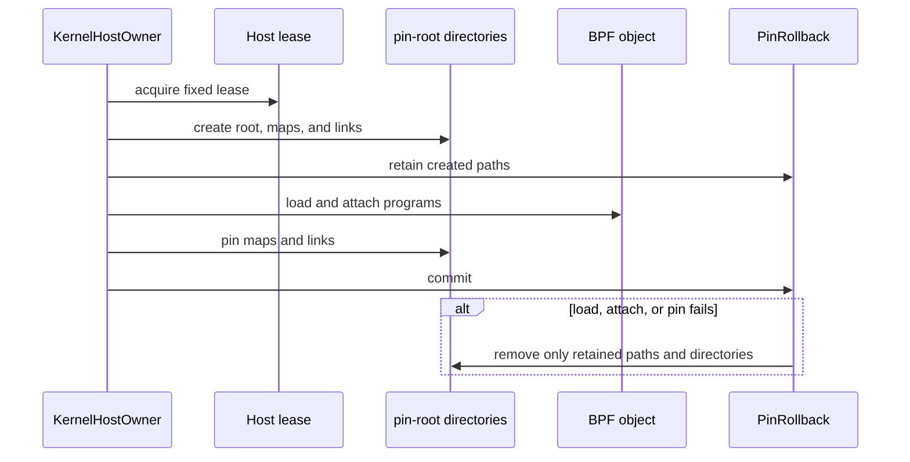

[`KernelHostOwner::start`](../../../crates/erebor-interceptor/src/host.rs#L415)
creates fresh directories through
[`prepare_fresh_pin_directories`](../../../crates/erebor-interceptor/src/host.rs#L905)
before `open.load()` attaches an LSM program.
[`PinRollback`](../../../crates/erebor-interceptor/src/host.rs#L1457) removes
only paths that this start owns. Recovery does not use this path.

### Current evidence and limits

The VM ran on x86_64 Linux `6.8.0-137-generic` with active LSM order
`lockdown,capability,landlock,yama,apparmor,bpf`. Runtime BTF SHA-256 is
`6da9f6b4ebcae9b07e6a717b517884abf7f6b524e46340e40fb164eed4a49a7c`.

| Probe | Result | Evidence SHA-256 |
| --- | --- | --- |
| Native identity | Passed. It checks cgroup-escape mismatch, distinct-root owner rejection, retained-link rejection after shutdown, original-root recovery, stable map IDs, reference release, and cleanup. | `dbf7bc49e4aedb22f38d261f0d51720e9bc71e79b9803d12cc74bdb39df4a7ff` |
| Effect OBSERVE | Passed. It checks exact observation, mount revalidation, external replacement fail-close, propagation, and cleanup. | `3317b52ede0b9d4ea4acd3b5ab3e4926d9d8edecad96a40801a7bcbed0ad275c` |
| Effect PROTECT | Passed. It checks pre-effect denial, held descriptors, io_uring, mount revalidation, external replacement fail-close, and cleanup. | `74dec05c7984076a908db509733b078492407a145298fee684e20ed1ef9cc8c6` |

The retained K3s VM also passed the CRI OBSERVE lane at source commit
`bd325aa`. A real `kubectl exec` task had task cookie 19 and a restricted
external-root classification. Its exact file read completed with
`WOULD_DENY`, `UNKNOWN_AFTER_PRE_EFFECT`, exact object key 7, and kernel
result 0. The lane removed its namespace, fixture, pin root, and Mithril links.

### Direct CRI exact-file qualification — 2026-08-15

At source `e38a117`, the retained x86_64 Linux `6.8.0-137-generic` VM ran the
production K3s CRI lane in `OBSERVE` and `PROTECT` mode. The staged guest
script SHA-256 was
`380fd7c73d33aefc320ff7919160db38c29be7d06b59f6dc51dd5b715fcf4018`.

The `OBSERVE` artifact is
`/tmp/mithril-phase3-direct-cri-evidence.eWjKKw/observe-clean.txt`, SHA-256
`c6cdd686dde59b84fa362b1c3e4e3d8e839bac44339081b8611cfc985057b994`.
Direct `crictl exec` task 19 and `kubectl exec` task 80 had the restricted
external-root classification. Both baseline reads succeeded. Each exact secret
event reported family 2, operation 2, key 7, `WOULD_DENY`,
`UNKNOWN_AFTER_PRE_EFFECT`, and kernel result 0. The task 80 benign read
reported key 8 and `EXACT_POLICY_ALLOW`.

The `PROTECT` artifact is
`/tmp/mithril-phase3-direct-cri-evidence.eWjKKw/protect-clean.txt`, SHA-256
`a3a5a16e8abc67e0d919b4650c62e0a1ce75c0df206c96028d93c8790351f8ab`.
Direct task 19 and `kubectl` task 80 had the same restricted external-root
classification. Both baseline reads succeeded. Each exact secret event
reported family 2, operation 2, key 7, `EXACT_POLICY_DENY`,
`DENIED_BEFORE_EFFECT`, and kernel result -13. The task 80 benign read
reported key 8 and `EXACT_POLICY_ALLOW`.

Both commands used `pipefail` and exited 0. Each postflight check found the
namespace, exact pin root, fixture root, and lane root absent. It found no
Mithril pin or process. Only unrelated BPF link 1 remained.

This closes only the direct-CRI exact-file row. It does not qualify projected
token behavior or the remaining manual matrix. Phase 3 remains **Blocked**.

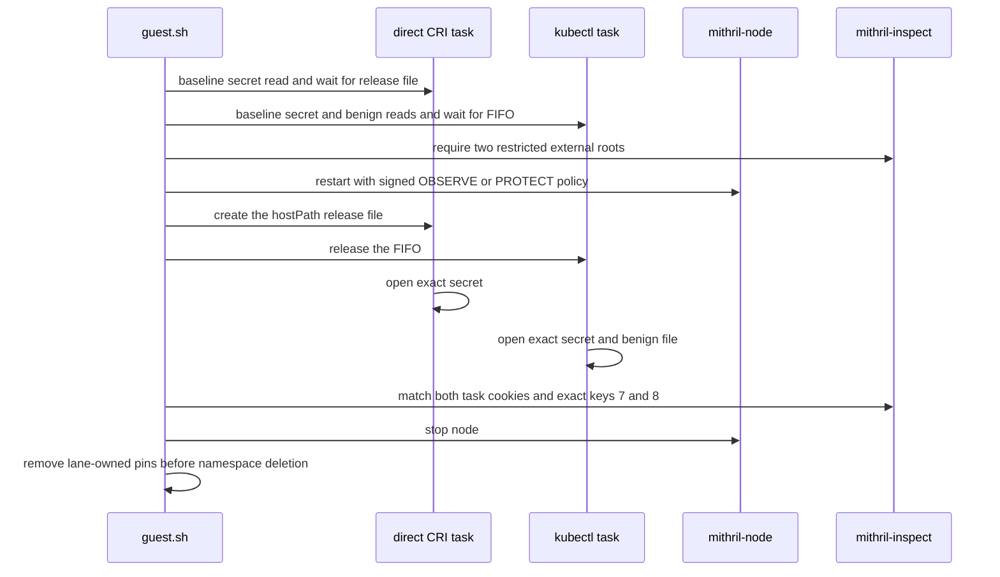

The direct task uses key `7`. The `kubectl` task also uses key `8` as its
legitimate control. In OBSERVE, key `7` reports `WOULD_DENY`. In PROTECT, key
`7` reports `EXACT_POLICY_DENY`. Key `8` reports `EXACT_POLICY_ALLOW` in both
modes. The lane removes its pin root before it deletes the namespace.

### Readable direct-CRI OBSERVE operator case — 2026-08-15

At source `4a6ff2b1cfafa9cf3310b30353d9417cc5b919c4`, an operator ran the
readable `cri-file-observe.sh` case against a fresh K3s CRI binding with a
run-scoped writable hostPath directory. The script exited 0. Its stdout
SHA-256 is
`f5ca9565f5f5b7976211043ebfb816d3cb1bc071fdcfd6d8ac2b0d1df40c6023`.

The script required `creator_task_cookie=null`,
`root_class=external_runtime_root`,
`installed_role_class=runtime_external_restricted`, and a positive task cookie.
It required the same cookie in an event with `family=2`, `operation=2`,
`reason=WOULD_DENY`, `result=UNKNOWN_AFTER_PRE_EFFECT`, and
`exact_object_key_id=7`. The probe opened the exact secret and completed the
scripted one-byte read attempt. The script does not assert `kernel_result`. The
Phase 3 result records the exact source, script, binary, policy, configuration,
manifest, and provenance hashes.

The script removed its node state. External cleanup removed the named Pods,
namespace, and fixture root. Final VM inspection found no named namespace,
fixture root, Mithril process, or Mithril BPF pin. Only unrelated BPF link 1
remained. Retain the named staging root only until nonsecret evidence is copied,
its hashes are verified, and scoped deletion is authorized. Then remove only
this root. Do not change its external symlink targets. This is one Phase 3
direct-CRI OBSERVE operator case. It does not complete the manual matrix. Phase
3 remains **Blocked**.

### Kubernetes entry identity — 2026-08-18

Review this path in order:

1. [`kubernetes-entry-workload-v1.yaml`](../../../crates/mithril-e2e/fixtures/identity/kubernetes-entry-workload-v1.yaml)
   defines one real Pod, one startup barrier, and one shared host directory.
   Its `PATH` lets the copy fixture place a bounded `tar` wrapper in that
   shared directory.
2. [`IdentityTestRunner::physical_kubernetes_probe`](../../../crates/mithril-e2e/src/identity.rs)
   accepts one prior schema-15 native bundle. It rejects a bundle that already
   contains any Kubernetes result.
3. The same runner creates the Namespace and Pod. It reads the full container
   ID, Pod UID, sandbox ID, image digest, creation generation, and live cgroup.
4. `WorkloadBindingOwner` publishes that exact CRI binding. The existing
   `KernelHostOwner` loads and owns the production object. The existing
   `NativeIdentityInspector` reads every task snapshot.
5. The runner holds direct CRI exec, non-TTY and TTY `kubectl exec`, and
   `kubectl cp` at file barriers. Each operation must have a distinct
   restricted external-root identity. The copy operation must also copy the
   exact source bytes.
6. The runner starts one CRI external shell that forks an identical command.
   The parent must be a restricted external root. The child must have the
   parent's task cookie as both its creator and real parent, no root or
   installed-role class, and the parent's active role.
7. [`mithril-identity-test`](../../../crates/mithril-e2e/src/bin/mithril_identity_test.rs)
   writes the combined JSON only after the runner returns.
8. [`identity-runtime.sh`](../../../examples/mithril-identity-manual/identity-runtime.sh)
   owns the manual node, Kubernetes target, CRI binding, pins, lease, and
   cleanup. The three new example shells each own only one operator scenario.
9. [`run.sh`](../../../crates/mithril-e2e/harness/vm/run.sh) and
   [`manual.sh`](../../../crates/mithril-e2e/harness/vm/manual.sh) own VM
   creation, SSH access, and destruction. They do not run example shells.

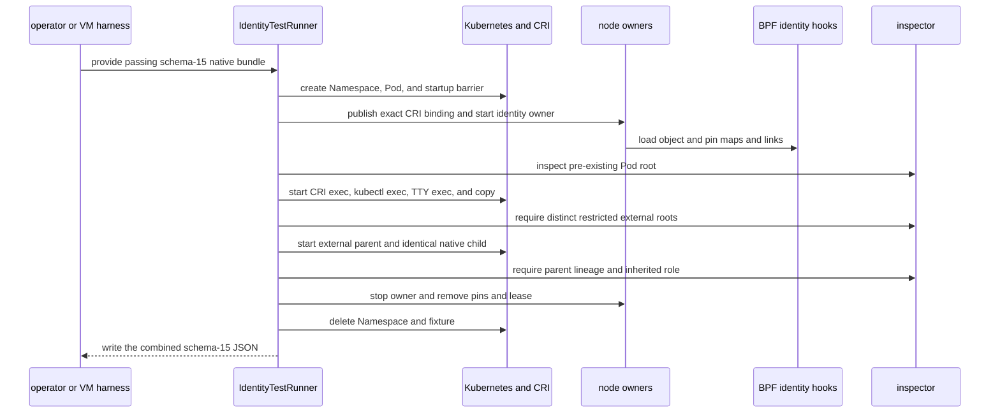

The pre-existing Pod root has no creator. It is
`restored_or_unknown_root` with `fail_closed_unknown`. Direct CRI exec,
non-TTY and TTY `kubectl exec`, `kubectl cp`, and the native child's parent
each have no creator. Each is an `external_runtime_root` with
`runtime_external_restricted` and role `11`. Their task cookies are `19`,
`71`, `123`, `175`, and `230`. The native child has task cookie `271`, creator
and real-parent cookie `230`, no root or installed-role class, and role `11`.
The runner does not infer purpose from command bytes, timing, TTY shape,
cgroup, or namespaces.

Source commit `53fbd287aad8b6012eb4f80dcd4fe83e34ed5470` ran the
Kubernetes-only extension in the retained x86_64 Ubuntu 24.04 VM on kernel
`6.8.0-137-generic`. Kubernetes `v1.35.5` used the K3s
`v1.35.5+k3s1` distribution. The physical JSON path is
`/tmp/mithril-phase2-kubernetes-entry-exec-20260818-025/identity-physical-probe.json`.
Its SHA-256 is
`ef749b5a6d2521c6bd865317ce3843bf685610d009500f6d37569c9bd26a57cc`.
The workload manifest SHA-256 is
`6acba20b7b171c35a7140491aa87cf9e36530fc85c3a6abaee3aff4eda73cc95`.
The BPF object SHA-256 is
`3269516fcd2714ab7fbe29df26386c40f0c912b6284007b641d8bbf68842b876`.

The retained VM ran
[`kubernetes-exec-tty.sh`](../../../examples/mithril-identity-manual/kubernetes-exec-tty.sh),
[`kubernetes-copy.sh`](../../../examples/mithril-identity-manual/kubernetes-copy.sh),
and
[`kubernetes-native-child.sh`](../../../examples/mithril-identity-manual/kubernetes-native-child.sh)
consecutively as root. Their SHA-256 values are
`d5e97f6f0335bfe3e8515045ed9ae1d4e9c2125642080d390f983ab3a4c64415`,
`d4eecdaacdf918d5637632c7b6e2330109653668a90b4caed5080a8c713473ad`,
and
`89d10a01b104c4f5d2bffaee572ccf30d4469ea05ba13af04c7460d4fe469a14`.
Each script printed `PASS`. Postflight found no case Namespace, fixture, pin,
lease, cgroup, node process, or loaded Erebor Interceptor program. The manual
harness destroyed the VM, and `virsh list --all --name` was empty.

This result completes `ENTRY-EXEC-001` and `ENTRY-START-001`. The earlier
result completes `ENTRY-EXEC-002`. The initial root proves a late-discovery
gap with conservative identity, not first-instruction observation. Phase 4
owns approved administrative exec and the start-gap effect result. Other open
rows keep Phase 2 **Blocked**.

### Kubernetes lifecycle sleep — 2026-08-18

Review this path in order:

1. [`kubernetes-lifecycle-sleep-workload-v1.yaml`](../../../crates/mithril-e2e/fixtures/identity/kubernetes-lifecycle-sleep-workload-v1.yaml)
   defines one real Pod and a 30-second native Kubernetes lifecycle `sleep`
   action.
2. [`IdentityTestRunner::physical_kubernetes_lifecycle_sleep_probe`](../../../crates/mithril-e2e/src/identity.rs)
   finds the exact live container through CRI, resolves its cgroup, and reads
   `cgroup.procs` while the Pod is not Ready.
3. [`identity-runtime.sh`](../../../examples/mithril-identity-manual/identity-runtime.sh)
   owns the manual Namespace, Pod, temporary paths, and cleanup.
   [`kubernetes-lifecycle-sleep.sh`](../../../examples/mithril-identity-manual/kubernetes-lifecycle-sleep.sh)
   owns the readable operator scenario.
4. [`run.sh`](../../../crates/mithril-e2e/harness/vm/run.sh) copies the fixture
   for automated VM runs. `manual.sh` owns VM creation, SSH access, and
   destruction. Neither harness reads or runs the example shell.

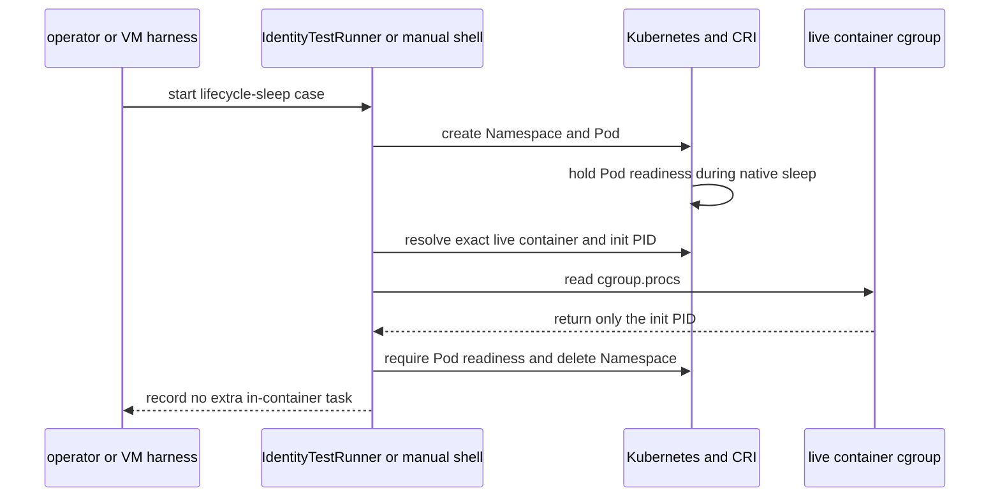

The implementation uses the existing physical bundle. Schema 16 adds only
`kubernetes_lifecycle_sleep_no_task`; it adds no map, role, generic runner, or
durable owner. The oracle is kernel-visible task membership, not an inferred
Kubernetes purpose. A pass requires exactly one cgroup task, and that task must
be the CRI-reported container init PID while the Pod is not Ready.

Source commit `828fdec76c5753790c526d87e6757fde6134002e` produced the
accepted schema-16 JSON at
`/tmp/mithril-phase2-kubernetes-sleep-20260818-029/identity-physical-probe.json`.
Its SHA-256 is
`a62e82352a3153c65895d69265e4e0265d78ec6a76679e50a7d1f0bbcc2804fb`.
The retained physical VM also ran `kubernetes-lifecycle-sleep.sh` as root from
that commit. The shell printed one init PID, the same single cgroup task, and
`PASS`. Automated and manual cleanup removed the Namespace, fixture, pin,
lease, cgroup, node process, and loaded Erebor Interceptor programs. The VM was
destroyed, and `virsh list --all` was empty.

This completes `ENTRY-SLEEP-001`. The exact limit is one native Kubernetes
lifecycle `sleep` action. The result does not qualify exec probes, network
probes, identity purpose, role, or policy. Other open rows keep Phase 2
**Blocked**.

### Kubernetes network probes — 2026-08-18

Review this path in order:

1. [`kubernetes-network-probes-workload-v1.yaml`](../../../crates/mithril-e2e/fixtures/identity/kubernetes-network-probes-workload-v1.yaml)
   defines real HTTP, TCP, and gRPC readiness probes in one Pod. It pins the
   test image by digest.
2. [`IdentityTestRunner::physical_kubernetes_network_probe`](../../../crates/mithril-e2e/src/identity.rs)
   waits for all three containers to become Ready without restart. It resolves
   each exact live container and init PID through CRI.
3. [`IdentityTestRunner::kubernetes_network_probe_container_no_task`](../../../crates/mithril-e2e/src/identity.rs)
   samples each live cgroup every 10 ms for four seconds. Every sample must
   contain only the CRI-reported init PID.
4. [`identity-runtime.sh`](../../../examples/mithril-identity-manual/identity-runtime.sh)
   owns the manual Namespace, Pod, temporary paths, and cleanup.
   [`kubernetes-network-probes.sh`](../../../examples/mithril-identity-manual/kubernetes-network-probes.sh)
   owns the readable operator scenario. `manual.sh` owns VM creation, SSH, and
   destruction and does not run the example.

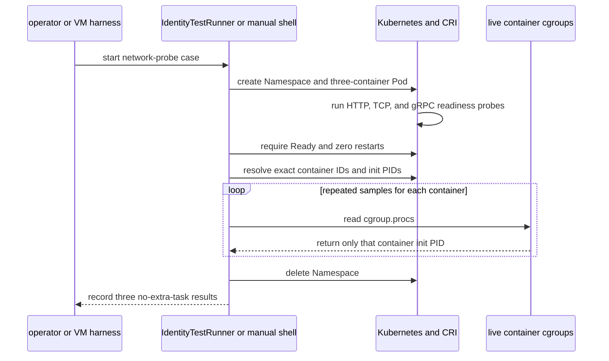

The implementation uses the existing physical bundle. Schema 17 adds three
optional booleans. It adds no map, role, generic runner, or durable owner. The
oracle is kernel-visible task membership. It does not infer purpose from a
network probe or claim that the application received the probe.

Source commit `f9b7c8bc2be84f2a39f3db7b43dae3ab1914c0d0` produced the
accepted schema-17 JSON at
`/tmp/mithril-phase2-kubernetes-network-20260818-033/identity-physical-probe.json`.
Its SHA-256 is
`cbc024f56ce366a84aa2b0ffdbb7efaab58599b282d1f24295f30c08702fac07`.
The retained physical VM also ran `kubernetes-network-probes.sh` as root from
that commit. The shell printed one init PID and the same single cgroup task for
each probe container, then printed `PASS`. Automated and manual cleanup removed
the Namespace and fixture. Postflight also found no Mithril pin, lease, cgroup,
node process, or loaded Erebor Interceptor program. The VM was destroyed, and
`virsh list --all` was empty.

This completes `ENTRY-NETPROBE-001`. The exact limit is native HTTP, TCP, and
gRPC readiness probes that created no extra in-container task. The result does
not qualify network flow, application receipt, purpose, role, or policy. Other
open rows keep Phase 2 **Blocked**.

### Kubernetes container identities — 2026-08-18

Review this path in order:

1. [`kubernetes-containers-workload-v1.yaml`](../../../crates/mithril-e2e/fixtures/identity/kubernetes-containers-workload-v1.yaml)
   defines one regular init, one restartable init used as a native sidecar, and
   one application in a shared Pod sandbox and host-backed volume.
2. [`IdentityTestRunner::physical_kubernetes_containers_probe`](../../../crates/mithril-e2e/src/identity.rs)
   binds the live init and sidecar, records both roots, releases the init gate,
   and then binds and records the application root.
3. [`NativeIdentityInspector`](../../../crates/mithril-node/src/identity/inspection.rs)
   exposes the existing task-label execution-set ID in the existing physical
   snapshot. No kernel state changes for this evidence field.
4. [`identity-runtime.sh`](../../../examples/mithril-identity-manual/identity-runtime.sh)
   owns the manual Pod, CRI bindings, two node lifetimes, pins, lease, and
   cleanup. [`kubernetes-containers.sh`](../../../examples/mithril-identity-manual/kubernetes-containers.sh)
   owns the operator sequence. `manual.sh` owns only the VM lifecycle.

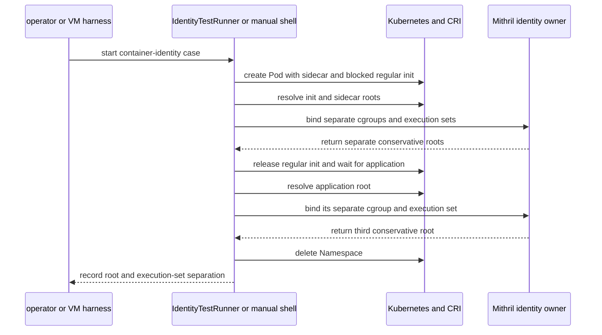

The implementation uses the existing physical bundle. Schema 18 adds three
optional task snapshots and one distinctness boolean. The snapshot exposes the
execution-set ID already present in `TaskLabelV1`. The change adds no map, role,
generic runner, durable owner, or kernel state.

Source commit `6e23a23e327f70b3462faf932b0845f7e52ec67f` produced the
accepted schema-18 JSON at
`/tmp/mithril-phase2-kubernetes-containers-20260818-034/identity-physical-probe.json`.
Its SHA-256 is
`dfb7b407b8a945c474a210fb769abbc09b03599ecb271f4c27cb9d195da92ada`.
The root task cookies are `12`, `5`, and `19`. Their execution-set IDs end in
`01`, `02`, and `03`. Each root is `restored_or_unknown_root` with
`fail_closed_unknown`; the fixture makes no false first-instruction claim.

The retained physical VM also ran `kubernetes-containers.sh` as root from that
commit. The shell printed the three distinct task and execution-set identities
and `PASS`. Automated and manual cleanup removed the Namespace, fixture, pin,
lease, cgroup, node process, and loaded Erebor Interceptor programs. The VM was
destroyed, and `virsh list --all` was empty.

This completes `ENTRY-CONTAINERS-001`. The exact limit is root and execution-
set separation for a regular init, native sidecar, and application in one Pod.
The result does not qualify shared-network or shared-volume relationships or
policy. Other open rows keep Phase 2 **Blocked**.

### Kubernetes ephemeral identity — 2026-08-18

Review this path in order:

1. [`kubernetes-ephemeral-workload-v1.yaml`](../../../crates/mithril-e2e/fixtures/identity/kubernetes-ephemeral-workload-v1.yaml)
   defines one application Pod with a shared process namespace.
2. [`IdentityTestRunner::physical_kubernetes_ephemeral_probe`](../../../crates/mithril-e2e/src/identity.rs)
   patches the real ephemeral-container subresource, resolves both live CRI
   containers, publishes their separate bindings, and records both roots.
3. [`WorkloadBindingOwner`](../../../crates/mithril-node/src/identity/binding.rs)
   publishes the existing per-cgroup execution-set and profile bindings. The
   shared PID namespace does not change this owner.
4. [`identity-runtime.sh`](../../../examples/mithril-identity-manual/identity-runtime.sh)
   owns the manual Pod, CRI bindings, node, pins, lease, and cleanup.
   [`kubernetes-ephemeral.sh`](../../../examples/mithril-identity-manual/kubernetes-ephemeral.sh)
   owns the operator sequence. `manual.sh` owns only the VM lifecycle.

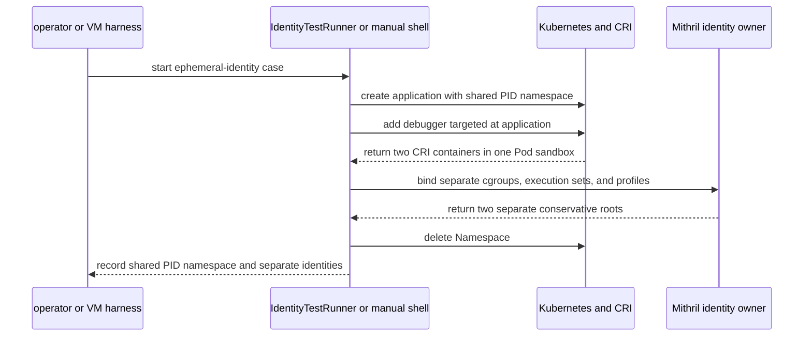

The implementation reuses the existing physical bundle. Schema 19 adds two
optional task snapshots and two result booleans. It adds no map, role, generic
runner, durable owner, or kernel state.

Source commit `76d0145c2ecd7991ab7160773faf452c383df6a9` freezes the
source bytes that produced the accepted schema-19 JSON at
`/tmp/mithril-phase2-kubernetes-ephemeral-20260818-035/identity-physical-probe.json`.
Its SHA-256 is
`ee12bc57c8431ac801ae6e06e2e55dbf75ec50692b3a594785fc0d27fabf0efc`.
The application and ephemeral task cookies are `5` and `12`. Their execution-
set IDs end in `01` and `02`, and their profile generation references are `7`
and `8`. Both roots are `restored_or_unknown_root` with
`fail_closed_unknown`; the fixture makes no false first-instruction claim.

The retained physical VM also ran `kubernetes-ephemeral.sh` as root from the
same source bytes. It printed the two distinct identities, their shared PID-
namespace inode, and `PASS`. Automated and manual cleanup removed the
Namespace, fixture, pin, lease, cgroup, node process, and loaded Erebor
Interceptor programs. The VM was destroyed, and `virsh list --all` was empty.

This completes `ENTRY-EPHEMERAL-001`. The exact limit is separate root,
process, execution-set, and profile identity for one targeted ephemeral
container in the application's PID namespace. The result does not qualify
shared-namespace relationships or policy. Other open rows keep Phase 2
**Blocked**.

### Retained alias and mount evidence — 2026-08-15

At source `5b1abfa984d0`, a retained x86_64 VM ran the existing
[`EffectTestRunner::physical_probe`](../../../crates/mithril-e2e/src/effect.rs#L639)
owner in `PROTECT` mode with unique pin-root, lease, cgroup, fixture, and
output paths. The JSON artifact SHA-256 is
`9cfda0507593f4b2b2ca040d58f2bb03d922bbf2cc0f93d182ec746859157dca`.
The binary SHA-256 is
`8426f68d285187e74e39bfadadeb57c3595a944a200001df639a685116bbfd1b`.
The embedded BPF object SHA-256 is
`69ee79417f875f7c7a7065d18e08918e9d9bc32359711b57013eba77879fbcbe`.

The record has `bind_alias_canonicalized=true`,
`mount_stale_proposal_failed_closed=true`,
`protected_mount_race_denied=true`,
`external_mount_replacement_failed_closed=true`, and
`exact_object_restored_after_reconciliation=true`. It also has
`mount_propagation_reached_peer=true`,
`mount_propagation_all_views_failed_closed=true`,
`mount_propagation_reconciled=true`,
`mount_setattr_global_invalidation=true`, and
`mount_setattr_reconciled=true`. The cleanup fields
`pin_root_removed=true`, `lease_removed=true`, `cgroup_removed=true`, and
`fixture_root_removed=true`. Postflight found no unique Mithril state or
Mithril/Erebor process. Only the unrelated `hid_tail_call` BPF link remained.

This is physical evidence for the implemented alias and mount-CAS slice. It
does not replace a fresh full-harness qualification. Phase 4 remains
**Not done**. The administrative runc bootstrap sequence remains unsupported;
do not add a broad runc, pipe, or socket exception.

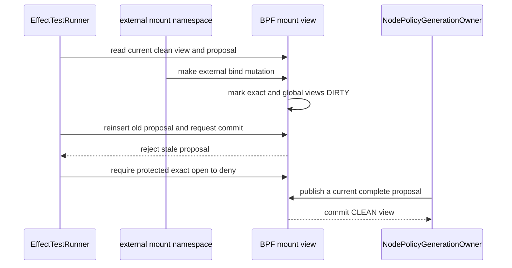

[`ExternalMountNamespace`](../../../crates/mithril-e2e/src/effect/support.rs#L490)
creates the external mutation. The runner reads the old proposal, reinserts it,
and requires
[`KernelHost::apply_mount_reconciliation_proposal`](../../../crates/erebor-interceptor/src/host.rs#L1246)
to reject it. Only the current node reconciliation may restore the exact result.

The automatic probe does not replace the full qualification matrix. The
checked registry now contains the digest-bound Appendix C fixture IDs,
required family membership, and canonical golden inputs. The architecture
closure, golden, identity, and profile-simulation tests pass against those
inputs. The fresh x86_64 qualification record at
`spec/qualification/v1/results/kernel-qualification-x86_64.json` records
kernel `6.8.0-137-generic`, 41 LSM programs, and the current ABI, BPF source,
object, probe, and benchmark digests. `mithril-kernel-qualification verify`
passes for that record. The final repository CI command still needs to run.

The administrative transaction now reaches draft creation, admission, and slot
arm. Stock runc `1.4.2` then executes a sealed self-clone and uses inherited
bootstrap channels that have no exact-object or typed-channel authority. The
BPF program denies them as `UNSUPPORTED_OBJECT`, and the slot remains armed.
Do not add a broad runc, pipe, or socket exception. Support requires a separate
signed, typed runtime-bootstrap protocol with an exact helper identity and a
bounded helper-to-target handoff.

The optional Landlock deliverable is complete as `ABSENT`. The node reports
`LANDLOCK_TARGET_CONTEXT_FLOOR=ABSENT` with reason
`NO_QUALIFIED_TARGET_CONTEXT_INSTALL`. Local BPF enforcement does not depend on
Landlock.

Treat a source-backed hard denial as a safety floor. Do not treat it as a
positive policy-support result. Treat a unit or source-contract test as code
evidence. Do not treat it as a privileged physical result.

### Double-fork native-child source review

Source change `6190ca7` adds the double-fork branch of the existing native
identity probe. The isolated privileged probe ran at source commit
`2f3dad0081377651a8d2b52ca9479439ac7176b0`; the identity, BPF, and inspector
paths were unchanged from `6190ca75641cb73d585712e2900afb520576db26`. Its
result JSON SHA-256 is
`e69b94754c479ceeddaf55d847b4d89d870793cf30d5a0139eead12fc28c4f64`, and its
BPF object SHA-256 is
`69ee79417f875f7c7a7065d18e08918e9d9bc32359711b57013eba77879fbcbe`. The
outer root, intermediate child, and grandchild had task cookies `57`, `60`,
and `66`. After the intermediate exited, the grandchild kept cookie `66` and
creator cookie `60`; its real parent changed from `60` to `0`, and its
real-parent interval changed from `1` to `2`. The runner reported
`pin_root_removed=true`, `lease_removed=true`, `cgroup_removed=true`, and
`profile_task_refs_after_exit=0`. This qualifies only the double-fork subcase;
Phase 2 remains **Blocked**.

Review this narrow path in order:

1. [`IdentityTestRunner::physical_probe`](../../../crates/mithril-e2e/src/identity.rs#L269)
   creates the existing protected cgroup and starts the double-fork fixture.
   It captures the outer root, intermediate native child, and stopped native
   grandchild before the intermediate exits.
2. [`NativeProcessFixture::start_double_forking`](../../../crates/mithril-e2e/src/identity.rs#L1114)
   creates the chain. The outer task waits for the intermediate and then
   remains live. The intermediate waits for its stopped child. The child
   executes `sleep` only after the test releases its pidfd.
3. [`create_native_child`](../../../bpf/erebor-interceptor/programs/identity_task_helpers.h#L435)
   writes one immutable `created_by_edges` row for each native child. The
   grandchild therefore names the intermediate task cookie, not the outer
   root cookie.
4. [`refresh_real_parent`](../../../bpf/erebor-interceptor/programs/identity_task_helpers.h#L270)
   compares the live kernel parent coordinate at the next effect or exec. A
   changed coordinate closes the old interval and creates the next interval.
5. [`NativeIdentityInspector::snapshot`](../../../crates/mithril-node/src/identity/inspection.rs#L54)
   reads the immutable creator edge and current real-parent interval from the
   existing maps. It adds no userspace parent inference.
6. [`native_process_fixture_reparents_double_fork_child_before_exec`](../../../crates/mithril-e2e/src/identity.rs#L1699)
   checks the local process topology before the privileged runner uses it.

The physical assertion keeps the grandchild task cookie and immutable creator
edge after the intermediate exits. It requires a different current real-parent
record, a higher real-parent interval sequence, a new active execution, and
the inherited restricted role. It does not treat the outer task as the new
real parent. Linux can reparent to another live kernel parent, and the BPF
record preserves that kernel fact without assigning it an authority role.

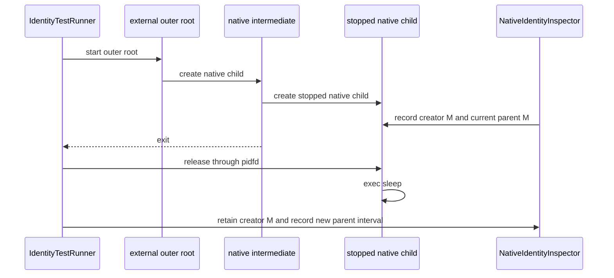

The immutable creator edge is not a current-parent inference. The inspector
reads the stored creator edge and the current interval after the child execs.

### Moved-parent ordinary-fork source review

Source change `8dbd9f5910cceeb9155a2701f47bbdfe25f58d25` adds the source-backed
check for `ID-MOVED-PARENT-FORK-004`. It reuses the existing protected
`CloneIntoCgroupFixture`, inspector, and physical-probe bundle. It adds one
boolean result. The later VM qualification is below. Phase 2 remains
**Blocked**.

Review this narrow path in order:

1. [`IdentityTestRunner::physical_probe`](../../../crates/mithril-e2e/src/identity.rs#L269)
   starts the existing labeled root, moves it to the parent cgroup, and
   requires the restricted fail-closed snapshot. It then resumes the root and
   requires a second placement-mismatch count.
2. [`CloneIntoCgroupFixture::moved_parent_fork_denied`](../../../crates/mithril-e2e/src/identity/clone3.rs#L106)
   waits for the root to exit with `EACCES`. Before that exit, it rejects a
   visible child. The fixture cleanup retains pidfd ownership of an unexpected
   child.
3. [`run_child`](../../../crates/mithril-e2e/src/identity/clone3.rs#L185)
   makes the ordinary `fork`. A child would stop for inspection. A failed
   `fork` exits with its errno. Therefore, the required childless `EACCES`
   exit is the fixture's physical oracle.
4. [`erebor_task_alloc`](../../../bpf/erebor-interceptor/programs/identity_lifecycle.bpf.h#L35)
   checks the labeled creator before it creates the child. It calls the
   fail-closed denial when the active binding does not match the label.
   [`binding_matches_label`](../../../bpf/erebor-interceptor/programs/identity_maps.h#L1029)
   requires an active binding with the exact label binding ID and nonce.
5. [`NativeSecurityStateOwner::activate_with_effect_policy`](../../../crates/mithril-node/src/identity/native.rs#L40)
   configures the identity denial as `EACCES`.
6. [`clone_into_cgroup_fixture_recognizes_childless_eacces_exit`](../../../crates/mithril-e2e/src/identity/clone3.rs#L216)
   checks the fixture status oracle without a privileged host.

`cargo test -p mithril-e2e clone_into_cgroup_fixture_recognizes_childless_eacces_exit --all-features`,
the existing native-process fixture tests, and
`bash .github/scripts/verify-rust-ci.sh` passed. This is source-test evidence,
not physical qualification. The manual catalog retains the fixture row. No
manual procedure was added because the existing scripts do not create this
controlled fixture.

### Moved-parent ordinary-fork physical qualification

The isolated identity probe passed at source commit
`bd48b5a474273510c92611fa90285632883d13cb`. The copied
`mithril-identity-test` binary SHA-256 was
`5bf7300dc74ff6792727210a3d4907dfb50cf1fe32ca855ab40f2db815c288d1`. The
result JSON is
`/tmp/mithril-phase2-moved-parent-bd48b5a47427/identity-physical-probe.json`.
Its SHA-256 is
`82a525950ccf1a78d8be29307f2cf479eb28901a016d48e9404bdece982f3216`.

The repaired normal native child had task cookie `28`. Its active execution
changed from `0000000000000001000000000000001d` to
`00000000000000010000000000000023`. Its image provenance changed from
`0000000000000001000000000000001b` to
`00000000000000010000000000000024`. Both snapshots were active. The final
snapshot had no exec guard.

The runner moved the labeled root to the parent cgroup and observed the
fail-closed state. When it resumed the root, the ordinary `fork` exited with
`EACCES`. The fixture rejected a visible child before that exit. The runner
also required the placement-mismatch count to increase again after the
cgroup-move mismatch. The JSON records `moved_parent_fork_denied=true` and
`cgroup_escape_placement_mismatch_detected=true`.

The JSON records `map_ids_stable_across_restart=true`,
`profile_task_refs_after_exit=0`, and
`live_manifest_mismatch_detected=true`. It records
`pin_root_removed=true`, `lease_removed=true`, and `cgroup_removed=true`.
Postflight found the dedicated pin root, lease, and cgroup absent. Only the
unrelated tracing BPF link remained.

This is physical evidence for `ID-MOVED-PARENT-FORK-004` only. A readable
manual script was not added. It cannot reproduce the fixture-controlled cgroup
move without creating a separate runtime. Phase 2 remains **Blocked**.

### Moved-native-task exec physical qualification

The isolated identity probe passed at source
`0c25e8c84a94d4a632e1f44efd50befbbe37f420`. The copied
`mithril-identity-test` binary SHA-256 was
`ab212876b1cca4a38255a64a09b0c56c0831bef513b11ce6dc12a19b83c56404`. The
preserved JSON is
`/tmp/mithril-phase2-moved-task-0c25e8c84a94-39721.identity-physical-probe.json`.
Its SHA-256 is
`dc116ae01389e131232f8d3c0d850b23f716cfed9309c338edaea5077cb0a854`.

The JSON has schema version `4` and `moved_task_exec_denied=true`. The normal
native child kept its task cookie across exec, changed active execution and
image provenance, and ended Runnable with no exec guard. The runner moved only
the stopped labeled child to the parent cgroup. It observed
`FailClosedUnknown`, then required a second placement-mismatch increase and a
failing outer shell before five seconds. A later `sleep` exec cannot satisfy
that oracle.

The JSON records pin-root, lease, and cgroup cleanup as true. Postflight found
the primary, alternate, and retired pin roots, cgroup, lease, and lane root
absent. Only the unrelated tracing BPF link remained. This is physical evidence
for `ID-MOVED-TASK-EXEC-005` only. Phase 2 remains **Blocked**.

### Entry-migration host-task cgroup-entry subcase

The same physical JSON also proves one narrow `ENTRY-MIGRATE-001` identity
subcase. At source `0c25e8c84a94d4a632e1f44efd50befbbe37f420`, which contains
`5d5518e95350b364bc6bb5da58d3e0c13ea561d5`, the runner starts a host shell
outside the configured cgroup and moves its PID into that cgroup. It requires
no creator cookie, `external_runtime_root`, `runtime_external_restricted`, the
configured external role, and `Runnable`. The JSON records those values in
`external_root`.

This is physical evidence for host-task cgroup-entry identity only. It does
not run `nsenter`, restore, or a protected effect. It does not complete
`ENTRY-MIGRATE-001`. Phase 2 remains **Blocked**.

### Entry-migration manual VM qualification

At source commit `e6352f8`, the retained x86_64 Ubuntu 24.04 VM ran
[`nsenter-move.sh`](../../../examples/mithril-identity-manual/nsenter-move.sh).
The shell SHA-256 was
`871f3dc975a31cf423a97296462581a16a224d16650270ca59f962ffdbb5adec`.

The shell calls `identity_prepare_k3s_case`. That shared owner creates the
Pod, exact CRI binding, node configuration, pin root, lease, and cleanup list.
The shell starts the real node. It starts one namespace-only `sleep 300` child,
proves that the child has no task identity, and moves only that child into the
configured cgroup. The final inspector record had no creator cookie,
`external_runtime_root`, `runtime_external_restricted`, active role `2`, and
`Runnable` coordinate state `3`.

The same VM ran `IdentityTestRunner::physical_probe` with unique paths. Its
JSON SHA-256 was
`91990138176e69b729f043b3f9e349fffa259f6bf36e9edbfdfd53405722ac2b`. The
runner records the host-entry control and `CloneIntoCgroupFixture` external
root. It records removal of its pin root, lease, and cgroup.

Postflight found no case namespace, fixture directory, Mithril pin, node
process, lease, or cgroup. This historical result adds the namespace-entry and
cgroup-move subcase. It did not prove labeled-task namespace movement. The
current recheck below supplies that result.

### Current entry-migration recheck

At source commit `ff129206ca610689c68b1de475b982f6e86ea97e`, the retained
x86_64 Ubuntu 24.04 VM ran the two current operator commands as root:

```sh
examples/mithril-identity-manual/nsenter-move.sh
examples/mithril-identity-manual/nsenter-move.sh --labeled-task
```

The first command proved no task identity before cgroup movement, then the
restricted external-root identity after movement. The labeled command proved
that child task cookie `18`, creator and real-parent cookie `12`, process state
`00000000000000010000000000000016`, and active role `2` survived mount
namespace entry. Its execution and image IDs changed. Both commands printed
`PASS` and removed their owned resources.

The existing physical runner also exercised
[`CloneIntoCgroupFixture`](../../../crates/mithril-e2e/src/identity/clone3.rs#L18)
in the source state committed as `ff12920`. Its schema-13 JSON SHA-256 was
`54f7a3a61d3831fabefbf1ccce14f4f72704684b454f9e90423a5a77f95a0911`.
The JSON records preserved child task, creator, parent, and process identity,
changed execution and image identity, and complete pin, lease, cgroup, and task
reference cleanup. The retained VM was destroyed after postflight; its provider
listed no remaining guest.

This rechecks only the existing identity path. It adds no BPF map, program,
role, runner, or durable type. It completes the Phase 2 identity scope of
`ENTRY-MIGRATE-001`. Phase 4 owns protected effects. Phase 12 owns checkpoint
restore through `ENTRY-RESTORE-001`.

### Pre-PONR failed-exec physical qualification

At source commit `af685cd6a8dd73f22bd44234b3346298dd04dcd1`, the isolated
[`IdentityTestRunner::physical_probe`](../../../crates/mithril-e2e/src/identity.rs#L269)
passed. The copied `mithril-identity-test` binary SHA-256 was
`b23d8be165d9b88532dcd15db1905233134a86a2be8f7f40042e508a302c49a0`. The
schema-5 result JSON is
`/tmp/mithril-phase2-preponr-af685cd.9897yN/identity-physical-probe.json`.
Its SHA-256 is
`8a57d0a43b7fe505da68f0644237720e8419145a942ae9173ab643b1c8c6cf45`.

The runner stopped a native Bash child before its baseline snapshot. It
required no `pending_execs` entry, then caused an ELF loader failure after exec
preparation and before the point of no return. The before and post-failure
snapshots had the same task cookie `44`, creator and real-parent cookie `41`,
process state `00000000000000010000000000000030`, active execution
`00000000000000010000000000000033`, image provenance
`00000000000000010000000000000034`, and active role `11`. The process
execution and process-state vector were active. The exec guard was none.
`pre_ponr_failed_exec_restored=true` records that result.

The later normal exec kept the task, creator, real parent, process state, and
role. It changed active execution to
`00000000000000010000000000000039` and image provenance to
`0000000000000001000000000000003a`. Its process execution and process-state
vector were active, and its exec guard was none. The cleanup fields
`pin_root_removed`, `lease_removed`, and `cgroup_removed` are true, and
`profile_task_refs_after_exit=0`. Postflight found the run staging root absent.
Only the unrelated tracing BPF link remained.

The readable companion is
[`native-child.sh --failed-exec`](../../../examples/mithril-identity-manual/native-child.sh).
It requires `/bin/bash`, `python3`, and a dynamically linked `/bin/true` in
the selected workload. This is only the pre-PONR recovery subcase of
`EXEC-COMMIT-STATE-001`. It does not qualify post-PONR fatal or unknown
handling, concurrent or non-leader exec, or the full fixture. Phase 2 remains
**Blocked**.

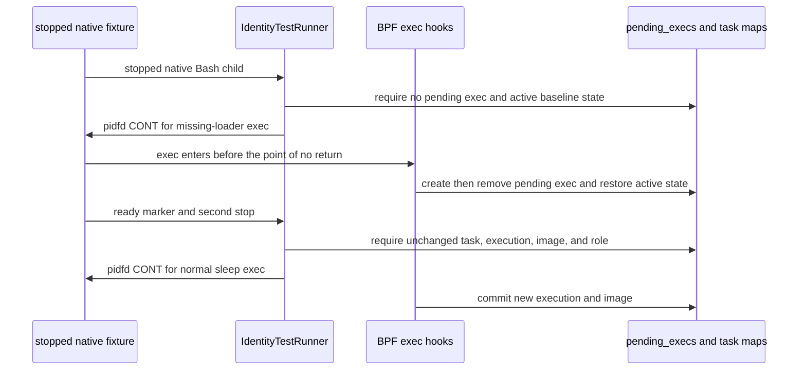

The fixture uses a stopped child to remove the setup-exec race. The failed exec
must leave no pending entry. The later successful exec must change only the
execution and image identities that the runner checks.

This guide is explanatory only. The authoritative scope and acceptance records
remain the phase documents and the readable architecture:

- [Master plan](./README.md)
- [Readable architecture](./policy-and-protection-algorithm-architecture-readable.md)
- [Phase 0 result](./phase-0-substrate-license-abi-and-incident-baseline.md)
- [Phase 1 result](./phase-1-one-binary-node-chassis.md)
- [Phase 2 result](./phase-2-exact-native-identity.md)
- [Phase 3 result](./phase-3-effect-observation-and-profile-simulation.md)
- [Phase 4 result](./phase-4-signed-local-pre-effect-enforcement.md)

## What to review, in order

Start at an owner boundary, not in a BPF helper. The following path gives the
smallest complete explanation of who does what.

| Order | Open this code first | What to establish before continuing |
| --- | --- | --- |
| 1 | [`mithril-node` main](../../../crates/mithril-node/src/main.rs#L22) | The CLI loads `NodeConfig` and starts one `NodeChassis`. It does not load a second object or decide effects. |
| 2 | [`NodeChassis::start`](../../../crates/mithril-node/src/node.rs#L78) | Startup order is: load or recover one object, publish bindings, install an optional signed generation, activate identity, and start observation and control. |
| 3 | [`KernelHostOwner::start`](../../../crates/erebor-interceptor/src/host.rs#L415) | `KernelHostOwner` is the only production load, attach, pin, manifest, and lease owner. It loads one object for one node. It does not load one object for each container. |
| 4 | [`WorkloadBindingOwner::publish_configured`](../../../crates/mithril-node/src/identity/binding.rs#L131) | The binding owner turns a validated live cgroup into one `execution_set_bindings` row. It owns container placement in userspace. |
| 5 | [`ContainerRuntimeInventory::snapshot`](../../../crates/mithril-node/src/identity/runtime.rs#L97) | The optional Container Runtime Interface (CRI) owner verifies configured container identity and resolves its local cgroup. It publishes no BPF program. |
| 6 | [`NodePolicyGenerationOwner::load_and_install`](../../../crates/mithril-node/src/policy.rs#L111) | A verified candidate becomes node-local map rows. The node reads and probes the required rows before it publishes the profile pointer. |
| 7 | [`NativeSecurityStateOwner::activate_with_effect_policy`](../../../crates/mithril-node/src/identity/native.rs#L40) | The identity owner writes or recovers one runtime configuration record. It then runs the task iterator. It does not load another BPF object. |
| 8 | [`identity.bpf.c`](../../../bpf/erebor-interceptor/programs/identity.bpf.c#L3) | One C translation unit includes the maps and all hook families in one ELF object. Read this file before an individual BPF header. |
| 9 | [`identity_maps.h`](../../../bpf/erebor-interceptor/programs/identity_maps.h#L54) | This file declares BPF state and common helpers. It separates durable map state from per-CPU scratch state. |
| 10 | [`erebor_task_alloc`](../../../bpf/erebor-interceptor/programs/identity_lifecycle.bpf.h#L35) | Read the complete explanation in [Task allocation](#task-allocation-source-walk). |
| 11 | [`resolved_identity_effect_gate`](../../../bpf/erebor-interceptor/programs/identity_effects.bpf.h#L271) | The common gate validates actor identity, binding, generation, object state, and the selected decision. Typed wrappers add device, process, IPC, file, and mount data. |
| 12 | [`LoweredGeneration::install`](../../../crates/mithril-node/src/policy.rs#L1633) | This function fills the policy maps. It also prevents a partial generation from becoming active. |
| 13 | [`ExceptionAuthorityOwner`](../../../crates/mithril-node/src/policy/exception_authority.rs#L87) | This owner reconciles the kernel exception counters and receipts with the append-only local WAL. |
| 14 | [`IdentityTestRunner`](../../../crates/mithril-e2e/src/identity.rs#L179), [`EffectTestRunner::physical_probe`](../../../crates/mithril-e2e/src/effect.rs#L639), and [the VM harness](../../../crates/mithril-e2e/harness/vm/README.md) | Automated tests use the production object. Their cleanup owners remove pins, cgroups, leases, processes, mounts, and temporary files. |
| 15 | [Identity manual cases](../../../examples/mithril-identity-manual/README.md), [effect-observation manual cases](../../../examples/mithril-effect-observation-manual/README.md), and [local-enforcement manual cases](../../../examples/mithril-local-enforcement-manual/README.md) | These shells start the real node and perform operator actions. The examples link to the automated harness but do not own it. |

The most useful first pass is this short chain:

```text
NodeChassis::start
  -> KernelHostOwner::start
  -> WorkloadBindingOwner::publish_configured
  -> NodePolicyGenerationOwner::load_and_install (when configured)
  -> NativeSecurityStateOwner::activate_with_effect_policy
  -> identity.bpf.c
  -> identity_maps.h
  -> identity_lifecycle.bpf.h: erebor_task_alloc
```

## Current implementation, without phase-document ambiguity

| Area | Implemented owner | Current, honest claim |
| --- | --- | --- |
| Build and ABI | `erebor-interceptor-abi`, `erebor-interceptor` build script | Rust `repr(C)` ABI types use `zerocopy` for checked byte conversion. cbindgen renders one checked snake_case C header. `libbpf-cargo` compiles one C BPF object at Cargo build time. |
| Runtime loading | `KernelHostOwner` in `erebor-interceptor` | `libbpf-rs` opens the embedded object, applies the host BTF, loads, attaches, pins, reads back, and recovers it. |
| Binding and task identity | `WorkloadBindingOwner`, `NativeSecurityStateOwner`, BPF lifecycle hooks | Cgroup binding is userspace-published; task/process/entry/execution state is BPF-native and fail closed when it cannot be proven. |
| Signed policy generation | `PolicyArtifactOwner`/compiler in `mithril-control`, then `NodePolicyGenerationOwner` | Control-side policy stays portable and signed. The node verifies it, applies recoverable anti-rollback, allocates durable monotonic handles, checks map capacity, probes staged rows, publishes one profile pointer, and retires old rows after typed holders reach zero. |
| Local policy decisions | BPF effect/path/device/process/IPC headers, `NodePolicyGenerationOwner` | Exact file decisions use the current actor, a clean mount view, the canonical component graph, and an exact kernel object tuple. Device ioctl uses an exact command for allow or alert. Process control uses an exact target role and operation argument. Unix-stream relationships use both live endpoints. Missing or unsupported protected state fails closed. |
| Bounded exceptions | BPF receipt and counter maps, `ExceptionAuthorityOwner` | A synchronous `file_open` read or write attempt gets one stable receipt identity. BPF consumes under a spin lock. Userspace persists consumed receipts and monotonic runtime state in a local WAL. `file_receive` cannot consume an exception. This claim does not include VFS retry correlation or offloaded exception use. |
| Restricted asynchronous I/O | io_uring BPF hooks and node policy owner | A managed disabled ring can be enabled for exact `IORING_OP_READ` and `IORING_OP_WRITE` requests. The state retains ring, submission, SQE, object, actor, executor, completion, and generation references. SQPOLL, credential override, and uring command paths hard-close. AIO, registered-resource authority, and other opcodes remain unsupported. |
| Administrative exec | Control administrative owner, node administrative owner, `AuthorizationProofOwner`, and BPF exec path | The authenticated `kubectl-mithril` requester is the approver. Control completes OIDC authentication, credential issuance, CONNECT admission, target resolution, slot arm, and readback. Stock runc then fails closed before target exec, so this is not a positive administrative-exec result. |
| Other attached hooks | Explicit typed BPF wrappers | An attached hook can still be partial or unsupported. A protected request reaches an explicit hard-safe result when the code cannot prove the required object or state. |
| Observation | one `EffectObservationReader` plus `EffectObservationStore` | One `libbpf-rs` ring reader copies best-effort records into a bounded in-process history. It does not authorize and is not durable evidence. |
| Landlock target-context floor | Capability registration | The optional floor is complete as `ABSENT`, with reason `NO_QUALIFIED_TARGET_CONTEXT_INSTALL`. No BPF decision depends on this floor. |
| Physical qualification | `mithril-e2e` VM harness | The current object requires 68 production programs and 55 maps. It has 66 persistent links, one temporary task iterator, and one on-demand policy probe. Current native identity; direct CRI exec; non-TTY and TTY `kubectl exec`; `kubectl cp`; the identical native child; OBSERVE; and PROTECT records passed. The administrative lane is blocked by the unsupported stock-runc bootstrap path. The latest source still needs the complete qualification matrix. |

## One object, one loader, one node

The production binary embeds an already-built BPF ELF. It never compiles BPF
at node startup and it does not instantiate a BPF program for each container.

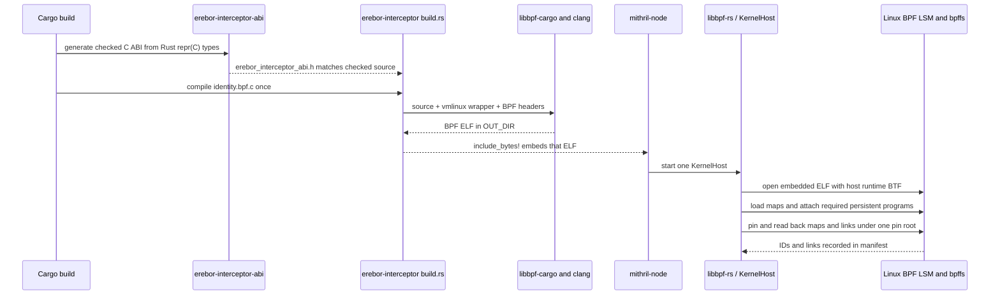

Read the concrete build path in [`erebor-interceptor/build.rs`](../../../crates/erebor-interceptor/build.rs#L15).
It names the four checked BTF headers and invokes
[`libbpf_cargo::SkeletonBuilder`](../../../crates/erebor-interceptor/build.rs#L6).
The embedded bytes are in
[`bundled.rs`](../../../crates/erebor-interceptor/src/bundled.rs#L1), and
the runtime `libbpf-rs` open/load/attach path is in
[`KernelHostOwner::start`](../../../crates/erebor-interceptor/src/host.rs#L415).

`vmlinux.h` is present. It is the small architecture selector at
[`bpf/erebor-interceptor/include/vmlinux.h`](../../../bpf/erebor-interceptor/include/vmlinux.h#L1-L22),
which chooses checked generated x86, arm64, arm, or riscv definitions through
the standard `__TARGET_ARCH_*` Clang target macro. CO-RE reads make the program
adapt to the runtime BTF layout within the supported kernel field variants.

The ABI header is also intentionally generated, not hand duplicated:

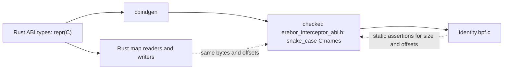

[`erebor-interceptor-abi/build.rs`](../../../crates/erebor-interceptor-abi/build.rs#L13)
rejects a build when cbindgen produces a header different from the
checked-in one. The BPF translation unit adds size and offset assertions at
[`identity.bpf.c`](../../../bpf/erebor-interceptor/programs/identity.bpf.c#L12).
The small BPF-only `exception_runtime_state_bpf_v1` wrapper is not a second
ABI: its first field must be the literal C `struct bpf_spin_lock` so the kernel
BTF recognizes it as a spin lock. The following assertions prove that it has
the same bytes and field offsets as the generated Rust ABI value.

### ABI read and write boundary

The Rust types are the source of the shared Application Binary Interface
(ABI). They use `#[repr(C)]`. The BPF program and the node run on the same host.
Map keys and values therefore use the host C layout and native byte order.
Userspace uses `to_ne_bytes()` for kernel map keys. The current generation
descriptor lookup uses `to_le_bytes()`. That representation equals native byte
order on the qualified x86-64 host and the checked little-endian targets. This
guide makes no big-endian claim. Deterministic digests and signed formats use
their separately defined byte order. The C translation unit uses
`_Static_assert` for decision-critical sizes and offsets.

The Rust code uses the existing `zerocopy` crate. It does not use manual byte
offsets or a new parser framework.

| ABI case | Conversion | Validation result | Example |
| --- | --- | --- | --- |
| All bit patterns are valid | `FromBytes::read_from_bytes` | Rejects a wrong input size | [`IdentityRuntimeConfigV1` recovery](../../../crates/mithril-node/src/identity/native.rs#L68) and [`IdentityHealthV1` aggregation](../../../crates/mithril-node/src/identity/native.rs#L117) |
| An enum or closed field can contain an invalid bit pattern | `TryFromBytes::try_read_from_bytes` | Rejects a wrong input size and an invalid field value | [`ExecutionSetBindingStateV1` recovery](../../../crates/mithril-node/src/identity/binding.rs#L759) and [generic policy ABI reads](../../../crates/mithril-node/src/policy.rs#L1278) |
| Rust value to map bytes | `IntoBytes::as_bytes` | Preserves the `repr(C)` value layout | [`execution_set_bindings` publication](../../../crates/mithril-node/src/identity/binding.rs#L180) |

Each conversion maps an invalid value to a crate-owned SNAFU error. The
binding owner compares the recovered typed value with the newly prepared live
binding. This typed comparison replaces the earlier field-by-field byte-offset
reader. Per-CPU health aggregation parses each exact-size `IdentityHealthV1`
chunk and then adds its counters.

The ABI does not make every value 64 bits. Linux identifiers and counters keep
the width required by their kernel source and range. Closed enum and flag
fields use smaller fixed widths where the layout permits it. `Id128V1` is for
stable opaque identities that need 128 bits. Explicit reserved bytes make C
alignment visible. A reviewer must compare a proposed width with the Linux
field, capacity, atomic operation, and cbindgen layout before narrowing or
widening it.

### Loader startup and recovery

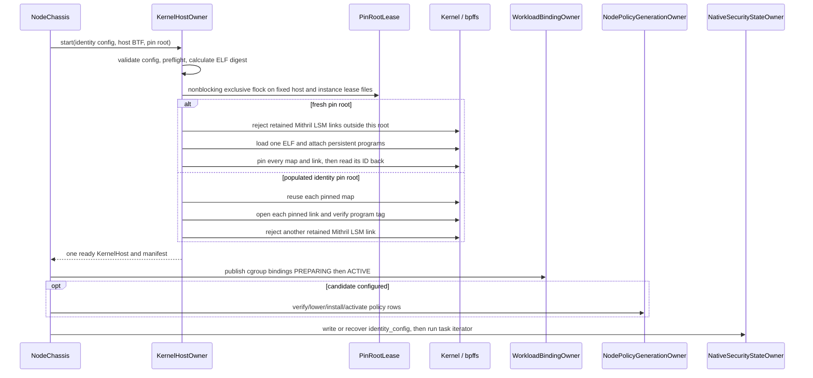

[`KernelHostLease`](../../../crates/erebor-interceptor/src/lease.rs#L52)
holds nonblocking exclusive `flock` records for one fixed host path and the
selected instance path. The live `KernelHost` owns both records. The fixed path
prevents a concurrent owner even when pin roots differ. The instance path still
protects recovery of one selected root. Dropping the lease unlocks the files;
it does not unlink the lease file, maps, links, or pin directories. It is not a
policy lock. BPF map atomics and spin locks protect event-time state.

The recovery branch starts at
[`KernelHostOwner::recover`](../../../crates/erebor-interceptor/src/host.rs#L602).
It reuses existing map pins and verifies the complete expected link set. It
allows only those retained link IDs before it loads the recovered object. A
Mithril LSM link outside the requested root returns `RetainedLsmLink`; recovery
does not attach another persistent hook set or detach the other link. The task
iterator is the one exception:
[`KernelHost::reconcile_tasks`](../../../crates/erebor-interceptor/src/host.rs#L1205)
attaches the iterator only while it is read to completion during activation.

On normal node shutdown the production identity pins intentionally remain, so
a later process can validate and recover them. The disposable qualification
object removes its pins. See
[`KernelHost::shutdown`](../../../crates/erebor-interceptor/src/host.rs#L1380).

Two loader details answer common review questions:

- A vector capacity is not a membership rule. The fresh loader starts
  `link_records` empty, attaches only programs selected by
  [`KernelObjectKind::attaches`](../../../crates/erebor-interceptor/src/host.rs#L288),
  and then compares the attached names with the exact required set in
  [`validate_attached_set`](../../../crates/erebor-interceptor/src/host.rs#L1010).
  Recovery uses `Vec::with_capacity(expected_links.len())` only to reserve
  memory. Before that loop, it derives `expected_links` from the required list
  and compares the complete pin-directory names with that set. It validates
  the resulting records again. The final validation compares sorted vectors,
  not mathematical sets. An extra duplicate therefore also fails. Capacity
  does not accept an extra, duplicate, or missing program.
- [`KernelHost::map`](../../../crates/erebor-interceptor/src/host.rs#L1103)
  finds a map by name in the `libbpf-rs` object. `lookup_map` then handles a
  normal or per-CPU lookup. A Rust `HashMap<String, Map<'_>>` inside
  `KernelHost` would borrow the `Object` stored in the same structure. That is
  a self-reference. A table of duplicated `MapHandle` values would add handle
  and close ownership. The object has 55 maps, and no measured lookup
  bottleneck requires that extra state. The direct object lookup keeps one
  owner and is the simpler design.

## Ownership and publication boundaries

| State or capability | Durable owner | First implementation location | Not owned here |
| --- | --- | --- | --- |
| BPF ELF, map/link lifecycle, pins and manifest | `KernelHostOwner` / `KernelHost` | [`host.rs`](../../../crates/erebor-interceptor/src/host.rs#L382) | Workload semantics or policy compilation |
| One node process and shutdown/reconnect loop | `NodeChassis` | [`node.rs`](../../../crates/mithril-node/src/node.rs#L35) | A second privileged daemon |
| Cgroup workload binding | `WorkloadBindingOwner` | [`binding.rs`](../../../crates/mithril-node/src/identity/binding.rs#L51) | Task labels, process state, policy decision rows |
| Identity configuration and reconciliation health | `NativeSecurityStateOwner` | [`native.rs`](../../../crates/mithril-node/src/identity/native.rs#L22) | Object loading or container discovery |
| Portable policy/signature/simulation | `mithril-control` policy owners | [`mithril-control/src/policy/mod.rs`](../../../crates/mithril-control/src/policy/mod.rs) | BPF map handles or node startup |
| Node-local policy rows, active handles, and mount reconstruction | `NodePolicyGenerationOwner` | [`policy.rs`](../../../crates/mithril-node/src/policy.rs#L41) | Signature creation or cgroup binding lifecycle |
| Durable bounded-exception state and receipts | `ExceptionAuthorityOwner` | [`exception_authority.rs`](../../../crates/mithril-node/src/policy/exception_authority.rs#L85) | Policy selection or online approval delivery |
| Human approval and one-use credential | `AdministrativeApprovalOwner` and the administrative HTTPS owner | [`administrative_exec.rs`](../../../crates/mithril-control/src/administrative_exec.rs), [`administrative_http.rs`](../../../crates/mithril-control/src/administrative_http.rs) | BPF slot mutation or task identity |
| Exact target resolution and slot state | node `AdministrativeExecOwner` and `AuthorizationProofOwner` | [`administrative_exec.rs`](../../../crates/mithril-node/src/administrative_exec.rs), [`authorization/mod.rs`](../../../crates/mithril-node/src/identity/authorization/mod.rs#L110) | Browser authentication or Kubernetes admission |
| Task/process/exec state | BPF lifecycle, exec, and exit programs | [`identity_lifecycle.bpf.h`](../../../bpf/erebor-interceptor/programs/identity_lifecycle.bpf.h), [`identity_exec.bpf.h`](../../../bpf/erebor-interceptor/programs/identity_exec.bpf.h), [`identity_exit.bpf.h`](../../../bpf/erebor-interceptor/programs/identity_exit.bpf.h) | Userspace task enrollment after the fact |
| Per-effect result | BPF common and typed gates | [`identity_effects.bpf.h`](../../../bpf/erebor-interceptor/programs/identity_effects.bpf.h#L271), [`identity_device_process.bpf.h`](../../../bpf/erebor-interceptor/programs/identity_device_process.bpf.h#L32), [`identity_ipc.bpf.h`](../../../bpf/erebor-interceptor/programs/identity_ipc.bpf.h#L223) | Control round trips or ring-buffer delivery |
| Ring consumption and recent records | `EffectObservationReader` / `EffectObservationStore` | [`EffectObservationReader`](../../../crates/erebor-interceptor/src/host.rs#L36), [`observation.rs`](../../../crates/mithril-node/src/observation.rs) | Policy decisions or durable audit |

### Node startup order

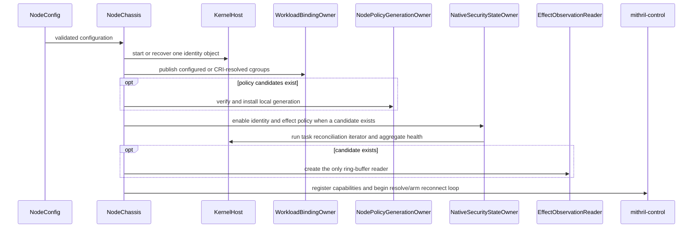

This is the exact ordering in
[`NodeChassis::start`](../../../crates/mithril-node/src/node.rs#L78).
It matters that bindings and an optional generation exist *before* identity is
enabled and live tasks are reconciled. Policy candidates and workload binding
specifications are startup configuration in this implementation. The Control
stream can resolve and arm an administrative exec request. It does not deliver
or activate a general candidate generation.

### Control connection and readiness

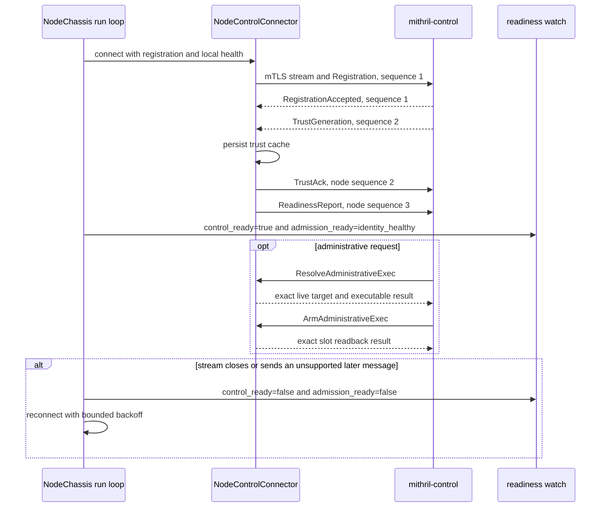

Read the handshake at
[`NodeControlConnector::connect`](../../../crates/mithril-node/src/control.rs#L52)
and the reconnect loop at
[`NodeChassis::run`](../../../crates/mithril-node/src/node.rs#L211). The current
post-registration handler accepts the two typed administrative resolve and arm
transactions. It accepts no general policy, binding, or exception delivery.
An unsupported message closes the connection. This is a narrow administrative
path, not a general dynamic control plane.

The Control service keeps each accepted `(node_id, nonce)` sequence ledger
after it removes a closed session. Read
[`ControlPlane::register`](../../../crates/mithril-control/src/service.rs#L218),
[`ControlPlane::unregister`](../../../crates/mithril-control/src/service.rs#L371),
and its
[`one-use regression test`](../../../crates/mithril-control/src/service.rs#L642).

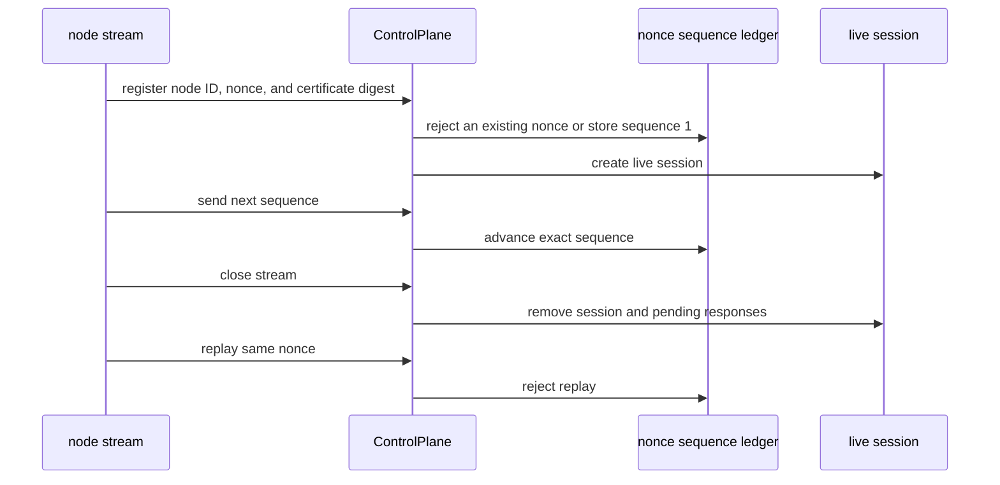

### CRI binding refresh

```mermaid
sequenceDiagram
    participant Node as NodeChassis
    participant Binding as WorkloadBindingOwner
    participant CRI as CRI RuntimeService
    participant Proc as procfs Process
    participant Host as KernelHost
    participant Map as execution_set_bindings

    Node->>Binding: publish_configured or periodic reconcile
    Binding->>CRI: ListContainers
    loop configured container IDs only
        Binding->>CRI: ContainerStatus(verbose=true)
        CRI-->>Binding: exact ID, labels, image, time, runtime info
        alt OCI cgroupsPath is present
            Binding->>Binding: validate and resolve cgroupsPath
        else CRI-dockerd gives a live PID
            Binding->>Proc: open Process and read unified cgroup
            Proc-->>Binding: kernel cgroup path
        end
        Binding->>Binding: verify exact configured container lifetime
        Binding->>Host: PREPARING row, readback, ACTIVE row, readback
        Host->>Map: update one cgroup binding
    end
```

Read this flow at
[`ContainerRuntimeInventory::snapshot`](../../../crates/mithril-node/src/identity/runtime.rs#L88)
and
[`WorkloadBindingOwner::reconcile_runtime_inner`](../../../crates/mithril-node/src/identity/binding.rs#L514).
The node uses the `k8s-cri` generated client. It uses `procfs::Process` for the
CRI-dockerd PID fallback. It does not start a Docker listener, parse a CRI
command, or load a per-container BPF object.

### Shutdown and recovery

```mermaid
sequenceDiagram
    participant Node as mithril-node
    participant Host as KernelHost
    participant Lease as PinRootLease
    participant Pins as bpffs pins
    participant Test as e2e cleanup owner

    alt production node stops
        Node->>Host: shutdown
        Host->>Lease: close file and release flock
        Host-->>Pins: keep identity map and link pins
    else node restarts
        Node->>Host: start with same pin root
        Host->>Pins: reuse maps and verify every pinned link/program tag
    else disposable probe stops
        Test->>Host: shutdown qualification owner
        Host->>Pins: remove probe-owned pins
        Test->>Test: remove cgroup, lease, files, mounts, and tasks
    end
```

A bpffs pin keeps a map or link alive after the loader process exits. Process
exit does not delete a pinned object. Production identity shutdown keeps the
pins for recovery. The test owners explicitly remove disposable pins and then
assert that the paths no longer exist. The production shutdown implementation
starts at [`KernelHost::shutdown`](../../../crates/erebor-interceptor/src/host.rs#L1380).

## The BPF object: source relationship and hook families

`identity.bpf.c` is intentionally a single translation unit. The include order
is the source-level dependency graph:

```text
vmlinux.h + generated ABI + libbpf headers
        |
        v
identity_maps.h             -- 55 maps, shared validation, attempts, exceptions
identity_task_helpers.h     -- native child construction and rollback
identity_root_helpers.h     -- root construction and coordinate finalization
identity_path.bpf.h         -- bounded path graph and mount-view state
        |
        +--> identity_lifecycle.bpf.h      -- task/cgroup/wakeup/iterator
        +--> identity_exec.bpf.h           -- exec and admin-argv transaction
        +--> identity_io_uring.bpf.h       -- ring, request, executor, completion
        +--> identity_effects.bpf.h        -- common effect gate
                 +--> identity_device_process.bpf.h
                 +--> identity_ipc.bpf.h
                 +--> explicit file/path/mount/privilege LSM wrappers
        +--> identity_exit.bpf.h           -- exact reference release
```

The loader requires 68 named programs from this one ELF. The exact list is
[`REQUIRED_IDENTITY_PROGRAMS`](../../../crates/erebor-interceptor/src/host.rs#L141).
It permanently attaches 66 programs. The task iterator is attached only while
userspace reads it. The activation probe runs through `Program::test_run` and
does not have a persistent link. The following catalog accounts for every
required program.

| Program | ELF section and program kind | Invocation and relationship |
| --- | --- | --- |
| [`erebor_task_alloc`](../../../bpf/erebor-interceptor/programs/identity_lifecycle.bpf.h#L35) | `lsm/task_alloc`, BPF LSM | Runs during child allocation. It preserves a prior LSM result. It publishes complete native child state or denies a protected allocation. |
| [`erebor_policy_activation_probe`](../../../bpf/erebor-interceptor/programs/identity.bpf.c#L101) | `socket`, BPF socket filter used with `Program::test_run` | Reads one staged request and proves that the exact decision, default, relationship, typed rule, or administrative cancellation row is present before publication. It is not attached to runtime traffic. |
| [`erebor_cgroup_attach_task`](../../../bpf/erebor-interceptor/programs/identity_lifecycle.bpf.h#L114) | `tp_btf/cgroup_attach_task`, BTF tracepoint | Runs when Linux attaches a task to a cgroup. It labels an unlabelled task that enters a protected binding. It marks a labelled placement mismatch fail closed. |
| [`erebor_cgroup_release`](../../../bpf/erebor-interceptor/programs/identity_lifecycle.bpf.h#L163) | `raw_tracepoint/cgroup_release` | Tombstones the released cgroup binding. It does not grant or recover authority. |
| [`erebor_wake_up_new_task`](../../../bpf/erebor-interceptor/programs/identity_lifecycle.bpf.h#L181) | `fentry/wake_up_new_task` | Labels a pre-wake protected root or finalizes the child coordinate before the task runs. |
| [`erebor_reconcile_tasks`](../../../bpf/erebor-interceptor/programs/identity_lifecycle.bpf.h#L217) | `iter/task`, BPF iterator | Userspace attaches and drains this program during activation. It checks live labelled tasks. It retains restrictions and raises reconciliation health on uncertainty. |
| [`erebor_sys_enter_execve`](../../../bpf/erebor-interceptor/programs/identity_exec.bpf.h#L341) | `tracepoint/syscalls/sys_enter_execve` | Tries to prepare one bounded administrative argument match. The BPRM hook starts the general exec transition. |
| [`erebor_sys_enter_execveat`](../../../bpf/erebor-interceptor/programs/identity_exec.bpf.h#L348) | `tracepoint/syscalls/sys_enter_execveat` | Records an `AT_EXECVE_CHECK` marker or tries the same bounded administrative argument match. The BPRM hook handles the executable candidate. |
| [`erebor_bprm_check_security`](../../../bpf/erebor-interceptor/programs/identity_exec.bpf.h#L629) | `lsm/bprm_check_security`, BPF LSM | Adds ordered executable candidates, checks the exec decision, and validates an exact administrative match when one exists. It preserves prior denial. |
| [`erebor_bprm_committing_creds`](../../../bpf/erebor-interceptor/programs/identity_exec.bpf.h#L677) | `fentry/security_bprm_committing_creds` | Marks the transaction past the point where a failed exec can safely restore the old state. |
| [`erebor_sys_exit_execve`](../../../bpf/erebor-interceptor/programs/identity_exec.bpf.h#L783) | `tracepoint/syscalls/sys_exit_execve` | Closes an `execve` failure before or after the point of no return. |
| [`erebor_sys_exit_execveat`](../../../bpf/erebor-interceptor/programs/identity_exec.bpf.h#L789) | `tracepoint/syscalls/sys_exit_execveat` | Closes an `execveat` failure with the same conservative rule. |
| [`erebor_sched_process_exec`](../../../bpf/erebor-interceptor/programs/identity_exec.bpf.h#L808) | `tracepoint/sched/sched_process_exec` | Commits the process, image, execution, role, and administrative-slot outcome after Linux reports exec success. |
| [`erebor_exception_sys_enter`](../../../bpf/erebor-interceptor/programs/identity_effects.bpf.h#L6) | `raw_tracepoint/sys_enter` | Advances the task-local syscall-attempt sequence. This sequence forms part of the stable exception receipt identity. |
| [`erebor_exception_sys_exit`](../../../bpf/erebor-interceptor/programs/identity_effects.bpf.h#L18) | `raw_tracepoint/sys_exit` | Marks the task-local exception attempt inactive when the syscall ends. |
| [`erebor_mount_mutation_sys_exit`](../../../bpf/erebor-interceptor/programs/identity_path.bpf.h#L403) | `tracepoint/raw_syscalls/sys_exit` | Completes a task-local mount attempt and leaves the namespace view dirty for userspace reconciliation. It uses atomics because tracing programs cannot use the mount-view BPF spin lock. |
| [`erebor_mount_sys_enter_open_tree`](../../../bpf/erebor-interceptor/programs/identity_path.bpf.h#L411) | `tracepoint/syscalls/sys_enter_open_tree` | Advances the global mount mutation epoch before this mount API can change a represented view. |
| [`erebor_mount_sys_enter_fsconfig`](../../../bpf/erebor-interceptor/programs/identity_path.bpf.h#L411) | `tracepoint/syscalls/sys_enter_fsconfig` | Applies the same global invalidation to filesystem-context configuration. |
| [`erebor_mount_sys_enter_fsmount`](../../../bpf/erebor-interceptor/programs/identity_path.bpf.h#L411) | `tracepoint/syscalls/sys_enter_fsmount` | Applies the same global invalidation before a new mount object can become visible. |
| [`erebor_mount_sys_enter_mount_setattr`](../../../bpf/erebor-interceptor/programs/identity_path.bpf.h#L411) | `tracepoint/syscalls/sys_enter_mount_setattr` | Applies the global fail-closed barrier because Linux has no matching mount-specific LSM hook for this syscall. |
| [`erebor_identity_file_open`](../../../bpf/erebor-interceptor/programs/identity_effects.bpf.h#L730) | `lsm/file_open`, BPF LSM | Applies exact file-open or default policy before Linux returns the file descriptor. |
| [`erebor_identity_file_receive`](../../../bpf/erebor-interceptor/programs/identity_effects.bpf.h#L736) | `lsm/file_receive`, BPF LSM | Revalidates an exact received file for the current recipient before descriptor installation. Linux can return payload with `MSG_CTRUNC` and install no descriptor when this hook denies. Bounded exceptions are disabled on this path. |
| [`erebor_identity_file_permission`](../../../bpf/erebor-interceptor/programs/identity_effects.bpf.h#L744) | `lsm/file_permission`, BPF LSM | Converts the Linux read, write, and execute mask into separate typed operations and applies each decision. |
| [`erebor_identity_file_ioctl`](../../../bpf/erebor-interceptor/programs/identity_effects.bpf.h#L783) | `lsm/file_ioctl`, BPF LSM | Runs the common actor and object proof, then uses the exact device and ioctl key in [`identity_device_ioctl_gate`](../../../bpf/erebor-interceptor/programs/identity_device_process.bpf.h#L130). |
| [`erebor_identity_mmap_file`](../../../bpf/erebor-interceptor/programs/identity_effects.bpf.h#L790) | `lsm/mmap_file`, BPF LSM | Applies read, write, and executable file-mapping decisions for the requested protection bits. |
| [`erebor_identity_file_mprotect`](../../../bpf/erebor-interceptor/programs/identity_effects.bpf.h#L829) | `lsm/file_mprotect`, BPF LSM | Uses the mapped file when present and applies write or execute transitions. Anonymous executable memory stays a hard-close path, not a complete VMA model. |
| [`erebor_identity_socket_post_create`](../../../bpf/erebor-interceptor/programs/identity_ipc.bpf.h#L440) | `lsm/socket_post_create`, BPF LSM | Stores creator endpoint identity in socket-local storage for a protected Unix stream. Other socket kinds do not receive positive Unix-stream authority. |
| [`erebor_identity_unix_stream_connect`](../../../bpf/erebor-interceptor/programs/identity_ipc.bpf.h#L454) | `lsm/unix_stream_connect`, BPF LSM | Validates the current client, stored listener, and accepted child. It creates one channel identity and applies an exact allow, alert, or deny relationship for the same profile generation. |
| [`erebor_identity_socket_connect`](../../../bpf/erebor-interceptor/programs/identity_ipc.bpf.h#L463) | `lsm/socket_connect`, BPF LSM | Defers AF_UNIX stream authority to `unix_stream_connect`. Other protected network connection requests use the unsupported network path. |
| [`erebor_identity_socket_sendmsg`](../../../bpf/erebor-interceptor/programs/identity_ipc.bpf.h#L480) | `lsm/socket_sendmsg`, BPF LSM | Revalidates both stored endpoints for a connected Unix stream. Other protected socket messages do not inherit that authority. |
| [`erebor_identity_socket_recvmsg`](../../../bpf/erebor-interceptor/programs/identity_ipc.bpf.h#L498) | `lsm/socket_recvmsg`, BPF LSM | Applies the receive direction of the same connected-stream proof. |
| [`erebor_identity_socket_socketpair`](../../../bpf/erebor-interceptor/programs/identity_ipc.bpf.h#L515) | `lsm/socket_socketpair`, BPF LSM | Takes the explicit unsupported IPC path. Socket-pair positive authority is not implemented. |
| [`erebor_identity_unix_may_send`](../../../bpf/erebor-interceptor/programs/identity_ipc.bpf.h#L522) | `lsm/unix_may_send`, BPF LSM | Takes the explicit unsupported Unix datagram path. |
| [`erebor_identity_ipc_permission`](../../../bpf/erebor-interceptor/programs/identity_ipc.bpf.h#L529) | `lsm/ipc_permission`, BPF LSM | Takes the explicit unsupported SysV IPC path for a protected actor. |
| [`erebor_identity_shm_shmat`](../../../bpf/erebor-interceptor/programs/identity_ipc.bpf.h#L536) | `lsm/shm_shmat`, BPF LSM | Takes the explicit unsupported shared-memory attach path. |
| [`erebor_identity_ptrace_access_check`](../../../bpf/erebor-interceptor/programs/identity_effects.bpf.h#L867) | `lsm/ptrace_access_check`, BPF LSM | Calls the exact controller-target snapshot and process-rule gate. Positive rows require exact target roles and exact operation arguments. |
| [`erebor_identity_task_kill`](../../../bpf/erebor-interceptor/programs/identity_effects.bpf.h#L875) | `lsm/task_kill`, BPF LSM | Applies the same exact controller-target proof to signal delivery and records the signal as the operation argument. |
| [`erebor_identity_path_unlink`](../../../bpf/erebor-interceptor/programs/identity_effects.bpf.h#L884) | `lsm/path_unlink`, BPF LSM | Applies path/object policy to an existing unlink target. |
| [`erebor_identity_path_mknod`](../../../bpf/erebor-interceptor/programs/identity_effects.bpf.h#L892) | `lsm/path_mknod`, BPF LSM | Checks the destination path. A negative or unresolved destination cannot gain exact-object authority. |
| [`erebor_identity_path_mkdir`](../../../bpf/erebor-interceptor/programs/identity_effects.bpf.h#L901) | `lsm/path_mkdir`, BPF LSM | Checks directory creation with the same conservative destination rule. |
| [`erebor_identity_path_symlink`](../../../bpf/erebor-interceptor/programs/identity_effects.bpf.h#L909) | `lsm/path_symlink`, BPF LSM | Checks symlink creation. It does not infer authority from the target text. |
| [`erebor_identity_path_rmdir`](../../../bpf/erebor-interceptor/programs/identity_effects.bpf.h#L917) | `lsm/path_rmdir`, BPF LSM | Applies path/object policy to the existing directory. |
| [`erebor_identity_path_chmod`](../../../bpf/erebor-interceptor/programs/identity_effects.bpf.h#L925) | `lsm/path_chmod`, BPF LSM | Applies metadata policy to the exact existing path object. |
| [`erebor_identity_path_chown`](../../../bpf/erebor-interceptor/programs/identity_effects.bpf.h#L933) | `lsm/path_chown`, BPF LSM | Applies ownership-change policy to the exact existing path object. |
| [`erebor_identity_path_truncate`](../../../bpf/erebor-interceptor/programs/identity_effects.bpf.h#L941) | `lsm/path_truncate`, BPF LSM | Applies truncate policy to an exact path object. |
| [`erebor_identity_file_truncate`](../../../bpf/erebor-interceptor/programs/identity_effects.bpf.h#L948) | `lsm/file_truncate`, BPF LSM | Applies truncate policy through an existing file object. |
| [`erebor_identity_path_link`](../../../bpf/erebor-interceptor/programs/identity_effects.bpf.h#L955) | `lsm/path_link`, BPF LSM | Checks the existing source and then the destination. It does not transfer a signed path class to an unrepresented hard-link alias. |
| [`erebor_identity_path_rename`](../../../bpf/erebor-interceptor/programs/identity_effects.bpf.h#L968) | `lsm/path_rename`, BPF LSM | Checks both source and destination before the rename. |
| [`erebor_identity_sb_kern_mount`](../../../bpf/erebor-interceptor/programs/identity_effects.bpf.h#L990) | `lsm/sb_kern_mount`, BPF LSM | Applies the represented mount policy and global invalidation to kernel-created mount objects. |
| [`erebor_identity_sb_mount`](../../../bpf/erebor-interceptor/programs/identity_effects.bpf.h#L999) | `lsm/sb_mount`, BPF LSM | Applies the mount policy. If Linux may continue, it dirties the namespace view before mutation. |
| [`erebor_identity_sb_umount`](../../../bpf/erebor-interceptor/programs/identity_effects.bpf.h#L1007) | `lsm/sb_umount`, BPF LSM | Applies unmount policy and starts the same dirty-view transaction when allowed. |
| [`erebor_identity_sb_pivotroot`](../../../bpf/erebor-interceptor/programs/identity_effects.bpf.h#L1014) | `lsm/sb_pivotroot`, BPF LSM | Applies pivot-root policy and invalidates the represented topology before an allowed change. |
| [`erebor_identity_move_mount`](../../../bpf/erebor-interceptor/programs/identity_effects.bpf.h#L1021) | `lsm/move_mount`, BPF LSM | Applies move-mount policy and invalidates the represented topology before an allowed change. |
| [`erebor_identity_capable`](../../../bpf/erebor-interceptor/programs/identity_effects.bpf.h#L1028) | `lsm/capable`, BPF LSM | Uses the typed privilege operation and a finite default cell. Missing protected authority hard-denies. It is not a complete credential-transition model. |
| [`erebor_identity_bpf`](../../../bpf/erebor-interceptor/programs/identity_effects.bpf.h#L1036) | `lsm/bpf`, BPF LSM | Applies the BPF privilege operation before the command. It is not complete protection of every Mithril map, link, and binary operation. |
| [`erebor_io_uring_setup_enter`](../../../bpf/erebor-interceptor/programs/identity_io_uring.bpf.h#L431) | `tracepoint/syscalls/sys_enter_io_uring_setup` | Captures the exact managed actor and permitted setup intent before ring creation. |
| [`erebor_identity_inode_init_security_anon`](../../../bpf/erebor-interceptor/programs/identity_io_uring.bpf.h#L497) | `lsm/inode_init_security_anon`, BPF LSM | Associates the new anonymous io_uring inode with the pending managed setup. |
| [`erebor_io_uring_create`](../../../bpf/erebor-interceptor/programs/identity_io_uring.bpf.h#L537) | `tp_btf/io_uring_create` | Publishes the ring identity and pinned generation after Linux creates the ring. |
| [`erebor_io_uring_register`](../../../bpf/erebor-interceptor/programs/identity_io_uring.bpf.h#L637) | `tp_btf/io_uring_register` | Allows the narrow ring-enable transition and rejects unqualified registration authority. |
| [`erebor_io_uring_submit_req`](../../../bpf/erebor-interceptor/programs/identity_io_uring.bpf.h#L708) | `tp_btf/io_uring_submit_req` | Captures the exact submission, SQE, actor, file, offset, buffer, length, and generation state. |
| [`erebor_io_uring_issue_enter`](../../../bpf/erebor-interceptor/programs/identity_io_uring.bpf.h#L816) | `fentry/io_issue_sqe` | Binds the current executor to one retained request before Linux issues it. |
| [`erebor_io_uring_issue_exit`](../../../bpf/erebor-interceptor/programs/identity_io_uring.bpf.h#L867) | `fexit/io_issue_sqe` | Releases the execution state or retains a restrictive result after the issue path returns. |
| [`erebor_io_uring_complete`](../../../bpf/erebor-interceptor/programs/identity_io_uring.bpf.h#L913) | `tp_btf/io_uring_complete` | Completes one request and releases its retained generation reference. |
| [`erebor_io_uring_context_free`](../../../bpf/erebor-interceptor/programs/identity_io_uring.bpf.h#L949) | `fentry/io_ring_ctx_free` | Tombstones the ring and releases its asynchronous generation reference. |
| [`erebor_identity_uring_sqpoll`](../../../bpf/erebor-interceptor/programs/identity_io_uring.bpf.h#L987) | `lsm/uring_sqpoll`, BPF LSM | Hard-closes SQPOLL because positive kernel-worker authority is not qualified. |
| [`erebor_identity_uring_override_creds`](../../../bpf/erebor-interceptor/programs/identity_io_uring.bpf.h#L995) | `lsm/uring_override_creds`, BPF LSM | Hard-closes credential override for the protected ring. |
| [`erebor_identity_uring_cmd`](../../../bpf/erebor-interceptor/programs/identity_io_uring.bpf.h#L1005) | `lsm/uring_cmd`, BPF LSM | Hard-closes driver command authority. |
| [`erebor_sched_process_exit`](../../../bpf/erebor-interceptor/programs/identity_exit.bpf.h#L16) | `tracepoint/sched/sched_process_exit` | Uses the task tombstone to release task, process, entry, domain, image, execution, and generation references once. Failed decrements retain restriction and raise reconciliation health. |

Use the following family matrix with the program catalog. The program catalog
identifies the exact hook. The family matrix identifies its state, helper
constraints, physical result, userspace setup, and proof path.

| Program family | Map reads and writes | Important BPF helpers | Return and physical effect | Userspace setup and proof |
| --- | --- | --- | --- | --- |
| `task_alloc`, `cgroup_attach_task`, `wake_up_new_task` | Read runtime config, live cgroup binding, creator state, and generation refs. Create task storage, coordinates, creator edges, process, vector, entry, domain, image, execution, and tombstone rows. Rollback removes only acquired state. | CO-RE cgroup and task reads, `bpf_get_current_task_btf`, task storage, map lookup/update/delete, and BPF atomics. | `task_alloc` can return the prior LSM denial or a negative errno. Trace and fentry programs return zero after state work; they do not override a syscall result. Missing protected identity retains a restrictive result or health state. | `WorkloadBindingOwner` publishes the cgroup row first. `NativeSecurityStateOwner` enables identity. The identity e2e runner proves root, native-child, exec, restart, reference, and cleanup paths. Source-contract tests in [`bundled.rs`](../../../crates/erebor-interceptor/src/bundled.rs) check verifier-sensitive task-storage and counter rules. |
| `cgroup_release`, `sched_process_exit` | Tombstone the binding or task. Release exact task, process, vector, entry, domain, image, execution, and generation references. | Raw or scheduler trace context reads, map lookup/update/delete, and nonzero compare-and-swap decrement. | These trace programs return zero. They cannot deny exit. A failed decrement keeps the restrictive row and increments reconciliation health. | Recovery reads retained refs. `lifecycle_counters_use_the_nonzero_cas_decrement` checks the source contract. The identity probe checks final reference counts. |
| `reconcile_tasks` | Read every live task label and related state. Update health or retain restriction on mismatch. | BPF iterator context, task storage, CO-RE reads, and bounded map lookups. | Returns zero for each iterator element. It changes reconciliation state, not the task syscall result. | `KernelHost::reconcile_tasks` attaches, drains, and drops this program for each reconciliation run. It is one of two required programs without a persistent link. |
| Policy activation probe | Reads one `policy_activation_probe_requests` row and the named staged policy row. It writes no runtime authority. | `Program::test_run`, per-CPU scratch, and exact map lookup. | Returns a small diagnostic code to userspace. It is never attached to a packet or task path. | `LoweredGeneration::probe_staged_rows` runs the probe after readback and before the active profile pointer changes. |
| Exec entry, BPRM, commit, exit, and success programs | Read task, process, entry, image, exact object, policy, approved slot, approved argument, and exception state. Write pending exec, pending administrative match, candidate image, image provenance, execution, process role, and reference rows. | `bpf_probe_read_user`, bounded loop callbacks, BPRM CO-RE reads, map operations, task storage, spin-locked exception consumption, and atomics. | `bprm_check_security` returns the prior denial, policy denial, or zero before exec. Trace and fentry programs return zero after transaction maintenance. A post-commit uncertainty never restores wider authority. | `AuthorizationProofOwner` installs exact ordered-argument keys and one slot when called. `NodePolicyGenerationOwner` installs exec decisions. The effect probe checks exec variants, an approved exact control, and failed-close memory cases. `bundled.rs` checks argument-loop, candidate-index, and BPRM-loop bounds. |
| Exception syscall entry and exit | Write task-local syscall state and a bounded `file_open` frame stack in `task_effect_attempt_states`. Read no policy row. | Current task storage and raw syscall context. | Return zero. These programs identify an attempt. They do not allow or deny that attempt. A malformed, unfinished, or overflowed frame fails closed. | `NodePolicyGenerationOwner` installs exception bindings. `ExceptionAuthorityOwner` restores receipts and reconciles the WAL. Current-source physical proof is pending. |
| File open, permission, mmap, and mprotect | Read actor identity, binding, generation, exact object, mount view, canonical graph, effect decision/default, exception, and observation state. Write late root state, exception receipts/counters, mount proposal state, observation health, and ring records. | Trusted current task, task storage, CO-RE inode/dentry/mount reads, bounded loop callbacks, map operations, spin locks where valid, atomics, ring reserve/submit, and monotonic time. | Preserve a prior LSM denial. Return zero for allow or observe-only `WOULD_DENY`. Return a verified negative errno in protect mode or for an integrity failure. Ring loss cannot change the return. | `NodePolicyGenerationOwner` installs all signed rows and exact mount state. Earlier VM records cover file, alias, descriptor, mapping, saturation, and benign controls for an older object. |
| File descriptor receive | Reads the current recipient, the received file, exact object state, and the existing open-mode policy cells. It cannot consume a bounded exception. | Trusted current task, file and inode CO-RE reads, exact map lookup, and common observation helpers. | A denied SCM_RIGHTS item installs no descriptor. Linux reports the rejected item through `MSG_CTRUNC`; the payload can still arrive. | The effect fixture uses one declared Unix-stream relationship, compares the target process descriptor set before and after receive, and has a benign exact-file control. Current physical rerun is still required. |
| Device ioctl | Run the common actor and exact-object proof. Then read `device_effect_decisions` with exact type, major, minor, command, role, and state. Write only common exception and observation state. | File/inode CO-RE reads, Linux device-number helpers, map lookup, and the common observation helpers. | Preserve prior denial. Return an exact command result. A command wildcard is denial-only. Missing typed authority hard-denies. | The node lowerer rejects an unsigned device class and a positive command wildcard. The fixture uses `/dev/pts/ptmx` and `TIOCGPTN`; `/dev/zero` is the exact deny control. |
| Ptrace and signal | Read controller identity and target task storage, binding, coordinate, process/vector, generation, and `process_control_rules`. Recheck target and transition versions after lookup. Write common observation state. | Trusted target task pointer, task storage, CO-RE target reads, map lookup, and common observation helpers. | Preserve prior denial. Return an exact directional result or hard-deny missing proof. Generic rows are denial-only. | `lower_process` owns the exact target and argument restriction. Current physical evidence covers exact denial and signal-zero permission only. |
| Unix-stream socket programs | Read and write `ipc_socket_states`. Read actor, peer, binding, generation, and `ipc_relationship_decisions`. Write common observation state. | Socket-local storage, trusted socket member pointers, task storage, CO-RE socket/process reads, and map lookup. | Connected stream hooks apply an exact relationship result or the signed unmatched result. Socketpair, datagram, SysV IPC, and shared-memory hooks take the explicit unsupported path. | `lower_ipc_relationships` installs exact two-direction rows for allow, alert, or deny, plus signed unmatched rows. Current-source physical proof is pending. |
| Path mutation programs | Read actor, source/destination dentry and inode state, exact object, mount graph, and signed effect rows. Write common observation and exception state. | CO-RE path reads, bounded canonical path loop, map lookup, and the common gate. | Preserve a prior denial. Return source denial before destination evaluation. An unresolved negative destination cannot gain object authority. | The policy owner installs represented roots and exact objects. Earlier VM records cover create, metadata, truncate, unlink, link, and rename hard-close paths for an older object. `link_and_rename_check_source_before_destination` checks source order. |
| Mount mutation programs and syscall exit | Read actor policy and namespace view. The LSM hooks lock and mark an allowed mutation `DIRTY` before Linux changes topology. The exit tracepoint advances version and pending state with atomics. | Mount/dentry CO-RE reads, map lookup, BPF spin lock in LSM programs, task storage, and atomics in the tracepoint. | LSM hooks deny an unsupported protected mutation or return zero after invalidation. The exit tracepoint returns zero and cannot authorize the mutation. | The policy owner installs and reconciles mount rows from retained namespace capabilities. Earlier VM records cover protected and external replacement races and exact restoration for an older object. Source-contract tests prohibit spin locks in the tracepoint. |
| Global mount invalidation | Reads and updates the global mutation, clean, and pending epochs. It also marks each represented namespace stale until exact reconciliation. | Atomic map operations from syscall-entry tracepoints and LSM hooks. | It cannot authorize a mount. A mismatch makes exact-object decisions fail closed across represented namespaces. | The physical fixture covers `mount_setattr` invalidation and one propagation peer. Automount, referral, overlay copy-up, and idmapped behavior remain unqualified. |
| Restricted io_uring | Reads and writes setup, ring, request, execution, exact-object, policy, and asynchronous generation-reference maps. | BTF tracepoints, fentry/fexit, BPF LSM hooks, CO-RE reads, map operations, and bounded state validation. | Exact read or write can proceed under the pinned submitting actor. Unqualified SQPOLL, credential override, command, opcode, or lifecycle state hard-closes. | The fixture creates a disabled ring, installs exact read/write restrictions, enables it, verifies worker attribution, and checks completion and reference release. A current final VM rerun is still required. |
| `capable` and `bpf` | Read current actor, generation, finite privilege defaults, and observation state. Write common exception and observation state. | Common actor helpers, map lookup, and ring helpers. | Preserve prior denial. Return the signed finite result or hard-deny missing protected authority. | The protection probe checks namespace privilege, BPF, and link-removal safety floors. These programs do not prove the full privilege or self-protection matrix. |

The required-program list is a load-time completeness check. It is not a
capability claim. Review each program with its map inputs, policy compiler
support, and physical oracle. The common relationship is:

```mermaid
flowchart LR
    L[Lifecycle hooks] --> I[Task and process identity]
    I --> X[Exec transaction]
    X --> I
    I --> G[Common effect gate]
    P[Signed generation maps] --> G
    M[Mount and path state] --> G
    G --> D[Device and process gate]
    G --> U[Unix-stream IPC gate]
    G --> F[File, path, mount, privilege wrappers]
    D --> O[Fixed physical result]
    U --> O
    F --> O
    O --> R[Best-effort observation]
    E[Exit hook] --> I
```

## Maps: what they store, who fills them, and who reads them

The authoritative declarations are all in
[`identity_maps.h`](../../../bpf/erebor-interceptor/programs/identity_maps.h#L93).
The important simplification is that each map has one domain publisher on the
userspace side, while BPF owns event-time identity transitions. The kernel
loader has the file descriptor; it does not invent map contents.

### 1. Bootstrap and temporary state

| Map | Filled by | Read by | Plain meaning |
| --- | --- | --- | --- |
| `identity_config` (array, one record) | `NativeSecurityStateOwner`; `allocate_id` advances `next_id` atomically | Every identity/effect hook | Node boot ID, label epoch, enabled flags, configured deny errno, and opaque-ID allocator. |
| `identity_health` (per-CPU array) | BPF hook families increment counters | `NativeSecurityStateOwner` aggregates all CPU values | Diagnostic counters; missing health storage never authorizes anything. |
| `identity_scratch` (per-CPU array) | The currently running BPF invocation | That same invocation only | Reusable temporary construction area, not durable task identity. One invocation completes on one CPU. A later invocation uses the slot for its current CPU. Durable data is published to task storage or hash maps before return. |
| `policy_activation_probe_requests` (array, one record) | `NodePolicyGenerationOwner` before publication | On-demand policy activation probe | One exact staged-row request. The probe result must succeed before the active profile pointer changes. |
| `effect_observation_health` (per-CPU array) | Effect gate | Runtime observation | Attempted/emitted/lost/unresolved observation counters. |
| `effect_observations` (4 MiB ring buffer) | Effect gate after selecting the result | One `libbpf-rs` ring reader | Best-effort evidence. Ring pressure can lose evidence but cannot change allow/deny. |

### 2. Binding and identity state

| Map(s) | Filled by | Read by | Plain meaning |
| --- | --- | --- | --- |
| `execution_set_bindings` | `WorkloadBindingOwner`: `PREPARING` → exact readback → `ACTIVE`; BPF consumes the single initial-root marker and tombstones a released cgroup | Lifecycle and effect gate | The live cgroup-to-workload authority record, including nonce, profile generation and roles. BPF never creates or activates a binding. |
| `profile_generation_task_refs`, `profile_generation_async_refs` | Policy owner creates zero values; BPF task and io_uring lifecycles increment and decrement them | BPF lifecycle, retirement, and node recovery | Keep a generation retained while labelled tasks, rings, or requests exist. |
| `active_profile_generations` | `NodePolicyGenerationOwner` publishes profile ID → generation after the generation is `ACTIVE` and probes pass | New-root admission helpers and binding activation | This is the single profile switch for future roots. Existing processes keep the generation stored in their process state. It is not a per-effect global pointer. |
| `task_labels` (task storage) | BPF `publish_task`; BPF rollback deletes partial publication | Every hot BPF path | Immutable birth identity attached directly to the kernel task. There is no delayed PID enrollment. |
| `task_coordinates`, `kernel_real_parent_intervals`, `created_by_edges` | BPF birth/wakeup/exec/exit/reconcile | Identity and effect paths; inspection | Reusable Linux coordinates, current kernel-parent observation, and immutable creator proof. |
| `process_states`, `process_state_vectors`, `entry_states`, `authority_domains` | BPF root/native birth; BPF exec and exit transitions | Lifecycle, exec and effect paths | Current mutable authority state for a process, its finite state vector, entry lifetime, and native-family domain. |
| `external_root_classifications`, `pending_execs`, `image_provenance`, `process_execution_instances`, `task_reference_tombstones` | BPF lifecycle/exec/exit | Lifecycle, exec, effect and reconciliation paths | Root kind, in-flight exec state, exact executable provenance, execution instances, and exactly-once release bookkeeping. |

### 3. Authorization-proof state

| Map(s) | Filled by | Read or changed by | Plain meaning |
| --- | --- | --- | --- |
| `approved_exec_slots`, `approved_exec_arguments` | The node administrative owner calls `AuthorizationProofOwner` after a typed Control arm request | Exec path consumes one matching slot; exec path reads bounded argument bytes | One exact next-match administrative authority. It is not a command-string allow list. |
| `pending_administrative_matches` | Exec entry path | BPRM/exec completion path | Short-lived bridge from verified syscall argv to the BPRM transaction. |

### 4. Signed policy, exact file, and mount state

| Map(s) | Filled by | Read or changed by | Plain meaning |
| --- | --- | --- | --- |
| `profile_generation_descriptors` | `NodePolicyGenerationOwner` writes `PREPARING`, `READ_BACK`, then `ACTIVE` | Effect gate | The generation is usable only when its boot/epoch/profile descriptor is `ACTIVE`. Its mode says `OBSERVE` or `PROTECT`. |
| `effect_decisions`, `effect_defaults` | `NodePolicyGenerationOwner` | Effect gate | Exact-object row first, then finite default fallback. A decision contains the physical disposition and errno/exception handle. |
| `device_effect_decisions` | `NodePolicyGenerationOwner` | Exact device ioctl gate | Exact file tuple, device major/minor/type, ioctl command, actor state, and generation. An explicit command wildcard can deny only. |
| `process_control_rules` | `NodePolicyGenerationOwner` | Ptrace and signal gates | Exact controller and target roles/state vectors plus operation argument. Generic rows can deny only. |
| `ipc_relationship_decisions` | `NodePolicyGenerationOwner` | Connected Unix-stream gate | Endpoint role and operation rows for allow, alert, or deny. The lowerer installs both directions for one local-channel relationship. The unmatched row can allow, alert, or deny. |
| `ipc_socket_states` | BPF socket creation and connect paths | BPF Unix-stream connect/send/receive paths | Socket-local endpoint and channel identity. The value follows the socket lifetime. |
| `exception_handle_bindings`, `exception_runtime_states`, `exception_use_receipts` | Policy and exception owners install bindings/state and restore durable consumed receipts | BPF claims one receipt, locks one runtime value, checks deadline/count, and consumes one use | Stable exception instance and use identity. The WAL owns restart reconciliation. |
| `task_effect_attempt_states` | Raw syscall entry/exit and `file_open` BPF code | Exception consumption | Task-local syscall state and bounded `file_open` frames. Each current synchronous file-open decision gets a new effect-attempt sequence. |
| `io_uring_setup_states`, `io_uring_ring_states`, `io_uring_request_states`, `io_uring_execution_states`, `profile_generation_async_refs` | BPF io_uring setup, create, submit, issue, complete, and free hooks | BPF io_uring and file-effect paths; node retirement | Exact restricted ring and request ownership plus generation retention. These rows do not authorize SQPOLL, credential override, uring commands, arbitrary opcodes, AIO, or unqualified registered resources. |
| `exact_file_objects` | `NodePolicyGenerationOwner` writes configured tuple rows | Effect and device gates read only | Exact object key: generation, mount namespace, unique mount identity, device, inode, and inode generation. BPF does not create a new authority row from a pathname. |
| `mount_security_views`, `mount_mutation_epochs`, `mount_security_view_locks`, `mount_reconciliation_proposals` | Policy owner initializes/reconciles; BPF mount hooks dirty/advance state; BPF file gate commits an exact proposal | BPF path and policy reconciliation | Per-namespace topology safety state. A dirty or racing view cannot produce a strict file decision. |
| `mount_global_mutation_epoch`, `mount_global_clean_epoch`, `mount_global_pending_mutations` | Policy owner initializes and reconciles; mount LSM and syscall-entry programs advance global state | Every exact path gate and mount reconciliation | Conservative cross-namespace barrier for mount APIs and propagation. Exact decisions require the global clean epoch to match. |
| `canonical_mount_roots`, `path_graph_exact_transitions`, `path_graph_wildcard_transitions`, `path_graph_terminals` | Policy owner after resolving the represented mount view | BPF canonical path candidate | The bounded Meta component graph and trusted root prefix used to turn live dentry components into a signed class candidate. |
| `mount_mutation_attempts` (task storage) | BPF mount and exit paths | BPF mount completion | A small task-local pairing record only. Namespace topology authority stays in namespace-keyed maps. |

### Complete map lifecycle matrix

All maps in this table belong to the one production object. The loader pins
all of them below `PIN_ROOT/maps`. “Pin-root lifetime” means that the bpffs pin
keeps the map alive after process exit. A later node can reuse the map. Only an
explicit cleanup owner removes the pin. Task-storage values also end when their
kernel task ends. Per-CPU scratch content is reusable temporary content even
though the map object stays pinned.

The object uses flat typed maps instead of a map-of-maps. Generation and
binding IDs are part of decision keys. The active handle selects a generation,
and an `ACTIVE` descriptor validates it. A map-of-maps would add inner-map
creation, template, file-descriptor, pin, recovery, replacement, and retirement
ownership. It is useful when a design needs whole inner-table replacement or
strong per-tenant map isolation. The current source does not need that extra
owner for its single-node, single-writer publication model. Do not add a
map-of-maps only because another project uses one. Reconsider it if a later
multiwriter or whole-generation atomic-replacement requirement cannot be met by
the active handle and immutable generation keys.

| Map | Key and value ABI | Userspace writer | BPF writer | Readers | Lifetime |
| --- | --- | --- | --- | --- | --- |
| `identity_config` | `u32` → `IdentityRuntimeConfigV1` | `NativeSecurityStateOwner` | `allocate_id` changes `next_id` atomically | All identity and effect families | Pin-root lifetime; one row for one boot and label epoch |
| `identity_health` | per-CPU `u32` → `IdentityHealthV1` | None | Lifecycle, exec, and exit families | Native health aggregation | Pin-root lifetime; counters are per CPU |
| `identity_scratch` | per-CPU `u32` → BPF-only `identity_scratch_v1` | None | Current BPF invocation | Current BPF invocation | Pin-root lifetime; content is temporary and can change on the next invocation on that CPU |
| `policy_activation_probe_requests` | `u32` → `PolicyActivationProbeV1` | `NodePolicyGenerationOwner` | None | On-demand activation probe | Pin-root lifetime; one temporary request during staged-row qualification |
| `task_labels` | task-storage kernel key → `TaskLabelV1` | None | Root and native publication; rollback deletes | Lifecycle, exec, effect, exit, iterator, inspector | Map has pin-root lifetime; each value has task lifetime |
| `task_coordinates` | `u64 task_cookie` → `TaskCoordinateV1` | None | Root, native, wake, exec, exit, iterator | Lifecycle, exec, effect, inspector | Pin-root lifetime; explicit exit and rollback cleanup |
| `kernel_real_parent_intervals` | `KernelRealParentIntervalKeyV1` → `KernelRealParentIntervalV1` | None | Birth, refresh, exec, exit, iterator | Identity, effect, inspector | Pin-root lifetime; interval and exit cleanup |
| `created_by_edges` | `u64 task_cookie` → `CreatedByEdgeV1` | None | Root and native birth | Identity and inspector | Pin-root lifetime; immutable creator proof until cleanup |
| `process_states` | `Id128V1` → `ProcessSecurityStateV1` | None | Root, native, exec, exit | Lifecycle, exec, effect, inspector | Pin-root lifetime; reference-owned process lifetime |
| `process_state_vectors` | `Id128V1` → `ProcessStateVectorV1` | None | Root, native, exec, exit | Lifecycle, exec, effect, inspector | Pin-root lifetime; process-state lifetime |
| `profile_generation_task_refs` | `u64 generation_ref` → `u64 count` | Binding owner creates zero row | Birth and exit change count atomically | Lifecycle, effect, binding recovery | Pin-root lifetime; retained while bindings or tasks refer to the generation |
| `profile_generation_async_refs` | `u64 generation_ref` → `u64 count` | Policy owner creates zero row | Ring and request lifecycle change count atomically | io_uring paths and generation retirement | Pin-root lifetime; retained while asynchronous holders refer to the generation |
| `entry_states` | `Id128V1` → `EntrySecurityStateV1` | None | Root, native, exec, exit | Lifecycle, exec, effect, inspector | Pin-root lifetime; entry reference lifetime |
| `authority_domains` | `Id128V1` → `AuthorityDomainStateV1` | None | Root, native, exec, exit | Lifecycle, exec, effect, inspector | Pin-root lifetime; native-family reference lifetime |
| `execution_set_bindings` | `u64 cgroup_id` → `ExecutionSetBindingStateV1` | `WorkloadBindingOwner` | Initial-root consume; cgroup release tombstones | Lifecycle, exec, effect, binding recovery | Pin-root lifetime; userspace terminates or BPF tombstones a dead cgroup |
| `external_root_classifications` | `u64 task_cookie` → `ExternalRootClassificationV1` | None | Root publication and rollback | Exec, exit, inspector | Pin-root lifetime; root task lifetime |
| `pending_execs` | `u64 task_cookie` → `PendingExecV1` | None | Exec syscall and BPRM transaction | Exec and effect families | Pin-root lifetime; one in-flight exec transaction |
| `image_provenance` | `Id128V1` → `ImageProvenanceV1` | None | Root and exec commit/rollback | Exec, effect, exit, inspector | Pin-root lifetime; execution reference lifetime |
| `process_execution_instances` | `Id128V1` → `ProcessExecutionInstanceV1` | None | Root and exec commit/rollback | Exec, effect, exit, inspector | Pin-root lifetime; execution reference lifetime |
| `approved_exec_slots` | `ApprovedExecSlotKeyV1` → `ApprovedExecSlotV1` | `AuthorizationProofOwner` | Exec path changes or consumes a matching slot | Authorization owner and exec path | Pin-root lifetime; one approved slot lifetime |
| `approved_exec_arguments` | `ApprovedExecArgumentKeyV1` → `u8` | `AuthorizationProofOwner` | None | Authorization owner and exec argument matcher | Pin-root lifetime; removed with its slot |
| `pending_administrative_matches` | `u64 task_cookie` → `PendingAdministrativeMatchV1` | None | Exec entry, BPRM, completion, and exit | Exec path | Pin-root lifetime; one in-flight administrative match |
| `task_reference_tombstones` | `u64 task_cookie` → `TaskReferenceTombstoneV1` | None | Birth, rollback, and exit | Exit and reconciliation | Pin-root lifetime; used once for exact reference release |
| `profile_generation_descriptors` | `u64 generation_ref` → `ProfileGenerationDescriptorV1` | `NodePolicyGenerationOwner` | None | Effect gate and recovery | Pin-root lifetime; immutable active generation until policy cleanup |
| `active_profile_generations` | `Id128V1 profile_id` → `u64 generation_ref` | `NodePolicyGenerationOwner` | None | Binding activation and new-root generation admission | Pin-root lifetime; one future-root handle for one profile |
| `binding_activation_targets` | `BindingActivationTargetKeyV1` → `ExecutionSetBindingStateV1` | `NodePolicyGenerationOwner` | None | New-root generation admission | Pin-root lifetime; immutable target row for a binding and generation |
| `effect_decisions` | `EffectDecisionKeyV1` → `PhysicalDecisionV1` | `NodePolicyGenerationOwner` | None | Effect gate | Pin-root lifetime; generation lifetime |
| `effect_defaults` | `EffectDefaultKeyV1` → `PhysicalDecisionV1` | `NodePolicyGenerationOwner` | None | Effect gate | Pin-root lifetime; generation lifetime |
| `ipc_relationship_decisions` | `IpcRelationshipDecisionKeyV1` → `PhysicalDecisionV1` | `NodePolicyGenerationOwner` | None | Unix-stream connect/send/receive gates | Pin-root lifetime; generation lifetime; exact relationship rows plus one unmatched row per role and operation |
| `ipc_socket_states` | socket-storage kernel key → `IpcSocketStateV1` | None | Socket creation and Unix-stream connection paths | Unix-stream connect/send/receive gates | Map has pin-root lifetime; each value has socket lifetime |
| `device_effect_decisions` | `DeviceEffectKeyV1` → `PhysicalDecisionV1` | `NodePolicyGenerationOwner` | None | Device ioctl gate | Pin-root lifetime; generation and exact device-object lifetime |
| `process_control_rules` | `ProcessControlRuleKeyV1` → `PhysicalDecisionV1` | `NodePolicyGenerationOwner` | None | Ptrace and signal gates | Pin-root lifetime; generation lifetime; exact target role and operation argument; generic rows are denial-only |
| `exception_handle_bindings` | `ExceptionHandleBindingKeyV1` → `ExceptionHandleBindingV1` | `NodePolicyGenerationOwner` | None | Common effect gate, exec administrative match, authorization owner | Pin-root lifetime; generation handle to stable exception instance |
| `exception_runtime_states` | `ExceptionRuntimeStateKeyV1` → `ExceptionRuntimeStateV1` compatible BPF lock wrapper | `NodePolicyGenerationOwner` with `ExceptionAuthorityOwner` | Effect or administrative exec consumes, expires, and exhausts under spin lock | Exception reconciliation and BPF consumption | Pin-root lifetime plus WAL recovery; mutable stable exception instance |
| `exception_use_receipts` | `ExceptionUseReceiptKeyV1` → `ExceptionUseReceiptV1` | `ExceptionAuthorityOwner` restores durable consumed receipts | BPF inserts `CLAIMING`, changes it to `CONSUMED`, or removes a denied claim | Exception reconciliation and BPF retry | Pin-root lifetime; successful receipts also have WAL lifetime |
| `task_effect_attempt_states` | task-storage kernel key → `TaskEffectAttemptStateV1` | None | Raw syscall entry starts state; `file_open` creates and returns one frame; raw syscall exit and task exit close frames | BPF exception consumption | Map has pin-root lifetime; each value has task lifetime |
| `io_uring_setup_states` | `u64 task_cookie` → `IoUringSetupStateV1` | None | io_uring setup and create programs | io_uring creation | Pin-root lifetime; one pending setup transaction |
| `io_uring_ring_states` | `Id128V1 ring_id` → `IoUringRingStateV1` | None | create, register, submit, and free programs | io_uring and retirement owners | Pin-root lifetime; ring and pinned-generation lifetime |
| `io_uring_request_states` | `IoUringRequestKeyV1` → `IoUringRequestStateV1` | None | submit, issue, complete, and free programs | io_uring executor and completion paths | Pin-root lifetime; exact request lifetime |
| `io_uring_execution_states` | `u64 task_cookie` → `IoUringExecutionStateV1` | None | issue entry and exit programs | File-effect attribution and completion | Pin-root lifetime; one in-flight executor binding |
| `exact_file_objects` | `ExactFileObjectKeyV1` → `ExactObjectBindingV1` | `NodePolicyGenerationOwner` | None | Common effect and device gates | Pin-root lifetime; generation and mount-view validity limit use |
| `mount_security_views` | `u32 mount_namespace_inode` → `MountSecurityViewStateV1` | `NodePolicyGenerationOwner` | Mount hooks dirty and advance the view; file gate can commit reconciliation | Policy owner, mount hooks, path gate | Pin-root lifetime; namespace view lifetime |
| `mount_global_mutation_epoch` | `u32` → `u64` | `NodePolicyGenerationOwner` initializes | Mount LSM and syscall-entry programs increment | Exact path gate and reconciliation | Pin-root lifetime; node-global mutation epoch |
| `mount_global_clean_epoch` | `u32` → `u64` | `NodePolicyGenerationOwner` advances after exact reconciliation | None | Exact path gate and reconciliation | Pin-root lifetime; node-global reconciled epoch |
| `mount_global_pending_mutations` | `u32` → `u64` | `NodePolicyGenerationOwner` initializes | Mount entry and exit paths use bounded nonzero updates | Exact path gate and reconciliation | Pin-root lifetime; global in-flight mutation count |
| `mount_security_view_locks` | `u32 mount_namespace_inode` → BPF spin lock | `NodePolicyGenerationOwner` creates row | LSM mount and path programs lock the row | LSM mount and path programs | Pin-root lifetime; namespace view lifetime |
| `mount_reconciliation_proposals` | `u32 mount_namespace_inode` → `MountReconciliationProposalV1` | `NodePolicyGenerationOwner` | File gate consumes a matching proposal | Policy owner and file gate | Pin-root lifetime; one exact epoch/version proposal |
| `mount_mutation_epochs` | `u32 mount_namespace_inode` → `u64` | `NodePolicyGenerationOwner` initializes row | Mount paths advance epoch atomically | Policy owner, mount path, file path | Pin-root lifetime; namespace view lifetime |
| `canonical_mount_roots` | `CanonicalMountRootKeyV1` → `CanonicalMountRootV1` | `NodePolicyGenerationOwner` | None | Canonical path engine | Pin-root lifetime; active generation and represented view lifetime |
| `path_graph_exact_transitions` | `PathGraphTransitionKeyV1` → `PathGraphTransitionV1` | `NodePolicyGenerationOwner` | None | Canonical path engine | Pin-root lifetime; active generation lifetime |
| `path_graph_wildcard_transitions` | `PathGraphStateKeyV1` → `PathGraphTransitionV1` | `NodePolicyGenerationOwner` | None | Canonical path engine | Pin-root lifetime; active generation lifetime |
| `path_graph_terminals` | `PathGraphStateKeyV1` → `PathGraphTerminalV1` | `NodePolicyGenerationOwner` | None | Canonical path engine | Pin-root lifetime; active generation lifetime |
| `mount_mutation_attempts` | task-storage kernel key → `MountMutationAttemptV1` | None | Mount LSM entry and syscall-exit completion | Mount completion | Map has pin-root lifetime; each value has task or syscall-attempt lifetime |
| `effect_observations` | no key → `EffectObservationV1` ring records | None | Effect gate after it fixes the physical result | One `EffectObservationReader` | Pin-root lifetime; a full ring rejects a new reservation and increments the loss counter |
| `effect_observation_health` | per-CPU `u32` → `EffectObservationHealthV1` | None | Effect emission path | Runtime observation health | Pin-root lifetime; counters are per CPU |

`identity_scratch` is not a per-task cache. Linux keeps one BPF invocation on
one CPU, so another CPU does not write that invocation's per-CPU slot. The
program copies every durable result into task storage or another map before it
returns. The next hook on that CPU can overwrite the complete scratch value.
Reviewers must reject any change that keeps a scratch pointer or assumes that
scratch content belongs to the same task across two hooks. A helper path that
can re-enter the same scratch-using program would also need a separate proof;
the per-CPU map alone is not a re-entry lock.

The rest of this section gives the map-fill order for review.

### Binding publication

```mermaid
sequenceDiagram
    participant W as WorkloadBindingOwner
    participant H as KernelHost map API
    participant M as execution_set_bindings
    participant B as BPF lifecycle/effect hook

    W->>W: canonicalize cgroup path and keep opened handle
    W->>W: verify cgroup dev/inode lifetime and non-overlap
    W->>H: write binding lifecycle PREPARING
    H->>M: update key = root cgroup ID
    W->>H: exact readback
    W->>H: ensure profile_generation_task_refs[generation] = 0
    W->>H: write binding lifecycle ACTIVE, version + 1
    W->>H: exact readback
    B->>M: bounded live cgroup ancestry lookup, maximum 64 steps
```

The concrete writes are in
[`WorkloadBindingOwner::publish_all`](../../../crates/mithril-node/src/identity/binding.rs#L106-L265).
[`prepare`](../../../crates/mithril-node/src/identity/binding.rs#L521) opens and
validates the live cgroup once before publication. `publish_all` does not repeat
that immediate validation. The later check in
[`activate_configured_profiles`](../../../crates/mithril-node/src/identity/binding.rs#L256)
is a time-of-use check after policy publication. Periodic reconciliation also
checks that the opened cgroup identity is still live. Those later checks cover
state changes across transactions; they are not duplicate parsing inside one
preparation call.
For a configured runtime socket, the same owner reconciles a CRI inventory;
it still publishes exactly the same binding record rather than loading another
BPF program.

### Signed generation publication

```mermaid
sequenceDiagram
    participant A as signed artifact
    participant N as NodePolicyGenerationOwner
    participant R as anti-rollback store
    participant H as KernelHost map API
    participant M as policy maps
    participant G as BPF effect gate

    A->>N: candidate path and public key from node config
    N->>N: verify signature, validity, source/compiled binding
    N->>R: validate candidate and record monotonic high-water state
    N->>N: allocate a durable monotonic generation handle
    N->>N: preflight every affected map capacity
    N->>H: descriptor = PREPARING
    loop every decision/default/device/process/IPC/object/graph row
        N->>H: write row
        N->>H: read exact row back
    end
    N->>H: restore receipts and write/read exception state and bindings
    N->>H: write/read mutable mount rows
    N->>H: set descriptor to READ_BACK, then read it back
    N->>H: set descriptor to ACTIVE, then read it back
    N->>H: stage immutable binding-and-generation target rows
    N->>H: test-run every staged decision class
    N->>R: persist a pending activation after target readback
    N->>H: publish profile ID -> active generation, then read it back
    N->>R: finalize pending activation and consume a rollback proof, if used
    G->>M: use rows only after matching ACTIVE descriptor
```

[`LoweredGeneration::install`](../../../crates/mithril-node/src/policy.rs#L1633)
contains the row sequence. [`reconcile_pending_activations`](../../../crates/mithril-node/src/policy.rs#L1204)
compares a durable pending activation with the active profile pointer and the
descriptor digest after restart. A failed pre-commit stage leaves the prior
pointer active. A successful pointer update is the commit point. A readback
failure after that update closes readiness and retains the committed state for
recovery. The code does not roll the pointer back after the commit point.

The active-generation switch starts at
[`activate_profile`](../../../crates/mithril-node/src/policy.rs#L1326).
It stages immutable target rows in `binding_activation_targets`, checks the
old pointer again, and updates one profile-keyed pointer. It is a serialized
userspace transaction under the exclusive pin-root owner. It is not a
multiwriter kernel compare-and-swap transaction.

`active_profile_generations` selects the generation for future roots.
`binding_activation_targets` supplies the staged binding state for that
generation. Existing tasks keep the generation already stored in
`ProcessSecurityStateV1`. This avoids a mid-execution global policy change.
[`GenerationHandleAllocator`](../../../crates/mithril-node/src/policy/generation_allocator.rs)
persists a nonzero high-water mark for the current node boot and label epoch.
It does not reuse an allocated handle. `preflight_policy_map_capacity` rejects
an installation before the first decision row when its complete retained state
cannot fit.

`reconcile_generation_retirement` moves an inactive non-current generation to
`RETIRING`. It waits for task and asynchronous references, ring and request
state, process and authority state, tombstones, pending execs, pending
administrative matches, and armed administrative slots to clear. It then marks
the generation `TOMBSTONED` and deletes generation-keyed policy rows and its
descriptor. This is an implemented source owner. The current evidence does not
contain the complete crash, restart, and concurrent-holder retirement matrix.
The source also has no separately visible kernel grace-period transaction that
qualifies every architecture race after the last reference reaches zero. Do
not treat row deletion alone as the complete architecture proof.

### Bounded exception consumption and WAL recovery

```mermaid
sequenceDiagram
    participant P as NodePolicyGenerationOwner
    participant W as ExceptionAuthorityOwner and WAL
    participant M as exception maps
    participant B as BPF effect or admin exec

    P->>W: load exception-authority-v1.jsonl
    W->>W: reject a torn record or invalid transition
    W->>M: restore each durable CONSUMED receipt with BPF_NOEXIST
    P->>W: prepare stable node/exception instance state
    W->>M: install handle binding and runtime state
    B->>M: derive claim-slot or file-open attempt receipt key
    B->>M: insert CLAIMING receipt with BPF_NOEXIST
    B->>M: lock runtime state
    B->>M: validate binding, deadline, state, and maximum uses
    alt one use remains
        B->>M: increment consumed uses and mark receipt CONSUMED
        B-->>B: allow this matched exception use
    else expired, exhausted, or corrupt
        B->>M: retain restrictive state and delete denied receipt
        B-->>B: deny
    end
    P->>W: periodic reconciliation reads locked runtime and receipt maps
    W->>W: append JSON record, newline, fsync file, fsync new parent
```

Read the kernel algorithm at
[`consume_bounded_exception`](../../../bpf/erebor-interceptor/programs/identity_maps.h#L584)
and the durable owner at
[`ExceptionAuthorityOwner::load`](../../../crates/mithril-node/src/policy/exception_authority.rs#L95),
[`restore_receipts`](../../../crates/mithril-node/src/policy/exception_authority.rs#L226),
and [`reconcile`](../../../crates/mithril-node/src/policy/exception_authority.rs#L272).
The WAL append starts at
[`append`](../../../crates/mithril-node/src/policy/exception_authority.rs#L434).
An append failure poisons the owner. A restart on the same boot trusts a live
pinned counter after it checks the durable predecessor. A missing live counter
or a boot change conservatively exhausts any remaining uses. The total reserved
maximum uses cannot exceed the 65,536 receipt-map capacity.

The bounded-exception identity is currently limited to synchronous `lsm/file_open`
read and write decisions. The raw syscall hook starts the task state. The
file-open gate allocates a fresh frame. The gate closes that frame after its
decision. A nested or malformed stack fails closed. Inline same-task io_uring
opens get separate frame sequences. `file_receive` passes no exception handle.
General VFS retry correlation and offloaded exception use are not implemented.

This is a local restart-safe exception owner. Administrative approval uses a
separate one-use claim-slot identity. Control and the node now connect that
owner to typed resolve and arm messages. The latest physical administrative
lane failed before it created an approval, so the complete transaction is not
qualified. The exception WAL is reconciled on startup and the periodic node
reconciliation interval, not synchronously after every permitted effect.

### Identity birth and use

```mermaid
sequenceDiagram
    participant T as creator task
    participant A as lsm/task_alloc
    participant C as cgroup_attach_task
    participant W as wake_up_new_task
    participant E as later effect hook
    participant M as identity maps

    T->>A: clone/fork/thread allocation request
    A->>M: read creator label and creator cgroup binding
    alt labelled valid creator
        A->>M: construct/publish child task/process state
    else unlabelled creator already in protected binding
        A->>M: publish an external root for the creator
        A->>M: construct/publish child task/process state
    else unlabelled creator outside binding
        A-->>T: do not label here
    end
    C->>M: classify an unlabelled task after Linux supplies a protected target cgroup
    W->>M: classify an unlabelled pre-wake root or finalize a labelled coordinate
    E->>M: classify a remaining unlabelled bound root before its first allowed effect
    E->>M: require label, current binding, and current process state
```

`task_alloc` never guesses the new child's future cgroup. It reads the current
creator's live cgroup. If that unlabelled creator is already in a protected
binding, the hook publishes an external root for the creator and then publishes
the child as a native descendant. The cgroup-attach hook remains the primary
path when Linux supplies a target protected cgroup. The wake hook and the
first-effect front are conservative fallbacks for runtime creation orders that
do not expose a usable attach event before the task enters the protected
cgroup.

This detail is important for CRI. A runtime task can create a child before the
child enters its future container cgroup. At `task_alloc`, the runtime creator
is outside that future binding. The hook therefore cannot claim that the child
belongs to the container, and it does not deny the allocation only because the
future binding is unknown. The cgroup-attach, wake, and first-effect paths must
classify the task before a protected effect can succeed. The current k3s record
reports `container_running_before_node_binding` and proves that the later
protected file open is denied. This is fail-closed effect containment. It is
not pre-start container admission.

### Exec and administrative-match transaction

```mermaid
sequenceDiagram
    participant U as execve or execveat caller
    participant S as syscall-entry tracepoint
    participant B as bprm_check_security
    participant C as committing-creds fentry
    participant X as syscall-exit or sched-exec tracepoint
    participant M as exec and identity maps

    U->>S: executable, ordered argv, and execveat flags
    alt AT_EXECVE_CHECK
        S->>M: mark a check-only request
    else exact administrative candidate
        S->>M: match the preinstalled argument keys in order
        S->>M: publish a pending administrative match
    end
    U->>B: Linux presents the first executable candidate
    B->>M: create pending exec state and add the candidate
    B->>M: validate and consume an administrative slot, if one matched
    U->>B: Linux presents an interpreter or auxiliary candidate
    B->>M: append the candidate, up to the fixed limit
    U->>C: Linux reaches the credential-commit boundary
    C->>M: create preparing image and execution records
    alt exec fails before the commit boundary
        X->>M: restore the old active state and delete pending state
    else failure after the commit boundary
        X->>M: retain restrictions and mark the outcome unknown
    else Linux reports exec success
        X->>M: activate the new image, execution, role, and entry state
    end
```

The administrative argument matcher starts at
[`administrative_argv_matches`](../../../bpf/erebor-interceptor/programs/identity_exec.bpf.h#L207).
It accepts at most 256 arguments and 4,096 argument bytes in total. It does not
sort, normalize, or hash the arguments. It checks the exact argument count,
argument order, length, bytes, and final null pointer. Userspace first installs
one map key for each argument in
[`arm_administrative_slot`](../../../crates/mithril-node/src/identity/authorization/mod.rs#L205).
The syscall-entry program then checks those keys without copying a variable
argument vector into one BPF map value. This design keeps the comparison exact
and gives the verifier fixed bounds.

The general transition starts in
[`identity_bprm_transition`](../../../bpf/erebor-interceptor/programs/identity_exec.bpf.h#L424),
not at syscall entry. Linux can call the BPRM hook more than once for one exec,
for example for an interpreter. The pending record therefore stores up to
eight ordered executable candidates. The commit and exit hooks separate a
safe pre-commit rollback from an uncertain post-commit failure. They do not
convert an uncertain result into authority.

### Kubernetes administrative approval transaction

```mermaid
sequenceDiagram
    participant K as kubectl-mithril
    participant H as Control HTTPS owner
    participant O as organization OIDC provider
    participant A as Kubernetes authentication and admission
    participant C as Control node stream
    participant N as target NodeChassis
    participant B as BPF exec path

    K->>H: create exact exec draft
    H->>O: PKCE authentication for the requester
    O-->>H: authenticated requester identity
    H->>H: requester is the self-approver required by this policy path
    H-->>K: one memory-only Kubernetes bearer credential
    K->>A: CONNECT pods/exec with that bearer credential
    A->>H: TokenReview and AdmissionReview context
    H->>C: resolve exact Pod, container, binding, argv, and executable
    C->>N: ResolveAdministrativeExec
    N-->>C: exact live target result
    H->>C: ArmAdministrativeExec with signed one-use intent
    C->>N: ArmAdministrativeExec
    N->>B: install arguments and one ARMED slot, then read back
    N-->>H: exact slot receipt
    H->>H: commit approval only after readback
    A-->>K: allow the exact CONNECT request
    B->>B: one matching external-root exec consumes ARMED to CONSUMED
```

The Control owner is in
[`administrative_exec.rs`](../../../crates/mithril-control/src/administrative_exec.rs)
and [`administrative_http.rs`](../../../crates/mithril-control/src/administrative_http.rs).
The client is
[`kubectl_mithril.rs`](../../../crates/mithril-control/src/bin/kubectl_mithril.rs).
The node actuator is
[`administrative_exec.rs`](../../../crates/mithril-node/src/administrative_exec.rs).
The authenticated user who runs `kubectl-mithril exec` is the approver for the
implemented self-approval path. The implementation does not invent a trusted
executable-content signer. The exact executable is resolved in the live target
view and matched with raw ordered argv as the architecture specifies.

The current physical run reaches draft creation, CONNECT admission, and node
slot arm. It then stops before target exec because stock runc `1.4.2` uses an
unsupported sealed self-clone and inherited bootstrap channels. The BPF path
fails closed and leaves the slot armed. Source and local tests do not replace
the missing end-to-end approval, replay, mismatch, expiry, and single-winner
physical matrix.

### Exact-file decision and observation

```mermaid
sequenceDiagram
    participant L as typed LSM wrapper
    participant G as identity_effect_gate
    participant I as identity/binding maps
    participant P as mount view and path graph
    participant D as decision/exception maps
    participant R as ring buffer
    participant U as one libbpf-rs reader

    L->>G: file/object arguments, operation, prior LSM result
    G->>I: validate current task label, cgroup binding, process/entry/domain
    alt prior LSM denied or identity is broken
        G->>G: keep prior result or hard-deny
    else policy disabled
        G-->>L: return prior success
    else qualified file object
        G->>P: require a CLEAN view, build bounded components, and revalidate the snapshot
        G->>D: exact object then exact/default policy key
        alt OBSERVE deny
            G->>G: result = 0, reason = WOULD_DENY
        else PROTECT deny
            G->>G: result = signed negative errno
        else exception-backed allow
            G->>D: lock/check/increment bounded counter once
        end
    else unsupported protected object
        G->>G: result = hard deny, reason = UNSUPPORTED_OBJECT
    end
    G->>R: best-effort copy after result is fixed
    G-->>L: return fixed result
    U->>R: poll and decode
```

Start at
[`identity_effect_gate`](../../../bpf/erebor-interceptor/programs/identity_effects.bpf.h#L509).
Then read
[`prepare_effect_identity`](../../../bpf/erebor-interceptor/programs/identity_effects.bpf.h#L206)
and
[`resolved_identity_effect_gate`](../../../bpf/erebor-interceptor/programs/identity_effects.bpf.h#L271).
The wrappers below it deliberately retain visible Linux hook prototypes; they
do not hide unrelated operations behind a macro. Device, process-control, and
IPC wrappers ask the common gate to validate the actor but defer the final
decision to their typed key. A wrapper without a supported typed model uses the
explicit hard-safe result.

### Typed device and process-control decisions

```mermaid
sequenceDiagram
    participant L as ioctl, ptrace, or signal LSM hook
    participant G as common identity gate
    participant T as typed device/process gate
    participant M as exact state and decision maps

    L->>G: prior result and typed operation, defer final decision
    G->>M: validate current actor, binding, process, entry, and generation
    alt device ioctl
        T->>M: require exact file tuple and configured object binding
        T->>M: derive device type, major, minor, and command
        T->>M: lookup exact command, then denial-only command wildcard
    else ptrace or signal
        T->>M: snapshot exact live target label, binding, process, and coordinate
        T->>M: lookup controller role/state -> target role/state -> operation
        T->>M: recheck live target label and both transition versions
    end
    T-->>L: apply signed result or hard-deny missing proof
```

The device gate starts at
[`identity_device_ioctl_gate`](../../../bpf/erebor-interceptor/programs/identity_device_process.bpf.h#L143).
The process gate starts at
[`identity_process_control_gate`](../../../bpf/erebor-interceptor/programs/identity_device_process.bpf.h#L390).
Both wrappers call
[`identity_effect_actor_gate`](../../../bpf/erebor-interceptor/programs/identity_effects.bpf.h#L525)
first. That call returns before the wrapper calls its typed operation frame.
This sequence keeps the largest BPF call chain below the kernel 512-byte stack
limit. It does not skip actor validation or soften a missing typed decision.
The device model supports an exact configured character or block device and an
exact ioctl command. An explicit wildcard command can deny only. It does not model device acquisition,
derived file descriptors, driver-private subobjects, or later authority
transfer.

The process model supports exact directional `PTRACE_ACCESS_<mode>` and
`SIGNAL_<number>` rows. An allow or alert row requires an exact target role and
exact argument. A generic row can deny only. It does not support
`process_vm_*`,
`/proc/PID/mem`, `pidfd`, `perf`, or another process operation.

### Unix-stream IPC decisions

```mermaid
sequenceDiagram
    participant C as protected socket creator
    participant S as socket-local storage
    participant X as unix_stream_connect
    participant P as peer task/process state
    participant R as relationship decisions

    C->>S: socket_post_create stores endpoint A identity
    X->>S: read client, listener, and accepted-child socket state
    X->>P: validate current client and live listener creator identity
    X->>R: lookup actor role -> peer role -> CONNECT
    alt exact relationship decision
        X-->>C: allow, audit-allow, simulated deny, or deny
    else unmatched policy decision
        X-->>C: allow, audit-allow, simulated deny, or deny
        X->>S: store the connected channel after a successful decision
    end
    C->>S: connected send or receive reads both endpoint identities
    C->>P: revalidate current actor and live peer process/binding/generation
    C->>R: lookup SEND or RECEIVE relationship decision
```

Read socket storage and the connect hook at
[`identity_ipc.bpf.h`](../../../bpf/erebor-interceptor/programs/identity_ipc.bpf.h#L440).
The BPF model is limited to connected AF_UNIX `SOCK_STREAM` connect, send, and
receive. The compiler and node lowerer accept exact relationship allow, alert,
and deny rows; see [`lower_ipc_relationships`](../../../crates/mithril-node/src/policy/ipc.rs#L21).
The lowerer installs both directions for one local-channel relationship and
one unmatched row for each role and operation. Unix datagrams, socket pairs,
SysV IPC, shared memory, and exact pipes are unsupported.
An actor outside the protected scope can use an untracked host socket. It
cannot connect to a listener that has protected socket state or use a connected
socket that has protected channel state. Those cross-boundary cases deny. This
containment rule does not implement listener transfer or grant host authority.
Listener transfer, socket activation, and socket transfer through `SCM_RIGHTS`
are not qualified. The code does not claim that a transferred listener gains
the current holder's positive authority.

### Mount invalidation and reconciliation

```mermaid
sequenceDiagram
    participant A as task in represented mount namespace
    participant L as mount LSM hook
    participant S as mount syscall-entry tracepoint
    participant G as global mount epochs
    participant V as namespace view maps
    participant X as syscall exit hook
    participant N as NodePolicyGenerationOwner
    participant F as later exact-file hook

    A->>S: open_tree, fsconfig, fsmount, or mount_setattr
    S->>G: increment global mutation and pending state before effect
    A->>L: kernel mount, mount, unmount, pivot_root, or move_mount
    L->>G: start the same global fail-closed barrier
    alt protected unsupported mutation
        L-->>A: deny before mutation and leave the view unchanged
    else allowed external entrant
        L->>V: increment epoch and pending count, then mark the view DIRTY
        L-->>A: allow Linux mutation
        A->>X: syscall completion
        X->>V: increment version, decrement pending last, and retain the DIRTY state
    end
    N->>V: read epoch/version/pending
    N->>G: require no pending mutation and reconcile the global epoch
    N->>N: prove configured exact object and snapshot still match
    N->>V: write/read root rows and exact reconciliation proposal
    F->>V: under LSM spin lock, CAS matching proposal to CLEAN
    F->>V: only then walk path graph for strict file decision
```

The view key is the mount-namespace inode, not the task cgroup. The global
epochs conservatively invalidate every represented namespace for APIs such as
`mount_setattr` and for propagation into a peer namespace. This prevents an
unlabelled host task or a propagation peer from retaining a stale clean view.
The LSM-side map lock is used only in LSM programs; tracing programs use
atomics as required by the verifier. This source path does not complete
automount, referral, overlay copy-up, or idmapped-mount exactness.

## BPF vocabulary needed for review

| Item | Meaning here |
| --- | --- |
| `SEC("...")` | Puts a function in an ELF section. libbpf uses the section to select program type/attach behavior. `SEC("lsm/task_alloc")` is a BPF LSM hook for the kernel `task_alloc` security hook. |
| `BPF_PROG(name, ...)` | libbpf tracing macro that gives C a typed function view of the BPF context while preserving the ABI Linux expects. It is not Rust and does not itself attach a program. |
| `BPF_CORE_READ_INTO` | CO-RE field read: Clang records field relocation information so libbpf can adapt a supported kernel field layout using runtime BTF. |
| `bpf_get_current_task_btf()` | Returns a verifier-trusted pointer to the task that is currently executing the hook. In `task_alloc`, that is the creator, not the half-created `task` argument. |
| `bpf_task_storage_get` | Looks up a BPF task-storage value. Passing flags `0, 0` means lookup only; it does not create a label. |
| `bpf_map_lookup_elem` | Returns a temporary pointer to a map value for this BPF invocation or `NULL`. The verifier prevents retaining it after return. |
| `BPF_NOEXIST` | Map-update mode that fails rather than replacing a key that already exists. Birth code uses it to avoid silently overwriting identity state. |
| `__sync_*` | Clang lowers these operations to BPF atomics. They implement bounded counters/CAS without a userspace lock in the hot path. |
| BPF spin lock | A special lock field recognized from BTF in a map value. It is used only where Linux permits it; it is not interchangeable with an ordinary `u32`. |
| Return `0` from an LSM BPF program | Adds no denial. It does not override another LSM's prior nonzero decision. A negative errno denies the operation. |

## Task allocation: contract before reading the source

The exact function under review is:

```c
SEC("lsm/task_alloc")
int BPF_PROG(erebor_task_alloc, struct task_struct *task,
             unsigned long clone_flags, int ret)
```

It is at
[`identity_lifecycle.bpf.h` line 35](../../../bpf/erebor-interceptor/programs/identity_lifecycle.bpf.h#L35).

Its contract is deliberately narrow:

1. Preserve a denial from an earlier LSM program.
2. Do nothing while Mithril identity is disabled.
3. Read the *creator's* label and the creator's live cgroup binding.
4. If that creator has a valid Mithril label, create a fail-closed native child
   before Linux can run it.
5. If it is unlabelled but is inside a protected binding, publish an external
   root for the creator. Then create the new task as its native child.
6. If it is unlabelled and outside every configured binding, make no identity
   claim. A later cgroup-attach, wake, or first-effect path creates an external
   or initial root after the task has a protected cgroup.

`clone_flags` is the standard Linux UAPI word. The child helper uses standard
`CLONE_THREAD` and `CLONE_PARENT` from
[`linux_uapi.h`](../../../bpf/erebor-interceptor/include/linux_uapi.h), rather
than an invented Mithril clone-flag copy. Threads retain the process-level
identity; a process child receives distinct process/execution identifiers.

### Task allocation source walk

The table follows the current physical source. It groups adjacent declarations
and branches that have one review purpose.

| Source lines | Exact effect |
| --- | --- |
| [35-38](../../../bpf/erebor-interceptor/programs/identity_lifecycle.bpf.h#L35) | Select the BPF LSM task-allocation hook and declare the typed new-task, clone-flag, and prior-LSM inputs. |
| [39-48](../../../bpf/erebor-interceptor/programs/identity_lifecycle.bpf.h#L39) | Declare runtime, health, scratch, creator, cgroup, label, binding, io_uring execution, lookup-status, and result state. These pointers are valid only for this BPF invocation. |
| [50-51](../../../bpf/erebor-interceptor/programs/identity_lifecycle.bpf.h#L50) | Preserve an earlier LSM denial without reading or changing Mithril state. |
| [52-54](../../../bpf/erebor-interceptor/programs/identity_lifecycle.bpf.h#L52) | Read the one runtime configuration and make no Mithril claim while identity is disabled. |
| [55-58](../../../bpf/erebor-interceptor/programs/identity_lifecycle.bpf.h#L55) | Obtain diagnostic health and required per-CPU scratch. Missing scratch denies. |
| [59-64](../../../bpf/erebor-interceptor/programs/identity_lifecycle.bpf.h#L59) | Create and clear io_uring execution task storage for the new task. Failure denies, so a later kernel-worker execution cannot inherit stale task-local state. |
| [65-66](../../../bpf/erebor-interceptor/programs/identity_lifecycle.bpf.h#L65) | Read the verifier-trusted current creator and its optional Mithril task label. |
| [67-70](../../../bpf/erebor-interceptor/programs/identity_lifecycle.bpf.h#L67) | Read the creator's current default cgroup. A read failure increments placement health and denies. |
| [72-78](../../../bpf/erebor-interceptor/programs/identity_lifecycle.bpf.h#L72) | Walk the creator's cgroup ancestry for a live binding. An incomplete or invalid walk is different from a complete no-binding result and denies. |
| [79-85](../../../bpf/erebor-interceptor/programs/identity_lifecycle.bpf.h#L79) | For a labelled creator, require the current boot, epoch, binding ID, nonce, and active binding before child construction. |
| [86-87](../../../bpf/erebor-interceptor/programs/identity_lifecycle.bpf.h#L86) | Call the native-child constructor with the trusted creator, live binding, Linux clone flags, and scratch state. |
| [88-101](../../../bpf/erebor-interceptor/programs/identity_lifecycle.bpf.h#L88) | For an unlabelled creator already inside a binding, publish one external root, read the new creator label back, and deny if publication is incomplete. |
| [102-104](../../../bpf/erebor-interceptor/programs/identity_lifecycle.bpf.h#L102) | Construct the native child from the newly proved external-root creator. |
| [105-108](../../../bpf/erebor-interceptor/programs/identity_lifecycle.bpf.h#L105) | For an unlabelled creator outside every configured binding, return zero without claiming the child's future cgroup. Later attach, wake, or first-effect handling owns classification. |
| [109-112](../../../bpf/erebor-interceptor/programs/identity_lifecycle.bpf.h#L109) | Count a child-construction failure when health storage exists and return the constructor result unchanged. |

### The helpers `task_alloc` depends on

The source-walk table above covers the complete hook. These helper groups are the
minimum transitive reading set needed to understand its nontrivial lines.

| Helper | Start | What to verify |
| --- | --- | --- |
| `identity_runtime_config`, `identity_health_record`, `identity_scratch_record` | [`identity_maps.h`](../../../bpf/erebor-interceptor/programs/identity_maps.h#L407) | All use fixed key zero. Config is authority; health is diagnostic; scratch is temporary. |
| `task_cgroup`, `cgroup_id`, `cgroup_parent`, `binding_for_cgroup` | [`identity_maps.h`](../../../bpf/erebor-interceptor/programs/identity_maps.h#L476) | CO-RE reads the current default cgroup and walks at most 64 ancestors. It distinguishes a complete no-binding result from an error. |
| `identity_deny` | [`identity_maps.h`](../../../bpf/erebor-interceptor/programs/identity_maps.h#L566) | `identity_errno` sign-extends the ABI value, bounds it to a legal negative errno for the verifier, and falls back to `-EACCES`. The inline text is BPF instruction assembly. It is not host x86 or Arm assembly. |
| `label_matches_runtime`, `binding_matches_label` | [`identity_maps.h`](../../../bpf/erebor-interceptor/programs/identity_maps.h#L730) | Label boot and epoch checks plus binding ID, nonce, and state checks prevent stale state and cgroup reuse from becoming authority. |
| `label_external_root` | [`identity_lifecycle.bpf.h`](../../../bpf/erebor-interceptor/programs/identity_lifecycle.bpf.h#L6) | Uses the shared root constructor and coordinate finalizer. It records allocation or coordinate failure. It returns `-EACCES` when it cannot publish a usable root. |
| `create_native_child` | [`identity_task_helpers.h`](../../../bpf/erebor-interceptor/programs/identity_task_helpers.h#L414) | Validates parent authority, allocates IDs, constructs records in scratch, writes no-replace rows, publishes task storage, and reverses acquired state after a failure. |

### Native child publication order

```mermaid
sequenceDiagram
    participant A as task_alloc
    participant H as create_native_child
    participant M as identity maps
    participant T as task_labels storage

    A->>H: validated creator label, binding, clone flags
    H->>M: validate parent process/vector/entry/domain/execution
    H->>M: allocate opaque task and, for process, process/execution IDs
    H->>M: create execution/vector/process rows with BPF_NOEXIST
    H->>M: increment entry/profile and process/domain references
    H->>M: create creator edge
    H->>T: publish label, coordinate, parent interval and tombstone
    alt all readbacks/promotion succeed
        H->>M: mark process and vector ACTIVE
        H-->>A: 0
    else any step fails
        H->>M: delete only rows/refs acquired on this path
        H-->>A: configured negative errno
    end
```

The helper uses `CLONE_THREAD` only to distinguish a new thread from a new
process. A thread retains the parent process state and increments its thread
reference; a process child receives new process/execution identities and adds a
domain process reference. `CLONE_PARENT` is handled using the kernel's
`real_parent` observation, but does not rewrite the immutable
`CreatedByEdgeV1` proof of the actual creator.

### Root-classification paths

The implementation has four entry points to one root constructor. Each entry
point calls `label_external_root`. That helper calls
[`create_external_root`](../../../bpf/erebor-interceptor/programs/identity_root_helpers.h#L264)
and then calls
[`finalize_task_coordinate`](../../../bpf/erebor-interceptor/programs/identity_root_helpers.h#L289).

| Entry point | When it runs | Reason for the entry point |
| --- | --- | --- |
| [`erebor_cgroup_attach_task`](../../../bpf/erebor-interceptor/programs/identity_lifecycle.bpf.h#L114) | Linux attaches an unlabelled task to a configured cgroup. | This is the primary path because the hook supplies the target cgroup. |
| [`erebor_wake_up_new_task`](../../../bpf/erebor-interceptor/programs/identity_lifecycle.bpf.h#L181) | Linux is about to wake a new task. | This handles `CLONE_INTO_CGROUP` orders where the new task is already in the configured cgroup before wake. |
| [`erebor_task_alloc`](../../../bpf/erebor-interceptor/programs/identity_lifecycle.bpf.h#L35) | An unlabelled creator already in a configured binding creates a child. | This makes the creator an external root before the program derives a native child from it. |
| [`prepare_effect_identity`](../../../bpf/erebor-interceptor/programs/identity_effects.bpf.h#L206) | An unlabelled task in a configured cgroup reaches its first allowed LSM effect. | This is the last pre-effect safety path for runtime creation orders that do not produce a usable earlier event. |

`consume_initial_root` uses an atomic compare-and-swap. One root can consume an
armed initial-root marker. Later independent roots receive the external,
restricted class. The first-effect front is separate from the resolved effect
gate because the kernel limits the combined BPF call stack to 512 bytes.

## Effect gate and implementation boundary

Read the common gate in this order:

| Source | What happens |
| --- | --- |
| [`begin_effect_observation`](../../../bpf/erebor-interceptor/programs/identity_effects.bpf.h#L63) and [`emit_effect_observation`](../../../bpf/erebor-interceptor/programs/identity_effects.bpf.h#L73) | Initialize the event and copy it to the ring only after the caller fixes the physical result. A failed reservation cannot change allow or deny. |
| [`effect_base_decision`](../../../bpf/erebor-interceptor/programs/identity_effects.bpf.h#L153) | Builds the exact decision key. If no exact object row matches, it builds the finite default key. |
| [`prepare_effect_identity`](../../../bpf/erebor-interceptor/programs/identity_effects.bpf.h#L206) | Publishes a missing external-root identity before the first allowed protected effect. |
| [`apply_effect_decision`](../../../bpf/erebor-interceptor/programs/identity_effects.bpf.h#L226) | Applies observe or protect mode and consumes only the exception handle on the selected allow row. |
| [`resolved_identity_effect_gate`](../../../bpf/erebor-interceptor/programs/identity_effects.bpf.h#L271) | Validates current task identity, cgroup binding, coordinate, process, entry, domain, execution, image, process vector, and retained generation reference. |
| [Prior-result and policy checks](../../../bpf/erebor-interceptor/programs/identity_effects.bpf.h#L398) | Preserve an earlier LSM denial. Return after identity checks when effect policy is disabled. Validate an in-flight exec transaction when policy is enabled. |
| [Generation and object selection](../../../bpf/erebor-interceptor/programs/identity_effects.bpf.h#L441) | Require the process's `ACTIVE` generation. Use a no-path default or a live exact file tuple, clean mount view, path graph, and userspace-installed exact object binding. |
| [`identity_effect_gate`](../../../bpf/erebor-interceptor/programs/identity_effects.bpf.h#L509) | Clears the typed-defer flag, prepares late identity, and calls the resolved gate. Typed wrappers set the defer flag before their own final key lookup. |

The result rules are:

| Case | Mithril result |
| --- | --- |
| Identity disabled | Return the earlier LSM result. |
| Labelled task with broken binding, coordinate, process, entry, generation, or object proof | Return the earlier denial if one exists. Otherwise return the configured negative errno. |
| Unlabelled task outside all configured bindings | Make no Mithril claim and return the earlier result. |
| Unlabelled task inside a configured binding after late preparation fails | Deny. |
| Effect policy disabled after identity validation | Return the earlier result. |
| Active `OBSERVE` generation and selected deny | Return `0` from Mithril and emit `WOULD_DENY`. |
| Active `PROTECT` generation and selected deny | Return the verified negative errno before the effect. |
| Selected allow without exception | Return `0`. |
| Selected allow with exception | Return `0` only if the exact receipt/counter transaction succeeds. |
| Missing typed rule, dirty view, unresolved object, unsupported object, or corrupt generation | Deny. Observe mode does not soften these integrity failures. |

## Implemented, partial, and unsupported matrix

“Implemented” means that the current source has the required owner and
decision path for the stated narrow surface. “Partial” means that a smaller
safe subset exists. “Unsupported” means that the source rejects, hard-closes,
or has no product path. A physical qualification claim still needs a matching
record for this exact source state.

| Surface | State | Exact current claim | Important limit |
| --- | --- | --- | --- |
| One object, loader, pin recovery, and manifest | Implemented | One `libbpf-cargo` object is embedded and one `libbpf-rs` owner loads, attaches, pins, or recovers it. | Production pins survive process exit by design. The lease does not remove them. |
| Rust/C ABI boundary | Implemented | Rust `repr(C)` is the source. cbindgen checks the snake-case C header. `zerocopy` performs exact-size typed reads and writes. | It is a same-host native-endian ABI, not a network format. |
| Static and CRI-resolved cgroup binding | Partial | One binding row is published after live cgroup and configured container identity checks. CRI snapshots refresh configured container IDs. | A snapshot does not prove every pre-start ordering. The full runtime entry matrix is not qualified. |
| Native task/process identity | Partial | Lifecycle hooks publish task-first identity before protected work and retain restriction on cleanup failure. | The phase failure-injection, reuse, non-leader, ephemeral-container, and non-x86 physical matrix is incomplete. |
| Exec identity transaction | Partial | `execve`, `execveat`, BPRM, commit, failure, success, candidates, and exact ordered argv state exist. | Full immutable image, loader, `binfmt_misc`, content race, and VMA coverage is incomplete. Arguments are not sorted or normalized. Exact order, count, lengths, and bytes must match. |
| Signed generation installation | Partial | Verified candidates install immutable rows through `PREPARING`, `READ_BACK`, and `ACTIVE`. The node preflights capacity, allocates a durable monotonic handle, probes staged rows, stages all live bindings of one profile, commits one profile pointer, recovers pending activation, and retires unused old rows. | The complete crash and concurrent-holder physical matrix is not current. The architecture-required grace-period proof after the last typed holder clears is not explicit. Candidates arrive through startup configuration, not the Control stream. |
| Exact file open, permission, receive, and file-backed map | Partial | Uses exact actor state, clean namespace view, bounded component graph, exact kernel object tuple, and exact/default decision. `file_receive` makes a current-recipient access decision before installing an FD. | Current-source physical proof is pending. Rotation, full content race, delegated I/O, overlay copy-up, persistent-file lifetime coverage, and general async acquisition remain incomplete. |
| File mutation | Partial | Existing exact objects can use typed unlink, rmdir, chmod, chown, truncate, link, and rename hooks. Source and destination checks are separate where Linux supplies both. | A new negative dentry has no exact inode object. Create-like operations can hard-close as unresolved. Complete positive create/rename lifecycle policy is not implemented. |
| Exec and executable memory permission | Partial | BPRM, file-backed executable map, file-backed `mprotect`, anonymous executable mapping, and pkey-mprotect use typed or hard-close paths. Positive executable-memory authority requires an exact object. | This is not the complete executable-image, loader, `binfmt_misc`, immutable-content, or VMA-lifetime model. |
| Mount mutation and path reconciliation | Partial | LSM hooks and mount syscall-entry programs advance a global barrier before represented mutation. Per-namespace views remain dirty until an exact epoch, version, and digest proposal succeeds. This covers the current `mount_setattr` and propagation fixture conservatively. | Automount, referral, overlay copy-up, idmapped mounts, and the complete namespace race matrix remain unqualified. `mount_setattr` uses syscall-entry invalidation because Linux supplies no corresponding mount-specific LSM hook. |
| Exact device ioctl | Partial | Exact configured device tuple, type, major/minor, actor state, and exact command select a decision. Command wildcard rows can deny only. | Device acquisition, derived descriptors, driver subobjects, and authority transfer are not modeled. |
| Ptrace and signal | Partial | The BPF path snapshots exact controller and target state, then revalidates live target and transition versions. Source policy accepts an exact target role and exact signal or ptrace-access argument. | Current physical proof is limited. `process_vm_*`, `/proc/PID/mem`, `pidfd`, perf, and other process-control operations are unsupported. |
| Connected Unix stream | Partial | Socket storage tracks endpoint identity. Connect/send/receive validate current actor, live peer, binding, generation, role, and direction. Exact relationships can allow, alert, or deny. | Current-source physical proof is pending. Datagram, socketpair, SysV IPC, shared memory, pipe pairing, listener transfer, socket activation, and listener/socket transfer through `SCM_RIGHTS` are unsupported or unqualified. |
| Restricted io_uring read and write | Partial | A managed disabled ring retains the exact submitter, profile generation, ring generation, submission sequence, SQE index, user data, opcode, file range, executor, and completion. Exact `IORING_OP_READ` and `IORING_OP_WRITE` use the pinned actor. | AIO, arbitrary opcodes, positive SQPOLL, credential override, uring commands, and complete registered-file or buffer authority are not implemented or qualified. |
| Bounded exception counter and receipt | Partial | BPF uses a stable instance key, no-replace receipt claim, spin-locked count, expiry, and one-use identity for synchronous file-open decisions. Userspace persists monotonic state and consumed receipts in a local WAL. | General VFS retry correlation and offloaded exception use are not implemented. Reconciliation is periodic. Administrative exec uses its separate one-use claim slot. |
| Administrative exec identity | Partial end-to-end source path | OIDC-authenticated self-approval, a memory-only credential, TokenReview, CONNECT admission, exact target and executable resolution, typed Control resolve and arm messages, durable replay, exact argv, slot readback, and BPF one-use consumption exist in source. | The current VM lane reaches slot arm but stock runc fails closed before target exec. The approval, replay, expiry, mismatch, runtime-bootstrap, and one-winner physical matrix is not qualified. |
| Hugging Face local incident classification | Partial source classification | The bundle records a checked deployment digest and static classifications for HF-002 through HF-012. The declared classification is not per-branch physical proof. | A case result must come from that branch and its paired control before it can claim prevention. Network, provider, Kubernetes semantics, resident memory, and staged-content semantics remain outside the current claim. |
| Capability and BPF hooks | Partial safety floor | Protected requests use a typed default or hard-safe result before the operation. Generic CAPABILITY, BPF, NETWORK, MOUNT, and unqualified executable-memory positive defaults are rejected at compilation. | This is not complete credential, namespace, keyring, module, perf, or self-protection policy. |
| Self-protection | Partial detection and safety floor | The loader verifies live map, link, and program IDs. A managed task that unlinks one pinned-link pathname hard-closes. | This is not host-root tamper prevention. It does not protect all maps, links, config, binary, process, or update paths. |
| Local network policy | Unsupported | Non-Unix-stream protected socket activity does not gain positive local authority. | Destination-aware network policy belongs to later work. |
| Landlock target-context floor | Implemented as absent | Capability registration reports `LANDLOCK_TARGET_CONTEXT_FLOOR=ABSENT` with reason `NO_QUALIFIED_TARGET_CONTEXT_INSTALL`. | This is the complete D4.7 result for this platform path. It provides no Landlock enforcement and does not weaken the BPF decision. |
| Dynamic Control delivery | Partial | The stream registers, receives trust, reports readiness, reconnects, and accepts typed administrative resolve and arm messages. | General policy, binding, and exception delivery remain unsupported. Startup configuration and local CRI reconciliation own those states. |

## Review checklist

Use this checklist against a change to the current implementation.

1. Is there still one `KernelHost`, one exclusive pin-root lease, and one
   production object for a node pin root?
2. Does the opened object contain the exact 68-program set? Does the attached
   manifest contain the exact 66 persistent programs, with only the task
   iterator and activation probe excluded?
3. Is BPF still built by `libbpf-cargo` at build time and loaded by
   `libbpf-rs` at runtime, with no per-container compiler or program load?
4. Does each userspace map update have one domain owner and a readback at a
   decision-critical publication boundary?
5. Does task identity remain BPF-native and unavailable for protected work
   when birth, coordinate, or reference publication is incomplete?
6. Does a cgroup binding still prove the opened live cgroup identity, nonce,
   lifecycle, container generation, and configured profile?
7. Does `task_alloc` preserve prior LSM denial, validate the creator, and use
   the creator's live protected binding before it derives a native child?
8. Does rollback release only state acquired by that transaction? Does a
   failed decrement retain restriction and raise reconciliation health?
9. Are all immutable generation rows read back before the descriptor becomes
   `ACTIVE`? Does activation stage every profile binding target before it
   probes the rows and publishes one profile-keyed pointer? Does durable
   pending state recover the pointer outcome? Did capacity preflight and the
   monotonic handle allocation occur before publication?
10. Do existing tasks keep their stored generation while only future roots use
    a new active handle?
11. Does an exact file decision include mount namespace, unique mount ID,
    device, inode, inode generation, represented path graph, and active
    generation?
12. Does an allowed mount mutation make the namespace view dirty before Linux
    mutates it? Do the mount syscall-entry programs advance the global barrier?
    Can only an exact epoch/version proposal make it clean?
13. Does a device decision include the exact file tuple, device identity, actor
    state, and ioctl command? Can a wildcard command only deny?
14. Does a process-control decision snapshot and recheck the exact live target?
    Do positive rows require an exact target role and operation argument?
15. Does a Unix-stream decision validate both endpoint lifetimes and direction?
    Do exact relationship rows stay generation-scoped? Do unmatched rows remain
    distinct from an exact peer relationship?
16. Does each synchronous `file_open` exception use get a new stable receipt
    identity? Does successful consumption become durable without refund after
    restart or boot change? Does `file_receive` remain exception-disabled?
17. Is the physical result fixed before ring reservation, so observation loss
    cannot alter allow or deny?
18. Does a capability claim distinguish typed positive policy, exact denial,
    hard-close safety, and unsupported behavior?
19. Does restricted io_uring retain one exact actor and generation from setup
    through submit, issue, completion, and ring free? Do SQPOLL, credential
    override, uring commands, and unqualified opcodes remain closed?
20. Does administrative exec authenticate the requester, bind self-approval to
    that identity, validate CONNECT admission, resolve the exact live target,
    arm and read back one slot, and commit only after readback?

### Hugging Face local branch classification

The result bundle contains one explicit static local branch table at
[`hf_static_effect_classification`](../../../crates/mithril-e2e/src/effect.rs#L311).
The table does not turn an incident name into physical proof. Each row records
the declared boundary or why no local claim is valid.

| Result | Meaning in the bundle | Current examples |
| --- | --- | --- |
| `LOCAL_PREVENTION_PROBE` | The current generic physical fixture has a related local boundary. The branch table does not assert that this branch ran. | HF-002 helper, HF-003 copied executable, HF-006 later file boundary, HF-008 forbidden object, HF-009 protected read, and HF-010 later helper. |
| `HARD_CLOSE_PROBE` | The current generic physical fixture has a related hard-close boundary. The branch table does not assert that this branch ran. | HF-002 managed `/proc` object. |
| `NO_COVERED_EFFECT` | The action did not cross a new modeled kernel boundary. Mithril makes no prevention claim. | Resident environment or token bytes, pure memory packing, and a pure in-process expression. |
| `OUTSIDE_AUTHORITY` | The actor was not a managed Linux task on the node. | External reconnaissance, staging, search, and send branches. |
| `DEFERRED_NETWORK` | The branch needs destination-aware network or provider authority. | Capture, public service, publication, opaque TLS, API, and instance-metadata branches. |
| `UNSUPPORTED` | The required local semantic owner does not exist. | Trusted staged-content provenance, upload gate, rotating projected token with controller-role control, and Kubernetes or cloud semantic operations. |

The runner reads the checked deployment fixture digest before it starts the
production object. It performs generic exact-file, exec, benign-control, and
hard-close oracles. It writes the digest and static classifications into
[`EffectPhysicalProbeBundleV1`](../../../crates/mithril-e2e/src/effect.rs#L146).
The source test checks coverage and prevents a static no-effect, external,
deferred, or unsupported branch from becoming a physical prevention claim.
This source test does not replace a branch-specific privileged run.

## Automated VM and Kubernetes qualification lane

The repository-owned harness starts at
[`harness/vm/run.sh`](../../../crates/mithril-e2e/harness/vm/run.sh#L1).
It keeps configuration next to the runner:
[`cloud-init-v1.yaml`](../../../crates/mithril-e2e/harness/vm/cloud-init-v1.yaml),
[`k3s-config-v1.yaml`](../../../crates/mithril-e2e/harness/vm/k3s-config-v1.yaml),
and [`k3s-workload-v1.yaml`](../../../crates/mithril-e2e/harness/vm/k3s-workload-v1.yaml).
The default provider is
[`providers/libvirt.sh`](../../../crates/mithril-e2e/harness/vm/providers/libvirt.sh#L1).

```mermaid
sequenceDiagram
    participant H as host run.sh
    participant P as provider adapter
    participant V as disposable VM
    participant K as optional Kubernetes lane
    participant E as evidence directory

    H->>H: build locked identity, effect, qualifier, and inspector binaries
    H->>H: build one qualification BPF object
    H->>P: create and wait for guest
    P->>V: checked cloud-init and verified Ubuntu image
    H->>V: copy binaries, object, fixtures, and guest script
    V->>V: require BTF, cgroup v2, bpffs, BPF LSM, unique mount ID, inode generation
    opt --with-k3s
        H->>K: install fixed K3s distribution with checked config
        K->>K: ready node, CRI, Pod, kubectl exec, exact ID/digest, overlay, token
        K->>K: run the declared CRI-bound local effect probe
        K->>K: run the optional administrative-exec approval transaction
        K->>K: remove test namespace
    end
    V->>V: run kernel, identity, observe, and protect probes as root
    K->>V: run Kubernetes identity extension with prior native bundle
    V-->>E: copy JSON evidence and optional Kubernetes records
    H->>V: assert pin, cgroup, and lease cleanup
    opt Kubernetes installed through K3s
        H->>K: run official K3s uninstall owner and verify removal
    end
    H->>P: destroy guest on success or failure
```

The provider contract has six operations: `create`, `wait`, `put`, `get`,
`run`, and `destroy`. A cloud adapter can implement those operations without a
change to the probe flow. Provider credentials, network ownership, and cleanup
must stay in the provider.

The optional Kubernetes lane uses K3s as its distribution. The guest helper at
[`guest.sh`](../../../crates/mithril-e2e/harness/vm/guest.sh) installs the fixed
K3s version. It proves a ready node, working CRI, `kubectl exec`, an exact
container ID and image digest, an overlay root, and a projected token. It also
uses the discovered Pod task and a checked host-path fixture to configure a
real local Mithril binding. The inspected `kubectl exec` shell performs a
baseline read and then a protected read. The protected read must return
`EACCES` and emit the matching exact-file decision for the same task.

The same Kubernetes lane runs the identity extension after the local effect
probes. The extension appends seven snapshots to the prior native identity
bundle. It records the conservative pre-existing root; direct CRI exec;
non-TTY and TTY `kubectl exec`; `kubectl cp`; and one external parent with its
native child. The extension uses its own Namespace and cleanup path.

The current CRI effect lane proves one local Kubernetes binding and exact
pre-effect denial. It does not prove distributed policy or multi-node
authority. The administrative sub-lane exercises the HTTPS, OIDC, TokenReview,
CONNECT admission, Control-to-node, and slot owners. Its current run reaches
slot arm, then stock runc fails closed before target exec. The host-path fixture
is an exact-file qualification input. It does not prove projected-token
rotation semantics, release packaging, or a cloud platform.

The current provider and checked qualification record lane are x86-64. The BPF
translation unit also compiles against checked x86, arm64, arm, and RISC-V
headers. A cross-architecture compile is not a non-x86 physical result.

### Retained-VM manual review route

This route reviews the current manual-test source. The
[harness README](../../../crates/mithril-e2e/harness/vm/README.md#manual-testing-in-a-vm)
owns VM start, SSH, and destruction. The example README owns each manual
command.

1. Read [`manual.sh`](../../../crates/mithril-e2e/harness/vm/manual.sh). It
   owns the local record and accepts `start`, `ssh`, and `destroy`.
2. Read [`run.sh`](../../../crates/mithril-e2e/harness/vm/run.sh). Its
   `--manual` path builds the mounted binaries, installs Kubernetes through
   the K3s distribution, installs the manual tools, and writes the guest
   environment file.
3. Read [`providers/libvirt.sh`](../../../crates/mithril-e2e/harness/vm/providers/libvirt.sh).
   It attaches the optional source directory as a read-only 9p device, mounts
   it at `/mnt/mithril-source` during `wait`, and owns `ssh NAME`.
4. Read [`identity-runtime.sh`](../../../examples/mithril-identity-manual/identity-runtime.sh).
   It creates the run-scoped Kubernetes Pod through the K3s distribution,
   resolves its live CRI binding, and removes the Pod and fixture. It also owns
   the node, pin root, lease, task processes, and local cleanup.
5. Read [`cri-exec.sh`](../../../examples/mithril-identity-manual/cri-exec.sh)
   and [`kubernetes-exec.sh`](../../../examples/mithril-identity-manual/kubernetes-exec.sh).
   Each no-argument shell owns one complete manual VM case.
6. Read [`native-child.sh`](../../../examples/mithril-identity-manual/native-child.sh).
   Its `--thread-exec` case uses that owner without input arguments.
7. Read [`nsenter-move.sh`](../../../examples/mithril-identity-manual/nsenter-move.sh).
   It verifies the selected helper and direct `sleep 300` child before it moves
   that child into the configured cgroup.
8. Read [`observation-runtime.sh`](../../../examples/mithril-effect-observation-manual/observation-runtime.sh#L44).
   It adds the signed observe policy and the shared release directory to the
   existing identity owner.
9. Read [`cri-file-observe.sh`](../../../examples/mithril-effect-observation-manual/cri-file-observe.sh)
   and [`nsenter-file-observe.sh`](../../../examples/mithril-effect-observation-manual/nsenter-file-observe.sh).
   Their no-argument form creates the target and runs one CRI case.
10. Read [`enforcement-runtime.sh`](../../../examples/mithril-local-enforcement-manual/enforcement-runtime.sh#L86).
   It adds signed protect policy to the existing identity owner.
11. Read [`nsenter-bind-alias-deny.sh`](../../../examples/mithril-local-enforcement-manual/nsenter-bind-alias-deny.sh)
    and [`mount-attack-deny.sh`](../../../examples/mithril-local-enforcement-manual/mount-attack-deny.sh).
    Their no-argument form creates the target and runs one protect case.
12. Read [`harness/vm/test.sh`](../../../crates/mithril-e2e/harness/vm/test.sh).
    It checks only harness scripts and harness configuration. It does not read
    example scripts.

```mermaid
sequenceDiagram
    participant O as Operator
    participant H as Manual VM controller
    participant V as Retained VM
    participant S as Manual script
    participant K as Kubernetes

    O->>H: start one Kubernetes guest
    H->>V: mount source, install K3s distribution and tools
    H-->>O: local controller record
    O->>H: ssh
    O->>S: run one case
    S->>K: create Pod and live CRI binding
    S->>V: start node and run probe
    S->>K: remove Pod and fixture
    O->>H: destroy the guest
```

The harness owns the retained guest and its metadata. The manual script owns
its fresh Pod, live binding, fixture, node, pin root, lease, probe, state, and
logs. Do not reuse a container ID, Pod UID, or binding. Do not run two Mithril
owners in one guest.

The libvirt provider owns the source mount. It exports one host directory as
read-only 9p at `/mnt/mithril-source`. The manual shells and binaries run from
this mount. The mount does not own a fixture, binding, pin root, lease, or
output. The controller opens SSH without a VM name. This flow does not run the
automated Kubernetes qualification lane.

`nsenter-move.sh` requires the helper PID and its only direct child PID. It
requires `sleep 300`, matching mount, UTS, IPC, network, and PID namespaces,
and the exact missing-identity result before it moves the child. It then
requires the configured external role and `Runnable` state. This source path
is implemented. It has no separate physical manual record.

`nsenter-file-observe.sh` starts its probe before policy recovery. In CRI mode,
it requires the same host task to be an external restricted root with a
positive task cookie. After release, it requires `OPEN_READ`, `WOULD_DENY`,
`UNKNOWN_AFTER_PRE_EFFECT`, and exact-object key `7` for that task cookie. The
script opens the secret and completes a one-byte read attempt. It does not
assert `kernel_result`. This source path is implemented. It has no separate
physical manual `nsenter` record.

### CRI alias and mount manual path — 2026-08-16

The source state for this record is the working tree based at
`78f12f568b2e8fb8de89d2fbc667aef3824eddfb`. It changes no BPF program, map,
or policy data type.

[`enforcement_prepare_cri_shared`](../../../examples/mithril-local-enforcement-manual/enforcement-runtime.sh)
uses the existing CRI binding owner. It configures the signed exact-file
candidate and verifies the writable shared hostPath before the probe starts.
[`observation_preload_nsenter_probe`](../../../examples/mithril-effect-observation-manual/observation-runtime.sh)
starts the Python probe before the signed restart. It moves that host task into
the bound cgroup, then releases its FIFO after policy activation.

```mermaid
sequenceDiagram
    participant O as Operator
    participant S as Manual script
    participant K as K3s
    participant N as mithril-node
    participant P as Python probe
    participant B as BPF LSM

    O->>S: run self-contained CRI case
    S->>K: create Pod and live CRI binding
    S->>N: start identity-only node
    S->>P: start and hold probe
    S->>N: restart with signed policy
    S->>P: release shared FIFO
    P->>B: open alias or call mount(2)
    B-->>P: deny before effect
    S->>N: remove node-owned state
    S->>K: remove Pod and fixture
```

The bind case creates two file bind aliases before activation. The Python
probe opens each alias. It accepts only `EACCES` or `EPERM` and requires two
key-7 `EXACT_POLICY_DENY` events. The mount case starts eight Python
`mount(2)` calls after activation. It requires every call to deny, at least
eight `UNSUPPORTED_OBJECT` events, and a later exact protected-file denial.
The scripts use stable mount and root file descriptors for their cleanup.

The physical CRI runs exited 0. Their output SHA-256 values are
`09e3b76ee1a37afd563eb0c4b6171dbcfa86a25510f4c14b1d9854665eae35e7` and
`3f2e2a62c5281b2a1750f4c6d12f19649e8a8f1e9a3a0797886e2c3c9655c73c`.
Each case removed its Mithril state. The outer runner removed its Pod,
namespace, and fixture. Final inspection found no Mithril pin or process.
Only unrelated BPF link 1 remained.

The no-argument manual VM form creates the Python container and writable
shared directory. The five-argument form uses an existing CRI target. These
cases do not qualify propagation, idmapped mounts, token rotation, or
administrative exec. The phase remains **Not done**.

The Phase 2 and Phase 3 acceptance records define the remaining manual scope:
[Phase 2](manual-testing/phase-2-manual-acceptance.md#procedure) and
[Phase 3](manual-testing/phase-3-manual-acceptance.md#procedure). Both phases
remain **Blocked**.

## Historical evidence and remaining limits

This section records the 2026-08-13 source snapshot. The
[current-source update](#current-source-update--2026-08-15) supersedes its
HTTP 400, object SHA-256, and VM-status statements.

The latest source object has 68 required programs and 55 maps. Sixty-six
programs have persistent links. The task iterator and policy activation probe
run on demand. The qualification object has 45 required programs, including 41
LSM programs. Source tests compare these exact sets.

The latest current-source VM attempt is
`/tmp/mithril-phase234-admin-current-5`. It ran on Ubuntu 24.04, Linux
`6.8.0-136-generic`, x86-64, with BPF LSM active. The CRI exact-effect record
passed. Its SHA-256 is
`53c8acd1d72a4ec88f4286ebeaa8a22b71cc0e6532929f7d03a79e44ec5b08a0`.
It records the expected start gap, a restricted external `kubectl exec` root,
and an exact pre-effect file-open denial. The platform record SHA-256 is
`b29c469a8919f9f17cf7af155d2ef7e0386775a97882e7f762949fe6e04ef7e2`.

The same run did not complete administrative exec. The partial record is
`/tmp/mithril-phase234-admin-current-5/k3s-administrative-exec.txt.partial`,
SHA-256
`079216a35452ba8be9b750535860de3a587d54252ab04847482a551e3b7a4bdd`.
The request to `POST /v1/administrative-exec/requests` returned HTTP 400 before
the client received an activation URL. The run stopped before it produced a
new complete kernel, identity, observe, and protect bundle for this final
source. The disposable guest cleanup completed.

| Evidence class | Current status |
| --- | --- |
| BPF program and map inventory | Source tests require 68 production programs, 45 qualification programs, and 55 maps. Sixty-six production programs persist. The task iterator and activation probe are on demand. |
| BPF verifier | A live Ubuntu 24.04 Linux 6.8 guest loaded the current object after the receipt-key scratch change reduced the critical exec chain from 544 bytes to 448 bytes. The later k3s exact-effect lane reached a protected action. |
| Cross-architecture source compatibility | Production and qualification objects compile against the checked x86, arm64, arm, and RISC-V `vmlinux` headers. This is not non-x86 physical evidence. |
| Generation lifecycle | Source tests cover durable monotonic allocation, capacity preflight, staged-row probes, one-pointer publication, anti-rollback recovery, typed-holder checks, and row retirement. The complete physical crash, holder, and grace matrix is not current. |
| Exception attempt identity | ABI, interceptor, node-authority, and compiler tests cover the bounded synchronous file-open frame protocol. A final current physical max-use record is still required. |
| Exact file receive | E2E source tests cover denied and allowed receipt of a file descriptor over a qualified Unix stream. A current physical VM record is still required. |
| Restricted io_uring | Source and physical-fixture code cover exact read/write submission, executor attribution, completion, reference release, and unsupported SQPOLL paths. A final current VM bundle is still required. |
| Global mount invalidation | Source and physical-fixture code cover global `mount_setattr` invalidation and a propagation peer. A final current VM bundle is still required. |
| Exact Unix-stream relationship | Compiler, lowering, BPF-source, and E2E fixture tests cover exact allow, alert, deny, stale-peer, and unmatched cases. A final current VM bundle is still required. |
| CRI effect | The current k3s record passed. It proves one Pod binding, one restricted `kubectl exec` root, and one exact local denial. It does not prove pre-start admission, multi-node policy, or all Kubernetes entry paths. |
| Administrative exec | The source path and local tests exist. The current physical lane failed with HTTP 400 before approval and proves no positive administrative exec. |
| Hugging Face table | The bundle serializes static source classification. It is not branch-specific physical prevention evidence. |

A previous full run at `/tmp/mithril-phase234-k3s-current-2` produced kernel,
identity, observe, protect, and CRI records. Later source changes added the
administrative path and changed the object. Keep that directory as historical
diagnostic evidence only. Do not copy its JSON files into checked acceptance
records for the final source.

### Remaining implementation work

- Design and qualify a signed typed stock-runc bootstrap protocol before the
  final target match. It must preserve the exact target slot and must not add a
  broad runc, pipe, or socket exception. Then run the exact approval, ordinary
  `kubectl exec` denial, consumed-slot non-winner, replay, expiry, mismatch,
  disconnect, and contention physical matrix.
- Run one final current-source VM that completes kernel qualification, native
  identity, observation, protection, CRI effect, administrative exec, cleanup,
  and evidence validation. Run the final repository CI gate after that VM.
- Qualify generation retirement across crashes, concurrent task and async
  holders, pending exec and administrative state, and the architecture-required
  grace boundary after the final reference clears.
- Add complete immutable executable-image, loader, interpreter,
  `binfmt_misc`, content-race, and virtual-memory-area provenance. This does not
  require a trusted-content signer for administrative exec.
- Add projected-token semantic rotation, overlay copy-up, persistent file and
  VMA lifetimes, positive create parent-and-name authority, and complete
  acquisition and delegated-I/O provenance.
- Complete asynchronous I/O beyond the current restricted io_uring read/write
  slice. This includes AIO, registered files and buffers, all required opcodes,
  SQPOLL positive ownership, cancellation, worker races, and restart proof.
- Complete mount behavior beyond the current global conservative barrier. This
  includes automount, referral, overlay copy-up, idmapped mounts, bounded
  affected-set proof, overflow, and the full propagation race matrix.
- Add listener transfer, socket activation, socketpair, datagram, pipe,
  shared-memory, and zero-copy IPC models before making a complete IPC claim.
- Add derived-device, capability-number, credential, namespace, process-vm,
  pidfd, perf, module, and keyring authority models. The present compiler gates
  only prevent broad positive wildcard authority.
- Add host-root-resistant protection for pins, maps, links, config, binaries,
  processes, and update paths. Current map and link identity checks detect
  some tampering after reconciliation. They do not prevent it.
- Add a branch-specific Hugging Face fixture and a paired legitimate control
  for every branch that claims physical prevention.

### Architecture requirements that remain to implement

The readable architecture already defines the required behavior. These items
are not open product decisions. This round needs no new product decision.

| Requirement | Architecture rule | Current implementation gap |
| --- | --- | --- |
| Administrative exec | The user who runs `kubectl-mithril exec` authenticates through the organization identity provider and is the approver for the implemented self-approval policy. Control issues one memory-only credential. Kubernetes authentication and CONNECT admission validate the approval and exact target. The node arms one exact slot and Control commits only after readback. | The physical transaction reaches slot arm. Stock runc then fails closed before target exec because its bootstrap protocol is not modeled. The complete physical transaction and race matrix remain. |
| Executable identity | Administrative exec matches raw ordered argv and the exact executable object that the node resolves in the container view. It does not require an argv hash, executable-content hash, or trusted-content signer. General exec policy separately requires complete immutable image, script, interpreter, and loader provenance. | Administrative source wiring exists but is not physically qualified. General immutable provenance, interpreter, loader, and `binfmt_misc` coverage remain incomplete. No product choice is missing. |
| Asynchronous I/O | `ExactRequestIdentityV1` retains ring ID, ring generation, submission sequence, SQE index, user data, opcode, actor, executor, and completion ownership. SQPOLL cannot borrow a kernel worker role. | A restricted exact io_uring read/write slice exists. AIO, registered resources, broader opcodes, positive SQPOLL, and the full failure and restart matrix remain incomplete. |
| Mount propagation | Mount, move, propagation, pivot-root, automount, overlay copy-up, and referral must invalidate every affected exact view before a new decision. Overflow must fail closed. | A global epoch now conservatively closes represented views for the current mount APIs, including `mount_setattr`, and the fixture covers one propagation peer. Automount, referral, overlay copy-up, idmapped mounts, bounded affected-set behavior, and full physical races remain. |
| Generation retirement | Handles are monotonic and never reused in one boot and label epoch. Existing typed holders retain the old generation. `RETIRING` denies new references. Deletion requires every typed counter at zero, no owned tombstone after iterator and WAL reconciliation, and a BPF grace period. | Durable allocation, capacity preflight, staged probes, typed-holder checks, `RETIRING`, `TOMBSTONED`, and row deletion exist. The complete physical crash and holder matrix and an explicit grace-period qualification remain. |
| Root tamper | The privilege and self-protection matrix requires qualified pre-effect coverage and physical oracles for replacement of Mithril programs, configuration, links, maps, and pin roots. | Current code detects some live pin identity changes and closes readiness. Complete prevention remains incomplete. This is implementation work under the stated architecture. |

Phase 2 remains **Blocked**. Phase 3 remains **Blocked**. Phase 4 remains
**Not done**. Landlock remains complete as the explicit `ABSENT` result. A
hard-close result proves a safety floor for its exact probe. It does not prove
a positive policy model for a larger surface.

### Handover commands and exact outcomes

The following commands were run during this round. A command marked as passed
passed at its source checkpoint. Later shared-tree changes mean that the final
workspace still needs the complete CI command.

```bash
cargo test -p erebor-interceptor-abi
cargo test -p erebor-interceptor --lib
cargo test -p mithril-control
cargo test -p mithril-node
cargo test -p mithril-e2e --lib effect::
cargo test -p mithril-e2e \
  every_checked_in_vmlinux_header_compiles_the_production_identity_object \
  -- --nocapture
cargo check -p mithril-control --bin kubectl-mithril
cargo clippy -p mithril-control --all-targets -- -D warnings
cargo clippy -p mithril-control --bin kubectl-mithril -- -D warnings
cargo fmt --all -- --check
bash crates/mithril-e2e/harness/vm/test.sh
```

These focused commands passed at their stated checkpoints. The checked-header
test compiled production BPF for x86, arm64, arm, and RISC-V. The harness
static test, shell syntax checks, embedded Python compilation, narrow policy
compile and verification, and scoped diff checks also passed. The complete
workspace CI script was not run after all final shared-tree changes.

The latest privileged command was:

```bash
crates/mithril-e2e/harness/vm/run.sh --with-k3s \
  --output-directory /tmp/mithril-phase234-admin-current-5
```

Exact outcome:

- The Ubuntu 24.04 Linux 6.8 guest loaded the current BPF object. The previous
  544-byte combined-stack verifier rejection did not recur.
- `k3s-cri-effect.txt` passed. The protected `kubectl exec` task received the
  exact file-open denial before effect.
- `k3s-administrative-exec.txt.partial` stopped after policy compile and
  verification. `kubectl-mithril` received HTTP 400 from
  `POST /v1/administrative-exec/requests`.
- The harness did not run the later kernel, identity, observe, and protect
  probes after that failure.
- The disposable guest and harness-owned resources were cleaned up.

The continuation point is the HTTP 400 response. Preserve the response body in
the client or harness, identify which request validation failed, fix that exact
boundary, rerun the command with a new empty output directory, review every
record, and then run the final repository CI gate. Do not copy historical JSON
into the checked result path.

This guide covers commit `997d7ffddc65630941164262dab1db92f2ab0f9e` plus the
Mithril working tree on 2026-08-13. It covers BPF object SHA-256
`c1c4215a7b645344507cf02f27fcaeb085970d1b20cbfda402bdabcc019ce403`.
A later source or BPF-object change needs new source checks and a new
privileged record.

## Current Moved-Native Fixture Review — 2026-08-17

This update covers source commit `c1b15be02553ae6cd18210d23f9e2bb2447a9511`.
Read the existing physical fixture path in this order:

1. [`IdentityTestRunner::physical_probe`](../../../crates/mithril-e2e/src/identity.rs#L272)
   creates the unique cgroup, starts the node, checks task state, and removes
   the pin, lease, and cgroup.
2. [`CloneIntoCgroupFixture`](../../../crates/mithril-e2e/src/identity/clone3.rs#L14)
   owns the stopped root and its pidfds. The runner moves that root, observes
   `FailClosedUnknown`, and calls its ordinary-fork denial check.
3. [`NativeProcessFixture`](../../../crates/mithril-e2e/src/identity.rs#L1053)
   owns the stopped native child. The runner moves that child, then requires
   the denied exec result.
4. [`erebor_bprm_check_security`](../../../bpf/erebor-interceptor/programs/identity_exec.bpf.h#L630)
   stages the task exec state. The BPF commit path preserves the fail-closed
   placement state instead of restoring a runnable exec.

The current VM result JSON SHA-256 is
`25fde400976256d45d6b5a30f2c6854355af88dd910e99d97ef6c91c2de544da`.
It records `moved_parent_fork_denied=true`,
`moved_task_exec_denied=true`, and removal of the dedicated pin root, lease,
and cgroup. No operator shell is valid for the controlled moved-parent case.
[`native-child.sh --moved-exec`](../../../examples/mithril-identity-manual/native-child.sh)
is the operator procedure for the moved-task exec case. This result does not
qualify any other fixture row.

## Subreaper Reparenting Fixture Review — 2026-08-17

This update covers source commit `7f742772b5f6bf51a9eee9e48cc63197c08480a1`.
It adds no BPF map, role, or runner. It extends the existing physical bundle
and task inspection record with the existing real-parent coordinates.

Review this path in order:

1. [`NativeProcessFixture::start_subreaper`](../../../crates/mithril-e2e/src/identity.rs#L1529)
   owns the restricted root, intermediate child, stopped grandchild, pidfds,
   and shutdown. The root enables Linux child-subreaper mode after the runner
   places and labels it.
2. [`IdentityTestRunner::physical_probe`](../../../crates/mithril-e2e/src/identity.rs#L1087)
   snapshots the three tasks. It terminates the intermediate through its pidfd,
   waits for adoption, releases the grandchild, and requires the exact final
   record.
3. [`NativeIdentityInspector::snapshot`](../../../crates/mithril-node/src/identity/inspection.rs#L54)
   reads the current parent interval from the existing pinned map. Its output
   includes the parent TID, TGID, PID namespace inode, and start time. It does
   not infer a parent in user space.
4. [`native-child.sh --subreaper`](../../../examples/mithril-identity-manual/native-child.sh#L334)
   provides the root-only K3s operator case. `identity-runtime.sh` owns its
   Pod, CRI binding, node, pin, lease, and cleanup.
5. [`native_process_fixture_executes_after_subreaper_reparenting`](../../../crates/mithril-e2e/src/identity.rs#L2261)
   proves the Linux process topology before the physical runner loads Mithril.

```mermaid
sequenceDiagram
    participant R as IdentityTestRunner
    participant P as labeled subreaper root
    participant M as native intermediate
    participant C as stopped native child
    participant I as inspector

    R->>P: release root after placement
    P->>M: fork
    M->>C: fork and stop
    R->>I: inspect creator M and parent M
    R->>M: terminate through pidfd
    M-->>P: exit; Linux reparents C to P
    R->>C: resume through pidfd
    C->>C: exec sleep
    R->>I: require creator M and parent coordinates P
```

[`refresh_real_parent`](../../../bpf/erebor-interceptor/programs/identity_task_helpers.h#L270)
closes the earlier parent interval when the kernel coordinates change. The BPF
program records cookie `0` for this reparented parent and records its exact
kernel coordinates. This behavior matches the architecture field
`real_parent_task_cookie_or_coordinates`. It does not give the new parent
authority over the child's immutable creator edge or restricted role.

The privileged VM passed on kernel `6.8.0-137-generic`. Its schema-9 JSON
SHA-256 is `a448889bbed4a157af9146ef7f504cac25fefc0682b2f030fc120a6e2fe6882e`.
The BPF object SHA-256 is
`69ee79417f875f7c7a7065d18e08918e9d9bc32359711b57013eba77879fbcbe`.
The physical runner removed its fixture, pin, lease, and cgroup. The manual
command printed `PASS` and removed its namespace, fixture, node, pin, lease,
and cgroup. This qualifies the subreaper subcase only. Namespace-init
reparenting, ptrace reparenting, and PID reuse remain open. Phase 2 remains
**Blocked**.

## PID-Namespace-Init Reparenting Fixture Review — 2026-08-17

This update covers source commit `6b1cf72`. It extends the existing
`NativeProcessFixture`, `IdentityTestRunner`, physical result bundle, and
manual shell. It adds no map, role, generic runner, or durable owner.

Review this path in order:

1. [`NativeProcessFixture::start_namespace_init_reparenting`](../../../crates/mithril-e2e/src/identity.rs#L1701)
   starts `unshare` with a user and PID namespace. PID 1 stops before it forks
   a native intermediate or child. The fixture owns the pidfds and process
   shutdown.
2. [`IdentityTestRunner::physical_probe`](../../../crates/mithril-e2e/src/identity.rs#L1211)
   finds the stopped PID 1, moves that task into the configured cgroup, checks
   namespace PID 1, snapshots its restricted external-root identity, and then
   resumes it through the pidfd.
3. [`IdentityPhysicalProbeBundleV1`](../../../crates/mithril-e2e/src/identity.rs#L145)
   records the namespace init, intermediate, and child snapshots in the
   existing physical evidence bundle. It does not add a generic result type.
4. [`refresh_real_parent`](../../../bpf/erebor-interceptor/programs/identity_task_helpers.h#L270)
   compares the live parent coordinates with the current interval. A changed
   parent closes the old interval, writes the next interval, and increments the
   coordinate transition version. The exec hook calls this helper before it
   commits an exec transition.
5. [`NativeIdentityInspector::snapshot`](../../../crates/mithril-node/src/identity/inspection.rs#L54)
   reads the current interval from the existing pinned map. It exposes the
   parent TID, TGID, PID namespace inode, and start time without user-space
   parent inference.
6. [`native-child.sh --namespace-init`](../../../examples/mithril-identity-manual/native-child.sh#L334)
   is the root-only operator case. `identity-runtime.sh` owns the Pod, CRI
   binding, node, pin, lease, and cleanup.
7. [`native_process_fixture_executes_after_namespace_init_reparenting`](../../../crates/mithril-e2e/src/identity.rs#L2515)
   proves the Linux process topology before the physical runner loads Mithril.

```mermaid
sequenceDiagram
    participant F as NativeProcessFixture
    participant R as IdentityTestRunner
    participant P as namespace PID 1
    participant M as native intermediate
    participant C as stopped native child

    F->>P: create user and PID namespace; stop PID 1
    R->>P: move PID 1 into cgroup and inspect restricted root
    R->>P: resume through pidfd
    P->>M: fork
    M->>C: fork and stop
    R->>M: inspect creator and parent
    R->>M: terminate through pidfd
    M-->>P: Linux reparents C to PID 1
    R->>C: resume through pidfd
    C->>C: exec sleep
```

The fixture creates the namespace before it moves PID 1 into the cgroup. A
restricted task therefore does not request the user namespace capability. The
runner labels the stopped PID 1 as the restricted external root. Its native
children inherit the restricted role. The final child record keeps its task
cookie, creator cookie, process state, and role. It changes its real-parent
coordinates and interval after the intermediate exit. The recorded parent
cookie is `0` because the new parent is represented by exact coordinates.

The privileged VM passed on kernel `6.8.0-137-generic`. Its schema-9 JSON
SHA-256 is `c4fac47027dd4d2e46b50ecb8fcd8fd2716d798db1347cc73b6317ef1b06a624`.
The BPF object SHA-256 is
`69ee79417f875f7c7a7065d18e08918e9d9bc32359711b57013eba77879fbcbe`.
The final child had task cookie `155`, creator cookie `149`, real-parent TID
and TGID `3488`, parent interval `2`, role `11`, runnable coordinates, active
process records, and no exec guard. The manual command printed `PASS` and
postflight found no case namespace, fixture, pin, node process, lease, cgroup,
or manual work directory.

`cargo test -p mithril-e2e native_process_fixture --all-features -- --nocapture`
passed all nine native fixture tests. The required repository CI reached the
Mithril e2e suite and stopped at the pre-existing readable-architecture digest
mismatch in `spec/qualification/v1/fixtures.yaml`. This row does not change
that registry. This result qualifies the PID-namespace-init subcase only.
Ptrace reparenting and PID reuse remain open. Phase 2 remains **Blocked**.

## Live Binding-Gap Fixture Review — 2026-08-17

Source commit `e3962e8` extends the existing binding owner, task-label map,
physical bundle, and manual case. It adds no map, role, generic runner, or
durable type.

1. [`reserve_live_root_task_labels`](../../../crates/mithril-node/src/identity/binding.rs)
   reads `cgroup.procs`, opens an existing Linux pidfd, and inserts a zero
   value into the existing task-local `task_labels` map with `BPF_NOEXIST`.
2. [`task_label_is_uninitialized`](../../../bpf/erebor-interceptor/programs/identity_maps.h)
   accepts only a completely zero task label. A partial or corrupt label stays
   invalid and fails closed.
3. [`erebor_reconcile_tasks`](../../../bpf/erebor-interceptor/programs/identity_lifecycle.bpf.h)
   treats that reservation as unlabelled, then uses the existing root creator
   to install `restored_or_unknown_root` and `fail_closed_unknown`.
4. [`IdentityTestRunner::physical_probe`](../../../crates/mithril-e2e/src/identity.rs)
   moves its waiting root into the cgroup before it publishes the binding. It
   requires the restored root, zero reconciliation failures, and a later
   restricted external-root control.
5. [`binding-gap.sh`](../../../examples/mithril-identity-manual/binding-gap.sh)
   repeats the same order against one Kubernetes Pod. The VM uses the K3s
   distribution. The runtime owner removes the Pod, target cgroup, node, pin,
   lease, processes, and fixture directory.

```mermaid
sequenceDiagram
    participant R as IdentityTestRunner
    participant B as WorkloadBindingOwner
    participant T as live task
    participant I as reconciliation iterator

    R->>T: move waiting task into target cgroup
    R->>B: publish preparing binding
    B->>T: reserve zero task label through pidfd
    B->>B: publish active binding
    R->>I: activate native identity
    I->>T: replace zero label with restored unknown root
```

The privileged VM passed on Linux `6.8.0-137-generic`. Its schema-10 JSON
SHA-256 is `aec5e501424d0347c2b2c38d236ddd35a754051d20a1f8283fc2d8af1d744fdf`.
The pre-binding root had task cookie `5`, no creator, restored/unknown root
class, fail-closed role, role `11`, and `Runnable` coordinates. Allocation,
coordinate, and reconciliation failures were zero. The runner removed its
pin, lease, and cgroup. The manual shell printed `PASS` and removed its
namespace, fixture, exact Pod cgroup, node, pin, lease work, and manual work.

This qualifies `ENTRY-BINDING-GAP-001` only. The remaining required rows are
open. Phase 2 remains **Blocked**.

## Concurrent External-Root Fixture Review — 2026-08-17

Source commit `e0e2af9` extends the existing `IdentityTestRunner` and physical
bundle. It adds no map, role, generic runner, or durable type.

1. [`IdentityTestRunner::physical_probe`](../../../crates/mithril-e2e/src/identity.rs)
   starts two existing `NativeProcessFixture` roots and moves them into the
   active binding while both remain live.
2. The runner requires separate task cookies and process-state IDs. It also
   requires no creator, the external-root class, the restricted external role,
   one equal configured role ID, and runnable coordinates for both roots.
3. [`external-ambiguity.sh`](../../../examples/mithril-identity-manual/external-ambiguity.sh)
   starts the K3s binding first, then moves two processes with the same command
   into the Pod cgroup. `identity-runtime.sh` removes the Pod, cgroup, node,
   pins, lease, processes, and fixture directory.

```mermaid
sequenceDiagram
    participant R as IdentityTestRunner
    participant A as first external root
    participant B as second external root
    participant I as identity inspector

    R->>A: move into active cgroup
    R->>B: move into active cgroup
    R->>I: inspect A and B while both are live
    I-->>R: different identities, equal restricted role
```

The privileged VM passed on Linux `6.8.0-137-generic`. Its schema-11 JSON
SHA-256 is `e259bb5f298d2ebcd0a0179176781e88925fef382ddb0f5a153410cb343167cf`.
The roots had task cookies `12` and `19`, separate process-state IDs, no
creator, `external_runtime_root`, `runtime_external_restricted`, role `11`,
and `Runnable` coordinates. The runner removed its pin, lease, and cgroup.
The manual shell printed `PASS`, and postflight found no namespace, fixture,
pin, node process, lease work, Pod cgroup, or manual work.

This qualifies `ENTRY-EXTERNAL-AMBIGUITY-001` only. The remaining required
rows are open. Phase 2 remains **Blocked**.

## Cgroup-Escape Fixture Review — 2026-08-17

Source commit `c5b2147b537fa411978f7a9c9533de5eab1f7a4f` uses the existing
fixture owner and physical bundle. It adds no map, role, generic runner, or
durable type.

1. [`CloneIntoCgroupFixture`](../../../crates/mithril-e2e/src/identity/clone3.rs)
   can stop a root before one direct sentinel `open(2)`. It reports success
   only for the unmoved control and `EACCES` only for the moved root.
2. [`IdentityTestRunner::physical_probe`](../../../crates/mithril-e2e/src/identity.rs)
   requires the configured external role, restricted root class, and runnable
   coordinate for the control. It moves the second root, requires the same
   role and fail-closed coordinate, then requires a placement-mismatch increase
   and the denied direct open.
3. [`cgroup-escape.sh`](../../../examples/mithril-identity-manual/cgroup-escape.sh)
   prepares the K3s case, waits until the Python signal handler is ready, and
   runs the unmoved control before the moved-root case. Its second process
   keeps its task and process identities while it moves to the root cgroup.
4. [`resolved_identity_effect_gate`](../../../bpf/erebor-interceptor/programs/identity_effects.bpf.h)
   checks the current cgroup binding against the existing task label before it
   checks the later effect-policy switch. A moved label therefore denies the
   sentinel open even when this row does not install another effect policy.

The privileged VM passed on Linux `6.8.0-137-generic`. Its schema-12 JSON
SHA-256 is `c0605bf353ec6c67c906ae3f34fc872254c509e08ab16daebe6cfeceac50c460`.
The unmoved control had task cookie `214`, process state
`000000000000000100000000000000d4`, role `11`, and coordinate `3`. The moved
root had task cookie `221`, process state
`000000000000000100000000000000db`, role `11`, and coordinate `6`. The JSON
records the allowed control, placement mismatch, denied moved effect, removed
pin, lease, and cgroup, and zero profile task references after exit. The root
manual shell printed `PASS`, and postflight found no namespace, fixture, pin,
node process, lease work, manual work, or case cgroup.

This qualifies `ID-CGROUP-ESCAPE-001` only. The remaining required rows are
open. Phase 2 remains **Blocked**.

## Clone-Into-Cgroup Native-Child First-Effect Review — 2026-08-17

Source commits `bae628d` and `4b4d669` extend existing fixture owners only.
They add no map, role, runner, or durable type.

1. [`CloneIntoCgroupFixture`](../../../crates/mithril-e2e/src/identity/clone3.rs)
   opens the configured cgroup and calls `clone3` with
   `CLONE_INTO_CGROUP`. It stops the root, then its native child.
2. The same fixture owns the child pidfd and a non-blocking one-byte status
   pipe. It releases the child only after inspection. The child makes its
   direct sentinel `open(2)` and sends zero only when that open succeeds.
3. [`IdentityTestRunner::physical_probe`](../../../crates/mithril-e2e/src/identity.rs)
   requires the root's restricted external identity and the child's immutable
   creator and real-parent edge before it releases the child. It stores both
   snapshots and the open result in the existing physical bundle.
4. [`erebor_task_alloc`](../../../bpf/erebor-interceptor/programs/identity_lifecycle.bpf.h)
   creates task state before the child can run. The physical child snapshot
   and direct open prove that this clone path has that state before its first
   controlled effect.

```mermaid
sequenceDiagram
    participant R as IdentityTestRunner
    participant P as clone root
    participant C as stopped native child
    participant I as NativeIdentityInspector
    participant S as sentinel

    R->>P: clone3 with CLONE_INTO_CGROUP
    P->>C: fork and stop child
    R->>I: inspect root and child
    R->>C: pidfd CONT
    C->>S: direct open(2)
    C-->>R: zero on fixture status pipe
```

The retained Ubuntu 24.04 VM passed on Linux `6.8.0-137-generic`. Its
schema-13 JSON SHA-256 is
`d690be264034dad636dd64e97e4830ae24b0a11f0ed5077dc525da303069fd44`.
The root had task cookie `228`, process state
`000000000000000100000000000000e2`, no creator, role `11`, restricted
external-root classes, and coordinate `3`. The child had task cookie `231`,
process state `000000000000000100000000000000eb`, creator and real-parent
cookie `228`, role `11`, no root or installed-role class, coordinate `3`, and
active process records. The JSON records
`clone_into_cgroup_native_child_first_effect_allowed=true`, zero profile task
references after exit, and removed pin, lease, and cgroup paths. Postflight
found no case namespace, fixture, pin, node process, lease, or cgroup.

No manual shell is valid for this fixture-owned synchronization. This
qualifies `ID-CLONE-CGROUP-002` only. The remaining required rows are open.
Phase 2 remains **Blocked**.
