# Implemented Phase Review

This is a source-grounded reading guide for the implementation currently in
this repository. It replaces the earlier guide because the ownership and BPF
control flow changed materially after the original Phase 1–3 work.

Source state: commit `35293a0dbe3b4066b07214c02b7bccb7779094e6` plus the
uncommitted Mithril Phase 2–4 working-tree changes on 2026-08-12.

Status as of 2026-08-12:

- Phase 1 is complete.
- Phase 2 has a complete code-backed implementation. Its disposable VM probe
  passed. Its two-node minikube identity probes, direct CRI exec case, and
  Kubernetes exec case passed. The phase stays blocked on its remaining
  failure-injection and entry-case matrix.
- Phase 3 has a code-backed exact-file observe implementation. Its disposable
  VM probe and real Docker case passed. The minikube kernel does not expose the
  unique mount ID required by this effect model. The phase stays blocked on a
  qualified CRI effect run and its remaining manual matrix.
- The signed exact-file Phase 4 increment passed the disposable VM probe and a
  real Docker deny case.
- The Phase 4 plan remains **Not done**. Its complete D4.2–D4.8 policy-aware
  surface is not implemented. An attached hard-close hook is not a supported
  policy surface.

This guide is explanatory only. The authoritative scope and acceptance records
remain the phase documents and the readable architecture:

- [Master plan](./README.md)
- [Readable architecture](./policy-and-protection-algorithm-architecture-readable.md)
- [Phase 0 result](./phase-0-substrate-license-abi-and-incident-baseline.md)
- [Phase 1 result](./phase-1-one-binary-node-chassis.md)
- [Phase 2 result](./phase-2-exact-native-identity.md)
- [Phase 3 result](./phase-3-effect-observation-and-profile-simulation.md)
- [Phase 4 result](./phase-4-signed-local-pre-effect-enforcement.md)

## What to review, in order

Start at an owner boundary, not in a BPF helper. The following path gives the
smallest complete explanation of who does what.

| Order | Open this code first | What to establish before continuing |
| --- | --- | --- |
| 1 | [`mithril-node` main](../../../crates/mithril-node/src/main.rs#L22-L31) | The CLI only builds `NodeConfig` and starts one `NodeChassis`; it does not load a second object or decide effects. |
| 2 | [`NodeChassis::start`](../../../crates/mithril-node/src/node.rs#L49) | Startup order is: load or recover one object, publish bindings, install an optional signed generation, activate identity, and start observation and control. |
| 3 | [`KernelHostOwner::start`](../../../crates/erebor-interceptor/src/host.rs#L287) | `KernelHostOwner` is the only production load, attach, pin, manifest, and lease owner. It loads one object for one node. It does not load one object for each container. |
| 4 | [`WorkloadBindingOwner::publish_configured`](../../../crates/mithril-node/src/identity/binding.rs#L93) | The binding owner turns a validated live cgroup into one `execution_set_bindings` row. It owns container placement in userspace. |
| 5 | [`ContainerRuntimeInventory::snapshot`](../../../crates/mithril-node/src/identity/runtime.rs#L88) | The optional Container Runtime Interface (CRI) owner verifies configured container identity and resolves its local cgroup. It publishes no BPF program. |
| 6 | [`NodePolicyGenerationOwner::load_and_install`](../../../crates/mithril-node/src/policy.rs#L36) | A verified candidate becomes node-local map rows. The node reads each required row back before it sets the descriptor to `ACTIVE`. |
| 7 | [`NativeSecurityStateOwner::activate_with_effect_policy`](../../../crates/mithril-node/src/identity/native.rs#L40) | The identity owner writes or recovers one runtime configuration record. It then runs the task iterator. It does not load another BPF object. |
| 8 | [`identity.bpf.c`](../../../bpf/erebor-interceptor/programs/identity.bpf.c#L3) | One C translation unit includes the maps and all hook families in one ELF object. Read this file before an individual BPF header. |
| 9 | [`identity_maps.h`](../../../bpf/erebor-interceptor/programs/identity_maps.h#L52) | This file declares BPF state and common helpers. It separates durable map state from per-CPU scratch state. |
| 10 | [`erebor_task_alloc`](../../../bpf/erebor-interceptor/programs/identity_lifecycle.bpf.h#L35) | Read the complete explanation in [Task allocation](#task-allocation-line-by-line). |
| 11 | [`identity_effect_gate`](../../../bpf/erebor-interceptor/programs/identity_effects.bpf.h#L460) | The effect front labels a late external root before its first allowed effect. The resolved gate then validates identity and selects the physical result. |
| 12 | [`LoweredGeneration::install`](../../../crates/mithril-node/src/policy.rs#L654) | This function fills the policy maps. It also prevents a partial generation from becoming active. |
| 13 | [`IdentityTestRunner`](../../../crates/mithril-e2e/src/identity.rs), [`EffectTestRunner`](../../../crates/mithril-e2e/src/effect.rs), and [the VM harness](../../../crates/mithril-e2e/harness/vm/README.md) | Automated tests use the production object. They remove their own pins, cgroups, leases, processes, mounts, and temporary files. |
| 14 | [Phase 2 manual cases](../../../examples/mithril-phase2-manual/README.md), [Phase 3 manual cases](../../../examples/mithril-phase3-manual/README.md), and [Phase 4 manual cases](../../../examples/mithril-phase4-manual/README.md) | These shells start the real node and perform operator actions. The examples link to the automated harness but do not own it. |

The most useful first pass is this short chain:

```text
NodeChassis::start
  -> KernelHostOwner::start
  -> WorkloadBindingOwner::publish_configured
  -> NodePolicyGenerationOwner::load_and_install (when configured)
  -> NativeSecurityStateOwner::activate_with_effect_policy
  -> identity.bpf.c
  -> identity_maps.h
  -> identity_lifecycle.bpf.h: erebor_task_alloc
```

## Current implementation, without phase-document ambiguity

| Area | Implemented owner | Current, honest claim |
| --- | --- | --- |
| Build and ABI | `erebor-interceptor-abi`, `erebor-interceptor` build script | Rust `repr(C)` ABI types use `zerocopy` for checked byte conversion. cbindgen renders one checked snake_case C header. `libbpf-cargo` compiles one C BPF object at Cargo build time. |
| Runtime loading | `KernelHostOwner` in `erebor-interceptor` | `libbpf-rs` opens the embedded object, applies the host BTF, loads, attaches, pins, reads back, and recovers it. |
| Binding and task identity | `WorkloadBindingOwner`, `NativeSecurityStateOwner`, BPF lifecycle hooks | Cgroup binding is userspace-published; task/process/entry/execution state is BPF-native and fail closed when it cannot be proven. |
| Signed policy generation | `PolicyArtifactOwner`/compiler in `mithril-control`, then `NodePolicyGenerationOwner` | Control-side policy stays portable and signed. The node verifies it, applies anti-rollback, derives local numeric handles, and publishes BPF map rows. |
| Exact-file observation and narrow prevention | BPF effect/path headers, `NodePolicyGenerationOwner` | The current qualified slice is exact-file policy over the current actor, clean mount view, canonical component graph, and exact kernel object tuple. `OBSERVE` emits `WOULD_DENY`; `PROTECT` returns the configured negative errno before the effect. |
| Other attached hooks | Explicit typed BPF wrappers | Most do not yet have an exact object/state model. Protected requests reach explicit hard-safe `UNSUPPORTED_OBJECT` or unresolved results rather than being advertised as policy-aware enforcement. |
| Observation | one `EffectObservationReader` plus `EffectObservationStore` | One `libbpf-rs` ring reader copies best-effort records into a bounded in-process history. It does not authorize and is not durable evidence. |

## One object, one loader, one node

The production binary embeds an already-built BPF ELF. It never compiles BPF
at node startup and it does not instantiate a BPF program for each container.

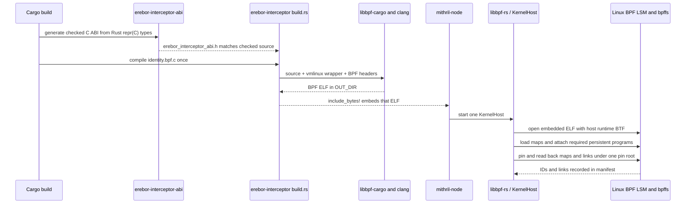

Read the concrete build path in [`erebor-interceptor/build.rs`](../../../crates/erebor-interceptor/build.rs#L15-L74).
It names the four checked BTF headers and invokes
[`libbpf_cargo::SkeletonBuilder`](../../../crates/erebor-interceptor/build.rs#L6-L6).
The embedded bytes are in
[`bundled.rs`](../../../crates/erebor-interceptor/src/bundled.rs#L1-L8), and
the runtime `libbpf-rs` open/load/attach path is in
[`host.rs`](../../../crates/erebor-interceptor/src/host.rs#L301-L379).

`vmlinux.h` is present. It is the small architecture selector at
[`bpf/erebor-interceptor/include/vmlinux.h`](../../../bpf/erebor-interceptor/include/vmlinux.h#L1-L22),
which chooses checked generated x86, arm64, arm, or riscv definitions through
the standard `__TARGET_ARCH_*` Clang target macro. CO-RE reads make the program
adapt to the runtime BTF layout within the supported kernel field variants.

The ABI header is also intentionally generated, not hand duplicated:

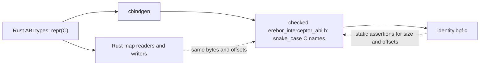

[`erebor-interceptor-abi/build.rs`](../../../crates/erebor-interceptor-abi/build.rs#L12-L55)
rejects a build when cbindgen produces a header different from the
checked-in one. The BPF translation unit adds size and offset assertions at
[`identity.bpf.c`](../../../bpf/erebor-interceptor/programs/identity.bpf.c#L12-L62).
The small BPF-only `exception_runtime_state_bpf_v1` wrapper is not a second
ABI: its first field must be the literal C `struct bpf_spin_lock` so the kernel
BTF recognizes it as a spin lock. The following assertions prove that it has
the same bytes and field offsets as the generated Rust ABI value.

### ABI read and write boundary

The Rust types are the source of the shared Application Binary Interface
(ABI). They use `#[repr(C)]`. The BPF program and the node run on the same host,
so numeric map keys use native byte order. Userspace uses `to_ne_bytes()` for
those keys. The C translation unit uses `_Static_assert` for decision-critical
sizes and offsets.

The Rust code uses the existing `zerocopy` crate. It does not use manual byte
offsets or a new parser framework.

| ABI case | Conversion | Validation result | Example |
| --- | --- | --- | --- |
| All bit patterns are valid | `FromBytes::read_from_bytes` | Rejects a wrong input size | [`IdentityRuntimeConfigV1` recovery](../../../crates/mithril-node/src/identity/native.rs#L68) and [`IdentityHealthV1` aggregation](../../../crates/mithril-node/src/identity/native.rs#L117) |
| An enum or closed field can contain an invalid bit pattern | `TryFromBytes::try_read_from_bytes` | Rejects a wrong input size and an invalid field value | [`ExecutionSetBindingStateV1` recovery](../../../crates/mithril-node/src/identity/binding.rs#L611) and [typed task inspection](../../../crates/mithril-node/src/identity/inspection.rs#L197) |
| Rust value to map bytes | `IntoBytes::as_bytes` | Preserves the `repr(C)` value layout | [`execution_set_bindings` publication](../../../crates/mithril-node/src/identity/binding.rs#L182) |

Each conversion maps an invalid value to a crate-owned SNAFU error. The
binding owner compares the recovered typed value with the newly prepared live
binding. This typed comparison replaces the earlier field-by-field byte-offset
reader. Per-CPU health aggregation parses each exact-size `IdentityHealthV1`
chunk and then adds its counters.

### Loader startup and recovery

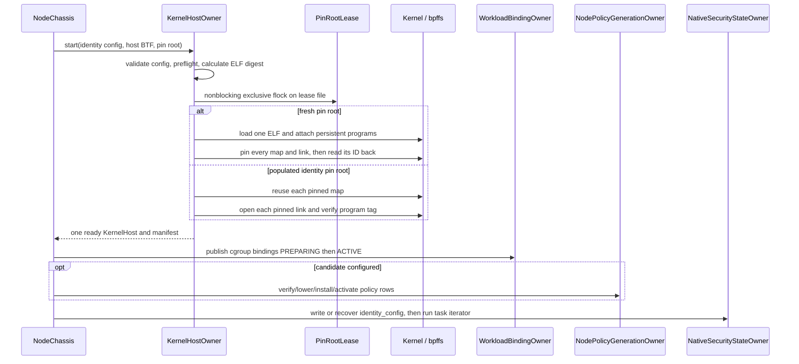

[`PinRootLease`](../../../crates/erebor-interceptor/src/lease.rs#L10-L43)
is a nonblocking exclusive `flock` held as the `_lease` field of the live
`KernelHost`. Its role is narrow: prevent a second loader from owning the same
pin root. It is not a policy lock and it does not serialize BPF map operations.

The recovery branch starts at
[`KernelHostOwner::recover`](../../../crates/erebor-interceptor/src/host.rs#L499).
It reuses existing map pins and verifies the complete expected link set. It
does not attach another persistent hook set. The task iterator is the one
exception: [`KernelHost::reconcile_tasks`](../../../crates/erebor-interceptor/src/host.rs#L893)
attaches the iterator only while it is read to completion during activation.

On normal node shutdown the production identity pins intentionally remain, so
a later process can validate and recover them. The disposable qualification
object removes its pins. See
[`KernelHost::shutdown`](../../../crates/erebor-interceptor/src/host.rs#L920).

## Ownership and publication boundaries

| State or capability | Durable owner | First implementation location | Not owned here |
| --- | --- | --- | --- |
| BPF ELF, map/link lifecycle, pins and manifest | `KernelHostOwner` / `KernelHost` | [`host.rs`](../../../crates/erebor-interceptor/src/host.rs#L255-L498) | Workload semantics or policy compilation |
| One node process and shutdown/reconnect loop | `NodeChassis` | [`node.rs`](../../../crates/mithril-node/src/node.rs#L35-L195) | A second privileged daemon |
| Cgroup workload binding | `WorkloadBindingOwner` | [`binding.rs`](../../../crates/mithril-node/src/identity/binding.rs#L51-L265) | Task labels, process state, policy decision rows |
| Identity configuration and reconciliation health | `NativeSecurityStateOwner` | [`native.rs`](../../../crates/mithril-node/src/identity/native.rs#L22-L117) | Object loading or container discovery |
| Portable policy/signature/simulation | `mithril-control` policy owners | [`mithril-control/src/policy`](../../../crates/mithril-control/src/policy) | BPF map handles or node startup |
| Node-local policy rows and mount reconstruction | `NodePolicyGenerationOwner` | [`policy.rs`](../../../crates/mithril-node/src/policy.rs#L31-L288) | Signature creation or cgroup binding lifecycle |
| Task/process/exec state | BPF lifecycle, exec, and exit programs | [`identity_lifecycle.bpf.h`](../../../bpf/erebor-interceptor/programs/identity_lifecycle.bpf.h), [`identity_exec.bpf.h`](../../../bpf/erebor-interceptor/programs/identity_exec.bpf.h), [`identity_exit.bpf.h`](../../../bpf/erebor-interceptor/programs/identity_exit.bpf.h) | Userspace task enrollment after the fact |
| Per-effect result | BPF `identity_effect_gate` | [`identity_effects.bpf.h`](../../../bpf/erebor-interceptor/programs/identity_effects.bpf.h#L460) | Control round trips or ring-buffer delivery |
| Ring consumption and recent records | `EffectObservationReader` / `EffectObservationStore` | [`host.rs`](../../../crates/erebor-interceptor/src/host.rs#L866), [`observation.rs`](../../../crates/mithril-node/src/observation.rs) | Policy decisions or durable audit |

### Node startup order

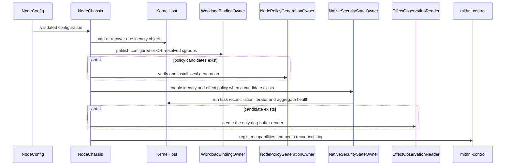

This is the exact ordering in
[`NodeChassis::start`](../../../crates/mithril-node/src/node.rs#L49-L195).
It matters that bindings and an optional generation exist *before* identity is
enabled and live tasks are reconciled.

### CRI binding refresh

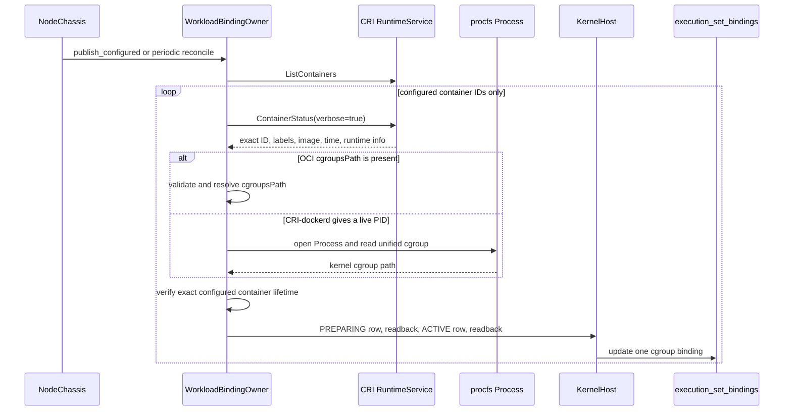

Read this flow at
[`ContainerRuntimeInventory::snapshot`](../../../crates/mithril-node/src/identity/runtime.rs#L88)
and
[`WorkloadBindingOwner::reconcile_runtime_inner`](../../../crates/mithril-node/src/identity/binding.rs#L276).
The node uses the `k8s-cri` generated client. It uses `procfs::Process` for the
CRI-dockerd PID fallback. It does not start a Docker listener, parse a CRI
command, or load a per-container BPF object.

### Shutdown and recovery

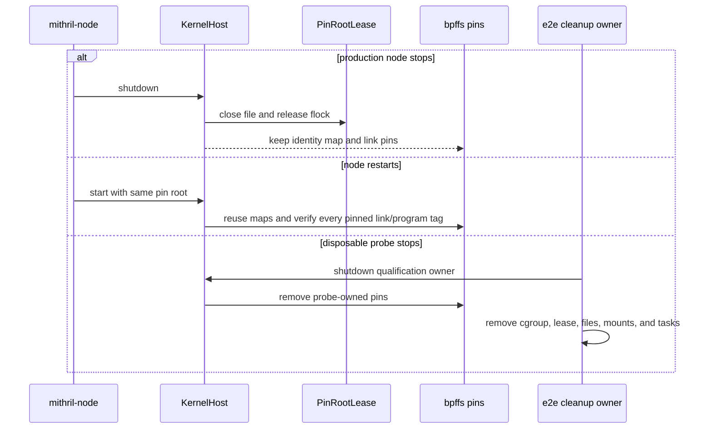

A bpffs pin keeps a map or link alive after the loader process exits. Process
exit does not delete a pinned object. Production identity shutdown keeps the
pins for recovery. The test owners explicitly remove disposable pins and then
assert that the paths no longer exist.

## The BPF object: source relationship and hook families

`identity.bpf.c` is intentionally a single translation unit. The include order
is the source-level dependency graph:

```text
vmlinux.h + generated ABI + libbpf headers
        |
        v
identity_maps.h        -- maps, shared helpers, BPF-only spin-lock wrappers
identity_task_helpers  -- native child construction and rollback
identity_root_helpers  -- root construction and coordinate finalization
identity_path.bpf.h    -- bounded canonical component and mount-view logic
        |
        +--> identity_lifecycle.bpf.h -- task/cgroup/wakeup/reconcile
        +--> identity_exec.bpf.h      -- exec transaction and argv proof
        +--> identity_effects.bpf.h   -- common gate plus explicit LSM hooks
        +--> identity_exit.bpf.h      -- reference release
```

The loader requires 36 named programs from the one ELF; the list is at
[`REQUIRED_IDENTITY_PROGRAMS`](../../../crates/erebor-interceptor/src/host.rs#L64-L102).
They fit five review families:

| Family | Programs / sections | Relationship to the others |
| --- | --- | --- |
| Task lifecycle | `lsm/task_alloc`, `tp_btf/cgroup_attach_task`, `raw_tracepoint/cgroup_release`, `fentry/wake_up_new_task`, `iter/task` | Establishes or rechecks task identity and cgroup placement. The iterator is temporary; the other four stay attached. |
| Exec transaction | `sys_enter_execve`, `sys_enter_execveat`, `lsm/bprm_check_security`, `security_bprm_committing_creds`, both exec syscall exits, `sched_process_exec` | Stages argv/executable candidates and commits or conservatively closes an execution transition. It reads identity created by lifecycle hooks. |
| Exact-file and effect gate | `file_open`, `file_permission`, `mmap_file`, `file_mprotect`, `file_ioctl`, IPC/socket/ptrace/signal, mutation, mount, capability and BPF LSM hooks | Every wrapper calls the common gate with an explicit effect family and operation. Only a qualified file-backed wrapper supplies a file object for exact resolution. |
| Mount completion | `erebor_mount_mutation_sys_exit` | Completes the task-local mount attempt after a mount LSM hook dirties the namespace view. It uses atomics, not a BPF spin lock, because tracing programs cannot use that lock. |
| Task exit | `sched_process_exit` | Uses the birth tombstone to release profile/entry/domain/process references exactly once. |

The 36 required names are a load-time completeness check, not a statement that
all 36 have a complete policy model. Review a hook's current claim through the
data it can actually provide to `identity_effect_gate`.

## Maps: what they store, who fills them, and who reads them

The authoritative declarations are all in
[`identity_maps.h`](../../../bpf/erebor-interceptor/programs/identity_maps.h#L78-L340).
The important simplification is that each map has one domain publisher on the
userspace side, while BPF owns event-time identity transitions. The kernel
loader has the file descriptor; it does not invent map contents.

### 1. Bootstrap and temporary state

| Map | Filled by | Read by | Plain meaning |
| --- | --- | --- | --- |
| `identity_config` (array, one record) | `NativeSecurityStateOwner`; `allocate_id` advances `next_id` atomically | Every identity/effect hook | Node boot ID, label epoch, enabled flags, configured deny errno, and opaque-ID allocator. |
| `identity_health` (per-CPU array) | BPF hook families increment counters | `NativeSecurityStateOwner` aggregates all CPU values | Diagnostic counters; missing health storage never authorizes anything. |
| `identity_scratch` (per-CPU array) | The currently running BPF invocation | That same invocation only | Reusable temporary construction area, not durable task identity. One invocation completes on one CPU. A later invocation uses the slot for its current CPU. Durable data is published to task storage or hash maps before return. |
| `effect_observation_health` (per-CPU array) | Effect gate | Runtime observation | Attempted/emitted/lost/unresolved observation counters. |
| `effect_observations` (4 MiB ring buffer) | Effect gate after selecting the result | One `libbpf-rs` ring reader | Best-effort evidence. Ring pressure can lose evidence but cannot change allow/deny. |

### 2. Binding and identity state

| Map(s) | Filled by | Read by | Plain meaning |
| --- | --- | --- | --- |
| `execution_set_bindings` | `WorkloadBindingOwner`: `PREPARING` → exact readback → `ACTIVE`; BPF consumes the single initial-root marker and tombstones a released cgroup | Lifecycle and effect gate | The live cgroup-to-workload authority record, including nonce, profile generation and roles. BPF never creates or activates a binding. |
| `profile_generation_task_refs` | Binding owner creates the zero value; BPF birth increments and exit decrements | BPF lifecycle and node recovery | Keeps a generation retained while labelled tasks exist. |
| `task_labels` (task storage) | BPF `publish_task`; BPF rollback deletes partial publication | Every hot BPF path | Immutable birth identity attached directly to the kernel task. There is no delayed PID enrollment. |
| `task_coordinates`, `kernel_real_parent_intervals`, `created_by_edges` | BPF birth/wakeup/exec/exit/reconcile | Identity and effect paths; inspection | Reusable Linux coordinates, current kernel-parent observation, and immutable creator proof. |
| `process_states`, `process_state_vectors`, `entry_states`, `authority_domains` | BPF root/native birth; BPF exec and exit transitions | Lifecycle, exec and effect paths | Current mutable authority state for a process, its finite state vector, entry lifetime, and native-family domain. |
| `external_root_classifications`, `pending_execs`, `image_provenance`, `process_execution_instances`, `task_reference_tombstones` | BPF lifecycle/exec/exit | Lifecycle, exec, effect and reconciliation paths | Root kind, in-flight exec state, exact executable provenance, execution instances, and exactly-once release bookkeeping. |

### 3. Authorization-proof state

| Map(s) | Filled by | Read or changed by | Plain meaning |
| --- | --- | --- | --- |
| `approved_exec_slots`, `approved_exec_arguments` | `AuthorizationProofOwner` | Exec path consumes one matching slot; exec path reads bounded argument bytes | Current identity-side foundation for exact administrative exec proof. It is not a broad command-string allow list. |
| `pending_administrative_matches` | Exec entry path | BPRM/exec completion path | Short-lived bridge from verified syscall argv to the BPRM transaction. |

### 4. Signed policy, exact file, and mount state

| Map(s) | Filled by | Read or changed by | Plain meaning |
| --- | --- | --- | --- |
| `profile_generation_descriptors` | `NodePolicyGenerationOwner` writes `PREPARING`, `READ_BACK`, then `ACTIVE` | Effect gate | The generation is usable only when its boot/epoch/profile descriptor is `ACTIVE`. Its mode says `OBSERVE` or `PROTECT`. |
| `effect_decisions`, `effect_defaults` | `NodePolicyGenerationOwner` | Effect gate | Exact-object row first, then finite default fallback. A decision contains the physical disposition and errno/exception handle. |
| `exception_runtime_states` | Policy owner writes exact signed initial state and validates a recovered state | BPF locks one value, checks deadline/count, and consumes one use | The implemented bounded-exception counter. It owns `maximum_uses`, `consumed_uses`, expiry and terminal state atomically. |
| `exact_file_objects` | Policy owner writes configured tuple rows; BPF attempts a generation-scoped dynamic binding after canonical resolution | Effect gate | Exact object key: mount namespace, unique mount identity, device, inode, generation. It is not a pathname-only policy key. |
| `mount_security_views`, `mount_mutation_epochs`, `mount_security_view_locks`, `mount_reconciliation_proposals` | Policy owner initializes/reconciles; BPF mount hooks dirty/advance state; BPF file gate commits an exact proposal | BPF path and policy reconciliation | Namespace-global topology safety state. A dirty or racing view cannot produce a strict file decision. |
| `canonical_mount_roots`, `path_graph_exact_transitions`, `path_graph_wildcard_transitions`, `path_graph_terminals` | Policy owner after resolving the represented mount view | BPF canonical path candidate | The bounded Meta component graph and trusted root prefix used to turn live dentry components into a signed class candidate. |
| `mount_mutation_attempts` (task storage) | BPF mount and exit paths | BPF mount completion | A small task-local pairing record only. Namespace topology authority stays in namespace-keyed maps. |

### Complete map lifecycle matrix

All maps in this table belong to the one production object. The loader pins
all of them below `PIN_ROOT/maps`. “Pin-root lifetime” means that the bpffs pin
keeps the map alive after process exit. A later node can reuse the map. Only an
explicit cleanup owner removes the pin. Task-storage values also end when their
kernel task ends. Per-CPU scratch content is reusable temporary content even
though the map object stays pinned.

| Map | Key and value ABI | Userspace writer | BPF writer | Readers | Lifetime |
| --- | --- | --- | --- | --- | --- |
| `identity_config` | `u32` → `IdentityRuntimeConfigV1` | `NativeSecurityStateOwner` | `allocate_id` changes `next_id` atomically | All identity and effect families | Pin-root lifetime; one row for one boot and label epoch |
| `identity_health` | per-CPU `u32` → `IdentityHealthV1` | None | Lifecycle, exec, and exit families | Native health aggregation | Pin-root lifetime; counters are per CPU |
| `identity_scratch` | per-CPU `u32` → BPF-only `identity_scratch_v1` | None | Current BPF invocation | Current BPF invocation | Pin-root lifetime; content is temporary and can change on the next invocation on that CPU |
| `task_labels` | task-storage kernel key → `TaskLabelV1` | None | Root and native publication; rollback deletes | Lifecycle, exec, effect, exit, iterator, inspector | Map has pin-root lifetime; each value has task lifetime |
| `task_coordinates` | `u64 task_cookie` → `TaskCoordinateV1` | None | Root, native, wake, exec, exit, iterator | Lifecycle, exec, effect, inspector | Pin-root lifetime; explicit exit and rollback cleanup |
| `kernel_real_parent_intervals` | `KernelRealParentIntervalKeyV1` → `KernelRealParentIntervalV1` | None | Birth, refresh, exec, exit, iterator | Identity, effect, inspector | Pin-root lifetime; interval and exit cleanup |
| `created_by_edges` | `u64 task_cookie` → `CreatedByEdgeV1` | None | Root and native birth | Identity and inspector | Pin-root lifetime; immutable creator proof until cleanup |
| `process_states` | `Id128V1` → `ProcessSecurityStateV1` | None | Root, native, exec, exit | Lifecycle, exec, effect, inspector | Pin-root lifetime; reference-owned process lifetime |
| `process_state_vectors` | `Id128V1` → `ProcessStateVectorV1` | None | Root, native, exec, exit | Lifecycle, exec, effect, inspector | Pin-root lifetime; process-state lifetime |
| `profile_generation_task_refs` | `u64 generation_ref` → `u64 count` | Binding owner creates zero row | Birth and exit change count atomically | Lifecycle, effect, binding recovery | Pin-root lifetime; retained while bindings or tasks refer to the generation |
| `entry_states` | `Id128V1` → `EntrySecurityStateV1` | None | Root, native, exec, exit | Lifecycle, exec, effect, inspector | Pin-root lifetime; entry reference lifetime |
| `authority_domains` | `Id128V1` → `AuthorityDomainStateV1` | None | Root, native, exec, exit | Lifecycle, exec, effect, inspector | Pin-root lifetime; native-family reference lifetime |
| `execution_set_bindings` | `u64 cgroup_id` → `ExecutionSetBindingStateV1` | `WorkloadBindingOwner` | Initial-root consume; cgroup release tombstones | Lifecycle, exec, effect, binding recovery | Pin-root lifetime; userspace terminates or BPF tombstones a dead cgroup |
| `external_root_classifications` | `u64 task_cookie` → `ExternalRootClassificationV1` | None | Root publication and rollback | Exec, exit, inspector | Pin-root lifetime; root task lifetime |
| `pending_execs` | `u64 task_cookie` → `PendingExecV1` | None | Exec syscall and BPRM transaction | Exec and effect families | Pin-root lifetime; one in-flight exec transaction |
| `image_provenance` | `Id128V1` → `ImageProvenanceV1` | None | Root and exec commit/rollback | Exec, effect, exit, inspector | Pin-root lifetime; execution reference lifetime |
| `process_execution_instances` | `Id128V1` → `ProcessExecutionInstanceV1` | None | Root and exec commit/rollback | Exec, effect, exit, inspector | Pin-root lifetime; execution reference lifetime |
| `approved_exec_slots` | `ApprovedExecSlotKeyV1` → `ApprovedExecSlotV1` | `AuthorizationProofOwner` | Exec path changes or consumes a matching slot | Authorization owner and exec path | Pin-root lifetime; one approved slot lifetime |
| `approved_exec_arguments` | `ApprovedExecArgumentKeyV1` → `u8` | `AuthorizationProofOwner` | None | Authorization owner and exec argument matcher | Pin-root lifetime; removed with its slot |
| `pending_administrative_matches` | `u64 task_cookie` → `PendingAdministrativeMatchV1` | None | Exec entry, BPRM, completion, and exit | Exec path | Pin-root lifetime; one in-flight administrative match |
| `task_reference_tombstones` | `u64 task_cookie` → `TaskReferenceTombstoneV1` | None | Birth, rollback, and exit | Exit and reconciliation | Pin-root lifetime; used once for exact reference release |
| `profile_generation_descriptors` | `u64 generation_ref` → `ProfileGenerationDescriptorV1` | `NodePolicyGenerationOwner` | None | Effect gate and recovery | Pin-root lifetime; immutable active generation until policy cleanup |
| `effect_decisions` | `EffectDecisionKeyV1` → `PhysicalDecisionV1` | `NodePolicyGenerationOwner` | None | Effect gate | Pin-root lifetime; generation lifetime |
| `effect_defaults` | `EffectDefaultKeyV1` → `PhysicalDecisionV1` | `NodePolicyGenerationOwner` | None | Effect gate | Pin-root lifetime; generation lifetime |
| `exception_runtime_states` | `ExceptionRuntimeStateKeyV1` → `ExceptionRuntimeStateV1` compatible BPF lock wrapper | `NodePolicyGenerationOwner` | Effect gate consumes, expires, and exhausts under spin lock | Policy recovery and effect gate | Pin-root lifetime; mutable exception lifetime survives node restart |
| `exact_file_objects` | `ExactFileObjectKeyV1` → `ExactObjectBindingV1` | `NodePolicyGenerationOwner` | Effect gate can add a generation-scoped dynamic row | Policy recovery and effect gate | Pin-root lifetime; generation and mount-view validity limit use |
| `mount_security_views` | `u32 mount_namespace_inode` → `MountSecurityViewStateV1` | `NodePolicyGenerationOwner` | Mount hooks dirty and advance the view; file gate can commit reconciliation | Policy owner, mount hooks, path gate | Pin-root lifetime; namespace view lifetime |
| `mount_security_view_locks` | `u32 mount_namespace_inode` → BPF spin lock | `NodePolicyGenerationOwner` creates row | LSM mount and path programs lock the row | LSM mount and path programs | Pin-root lifetime; namespace view lifetime |
| `mount_reconciliation_proposals` | `u32 mount_namespace_inode` → `MountReconciliationProposalV1` | `NodePolicyGenerationOwner` | File gate consumes a matching proposal | Policy owner and file gate | Pin-root lifetime; one exact epoch/version proposal |
| `mount_mutation_epochs` | `u32 mount_namespace_inode` → `u64` | `NodePolicyGenerationOwner` initializes row | Mount paths advance epoch atomically | Policy owner, mount path, file path | Pin-root lifetime; namespace view lifetime |
| `canonical_mount_roots` | `CanonicalMountRootKeyV1` → `CanonicalMountRootV1` | `NodePolicyGenerationOwner` | None | Canonical path engine | Pin-root lifetime; active generation and represented view lifetime |
| `path_graph_exact_transitions` | `PathGraphTransitionKeyV1` → `PathGraphTransitionV1` | `NodePolicyGenerationOwner` | None | Canonical path engine | Pin-root lifetime; active generation lifetime |
| `path_graph_wildcard_transitions` | `PathGraphStateKeyV1` → `PathGraphTransitionV1` | `NodePolicyGenerationOwner` | None | Canonical path engine | Pin-root lifetime; active generation lifetime |
| `path_graph_terminals` | `PathGraphStateKeyV1` → `PathGraphTerminalV1` | `NodePolicyGenerationOwner` | None | Canonical path engine | Pin-root lifetime; active generation lifetime |
| `mount_mutation_attempts` | task-storage kernel key → `MountMutationAttemptV1` | None | Mount LSM entry and syscall-exit completion | Mount completion | Map has pin-root lifetime; each value has task or syscall-attempt lifetime |
| `effect_observations` | no key → `EffectObservationV1` ring records | None | Effect gate after it fixes the physical result | One `EffectObservationReader` | Pin-root lifetime; a full ring rejects a new reservation and increments the loss counter |
| `effect_observation_health` | per-CPU `u32` → `EffectObservationHealthV1` | None | Effect emission path | Runtime observation health | Pin-root lifetime; counters are per CPU |

The rest of this section gives the map-fill order for review.

### Binding publication

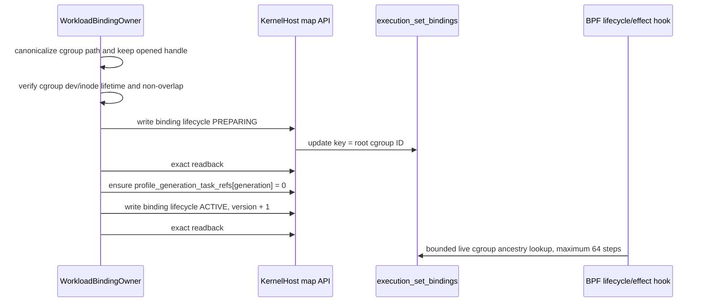

The concrete writes are in
[`WorkloadBindingOwner::publish_all`](../../../crates/mithril-node/src/identity/binding.rs#L106-L265).
For a configured runtime socket, the same owner reconciles a CRI inventory;
it still publishes exactly the same binding record rather than loading another
BPF program.

### Signed generation publication

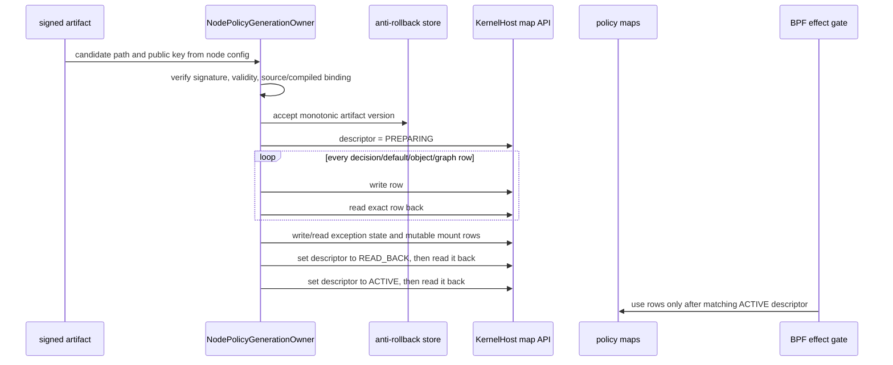

[`LoweredGeneration::install`](../../../crates/mithril-node/src/policy.rs#L655-L778)
contains that sequence. It keeps a recovered active descriptor only if the
immutable rows still match; this is why a node restart does not silently turn a
changed candidate into the old generation.

### Identity birth and use

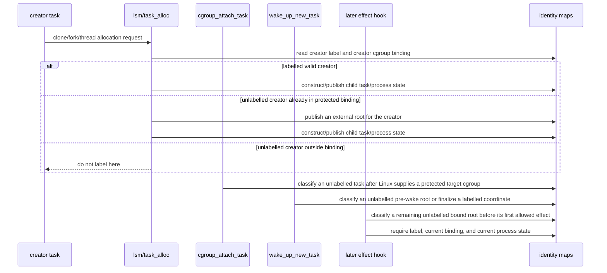

`task_alloc` never guesses the new child's future cgroup. It reads the current
creator's live cgroup. If that unlabelled creator is already in a protected
binding, the hook publishes an external root for the creator and then publishes
the child as a native descendant. The cgroup-attach hook remains the primary
path when Linux supplies a target protected cgroup. The wake hook and the
first-effect front are conservative fallbacks for runtime creation orders that
do not expose a usable attach event before the task enters the protected
cgroup.

### Exact-file decision and observation

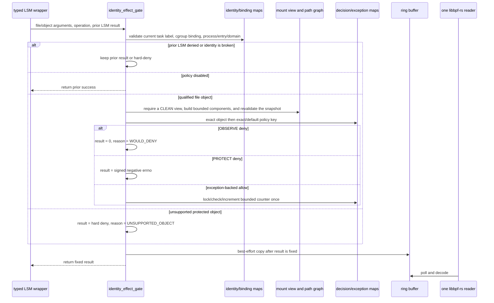

Start at
[`identity_effect_gate`](../../../bpf/erebor-interceptor/programs/identity_effects.bpf.h#L460).
Then read
[`prepare_effect_identity`](../../../bpf/erebor-interceptor/programs/identity_effects.bpf.h#L186)
and
[`resolved_identity_effect_gate`](../../../bpf/erebor-interceptor/programs/identity_effects.bpf.h#L206).
The wrappers below it deliberately retain visible Linux hook prototypes; they
do not hide unrelated operations behind a macro. A wrapper with no qualified
object passes `NULL`, causing protected state to take the explicit hard-safe
unsupported path rather than pretending it has a complete policy model.

### Mount invalidation and reconciliation

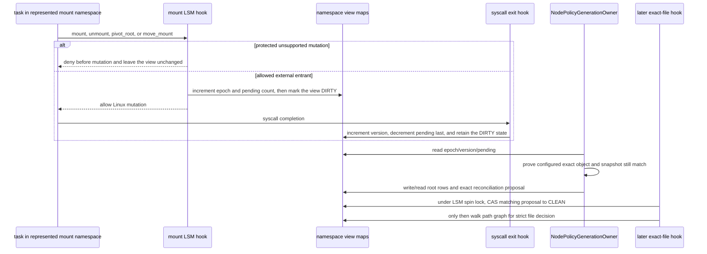

The view key is the mount-namespace inode, not the task cgroup. That prevents a
host task that enters the represented mount namespace from bypassing topology
invalidation merely because it is outside the workload cgroup. The LSM-side
map lock is used only in LSM programs; the tracing exit program uses atomics as
required by the verifier.

## BPF vocabulary needed for review

| Item | Meaning here |
| --- | --- |
| `SEC("...")` | Puts a function in an ELF section. libbpf uses the section to select program type/attach behavior. `SEC("lsm/task_alloc")` is a BPF LSM hook for the kernel `task_alloc` security hook. |
| `BPF_PROG(name, ...)` | libbpf tracing macro that gives C a typed function view of the BPF context while preserving the ABI Linux expects. It is not Rust and does not itself attach a program. |
| `BPF_CORE_READ_INTO` | CO-RE field read: Clang records field relocation information so libbpf can adapt a supported kernel field layout using runtime BTF. |
| `bpf_get_current_task_btf()` | Returns a verifier-trusted pointer to the task that is currently executing the hook. In `task_alloc`, that is the creator, not the half-created `task` argument. |
| `bpf_task_storage_get` | Looks up a BPF task-storage value. Passing flags `0, 0` means lookup only; it does not create a label. |
| `bpf_map_lookup_elem` | Returns a temporary pointer to a map value for this BPF invocation or `NULL`. The verifier prevents retaining it after return. |
| `BPF_NOEXIST` | Map-update mode that fails rather than replacing a key that already exists. Birth code uses it to avoid silently overwriting identity state. |
| `__sync_*` | Clang lowers these operations to BPF atomics. They implement bounded counters/CAS without a userspace lock in the hot path. |
| BPF spin lock | A special lock field recognized from BTF in a map value. It is used only where Linux permits it; it is not interchangeable with an ordinary `u32`. |
| Return `0` from an LSM BPF program | Adds no denial. It does not override another LSM's prior nonzero decision. A negative errno denies the operation. |

## Task allocation: contract before reading the source

The exact function under review is:

```c
SEC("lsm/task_alloc")
int BPF_PROG(erebor_task_alloc, struct task_struct *task,
             unsigned long clone_flags, int ret)
```

It is at
[`identity_lifecycle.bpf.h` line 35](../../../bpf/erebor-interceptor/programs/identity_lifecycle.bpf.h#L35).

Its contract is deliberately narrow:

1. Preserve a denial from an earlier LSM program.
2. Do nothing while Mithril identity is disabled.
3. Read the *creator's* label and the creator's live cgroup binding.
4. If that creator has a valid Mithril label, create a fail-closed native child
   before Linux can run it.
5. If it is unlabelled but is inside a protected binding, publish an external
   root for the creator. Then create the new task as its native child.
6. If it is unlabelled and outside every configured binding, make no identity
   claim. A later cgroup-attach, wake, or first-effect path creates an external
   or initial root after the task has a protected cgroup.

`clone_flags` is the standard Linux UAPI word. The child helper uses standard
`CLONE_THREAD` and `CLONE_PARENT` from
[`linux_uapi.h`](../../../bpf/erebor-interceptor/include/linux_uapi.h), rather
than an invented Mithril clone-flag copy. Threads retain the process-level
identity; a process child receives distinct process/execution identifiers.

### Task allocation line by line

Blank source lines are formatting only. Every nonblank source line in this
function is described below, including braces where they define a branch.

| Source line | Exact effect |
| --- | --- |
| [35](../../../bpf/erebor-interceptor/programs/identity_lifecycle.bpf.h#L35) | `SEC("lsm/task_alloc")` puts the next function in the BPF LSM task-allocation section. libbpf uses this section to load and attach the program to the Linux `task_alloc` security hook. |
| [36](../../../bpf/erebor-interceptor/programs/identity_lifecycle.bpf.h#L36) | `BPF_PROG` gives C a typed view of the BPF tracing context. `erebor_task_alloc` is the program name that the loader requires. `task` is the new kernel task. |
| [37](../../../bpf/erebor-interceptor/programs/identity_lifecycle.bpf.h#L37) | `clone_flags` is the Linux clone flag word. `ret` is the result from an earlier LSM program. |
| [38](../../../bpf/erebor-interceptor/programs/identity_lifecycle.bpf.h#L38) | The opening brace starts the program body. No pointer from this body can escape the BPF invocation. |
| [39](../../../bpf/erebor-interceptor/programs/identity_lifecycle.bpf.h#L39) | Declares a pointer to the one runtime configuration value. The program assigns the pointer at line 51. |
| [40](../../../bpf/erebor-interceptor/programs/identity_lifecycle.bpf.h#L40) | Declares a pointer to the current CPU's health counters. Health data reports faults. Health data never grants authority. |
| [41](../../../bpf/erebor-interceptor/programs/identity_lifecycle.bpf.h#L41) | Declares a pointer to the current CPU's scratch value. The program uses this value to construct state before publication. |
| [42](../../../bpf/erebor-interceptor/programs/identity_lifecycle.bpf.h#L42) | Declares a verifier-trusted pointer to the current creator task. |
| [43](../../../bpf/erebor-interceptor/programs/identity_lifecycle.bpf.h#L43) | Declares the creator cgroup pointer and initializes it to `NULL`. This initialization prevents use of an undefined pointer after a failed read. |
| [44](../../../bpf/erebor-interceptor/programs/identity_lifecycle.bpf.h#L44) | Declares the optional creator label from BPF task storage. |
| [45](../../../bpf/erebor-interceptor/programs/identity_lifecycle.bpf.h#L45) | Declares the optional binding found from the creator's live cgroup ancestry. |
| [46](../../../bpf/erebor-interceptor/programs/identity_lifecycle.bpf.h#L46) | Declares the ancestry lookup status. A separate status distinguishes “no binding” from “could not prove the lookup.” |
| [47](../../../bpf/erebor-interceptor/programs/identity_lifecycle.bpf.h#L47) | Declares the child-construction result. Zero means success. A negative errno denies the allocation. |
| [49](../../../bpf/erebor-interceptor/programs/identity_lifecycle.bpf.h#L49) | Tests the earlier LSM result before Mithril reads or changes state. |
| [50](../../../bpf/erebor-interceptor/programs/identity_lifecycle.bpf.h#L50) | Returns the earlier result unchanged. Mithril cannot mask an earlier denial. |
| [51](../../../bpf/erebor-interceptor/programs/identity_lifecycle.bpf.h#L51) | Looks up array key zero in `identity_config`. The helper returns a temporary map-value pointer or `NULL`. |
| [52](../../../bpf/erebor-interceptor/programs/identity_lifecycle.bpf.h#L52) | Tests for an absent configuration or a disabled identity engine. |
| [53](../../../bpf/erebor-interceptor/programs/identity_lifecycle.bpf.h#L53) | Returns zero while identity is disabled. Zero adds no Mithril denial. Other LSM decisions remain in force. |
| [54](../../../bpf/erebor-interceptor/programs/identity_lifecycle.bpf.h#L54) | Gets this CPU's health record. A failed lookup produces `NULL`. |
| [55](../../../bpf/erebor-interceptor/programs/identity_lifecycle.bpf.h#L55) | Gets this CPU's scratch record. A per-CPU value avoids cross-CPU writers for one invocation. |
| [56](../../../bpf/erebor-interceptor/programs/identity_lifecycle.bpf.h#L56) | Tests the required scratch pointer. |
| [57](../../../bpf/erebor-interceptor/programs/identity_lifecycle.bpf.h#L57) | Denies when scratch is unavailable. `identity_deny` returns the configured negative errno or standard `-EACCES`. |
| [58](../../../bpf/erebor-interceptor/programs/identity_lifecycle.bpf.h#L58) | Calls `bpf_get_current_task_btf()`. The helper returns a BTF-typed, verifier-trusted pointer to the creator that is running this hook. |
| [59](../../../bpf/erebor-interceptor/programs/identity_lifecycle.bpf.h#L59) | Calls `bpf_task_storage_get` for the creator. The zero flags request lookup only. The helper does not create a label. |
| [60](../../../bpf/erebor-interceptor/programs/identity_lifecycle.bpf.h#L60) | Calls `task_cgroup` to read the creator's current default cgroup. The test is for a read failure. |
| [61](../../../bpf/erebor-interceptor/programs/identity_lifecycle.bpf.h#L61) | Tests whether the optional health record exists. |
| [62](../../../bpf/erebor-interceptor/programs/identity_lifecycle.bpf.h#L62) | Counts the cgroup read failure as a placement mismatch. |
| [63](../../../bpf/erebor-interceptor/programs/identity_lifecycle.bpf.h#L63) | Denies because the program cannot prove whether the creator is in a protected cgroup. |
| [64](../../../bpf/erebor-interceptor/programs/identity_lifecycle.bpf.h#L64) | Closes the cgroup-read failure branch. |
| [65](../../../bpf/erebor-interceptor/programs/identity_lifecycle.bpf.h#L65) | Starts the bounded binding lookup from the creator cgroup. |
| [66](../../../bpf/erebor-interceptor/programs/identity_lifecycle.bpf.h#L66) | Passes a status output to the lookup. The returned pointer can be `NULL` after a complete walk outside all configured bindings. |
| [67](../../../bpf/erebor-interceptor/programs/identity_lifecycle.bpf.h#L67) | Tests for an incomplete or invalid ancestry walk. |
| [68](../../../bpf/erebor-interceptor/programs/identity_lifecycle.bpf.h#L68) | Tests whether health counters are available. |
| [69](../../../bpf/erebor-interceptor/programs/identity_lifecycle.bpf.h#L69) | Counts the failed ancestry proof as a placement mismatch. |
| [70](../../../bpf/erebor-interceptor/programs/identity_lifecycle.bpf.h#L70) | Denies rather than treating an incomplete walk as unprotected. |
| [71](../../../bpf/erebor-interceptor/programs/identity_lifecycle.bpf.h#L71) | Closes the failed-binding-lookup branch. |
| [72](../../../bpf/erebor-interceptor/programs/identity_lifecycle.bpf.h#L72) | Selects the established native-child path when the creator already has a label. |
| [73](../../../bpf/erebor-interceptor/programs/identity_lifecycle.bpf.h#L73) | Checks that the creator label has the current node boot ID and label epoch. |
| [74](../../../bpf/erebor-interceptor/programs/identity_lifecycle.bpf.h#L74) | Checks that the live binding has the label's binding ID and nonce and has the `ACTIVE` state. |
| [75](../../../bpf/erebor-interceptor/programs/identity_lifecycle.bpf.h#L75) | Tests whether health counters are available after either identity check fails. |
| [76](../../../bpf/erebor-interceptor/programs/identity_lifecycle.bpf.h#L76) | Counts the stale or misplaced creator identity. |
| [77](../../../bpf/erebor-interceptor/programs/identity_lifecycle.bpf.h#L77) | Denies before the program publishes child state. |
| [78](../../../bpf/erebor-interceptor/programs/identity_lifecycle.bpf.h#L78) | Closes the invalid-established-identity branch. |
| [79](../../../bpf/erebor-interceptor/programs/identity_lifecycle.bpf.h#L79) | Calls the native-child constructor with the new task, trusted creator, Linux clone flags, runtime configuration, creator label, binding, and scratch record. |
| [80](../../../bpf/erebor-interceptor/programs/identity_lifecycle.bpf.h#L80) | Completes the call and stores its result. The helper publishes all required state or rolls back its partial state. |
| [81](../../../bpf/erebor-interceptor/programs/identity_lifecycle.bpf.h#L81) | Starts the path for a creator that has no task-storage label. |
| [82](../../../bpf/erebor-interceptor/programs/identity_lifecycle.bpf.h#L82) | Tests whether the unlabelled creator is already inside a configured protected binding. |
| [83](../../../bpf/erebor-interceptor/programs/identity_lifecycle.bpf.h#L83) | Calls `label_external_root` for the creator. This helper constructs the complete root state, publishes task storage, and finalizes the Linux coordinate. |
| [84](../../../bpf/erebor-interceptor/programs/identity_lifecycle.bpf.h#L84) | Tests whether health counters are available after root publication fails. |
| [85](../../../bpf/erebor-interceptor/programs/identity_lifecycle.bpf.h#L85) | Counts a denied protected creator that still has no usable identity. |
| [86](../../../bpf/erebor-interceptor/programs/identity_lifecycle.bpf.h#L86) | Denies the child allocation. The failed root helper retains no usable partial authority. |
| [87](../../../bpf/erebor-interceptor/programs/identity_lifecycle.bpf.h#L87) | Closes the failed-external-root branch. |
| [88](../../../bpf/erebor-interceptor/programs/identity_lifecycle.bpf.h#L88) | Starts a new lookup of the creator label after root publication. |
| [89](../../../bpf/erebor-interceptor/programs/identity_lifecycle.bpf.h#L89) | Calls `bpf_task_storage_get` again. The returned pointer proves that publication created the task label. |
| [90](../../../bpf/erebor-interceptor/programs/identity_lifecycle.bpf.h#L90) | Tests for an absent label after the root helper reported success. |
| [91](../../../bpf/erebor-interceptor/programs/identity_lifecycle.bpf.h#L91) | Tests whether health counters are available. |
| [92](../../../bpf/erebor-interceptor/programs/identity_lifecycle.bpf.h#L92) | Counts the inconsistent publication as missing identity. |
| [93](../../../bpf/erebor-interceptor/programs/identity_lifecycle.bpf.h#L93) | Denies. The program does not create a child from an unproven creator label. |
| [94](../../../bpf/erebor-interceptor/programs/identity_lifecycle.bpf.h#L94) | Closes the missing-label-after-publication branch. |
| [95](../../../bpf/erebor-interceptor/programs/identity_lifecycle.bpf.h#L95) | Calls the same native-child constructor after external-root publication. |
| [96](../../../bpf/erebor-interceptor/programs/identity_lifecycle.bpf.h#L96) | Passes the new creator label and the existing protected binding. |
| [97](../../../bpf/erebor-interceptor/programs/identity_lifecycle.bpf.h#L97) | Completes the call and stores the result. |
| [98](../../../bpf/erebor-interceptor/programs/identity_lifecycle.bpf.h#L98) | Starts the case for an unlabelled creator outside all configured bindings. |
| [99](../../../bpf/erebor-interceptor/programs/identity_lifecycle.bpf.h#L99) | Returns zero. This hook makes no claim about an unprotected task. |
| [100](../../../bpf/erebor-interceptor/programs/identity_lifecycle.bpf.h#L100) | Closes the no-binding branch. |
| [101](../../../bpf/erebor-interceptor/programs/identity_lifecycle.bpf.h#L101) | Closes the unlabelled-creator branch. |
| [102](../../../bpf/erebor-interceptor/programs/identity_lifecycle.bpf.h#L102) | Tests for a failed native-child constructor and an available health record. |
| [103](../../../bpf/erebor-interceptor/programs/identity_lifecycle.bpf.h#L103) | Counts the child allocation failure. The counter does not change the result. |
| [104](../../../bpf/erebor-interceptor/programs/identity_lifecycle.bpf.h#L104) | Returns zero after complete publication. It returns the constructor's negative errno after a failure. |
| [105](../../../bpf/erebor-interceptor/programs/identity_lifecycle.bpf.h#L105) | Ends the program. The BPF verifier proves that no temporary pointer escapes. |

### The helpers `task_alloc` depends on

The line-by-line table above is the complete hook. These four helpers are the
minimum transitive reading set needed to understand its nontrivial lines.

| Helper | Start | What to verify |
| --- | --- | --- |
| `identity_runtime_config`, `identity_health_record`, `identity_scratch_record` | [`identity_maps.h`](../../../bpf/erebor-interceptor/programs/identity_maps.h#L341-L355) | All use fixed key zero. Config is authority; health is diagnostic; scratch is temporary. |
| `task_cgroup`, `cgroup_id`, `cgroup_parent`, `binding_for_cgroup` | [`identity_maps.h`](../../../bpf/erebor-interceptor/programs/identity_maps.h#L388-L476) | CO-RE reads the current default cgroup and walks at most 64 ancestors. It distinguishes a complete no-binding result from an error. |
| `identity_deny` | [`identity_maps.h`](../../../bpf/erebor-interceptor/programs/identity_maps.h#L478) | The inline BPF instruction sequence sign-extends an ABI `i32`, bounds the result to a legal negative errno range for the verifier, and falls back to `-EACCES`. This is BPF bytecode assembly. It is not host x86 or Arm assembly. |
| `label_matches_runtime`, `binding_matches_label` | [`identity_maps.h`](../../../bpf/erebor-interceptor/programs/identity_maps.h#L534) | Label boot and epoch checks plus binding ID, nonce, and state checks prevent stale state and cgroup reuse from becoming authority. |
| `label_external_root` | [`identity_lifecycle.bpf.h`](../../../bpf/erebor-interceptor/programs/identity_lifecycle.bpf.h#L6) | Uses the shared root constructor and coordinate finalizer. It records allocation or coordinate failure. It returns `-EACCES` when it cannot publish a usable root. |
| `create_native_child` | [`identity_task_helpers.h`](../../../bpf/erebor-interceptor/programs/identity_task_helpers.h#L375) | Validates parent authority, allocates IDs, constructs records in scratch, writes no-replace rows, publishes task storage, and reverses acquired state after a failure. |

### Native child publication order

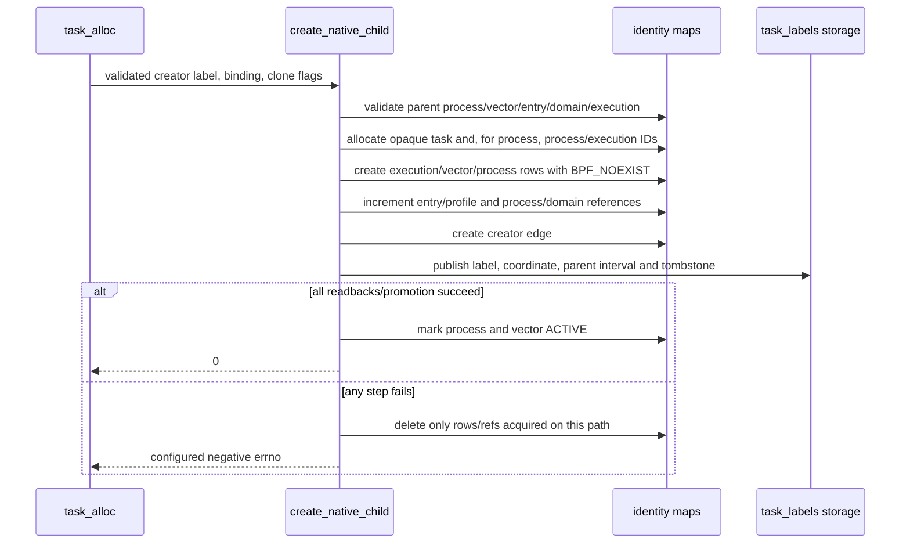

The helper uses `CLONE_THREAD` only to distinguish a new thread from a new
process. A thread retains the parent process state and increments its thread
reference; a process child receives new process/execution identities and adds a
domain process reference. `CLONE_PARENT` is handled using the kernel's
`real_parent` observation, but does not rewrite the immutable
`CreatedByEdgeV1` proof of the actual creator.

### Root-classification paths

The implementation has four entry points to one root constructor. Each entry
point calls `label_external_root`. That helper calls
[`create_external_root`](../../../bpf/erebor-interceptor/programs/identity_root_helpers.h#L266)
and then calls
[`finalize_task_coordinate`](../../../bpf/erebor-interceptor/programs/identity_root_helpers.h#L288).

| Entry point | When it runs | Reason for the entry point |
| --- | --- | --- |
| [`erebor_cgroup_attach_task`](../../../bpf/erebor-interceptor/programs/identity_lifecycle.bpf.h#L107) | Linux attaches an unlabelled task to a configured cgroup. | This is the primary path because the hook supplies the target cgroup. |
| [`erebor_wake_up_new_task`](../../../bpf/erebor-interceptor/programs/identity_lifecycle.bpf.h#L174) | Linux is about to wake a new task. | This handles `CLONE_INTO_CGROUP` orders where the new task is already in the configured cgroup before wake. |
| [`erebor_task_alloc`](../../../bpf/erebor-interceptor/programs/identity_lifecycle.bpf.h#L35) | An unlabelled creator already in a configured binding creates a child. | This makes the creator an external root before the program derives a native child from it. |
| [`prepare_effect_identity`](../../../bpf/erebor-interceptor/programs/identity_effects.bpf.h#L186) | An unlabelled task in a configured cgroup reaches its first allowed LSM effect. | This is the last pre-effect safety path for runtime creation orders that do not produce a usable earlier event. |

`consume_initial_root` uses an atomic compare-and-swap. One root can consume an
armed initial-root marker. Later independent roots receive the external,
restricted class. The first-effect front is separate from the resolved effect
gate because the kernel limits the combined BPF call stack to 512 bytes.

## Effect gate and current Phase 3/4 boundary

Read the gate in this order:

| Source | What happens |
| --- | --- |
| [`identity_effects.bpf.h` line 19](../../../bpf/erebor-interceptor/programs/identity_effects.bpf.h#L19) | Initializes an observation and preserves the physical result independently of best-effort ring delivery. |
| [Line 94](../../../bpf/erebor-interceptor/programs/identity_effects.bpf.h#L94) | Builds exact and default keys and obtains a generation-scoped exact object binding only after canonical path classification. |
| [Line 186](../../../bpf/erebor-interceptor/programs/identity_effects.bpf.h#L186) | Publishes a missing external-root identity before the task's first allowed protected effect. |
| [Line 206](../../../bpf/erebor-interceptor/programs/identity_effects.bpf.h#L206) | Looks up current task identity and validates binding, coordinate, process, entry, domain, execution, and retained generation reference. |
| [Line 327](../../../bpf/erebor-interceptor/programs/identity_effects.bpf.h#L327) | Populates the actor, preserves an earlier LSM result, returns when policy is disabled, and validates an active exec transaction when policy is enabled. |
| [Line 370](../../../bpf/erebor-interceptor/programs/identity_effects.bpf.h#L370) | Requires an active generation, resolves the file tuple and canonical path, selects a decision, handles observe or protect mode, and consumes only the matching bounded exception. |
| [Line 460](../../../bpf/erebor-interceptor/programs/identity_effects.bpf.h#L460) | Connects identity preparation to the resolved gate. The explicit wrappers below it pass a qualified `struct file *` or `NULL` for an unsupported object family. |

The current distinction reviewers must preserve is:

| Case | Physical result |
| --- | --- |
| No active effect policy | Identity and binding validation still run. The effect gate does not use a policy table or pending-exec permission rule. |
| Active `OBSERVE` generation, signed deny | The effect is allowed by Mithril (`0`) and observation reason is `WOULD_DENY`. |
| Active `PROTECT` generation, signed deny | The configured verified negative errno is returned before the effect and observation says exact policy denial. |
| Broken protected identity, dirty/unresolved exact object, missing active generation, unsupported protected object | Hard denial. No case becomes an observe-only allow. |
| Prior LSM result is nonzero | That result is retained; Mithril does not replace it with its own reason or errno. |

### What is supported versus merely attached

| Surface | Current code behavior | Correct review claim |
| --- | --- | --- |
| Exact file `open`, read/permission, and file-backed `mmap` | Uses live object tuple, clean namespace view, graph and exact/default policy lookup. | Current signed exact-file observation/protection increment. |
| File-backed `mprotect` and executable BPRM path | Reaches the same common gate but full executable-memory/image provenance qualification is not complete. | Fail-closed code path, not complete D4.2. |
| File mutations, ioctl, IPC, socket, ptrace, signal, capability, BPF | Typed hooks are attached, but their current wrapper has no complete qualified object/state model. | Explicit hard-safe unsupported for protected tasks, not policy-aware support. |
| Mount mutation | Protected unsupported mutation is denied; allowed external mutation dirties global namespace state before mutation and strict file decisions wait for reconciliation. | Current invalidation/reconciliation model; propagation/fan-out and broader positive policy support remain unqualified. |
| Bounded exception | Exact file-open allow can atomically check expiry and consume up to `maximum_uses`; state is preserved across loader recovery pins. | Narrow current counter, not the full architecture's stable receipt/WAL/cross-generation exception system. |
| Network policy | Socket hooks exist but the complete network model is not implemented. | Deferred to Phase 5; no positive network-policy claim. |

## Review checklist

Use this checklist against any change to current Mithril implementation.

1. Is there still exactly one `KernelHost` lease and one production object per
   node/pin root?
2. Is BPF still built by `libbpf-cargo` at build time and loaded by
   `libbpf-rs` at runtime, with no per-container compiler or program load?
3. Does every userspace map update have a named domain owner and readback where
   it crosses into a decision-critical BPF map?
4. Does task identity remain BPF-native, immutable at birth, and unavailable
   for protected work when publication/finalization is incomplete?
5. Does a cgroup binding remain the only userspace container-placement record,
   with lifecycle/nonce checks preventing reused cgroups from matching?
6. Does `task_alloc` preserve an earlier LSM denial and validate the creator?
   If it creates an external creator root, does it use the creator's live
   protected cgroup binding before it derives the child?
7. Does native-child rollback remove exactly the state/refs it created, and
   never leave a labelled partial child on a failed path?
8. Is a policy generation still unusable until all relevant rows are read back
   and its descriptor is exactly `ACTIVE` for this node boot and label epoch?
9. Does any asserted exact-file decision include the live mount namespace,
   unique mount, device, inode and generation—not a pathname string alone?
10. Do mount changes make the namespace view dirty before a permitted mutation,
    and can only a matching epoch/version proposal clean it?
11. Is the return result fixed before ring-buffer reservation, so telemetry
    loss cannot alter enforcement?
12. Is an incomplete object family still explicit hard safety rather than a
    falsely broad policy-capability claim?

## Evidence and remaining limits

The source has Rust unit, integration, ABI, object, and source-contract tests.
The automated VM harness at
[`crates/mithril-e2e/harness/vm`](../../../crates/mithril-e2e/harness/vm/README.md)
ran all three privileged production-object probes on 2026-08-12. The guest was
x86_64 Ubuntu kernel 6.8.0-136. It had runtime BTF, cgroup v2, BPF LSM, and
unique mount IDs. The harness copied three JSON records to
`/tmp/mithril-vm-harness-20260812-final2`. It verified pin, cgroup, and lease
cleanup. It then destroyed the VM.

The following physical results are recorded:

| Surface | Automated result | Manual result |
| --- | --- | --- |
| Phase 2 native identity | Passed in the disposable VM. The probe includes a stopped pre-wake `clone3(CLONE_INTO_CGROUP)` root and its native child. | Passed on both minikube nodes. Direct CRI exec and Kubernetes exec passed on the control node. |
| Phase 3 exact-file observe | Passed in the disposable VM. It includes aliases, mount attacks, reconciliation, 50,000-open saturation, latency, and cleanup. | The real Docker exact-file `WOULD_DENY` case passed. |
| Phase 4 exact-file protect | Passed in the disposable VM. It includes pre-effect denial, a benign control, bounded exception concurrency and restart, hard-close surfaces, mount attacks, saturation, latency, and cleanup. | The real Docker secret-read denial returned `EACCES` before a file descriptor or bytes were obtained. |

The minikube kernel does not expose the unique mount ID required for the
exact-file effect model. The minikube Phase 3 effect preflight therefore
returns an explicit unsupported result. This result does not qualify CRI
exact-file effects.

Phase 2 remains blocked on the complete failure-injection and entry-case
matrix. Phase 3 remains blocked on a qualified real CRI effect case and the
remaining manual matrix. Phase 4 remains not done because policy-aware exec,
executable-memory, IPC, process-control, device, privilege, self-protection,
Landlock, stable exception receipt/WAL, mount propagation, administrative
approval, and the full HF matrix are incomplete.

Keep an incomplete surface unsupported until that surface has an exact state
model and a physical oracle. A hard-close hook is a safety result. It is not a
positive policy-support claim.
