# Signed Live-Path, Path-Tree Denial, And Meta Algorithm Implementation Review

This guide covers the current checked Berkeley Packet Filter (BPF) and Rust
source. It distinguishes a signed `PATH` selector from a signed `EXACT`
selector. A `PATH` selector matches a live canonical path. It can contain
literal components, `*`, or `**`, and it does not resolve an inode. An `EXACT`
selector has literal components but also requires a measured exact-object
binding. The path resolver in
[`identity_path.bpf.h`](../../../bpf/erebor-interceptor/programs/identity_path.bpf.h)
and its private state in
[`identity_maps.h`](../../../bpf/erebor-interceptor/programs/identity_maps.h)
contain the source-aware live walk. Historical records in this document report
direct paths, repeated-root aliases, child-directory binds, recursive binds,
`open_tree` plus `move_mount`, allowed aliases, mount denial, and cleanup. The
[current route case](./phase-4-signed-local-pre-effect-enforcement.md#kubernetes-baseline-submount-route-correction--2026-08-31)
proves both Kubernetes mount orders and one later child-directory bind. This
guide does not make a current physical claim for the positive signed `PATH`
selector branch.

Status: **Implemented in source** for the live path graph and signed path-tree
denial flow. The focused lowering tests cover `PATH` selector and path-tree
graph creation. The paired current-source lightweight and Kubernetes cases
prove the routed path-tree denial branch. Current physical proof remains
incomplete for the positive live `PATH` branch. The exact-object authority
migration remains an open finding.

- Architecture: [validated readable architecture](./policy-and-protection-algorithm-architecture-readable.md#path-selector-resolution-path-tree-floors-and-exact-object-authority)
- Local-enforcement review: [implementation review guide](./phase-4-implementation-review.md)
- Current result: [closure matrix](./phase-4-closure-matrix.md)
- Manual proof: [acceptance runbook](./manual-testing/phase-4-manual-acceptance.md)

The design source is the
[validated architecture](./policy-and-protection-algorithm-architecture-readable.md#path-selector-resolution-path-tree-floors-and-exact-object-authority).
The external algorithm source is the
[BpfJailer LPC 2025 presentation](<../../../BpfJailer LPC 2025.pdf>). Its
SHA-256 is
`81dca098d1ed96e19fd89b48b78be63c504f9f52f9f25b662e4a94c14a5209f6`.
Slides 16 through 21 describe the Meta mount and dentry walk. Slide 19 shows
the mount graph and dentry graph. Slide 20 lists the mount traversal. Slide 21
shows the Names, Nodes, Initializer, iterator, Glob, Data, and role-policy
flow.
BPF programs run the kernel checks. Linux Security Module (LSM) hooks call the
BPF programs before the covered effects.

## Intended end state

Node supplies authenticated entry-time graph-prefix routes for known source
roots. BPF reconstructs the live mount topology in each file or executable
decision. BPF uses an admitted route before it uses the oldest unique mount as
the fallback. No userspace event or reconciliation pass can complete an
authorization decision.

## Implementation event flow

[`CanonicalPathGraphV1`](../../../crates/mithril-control/src/policy/path.rs) Control compiles the immutable path graph
  -> [`resolve_cri_exact_objects`](../../../crates/mithril-node/src/policy.rs) Node resolves known source roots through the held entry-time view
  -> [`LoweredGeneration::for_binding_with_mount_routes`](../../../crates/mithril-node/src/policy.rs) Node installs binding-scoped graph-prefix routes
  -> [`known_mount_path_candidate`](../../../bpf/erebor-interceptor/programs/identity_path.bpf.h) BPF tries an admitted route on the source dentry ancestry
  -> [`canonical_path_candidate`](../../../bpf/erebor-interceptor/programs/identity_path.bpf.h) BPF uses the synchronous oldest-mount fallback only when no route applies
  -> [`resolved_identity_effect_gate`](../../../bpf/erebor-interceptor/programs/identity_effects.bpf.h) BPF applies the path-tree decision before the kernel effect

[`begin_global_mount_mutation`](../../../bpf/erebor-interceptor/programs/identity_path.bpf.h) A BPF mount hook starts a namespace-visible mutation
  -> [`finish_mount_mutation`](../../../bpf/erebor-interceptor/programs/identity_path.bpf.h) the BPF syscall return hook clears the pending count
  -> [`collect_mount_components`](../../../bpf/erebor-interceptor/programs/identity_path.bpf.h) the next decision scans one live stable topology
  -> [`synchronous_mount_snapshot_unchanged`](../../../bpf/erebor-interceptor/programs/identity_path.bpf.h) BPF rejects a concurrent or changed topology

[`effect_observations`](../../../bpf/erebor-interceptor/programs/identity_maps.h) BPF writes result evidence
  -> [`EffectObservationStore`](../../../crates/mithril-node/src/observation.rs) Node stores available observations
  -> [`resolved_identity_effect_gate`](../../../bpf/erebor-interceptor/programs/identity_effects.bpf.h) ring loss or consumer delay does not change the completed kernel decision

## Review route

Read the implementation in this order:

1. Read [`PathSelectorV1`](../../../crates/mithril-control/src/policy/source.rs#L661),
   [`PathSelectorTargetV1`](../../../crates/mithril-control/src/policy/source.rs#L772),
   and [`PathTreeDenyFloorV1`](../../../crates/mithril-control/src/policy/source.rs#L510).
   A `PATH` target is live path authority. An `EXACT` target requires a later
   exact-object binding. A path-tree floor is a separate recursive denial.
2. Read their [`Validate` implementations](../../../crates/mithril-control/src/policy/validation/records.rs#L191).
   Validation parses policy path text. It does not resolve a filesystem path.
3. Read
   [`PolicyDocumentV1::validate`](../../../crates/mithril-control/src/policy/validation/document.rs#L13)
   and
   [`PolicyCompiler::compile`](../../../crates/mithril-control/src/policy/compiler.rs#L82).
   The document owns recursive and cross-record checks. The compiler starts
   only after validation succeeds.
4. Read
   [`CompiledOperationV1`](../../../crates/mithril-control/src/policy/compiler/conversion.rs#L10)
   and
   [`RuleDimensions`](../../../crates/mithril-control/src/policy/compiler/expansion.rs#L121).
   Conversion implementations own signed-to-kernel value mapping. Expansion
   owns policy-dimension products and creates a `PATH:<selector-id>` cell.
5. Read
   [`PathSelectorTargetV1::pattern_components`](../../../crates/mithril-control/src/policy/path.rs#L205),
   [`CanonicalPathGraphV1::compile_with_path_tree_denies_and_precedence`](../../../crates/mithril-control/src/policy/path.rs#L368),
   and
   [`insert_path_tree_deny`](../../../crates/mithril-control/src/policy/path.rs#L580).
   These functions make graph components, selector terminals, and recursive
   denial operation masks.
6. Read [`lower_path_tables`](../../../crates/mithril-node/src/policy.rs#L4060).
   It lowers `PATH` and `EXACT` terminals to generation-scoped map rows. It
   creates no live binding for a `PATH` selector.
7. Read [`LoweredGeneration::install`](../../../crates/mithril-node/src/policy.rs#L2292).
   This function installs and reads back the graph before generation
   activation.
8. Read
   [`load_known_mount_root`](../../../bpf/erebor-interceptor/programs/identity_path.bpf.h),
   [`known_mount_path_walk_step`](../../../bpf/erebor-interceptor/programs/identity_path.bpf.h),
   [`canonical_mount_cache_build_step`](../../../bpf/erebor-interceptor/programs/identity_path.bpf.h#L304),
   [`canonical_mount_path_walk_step`](../../../bpf/erebor-interceptor/programs/identity_path.bpf.h#L557),
   and
   [`collect_mount_components`](../../../bpf/erebor-interceptor/programs/identity_path.bpf.h#L630).
   These functions first search the source ancestry for an admitted route. If
   no route applies, they inspect the task's live mount namespace, select the
   oldest mount, and walk from the leaf to the namespace root. Use the
   [detailed BPF Meta walkthrough](#detailed-bpf-meta-walkthrough) to review
   each source block, callback result, state change, and fail-closed check.
9. Read
   [`canonical_path_match_step`](../../../bpf/erebor-interceptor/programs/identity_path.bpf.h#L763)
   and
   [`canonical_path_candidate`](../../../bpf/erebor-interceptor/programs/identity_path.bpf.h#L832).
   These functions reverse the collected components and traverse only the
   task's active profile generation.
10. Read
   [`resolved_identity_effect_gate`](../../../bpf/erebor-interceptor/programs/identity_effects.bpf.h#L300).
   The gate checks a path-tree denial, applies a live `PATH` decision, or
   continues to exact-object validation.
11. Read
   [`bpf_path_walks_use_compiled_component_and_namespace_budgets`](../../../crates/erebor-interceptor/src/bundled.rs#L349).
   This test checks the compiled BPF loop limits.
12. Read
   [`recursive_signed_selector_stages_without_a_live_object`](../../../crates/mithril-node/src/policy.rs#L4637),
   [`path_selector_stages_a_path_decision_without_an_exact_object`](../../../crates/mithril-node/src/policy.rs#L4665),
   and [`EffectTestRunner::physical_probe`](../../../crates/mithril-e2e/src/effect.rs).
   The first two tests cover live path lowering. The physical probe covers the
   mount forms for the path-tree floor.

## Implemented result

The signed policy accepts `PathSelectorV1` records and recursive path-tree
`DENY` floors. A `PATH` target can contain literal components, `*`, and `**`.
It can select an `ALLOW` or `DENY` decision without inode resolution. An
`EXACT` target contains literal components and sets the later
`exact_object_required` flag. The path-tree floor remains a recursive `FILE`
denial. Its validator rejects a positive disposition, an exception, a
nonrecursive rule, an invalid canonical path, an empty operation set, and an
unsupported effect family.

Rust compiles the static signed policy graph. It can do this before a Pod,
container, mount namespace, target directory, or target child exists. Every
exact transition, wildcard transition, and terminal key contains
`profile_generation_ref_id`.

The workload binding selects the active generation for a cgroup. At effect
time, BPF reads that generation from the task's process state. BPF then:

1. Reads the supplied live `struct path`.
2. Snapshots the global mount mutation epoch and pending count.
3. Finds the task's live `mnt_namespace`, namespace event, and namespace root.
4. Searches source dentry ancestry for an admitted graph-prefix route.
5. If no route applies, enumerates the namespace mount red-black tree.
6. Selects the lowest `mnt_id_unique` for each repeated root dentry.
7. Probes the root-dentry cache at each dentry in the leaf-to-root walk.
8. Records the name and follows source `d_parent` when the dentry has a
   non-self parent.
9. Crosses to the selected mount's `mnt_parent` and `mnt_mountpoint` only at a
   self-parent filesystem root.
10. Stops at the selected live namespace root.
11. Rechecks the namespace event, mutation epoch, and pending count.
12. Traverses the collected components from each selected graph-prefix state.
13. Applies the terminal path-tree mask before every positive decision.
14. Applies a live `PATH` decision when `exact_object_required` is zero.
15. Requires an exact-object binding only when `exact_object_required` is one.

The walk does not test the inode type. A file and a directory both use their
path. Name operations can deny a negative dentry before an inode exists.

The path-tree and `PATH` decisions use names from the live walk. Neither uses
inode matching as authority. The shared walker also supplies the canonical
mount identity for the later exact-object branch. `EXACT` still depends on a
measured binding. The current source does not yet make the signed policy the
only producer of that binding.

## Meta slides 19 through 21 in readable form

### Slide 19: mount graph and dentry graph

The slide separates mount attachment from dentry ancestry. It shows an older
path through `/home/liamwishart` and a later path through `/tmp/evil_bind` to
the same dentry tree. The mount graph supplies attachment edges. The dentry
graph supplies the names below the selected attachment.

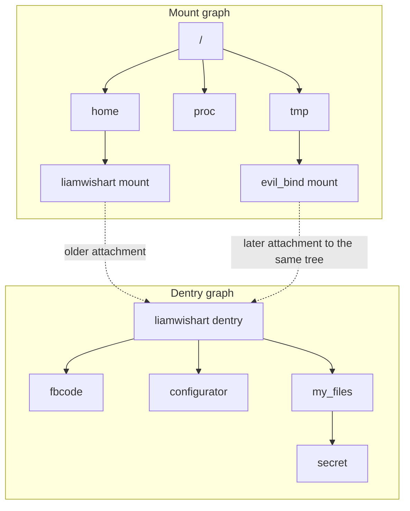

The resolver starts at `secret`, walks the dentry graph toward
`liamwishart`, and then selects the older mount attachment. This makes the
canonical path use `/home/liamwishart` instead of `/tmp/evil_bind` when both
mounts share that root dentry.

The slide does not show the distinct-root child-bind case. In that case, the
source mount root and bind mount root are different dentries. The
[child-bind source walk](#child-bind-source-walk)
diagram shows how the walker follows their dentry ancestry.

### Slide 20: mount traversal

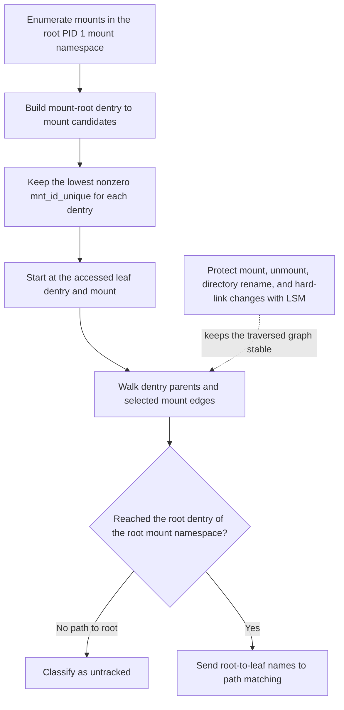

Slide 20 states that Meta enumerates the root PID 1 mount namespace. The
current Mithril implementation enumerates the task's live mount namespace.
The slide does not publish executable pseudocode for the choice at a
child-bind root. Slide 19 still requires the walk to select the source-side
mount graph. Selecting only among mounts with the same exact `mnt_root` does
not meet that requirement for the first bind of an ordinary child directory.

### Slide 21: path state machine

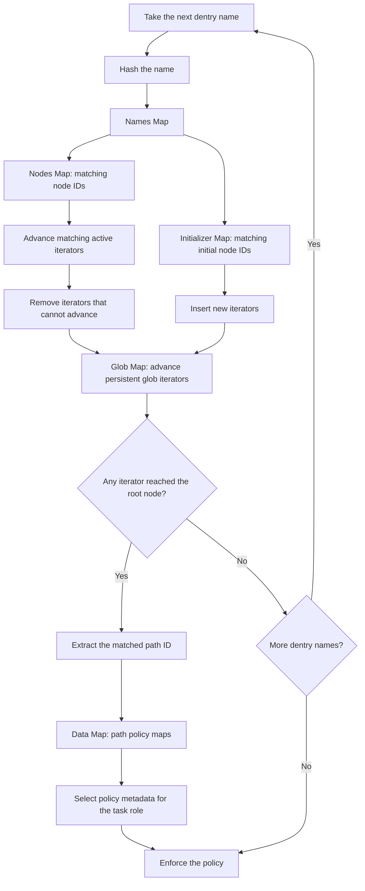

The state machine has this sequence:

1. Process each dentry name in path order.
2. Hash the name and use the Names Map to find associated node and initializer
   IDs.
3. Use the Nodes Map to advance active iterators that match a node ID. Remove
   iterators that cannot advance.
4. Use the Initializer Map to start iterators for patterns that can begin at
   this name.
5. Use the Glob Map to keep a glob iterator advancing for later names.
6. Treat an iterator that reaches the root node as a path match.
7. Extract the path ID. Use the Data Map to find the policy maps for that path.
8. Select the policy metadata for the task role and enforce the result.

### Current deterministic state-machine form

Mithril compiles Meta's active iterator set into one deterministic state in
Rust. The BPF program therefore does not store a runtime iterator array.

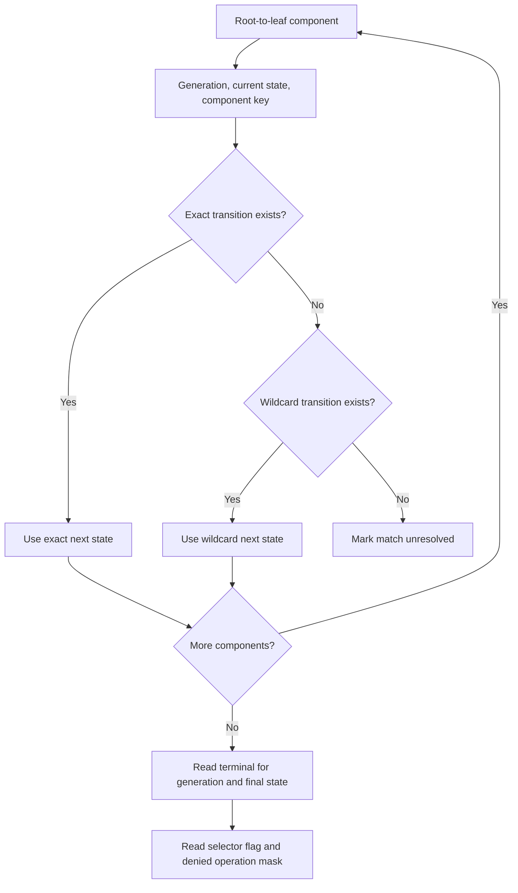

`path_graph_exact_transitions` represents literal component advances.
`path_graph_wildcard_transitions` represents determinized `*` and `**`
advances. `path_graph_terminals` maps a completed state to a selected path
selector, its `exact_object_required` flag, and a path-tree denied-operation
mask. This compilation can preserve the state-machine semantics only after the
mount walk supplies the correct canonical component sequence.

## Algorithm walkthrough

The algorithm has a static stage and a live stage. Rust runs the static stage
when the node installs a policy generation. BPF runs the live stage for each
covered effect. The live stage uses the task's current mount namespace. Rust
does not resolve a `PATH` selector in a filesystem or mount namespace. A
`PATH` selector can name a future Pod path that does not exist during policy
installation. An `EXACT` selector has a separate measured-object path. The
current node still receives that measured object outside the signed selector.

### Validation ownership

[`PolicyCompiler::compile`](../../../crates/mithril-control/src/policy/compiler.rs#L82)
calls the document's `Validate` implementation before it lowers any rule.
The compiler does not contain policy validation functions.

[`PolicyValue`](../../../crates/mithril-control/src/policy/validation/value.rs#L8)
owns the shared lexical checks for local IDs, registry symbols, UUIDs,
digests, and durations. Each policy record that owns intrinsic checks implements
[`Validate`](../../../crates/mithril-control/src/policy/validation.rs#L5)
for its intrinsic fields. For example,
[`PathSelectorV1::validate`](../../../crates/mithril-control/src/policy/validation/records.rs#L223)
owns selector kind, path text, and device-class compatibility.
[`PathTreeDenyFloorV1::validate`](../../../crates/mithril-control/src/policy/validation/records.rs#L191)
owns the path-tree schema, disposition, recursion, operation, and canonical
path syntax checks.

[`PolicyDocumentV1::validate`](../../../crates/mithril-control/src/policy/validation/document.rs#L13)
validates its children and then checks relationships that require the full
document. These checks include unique IDs, references, graph-wide conflicts,
and role reachability. There is no validation context object. A child receives
only direct parent information when one check requires it, such as the
evaluation stage for a fallback.

The canonical path check calls
[`canonical_path_components`](../../../crates/mithril-control/src/policy/path.rs#L322).
This function parses the signed string into Linux name bytes and checks its
shape and bounds. It does not call `open`, `stat`, `readlink`, `setns`, or any
mount API. Rust therefore does not inspect a current container path and does
not require a Pod or container to exist.

The module split follows ownership. The
[`validation` module root](../../../crates/mithril-control/src/policy/validation.rs#L1)
defines only the trait, error, and repeated-check macros. Child files own
scalar values, records, effect rules, authority rules, and document-wide
relationships. The
[`compiler` module root](../../../crates/mithril-control/src/policy/compiler.rs#L1)
owns artifact models and orchestration. Standard conversion implementations
in
[`conversion.rs`](../../../crates/mithril-control/src/policy/compiler/conversion.rs#L1)
replace the old operation, effect-family, object-cell, and physical-result
free functions. Rule expansion and conflict resolution are in
[`expansion.rs`](../../../crates/mithril-control/src/policy/compiler/expansion.rs#L1).
The compiler module has one loose helper: a stateless SHA-256 formatter.

### 1. Compile signed live paths, exact paths, and path-tree floors

[`PathSelectorTargetV1::pattern_components`](../../../crates/mithril-control/src/policy/path.rs#L205)
converts a signed `PATH` expression to literal, one-component wildcard, and
recursive wildcard components. It converts a signed `EXACT` expression to
literal components only. This conversion parses text. It does not resolve a
file or a directory.

[`PathTreeDenyFloorV1::validate`](../../../crates/mithril-control/src/policy/validation/records.rs#L191)
accepts only a recursive `FILE` denial. The rule cannot have an exception.
The validator also rejects an empty or unsupported operation set.
[`PolicyDocumentV1::validate`](../../../crates/mithril-control/src/policy/validation/document.rs#L13)
requires `PROTECT` mode when the document contains a path-tree denial.

[`canonical_path_components`](../../../crates/mithril-control/src/policy/path.rs#L322)
splits the absolute policy path into Linux name bytes. It rejects the root
path, empty components, `.` and `..`, embedded null bytes, more than 255
components, and a component longer than 255 bytes. This function parses policy
text. It does not read the filesystem.

[`CanonicalPathGraphV1::compile_with_path_tree_denies_and_precedence`](../../../crates/mithril-control/src/policy/path.rs#L368)
inserts every signed path selector and every path-tree floor into one
intermediate graph. The selector terminal keeps its rule ID and object class.
`PathPatternPrecedenceV1` resolves a reachable set of conflicting selector
terminals. The setting is part of the signed policy document.

[`insert_path_tree_deny`](../../../crates/mithril-control/src/policy/path.rs#L580)
adds one exact graph edge for each policy component. At the terminal state, it
adds the denied operation IDs and a wildcard self-loop. The self-loop makes
the rule recursive. A path that stays below that terminal remains in a state
that contains the denial.

[`CanonicalPathGraphV1::determinize`](../../../crates/mithril-control/src/policy/path.rs#L424)
converts the graph to one deterministic state per active state set. Each
deterministic state contains one selected path-selector terminal, if a
selector reaches that state, and the union of active denial operation IDs.
This conversion preserves recursive wildcards when another exact edge also
starts at the same state.

[`lower_path_tables`](../../../crates/mithril-node/src/policy.rs#L4060)
adds `profile_generation_ref_id` to every exact-transition, wildcard-transition,
and terminal key. Its terminal value contains a composite atom, a rule handle,
the `exact_object_required` flag, and a 64-bit denied-operation mask. For a
`PATH` selector, it emits an `effect_defaults` decision and no exact-object or
mount row. For an `EXACT` selector, it emits an exact-object decision and
requires a matching measured object. The function does not resolve a `PATH`
selector or require a Pod, target file, target directory, or mount namespace.

[`LoweredGeneration::install`](../../../crates/mithril-node/src/policy.rs#L2292)
writes the three graph tables, verifies the immutable rows, and then changes
the generation descriptor to active. The graph is complete before a task can
use the generation.

### 2. Select the task's generation and live path

The applicable LSM hooks reach the resolved gate through a file, path, or
dentry effect gate. A file gate derives `file->f_path`. A path gate supplies
the hook's `struct path`. A dentry gate combines the hook's directory mount
with its target dentry. The shared dispatcher then selects the normal resolved
gate or the io_uring resolved gate. The resolved gate finds the current task
and its cgroup binding. It reads `active_profile_generation_ref_id` from the
task's process state. It then checks that the active generation belongs to the
bound profile.

The resolved gate passes the live `struct path` and the active generation to
[`canonical_path_candidate`](../../../bpf/erebor-interceptor/programs/identity_path.bpf.h#L832).
The candidate function has two operations:

1. Reconstruct the path from the live mount namespace.
2. Traverse graph rows that contain the active generation in their keys.

A state ID cannot select another profile's graph. The generation is part of
every graph lookup key.

### 3. Build the oldest-mount index in BPF

[`global_mount_epoch_snapshot`](../../../bpf/erebor-interceptor/programs/identity_path.bpf.h#L145)
first records the global mount-mutation epoch. It rejects the walk when a mount
mutation is pending.

[`ensure_canonical_mount_cache`](../../../bpf/erebor-interceptor/programs/identity_path.bpf.h#L385)
reads the task's `mnt_namespace.root`, namespace event number, and mount count.
It also reads the namespace root's `mnt_id_unique` through
[`read_unique_mount_id`](../../../bpf/erebor-interceptor/programs/identity_path.bpf.h#L129).
The resolver rejects a missing unique ID, an empty namespace, or more than
4,096 mounts.

The cache-state key contains these values:

- mount-namespace address;
- namespace-root `mnt_id_unique`;
- namespace event number.

A ready state with the same mount count can reuse the corresponding index. A
cache miss makes BPF enumerate `mnt_namespace.mounts`.

[`mount_scan_push`](../../../bpf/erebor-interceptor/programs/identity_path.bpf.h#L284)
and
[`canonical_mount_cache_build_step`](../../../bpf/erebor-interceptor/programs/identity_path.bpf.h#L304)
perform a bounded red-black-tree scan. The callback verifies that each mount
belongs to the selected namespace. For each mount, it forms this index entry:

```text
(namespace address, namespace-root mnt_id_unique, namespace event, root dentry)
    -> (selected mount address, selected mnt_id_unique)
```

Several mounts can have the same root dentry. This condition occurs with bind
mounts and other aliases. The callback uses a BPF spin lock and keeps the
lowest nonzero `mnt_id_unique`. The lowest unique ID identifies the oldest
mount for that exact root dentry. A later mount with the same root cannot
replace that selected edge. The path walk connects different root dentries
through source `d_parent` edges.

After the scan, BPF requires all of these conditions:

- the loop visited the reported mount count;
- the explicit scan stack is empty;
- the namespace event number did not change;
- the reported mount count did not change;
- the global mutation epoch did not change;
- no mount mutation is pending.

A failed condition returns `-EACCES`. The effect gate classifies the failure
as an unsupported or unresolved object and denies the effect. The live
oldest-mount index is implemented for x86_64 and arm64. The compiled fallback at
[`ensure_canonical_mount_cache`](../../../bpf/erebor-interceptor/programs/identity_path.bpf.h#L458)
returns `-EACCES` on the other checked architectures.

### 4. Walk from the leaf to the namespace root

[`collect_mount_components`](../../../bpf/erebor-interceptor/programs/identity_path.bpf.h#L630)
starts with `path->dentry` and `path->mnt`. It converts the virtual filesystem
mount to its containing `struct mount`, finds that mount's live namespace, and
initializes the per-CPU walk state.

[`canonical_mount_path_walk_step`](../../../bpf/erebor-interceptor/programs/identity_path.bpf.h#L557)
probes the oldest-mount index for the current dentry. A miss below the active
mount root records the current name and follows `d_parent`. A miss at the
active mount root fails.

On a cache hit,
[`selected_mount_for_root`](../../../bpf/erebor-interceptor/programs/identity_path.bpf.h#L472)
rechecks the selected mount's namespace, root dentry, and live
`mnt_id_unique`. The walk stops if that mount is `mnt_namespace.root`. A
non-self dentry records its name and follows source `d_parent`. A self-parent
filesystem root crosses the selected mount's `mnt_parent` and
`mnt_mountpoint`. The next callback continues toward the namespace root.

The combined loop allows 4,351 callbacks. This bound covers 4,096 mount
crossings and 255 dentry components. The walk fails when it reaches a bad
pointer, an invalid self-parent edge, an invalid name, an oversized name, or
the callback bound without reaching the namespace root. It does not use a
truncated path.

After the walk, `collect_mount_components` requires the namespace root to be
reached. It also rechecks the namespace event and the global mount epoch. A
concurrent mount change therefore invalidates the complete result.

### Detailed BPF Meta walkthrough

This section follows the current C source in execution order. It explains the
cache builder, cache lookup, component helper, walk callback, and wrapper as
one bounded transaction. The first callback builds a live mount index. The
second callback walks one dentry or one mount boundary per iteration. The
wrapper supplies the input, controls both loops, and publishes output only
after the final topology checks pass.

#### BPF call graph and result ownership

This graph starts at the BPF LSM program. It covers the file, path, and
dentry hooks that can reach the path resolver. It does not describe LSM
programs that have no file or path candidate.

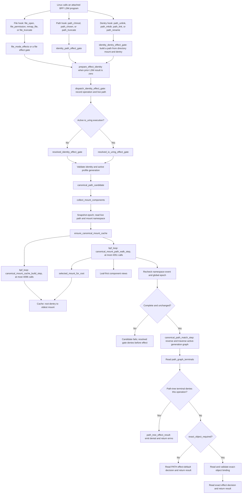

The file LSM programs enter through
[`file_open`](../../../bpf/erebor-interceptor/programs/identity_effects.bpf.h#L861),
[`file_permission`](../../../bpf/erebor-interceptor/programs/identity_effects.bpf.h#L875),
and the other file sections. The direct path hooks enter
[`identity_path_effect_gate`](../../../bpf/erebor-interceptor/programs/identity_effects.bpf.h#L701).
The dentry hooks enter
[`identity_dentry_effect_gate`](../../../bpf/erebor-interceptor/programs/identity_effects.bpf.h#L764),
which combines the directory mount with the target dentry. All three routes
call
[`dispatch_identity_effect_gate`](../../../bpf/erebor-interceptor/programs/identity_effects.bpf.h#L599).

The dispatcher selects either
[`resolved_identity_effect_gate`](../../../bpf/erebor-interceptor/programs/identity_effects.bpf.h#L300)
or, for an active io_uring execution,
[`resolved_io_uring_effect_gate`](../../../bpf/erebor-interceptor/programs/identity_io_uring.bpf.h#L267).
After their resolver preconditions pass for a covered file effect, both routes
invoke
[`canonical_path_candidate`](../../../bpf/erebor-interceptor/programs/identity_path.bpf.h#L832).
They apply a matched path-tree denial before a positive decision. A terminal
with `exact_object_required == 0` reads the path-scoped default decision. A
terminal with `exact_object_required == 1` calls
`configured_file_object_binding` and reads the exact-object decision. A prior
LSM denial is preserved and emitted before either resolver reaches the path
candidate.

The callback return value controls `bpf_loop`:

- `0` tells `bpf_loop` to call the callback again.
- `1` tells `bpf_loop` to stop. A callback uses this result for success and
  failure. The callback state tells the wrapper which result occurred.
- A negative `bpf_loop` result is a helper failure. The wrapper rejects it.

Neither callback returns an authorization result. The wrapper returns only a
complete component vector or `-EACCES`. `canonical_path_candidate` then uses
the vector to read the generation-scoped policy graph.

#### Shared state and verifier shape

The callbacks do not allocate a large C stack frame. They receive a pointer to
one value in the per-CPU
[`identity_scratch`](../../../bpf/erebor-interceptor/programs/identity_maps.h#L226)
map. One CPU owns that scratch value for the current hook execution.

BPF Compile Once - Run Everywhere (CO-RE) relocations resolve kernel structure
fields for the qualified kernel. A failed CO-RE field read stops the current
cache build or path walk.

| State | Source | Purpose |
| --- | --- | --- |
| `mount_cache_build` | [`canonical_mount_cache_build_state_v1`](../../../bpf/erebor-interceptor/programs/identity_maps.h#L95) | Holds the namespace identity, expected mount count, current candidate, explicit tree-stack depth, and failure flag. |
| `mount_scan_stack` | [`identity_scratch_v1`](../../../bpf/erebor-interceptor/programs/identity_maps.h#L201) | Holds red-black-tree node addresses for a bounded depth-first scan. The semantic stack limit is 255 entries. |
| `mount_cache_key` and `mount_cache_value` | [`identity_scratch_v1`](../../../bpf/erebor-interceptor/programs/identity_maps.h#L194) | Provide zeroed temporary key and value storage for cache updates. |
| `mount_path_walk` | [`canonical_mount_path_walk_state_v1`](../../../bpf/erebor-interceptor/programs/identity_maps.h#L111) | Holds the current mount, current dentry, namespace identity, counters, selected mount, and terminal state. |
| `path_component_views` | [`canonical_path_view_v1`](../../../bpf/erebor-interceptor/programs/identity_maps.h#L132) | Holds a kernel name address and length for each leaf-first component. It does not copy the name bytes. |
| `file_object.mount_id_unique` | [`identity_scratch_v1`](../../../bpf/erebor-interceptor/programs/identity_maps.h#L184) | Receives the first canonical selected mount ID after the complete walk passes. |

The `+ 1` array slots and the inline assembly masks are verifier controls. The
code still rejects a semantic count of 255 before it pushes or records another
entry. The mask constrains the computed array index to `0..255` for the BPF
verifier. It does not convert an oversized input into a valid truncated input.

#### Mount-tree input and cache result

Linux stores the mounts in one mount namespace in a red-black tree. Two mount
objects can point to the same root dentry. A bind mount is one way to produce
this condition. The cache groups those mounts by root dentry and retains the
lowest nonzero `mnt_id_unique`.

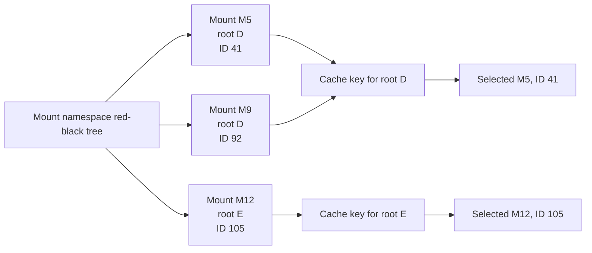

The key also contains the mount-namespace address, namespace-root unique mount
ID, and namespace event. A row for an older namespace event cannot match a
later event. The cache does not use a pathname, inode number, or caller mount
as the group identity.

#### `canonical_mount_cache_build_step`, source order

[`canonical_mount_cache_build_step`](../../../bpf/erebor-interceptor/programs/identity_path.bpf.h#L304)
is one `bpf_loop` callback. One call processes at most one mount-tree node.

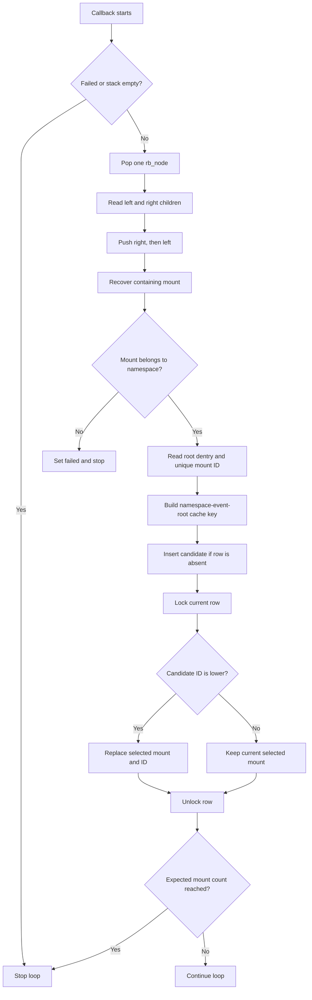

| Source | Step | Exact behavior |
| --- | ---: | --- |
| [`304-305`](../../../bpf/erebor-interceptor/programs/identity_path.bpf.h#L304) | 1 | Defines the callback application binary interface (ABI). `offset` is the zero-based loop iteration. `data` is the opaque callback context. |
| [`306-317`](../../../bpf/erebor-interceptor/programs/identity_path.bpf.h#L306) | 2 | Converts `data` to `canonical_mount_cache_build_context_v1`. It then creates local aliases for per-CPU scratch, build state, temporary key, temporary value, cached row, tree node, mount candidate, and verifier-bounded index. The aliases do not copy the large state. |
| [`319-320`](../../../bpf/erebor-interceptor/programs/identity_path.bpf.h#L319) | 3 | Stops if an earlier iteration set `build->failed` or if the explicit tree stack is empty. `ensure_canonical_mount_cache` later distinguishes an early empty stack from a complete scan by checking the returned step count. |
| [`321-323`](../../../bpf/erebor-interceptor/programs/identity_path.bpf.h#L321) | 4 | Clears the temporary key and value. This operation zeroes padding, reserved fields, and the draft spin-lock bytes. It then decrements `stack_depth` to pop one node. |
| [`324-329`](../../../bpf/erebor-interceptor/programs/identity_path.bpf.h#L324) | 5 | Copies the raw stack index to a register and applies the constant mask `255`. The callback reads the node address from the verifier-bounded scratch slot. |
| [`330-339`](../../../bpf/erebor-interceptor/programs/identity_path.bpf.h#L330) | 6 | Clears temporary child addresses. CO-RE reads `rb_left` and `rb_right`. The callback pushes the right child first and the left child second. The last-in, first-out stack therefore visits the left child next. A missing current node, failed field read, or stack overflow enters the failure label. |
| [`340-344`](../../../bpf/erebor-interceptor/programs/identity_path.bpf.h#L340) | 7 | Uses the CO-RE container offset to recover the enclosing `struct mount` from its `mnt_node`. It records the candidate address and clears all candidate fields before kernel reads. |
| [`345-354`](../../../bpf/erebor-interceptor/programs/identity_path.bpf.h#L345) | 8 | Reads the candidate's `mnt_ns` and requires the exact namespace address selected by the wrapper. It reads `mnt.mnt_root` and requires a non-null dentry. `read_unique_mount_id` requires the qualified `mnt_id_unique` field and a nonzero value. Any mismatch or read failure stops the build as failed. |
| [`356-363`](../../../bpf/erebor-interceptor/programs/identity_path.bpf.h#L356) | 9 | Builds the cache key from namespace address, namespace-root unique ID, namespace event, and candidate root-dentry address. It builds the draft value from the candidate mount address and unique ID. |
| [`364-367`](../../../bpf/erebor-interceptor/programs/identity_path.bpf.h#L364) | 10 | Attempts `bpf_map_update_elem` with `BPF_NOEXIST` and deliberately ignores its result. The first candidate can create the row. An existing row can result from a repeated root or a concurrent builder. |
| [`368-370`](../../../bpf/erebor-interceptor/programs/identity_path.bpf.h#L368) | 11 | Looks up the row once after the update attempt. The row can be the newly inserted row or an existing row. A missing row marks the build as failed, so a full map or another unusable update failure remains fail closed. |
| [`371-379`](../../../bpf/erebor-interceptor/programs/identity_path.bpf.h#L371) | 12 | Locks the cache value. An empty selected ID or a lower candidate ID replaces the selected mount address and ID. The callback unlocks the row after both fields agree. This minimum operation implements the oldest-mount selection. |
| [`380`](../../../bpf/erebor-interceptor/programs/identity_path.bpf.h#L380) | 13 | Stops after the reported number of mounts. Otherwise, it requests another callback. The wrapper also requires an empty scan stack, so an understated mount count cannot produce a successful partial index. |
| [`382-384`](../../../bpf/erebor-interceptor/programs/identity_path.bpf.h#L382) | 14 | Sets the persistent failure flag and stops the loop. The callback does not return a partial-success code. |

The scan order does not define authority. The spin-locked minimum defines the
selected mount. A right-first or left-first traversal produces the same
selected row after a complete scan.

`ensure_canonical_mount_cache` owns completion. It requires the `bpf_loop`
step count to equal `mnt_namespace.nr_mounts`. It also requires a clear failure
flag, an empty explicit stack, the same namespace event, the same mount count,
the same global mount epoch, and zero pending global mutations. Only then does
it publish `CANONICAL_MOUNT_CACHE_READY_V1` for that namespace-event key.

#### `selected_mount_for_root`, the boundary recheck

The walk does not trust a cached kernel pointer by itself.
[`selected_mount_for_root`](../../../bpf/erebor-interceptor/programs/identity_path.bpf.h)
performs these checks at each visited dentry:

1. Build the same namespace, root-ID, event, and root-dentry key.
2. Return `CANONICAL_MOUNT_CACHE_MISS_V1` when no mount uses this dentry as a
   root.
3. Lock the row and copy the selected mount address and unique ID together.
4. Require both copied values to be nonzero.
5. Read the selected mount's live namespace and require the current namespace.
6. Read the selected mount's live root and require the current root dentry.
7. Read its live `mnt_id_unique` and require the cached unique ID.

A stale pointer, reused address, wrong namespace, changed root, or changed
mount ID returns `-EACCES`. A cache miss is a separate result. The caller can
follow `d_parent` on a miss below the active mount root.

#### `record_canonical_dentry_component`, bounded parent progress

[`record_canonical_dentry_component`](../../../bpf/erebor-interceptor/programs/identity_path.bpf.h)
owns one component step. It rejects a full component vector, a null parent, a
self parent, an empty name, a name longer than 255 bytes, and a null name
address. It stores one name view in per-CPU scratch. It then advances the
current dentry to `d_parent`.

The helper uses an inline verifier mask for the array index. The semantic
component-count check occurs before that mask. The graph callback copies the
name bytes only after the complete mount walk passes its topology checks.

#### `canonical_mount_path_walk_step`, source order

[`canonical_mount_path_walk_step`](../../../bpf/erebor-interceptor/programs/identity_path.bpf.h)
performs one bounded dentry or mount step.

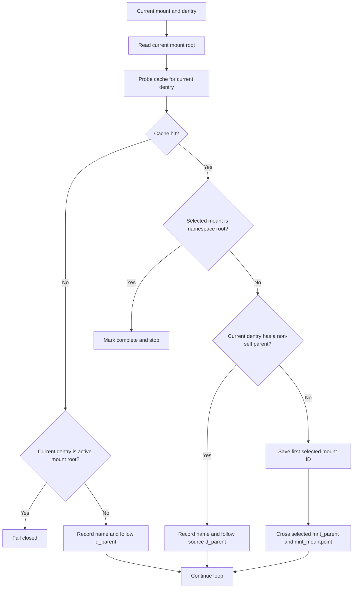

| Result | Condition | Next action |
| --- | --- | --- |
| Cache miss | The current dentry is below the active mount root. | Record the name and follow `d_parent`. |
| Invalid miss | The current dentry is the active mount root. | Set `walk->failed` and stop. |
| Namespace root | The cache selects `mnt_namespace.root`. | Save the selected unique ID, mark completion, and stop. |
| Source parent | The cached dentry has a non-self `d_parent`. | Record the name and follow source ancestry. |
| Filesystem root | The cached dentry has a self parent. | Save the first selected unique ID and cross the selected mount attachment. |
| Invalid state | A kernel read, component check, parent check, or mount-edge check fails. | Set `walk->failed` and stop. |

The component vector is leaf-first because the walk starts at the supplied
leaf. The callback does not add a slash or a synthetic root component. It
does not use the bind target as source ancestry. At a filesystem root, it uses
the cache-selected oldest mount for that root.

#### `collect_mount_components`, source order

[`collect_mount_components`](../../../bpf/erebor-interceptor/programs/identity_path.bpf.h#L630)
is the transaction owner for mount-path collection. Internal callers supply a
valid per-CPU scratch pointer and result-count pointer.

```mermaid
sequenceDiagram
    participant C as collect_mount_components
    participant G as Global mount state
    participant N as Live mount namespace
    participant K as Canonical mount cache
    participant W as Walk callback

    C->>G: Read epoch E; require pending = 0
    C->>N: Read path dentry, vfsmount, namespace, and root
    C->>K: Build or reuse index for namespace event V
    C->>W: Walk at most 4096 + 255 steps
    W-->>C: Leaf-first component views and first selected mount ID
    C->>N: Re-read namespace event; require V
    C->>G: Re-read epoch; require E and pending = 0
    alt Any check fails
        C-->>C: Return -EACCES
    else All checks pass
        C-->>C: Publish mount ID, epoch, and component count
    end
```

| Source | Step | Exact behavior |
| --- | ---: | --- |
| [`630-646`](../../../bpf/erebor-interceptor/programs/identity_path.bpf.h#L630) | 1 | Declares live kernel pointers, topology snapshots, the walk-state alias, the callback context, and the `bpf_loop` result. Large arrays remain in per-CPU scratch. |
| [`648-652`](../../../bpf/erebor-interceptor/programs/identity_path.bpf.h#L648) | 2 | Calls `global_mount_epoch_snapshot` first. That helper requires the epoch and pending maps, a nonzero epoch, and zero pending mutations. The wrapper then requires a path and reads non-null live `dentry` and `vfsmount` pointers. Any failure returns `-EACCES`. |
| [`653`](../../../bpf/erebor-interceptor/programs/identity_path.bpf.h#L653) | 3 | Uses `mount_from_vfsmount` to recover the enclosing `struct mount` from the embedded `struct vfsmount`. The helper uses a CO-RE container offset. |
| [`654-663`](../../../bpf/erebor-interceptor/programs/identity_path.bpf.h#L654) | 4 | Requires the current mount. It reads and requires the mount's live namespace and that namespace's root mount. It then calls `ensure_canonical_mount_cache` with the same global epoch. The cache helper returns the namespace event and namespace-root unique mount ID only after a complete or previously ready index is valid. |
| [`665-673`](../../../bpf/erebor-interceptor/programs/identity_path.bpf.h#L665) | 5 | Clears the complete walk state. It seeds the namespace address, namespace-root mount address, supplied current mount, supplied current dentry, namespace event, and namespace-root unique mount ID. No state from an earlier per-CPU use remains authoritative. |
| [`674-677`](../../../bpf/erebor-interceptor/programs/identity_path.bpf.h#L674) | 6 | Runs at most 4,351 callbacks. This is 4,096 possible mount-boundary steps plus 255 possible dentry-component steps. The two limits form one fixed verifier-visible constant. |
| [`678-684`](../../../bpf/erebor-interceptor/programs/identity_path.bpf.h#L678) | 7 | Rejects a negative loop-helper result, any callback failure, a walk that did not reach the namespace root, or a walk with no selected mount ID. It re-reads the namespace event and requires the original value. It then requires the same global epoch and zero pending mutations. A bound exhaustion leaves `reached_namespace_root` clear and fails here. |
| [`685-688`](../../../bpf/erebor-interceptor/programs/identity_path.bpf.h#L685) | 8 | Publishes outputs only after all checks pass. It writes the first canonical selected mount ID to the exact-file candidate, stores the validated global epoch as the topology generation, and returns the leaf-first component count. |
| [`689`](../../../bpf/erebor-interceptor/programs/identity_path.bpf.h#L689) | 9 | Returns success. The caller can now reverse the component views and traverse the active generation's graph. |

The wrapper never returns a shortened component list as success. Scratch can
contain partial data after a failure, but the caller receives `-EACCES` and
must not use that data.

#### Worked bind-alias trace

Assume two mounts share the self-parent filesystem-root dentry `D`:

- `M5` attaches `D` at `/var/run/secrets/service` and has unique ID `41`.
- `M9` attaches the same `D` at `/work/input/job-42` and has unique ID `92`.
- The task reaches `config.json` below `D` through `M9`.

The cache build visits both mounts. The spin-locked minimum stores `M5` for
`D`. The path walk therefore crosses through `M5`, not through `M9`.

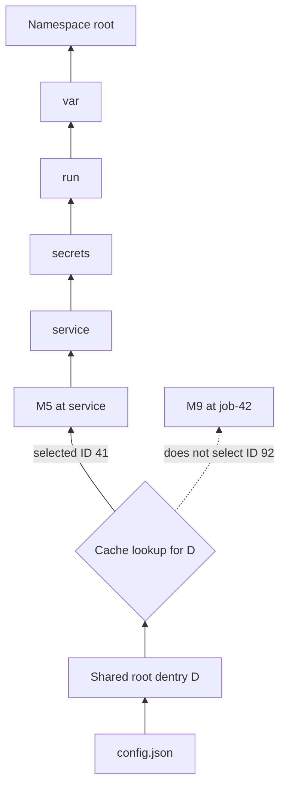

The walk records this leaf-first vector:

```text
config.json, service, secrets, run, var
```

The graph matcher reads the vector in reverse:

```text
var, run, secrets, service, config.json
```

An allow selector under `/work/input` cannot match this canonical chain. A
signed recursive denial under `/var/run/secrets/service` can match before the
exact-object lookup.

This trace covers two mounts that share a self-parent root dentry. The
[child-bind source walk](#child-bind-source-walk)
covers a bind root whose dentry has a source parent.

#### Failure points and physical result

| Failure | Detection owner | Result |
| --- | --- | --- |
| Global epoch map is absent, epoch is zero, or a mount mutation is pending. | `global_mount_epoch_snapshot` | `collect_mount_components` returns `-EACCES` before it reads the path. |
| Namespace root, mount tree, namespace event, mount count, or unique mount ID is absent or invalid. | `ensure_canonical_mount_cache` | Cache construction fails. No ready state is published. |
| Namespace has zero mounts or more than 4,096 mounts. | `ensure_canonical_mount_cache` | The candidate is unresolved. The input is not truncated. |
| Tree stack reaches its semantic limit, a CO-RE field read fails, a candidate belongs to another namespace, or the cache map cannot hold a required row. | `canonical_mount_cache_build_step` | The callback sets `build->failed`; the wrapper returns `-EACCES`. |
| Cache row points to a mount with a different live namespace, root, or unique ID. | `selected_mount_for_root` | The boundary lookup returns `-EACCES`; the walk marks failure. |
| The active mount root has no cache row, or a source walk reaches a self-parent dentry with no represented mount. | `canonical_mount_path_walk_step` | The walk cannot select a valid mount edge and marks failure. |
| Component count reaches 255, name length is zero or greater than 255, name address is null, or parent progress is invalid. | `canonical_mount_path_walk_step` | The walk stops with `walk->failed`. |
| Mount chain does not reach the task's namespace root within 4,351 callbacks. | `collect_mount_components` final checks | The missing `reached_namespace_root` flag returns `-EACCES`. |
| Namespace event, global epoch, or pending count changes during the transaction. | Cache completion and collection completion | The complete candidate is rejected. A prior cache or partial vector cannot authorize. |
| Target architecture does not compile the live mount-tree scan. | Fallback `ensure_canonical_mount_cache` | The fallback returns `-EACCES`. |

The global epoch and namespace event protect mount topology. The component
array stores live dentry-name views. The graph matcher copies each name after
collection. These three functions do not create a whole-path string cache and
do not turn a path into positive file authority.

### 5. Traverse only the active generation's graph

The component vector is in leaf-first order. For example, the live path
`/srv/secret/team/a` produces `a`, `team`, `secret`, `srv` during the kernel
walk.

[`canonical_path_match_step`](../../../bpf/erebor-interceptor/programs/identity_path.bpf.h#L763)
reads the vector in reverse order. It therefore submits `srv`, `secret`,
`team`, and `a` to the graph. For each component, the callback:

1. reads the live name bytes with `bpf_probe_read_kernel`;
2. builds an exact-transition key from the active generation, current state,
   and component;
3. reads `path_graph_exact_transitions`;
4. reads `path_graph_wildcard_transitions` for the same generation and state
   when the exact row is absent;
5. changes the current state to `next_state_id`.

A missing transition or failed helper call marks the match unresolved. After
all components, `canonical_path_candidate` reads `path_graph_terminals` with
the active generation and final state. It copies the terminal and its denied
operation mask, composite atom, rule handle, and `exact_object_required` flag
to per-CPU scratch.

For a recursive `/srv/secret` floor, the graph enters the denial state after
`secret`. The wildcard-derived deterministic states keep the denial mask while
the matcher consumes `team` and `a`. The policy therefore covers the root and
all descendants.

### 6. Return the physical decision

Back in
[`resolved_identity_effect_gate`](../../../bpf/erebor-interceptor/programs/identity_effects.bpf.h#L300),
[`path_tree_denies`](../../../bpf/erebor-interceptor/programs/identity_effects.bpf.h#L110)
tests the current operation bit in the terminal mask. A set bit in a protect
generation calls
[`path_tree_effect_result`](../../../bpf/erebor-interceptor/programs/identity_effects.bpf.h#L119).
That function emits `PATH_TREE_POLICY_DENY` and returns the configured negative
error before the kernel effect.

The gate evaluates this denial before every positive path result. If the mask
does not deny the operation and `exact_object_required` is zero, the gate
calls `effect_base_decision` with the terminal composite atom. Node lowering
placed the signed `PATH` rule in `effect_defaults`, so this decision needs no
exact-object lookup. If `exact_object_required` is one, the existing
exact-object branch validates the measured binding first. If path
reconstruction or graph traversal fails, the gate returns a hard denial. It
does not convert an unresolved path to an allow.

## Validation against Meta's algorithm

The implementation uses the same bounded mount index and path-matching model.
It does not copy Meta source code because the presentation does not publish
that source. The source walk follows source dentry ancestry. The current
records do not provide one reconciled physical result for every bind form.

| Meta property | Implementation | Review source |
| --- | --- | --- |
| Preserve an authenticated known source path. | Node installs entry-time graph-prefix states for the binding and source root. BPF uses them before it compares mount age. | [`LoweredGeneration::for_binding_with_mount_routes`](../../../crates/mithril-node/src/policy.rs), [`known_mount_path_candidate`](../../../bpf/erebor-interceptor/programs/identity_path.bpf.h) |
| Walk from the target leaf toward the head. | BPF probes the mount-root cache, records `d_name`, and follows `d_parent` at each dentry. | [`canonical_mount_path_walk_step`](../../../bpf/erebor-interceptor/programs/identity_path.bpf.h) |
| Resolve repeated mount roots through the oldest mount. | BPF scans `mnt_namespace.mounts` and retains the lowest nonzero `mnt_id_unique` for each root dentry. | [`canonical_mount_cache_build_step`](../../../bpf/erebor-interceptor/programs/identity_path.bpf.h#L304) |
| Continue across mount boundaries. | A non-self root follows source `d_parent`. A self-parent filesystem root crosses the selected mount's `mnt_parent` and `mnt_mountpoint`. | [`canonical_mount_path_walk_step`](../../../bpf/erebor-interceptor/programs/identity_path.bpf.h) |
| Stop at the task's namespace root. | The walk succeeds only after the selected mount equals `mnt_namespace.root`. | [`collect_mount_components`](../../../bpf/erebor-interceptor/programs/identity_path.bpf.h#L630) |
| Hash a name and find node or initializer IDs. | Rust compiles name choices into exact and wildcard transition keys. BPF map lookup hashes each full key. | [`PathGraphTransitionKeyV1`](../../../crates/erebor-interceptor-abi/src/abi/path.rs), [`canonical_path_match_step`](../../../bpf/erebor-interceptor/programs/identity_path.bpf.h#L763) |
| Advance and remove iterators. | Rust determinizes the active iterator set. BPF advances one deterministic state. A missing literal and wildcard transition makes the match unresolved. | [`CanonicalPathGraphV1::determinize`](../../../crates/mithril-control/src/policy/path.rs#L424) |
| Start initializer iterators. | The initial deterministic state contains every pattern that can start at the first component. | [`CanonicalPathGraphV1::determinize`](../../../crates/mithril-control/src/policy/path.rs#L424) |
| Keep glob iterators active. | A wildcard transition represents the next deterministic set after all applicable glob and exact advances. | [`path_graph_wildcard_transitions`](../../../bpf/erebor-interceptor/programs/identity_maps.h) |
| Extract a path ID and role policy at a root node. | A terminal stores the selected path rule, composite atom, exact-object requirement, and path-tree denied-operation mask. The task's active generation and role remain in the surrounding effect decision. | [`PathGraphTerminalV1`](../../../crates/erebor-interceptor-abi/src/abi/path.rs), [`resolved_identity_effect_gate`](../../../bpf/erebor-interceptor/programs/identity_effects.bpf.h#L300) |
| Reverse leaf-first components before graph lookup. | The graph callback reads `component_count - offset - 1`. | [`canonical_path_match_step`](../../../bpf/erebor-interceptor/programs/identity_path.bpf.h#L763) |
| Reject a topology race. | BPF checks the global mutation epoch, pending count, namespace event, and mount count before and after cache construction and path collection. | [`ensure_canonical_mount_cache`](../../../bpf/erebor-interceptor/programs/identity_path.bpf.h#L385), [`collect_mount_components`](../../../bpf/erebor-interceptor/programs/identity_path.bpf.h#L630) |

Node installs `canonical_mount_roots` only from the authenticated entry-time
view. BPF reads those rows before its oldest-mount fallback. BPF then owns the
live topology scan and stability checks. The path-tree branch does not wait
for a clean Rust mount snapshot or a ring-buffer consumer.

## Kubernetes and profile binding

The implemented data boundary supports this order:

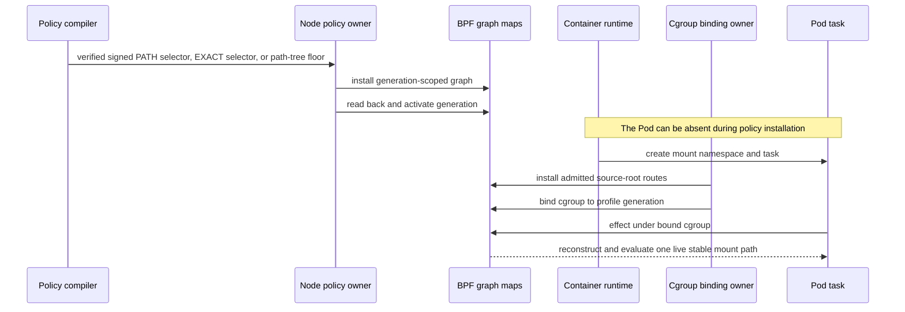

Different cgroups can select different profile generations. BPF places the
active generation in every graph key. It cannot traverse another profile's
rows by state ID alone. The
[`path_graph_rows_are_scoped_to_the_bound_generation`](../../../crates/mithril-node/src/policy.rs)
test checks that equal policy paths in two generations produce disjoint keys.

The repository has signed artifact, Container Runtime Interface (CRI)
inventory, cgroup binding, and policy installation owners. This implementation
does not add a Kubernetes custom resource definition, admission webhook, or
controller. Those components must translate a selected Pod policy to the
existing signed generation and cgroup binding boundary.

## Owners

| Owner | Input and state | Output and authority |
| --- | --- | --- |
| `PolicyDocumentV1` and child `Validate` implementations | Signed policy records. | Check intrinsic child fields, then document-wide IDs, references, conflicts, and reachability. They inspect no filesystem or mount namespace. |
| `PolicyCompiler` | One signed `PolicyDocumentV1`. | Calls document validation, then produces a verified artifact. Its root orchestrates compilation, conversion implementations map signed values, and expansion owns exact cells. It creates no kernel state. |
| `CanonicalPathGraphV1` | Canonical selector components and path-tree operation IDs. | Produces deterministic static transitions, selector terminals, and denial masks. It does not inspect live mounts. |
| `NodePolicyGenerationOwner` | Verified artifact, profile generation, current exact-object bindings, and the held entry-time container view. | Installs, reads back, activates, and retires generation-scoped policy rows. It resolves and installs binding-scoped source-root routes at admission. It does not rebuild post-start topology. |
| Workload binding owner | Exact cgroup, selected profile generation, and admitted source-root routes. | Installs the generation and route scope that new tasks inherit through the existing identity path. |
| `KernelHostOwner` | One production BPF object, maps, links, pin root, and exclusive lease. | Loads, attaches, pins, recovers, and shuts down the single Interceptor owner. |
| BPF path resolver | Per-CPU scratch, admitted route rows, and the task's live kernel path and mount namespace. | Uses a route first, builds the oldest-mount fallback cache, checks topology stability, traverses the selected graph, and returns the physical decision. |
| `EffectObservationStore` | Fixed BPF observation records. | Copies and names evidence. It does not authorize an effect. |
| `EffectTestRunner` | Disposable files, directories, namespaces, cgroups, and policy artifacts. | Checks syscall results, filesystem postconditions, evidence, and cleanup in the repository VM. |

## Runtime decision flow

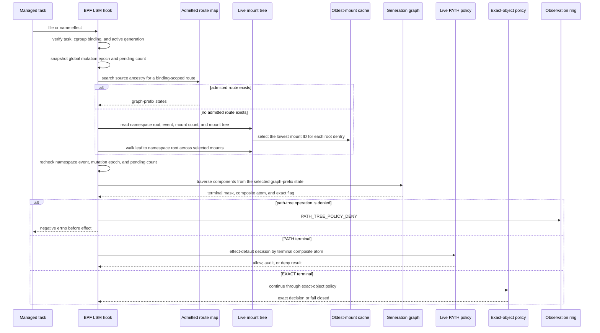

A mutation that races cache construction or path collection changes the
global epoch, pending count, namespace event, or mount count. The resolver
returns unresolved. It never uses a partial component vector or a partial
mount cache as authority.

The cache key contains the mount-namespace address, namespace-root unique
mount ID, namespace event, and root-dentry address. A mount event therefore
selects a new cache generation. The selected cache value is revalidated
against the live namespace, root dentry, and unique mount ID before use.

## Child-bind source walk

The path-tree decision uses the live mount tree on every effect. A bind of a
child directory creates different roots for the source mount and the bind
mount. The walker uses dentry ancestry to connect these roots. This is a
source walkthrough. The current paired route case also proves this behavior
for the later in-container child bind.

The walker probes the root-dentry cache at each node. A cache hit validates the
selected mount. A non-self `d_parent` identifies source ancestry. The walker
records that dentry name and follows the parent. A self-parent dentry is a
filesystem root. The walker then crosses the selected mount attachment.

```mermaid
flowchart TD
    A[Source mount M2 at /mnt/data<br/>root D_data]
    B[Source child D_models]
    C[Bind mount M3 at /backup/models<br/>root D_models]
    D[Open /backup/models/x]
    E[Walk reaches D_models]
    F[Cache selects M3 for D_models]
    G[D_models has a source parent]
    H[Record models and follow source d_parent]
    I[Reach the source filesystem root]
    J[Select its oldest represented mount]
    K[Cross that mount attachment]
    L[Construct /mnt/data/models/x]
    M[/mnt/data/** terminal denies]

    A --> B --> C --> D --> E --> F
    F --> G --> H --> I --> J --> K --> L --> M
```

The walker checks the selected namespace root before it follows a source
parent. A cache miss at the active mount root fails. A self-parent dentry with
no represented mount also fails. Component overflow, invalid names, cache
revalidation errors, and topology races fail closed.

Mount mutation hooks update the global epoch and pending count. Represented
namespace lookups validate the admitted registry. They do not publish a dirty
view. The exact file and executable hot path uses the same synchronous
snapshot recheck. The retained clean/dirty and exact-mount-event helpers have
no caller in the current effect path. They remain in the pinned ABI surface.

`open_tree`, `fsconfig`, `fsmount`, and `mount_setattr` also update the global
mutation guard. Mutation invalidation and race checks prove that one topology
snapshot is stable. They do not prove that its selected mount edges preserve
source lineage. The admitted route supplies that lineage for a known source.

## BPF programs

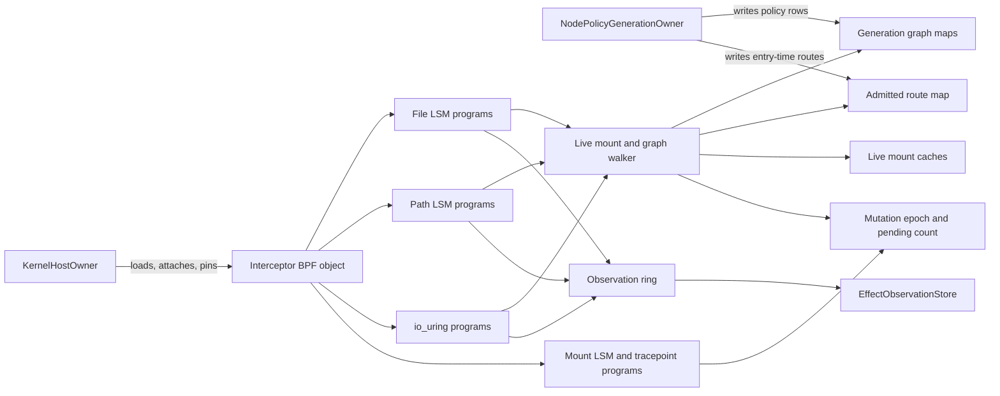

The file programs use the `lsm/file_open` and `lsm/file_permission` sections
at
[`identity_effects.bpf.h`](../../../bpf/erebor-interceptor/programs/identity_effects.bpf.h#L861).
They receive a live `struct file`, preserve a prior LSM denial, derive the
operation, and call the shared effect gate. A failed identity, path, mount, or
graph lookup returns the configured negative errno. A path-tree match returns
that errno before the file effect completes. A matched `PATH` terminal reads a
path-scoped default decision. A matched `EXACT` terminal continues to
exact-object validation.

The name programs use `lsm/path_unlink` through `lsm/path_rename` at
[`identity_effects.bpf.h`](../../../bpf/erebor-interceptor/programs/identity_effects.bpf.h#L1015).
They receive a directory path and dentry. The path can name a file, a
directory, or a negative dentry. Link and rename check the source before the
destination. A nonzero return stops the kernel operation.

The mount programs use `lsm/sb_mount`, `lsm/sb_umount`,
`lsm/sb_pivotroot`, and `lsm/move_mount` at
[`identity_effects.bpf.h`](../../../bpf/erebor-interceptor/programs/identity_effects.bpf.h#L1174).
The `raw_syscalls/sys_exit` program clears the pending mutation count. The
special mount syscall tracepoints update the represented ambiguity epoch.
These programs update the synchronous stability guard. The current source has
no `sb_kern_mount` program because that hook creates an unattached kernel
mount. These programs do not compile a graph, change a path-tree terminal, or
wait for Node.

The path resolver uses `bpf_get_current_task_btf` to find the current task,
`BPF_CORE_READ_INTO` for kernel fields, `bpf_loop` for bounded mount and path
walks, `bpf_map_lookup_elem` for cache and graph reads, and
`bpf_probe_read_kernel` for component bytes. A failed helper result makes the
candidate unresolved. The resolver does not truncate and continue.

The io_uring effect gate uses the retained submitter generation and the same
live path resolver. Missing request or actor state fails closed. The io_uring
lifecycle and its broader limits remain separate from this path-tree slice.

### Verifier shape

All logic remains in the one production Interceptor BPF object. The
implementation adds no tail-call subsystem, second loader, second policy
engine, or userspace namespace helper.

One per-CPU `identity_scratch_v1` value owns cache-build, path-walk, component,
and graph-match state. `bpf_loop` callbacks receive only a pointer to this
state. The qualified object has these maximum stack offsets:

| Function | Stack bytes |
| --- | ---: |
| `resolved_identity_effect_gate` | 264 |
| `canonical_mount_cache_build_step` | 16 |
| `canonical_mount_path_walk_step` | 8 |
| `canonical_path_match_step` | 0 |

The deepest measured function leaves 248 bytes below the Linux 512-byte BPF
stack limit. The production object also loaded in the qualified VM.

The mount enumeration loop accepts at most 4,096 mounts. The red-black-tree
scan stack accepts 255 entries. A 4,096-node Linux red-black tree has a maximum
height below 25, so the scan stack does not reduce the mount-count limit. The
path vector accepts 255 components of at most 255 bytes each. The combined
live path walk accepts 4,351 callbacks. This count covers 4,096 mount steps and
255 dentry steps. A larger or malformed input fails closed. The resolver does
not truncate the input to a valid path.

The scan stack and component vector each use one extra array slot for the
verifier-safe `& 0xff` index. The semantic limit remains 255.
`MAX_CANONICAL_MOUNT_SCAN_DEPTH_V1` names the scan-stack limit separately from
`MAX_CANONICAL_PATH_COMPONENTS_V1`. Both values are currently 255. The source
has no duplicate path-walk limit.

## Map lifecycle

| Map | Key and value ABI | Userspace writer | BPF writer | Readers | Lifetime |
| --- | --- | --- | --- | --- | --- |
| `path_graph_exact_transitions` | `PathGraphTransitionKeyV1` to `PathGraphTransitionV1`. | Node generation install. | None. | BPF graph matcher. | Pinned. Immutable until generation retirement. |
| `path_graph_wildcard_transitions` | `PathGraphStateKeyV1` to `PathGraphTransitionV1`. | Node generation install. | None. | BPF graph matcher. | Pinned. Immutable until generation retirement. |
| `path_graph_terminals` | `PathGraphStateKeyV1` to `PathGraphTerminalV1`, with a composite atom, rule handle, exact-object flag, and denial mask. | Node generation install. | None. | BPF effect and io_uring gates. | Pinned. Immutable until generation retirement. |
| `canonical_mount_roots` | `CanonicalMountRootKeyV1` to `CanonicalMountRootV1`. | Node held-entry admission. | None. | BPF known-route walker. | Pinned. Binding-scoped dynamic rows retire with the binding or generation. Entry-time rows use topology generation zero. |
| `canonical_mount_cache` | Private live namespace, event, root dentry key to locked selected mount address and unique ID. | None. | BPF cache builder. | BPF path walk. | Pinned. Bounded at 65,536 rows. A missing or full map fails closed. |
| `canonical_mount_cache_states` | Private live namespace and event key to build state. | None. | BPF cache builder. | BPF resolver. | Pinned least-recently-used map. Bounded at 4,096 rows. |
| `identity_scratch` | Per-CPU zero `u32` to private `identity_scratch_v1`. | None. | BPF effect and path programs. | BPF effect and path programs. | Pinned with the object. One CPU owns one active scratch value. |
| `mount_security_views` | Namespace inode to retained `mount_security_view_state_v1`. | Node held-entry admission. | None in the current hot path. | BPF mount hooks use it as the represented-namespace registry. Legacy snapshot helpers also reference it but have no current caller. | Pinned for the admitted binding lifetime. It does not supply a post-start topology. |
| `mount_global_mutation_epoch` and `mount_global_pending_mutations` | Native-endian zero `u32` to native-endian `u64`. | Node initializes rows. | BPF mount hooks. | BPF synchronous stability checks. | Pinned for the pin-root lifetime. |
| `mount_global_ambiguous_epoch` | Native-endian zero `u32` to native-endian `u64`. | Node initializes the row. | BPF special mount syscall hooks. | Legacy exact-mount helpers have no current effect-path caller. | Pinned for ABI compatibility. It does not select a path-tree graph. |
| `exact_mount_events` | Private represented namespace key to transition, event, and ambiguity epoch. | None. | No current caller. | No current caller. | Pinned and bounded at 4,096 rows for ABI compatibility. It does not gate the current file or executable decision. |
| `effect_observations` | Ring buffer of `EffectObservationV1`. | None. | BPF effect programs. | `EffectObservationReader` and `EffectObservationStore`. | Pinned with the object. Ring loss cannot change enforcement. |

The graph maps and BPF caches are declared in
[`identity_maps.h`](../../../bpf/erebor-interceptor/programs/identity_maps.h#L612).
Generation retirement deletes exact transitions, wildcard transitions, and
terminals for the retired generation. The
[`generation_retirement_waits_for_async_io_authority`](../../../crates/mithril-node/src/policy.rs)
test checks these three cleanup targets. The node does not delete policy rows
while a task or asynchronous request retains the generation.

The mount caches are policy-neutral live-kernel caches. Their keys include
kernel namespace and mount-generation identity. An obsolete row cannot match
a new namespace event. The hash map does not delete a row when an event
changes. Obsolete rows remain until pin-root shutdown or map replacement. A
full cache fails closed. Mount-cache churn and saturation remain an explicit
qualification limit.

A Berkeley Packet Filter filesystem (bpffs) pin keeps a map or link alive
after the loader process exits. Generation retirement removes only the
generation-scoped policy rows. Qualification shutdown calls
[`KernelHostOwner::shutdown`](../../../crates/erebor-interceptor/src/host.rs)
and removes harness-owned pins. Production recovery reuses the expected pins.
A process exit does not remove a pinned map or link.

## Recovery and shutdown

The loader can recover the same pinned object only after it validates the live
manifest and map identity. The node then reads the active generation and its
rows. It does not rebuild a path-tree graph from a live mount namespace.

Mount caches can survive loader recovery because they are keyed by live
namespace identity and event. A failed cache validation causes a new build or
an unresolved decision. It does not authorize from a stale address alone.

[`retire_generation_rows`](../../../crates/mithril-node/src/policy.rs)
removes the retired generation's exact transitions, wildcard transitions, and
terminals after the generation has no retained authority. Cache rows are not
generation rows. They remain policy-neutral and bounded by map capacity.

## ABI boundary

[`PathGraphTransitionKeyV1`](../../../crates/erebor-interceptor-abi/src/abi/path.rs#L89)
contains the profile generation, current state, component bytes, and explicit
padding. [`PathGraphStateKeyV1`](../../../crates/erebor-interceptor-abi/src/abi/path.rs#L100)
contains the profile generation and state. [`PathGraphTerminalV1`](../../../crates/erebor-interceptor-abi/src/abi/path.rs#L119)
contains a path-terminal composite atom, rule handle, exact-object requirement,
and path-tree operation mask.

These Rust types use `repr(C)` and native byte order because userspace and BPF
share one kernel host. cbindgen produces the checked C declarations. The BPF
object includes that checked header.

The graph structs contain only all-bit-valid integer and byte-array fields.
Rust uses `FromBytes::read_from_bytes` for exact-size test and readback values.
That method rejects a wrong byte length. ABI values with validity-restricted
enums use `TryFromBytes::try_read_from_bytes`; that method rejects a wrong
length and an invalid enum value. The node converts a rejected value to its
typed identity or policy error before activation.

## Tests and physical evidence

| Proof | Result |
| --- | --- |
| `path_tree_rules_are_signed_denial_floors_only` | Checks the signed restriction boundary and rejects positive or ambiguous forms. |
| `child_owned_policy_values_validate_before_document_relationships` | Checks that a child-owned local-ID error is returned before document relationship checks. |
| [`process_control_requires_exact_positive_arguments_and_target_roles`](../../../crates/mithril-control/tests/policy_compilation.rs#L357) | Checks the `TryFrom` operation conversion, exact numeric arguments, wildcard limits, and target-role requirement. |
| [`file_namespace_operations_compile_to_closed_kernel_ids`](../../../crates/mithril-control/tests/policy_compilation.rs#L514) | Checks that each signed file-namespace operation converts to its closed kernel operation ID. |
| `recursive_path_tree_deny_covers_the_root_and_descendants` | Checks the root, descendants, and outside path in the deterministic graph. |
| `canonical_path_accepts_meta_depth_and_rejects_one_more` | Accepts 255 canonical components and rejects 256 components. |
| `recursive_signed_selector_stages_without_a_live_object` | Checks that a recursive signed `PATH` selector creates graph and default-decision rows without an exact-object or mount row. |
| `path_selector_stages_a_path_decision_without_an_exact_object` | Checks that a signed `PATH` selector creates a terminal with `exact_object_required == 0` and a matching default decision. |
| `path_tree_floor_lowers_without_a_live_mount_view` | Checks that Rust lowers the floor with no exact object, mount namespace, or mount root row. |
| `path_graph_rows_are_scoped_to_the_bound_generation` | Checks that two generations have disjoint graph keys. |
| Current BPF source inspection | Confirms admitted-route lookup before mount-age selection, namespace filtering, minimum unique mount ID per fallback root dentry, source-side `d_parent` traversal, filesystem-root mount crossing, synchronous stability recheck, path-tree denial order, `PATH` default-decision branch, and `EXACT` binding branch. |
| `bpf_path_walks_use_compiled_component_and_namespace_budgets` | Inspects the compiled object for the 255-component and 4,351-callback `bpf_loop` limits. It also checks the 255-entry scan-stack source bound. |
| Current paired route case | The lightweight and Kubernetes cases deny both Kubernetes mount orders and one later child-directory bind. Both cases allow the unrelated control path. |
| Historical recursive bind and new mount API record | One recorded probe reports denial for recursive-bind and `open_tree` plus `move_mount` aliases. It is not current proof for the live `PATH` selector branch. |
| `generation_retirement_waits_for_async_io_authority` | Checks retained asynchronous authority and removal of all three generation-scoped path maps. |
| Historical cross-architecture compile | The recorded production object compilation used `-Wall -Werror` against checked x86, arm64, arm, and RISC-V kernel headers. This is not non-x86 physical proof. |
| Current repository Rust verification | `.github/scripts/verify-rust-ci.sh` passed on 2026-09-01 after the last Rust change. It covered format, workspace check, strict Clippy, and the full test suite. |
| Historical qualification VM | The recorded protected effect probe passed with the production BPF object. Its result records protected and allowed bind-form fields, pin-root cleanup, lease cleanup, cgroup cleanup, and fixture cleanup. It does not exercise the current `PATH` selector branch. |

On 2026-08-22, this guide ran these current focused checks:

```sh
rtk cargo test -p mithril-node selector_stages --lib
rtk cargo test -p mithril-control recursive_path_tree_deny_covers_the_root_and_descendants --lib
```

Both commands passed. They do not attach BPF programs or run a qualification
virtual machine.

On 2026-09-01, the exact current BPF object had SHA-256
`15f93b0a25ecd5442901d1b6ea09d8a86cb36f770c269a84d13f7a991ff43b37`.
The retained lightweight VM ran the paired route case at
`/var/tmp/mithril-runtime-qualification-3504827/runc-entry-roles-oci66`.
It denied both Kubernetes mount orders, the later in-container bind,
`/home/*/secrets`, and `/srv/**/secrets`. The unrelated control path and the
other role remained allowed. The case also passed Node owner restart and
pinned-program upgrade.

The Kubernetes protected-start case then passed with the same production
images and BPF object. It produced the same five denials and
`CONTROL_ALLOWED`. Its evidence directory is
`/tmp/mithril-route-synchronous-parser-fixed-20260901`. The effect capture
contains nine `PATH_TREE_POLICY_DENY` records for application role 8. The
fixture parser reads whitespace-delimited `key=value` fields and accepts
`kernel_result=-13` as the final field. The ring records are evidence. The
marker files and syscall results are the authorization oracle.

The following path-tree source VM command and result are historical evidence:

```sh
rtk proxy crates/mithril-e2e/harness/vm/run.sh --with-k3s \
  --skip-administrative-exec \
  --output-directory /tmp/mithril-phase2-rebase-c04d6a1-r3
```

The path-tree source VM evidence directory is
`/tmp/mithril-phase2-rebase-c04d6a1-r3`. The production Interceptor BPF object
SHA-256 is
`eae3b62827883a049c4f7eceaa1857fef52108adfdeab0f70573c23b312d52bb`.
The separate kernel-qualification object SHA-256 is
`e44e761a8bfa2c33f02475beb4162d41efdbe704ee10960bd03fafb31b4d13d8`.
The identity artifact SHA-256 is
`a29d9a483711a336a76f1916a2cfeef5297db04aa463647bc626fe2fd5d52802`.
The platform was x86_64 Ubuntu with Linux `6.8.0-137-generic` and BPF in the
active LSM order. The harness removed the VM. An independent libvirt query
found no remaining domain.

The historical protected-probe record contains these true fields. This guide
does not treat them as current proof. The paired current-source result above
supplies the current routed child-bind proof:

- `path_tree_preexisting_bind_alias_denied`
- `path_tree_postactivation_bind_alias_denied`
- `allowed_bind_alias_allowed`
- `path_tree_recursive_bind_alias_denied`
- `allowed_recursive_bind_alias_allowed`
- `path_tree_move_mount_alias_denied`
- `allowed_move_mount_alias_allowed`
- `path_tree_outside_control_allowed`
- `pin_root_removed`
- `lease_removed`
- `cgroup_removed`
- `fixture_root_removed`

The earlier limited local-enforcement result used the old path
implementation. Its result is
`/tmp/mithril-phase4-e0438d9-final/local-enforcement-physical-probe.json`.
The result SHA-256 is
`8fc1f4ad4536d00afd29754255410fed4b1290c3a138687f51c70edac079c793`.
It classifies `FILE-PATH-TREE-DENY-001` as `PASS`. That historical
classification is too broad. Its `path_tree_mount_attack_failed_closed`
assertion means that every attempted mount syscall was denied. It does not
mean that the resolver denied access after a child-directory bind succeeded.
The result still proves the pre-existing, later, replacement, maximum-depth,
future-namespace, outside-tree, mount-denial, and cleanup assertions.

The earlier path-tree source artifact SHA-256 is
`d5742664acc7ea95f81bd0772dee179207b53b4ad4810d3e350a20d2eadff8f9`.
It records these true results:

- `path_tree_meta_depth_denied`
- `path_tree_future_namespace_denied`
- `path_tree_preexisting_child_denied`
- `path_tree_later_child_denied`
- `path_tree_replacement_child_denied`
- `path_tree_outside_control_allowed`
- `path_tree_mount_attack_failed_closed`
- `mount_propagation_reached_peer`
- `mount_propagation_all_views_failed_closed`
- `mount_setattr_global_invalidation`
- `mount_setattr_reconciled`
- `cgroup_removed`
- `fixture_root_removed`

The future-namespace case creates its mount namespace after policy activation,
confirms that its namespace inode was absent from the activation input, moves
the task into the managed cgroup, and requires `PATH_TREE_POLICY_DENY` for a
pre-existing protected child.

The K3s lane compiled and activated policy after each test Pod was ready. The
observe record contains `WOULD_DENY` for direct CRI and `kubectl exec` reads.
The protect record contains `EXACT_POLICY_DENY` and `DENIED_BEFORE_EFFECT` for
both reads. The benign control remained allowed. The separate future-namespace
case proves that a mount namespace created after policy activation uses the
installed graph. These records prove the existing generation and cgroup
binding boundary. They do not add or prove a Kubernetes custom resource
definition or admission controller.

Seven earlier directories are rejected results. Four runs failed known native
identity fixture liveness checks. Two runs exposed missing files in the guest
source manifest. One run exposed the short Container Runtime Interface (CRI)
cleanup deadline. The fixes keep all identity and hook-decision waits at 30
seconds. Only asynchronous CRI record removal uses the 120-second Kubernetes
cleanup limit. Every rejected harness run removed its disposable VM. No
rejected artifact contributes to the checked qualification record.

## Limits and nonclaims

- The physical result is x86_64 only.
- The component and mount bounds are verifier limits. They are not claims that
  Linux cannot contain larger paths or mount namespaces. An overflow denies.
- The BPF source has a live `PATH` terminal branch. The current focused tests
  prove only lowering. They do not yet prove that branch through an attached
  BPF LSM hook or a qualification virtual machine.
- The recorded physical result covers the path-tree restriction. Exact-object,
  persistent-file, virtual-memory, and delegated-I/O authority retain their
  separate rules and limits.
- `EXACT` selector matching still depends on a measured object supplied to the
  node. The signed-policy-only producer and CRI-time resolution path remain
  unimplemented.
- This path-tree result does not prove the Kubernetes custom resource,
  admission, or multi-node distribution contracts outside the paired case.
- The VM proves future namespace binding and multiple generation-scoped map
  keys. It does not prove a complete Kubernetes admission race or two physical
  Pods with different custom-resource policies.
- Automount, referral, idmapped-mount, overlay copy-up, non-x86 runtime, and
  mount-cache saturation need separate physical qualification.
- The recursive-bind proof uses the recursive syscall form. Its source has no
  nested submount. A recursive tree with nested mounts needs separate proof.
- The new mount API proof uses `open_tree` plus `move_mount`. It does not prove
  an `fsopen` plus `fsmount` filesystem construction.
- The live `PATH` selector branch has source and lowering-test coverage only.
- The current paired result establishes the two Kubernetes mount orders and one
  later child-directory bind. It does not qualify every mount form above.

## Source state and guide verification

This guide covers the working tree based on `63ffb57328ab` on 2026-09-01. It
includes the signed `PathSelectorV1` source, live `PATH` lowering,
exact-object-required terminal flag, entry-time route rows, synchronous BPF
topology reconstruction, and the path-tree floor branch.

The exact current BPF object and paired lightweight and Kubernetes route cases
passed. The full repository Rust gate result appears in the test table above.
The current evidence is not proof of the positive live `PATH` selector branch,
every mount form, or a non-x86 physical result.
