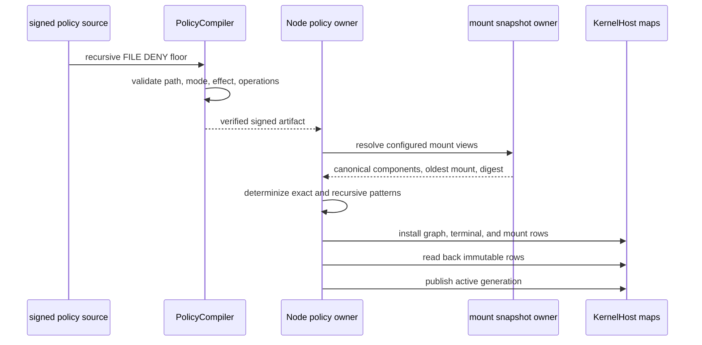
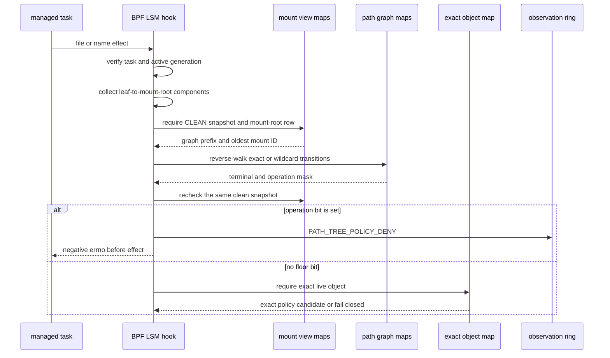
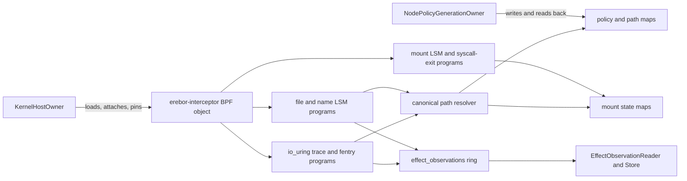

# Signed Path-Tree Denial Implementation Review

This guide covers implementation commit
`2872526a3fd7a23d83ead50438818014f425eb22`. The commit is based on
`4875862804b64c003927b60e634b7989dd3897f7`.
Test-only follow-up commit `a8133da` replaces one prohibited `Option::expect`
with the repository's fallible test style. It does not change runtime code.

The design source is the
[validated architecture](./policy-and-protection-algorithm-architecture-readable.md#path-selector-resolution-path-tree-floors-and-exact-object-authority).
The external algorithm source is the
[BpfJailer LPC 2025 presentation](<../../../BpfJailer LPC 2025.pdf>). The
presentation SHA-256 is
`81dca098d1ed96e19fd89b48b78be63c504f9f52f9f25b662e4a94c14a5209f6`.
Slides 16 through 21 define the relevant Meta mount and dentry walk.

This guide uses Berkeley Packet Filter (BPF), Linux Security Module (LSM),
application binary interface (ABI), interprocess communication (IPC), and
virtual machine (VM).

## Review route

Read the implementation in this order:

1. Read [`PathTreeDenyFloorV1`](../../../crates/mithril-control/src/policy/source.rs#L436).
   This type is the signed policy input.
2. Read
   [`validate_path_tree_deny_floors`](../../../crates/mithril-control/src/policy/compiler.rs#L1919).
   This function rejects positive, excepted, nonrecursive, and non-file rules.
3. Read
   [`CanonicalPathGraphV1::compile_with_path_tree_denies`](../../../crates/mithril-control/src/policy/path.rs#L314)
   and
   [`insert_path_tree_deny`](../../../crates/mithril-control/src/policy/path.rs#L554).
   These functions add the recursive terminal state and its operation mask.
4. Read
   [`MountInfoSnapshot::read`](../../../crates/mithril-node/src/exact_object.rs#L349)
   and
   [`canonicalize_mount_path`](../../../crates/mithril-node/src/exact_object.rs#L557).
   These functions build the clean mount snapshot and select the oldest mount.
5. Read
   [`lower_path_tables`](../../../crates/mithril-node/src/policy.rs#L3320).
   This function joins exact-object patterns and path-tree floors in one
   deterministic graph.
6. Read
   [`LoweredGeneration::install`](../../../crates/mithril-node/src/policy.rs#L1633).
   This function installs and reads back the graph and mount rows before it
   publishes the generation as active.
7. Read
   [`collect_mount_components`](../../../bpf/erebor-interceptor/programs/identity_path.bpf.h#L141),
   [`canonical_path_match_step`](../../../bpf/erebor-interceptor/programs/identity_path.bpf.h#L327),
   and
   [`canonical_path_candidate`](../../../bpf/erebor-interceptor/programs/identity_path.bpf.h#L396).
   These functions perform the live kernel walk and graph lookup.
8. Read
   [`resolved_identity_effect_gate`](../../../bpf/erebor-interceptor/programs/identity_effects.bpf.h#L292).
   The path-tree floor runs after canonical resolution and before exact-object
   lookup.
9. Read
   [`EffectTestRunner::physical_probe`](../../../crates/mithril-e2e/src/effect.rs#L702).
   This probe supplies the physical oracle.
10. Read
    [`mount-attack-deny.sh`](../../../examples/mithril-local-enforcement-manual/mount-attack-deny.sh).
    This script supplies the operator-readable mount-attack proof.

## Implemented result

The implementation provides one signed recursive path-tree `DENY` floor. The
floor applies only to qualified `FILE` operations. The compiler rejects
`ALLOW`, `ALERT`, exceptions, observe mode, a nonrecursive selector, a root
selector, a noncanonical selector, and an unsupported operation.

The graph terminal stores a 64-bit operation mask. Bit `N` represents kernel
operation ID `N`. The recursive state is also a terminal state. A self-loop
wildcard consumes each descendant component. The terminal therefore matches
the named directory and all descendants.

The kernel evaluates the terminal before it reads `exact_file_objects`. A
covered `CREATE` can therefore deny a negative dentry that has no inode. A
later child and a replacement child use the same terminal. A path-tree rule
cannot grant file authority.

## Validation against Meta's algorithm

The implementation uses Meta's algorithm as an architecture pattern. It does
not use Meta source code. The presentation does not publish that source.

| Meta property | Current implementation | Review source |
| --- | --- | --- |
| Walk from the target dentry toward the mount root. | BPF reads `d_parent` and stores leaf-first component byte views. | [`collect_mount_components`](../../../bpf/erebor-interceptor/programs/identity_path.bpf.h#L141) |
| Reverse the leaf-first component vector before graph evaluation. | The loop reads `component_count - offset - 1`. | [`canonical_path_match_step`](../../../bpf/erebor-interceptor/programs/identity_path.bpf.h#L327) |
| At a repeated mount-root dentry, select the oldest mount by the lowest `mnt_id_unique`. | Userspace indexes mounts by root identity, uses `min_by_key(mount_id_unique)`, and repeats through the selected parent mountpoint. | [`canonicalize_mount_path`](../../../crates/mithril-node/src/exact_object.rs#L557) |
| Continue the mount walk to the selected namespace root. | Userspace prepends each selected parent attachment. BPF starts the live mount-relative walk at the resulting graph prefix. | [`lower_path_tables`](../../../crates/mithril-node/src/policy.rs#L3320), [`canonical_path_candidate`](../../../bpf/erebor-interceptor/programs/identity_path.bpf.h#L396) |
| Match components with a bounded graph. | The compiler determinizes exact and wildcard transitions. BPF uses one state ID per step. | [`CanonicalPathGraphV1::determinize`](../../../crates/mithril-control/src/policy/path.rs#L390) |
| Invalidate path decisions on mount changes. | Mount hooks publish `DIRTY` and advance the global epoch before the effect. The path gate checks the clean view before and after graph lookup. | [`begin_mount_mutation`](../../../bpf/erebor-interceptor/programs/identity_path.bpf.h#L53), [`snapshot_mount_view`](../../../bpf/erebor-interceptor/programs/identity_path.bpf.h#L257) |

The runtime split is important. BPF walks from the live leaf to the current
mount root. Userspace has already walked across mount roots and stored the
resulting graph prefix in `canonical_mount_roots`. BPF does not choose the
caller-visible bind alias. It replaces the live mount ID with the snapshot's
`selected_mount_id_unique` value.

## Owners

| Owner | State and input | Output or side effect | Change and cleanup authority | Proof |
| --- | --- | --- | --- | --- |
| `PolicyCompiler` | Owns validation of the signed `PathTreeDenyFloorV1` input. | Produces a signed candidate only for a recursive protect-mode file denial. | The compiler creates no runtime state. A new signed artifact is the only update input. | [`path_tree_rules_are_signed_denial_floors_only`](../../../crates/mithril-control/tests/policy_compilation.rs#L92) |
| `CanonicalPathGraphV1` | Owns nondeterministic and deterministic path states. | Produces bounded exact transitions, wildcard transitions, and terminal masks. | The graph exists only during compilation and lowering. | [`recursive_path_tree_deny_covers_the_root_and_descendants`](../../../crates/mithril-control/src/policy/path.rs#L876) |
| `ExactFileObjectResolver` | Owns a held workload root and two equal mountinfo reads. | Produces canonical components, the selected oldest mount ID, and a snapshot digest. | It rejects a changed or incomplete snapshot. The held handles close with the resolver. | [`canonical_mount_walk_selects_the_oldest_root_and_repeats_to_namespace_root`](../../../crates/mithril-node/src/exact_object.rs#L819) |
| `NodePolicyGenerationOwner` | Owns lowered generation rows and mount reconciliation. | Installs, reads back, activates, reconciles, and retires generation-prefixed rows. | Only this owner writes policy graph rows. BPF can change mount state, not policy terminals. | [`path_tree_floor_lowers_without_an_exact_child_object`](../../../crates/mithril-node/src/policy.rs#L4120) |
| `KernelHostOwner` | Owns the loaded BPF object, links, map handles, and pin paths. | Attaches programs and pins maps and links in bpffs. | Qualification shutdown removes owned pins. Production pins remain for explicit recovery or operator cleanup. | [`KernelHostOwner::shutdown`](../../../crates/erebor-interceptor/src/host.rs#L1380) |
| BPF effect and path gates | Own per-attempt scratch state and the physical kernel return value. | Return the configured negative errno and emit `PATH_TREE_POLICY_DENY`. | BPF changes scratch, observation counters, and mount state. It does not change a signed terminal. | [`path_tree_deny_uses_the_clean_canonical_path_before_object_lookup`](../../../crates/erebor-interceptor/src/bundled.rs#L480) |
| `EffectObservationStore` | Owns copied userspace observation records. | Converts the fixed ABI record to the runtime IPC record. | The ring-buffer callback appends records. Store retention is bounded in userspace. | [`EffectObservationStore::record_bytes`](../../../crates/mithril-node/src/observation.rs#L61) |
| `EffectTestRunner` and the manual shell | Own disposable fixture paths, processes, cgroups, pins, and VM evidence. | Prove the syscall result and the independent filesystem postcondition. | Their cleanup owners remove only harness-owned state. | [`physical_probe`](../../../crates/mithril-e2e/src/effect.rs#L702), [`identity_on_exit`](../../../examples/mithril-identity-manual/identity-runtime.sh#L67) |

## Control-plane flow



The policy source contains UTF-8 canonical paths. The runtime graph contains
Linux component bytes. The node converts operation names to numeric kernel
operation IDs and sorts those IDs before it creates the operation mask.

The node merges the floor with exact-object patterns in one graph. A terminal
can contain an exact-object candidate and a path-tree mask. The path-tree mask
does not need a child exact-object binding.

## Runtime decision flow



For a name operation, the target dentry can have no inode. The small
[`prepare_path_mount_namespace`](../../../bpf/erebor-interceptor/programs/identity_effects.bpf.h#L708)
subprogram records the directory mount namespace before the main effect call
chain. This split keeps the BPF verifier's deepest stack chain within 512
bytes. The main gate uses that namespace only for canonical resolution. If no
path-tree terminal matches, the negative dentry retains the established
`UNSUPPORTED_OBJECT` result.

The two clean-view checks use the same topology generation, snapshot digest,
and transition version. A concurrent mount change makes the second check
fail. The gate then returns `UNRESOLVED_OBJECT`. It does not use the terminal
from the stale lookup.

## Mount-attack and reconciliation flow

```mermaid
sequenceDiagram
    participant A as mount attacker
    participant H as mount BPF hooks
    participant V as mount view maps
    participant T as managed task
    participant P as path gate
    participant N as node reconciliation

    A->>H: mount or unmount request
    H->>V: increment epoch and pending; set DIRTY
    H-->>A: kernel continues or denies by policy
    T->>P: open below protected tree
    P->>V: request clean current snapshot
    V-->>P: DIRTY or unequal epoch
    P-->>T: fail closed before fd or bytes
    H->>V: syscall exit decrements pending
    N->>V: rebuild roots and write proposal
    N->>H: commit exact proposal
    H->>V: CAS view to CLEAN
    N->>V: publish global clean epoch last
```

[`begin_global_mount_mutation`](../../../bpf/erebor-interceptor/programs/identity_path.bpf.h#L21)
marks global topology state before the mount effect. Managed mount operations
also pass through the signed mount policy. An external mount can continue, but
the dirty view prevents a strict file decision.

[`NodePolicyGenerationOwner::reconcile_mount_views`](../../../crates/mithril-node/src/policy.rs#L595)
rebuilds each root from the current namespace. The node writes a proposal and
asks the non-attached BPF command to commit it under the view lock. The node
publishes the global clean epoch only after every view has committed.

## BPF program relationship



All programs are in the one production BPF object. The userspace loader uses
libbpf. The path-tree implementation does not load a second policy program.

### File and name programs

The file group uses LSM sections
[`lsm/file_open`, `lsm/file_permission`, `lsm/mmap_file`, and
`lsm/file_mprotect`](../../../bpf/erebor-interceptor/programs/identity_effects.bpf.h#L821).
These programs derive an operation ID from the kernel context. They preserve a
prior LSM denial. They verify the current task label, binding, process state,
and active generation before path resolution.

The name group uses
[`lsm/path_unlink` through `lsm/path_rename`](../../../bpf/erebor-interceptor/programs/identity_effects.bpf.h#L975).
`mknod`, `mkdir`, and `symlink` map to `CREATE`. `chmod`, `chown`, and path
truncate map to `SETATTR`. Link and rename evaluate the source path before the
destination path. A nonzero return stops the physical filesystem operation.

The programs use `BPF_CORE_READ_INTO` to read path, dentry, inode, mount, and
namespace fields through Compile Once - Run Everywhere (CO-RE) relocations. A
failed read makes the object unresolved or unsupported. The programs use
`bpf_loop` for at most 64 path components. A negative return or an unresolved
state fails closed.

### io_uring programs

The io_uring group records submitter and request state at
[`tp_btf/io_uring_submit_req`](../../../bpf/erebor-interceptor/programs/identity_io_uring.bpf.h#L715).
[`fentry/io_issue_sqe`](../../../bpf/erebor-interceptor/programs/identity_io_uring.bpf.h#L823)
binds the executor to that request. The normal file LSM hooks then route the
operation to
[`resolved_io_uring_effect_gate`](../../../bpf/erebor-interceptor/programs/identity_io_uring.bpf.h#L267).
This gate uses the captured actor, the same canonical resolver, and the same
terminal mask. Missing or unequal request state fails closed. The fexit and
completion programs clear execution and request state.

### Mount programs

The mount group uses `lsm/sb_kern_mount`, `lsm/sb_mount`, `lsm/sb_umount`,
`lsm/sb_pivotroot`, and `lsm/move_mount` at
[`identity_effects.bpf.h`](../../../bpf/erebor-interceptor/programs/identity_effects.bpf.h#L1081).
The programs update global and namespace state before the effect. The
[`raw_syscalls/sys_exit` program](../../../bpf/erebor-interceptor/programs/identity_path.bpf.h#L468)
releases the pending count after the syscall. A missing state row denies a
managed mutation and leaves strict path decisions closed.

### Return and observation behavior

[`path_tree_effect_result`](../../../bpf/erebor-interceptor/programs/identity_effects.bpf.h#L111)
returns `identity_deny(config)`. The configured value is a negative errno. The
LSM hook returns that value to the kernel before the protected effect occurs.

The program reserves a ring-buffer record with `bpf_ringbuf_reserve`. A full
ring increments the loss counter and does not change the denial. Observation
delivery is best effort. Enforcement is not best effort.

## Map lifecycle

| Map | Key and value ABI | Userspace writer | BPF writer | Readers | Lifetime |
| --- | --- | --- | --- | --- | --- |
| `canonical_mount_roots` | `CanonicalMountRootKeyV1` to `CanonicalMountRootV1` | Node install and reconciliation | None | Canonical path resolver | Pinned. Rows use a generation prefix. Retirement deletes that generation's rows. |
| `path_graph_exact_transitions` | `PathGraphTransitionKeyV1` to `PathGraphTransitionV1` | Node generation install | None | Canonical match loop | Pinned. Immutable rows remain until generation retirement. |
| `path_graph_wildcard_transitions` | `PathGraphStateKeyV1` to `PathGraphTransitionV1` | Node generation install | None | Canonical match loop | Pinned. Immutable rows remain until generation retirement. |
| `path_graph_terminals` | `PathGraphStateKeyV1` to `PathGraphTerminalV1` | Node generation install | None | Canonical resolver and effect gate | Pinned. Immutable rows remain until generation retirement. |
| `exact_file_objects` | `ExactFileObjectKeyV1` to `ExactObjectBindingV1` | Node generation install | None | Effect and io_uring gates after the path-tree check | Pinned. Retirement deletes generation rows. A path-tree denial does not require a child row. |
| `mount_security_views` | Native-endian namespace inode `u32` to `MountSecurityViewStateV1` | Node install and reconciliation | Mount mutation and reconciliation programs | Node readback and canonical resolver | Pinned for the pin-root lifetime. Rows can survive one policy generation. |
| `mount_security_view_locks` | Native-endian namespace inode `u32` to private spin-lock value | Node creates the row | BPF owns lock operations | BPF mount and snapshot paths | Pinned for the pin-root lifetime. Userspace does not operate the lock. |
| `mount_mutation_epochs` | Native-endian namespace inode `u32` to native-endian `u64` | Node install and synchronization | Mount mutation programs | Node and canonical resolver | Pinned for the pin-root lifetime. |
| `mount_global_mutation_epoch`, `mount_global_clean_epoch`, `mount_global_pending_mutations` | Native-endian zero `u32` to native-endian `u64` | Node initializes and publishes clean state | Mount mutation programs advance mutation and pending state | Node and canonical resolver | Pinned singleton rows for the pin-root lifetime. |
| `mount_reconciliation_proposals` | Native-endian namespace inode `u32` to `MountReconciliationProposalV1` | Node reconciliation | BPF reads and commits the proposal | Node readback and BPF command | Pinned for the pin-root lifetime. A proposal does not make the view clean by itself. |
| `identity_scratch` | Zero `u32` to private per-CPU `identity_scratch_v1` | None | Effect and path programs | Effect and path programs | Object and pin-root lifetime. It carries only one CPU-local attempt. |
| `effect_observations` | Ring buffer; each record is `EffectObservationV1` | None | BPF effect programs | `EffectObservationReader` and `EffectObservationStore` | Object and pin-root lifetime. Reader exit does not remove a pinned map. |

The BPF map declarations are in
[`identity_maps.h`](../../../bpf/erebor-interceptor/programs/identity_maps.h#L393).
The node installs and reads back path rows in
[`LoweredGeneration::install`](../../../crates/mithril-node/src/policy.rs#L1633).
[`retire_generation_rows`](../../../crates/mithril-node/src/policy.rs#L2647)
deletes generation-prefixed graph, terminal, exact-object, and mount-root rows.

A BPF filesystem (bpffs) pin keeps a map or link alive after the loader
process exits.
Qualification-mode `KernelHostOwner` removes its recorded pins during
shutdown. Production recovery reuses expected pins. The manual owner removes
its unique pin root in its EXIT trap. A process exit alone does not remove a
pinned map or link.

## ABI boundary

[`PathGraphTerminalV1`](../../../crates/erebor-interceptor-abi/src/abi/path.rs#L118)
is a `repr(C)` 24-byte value. The first two `u64` fields retain the exact-object
terminal. The last `u64` is the path-tree operation mask. The ABI uses native
byte order because userspace and BPF share one kernel host.

The Rust ABI derives `FromBytes`, `IntoBytes`, and `KnownLayout`. All bit
patterns are valid for this integer-only value. `FromBytes::read_from_bytes`
is suitable for an exact-size terminal. It rejects a wrong byte length. A type
with validity-restricted enum fields must use `TryFromBytes::try_read_from_bytes`
instead.

[`erebor-interceptor-abi/build.rs`](../../../crates/erebor-interceptor-abi/build.rs#L8)
uses cbindgen to create the C header. A normal build rejects a checked header
that differs from generated output. The BPF object includes the checked
[`erebor_interceptor_abi.h`](../../../bpf/erebor-interceptor/include/erebor_interceptor_abi.h#L1470).

[`EffectObservationReasonV1::PathTreePolicyDeny`](../../../crates/erebor-interceptor-abi/src/abi.rs#L1104)
has numeric value 11. The node maps that value to
`PATH_TREE_POLICY_DENY` in
[`reason_name`](../../../crates/mithril-node/src/observation.rs#L190).
`EffectObservationStore::record_bytes` uses
`EffectObservationV1::read_from_bytes`. A wrong record size increments the
malformed counter and does not create an IPC event.

## Tests and physical evidence

| Proof | Result |
| --- | --- |
| `path_tree_rules_are_signed_denial_floors_only` | Accepts one valid signed recursive denial. Rejects `ALLOW`, nonrecursive input, and an exception. |
| `recursive_path_tree_deny_covers_the_root_and_descendants` | Matches the named root and a later descendant. Does not match an outside path. |
| `path_tree_floor_lowers_without_an_exact_child_object` | Installs a floor-only terminal mask without a child exact-object terminal. Uses an unrelated exact object to supply the represented mount view. |
| `path_tree_deny_uses_the_clean_canonical_path_before_object_lookup` | Checks leaf-to-root collection, component reversal, two clean-view checks, selected oldest mount use, and decision order. |
| Repository Rust CI | `bash .github/scripts/verify-rust-ci.sh` passed through `a8133da`. It ran formatting, workspace check, strict all-target and all-feature clippy, and all workspace tests. |
| Disposable VM harness | Passed at exact commit `2872526a3fd7a23d83ead50438818014f425eb22` with `crates/mithril-e2e/harness/vm/run.sh --output-directory /tmp/mithril-path-tree-vm-20260817-v9-2872526`. |
| Manual harness VM | `mount-attack-deny.sh` printed its PASS line and the complete Mithril cleanup line. |

The exact-commit local-enforcement artifact is
`/tmp/mithril-path-tree-vm-20260817-v9-2872526/local-enforcement-physical-probe.json`.
Its SHA-256 is
`20c34a1afbfad23d5d8940fb190f2228b57b614fd814c6555eafd9a1b5707e37`.
It records these true fields:

- `path_tree_preexisting_child_denied`
- `path_tree_later_child_denied`
- `path_tree_replacement_child_denied`
- `path_tree_outside_control_allowed`
- `path_tree_mount_attack_failed_closed`
- `cgroup_removed`
- `fixture_root_removed`

The probe also checks a managed negative-dentry `CREATE`. The call returns a
denial, and the target file does not exist. During an external bind
replacement, the view becomes `DIRTY`. A covered access then returns the
fail-closed unresolved result. Reconciliation restores the path-tree terminal.

## Limits and nonclaims

- The verified path bound is 64 components. Each component is at most 255
  bytes. Meta's presentation describes a 255-component prototype bound.
- The physical path-tree proof is x86_64 only. The checked BPF build compiles
  other supported headers, but that result is not non-x86 physical evidence.
- The floor covers the signed `FILE` operations accepted by
  [`operation_belongs_to_family`](../../../crates/mithril-control/src/policy/compiler.rs#L2400).
  It does not create positive file authority.
- Runtime canonical rows come from represented mount snapshots. A mount root
  without a `canonical_mount_roots` row fails closed as unresolved. It does
  not choose a caller path.
- The physical fixture proves one external bind replacement and dirty-view
  recovery. It does not qualify every propagation, idmapped-mount, overlay,
  network-filesystem, or automount case.
- Existing or passed file descriptors still use current-actor and exact-object
  checks. This floor does not claim byte provenance.
- The broader local-enforcement phase remains **Not done**. This guide claims
  only the bounded signed recursive path-tree denial slice.
