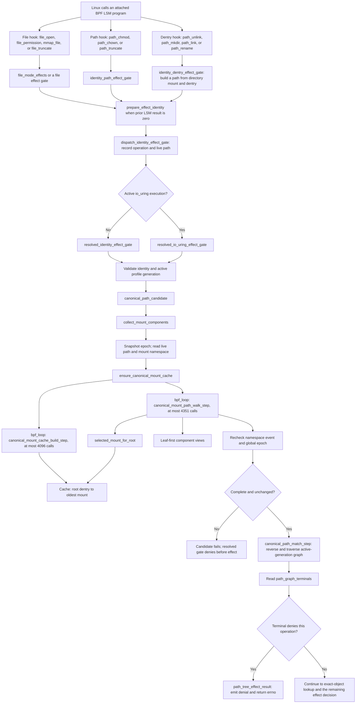
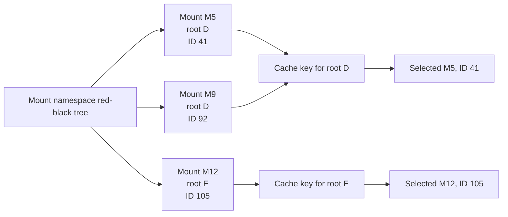
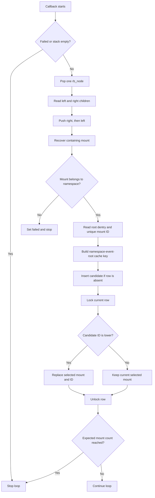
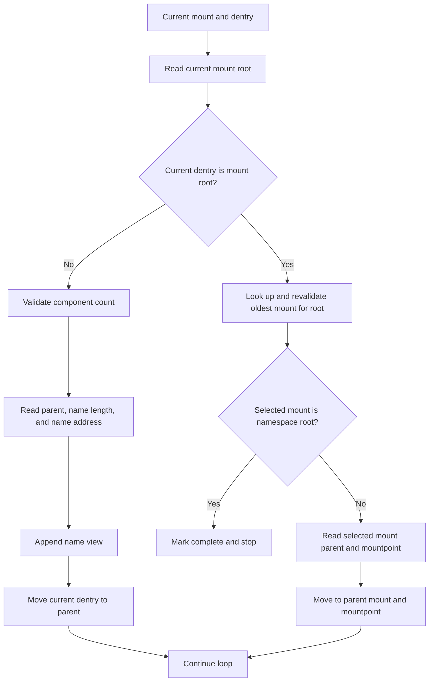
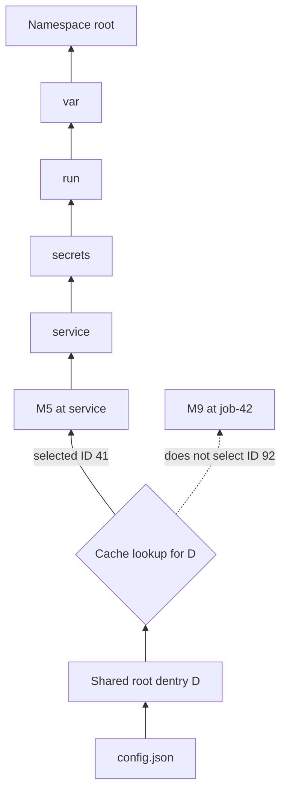
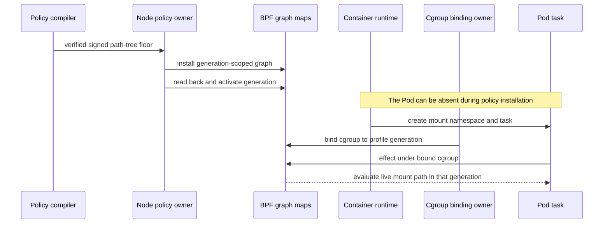
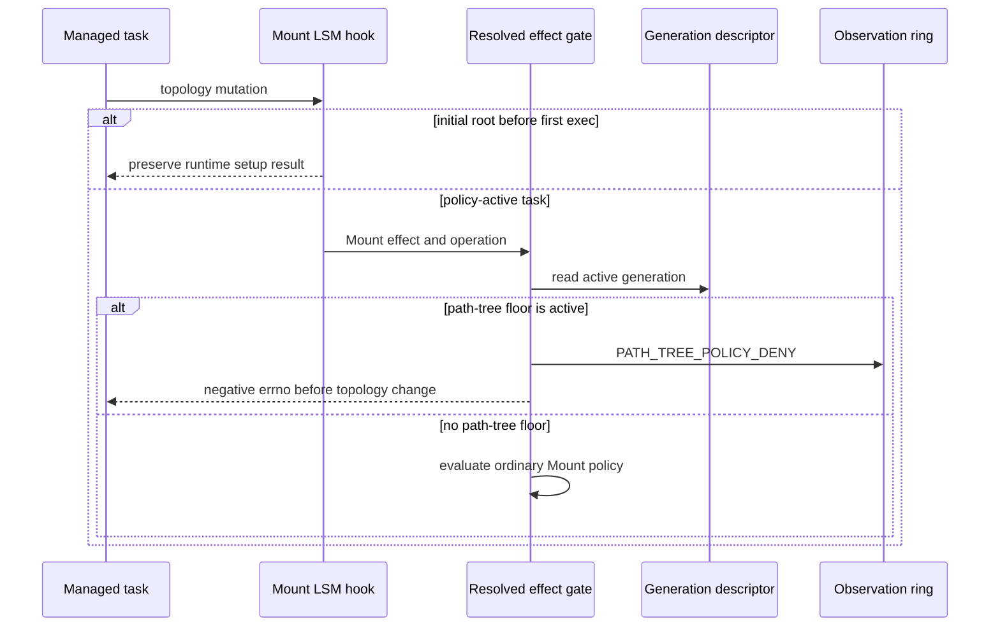
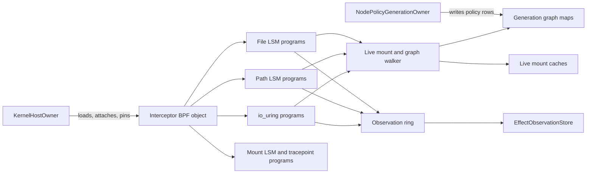

# Signed Path-Tree Denial And Meta Algorithm Implementation Review

This guide covers the current checked Berkeley Packet Filter (BPF), Rust, and
manual acceptance source. The path resolver in
[`identity_path.bpf.h`](../../../bpf/erebor-interceptor/programs/identity_path.bpf.h)
still implements the qualified mount and dentry walk. The current source also
marks generations that contain a path-tree floor and denies post-exec mount
topology changes for those generations. This closes the child-directory bind
alias that an equal-root oldest-mount lookup cannot canonicalize.

- Architecture: [validated readable architecture](./policy-and-protection-algorithm-architecture-readable.md#path-selector-resolution-path-tree-floors-and-exact-object-authority)
- Local-enforcement review: [implementation review guide](./phase-4-implementation-review.md)
- Current result: [closure matrix](./phase-4-closure-matrix.md)
- Manual proof: [acceptance runbook](./manual-testing/phase-4-manual-acceptance.md)

The design source is the
[validated architecture](./policy-and-protection-algorithm-architecture-readable.md#path-selector-resolution-path-tree-floors-and-exact-object-authority).
The external algorithm source is the
[BpfJailer LPC 2025 presentation](<../../../BpfJailer LPC 2025.pdf>). Its
SHA-256 is
`81dca098d1ed96e19fd89b48b78be63c504f9f52f9f25b662e4a94c14a5209f6`.
Slides 16 through 21 describe the Meta mount and dentry walk. Slide 19 shows
the leaf-to-root mount choice. Slide 20 defines the oldest-mount index. Slide
21 shows the Names, Nodes, Initializer, Glob, and Data maps and the active path
iterators.
BPF programs run the kernel checks. Linux Security Module (LSM) hooks call the
BPF programs before the covered effects.

## Review route

Read the implementation in this order:

1. Read [`PathTreeDenyFloorV1`](../../../crates/mithril-control/src/policy/source.rs)
   and its
   [`Validate` implementation](../../../crates/mithril-control/src/policy/validation/records.rs#L180).
   These sources define and validate the signed restriction.
2. Read
   [`PolicyDocumentV1::validate`](../../../crates/mithril-control/src/policy/validation/document.rs#L13)
   and
   [`PolicyCompiler::compile`](../../../crates/mithril-control/src/policy/compiler.rs#L82).
   The document owns recursive and cross-record checks. The compiler starts
   only after validation succeeds.
3. Read
   [`CompiledOperationV1`](../../../crates/mithril-control/src/policy/compiler/conversion.rs#L10)
   and
   [`RuleDimensions`](../../../crates/mithril-control/src/policy/compiler/expansion.rs#L121).
   Conversion implementations own signed-to-kernel value mapping. Expansion
   owns policy-dimension products and exact-cell resolution.
4. Read
   [`CanonicalPathGraphV1::compile_with_path_tree_denies`](../../../crates/mithril-control/src/policy/path.rs#L312)
   and
   [`insert_path_tree_deny`](../../../crates/mithril-control/src/policy/path.rs#L552).
   These functions create the recursive graph terminal and operation mask.
5. Read [`lower_path_tables`](../../../crates/mithril-node/src/policy.rs).
   This function compiles static policy components to generation-scoped map
   rows. It does not inspect a filesystem or mount namespace for a path-tree
   floor.
6. Read [`LoweredGeneration::install`](../../../crates/mithril-node/src/policy.rs).
   This function installs and reads back the graph before generation
   activation.
7. Read
   [`canonical_mount_cache_build_step`](../../../bpf/erebor-interceptor/programs/identity_path.bpf.h#L304),
   [`canonical_mount_path_walk_step`](../../../bpf/erebor-interceptor/programs/identity_path.bpf.h#L520),
   and
   [`collect_mount_components`](../../../bpf/erebor-interceptor/programs/identity_path.bpf.h#L606).
   These functions inspect the task's live mount namespace, select the oldest
   mount, and walk from the leaf to the namespace root. Use the
   [detailed BPF Meta walkthrough](#detailed-bpf-meta-walkthrough) to review
   each source block, callback result, state change, and fail-closed check.
8. Read
   [`canonical_path_match_step`](../../../bpf/erebor-interceptor/programs/identity_path.bpf.h#L739)
   and
   [`canonical_path_candidate`](../../../bpf/erebor-interceptor/programs/identity_path.bpf.h#L808).
   These functions reverse the collected components and traverse only the
   task's active profile generation.
9. Read [`LoweredGeneration::for_binding`](../../../crates/mithril-node/src/policy.rs)
   and
   [`ProfileGenerationDescriptorV1`](../../../crates/erebor-interceptor-abi/src/abi.rs).
   The node records whether the active generation contains a path-tree floor.
10. Read
   [`mount_mutation_effect`](../../../bpf/erebor-interceptor/programs/identity_effects.bpf.h)
   and
   [`resolved_identity_effect_gate`](../../../bpf/erebor-interceptor/programs/identity_effects.bpf.h#L300).
   Pre-exec setup returns before the policy gate. The resolved gate denies the
   Mount effect family for a path-tree generation before ordinary mount policy
   lookup. File path-tree decisions occur before exact-object lookup.
11. Read
   [`path_tree_deny_uses_the_live_bpf_mount_path_before_object_lookup`](../../../crates/erebor-interceptor/src/bundled.rs#L500)
   and
   [`bpf_path_walks_use_meta_component_and_namespace_budgets`](../../../crates/erebor-interceptor/src/bundled.rs#L1217).
   These tests check decision order and the compiled BPF loop limits.
12. Read [`EffectTestRunner::physical_probe`](../../../crates/mithril-e2e/src/effect.rs#L705)
   and [`EffectProcessFixture::bind_mount`](../../../crates/mithril-e2e/src/effect/child.rs).
   The physical probe checks the 255-component limit and post-exec regular and
   recursive child-directory bind attempts.

## Implemented result

The signed policy accepts a recursive path-tree `DENY` floor for qualified
`FILE` operations. The compiler rejects a positive disposition, an exception,
a nonrecursive rule, an invalid canonical path, an empty operation set, and an
unsupported effect family. It also rejects every positive local Mount effect
rule in a profile that contains a path-tree floor. The diagnostic code is
`CFG_PATH_TREE_MOUNT_AUTHORITY`.

Rust compiles only the static signed policy graph. It can do this before a Pod,
container, mount namespace, target directory, or target child exists. Every
exact transition, wildcard transition, and terminal key contains
`profile_generation_ref_id`.

The generation descriptor records `path_tree_deny_active`. After the first
exec, each topology attach, detach, pivot-root, and move-mount operation routed
through `mount_mutation_effect` reaches the resolved effect gate. That gate
checks the descriptor before ordinary mount policy lookup and returns
`PATH_TREE_POLICY_DENY` for the Mount effect family. The pre-first-exec return
in `mount_mutation_effect` stays unchanged, so the container runtime can
construct the initial namespace before the workload becomes policy active.

The workload binding selects the active generation for a cgroup. At effect
time, BPF reads that generation from the task's process state. BPF then:

1. Reads the supplied live `struct path`.
2. Finds the task's live `mnt_namespace` and namespace root.
3. Enumerates the namespace mount red-black tree.
4. Selects the lowest `mnt_id_unique` for each repeated root dentry.
5. Walks `d_parent` from the leaf to a mount root.
6. Crosses to the selected mount's `mnt_parent` and `mnt_mountpoint`.
7. Stops only at the live namespace root.
8. Reverses the leaf-first component vector.
9. Traverses graph rows for the active profile generation from state zero.
10. Applies the terminal operation mask before exact-object lookup.

The walk does not test the inode type. A file and a directory both use their
path. Name operations can deny a negative dentry before an inode exists.

The post-exec mount floor is a topology restriction. It does not add source
lineage to the mount cache. A profile that needs positive post-exec mount
authority cannot use a path-tree floor until a source-aware design is
implemented and qualified.

## Algorithm walkthrough

The algorithm has a static stage and a live stage. Rust runs the static stage
when the node installs a policy generation. BPF runs the live stage for each
covered effect. The live stage uses the task's current mount namespace. Rust
never resolves the protected path in a filesystem or mount namespace. The
policy path can name a future Pod path that does not exist during policy
installation.

### Validation ownership

[`PolicyCompiler::compile`](../../../crates/mithril-control/src/policy/compiler.rs#L82)
calls the document's `Validate` implementation before it lowers any rule.
The compiler does not contain policy validation functions.

[`PolicyValue`](../../../crates/mithril-control/src/policy/validation/value.rs#L8)
owns the shared lexical checks for local IDs, registry symbols, UUIDs,
digests, and durations. Each policy record that owns intrinsic checks implements
[`Validate`](../../../crates/mithril-control/src/policy/validation.rs#L5)
for its intrinsic fields. For example,
[`PathTreeDenyFloorV1::validate`](../../../crates/mithril-control/src/policy/validation/records.rs#L180)
owns the path-tree schema, disposition, recursion, operation, and canonical
path syntax checks.

[`PolicyDocumentV1::validate`](../../../crates/mithril-control/src/policy/validation/document.rs#L13)
validates its children and then checks relationships that require the full
document. These checks include unique IDs, references, graph-wide conflicts,
and role reachability. There is no validation context object. A child receives
only direct parent information when one check requires it, such as the
evaluation stage for a fallback.

The canonical path check calls
[`canonical_path_components`](../../../crates/mithril-control/src/policy/path.rs#L279).
This function parses the signed string into Linux name bytes and checks its
shape and bounds. It does not call `open`, `stat`, `readlink`, `setns`, or any
mount API. Rust therefore does not inspect a current container path and does
not require a Pod or container to exist.

The module split follows ownership. The
[`validation` module root](../../../crates/mithril-control/src/policy/validation.rs#L1)
defines only the trait, error, and repeated-check macros. Child files own
scalar values, records, effect rules, authority rules, and document-wide
relationships. The
[`compiler` module root](../../../crates/mithril-control/src/policy/compiler.rs#L1)
owns artifact models and orchestration. Standard conversion implementations
in
[`conversion.rs`](../../../crates/mithril-control/src/policy/compiler/conversion.rs#L1)
replace the old operation, effect-family, object-cell, and physical-result
free functions. Rule expansion and conflict resolution are in
[`expansion.rs`](../../../crates/mithril-control/src/policy/compiler/expansion.rs#L1).
The compiler module has one loose helper: a stateless SHA-256 formatter.

### 1. Compile the signed path-tree floor

[`PathTreeDenyFloorV1::validate`](../../../crates/mithril-control/src/policy/validation/records.rs#L180)
accepts only a recursive `FILE` denial. The rule cannot have an exception.
The validator also rejects an empty or unsupported operation set.
[`PolicyDocumentV1::validate`](../../../crates/mithril-control/src/policy/validation/document.rs#L13)
requires `PROTECT` mode when the document contains a path-tree denial. The
same document-level owner rejects a positive Mount effect rule when any
path-tree floor exists. A Mount denial is valid because it cannot widen
authority.

[`canonical_path_components`](../../../crates/mithril-control/src/policy/path.rs#L279)
splits the absolute policy path into Linux name bytes. It rejects the root
path, empty components, `.` and `..`, embedded null bytes, more than 255
components, and a component longer than 255 bytes. This function parses policy
text. It does not read the filesystem.

[`insert_path_tree_deny`](../../../crates/mithril-control/src/policy/path.rs#L552)
adds one exact graph edge for each policy component. At the terminal state, it
adds the denied operation IDs and a wildcard self-loop. The self-loop makes
the rule recursive. A path that stays below that terminal remains in a state
that contains the denial.

[`CanonicalPathGraphV1::determinize`](../../../crates/mithril-control/src/policy/path.rs#L388)
converts the graph to one deterministic state per active state set. Each
deterministic state contains the union of its active denial operation IDs.
This conversion preserves the recursive wildcard when another exact edge also
starts at the same state.

[`lower_path_tables`](../../../crates/mithril-node/src/policy.rs)
adds `profile_generation_ref_id` to every exact-transition, wildcard-transition,
and terminal key. The terminal value contains a 64-bit denied-operation mask.
The function does not require a Pod, target file, target directory, or mount
namespace.

[`LoweredGeneration::install`](../../../crates/mithril-node/src/policy.rs)
writes the three graph tables, verifies the immutable rows, and then changes
the generation descriptor to active. The graph is complete before a task can
use the generation.

### 2. Select the task's generation and live path

The applicable LSM hooks reach the resolved gate through a file, path, or
dentry effect gate. A file gate derives `file->f_path`. A path gate supplies
the hook's `struct path`. A dentry gate combines the hook's directory mount
with its target dentry. The shared dispatcher then selects the normal resolved
gate or the io_uring resolved gate. The resolved gate finds the current task
and its cgroup binding. It reads `active_profile_generation_ref_id` from the
task's process state. It then checks that the active generation belongs to the
bound profile.

The resolved gate passes the live `struct path` and the active generation to
[`canonical_path_candidate`](../../../bpf/erebor-interceptor/programs/identity_path.bpf.h#L808).
The candidate function has two operations:

1. Reconstruct the path from the live mount namespace.
2. Traverse graph rows that contain the active generation in their keys.

A state ID cannot select another profile's graph. The generation is part of
every graph lookup key.

### 3. Build the oldest-mount index in BPF

[`global_mount_epoch_snapshot`](../../../bpf/erebor-interceptor/programs/identity_path.bpf.h#L145)
first records the global mount-mutation epoch. It rejects the walk when a mount
mutation is pending.

[`ensure_canonical_mount_cache`](../../../bpf/erebor-interceptor/programs/identity_path.bpf.h#L385)
reads the task's `mnt_namespace.root`, namespace event number, and mount count.
It also reads the namespace root's `mnt_id_unique` through
[`read_unique_mount_id`](../../../bpf/erebor-interceptor/programs/identity_path.bpf.h#L129).
The resolver rejects a missing unique ID, an empty namespace, or more than
4,096 mounts.

The cache-state key contains these values:

- mount-namespace address;
- namespace-root `mnt_id_unique`;
- namespace event number.

A ready state with the same mount count can reuse the corresponding index. A
cache miss makes BPF enumerate `mnt_namespace.mounts`.

[`mount_scan_push`](../../../bpf/erebor-interceptor/programs/identity_path.bpf.h#L284)
and
[`canonical_mount_cache_build_step`](../../../bpf/erebor-interceptor/programs/identity_path.bpf.h#L304)
perform a bounded red-black-tree scan. The callback verifies that each mount
belongs to the selected namespace. For each mount, it forms this index entry:

```text
(namespace address, namespace-root mnt_id_unique, namespace event, root dentry)
    -> (selected mount address, selected mnt_id_unique)
```

Several mounts can have the same root dentry. This condition occurs with bind
mounts and other aliases. The callback uses a BPF spin lock and keeps the
lowest nonzero `mnt_id_unique`. The lowest unique ID identifies the oldest
mount for that root. A later attacker-created mount has a higher unique ID and
cannot replace the selected path edge.

This property applies only when the mounts have the same root dentry. It does
not connect a child directory to the mount that contains that directory. For
example, the mount that contains `/protected/models` can have `/` as its root,
while a new bind at `/alias/models` has the `models` dentry as its root. The
first child bind is then the only indexed mount for that root dentry. The walk
can produce `/alias/models/x`; the graph matcher cannot recover the source
containment after that result. Cache invalidation makes the index current. It
does not add the missing lineage.

After the scan, BPF requires all of these conditions:

- the loop visited the reported mount count;
- the explicit scan stack is empty;
- the namespace event number did not change;
- the reported mount count did not change;
- the global mutation epoch did not change;
- no mount mutation is pending.

A failed condition returns `-EACCES`. The effect gate classifies the failure
as an unsupported or unresolved object and denies the effect. The live
oldest-mount index is implemented for x86_64 and arm64. The compiled fallback at
[`ensure_canonical_mount_cache`](../../../bpf/erebor-interceptor/programs/identity_path.bpf.h#L458)
returns `-EACCES` on the other checked architectures.

### 4. Walk from the leaf to the namespace root

[`collect_mount_components`](../../../bpf/erebor-interceptor/programs/identity_path.bpf.h#L606)
starts with `path->dentry` and `path->mnt`. It converts the virtual filesystem
mount to its containing `struct mount`, finds that mount's live namespace, and
initializes the per-CPU walk state.

[`canonical_mount_path_walk_step`](../../../bpf/erebor-interceptor/programs/identity_path.bpf.h#L520)
runs one of two actions for each callback:

1. If the current dentry is not the current mount root, record its `d_name`
   address and length. Then move to `d_parent`. This operation collects the
   path from leaf to head.
2. If the current dentry is the mount root, call
   [`selected_mount_for_root`](../../../bpf/erebor-interceptor/programs/identity_path.bpf.h#L474).
   That function reads the oldest-mount index under its spin lock. It then
   rechecks the selected mount's namespace, root dentry, and live
   `mnt_id_unique`.

If the selected mount is `mnt_namespace.root`, the walk is complete. Otherwise,
the callback changes the current position to the selected mount's `mnt_parent`
and `mnt_mountpoint`. The next callback continues toward the namespace root.
This step is the mount-boundary traversal in Meta's algorithm.

The combined loop allows 4,351 callbacks. This bound covers 4,096 mount
crossings and 255 dentry components. The walk fails when it reaches a bad
pointer, an invalid self-parent edge, an invalid name, an oversized name, or
the callback bound without reaching the namespace root. It does not use a
truncated path.

After the walk, `collect_mount_components` requires the namespace root to be
reached. It also rechecks the namespace event and the global mount epoch. A
concurrent mount change therefore invalidates the complete result.

### Detailed BPF Meta walkthrough

This section follows the current C source in execution order. It explains the
three functions as one bounded transaction. The first callback builds a live
mount index. The second callback walks one dentry or one mount boundary per
iteration. The wrapper supplies the input, controls both loops, and publishes
output only after the final topology checks pass.

#### BPF call graph and result ownership

This graph starts at the BPF LSM program. It covers the file, path, and
dentry hooks that can reach the path resolver. It does not describe LSM
programs that have no file or path candidate.



The file LSM programs enter through
[`file_open`](../../../bpf/erebor-interceptor/programs/identity_effects.bpf.h#L864),
[`file_permission`](../../../bpf/erebor-interceptor/programs/identity_effects.bpf.h#L878),
and the other file sections. The direct path hooks enter
[`identity_path_effect_gate`](../../../bpf/erebor-interceptor/programs/identity_effects.bpf.h#L704).
The dentry hooks enter
[`identity_dentry_effect_gate`](../../../bpf/erebor-interceptor/programs/identity_effects.bpf.h#L767),
which combines the directory mount with the target dentry. All three routes
call
[`dispatch_identity_effect_gate`](../../../bpf/erebor-interceptor/programs/identity_effects.bpf.h#L602).

The dispatcher selects either
[`resolved_identity_effect_gate`](../../../bpf/erebor-interceptor/programs/identity_effects.bpf.h#L300)
or, for an active io_uring execution,
[`resolved_io_uring_effect_gate`](../../../bpf/erebor-interceptor/programs/identity_io_uring.bpf.h#L267).
After their resolver preconditions pass for a covered file effect, both routes
invoke
[`canonical_path_candidate`](../../../bpf/erebor-interceptor/programs/identity_path.bpf.h#L808)
and apply a matched path-tree denial before
`configured_file_object_binding` performs an exact-object lookup. A prior
LSM denial is preserved and emitted before either resolver reaches the path
candidate.

The callback return value controls `bpf_loop`:

- `0` tells `bpf_loop` to call the callback again.
- `1` tells `bpf_loop` to stop. A callback uses this result for success and
  failure. The callback state tells the wrapper which result occurred.
- A negative `bpf_loop` result is a helper failure. The wrapper rejects it.

Neither callback returns an authorization result. The wrapper returns only a
complete component vector or `-EACCES`. `canonical_path_candidate` then uses
the vector to read the generation-scoped policy graph.

#### Shared state and verifier shape

The callbacks do not allocate a large C stack frame. They receive a pointer to
one value in the per-CPU
[`identity_scratch`](../../../bpf/erebor-interceptor/programs/identity_maps.h#L220)
map. One CPU owns that scratch value for the current hook execution.

BPF Compile Once - Run Everywhere (CO-RE) relocations resolve kernel structure
fields for the qualified kernel. A failed CO-RE field read stops the current
cache build or path walk.

| State | Source | Purpose |
| --- | --- | --- |
| `mount_cache_build` | [`canonical_mount_cache_build_state_v1`](../../../bpf/erebor-interceptor/programs/identity_maps.h#L94) | Holds the namespace identity, expected mount count, current candidate, explicit tree-stack depth, and failure flag. |
| `mount_scan_stack` | [`identity_scratch_v1`](../../../bpf/erebor-interceptor/programs/identity_maps.h#L194) | Holds red-black-tree node addresses for a bounded depth-first scan. The semantic stack limit is 255 entries. |
| `mount_cache_key` and `mount_cache_value` | [`identity_scratch_v1`](../../../bpf/erebor-interceptor/programs/identity_maps.h#L188) | Provide zeroed temporary key and value storage for cache updates. |
| `mount_path_walk` | [`canonical_mount_path_walk_state_v1`](../../../bpf/erebor-interceptor/programs/identity_maps.h#L110) | Holds the current mount, current dentry, namespace identity, counters, selected mount, and terminal state. |
| `path_component_views` | [`canonical_path_view_v1`](../../../bpf/erebor-interceptor/programs/identity_maps.h#L132) | Holds a kernel name address and length for each leaf-first component. It does not copy the name bytes. |
| `file_object.mount_id_unique` | [`identity_scratch_v1`](../../../bpf/erebor-interceptor/programs/identity_maps.h#L178) | Receives the first canonical selected mount ID after the complete walk passes. |

The `+ 1` array slots and the inline assembly masks are verifier controls. The
code still rejects a semantic count of 255 before it pushes or records another
entry. The mask constrains the computed array index to `0..255` for the BPF
verifier. It does not convert an oversized input into a valid truncated input.

#### Mount-tree input and cache result

Linux stores the mounts in one mount namespace in a red-black tree. Two mount
objects can point to the same root dentry. A bind mount is one way to produce
this condition. The cache groups those mounts by root dentry and retains the
lowest nonzero `mnt_id_unique`.



The key also contains the mount-namespace address, namespace-root unique mount
ID, and namespace event. A row for an older namespace event cannot match a
later event. The cache does not use a pathname, inode number, or caller mount
as the group identity.

#### `canonical_mount_cache_build_step`, source order

[`canonical_mount_cache_build_step`](../../../bpf/erebor-interceptor/programs/identity_path.bpf.h#L304)
is one `bpf_loop` callback. One call processes at most one mount-tree node.



| Source | Step | Exact behavior |
| --- | ---: | --- |
| [`304-305`](../../../bpf/erebor-interceptor/programs/identity_path.bpf.h#L304) | 1 | Defines the callback application binary interface (ABI). `offset` is the zero-based loop iteration. `data` is the opaque callback context. |
| [`306-317`](../../../bpf/erebor-interceptor/programs/identity_path.bpf.h#L306) | 2 | Converts `data` to `canonical_mount_cache_build_context_v1`. It then creates local aliases for per-CPU scratch, build state, temporary key, temporary value, cached row, tree node, mount candidate, and verifier-bounded index. The aliases do not copy the large state. |
| [`319-320`](../../../bpf/erebor-interceptor/programs/identity_path.bpf.h#L319) | 3 | Stops if an earlier iteration set `build->failed` or if the explicit tree stack is empty. `ensure_canonical_mount_cache` later distinguishes an early empty stack from a complete scan by checking the returned step count. |
| [`321-323`](../../../bpf/erebor-interceptor/programs/identity_path.bpf.h#L321) | 4 | Clears the temporary key and value. This operation zeroes padding, reserved fields, and the draft spin-lock bytes. It then decrements `stack_depth` to pop one node. |
| [`324-329`](../../../bpf/erebor-interceptor/programs/identity_path.bpf.h#L324) | 5 | Copies the raw stack index to a register and applies the constant mask `255`. The callback reads the node address from the verifier-bounded scratch slot. |
| [`330-339`](../../../bpf/erebor-interceptor/programs/identity_path.bpf.h#L330) | 6 | Clears temporary child addresses. CO-RE reads `rb_left` and `rb_right`. The callback pushes the right child first and the left child second. The last-in, first-out stack therefore visits the left child next. A missing current node, failed field read, or stack overflow enters the failure label. |
| [`340-344`](../../../bpf/erebor-interceptor/programs/identity_path.bpf.h#L340) | 7 | Uses the CO-RE container offset to recover the enclosing `struct mount` from its `mnt_node`. It records the candidate address and clears all candidate fields before kernel reads. |
| [`345-354`](../../../bpf/erebor-interceptor/programs/identity_path.bpf.h#L345) | 8 | Reads the candidate's `mnt_ns` and requires the exact namespace address selected by the wrapper. It reads `mnt.mnt_root` and requires a non-null dentry. `read_unique_mount_id` requires the qualified `mnt_id_unique` field and a nonzero value. Any mismatch or read failure stops the build as failed. |
| [`356-363`](../../../bpf/erebor-interceptor/programs/identity_path.bpf.h#L356) | 9 | Builds the cache key from namespace address, namespace-root unique ID, namespace event, and candidate root-dentry address. It builds the draft value from the candidate mount address and unique ID. |
| [`364-367`](../../../bpf/erebor-interceptor/programs/identity_path.bpf.h#L364) | 10 | Tries `bpf_map_update_elem` with `BPF_NOEXIST`. The first candidate for a key creates the row. An existing row is an expected update race or a repeated root. An insertion error is accepted only when a lookup confirms that the row now exists. A full map or another error with no row fails closed. |
| [`368-370`](../../../bpf/erebor-interceptor/programs/identity_path.bpf.h#L368) | 11 | Looks up the row that this or another callback created. A missing row marks the build as failed. |
| [`371-379`](../../../bpf/erebor-interceptor/programs/identity_path.bpf.h#L371) | 12 | Locks the cache value. An empty selected ID or a lower candidate ID replaces the selected mount address and ID. The callback unlocks the row after both fields agree. This minimum operation implements the oldest-mount selection. |
| [`380`](../../../bpf/erebor-interceptor/programs/identity_path.bpf.h#L380) | 13 | Stops after the reported number of mounts. Otherwise, it requests another callback. The wrapper also requires an empty scan stack, so an understated mount count cannot produce a successful partial index. |
| [`382-384`](../../../bpf/erebor-interceptor/programs/identity_path.bpf.h#L382) | 14 | Sets the persistent failure flag and stops the loop. The callback does not return a partial-success code. |

The scan order does not define authority. The spin-locked minimum defines the
selected mount. A right-first or left-first traversal produces the same
selected row after a complete scan.

`ensure_canonical_mount_cache` owns completion. It requires the `bpf_loop`
step count to equal `mnt_namespace.nr_mounts`. It also requires a clear failure
flag, an empty explicit stack, the same namespace event, the same mount count,
the same global mount epoch, and zero pending global mutations. Only then does
it publish `CANONICAL_MOUNT_CACHE_READY_V1` for that namespace-event key.

#### `selected_mount_for_root`, the boundary recheck

The walk does not trust a cached kernel pointer by itself.
[`selected_mount_for_root`](../../../bpf/erebor-interceptor/programs/identity_path.bpf.h#L474)
performs these checks for each mount-root crossing:

1. Build the same namespace, root-ID, event, and root-dentry key.
2. Require a cache row.
3. Lock the row and copy the selected mount address and unique ID together.
4. Require both copied values to be nonzero.
5. Read the selected mount's live namespace and require the current namespace.
6. Read the selected mount's live root and require the current root dentry.
7. Read its live `mnt_id_unique` and require the cached unique ID.

A stale pointer, reused address, wrong namespace, changed root, or changed
mount ID returns `-EACCES`. The helper does not return a fallback mount.

#### `canonical_mount_path_walk_step`, source order

[`canonical_mount_path_walk_step`](../../../bpf/erebor-interceptor/programs/identity_path.bpf.h#L520)
performs one of two actions. It records one dentry component, or it crosses one
mount boundary.



| Source | Step | Exact behavior |
| --- | ---: | --- |
| [`520-532`](../../../bpf/erebor-interceptor/programs/identity_path.bpf.h#L520) | 1 | Converts the callback context to per-CPU scratch and creates local aliases. The large walk state remains in the per-CPU map. |
| [`534-536`](../../../bpf/erebor-interceptor/programs/identity_path.bpf.h#L534) | 2 | Ignores `offset` because the current pointers define progress. It stops when an earlier callback failed or reached the namespace root. |
| [`537-540`](../../../bpf/erebor-interceptor/programs/identity_path.bpf.h#L537) | 3 | Converts the saved integer addresses back to the selected mount namespace, current mount, and current dentry pointers. These addresses came from live kernel objects that the wrapper read. |
| [`541-543`](../../../bpf/erebor-interceptor/programs/identity_path.bpf.h#L541) | 4 | CO-RE reads the current mount's root dentry. A read failure or null root marks the walk as failed. |
| [`544-546`](../../../bpf/erebor-interceptor/programs/identity_path.bpf.h#L544) | 5 | Enters the dentry branch when the current dentry is below the current mount root. It rejects a 256th component before it writes scratch. |
| [`547-551`](../../../bpf/erebor-interceptor/programs/identity_path.bpf.h#L547) | 6 | Masks the component index with `255` in inline assembly. This instruction gives the verifier a bounded index into the 256-slot backing array. The prior semantic check remains authoritative. |
| [`552-566`](../../../bpf/erebor-interceptor/programs/identity_path.bpf.h#L552) | 7 | Clears temporary fields. It reads `d_parent`, rejects null and self-parent progress, reads a name length from 1 through 255, and reads a non-null name address. Any invalid field stops the walk. |
| [`567-573`](../../../bpf/erebor-interceptor/programs/identity_path.bpf.h#L567) | 8 | Clears one `canonical_path_view_v1`, stores the kernel name address and length, increments the component count, and moves to `d_parent`. It records a view, not copied bytes. The later graph callback copies the bytes with `bpf_probe_read_kernel`. |
| [`575-578`](../../../bpf/erebor-interceptor/programs/identity_path.bpf.h#L575) | 9 | Enters the mount-root branch. It calls `selected_mount_for_root` with the exact namespace identity, namespace event, namespace-root unique ID, and current root dentry. A failed lookup or live recheck marks the walk as failed. |
| [`579-581`](../../../bpf/erebor-interceptor/programs/identity_path.bpf.h#L579) | 10 | Saves the unique ID from the first selected mount boundary. After complete validation, the wrapper stores this value as the canonical exact-file mount ID. A later bind alias therefore does not supply its own mount ID. |
| [`582-585`](../../../bpf/erebor-interceptor/programs/identity_path.bpf.h#L582) | 11 | Compares the selected mount address with `mnt_namespace.root`. Equality marks successful completion and stops the loop. The comparison targets the task's live mount-namespace root, not the host root and not a pathname string. |
| [`586-596`](../../../bpf/erebor-interceptor/programs/identity_path.bpf.h#L586) | 12 | For a non-root selected mount, clears the next pointers and reads that selected mount's `mnt_parent` and `mnt_mountpoint`. It rejects null pointers and an immediate self-parent mount. |
| [`597-599`](../../../bpf/erebor-interceptor/programs/identity_path.bpf.h#L597) | 13 | Changes the current position to the selected mount's parent mount and its attachment dentry. The next callback continues the dentry walk in the parent mount. |
| [`601-603`](../../../bpf/erebor-interceptor/programs/identity_path.bpf.h#L601) | 14 | Sets the persistent failure flag and stops. A longer invalid cycle cannot run without a bound; it exhausts the wrapper's callback limit and fails the final `reached_namespace_root` check. |

The component vector is leaf-first because the walk starts at the supplied
leaf. The callback does not add a slash or a synthetic root component. It
does not choose the mount by which the caller entered the shared dentry. It
always uses the cache-selected oldest mount for that root.

#### `collect_mount_components`, source order

[`collect_mount_components`](../../../bpf/erebor-interceptor/programs/identity_path.bpf.h#L606)
is the transaction owner for mount-path collection. Internal callers supply a
valid per-CPU scratch pointer and result-count pointer.

```mermaid
sequenceDiagram
    participant C as collect_mount_components
    participant G as Global mount state
    participant N as Live mount namespace
    participant K as Canonical mount cache
    participant W as Walk callback

    C->>G: Read epoch E; require pending = 0
    C->>N: Read path dentry, vfsmount, namespace, and root
    C->>K: Build or reuse index for namespace event V
    C->>W: Walk at most 4096 + 255 steps
    W-->>C: Leaf-first component views and first selected mount ID
    C->>N: Re-read namespace event; require V
    C->>G: Re-read epoch; require E and pending = 0
    alt Any check fails
        C-->>C: Return -EACCES
    else All checks pass
        C-->>C: Publish mount ID, epoch, and component count
    end
```

| Source | Step | Exact behavior |
| --- | ---: | --- |
| [`608-624`](../../../bpf/erebor-interceptor/programs/identity_path.bpf.h#L606) | 1 | Declares live kernel pointers, topology snapshots, the walk-state alias, the callback context, and the `bpf_loop` result. Large arrays remain in per-CPU scratch. |
| [`626-629`](../../../bpf/erebor-interceptor/programs/identity_path.bpf.h#L626) | 2 | Calls `global_mount_epoch_snapshot` first. That helper requires the epoch and pending maps, a nonzero epoch, and zero pending mutations. The wrapper then requires a path and reads non-null live `dentry` and `vfsmount` pointers. Any failure returns `-EACCES`. |
| [`630`](../../../bpf/erebor-interceptor/programs/identity_path.bpf.h#L630) | 3 | Uses `mount_from_vfsmount` to recover the enclosing `struct mount` from the embedded `struct vfsmount`. The helper uses a CO-RE container offset. |
| [`631-639`](../../../bpf/erebor-interceptor/programs/identity_path.bpf.h#L631) | 4 | Requires the current mount. It reads and requires the mount's live namespace and that namespace's root mount. It then calls `ensure_canonical_mount_cache` with the same global epoch. The cache helper returns the namespace event and namespace-root unique mount ID only after a complete or previously ready index is valid. |
| [`640-647`](../../../bpf/erebor-interceptor/programs/identity_path.bpf.h#L640) | 5 | Clears the complete walk state. It seeds the namespace address, namespace-root mount address, supplied current mount, supplied current dentry, namespace event, and namespace-root unique mount ID. No state from an earlier per-CPU use remains authoritative. |
| [`648-650`](../../../bpf/erebor-interceptor/programs/identity_path.bpf.h#L648) | 6 | Runs at most 4,351 callbacks. This is 4,096 possible mount-boundary steps plus 255 possible dentry-component steps. The two limits form one fixed verifier-visible constant. |
| [`651-656`](../../../bpf/erebor-interceptor/programs/identity_path.bpf.h#L651) | 7 | Rejects a negative loop-helper result, any callback failure, a walk that did not reach the namespace root, or a walk with no selected mount ID. It re-reads the namespace event and requires the original value. It then requires the same global epoch and zero pending mutations. A bound exhaustion leaves `reached_namespace_root` clear and fails here. |
| [`657-660`](../../../bpf/erebor-interceptor/programs/identity_path.bpf.h#L657) | 8 | Publishes outputs only after all checks pass. It writes the first canonical selected mount ID to the exact-file candidate, stores the validated global epoch as the topology generation, and returns the leaf-first component count. |
| [`661`](../../../bpf/erebor-interceptor/programs/identity_path.bpf.h#L661) | 9 | Returns success. The caller can now reverse the component views and traverse the active generation's graph. |

The wrapper never returns a shortened component list as success. Scratch can
contain partial data after a failure, but the caller receives `-EACCES` and
must not use that data.

#### Worked bind-alias trace

Assume two mounts share root dentry `D`:

- `M5` attaches `D` at `/var/run/secrets/service` and has unique ID `41`.
- `M9` attaches the same `D` at `/work/input/job-42` and has unique ID `92`.
- The task reaches `config.json` below `D` through `M9`.

The cache build visits both mounts. The spin-locked minimum stores `M5` for
`D`. The path walk therefore crosses through `M5`, not through `M9`.



The walk records this leaf-first vector:

```text
config.json, service, secrets, run, var
```

The graph matcher reads the vector in reverse:

```text
var, run, secrets, service, config.json
```

An allow selector under `/work/input` cannot match this canonical chain. A
signed recursive denial under `/var/run/secrets/service` can match before the
exact-object lookup.

This trace requires both mounts to have root dentry `D`. It does not describe
the first bind of `/protected/models` when the containing source mount has root
`/` and the new bind has root `models`. In that case, the new bind is the only
candidate for `models`. The selected path can use the new alias. The post-exec
mount floor prevents the workload from creating that state after activation.

#### Failure points and physical result

| Failure | Detection owner | Result |
| --- | --- | --- |
| Global epoch map is absent, epoch is zero, or a mount mutation is pending. | `global_mount_epoch_snapshot` | `collect_mount_components` returns `-EACCES` before it reads the path. |
| Namespace root, mount tree, namespace event, mount count, or unique mount ID is absent or invalid. | `ensure_canonical_mount_cache` | Cache construction fails. No ready state is published. |
| Namespace has zero mounts or more than 4,096 mounts. | `ensure_canonical_mount_cache` | The candidate is unresolved. The input is not truncated. |
| Tree stack reaches its semantic limit, a CO-RE field read fails, a candidate belongs to another namespace, or the cache map cannot hold a required row. | `canonical_mount_cache_build_step` | The callback sets `build->failed`; the wrapper returns `-EACCES`. |
| Cache row points to a mount with a different live namespace, root, or unique ID. | `selected_mount_for_root` | The boundary lookup returns `-EACCES`; the walk marks failure. |
| Component count reaches 255, name length is zero or greater than 255, name address is null, or parent progress is invalid. | `canonical_mount_path_walk_step` | The walk stops with `walk->failed`. |
| Mount chain does not reach the task's namespace root within 4,351 callbacks. | `collect_mount_components` final checks | The missing `reached_namespace_root` flag returns `-EACCES`. |
| Namespace event, global epoch, or pending count changes during the transaction. | Cache completion and collection completion | The complete candidate is rejected. A prior cache or partial vector cannot authorize. |
| Target architecture does not compile the live mount-tree scan. | Fallback `ensure_canonical_mount_cache` | The fallback returns `-EACCES`. |

The global epoch and namespace event protect mount topology. The component
array stores live dentry-name views. The graph matcher copies each name after
collection. These three functions do not create a whole-path string cache and
do not turn a path into positive file authority.

### 5. Traverse only the active generation's graph

The component vector is in leaf-first order. For example, the live path
`/srv/secret/team/a` produces `a`, `team`, `secret`, `srv` during the kernel
walk.

[`canonical_path_match_step`](../../../bpf/erebor-interceptor/programs/identity_path.bpf.h#L739)
reads the vector in reverse order. It therefore submits `srv`, `secret`,
`team`, and `a` to the graph. For each component, the callback:

1. reads the live name bytes with `bpf_probe_read_kernel`;
2. builds an exact-transition key from the active generation, current state,
   and component;
3. reads `path_graph_exact_transitions`;
4. reads `path_graph_wildcard_transitions` for the same generation and state
   when the exact row is absent;
5. changes the current state to `next_state_id`.

A missing transition or failed helper call marks the match unresolved. After
all components, `canonical_path_candidate` reads `path_graph_terminals` with
the active generation and final state. It copies the terminal and its denied
operation mask to per-CPU scratch.

For a recursive `/srv/secret` floor, the graph enters the denial state after
`secret`. The wildcard-derived deterministic states keep the denial mask while
the matcher consumes `team` and `a`. The policy therefore covers the root and
all descendants.

### 6. Return the physical decision

Back in
[`resolved_identity_effect_gate`](../../../bpf/erebor-interceptor/programs/identity_effects.bpf.h#L300),
[`path_tree_denies`](../../../bpf/erebor-interceptor/programs/identity_effects.bpf.h#L110)
tests the current operation bit in the terminal mask. A set bit in a protect
generation calls
[`path_tree_effect_result`](../../../bpf/erebor-interceptor/programs/identity_effects.bpf.h#L119).
That function emits `PATH_TREE_POLICY_DENY` and returns the configured negative
error before the kernel effect.

The gate evaluates this denial before exact-object policy. If the path-tree
mask does not deny the operation, the existing exact-object branch continues.
If path reconstruction or graph traversal fails, the gate returns a hard
denial. It does not convert an unresolved path to an allow.

## Validation against Meta's algorithm

The implementation follows the algorithm described in the presentation. It
does not copy Meta source code because the presentation does not publish that
source.

| Meta property | Implementation | Review source |
| --- | --- | --- |
| Walk from the target leaf toward the head. | BPF records `d_name` and follows `d_parent` until the current mount root. | [`canonical_mount_path_walk_step`](../../../bpf/erebor-interceptor/programs/identity_path.bpf.h#L520) |
| Resolve repeated mount roots through the oldest mount. | BPF scans `mnt_namespace.mounts` and retains the lowest nonzero `mnt_id_unique` for each root dentry. | [`canonical_mount_cache_build_step`](../../../bpf/erebor-interceptor/programs/identity_path.bpf.h#L304) |
| Continue across mount boundaries. | At a mount root, BPF uses the selected mount's `mnt_parent` and `mnt_mountpoint`. | [`canonical_mount_path_walk_step`](../../../bpf/erebor-interceptor/programs/identity_path.bpf.h#L520) |
| Stop at the task's namespace root. | The walk succeeds only after the selected mount equals `mnt_namespace.root`. | [`collect_mount_components`](../../../bpf/erebor-interceptor/programs/identity_path.bpf.h#L606) |
| Reverse leaf-first components before graph lookup. | The graph callback reads `component_count - offset - 1`. | [`canonical_path_match_step`](../../../bpf/erebor-interceptor/programs/identity_path.bpf.h#L739) |
| Hash each dentry name for node and initializer lookup. | The BPF map hashes the generation, state, and bounded component-byte key. Rust has already compiled initializer and node choices into deterministic transitions. | [`PathGraphTransitionKeyV1`](../../../crates/erebor-interceptor-abi/src/abi/path.rs), [`canonical_path_match_step`](../../../bpf/erebor-interceptor/programs/identity_path.bpf.h#L739) |
| Advance or remove active iterators and start matching initializers. | Rust determinizes the active iterator set when it compiles the policy. BPF therefore holds one deterministic state ID instead of a runtime iterator array. | [`CanonicalPathGraphV1::determinize`](../../../crates/mithril-control/src/policy/path.rs#L388) |
| Keep a glob iterator active for later names. | A wildcard transition carries the deterministic state that represents the continuing glob and any exact successors. | [`path_graph_wildcard_transitions`](../../../bpf/erebor-interceptor/programs/identity_maps.h), [`canonical_path_match_step`](../../../bpf/erebor-interceptor/programs/identity_path.bpf.h#L739) |
| Extract policy data when an iterator reaches the root node. | A deterministic terminal carries the denied operation mask. The bound generation and task role select the remaining policy metadata. | [`PathGraphTerminalV1`](../../../crates/erebor-interceptor-abi/src/abi/path.rs), [`resolved_identity_effect_gate`](../../../bpf/erebor-interceptor/programs/identity_effects.bpf.h) |
| Reject a topology race. | BPF checks the global mutation epoch, pending count, namespace event, and mount count before and after cache construction and path collection. | [`ensure_canonical_mount_cache`](../../../bpf/erebor-interceptor/programs/identity_path.bpf.h#L385), [`collect_mount_components`](../../../bpf/erebor-interceptor/programs/identity_path.bpf.h#L606) |

The old split did not meet this table. Rust previously resolved the namespace
mount chain and installed a graph prefix. BPF walked only from the leaf to the
current mount root. The current implementation removes that path-tree
dependency. The path-tree branch does not read `canonical_mount_roots` or
require a clean Rust mount snapshot.

## Kubernetes and profile binding

The implemented data boundary supports this order:



Different cgroups can select different profile generations. BPF places the
active generation in every graph key. It cannot traverse another profile's
rows by state ID alone. The
[`path_graph_rows_are_scoped_to_the_bound_generation`](../../../crates/mithril-node/src/policy.rs)
test checks that equal policy paths in two generations produce disjoint keys.

The repository has signed artifact, Container Runtime Interface (CRI)
inventory, cgroup binding, and policy installation owners. This implementation
does not add a Kubernetes custom resource definition, admission webhook, or
controller. Those components must translate a selected Pod policy to the
existing signed generation and cgroup binding boundary.

## Owners

| Owner | Input and state | Output and authority |
| --- | --- | --- |
| `PolicyDocumentV1` and child `Validate` implementations | Signed policy records. | Check intrinsic child fields, then document-wide IDs, references, conflicts, and reachability. They inspect no filesystem or mount namespace. |
| `PolicyCompiler` | One signed `PolicyDocumentV1`. | Calls document validation, then produces a verified artifact. Its root orchestrates compilation, conversion implementations map signed values, and expansion owns exact cells. It creates no kernel state. |
| `CanonicalPathGraphV1` | Canonical policy components and operation IDs. | Produces deterministic static transitions and terminal masks. It does not inspect live mounts. |
| `NodePolicyGenerationOwner` | Verified artifact and profile generation. | Installs, reads back, activates, and retires generation-scoped policy rows. It does not enter a workload mount namespace for path-tree lowering. |
| Workload binding owner | Exact cgroup and selected profile generation. | Installs the generation that new tasks inherit through the existing identity path. |
| `KernelHostOwner` | One production BPF object, maps, links, pin root, and exclusive lease. | Loads, attaches, pins, recovers, and shuts down the single Interceptor owner. |
| BPF path resolver | Per-CPU scratch and the task's live kernel path and mount namespace. | Builds the oldest-mount cache, walks the live path, traverses the selected graph, and returns the physical decision. |
| `EffectObservationStore` | Fixed BPF observation records. | Copies and names evidence. It does not authorize an effect. |
| `EffectTestRunner` | Disposable files, directories, namespaces, cgroups, and policy artifacts. | Checks syscall results, filesystem postconditions, evidence, and cleanup in the repository VM. |

## Runtime decision flow

```mermaid
sequenceDiagram
    participant T as Managed task
    participant L as BPF LSM hook
    participant M as Live mount tree
    participant C as Oldest-mount cache
    participant G as Generation graph
    participant E as Exact-object policy
    participant R as Observation ring

    T->>L: file or name effect
    L->>L: verify task, cgroup binding, and active generation
    L->>M: read namespace root, event, mount count, and mount tree
    M->>C: select the lowest mount ID for each root dentry
    L->>M: walk leaf to namespace root across selected mounts
    L->>L: recheck namespace event and global mutation epoch
    L->>G: reverse components; traverse active generation from state zero
    G-->>L: terminal operation mask
    alt path-tree operation is denied
        L->>R: PATH_TREE_POLICY_DENY
        L-->>T: negative errno before effect
    else no path-tree denial
        L->>E: continue through exact-object policy
        E-->>L: exact decision or fail closed
    end
```

A mutation that races cache construction or path collection changes the
global epoch, pending count, namespace event, or mount count. The resolver
returns unresolved. It never uses a partial component vector or a partial
mount cache as authority.

The cache key contains the mount-namespace address, namespace-root unique
mount ID, namespace event, and root-dentry address. A mount event therefore
selects a new cache generation. The selected cache value is revalidated
against the live namespace, root dentry, and unique mount ID before use.

## Post-exec mount topology floor

The live path-tree decision still selects the oldest mount for each equal root
dentry. This handles two aliases that already share a root dentry. It does not
recover the containing source mount for the first bind of a child directory.

The generation descriptor closes that gap. `mount_mutation_effect` permits
initial namespace construction before the first exec. After the first exec,
the resolved gate reads the active descriptor. If `path_tree_deny_active` is
set, every Mount effect returns `PATH_TREE_POLICY_DENY` before ordinary mount
policy lookup. The policy validator rejects a positive Mount rule in the same
profile, so policy text cannot promise an authority that the kernel floor will
deny.



Mount mutation hooks still publish global and represented-namespace state for
the separate exact-object reconciliation path. BPF counts a mutation when the
task is managed or its current mount namespace already has a represented view.
This rule prevents construction of a not-yet-bound Pod namespace from
invalidating an unrelated Pod's exact-object policy.

`open_tree`, `fsconfig`, `fsmount`, and `mount_setattr` use one represented
namespace ambiguity epoch. Exact-object decisions remain closed until
reconciliation when those operations occur in a represented namespace. This
epoch does not gate the live path-tree traversal.

## BPF programs



The file programs use the `lsm/file_open` and `lsm/file_permission` sections
at
[`identity_effects.bpf.h`](../../../bpf/erebor-interceptor/programs/identity_effects.bpf.h#L864).
They receive a live `struct file`, preserve a prior LSM denial, derive the
operation, and call the shared effect gate. A failed identity, path, mount, or
graph lookup returns the configured negative errno. A path-tree match returns
that errno before the file effect completes.

The name programs use `lsm/path_unlink` through `lsm/path_rename` at
[`identity_effects.bpf.h`](../../../bpf/erebor-interceptor/programs/identity_effects.bpf.h#L1018).
They receive a directory path and dentry. The path can name a file, a
directory, or a negative dentry. Link and rename check the source before the
destination. A nonzero return stops the kernel operation.

The mount programs use `lsm/sb_kern_mount`, `lsm/sb_mount`,
`lsm/sb_umount`, `lsm/sb_pivotroot`, and `lsm/move_mount` at
[`identity_effects.bpf.h`](../../../bpf/erebor-interceptor/programs/identity_effects.bpf.h#L1177).
The `raw_syscalls/sys_exit` program clears the pending mutation count. The
special mount syscall tracepoints update the represented ambiguity epoch.
These programs update stability and exact-object reconciliation state. They
do not compile or change a path-tree terminal. For an active path-tree
generation, the topology attach, detach, pivot-root, and move-mount hooks use
the shared resolved gate and apply the post-exec Mount effect floor.
`sb_kern_mount` creates a detached mount and only starts invalidation. It does
not attach an alias to the namespace. A later `move_mount` attachment remains
gated.

The path resolver uses `bpf_get_current_task_btf` to find the current task,
`BPF_CORE_READ_INTO` for kernel fields, `bpf_loop` for bounded mount and path
walks, `bpf_map_lookup_elem` for cache and graph reads, and
`bpf_probe_read_kernel` for component bytes. A failed helper result makes the
candidate unresolved. The resolver does not truncate and continue.

The io_uring effect gate uses the retained submitter generation and the same
live path resolver. Missing request or actor state fails closed. The io_uring
lifecycle and its broader limits remain separate from this path-tree slice.

### Verifier shape

All logic remains in the one production Interceptor BPF object. The
implementation adds no tail-call subsystem, second loader, second policy
engine, or userspace namespace helper.

One per-CPU `identity_scratch_v1` value owns cache-build, path-walk, component,
and graph-match state. `bpf_loop` callbacks receive only a pointer to this
state. The qualified object has these maximum stack offsets:

| Function | Stack bytes |
| --- | ---: |
| `resolved_identity_effect_gate` | 264 |
| `canonical_mount_cache_build_step` | 16 |
| `canonical_mount_path_walk_step` | 8 |
| `canonical_path_match_step` | 0 |

The deepest measured function leaves 248 bytes below the Linux 512-byte BPF
stack limit. The production object also loaded in the qualified VM.

The mount enumeration loop accepts at most 4,096 mounts. The red-black-tree
scan stack accepts 255 entries. A 4,096-node Linux red-black tree has a maximum
height below 25, so the scan stack does not reduce the mount-count limit. The
path vector accepts 255 components of at most 255 bytes each. The combined
live path walk accepts 4,351 callbacks. This count covers 4,096 mount steps and
255 dentry steps. A larger or malformed input fails closed. The resolver does
not truncate the input to a valid path.

The scan stack and component vector each use one extra array slot for the
verifier-safe `& 0xff` index. The semantic limit remains 255. The source has no
separate 64-entry mount-depth constant and no duplicate path-walk limit.

## Map lifecycle

| Map | Key and value ABI | Userspace writer | BPF writer | Readers | Lifetime |
| --- | --- | --- | --- | --- | --- |
| `profile_generation_descriptors` | Native-endian `u64` generation key to `ProfileGenerationDescriptorV1`. | Node generation install, activation, recovery, and retirement. | None. | BPF effect gates and node generation owners. | Pinned. The node removes the descriptor after all retained generation references are gone. |
| `path_graph_exact_transitions` | `PathGraphTransitionKeyV1` to `PathGraphTransitionV1`. | Node generation install. | None. | BPF graph matcher. | Pinned. Immutable until generation retirement. |
| `path_graph_wildcard_transitions` | `PathGraphStateKeyV1` to `PathGraphTransitionV1`. | Node generation install. | None. | BPF graph matcher. | Pinned. Immutable until generation retirement. |
| `path_graph_terminals` | `PathGraphStateKeyV1` to `PathGraphTerminalV1`. | Node generation install. | None. | BPF effect and io_uring gates. | Pinned. Immutable until generation retirement. |
| `canonical_mount_cache` | Private live namespace, event, root dentry key to locked selected mount address and unique ID. | None. | BPF cache builder. | BPF path walk. | Pinned. Bounded at 65,536 rows. A missing or full map fails closed. |
| `canonical_mount_cache_states` | Private live namespace and event key to build state. | None. | BPF cache builder. | BPF resolver. | Pinned least-recently-used map. Bounded at 4,096 rows. |
| `identity_scratch` | Per-CPU zero `u32` to private `identity_scratch_v1`. | None. | BPF effect and path programs. | BPF effect and path programs. | Pinned with the object. One CPU owns one active scratch value. |
| `mount_global_mutation_epoch` and `mount_global_pending_mutations` | Native-endian zero `u32` to native-endian `u64`. | Node initializes rows. | BPF mount hooks. | BPF stability checks and node reconciliation. | Pinned for the pin-root lifetime. |
| `mount_global_ambiguous_epoch` | Native-endian zero `u32` to native-endian `u64`. | Node initializes the row. | BPF special mount syscall hooks. | BPF exact-object branch. | Pinned for the pin-root lifetime. It does not select a path-tree graph. |
| `exact_mount_events` | Private represented namespace key to transition, event, and ambiguity epoch. | None. | BPF exact-object branch. | BPF exact-object branch. | Pinned and bounded at 4,096 rows. It does not gate a matching path-tree denial. |
| `effect_observations` | Ring buffer of `EffectObservationV1`. | None. | BPF effect programs. | `EffectObservationReader` and `EffectObservationStore`. | Pinned with the object. Ring loss cannot change enforcement. |

The graph maps and BPF caches are declared in
[`identity_maps.h`](../../../bpf/erebor-interceptor/programs/identity_maps.h#L564).
Generation retirement deletes exact transitions, wildcard transitions, and
terminals for the retired generation. The
[`generation_retirement_waits_for_async_io_authority`](../../../crates/mithril-node/src/policy.rs)
test checks these three cleanup targets. The node does not delete policy rows
while a task or asynchronous request retains the generation.

The mount caches are policy-neutral live-kernel caches. Their keys include
kernel namespace and mount-generation identity. An obsolete row cannot match
a new namespace event. The hash map does not delete a row when an event
changes. Obsolete rows remain until pin-root shutdown or map replacement. A
full cache fails closed. Mount-cache churn and saturation remain an explicit
qualification limit.

A Berkeley Packet Filter filesystem (bpffs) pin keeps a map or link alive
after the loader process exits. Generation retirement removes only the
generation-scoped policy rows. Qualification shutdown calls
[`KernelHostOwner::shutdown`](../../../crates/erebor-interceptor/src/host.rs)
and removes harness-owned pins. Production recovery reuses the expected pins.
A process exit does not remove a pinned map or link.

## Recovery and shutdown

The loader can recover the same pinned object only after it validates the live
manifest and map identity. The node then reads the active generation and its
rows. It does not rebuild a path-tree graph from a live mount namespace.

Mount caches can survive loader recovery because they are keyed by live
namespace identity and event. A failed cache validation causes a new build or
an unresolved decision. It does not authorize from a stale address alone.

[`retire_generation_rows`](../../../crates/mithril-node/src/policy.rs)
removes the retired generation's exact transitions, wildcard transitions, and
terminals after the generation has no retained authority. Cache rows are not
generation rows. They remain policy-neutral and bounded by map capacity.

## ABI boundary

[`PathGraphTransitionKeyV1`](../../../crates/erebor-interceptor-abi/src/abi/path.rs#L88)
contains the profile generation, current state, component bytes, and explicit
padding. [`PathGraphStateKeyV1`](../../../crates/erebor-interceptor-abi/src/abi/path.rs#L99)
contains the profile generation and state. [`PathGraphTerminalV1`](../../../crates/erebor-interceptor-abi/src/abi/path.rs#L118)
contains the exact-object candidate fields and the path-tree operation mask.

[`ProfileGenerationDescriptorV1`](../../../crates/erebor-interceptor-abi/src/abi.rs)
contains `path_tree_deny_active`. The field replaces one reserved byte, so the
descriptor size and alignment do not change. Rust lowering sets the byte from
the signed floor set. The BPF resolved gate reads it before mount policy
lookup.

These Rust types use `repr(C)` and native byte order because userspace and BPF
share one kernel host. cbindgen produces the checked C declarations. The BPF
object includes that checked header.

The graph structs contain only all-bit-valid integer and byte-array fields.
Rust uses `FromBytes::read_from_bytes` for exact-size test and readback values.
That method rejects a wrong byte length. ABI values with validity-restricted
enums use `TryFromBytes::try_read_from_bytes`; that method rejects a wrong
length and an invalid enum value. The node converts a rejected value to its
typed identity or policy error before activation.

## Tests and physical evidence

| Proof | Result |
| --- | --- |
| `path_tree_rules_are_signed_denial_floors_only` | Checks the signed restriction boundary and rejects positive or ambiguous forms. It also rejects positive Mount rules for all represented Mount operations. |
| `child_owned_policy_values_validate_before_document_relationships` | Checks that a child-owned local-ID error is returned before document relationship checks. |
| [`process_control_requires_exact_positive_arguments_and_target_roles`](../../../crates/mithril-control/tests/policy_compilation.rs#L241) | Checks the `TryFrom` operation conversion, exact numeric arguments, wildcard limits, and target-role requirement. |
| [`file_namespace_operations_compile_to_closed_kernel_ids`](../../../crates/mithril-control/tests/policy_compilation.rs#L398) | Checks that each signed file-namespace operation converts to its closed kernel operation ID. |
| `recursive_path_tree_deny_covers_the_root_and_descendants` | Checks the root, descendants, and outside path in the deterministic graph. |
| `canonical_path_accepts_meta_depth_and_rejects_one_more` | Accepts 255 canonical components and rejects 256 components. |
| `path_tree_floor_lowers_without_a_live_mount_view` | Checks that Rust lowers the floor with no exact object, mount namespace, or mount root row and sets `path_tree_deny_active`. |
| `generation_without_a_path_tree_floor_leaves_mount_floor_inactive` | Checks that a protect generation without a path-tree floor publishes `path_tree_deny_active=0`. |
| `path_graph_rows_are_scoped_to_the_bound_generation` | Checks that two generations have disjoint graph keys. |
| `exact_file_lookup_uses_the_bpf_selected_oldest_mount` | Checks BPF namespace filtering, minimum unique mount ID, cross-mount walk, and absence of the userspace mount-root map in path collection. |
| `path_tree_deny_uses_the_live_bpf_mount_path_before_object_lookup` | Checks leaf-to-head collection, reversal, state-zero traversal, and decision order. |
| `bpf_path_walks_use_meta_component_and_namespace_budgets` | Inspects the compiled object for the 255-component and 4,351-callback `bpf_loop` limits. It also checks the 255-entry scan-stack source bound. |
| `generation_retirement_waits_for_async_io_authority` | Checks retained asynchronous authority and removal of all three generation-scoped path maps. |
| Protected physical probe | Attempts regular and recursive binds from a protected child directory to outside aliases after activation. Both syscalls deny, neither alias exposes the marker, and each emits a Mount `PATH_TREE_POLICY_DENY`. A signed exact read outside the protected tree then succeeds with `EXACT_POLICY_ALLOW`. |
| `mount-attack-deny.sh` | Starts four regular and four recursive child-directory bind attempts in a K3s workload. It requires eight Mount denials, an unreadable alias marker, a denied protected-path control, and complete cleanup. |
| Cross-architecture compile | The production object compiles with `-Wall -Werror` against checked x86, arm64, arm, and RISC-V kernel headers. This is not non-x86 physical proof. |
| Merged source comparison | The current `identity_path.bpf.h` and `identity_maps.h` files match the physically qualified path implementation. The current tree contains that path implementation and later local-enforcement changes. |
| Repository Rust verification | `bash .github/scripts/verify-rust-ci.sh` passed for the path source and for the patch-equivalent local-enforcement source. It ran formatting, workspace check, warnings-as-errors Clippy, and the full workspace tests. The focused path policy compilation suite passed all 30 tests. |
| Phase 2 companion | The exact four-crate, all-targets, all-features suite passed 224 tests. Identity source verification and the identity probe build also passed. |
| Disposable VM | The kernel, identity, observation, local-enforcement, K3s observe, K3s protect, and Kubernetes identity lanes passed with the qualified path source. The documented administrative-exec lane was skipped. |

### Child-directory bind closure record — 2026-08-21

The retained x86_64 Ubuntu VM ran Linux `6.8.0-137-generic` with cgroup v2
and BPF in the active LSM order. The explicitly rebuilt protected physical
probe passed. Its result records `path_tree_mount_attack_failed_closed=true`
and `path_tree_outside_control_allowed=true`. The outside-tree exact read runs
after both denied bind attempts. The result retains the existing path-tree,
mount-race, propagation, reconciliation, and cleanup assertions.

The same VM ran the self-contained K3s manual command:

```sh
examples/mithril-local-enforcement-manual/mount-attack-deny.sh
```

The script printed the child-directory bind and recursive-bind `PASS` result.
An independent postflight found no manual namespace, BPF pin tree, controller
cgroup, node process, or fixture directory. The VM remains retained for later
compatible tests. This record does not add a result artifact or binary digest
to the repository.

The path-tree source VM command was:

```sh
rtk proxy crates/mithril-e2e/harness/vm/run.sh --with-k3s \
  --skip-administrative-exec \
  --output-directory /tmp/mithril-phase2-rebase-c04d6a1-r3
```

The path-tree source VM evidence directory is
`/tmp/mithril-phase2-rebase-c04d6a1-r3`. The production Interceptor BPF object
SHA-256 is
`eae3b62827883a049c4f7eceaa1857fef52108adfdeab0f70573c23b312d52bb`.
The separate kernel-qualification object SHA-256 is
`e44e761a8bfa2c33f02475beb4162d41efdbe704ee10960bd03fafb31b4d13d8`.
The identity artifact SHA-256 is
`a29d9a483711a336a76f1916a2cfeef5297db04aa463647bc626fe2fd5d52802`.
The platform was x86_64 Ubuntu with Linux `6.8.0-137-generic` and BPF in the
active LSM order. The harness removed the VM. An independent libvirt query
found no remaining domain.

The current limited local-enforcement result uses the same path
implementation. Its result is
`/tmp/mithril-phase4-e0438d9-final/local-enforcement-physical-probe.json`.
The result SHA-256 is
`8fc1f4ad4536d00afd29754255410fed4b1290c3a138687f51c70edac079c793`.
It classifies `FILE-PATH-TREE-DENY-001` as `PASS`. The result also requires
the pre-existing, later, replacement, maximum-depth, future-namespace,
outside-tree, mount-attack, and cleanup assertions before it writes success.

The earlier path-tree source artifact SHA-256 is
`d5742664acc7ea95f81bd0772dee179207b53b4ad4810d3e350a20d2eadff8f9`.
It records these true results:

- `path_tree_meta_depth_denied`
- `path_tree_future_namespace_denied`
- `path_tree_preexisting_child_denied`
- `path_tree_later_child_denied`
- `path_tree_replacement_child_denied`
- `path_tree_outside_control_allowed`
- `path_tree_mount_attack_failed_closed`
- `mount_propagation_reached_peer`
- `mount_propagation_all_views_failed_closed`
- `mount_setattr_global_invalidation`
- `mount_setattr_reconciled`
- `cgroup_removed`
- `fixture_root_removed`

The future-namespace case creates its mount namespace after policy activation,
confirms that its namespace inode was absent from the activation input, moves
the task into the managed cgroup, and requires `PATH_TREE_POLICY_DENY` for a
pre-existing protected child.

The K3s lane compiled and activated policy after each test Pod was ready. The
observe record contains `WOULD_DENY` for direct CRI and `kubectl exec` reads.
The protect record contains `EXACT_POLICY_DENY` and `DENIED_BEFORE_EFFECT` for
both reads. The benign control remained allowed. The separate future-namespace
case proves that a mount namespace created after policy activation uses the
installed graph. These records prove the existing generation and cgroup
binding boundary. They do not add or prove a Kubernetes custom resource
definition or admission controller.

Seven earlier directories are rejected results. Four runs failed known native
identity fixture liveness checks. Two runs exposed missing files in the guest
source manifest. One run exposed the short Container Runtime Interface (CRI)
cleanup deadline. The fixes keep all identity and hook-decision waits at 30
seconds. Only asynchronous CRI record removal uses the 120-second Kubernetes
cleanup limit. Every rejected harness run removed its disposable VM. No
rejected artifact contributes to the checked qualification record.

## Limits and nonclaims

- The physical result is x86_64 only.
- The component and mount bounds are verifier limits. They are not claims that
  Linux cannot contain larger paths or mount namespaces. An overflow denies.
- The BPF live walk covers the path-tree restriction. Exact-object,
  persistent-file, virtual-memory, and delegated-I/O authority retain their
  separate rules and limits.
- A path-tree generation has no positive post-exec mount authority. Pre-exec
  runtime setup remains valid. The policy must cover the final namespace paths
  that exist when the workload becomes active.
- Source-aware bind lineage is not implemented. If a later design permits
  post-exec mount changes, it must model source and target mounts, recursive
  binds, unmount, pivot root, move mount, propagation, and recovery before it
  can remove this floor.
- The current detached `move_mount` physical case stops at its capability
  precondition. It proves hard closure, not a reached Mount-family decision.
  Complete new mount API variants remain unsupported.
- The implementation does not add a Kubernetes custom resource definition,
  admission webhook, policy controller, or multi-node distribution path.
- The VM proves future namespace binding and multiple generation-scoped map
  keys. It does not prove a complete Kubernetes admission race or two physical
  Pods with different custom-resource policies.
- Automount, referral, idmapped-mount, overlay copy-up, non-x86 runtime, and
  mount-cache saturation need separate physical qualification.
- The local-enforcement phase is done only for its documented limited x86_64
  claim. This focused guide claims only the bounded signed recursive
  path-tree denial slice. It does not change an unsupported closure row.

## Source state and guide verification

This guide was checked against the current delivery source on 2026-08-21. The
delivery changes policy validation, generation ABI and lowering, the BPF mount
gate, the physical probe, and the manual lifecycle and attack case.

These focused tests passed against that source:

- `exact_file_lookup_uses_the_bpf_selected_oldest_mount`;
- `path_tree_deny_uses_the_live_bpf_mount_path_before_object_lookup`;
- `bpf_path_walks_use_meta_component_and_namespace_budgets`;
- `path_tree_rules_are_signed_denial_floors_only`;
- `path_tree_floor_lowers_without_a_live_mount_view`; and
- `generation_without_a_path_tree_floor_leaves_mount_floor_inactive`.

The protected physical probe and the K3s manual child-bind case passed. The
corrected physical probe ran the outside-tree exact allow after both denied
binds. Formatting, workspace check, warnings-as-errors Clippy, 970 workspace
tests, shell syntax checks, local link checks, source-line checks, and
`git diff --check` passed. The workspace test run skipped only the frozen
physical qualification digest assertion. The exact repository script stops at
that assertion because this delivery does not update generated qualification
or digest artifacts. The current record does not widen any unsupported mount
capability.
