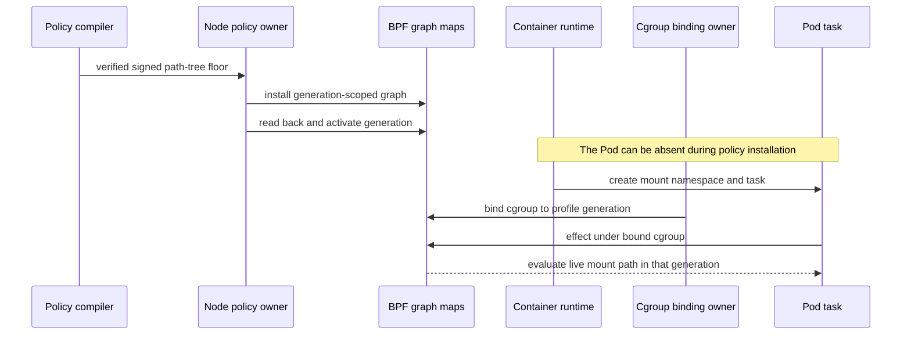
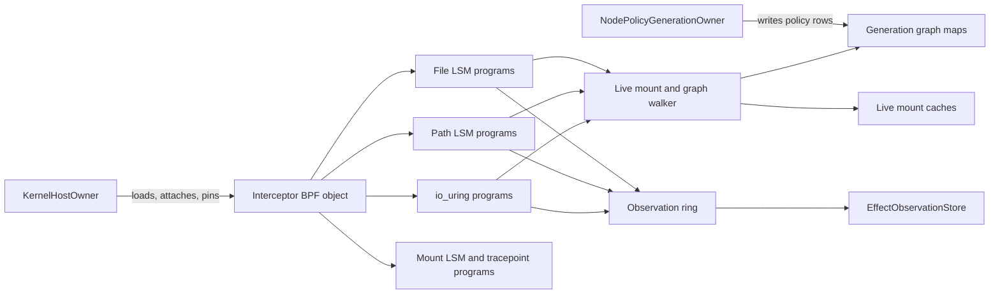

# Signed Path-Tree Denial Implementation Review

This guide covers implementation commit
`d38248f70c9f3180fbcd2ecd54ea43fe6304d23b`. The commit is based on the
policy definition in `4875862804b64c003927b60e634b7989dd3897f7`.

The design source is the
[validated architecture](./policy-and-protection-algorithm-architecture-readable.md#path-selector-resolution-path-tree-floors-and-exact-object-authority).
The external algorithm source is the
[BpfJailer LPC 2025 presentation](<../../../BpfJailer LPC 2025.pdf>). Its
SHA-256 is
`81dca098d1ed96e19fd89b48b78be63c504f9f52f9f25b662e4a94c14a5209f6`.
Slides 16 through 21 describe the Meta mount and dentry walk.
Berkeley Packet Filter (BPF) programs run the kernel checks. Linux Security
Module (LSM) hooks call the BPF programs before the covered effects.

## Review route

Read the implementation in this order:

1. Read [`PathTreeDenyFloorV1`](../../../crates/mithril-control/src/policy/source.rs#L436)
   and
   [`validate_path_tree_deny_floors`](../../../crates/mithril-control/src/policy/compiler.rs#L1919).
   These sources define and validate the signed restriction.
2. Read
   [`CanonicalPathGraphV1::compile_with_path_tree_denies`](../../../crates/mithril-control/src/policy/path.rs#L312)
   and
   [`insert_path_tree_deny`](../../../crates/mithril-control/src/policy/path.rs#L552).
   These functions create the recursive graph terminal and operation mask.
3. Read [`lower_path_tables`](../../../crates/mithril-node/src/policy.rs#L3329).
   This function compiles static policy components to generation-scoped map
   rows. It does not inspect a filesystem or mount namespace for a path-tree
   floor.
4. Read [`LoweredGeneration::install`](../../../crates/mithril-node/src/policy.rs#L1641).
   This function installs and reads back the graph before generation
   activation.
5. Read
   [`canonical_mount_cache_build_step`](../../../bpf/erebor-interceptor/programs/identity_path.bpf.h#L304),
   [`canonical_mount_path_walk_step`](../../../bpf/erebor-interceptor/programs/identity_path.bpf.h#L522),
   and
   [`collect_mount_components`](../../../bpf/erebor-interceptor/programs/identity_path.bpf.h#L608).
   These functions inspect the task's live mount namespace, select the oldest
   mount, and walk from the leaf to the namespace root.
6. Read
   [`canonical_path_match_step`](../../../bpf/erebor-interceptor/programs/identity_path.bpf.h#L741)
   and
   [`canonical_path_candidate`](../../../bpf/erebor-interceptor/programs/identity_path.bpf.h#L810).
   These functions reverse the collected components and traverse only the
   task's active profile generation.
7. Read
   [`resolved_identity_effect_gate`](../../../bpf/erebor-interceptor/programs/identity_effects.bpf.h#L292).
   The path-tree decision occurs before exact-object lookup.
8. Read
   [`path_tree_deny_uses_the_live_bpf_mount_path_before_object_lookup`](../../../crates/erebor-interceptor/src/bundled.rs#L500)
   and
   [`bpf_path_walks_use_meta_component_and_namespace_budgets`](../../../crates/erebor-interceptor/src/bundled.rs#L1217).
   These tests check decision order and the compiled BPF loop limits.
9. Read [`EffectTestRunner::physical_probe`](../../../crates/mithril-e2e/src/effect.rs#L705).
   This test checks the physical result at the 255-component limit.

## Implemented result

The signed policy accepts a recursive path-tree `DENY` floor for qualified
`FILE` operations. The compiler rejects a positive disposition, an exception,
a nonrecursive rule, an invalid canonical path, an empty operation set, and an
unsupported effect family.

Rust compiles only the static signed policy graph. It can do this before a Pod,
container, mount namespace, target directory, or target child exists. Every
exact transition, wildcard transition, and terminal key contains
`profile_generation_ref_id`.

The workload binding selects the active generation for a cgroup. At effect
time, BPF reads that generation from the task's process state. BPF then:

1. Reads the supplied live `struct path`.
2. Finds the task's live `mnt_namespace` and namespace root.
3. Enumerates the namespace mount red-black tree.
4. Selects the lowest `mnt_id_unique` for each repeated root dentry.
5. Walks `d_parent` from the leaf to a mount root.
6. Crosses to the selected mount's `mnt_parent` and `mnt_mountpoint`.
7. Stops only at the live namespace root.
8. Reverses the leaf-first component vector.
9. Traverses graph rows for the active profile generation from state zero.
10. Applies the terminal operation mask before exact-object lookup.

The walk does not test the inode type. A file and a directory both use their
path. Name operations can deny a negative dentry before an inode exists.

## Validation against Meta's algorithm

The implementation follows the algorithm described in the presentation. It
does not copy Meta source code because the presentation does not publish that
source.

| Meta property | Implementation | Review source |
| --- | --- | --- |
| Walk from the target leaf toward the head. | BPF records `d_name` and follows `d_parent` until the current mount root. | [`canonical_mount_path_walk_step`](../../../bpf/erebor-interceptor/programs/identity_path.bpf.h#L522) |
| Resolve repeated mount roots through the oldest mount. | BPF scans `mnt_namespace.mounts` and retains the lowest nonzero `mnt_id_unique` for each root dentry. | [`canonical_mount_cache_build_step`](../../../bpf/erebor-interceptor/programs/identity_path.bpf.h#L304) |
| Continue across mount boundaries. | At a mount root, BPF uses the selected mount's `mnt_parent` and `mnt_mountpoint`. | [`canonical_mount_path_walk_step`](../../../bpf/erebor-interceptor/programs/identity_path.bpf.h#L522) |
| Stop at the task's namespace root. | The walk succeeds only after the selected mount equals `mnt_namespace.root`. | [`collect_mount_components`](../../../bpf/erebor-interceptor/programs/identity_path.bpf.h#L608) |
| Reverse leaf-first components before graph lookup. | The graph callback reads `component_count - offset - 1`. | [`canonical_path_match_step`](../../../bpf/erebor-interceptor/programs/identity_path.bpf.h#L741) |
| Use a bounded component graph. | Rust determinizes the static graph. BPF holds one state ID and performs one exact lookup with one wildcard fallback per component. | [`CanonicalPathGraphV1::determinize`](../../../crates/mithril-control/src/policy/path.rs#L388), [`canonical_path_match_step`](../../../bpf/erebor-interceptor/programs/identity_path.bpf.h#L741) |
| Reject a topology race. | BPF checks the global mutation epoch, pending count, namespace event, and mount count before and after cache construction and path collection. | [`ensure_canonical_mount_cache`](../../../bpf/erebor-interceptor/programs/identity_path.bpf.h#L387), [`collect_mount_components`](../../../bpf/erebor-interceptor/programs/identity_path.bpf.h#L608) |

The old split did not meet this table. Rust previously resolved the namespace
mount chain and installed a graph prefix. BPF walked only from the leaf to the
current mount root. Commit `6a0f389` removes that path-tree dependency. The
path-tree branch does not read `canonical_mount_roots` or require a clean Rust
mount snapshot.

## Kubernetes and profile binding

The implemented data boundary supports this order:



Different cgroups can select different profile generations. BPF places the
active generation in every graph key. It cannot traverse another profile's
rows by state ID alone. The
[`path_graph_rows_are_scoped_to_the_bound_generation`](../../../crates/mithril-node/src/policy.rs#L4163)
test checks that equal policy paths in two generations produce disjoint keys.

The repository has signed artifact, CRI inventory, cgroup binding, and policy
installation owners. This implementation does not add a Kubernetes custom
resource definition, admission webhook, or controller. Those components must
translate a selected Pod policy to the existing signed generation and cgroup
binding boundary.

## Owners

| Owner | Input and state | Output and authority |
| --- | --- | --- |
| `PolicyCompiler` | Signed `PathTreeDenyFloorV1`. | Rejects invalid positive or ambiguous rules and produces a verified artifact. It creates no kernel state. |
| `CanonicalPathGraphV1` | Canonical policy components and operation IDs. | Produces deterministic static transitions and terminal masks. It does not inspect live mounts. |
| `NodePolicyGenerationOwner` | Verified artifact and profile generation. | Installs, reads back, activates, and retires generation-scoped policy rows. It does not enter a workload mount namespace for path-tree lowering. |
| Workload binding owner | Exact cgroup and selected profile generation. | Installs the generation that new tasks inherit through the existing identity path. |
| `KernelHostOwner` | One production BPF object, maps, links, pin root, and exclusive lease. | Loads, attaches, pins, recovers, and shuts down the single Interceptor owner. |
| BPF path resolver | Per-CPU scratch and the task's live kernel path and mount namespace. | Builds the oldest-mount cache, walks the live path, traverses the selected graph, and returns the physical decision. |
| `EffectObservationStore` | Fixed BPF observation records. | Copies and names evidence. It does not authorize an effect. |
| `EffectTestRunner` | Disposable files, directories, namespaces, cgroups, and policy artifacts. | Checks syscall results, filesystem postconditions, evidence, and cleanup in the repository VM. |

## Runtime decision flow

```mermaid
sequenceDiagram
    participant T as Managed task
    participant L as BPF LSM hook
    participant M as Live mount tree
    participant C as Oldest-mount cache
    participant G as Generation graph
    participant E as Exact-object policy
    participant R as Observation ring

    T->>L: file or name effect
    L->>L: verify task, cgroup binding, and active generation
    L->>M: read namespace root, event, mount count, and mount tree
    M->>C: select the lowest mount ID for each root dentry
    L->>M: walk leaf to namespace root across selected mounts
    L->>L: recheck namespace event and global mutation epoch
    L->>G: reverse components; traverse active generation from state zero
    G-->>L: terminal operation mask
    alt path-tree operation is denied
        L->>R: PATH_TREE_POLICY_DENY
        L-->>T: negative errno before effect
    else no path-tree denial
        L->>E: continue through exact-object policy
        E-->>L: exact decision or fail closed
    end
```

A mutation that races cache construction or path collection changes the
global epoch, pending count, namespace event, or mount count. The resolver
returns unresolved. It never uses a partial component vector or a partial
mount cache as authority.

The cache key contains the mount-namespace address, namespace-root unique
mount ID, namespace event, and root-dentry address. A mount event therefore
selects a new cache generation. The selected cache value is revalidated
against the live namespace, root dentry, and unique mount ID before use.

## Mount-attack behavior

The path-tree decision uses the live mount tree on every effect. A bind mount
cannot reuse a userspace graph prefix. BPF selects the oldest mount for the
root dentry and continues to the live namespace root.

Mount mutation hooks still publish global and represented-namespace state for
the separate exact-object reconciliation path. BPF counts a mutation when the
task is managed or its current mount namespace already has a represented view.
This rule prevents construction of a not-yet-bound Pod namespace from
invalidating an unrelated Pod's exact-object policy.

`open_tree`, `fsconfig`, `fsmount`, and `mount_setattr` use one represented
namespace ambiguity epoch. Exact-object decisions remain closed until
reconciliation when those operations occur in a represented namespace. This
epoch does not gate the live path-tree traversal.

## BPF programs



The file programs use the `lsm/file_open` and `lsm/file_permission` sections
at
[`identity_effects.bpf.h`](../../../bpf/erebor-interceptor/programs/identity_effects.bpf.h#L839).
They receive a live `struct file`, preserve a prior LSM denial, derive the
operation, and call the shared effect gate. A failed identity, path, mount, or
graph lookup returns the configured negative errno. A path-tree match returns
that errno before the file effect completes.

The name programs use `lsm/path_unlink` through `lsm/path_rename` at
[`identity_effects.bpf.h`](../../../bpf/erebor-interceptor/programs/identity_effects.bpf.h#L993).
They receive a directory path and dentry. The path can name a file, a
directory, or a negative dentry. Link and rename check the source before the
destination. A nonzero return stops the kernel operation.

The mount programs use `lsm/sb_kern_mount`, `lsm/sb_mount`,
`lsm/sb_umount`, `lsm/sb_pivotroot`, and `lsm/move_mount` at
[`identity_effects.bpf.h`](../../../bpf/erebor-interceptor/programs/identity_effects.bpf.h#L1099).
The `raw_syscalls/sys_exit` program clears the pending mutation count. The
special mount syscall tracepoints update the represented ambiguity epoch.
These programs update stability and exact-object reconciliation state. They
do not compile or change a path-tree terminal.

The path resolver uses `bpf_get_current_task_btf` to find the current task,
`BPF_CORE_READ_INTO` for kernel fields, `bpf_loop` for bounded mount and path
walks, `bpf_map_lookup_elem` for cache and graph reads, and
`bpf_probe_read_kernel` for component bytes. A failed helper result makes the
candidate unresolved. The resolver does not truncate and continue.

The io_uring effect gate uses the retained submitter generation and the same
live path resolver. Missing request or actor state fails closed. The io_uring
lifecycle and its broader limits remain separate from this path-tree slice.

### Verifier shape

All logic remains in the one production Interceptor BPF object. The
implementation adds no tail-call subsystem, second loader, second policy
engine, or userspace namespace helper.

One per-CPU `identity_scratch_v1` value owns cache-build, path-walk, component,
and graph-match state. `bpf_loop` callbacks receive only a pointer to this
state. The checked object at commit `d38248f` has these maximum stack offsets:

| Function | Stack bytes |
| --- | ---: |
| `resolved_identity_effect_gate` | 264 |
| `canonical_mount_cache_build_step` | 16 |
| `canonical_mount_path_walk_step` | 8 |
| `canonical_path_match_step` | 0 |

The deepest measured function leaves 248 bytes below the Linux 512-byte BPF
stack limit. The production object also loaded in the qualified VM.

The mount enumeration loop accepts at most 4,096 mounts. The red-black-tree
scan stack accepts 255 entries. A 4,096-node Linux red-black tree has a maximum
height below 25, so the scan stack does not reduce the mount-count limit. The
path vector accepts 255 components of at most 255 bytes each. The combined
live path walk accepts 4,351 callbacks. This count covers 4,096 mount steps and
255 dentry steps. A larger or malformed input fails closed. The resolver does
not truncate the input to a valid path.

The scan stack and component vector each use one extra array slot for the
verifier-safe `& 0xff` index. The semantic limit remains 255. The source has no
separate 64-entry mount-depth constant and no duplicate path-walk limit.

## Map lifecycle

| Map | Key and value ABI | Userspace writer | BPF writer | Readers | Lifetime |
| --- | --- | --- | --- | --- | --- |
| `path_graph_exact_transitions` | `PathGraphTransitionKeyV1` to `PathGraphTransitionV1`. | Node generation install. | None. | BPF graph matcher. | Pinned. Immutable until generation retirement. |
| `path_graph_wildcard_transitions` | `PathGraphStateKeyV1` to `PathGraphTransitionV1`. | Node generation install. | None. | BPF graph matcher. | Pinned. Immutable until generation retirement. |
| `path_graph_terminals` | `PathGraphStateKeyV1` to `PathGraphTerminalV1`. | Node generation install. | None. | BPF effect and io_uring gates. | Pinned. Immutable until generation retirement. |
| `canonical_mount_cache` | Private live namespace, event, root dentry key to locked selected mount address and unique ID. | None. | BPF cache builder. | BPF path walk. | Pinned. Bounded at 65,536 rows. A missing or full map fails closed. |
| `canonical_mount_cache_states` | Private live namespace and event key to build state. | None. | BPF cache builder. | BPF resolver. | Pinned least-recently-used map. Bounded at 4,096 rows. |
| `identity_scratch` | Per-CPU zero `u32` to private `identity_scratch_v1`. | None. | BPF effect and path programs. | BPF effect and path programs. | Pinned with the object. One CPU owns one active scratch value. |
| `mount_global_mutation_epoch` and `mount_global_pending_mutations` | Native-endian zero `u32` to native-endian `u64`. | Node initializes rows. | BPF mount hooks. | BPF stability checks and node reconciliation. | Pinned for the pin-root lifetime. |
| `mount_global_ambiguous_epoch` | Native-endian zero `u32` to native-endian `u64`. | Node initializes the row. | BPF special mount syscall hooks. | BPF exact-object branch. | Pinned for the pin-root lifetime. It does not select a path-tree graph. |
| `exact_mount_events` | Private represented namespace key to transition, event, and ambiguity epoch. | None. | BPF exact-object branch. | BPF exact-object branch. | Pinned and bounded at 4,096 rows. It does not gate a matching path-tree denial. |
| `effect_observations` | Ring buffer of `EffectObservationV1`. | None. | BPF effect programs. | `EffectObservationReader` and `EffectObservationStore`. | Pinned with the object. Ring loss cannot change enforcement. |

The graph maps and BPF caches are declared in
[`identity_maps.h`](../../../bpf/erebor-interceptor/programs/identity_maps.h#L564).
Generation retirement deletes exact transitions, wildcard transitions, and
terminals for the retired generation. The
[`generation_retirement_waits_for_async_io_authority`](../../../crates/mithril-node/src/policy.rs#L4071)
test checks these three cleanup targets. The node does not delete policy rows
while a task or asynchronous request retains the generation.

The mount caches are policy-neutral live-kernel caches. Their keys include
kernel namespace and mount-generation identity. An obsolete row cannot match
a new namespace event. The hash map does not delete a row when an event
changes. Obsolete rows remain until pin-root shutdown or map replacement. A
full cache fails closed. Mount-cache churn and saturation remain an explicit
qualification limit.

A Berkeley Packet Filter filesystem (bpffs) pin keeps a map or link alive
after the loader process exits. Generation retirement removes only the
generation-scoped policy rows. Qualification shutdown calls
[`KernelHostOwner::shutdown`](../../../crates/erebor-interceptor/src/host.rs#L1380)
and removes harness-owned pins. Production recovery reuses the expected pins.
A process exit does not remove a pinned map or link.

## Recovery and shutdown

The loader can recover the same pinned object only after it validates the live
manifest and map identity. The node then reads the active generation and its
rows. It does not rebuild a path-tree graph from a live mount namespace.

Mount caches can survive loader recovery because they are keyed by live
namespace identity and event. A failed cache validation causes a new build or
an unresolved decision. It does not authorize from a stale address alone.

[`retire_generation_rows`](../../../crates/mithril-node/src/policy.rs#L2656)
removes the retired generation's exact transitions, wildcard transitions, and
terminals after the generation has no retained authority. Cache rows are not
generation rows. They remain policy-neutral and bounded by map capacity.

## ABI boundary

[`PathGraphTransitionKeyV1`](../../../crates/erebor-interceptor-abi/src/abi/path.rs#L88)
contains the profile generation, current state, component bytes, and explicit
padding. [`PathGraphStateKeyV1`](../../../crates/erebor-interceptor-abi/src/abi/path.rs#L99)
contains the profile generation and state. [`PathGraphTerminalV1`](../../../crates/erebor-interceptor-abi/src/abi/path.rs#L118)
contains the exact-object candidate fields and the path-tree operation mask.

These Rust types use `repr(C)` and native byte order because userspace and BPF
share one kernel host. cbindgen produces the checked C declarations. The BPF
object includes that checked header.

The graph structs contain only all-bit-valid integer and byte-array fields.
Rust uses `FromBytes::read_from_bytes` for exact-size test and readback values.
That method rejects a wrong byte length. ABI values with validity-restricted
enums use `TryFromBytes::try_read_from_bytes`; that method rejects a wrong
length and an invalid enum value. The node converts a rejected value to its
typed identity or policy error before activation.

## Tests and physical evidence

| Proof | Result |
| --- | --- |
| `path_tree_rules_are_signed_denial_floors_only` | Checks the signed restriction boundary and rejects positive or ambiguous forms. |
| `recursive_path_tree_deny_covers_the_root_and_descendants` | Checks the root, descendants, and outside path in the deterministic graph. |
| `canonical_path_accepts_meta_depth_and_rejects_one_more` | Accepts 255 canonical components and rejects 256 components. |
| `path_tree_floor_lowers_without_a_live_mount_view` | Checks that Rust lowers the floor with no exact object, mount namespace, or mount root row. |
| `path_graph_rows_are_scoped_to_the_bound_generation` | Checks that two generations have disjoint graph keys. |
| `exact_file_lookup_uses_the_bpf_selected_oldest_mount` | Checks BPF namespace filtering, minimum unique mount ID, cross-mount walk, and absence of the userspace mount-root map in path collection. |
| `path_tree_deny_uses_the_live_bpf_mount_path_before_object_lookup` | Checks leaf-to-head collection, reversal, state-zero traversal, and decision order. |
| `bpf_path_walks_use_meta_component_and_namespace_budgets` | Inspects the compiled object for the 255-component and 4,351-callback `bpf_loop` limits. It also checks the 255-entry scan-stack source bound. |
| `generation_retirement_waits_for_async_io_authority` | Checks retained asynchronous authority and removal of all three generation-scoped path maps. |
| Cross-architecture compile | The production object compiles with `-Wall -Werror` against checked x86, arm64, arm, and RISC-V kernel headers. This is not non-x86 physical proof. |
| Repository Rust CI | `bash .github/scripts/verify-rust-ci.sh` passed for the implementation source. It ran formatting, workspace check, warnings-as-errors clippy, and the full workspace tests. |
| Disposable VM | The full kernel, identity, observation, and protect harness passed at exact commit `d38248f`. |

The exact-commit VM evidence directory is
`/tmp/mithril-path-tree-d38248f`. The production BPF object SHA-256 is
`edf9d9941e8bd3bbc8ec0a04f32e5fec1adc1571b8b1b508b8c4ab8a994d6943`.
The platform was x86_64 Ubuntu with Linux `6.8.0-137-generic` and BPF in the
active LSM order.

The local-enforcement artifact SHA-256 is
`fa91e8f1a3ee179285ec0d6ad7f592cc5a612d1d030d3f70ffefd9cec6898a3b`.
It records these true results:

- `path_tree_meta_depth_denied`
- `path_tree_future_namespace_denied`
- `path_tree_preexisting_child_denied`
- `path_tree_later_child_denied`
- `path_tree_replacement_child_denied`
- `path_tree_outside_control_allowed`
- `path_tree_mount_attack_failed_closed`
- `mount_propagation_reached_peer`
- `mount_propagation_all_views_failed_closed`
- `mount_setattr_global_invalidation`
- `mount_setattr_reconciled`
- `cgroup_removed`
- `fixture_root_removed`

The future-namespace case creates its mount namespace after policy activation,
confirms that its namespace inode was absent from the activation input, moves
the task into the managed cgroup, and requires `PATH_TREE_POLICY_DENY` for a
pre-existing protected child.

## Limits and nonclaims

- The physical result is x86_64 only.
- The component and mount bounds are verifier limits. They are not claims that
  Linux cannot contain larger paths or mount namespaces. An overflow denies.
- The BPF live walk covers the path-tree restriction. Exact-object,
  persistent-file, virtual-memory, and delegated-I/O authority retain their
  separate rules and limits.
- The implementation does not add a Kubernetes custom resource definition,
  admission webhook, policy controller, or multi-node distribution path.
- The VM proves future namespace binding and multiple generation-scoped map
  keys. It does not prove a complete Kubernetes admission race or two physical
  Pods with different custom-resource policies.
- Automount, referral, idmapped-mount, overlay copy-up, non-x86 runtime, and
  mount-cache saturation need separate physical qualification.
- The broader local-enforcement phase remains **Not done**. This guide claims
  only the bounded signed recursive path-tree denial slice.
