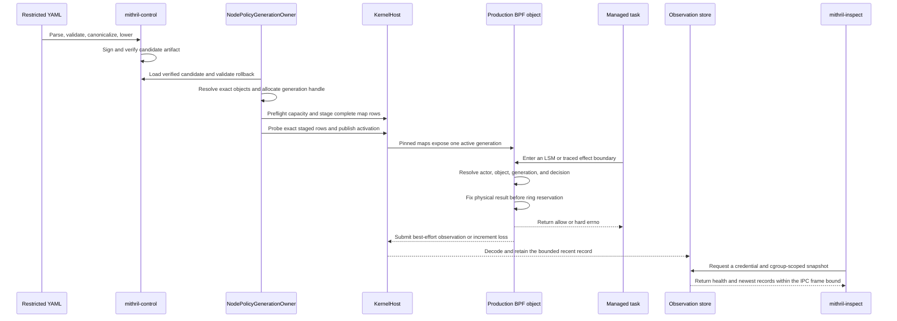
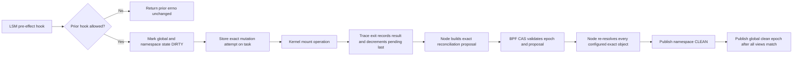

# Phase 3 Implementation Review Guide

Status: Source-grounded review guide checked against the current source on
2026-08-19.

Phase: [Effect Observation And Profile Simulation](./phase-3-effect-observation-and-profile-simulation.md)  
Architecture: [validated readable architecture](./policy-and-protection-algorithm-architecture-readable.md)  
Closure: [checked closure matrix](./phase-3-closure-matrix.md)  
Manual proof: [Phase 3 runbook](./manual-testing/phase-3-manual-acceptance.md)

## Review Claim

This implementation compiles and verifies a signed policy candidate, installs
one complete generation, resolves the qualified local objects, simulates its
decisions, and reports real kernel effects. In `OBSERVE` mode, a simulatable
policy denial becomes `WOULD_DENY`; the kernel effect remains allowed. Missing
identity, an unsupported object, ambiguous topology, a prior LSM denial, and a
required hard restriction do not become allow.

The review must not infer active policy prevention from this phase. Phase 4
owns active signed local denial. Phase 5 owns destination-aware network
enforcement. The [closure matrix](./phase-3-closure-matrix.md) states the exact
limit and later owner for every required future fixture.

## Recommended Reading Order

1. Read the [closure matrix](./phase-3-closure-matrix.md). It defines what is
   proved, what is only simulated, and what remains unsupported.
2. Read the closed policy input and validation path in
   [`source.rs`](../../../crates/mithril-control/src/policy/source.rs) and
   [`validation`](../../../crates/mithril-control/src/policy/validation).
3. Follow deterministic lowering in
   [`compiler.rs`](../../../crates/mithril-control/src/policy/compiler.rs),
   [`expansion.rs`](../../../crates/mithril-control/src/policy/compiler/expansion.rs),
   and [`path.rs`](../../../crates/mithril-control/src/policy/path.rs).
4. Review artifact signing, verification, and rollback in
   [`signature.rs`](../../../crates/mithril-control/src/policy/signature.rs),
   [`artifact.rs`](../../../crates/mithril-control/src/policy/artifact.rs), and
   [`rollback.rs`](../../../crates/mithril-control/src/policy/rollback.rs).
5. Read the generation transaction from
   [`NodePolicyGenerationOwner::install`](../../../crates/mithril-node/src/policy.rs)
   through capacity preflight, row installation, readback probes, activation,
   and retirement.
6. Read exact object and mount-view ownership in
   [`exact_object.rs`](../../../crates/mithril-node/src/exact_object.rs) and
   [`reconcile_mount_views`](../../../crates/mithril-node/src/policy.rs).
7. Compare the Rust ABI in
   [`erebor-interceptor-abi`](../../../crates/erebor-interceptor-abi/src/abi.rs#L178)
   with the C ABI in
   [`erebor_interceptor_abi.h`](../../../bpf/erebor-interceptor/include/erebor_interceptor_abi.h#L1046).
8. Review the single production BPF object. Start at
   [`identity.bpf.c`](../../../bpf/erebor-interceptor/programs/identity.bpf.c),
   then read the maps in
   [`identity_maps.h`](../../../bpf/erebor-interceptor/programs/identity_maps.h#L360)
   and decision helpers in
   [`identity_effects.bpf.h`](../../../bpf/erebor-interceptor/programs/identity_effects.bpf.h#L39).
9. Follow effect delivery through
   [`KernelHost::effect_observation_reader`](../../../crates/erebor-interceptor/src/host.rs),
   [`Node::run`](../../../crates/mithril-node/src/node.rs#L310),
   [`EffectObservationStore`](../../../crates/mithril-node/src/observation.rs#L16),
   and the bounded local response in
   [`local.rs`](../../../crates/mithril-node/src/local.rs#L185).
10. Finish with the exact matrix test and physical runner in
    [`profile_simulation.rs`](../../../crates/mithril-control/tests/profile_simulation.rs#L97)
    and [`effect.rs`](../../../crates/mithril-e2e/src/effect.rs#L696).

## Ownership Boundaries

| Owner | Owns | Must not own or infer |
| --- | --- | --- |
| `mithril-control::policy` | Closed source parsing, validation, canonical bytes, signature material, deterministic lowering, static decision cells, bounded path graph, rollback proof, and simulation | Kernel attachment, live object resolution, or a physical effect result |
| `mithril-node::NodePolicyGenerationOwner` | Verified candidate loading, anti-rollback state, generation-handle allocation, capacity preflight, map staging, exact readback, binding activation, retirement, live exact-file resolution, and mount reconciliation | BPF program implementation or a second policy decision engine |
| `erebor-interceptor::KernelHost` | One libbpf-rs object owner, lease, pin layout, program and map access, ring-buffer reader, activation probe, and mount reconciliation command | Policy meaning, remote policy, or application integration authority |
| Production BPF object | Current task attribution, exact object construction, map lookup, pre-effect hard decision, prior-LSM preservation, topology mutation ordering, observation emission, and loss counters | Durable evidence, remote decisions, path strings from callers, or userspace fallback authority |
| `mithril-node` observation service | Bounded recent event history, health aggregation, peer-credential and cgroup-scoped read-only IPC, and node-failure propagation when the reader exits | Effect authorization or durable replay |
| `mithril-e2e::EffectTestRunner` | Assertion-bearing privileged fixtures, independent physical oracles, performance samples, saturation, and scoped cleanup | Production policy state or an operator claim beyond its result fields |
| Manual scripts | Real Docker, CRI, and namespace transport checks with owned temporary state | Replacement for Rust assertions or a new runtime owner |

## Policy-To-Effect Data Flow



The trust boundary is the transition from verified userspace rows to exact BPF
maps. The node reads back staged rows and uses the activation probe before it
publishes the generation. The BPF object does not parse source policy or accept
a caller-provided path as object identity.

## Compiler And Candidate Review

### Closed input

[`PolicyDocumentV1`](../../../crates/mithril-control/src/policy/source.rs)
uses denied unknown fields and typed registries. Validation resolves every
reference and checks all declared bounds before lowering. Review duplicate IDs,
conflicting exact cells, wildcard expansion, exception bounds, and default
behavior together; a valid individual row is not enough if the combined table
is ambiguous.

### Deterministic output

[`PolicyCompiler`](../../../crates/mithril-control/src/policy/compiler.rs#L78)
canonicalizes the source, computes its digest, expands finite selectors, builds
typed effect rows, and determinizes the path graph. Canonical CBOR is owned by
[`canonical.rs`](../../../crates/mithril-control/src/policy/canonical.rs).
The same policy must produce the same bytes and digest.

The path compiler is bounded at 4,096 states and 64 components. It emits exact
and wildcard transitions plus terminals. The production BPF walker consumes
these rows; there is no userspace-only path decision that can authorize a
kernel effect.

### Signature and rollback

[`ProfileCandidateArtifactV1::verify`](../../../crates/mithril-control/src/policy/signature.rs#L152)
recompiles the embedded source and compares its signed header, compiled digest,
platform scope, validity interval, and canonical bytes. The node then validates
the candidate against its persistent
[`AntiRollbackStore`](../../../crates/mithril-control/src/policy/rollback.rs).
A rollback needs the exact signed older target. A replay, same-generation
replacement, corrupt proof, or platform mismatch cannot stage a new active
generation.

### Simulation

[`simulate`](../../../crates/mithril-control/src/policy/simulation.rs#L65)
uses the compiled decision set. The 51-case fixture supplies the actor, object,
family, operation, and expected result. The test requires all 39 IDs named by
the phase plan. `STATE-FORK-IPC-002` is part of that compile-time required set;
removing it fails the test.

Simulation proves deterministic classification. It does not prove that the
kernel can resolve the same object or physically enforce the result. Use the
closure matrix before assigning a physical claim to a simulated row.

## Generation Transaction And Recovery

[`NodePolicyGenerationOwner::install`](../../../crates/mithril-node/src/policy.rs)
is the sole generation transaction owner:

1. Load and verify one candidate per profile.
2. Load persistent anti-rollback state and reconcile pending activations.
3. Lower all bindings that share a generation handle and reject inconsistent
   merged rows.
4. Reserve stable kernel generation handles.
5. Preflight every affected map before the first staged row is written.
6. Acquire or retain each exact mount namespace view and validate its live
   identity.
7. Install the global mount barrier.
8. Install a complete generation and probe each staged row through the BPF
   activation probe.
9. Publish exact binding targets and the active profile generation.
10. Commit rollback state, restore interrupted activation if required, and
    retire only generations without retained task or asynchronous authority.

Review the failure path at each numbered step. A failure must leave the old
complete generation authoritative. Recovery must verify an identical installed
generation in place; it must not downgrade it to `PREPARING` or accept a
partially matching map set.

`PolicyGenerationModeV1::Observe` and `PolicyGenerationModeV1::Protect` use the
same rows. The mode changes only how a valid policy denial is applied. Phase 3
qualifies `Observe`; a checked-in `Protect` path is not a Phase 3 prevention
claim.

## Exact File And Mount-View Review

[`ExactFileObjectView`](../../../crates/mithril-node/src/exact_object.rs)
retains the target mount namespace and root handles. It parses mountinfo as
bytes, selects the lowest unique mount ID for the represented object, and
walks the selected parent and mountpoint chain to the namespace root. It never
uses a host pathname as an authorization substitute.

The exact kernel key is
`mount_namespace_inode + mount_id + filesystem_device + inode + inode_generation`.
The binding also carries the profile generation, exact object key, object
class, and mount snapshot digest.

Topology mutation uses this order:



While the view is `DIRTY`, pending, stale, incomplete, or changed during the
bounded walk, a strict object result stays unresolved or hard-safe. The node
refuses reconciliation when mount, device, inode, generation, root, or snapshot
identity differs. The bind-alias proof validates the oldest represented mount.
The hard-link proof validates that a path result is not cached and transferred
to another spelling of the same inode.

## BPF Program Relationships

The build produces one CO-RE object from
[`identity.bpf.c`](../../../bpf/erebor-interceptor/programs/identity.bpf.c).
The object includes these cooperating program families:

| Program family | Primary source | Role in this phase |
| --- | --- | --- |
| task lifecycle and identity | [`identity_lifecycle.bpf.h`](../../../bpf/erebor-interceptor/programs/identity_lifecycle.bpf.h) and [`identity_exit.bpf.h`](../../../bpf/erebor-interceptor/programs/identity_exit.bpf.h) | Create, carry, reconcile, and retire exact task and process authority |
| exec | [`identity_exec.bpf.h`](../../../bpf/erebor-interceptor/programs/identity_exec.bpf.h) | Keep syscall, LSM, credential-commit, and final exec state distinct |
| file, memory, process, privilege, and mount effects | [`identity_effects.bpf.h`](../../../bpf/erebor-interceptor/programs/identity_effects.bpf.h) and [`identity_device_process.bpf.h`](../../../bpf/erebor-interceptor/programs/identity_device_process.bpf.h) | Build exact candidates, preserve prior errors, apply decisions, track mount mutation, and emit observations |
| IPC and local/network hard safety | [`identity_ipc.bpf.h`](../../../bpf/erebor-interceptor/programs/identity_ipc.bpf.h) | Apply only the narrow represented Unix-stream and IPC rows; retain explicit hard results for unqualified network identity |
| delegated I/O | [`identity_io_uring.bpf.h`](../../../bpf/erebor-interceptor/programs/identity_io_uring.bpf.h) | Retain submitter and ring authority across worker execution and release it at completion |
| bounded canonical path | [`identity_path.bpf.h`](../../../bpf/erebor-interceptor/programs/identity_path.bpf.h) | Walk live mount and dentry state, then consume the compiled component graph |

All families share the maps below. A reviewer must reject a change that adds a
second object, loader, path engine, or policy authority for convenience.

## BPF Map Lifecycle

The map declarations are in
[`identity_maps.h`](../../../bpf/erebor-interceptor/programs/identity_maps.h).
`KernelHost` owns the loaded and pinned object. The node owns policy rows and
generation lifecycle. BPF hooks own kernel-derived task, socket, ring, and
mutation state.

| Maps | Writer | Reader | Lifetime and cleanup |
| --- | --- | --- | --- |
| `profile_generation_descriptors`, `active_profile_generations`, `binding_activation_targets` | Node generation transaction; BPF activation probe validates exact staged rows | All policy-aware hooks | Descriptor starts `PREPARING`, passes readback, becomes `ACTIVE`, then `RETIRING` and `TOMBSTONED`. Rows are removed only after task and async references reach zero. |
| `effect_decisions`, `effect_defaults`, `ipc_relationship_decisions`, `device_effect_decisions`, `process_control_rules` | Node lowers verified signed rows | Effect helpers | Generation-prefixed authority. Capacity is preflighted. Retirement deletes only the exact retired generation rows. |
| `exact_file_objects` | Node resolves a live configured object and stages its exact binding | File and path helpers | Bound to one profile generation and mount snapshot. Reconciliation replaces only a revalidated exact row. No final path-decision cache exists. |
| `mount_security_views`, global and per-view epoch maps, `mount_reconciliation_proposals` | BPF mutation hooks dirty and advance state; node submits a proposal; BPF CAS commits it | Path and exact-object helpers; node reconciliation | Namespace view remains hard-safe until all pending mutations finish and the exact proposal commits. Global clean publication occurs after all represented views match. |
| `canonical_mount_roots`, mount caches, path graph transitions, and terminals | Node stages verified generation rows; BPF maintains bounded cache state | Canonical path walker | Cache rows are generation and topology scoped. A topology change invalidates their authority. No bare inode cache can authorize a path result. |
| `task_effect_attempt_states`, `mount_mutation_attempts` | LSM pre-effect hook | Paired syscall or trace exit | Task storage exists only across one compound or mount attempt. Exit consumes it and records the actual result. |
| `ipc_socket_states` | Socket lifecycle hooks | IPC relationship hooks | Socket-storage lifetime follows the live kernel socket. No descriptor number is authority. |
| `io_uring_ring_states`, `io_uring_request_states`, `io_uring_execution_states`, `profile_generation_async_refs` | io_uring lifecycle programs | Submit, issue, complete, and retirement paths | Request and worker state release on completion. Generation retirement waits for its async reference count. |
| `effect_observations` | BPF effect helper | Single libbpf-rs ring reader | Fixed 4 MiB best-effort transport. Reservation failure increments loss and cannot alter the already fixed physical decision. |
| `effect_observation_health` | BPF per-CPU counters | Node snapshot service | Lives with the loaded object. Userspace aggregates attempted, emitted, lost, unresolved, and decoder-error health. |
| `policy_activation_probe_requests` | `KernelHost` writes one bounded request | Classifier activation probe | One request is read back and executed against the staged map. The host removes it after the probe command. |

Review pin cleanup through the exact configured pin root. Do not approve broad
filesystem cleanup or removal based only on a name prefix. The VM and manual
fixtures use run-scoped roots and verify that their links, maps, lease, cgroup,
and files are absent after each run.

## Decision And Observation Semantics

[`apply_effect_decision`](../../../bpf/erebor-interceptor/programs/identity_effects.bpf.h#L228)
must be read with the observation helper at the top of the same file:

- A nonzero earlier LSM result is returned unchanged.
- Unsupported identity or object state keeps the configured hard result.
- An exact signed deny in `OBSERVE` returns allow and records `WOULD_DENY` with
  an after-pre-effect physical result.
- An exact signed deny in `PROTECT` returns its bounded negative errno. This is
  later-phase behavior.
- The physical result is selected before `bpf_ringbuf_reserve`.
- A ring reservation failure increments `lost`; it cannot change the return
  value.
- Compound wrappers stop after the first nonzero result so a later hook cannot
  erase an earlier denial.

The local observation service is read-only. It authenticates the peer by Unix
credentials and the configured cgroup scope. Its recent history is bounded at
1,024 records. If the encoded snapshot exceeds the 64 KiB IPC frame,
[`bounded_observation_response`](../../../crates/mithril-node/src/local.rs#L231)
drops the oldest half until the newest events and health fit. It never turns a
transport truncation into a physical-effect claim.

The ring reader retries only an interrupted libbpf poll. Every other poll error
remains fatal. [`Node::run`](../../../crates/mithril-node/src/node.rs#L310)
treats unexpected reader exit as node failure. This keeps a silent observation
reader death from appearing healthy.

## ABI Review

The Rust/C boundary includes, at minimum:

- `EffectDecisionKeyV1` / `effect_decision_key_v1`;
- `PhysicalDecisionV1` / `physical_decision_v1`;
- `ProfileGenerationDescriptorV1` / `profile_generation_descriptor_v1`;
- `ExactFileObjectKeyV1` / `exact_file_object_key_v1`;
- `ExactObjectBindingV1` / `exact_object_binding_v1`;
- `MountSecurityViewStateV1` / `mount_security_view_state_v1`;
- `EffectObservationV1` / `effect_observation_v1`; and
- `EffectObservationHealthV1` / `effect_observation_health_v1`.

Rust definitions use C layout and byte-safe conversion traits. The BPF source
has `_Static_assert` size checks near the top of
[`identity.bpf.c`](../../../bpf/erebor-interceptor/programs/identity.bpf.c#L18).
The build generates architecture-specific `vmlinux.h` inputs and checks the
production object for x86, arm64, arm, and riscv. These are compile checks, not
non-x86 physical qualification.

For any ABI change, review both definitions, size and offset assertions, map
key serialization, endianness, zero initialization, versioning, and old pin
recovery. A Rust-only or C-only edit is incomplete.

## Test And Evidence Route

The tests execute parser, owner, ABI, compiled-object, lifecycle, and physical
behavior. They do not inspect Rust, C, header, workflow, or shell source text
for selected strings.

Run focused tests first:

```sh
cargo test -p mithril-control --test profile_simulation
cargo test -p erebor-interceptor --lib --all-features
cargo test -p mithril-node --lib --all-features
cargo test -p mithril-e2e --all-targets --all-features
```

Important focused checks include:

- matrix membership, duplicate rejection, and exact simulation in
  [`profile_simulation.rs`](../../../crates/mithril-control/tests/profile_simulation.rs#L97);
- oldest-mount selection and byte-preserving mount parsing in
  [`exact_object.rs`](../../../crates/mithril-node/src/exact_object.rs#L782);
- staged generation, activation, retirement, map capacity, and global mount
  clean-epoch checks in
  [`policy.rs`](../../../crates/mithril-node/src/policy.rs);
- production-source structural assertions in
  [`bundled.rs`](../../../crates/erebor-interceptor/src/bundled.rs);
- interrupted ring-poll recovery in
  [`host.rs`](../../../crates/erebor-interceptor/src/host.rs);
- newest-event retention within the IPC frame in
  [`local.rs`](../../../crates/mithril-node/src/local.rs#L369); and
- the assertion-bearing physical cases in
  [`EffectTestRunner`](../../../crates/mithril-e2e/src/effect.rs#L696).

Then run the repository gate:

```sh
bash .github/scripts/verify-rust-ci.sh
```

Physical proof needs a BPF-LSM host with runtime BTF, cgroup v2, bpffs, and
unique mount IDs. The self-cleaning Rust command is in the
[manual runbook](./manual-testing/phase-3-manual-acceptance.md#automated-companion).
Use the Docker, CRI, or namespace scripts only for the matching real runtime.
Each physical assertion needs an independent syscall or object oracle and a
legitimate control. An event alone is not proof that the effect completed or
was denied.

The final physical source state and evidence hashes are in the
[closure matrix](./phase-3-closure-matrix.md#physical-closure-record). The
record proves only its named fields. It does not convert false or absent result
fields into support.

## Reviewer Checklist

- [ ] The source parser still rejects unknown, duplicate, and conflicting
      input.
- [ ] Canonical bytes, signatures, platform scope, validity, and rollback are
      checked before lowering.
- [ ] Capacity is checked before the first generation row is staged.
- [ ] Every staged row has exact readback or activation-probe proof before
      publication.
- [ ] Recovery preserves the old complete generation on every failure.
- [ ] The BPF hook resolves current task and object state; it does not trust a
      caller path or descriptor number.
- [ ] A mount change marks all represented authority dirty before the effect.
- [ ] Reconciliation validates the same epoch, namespace, mount, device,
      inode, generation, and snapshot.
- [ ] Prior LSM and hard-safety results survive observe mode.
- [ ] The physical result is fixed before observation transport is attempted.
- [ ] Ring loss, an interrupted poll, IPC frame truncation, and reader exit
      have explicit and tested behavior.
- [ ] Map retirement waits for task and asynchronous references.
- [ ] Rust and C ABI changes are paired and checked on all compiled
      architectures.
- [ ] Physical evidence has an independent oracle, legitimate control, exact
      source state, platform manifest, and scoped cleanup proof.
- [ ] Unsupported and later-phase mechanisms remain explicit; no prevention
      or full-coverage claim is inferred from simulation.
