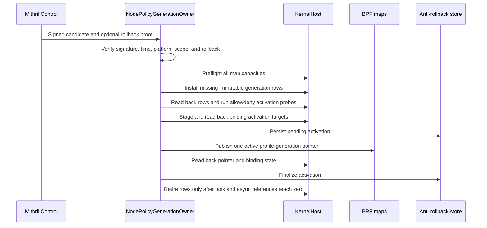
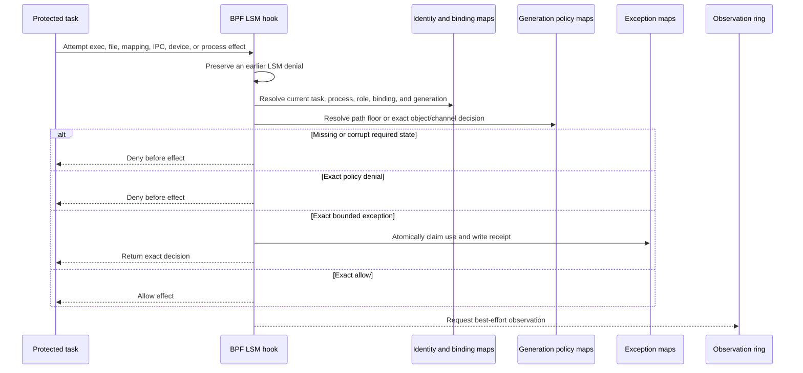

# Phase 4 Implementation Review Guide

Status: Source-grounded review guide for the current checked source. The
current protected probe proves access decisions after successful ordinary
binds, a recursive bind, and `open_tree` plus `move_mount`.

- Phase: [Signed Local Pre-Effect Enforcement](./phase-4-signed-local-pre-effect-enforcement.md)
- Architecture: [validated readable architecture](./policy-and-protection-algorithm-architecture-readable.md)
- Closure: [local fixture matrix](./phase-4-closure-matrix.md)
- Manual proof: [acceptance runbook](./manual-testing/phase-4-manual-acceptance.md)

Berkeley Packet Filter (BPF) programs attach to Linux Security Module (LSM)
hooks for the qualified pre-effect decisions.

## Review Claim

The current x86_64 result records 15 physical `PASS` results and 14 exact
`UNSUPPORTED` results. Fourteen passes are allocated Appendix C fixtures. The
other pass is the plan-owned recursive path-tree denial. The current probe
closes its child-bind gap for the tested mount forms. It requires successful
mounts, completed reconciliation, protected denials, and matching allowed
aliases.

An unsupported row is not an implementation claim. A default hard-close can
prevent an unqualified operation, but it does not supply the missing positive
authority model. Review the exact terminal status and reason for every row in
the [closure matrix](./phase-4-closure-matrix.md).

Do not infer any of these broader claims:

- immutable executable or file-content authority;
- complete Linux memory descriptor (`mm`) or virtual memory area (VMA)
  provenance;
- projected-token rotation and controller binding;
- overlay copy-up or persistent file-instance provenance;
- complete mount-attribute, propagation, or self-protection coverage;
- a stock-runc administrative bootstrap authority;
- arbitrary Unix interprocess communication (IPC), shared-memory, pipe, or
  asynchronous authority;
- per-load, per-store, or byte-taint enforcement after an admitted mapping;
- network, semantic TLS, distributed, provider, detection, or response
  enforcement; or
- physical qualification on a non-x86 platform.

## Recommended Reading Order

1. Read the [phase result](./phase-4-signed-local-pre-effect-enforcement.md#phase-result)
   and [closure decision](./phase-4-closure-matrix.md#closure-decision). Confirm
   the limited claim before you inspect mechanisms.
2. Read the architecture rules for
   [delivery phases](./policy-and-protection-algorithm-architecture-readable.md#35-delivery-phases)
   and
   [surface qualification](./policy-and-protection-algorithm-architecture-readable.md#a137-surface-qualification).
   A missing hook, field, or identity returns to prototype and type closure.
3. Review closed policy input and deterministic compilation in
   [`PolicyDocumentV1`](../../../crates/mithril-control/src/policy/source.rs),
   [`PolicyCompiler`](../../../crates/mithril-control/src/policy/compiler.rs#L82),
   and
   [`PolicyArtifactOwner`](../../../crates/mithril-control/src/policy/artifact.rs#L16).
4. Review the node transaction from
   [`NodePolicyGenerationOwner`](../../../crates/mithril-node/src/policy.rs)
   through generation lowering, capacity preflight, staged readback,
   activation, recovery, and retirement.
5. Review the shared loader boundary in
   [`KernelHostOwner`](../../../crates/erebor-interceptor/src/host.rs)
   and its narrow map API in
   [`KernelHost`](../../../crates/erebor-interceptor/src/host.rs).
6. Read the BPF application binary interface (ABI) and map inventory in
   [`identity_maps.h`](../../../bpf/erebor-interceptor/programs/identity_maps.h#L206).
   Then follow the decision core in
   [`identity_effects.bpf.h`](../../../bpf/erebor-interceptor/programs/identity_effects.bpf.h#L228).
   For the live mount-path resolver, use the
   [detailed BPF Meta walkthrough](./path-tree-denial-implementation-review.md#detailed-bpf-meta-walkthrough).
   It explains the mount-cache callback, path-walk callback, wrapper,
   verifier bounds, cache locks, topology checks, and physical failure result.
7. Review the hook families: exec in
   [`identity_exec.bpf.h`](../../../bpf/erebor-interceptor/programs/identity_exec.bpf.h#L629),
   file, mapping, process-control, path, mount, and privilege hooks in
   [`identity_effects.bpf.h`](../../../bpf/erebor-interceptor/programs/identity_effects.bpf.h#L839),
   device and process decisions in
   [`identity_device_process.bpf.h`](../../../bpf/erebor-interceptor/programs/identity_device_process.bpf.h#L131),
   Unix-stream relationships in
   [`identity_ipc.bpf.h`](../../../bpf/erebor-interceptor/programs/identity_ipc.bpf.h#L359),
   and restricted async execution in
   [`identity_io_uring.bpf.h`](../../../bpf/erebor-interceptor/programs/identity_io_uring.bpf.h#L222).
8. Review bounded exception durability in
   [`ExceptionAuthorityOwner`](../../../crates/mithril-node/src/policy/exception_authority.rs#L86)
   and atomic kernel consumption in
   [`consume_bounded_exception`](../../../bpf/erebor-interceptor/programs/identity_maps.h#L980).
9. Review the assertion-bearing system proof in
   [`EffectTestRunner::physical_probe`](../../../crates/mithril-e2e/src/effect.rs#L920).
   Finish with the typed fixture results and their uniqueness test in
   [`effect.rs`](../../../crates/mithril-e2e/src/effect.rs#L151) and
   [`effect.rs`](../../../crates/mithril-e2e/src/effect.rs#L4042).
10. Use the [manual runbook](./manual-testing/phase-4-manual-acceptance.md)
    when you need a readable operator action. Use the Rust runner as the
    release oracle.

## Ownership Boundaries

| Owner | Owns | Does not own |
| --- | --- | --- |
| `mithril-control::PolicyArtifactOwner` and `PolicyCompiler` | Closed source validation, deterministic expansion, signing, verification, and simulation. | Kernel lifecycle, task identity, or physical effect results. |
| `mithril-node::NodePolicyGenerationOwner` | Verified candidate admission, anti-rollback state, map-capacity preflight, generation lowering, staged readback, activation probes, one active generation publication, recovery, and retirement. | BPF loading or a second kernel-policy engine. |
| `mithril-node::ExceptionAuthorityOwner` | Durable exception-instance state, successful-use receipts, restart reconciliation, and fail closure after a torn or poisoned write-ahead log (WAL). | Human approval or kernel-side consumption. |
| `erebor-interceptor::KernelHostOwner` | The exclusive loader lease, object load and attach, links, maps, pins, capability readback, and cleanup. | Mithril policy meaning, identity assignment, or fixture classification. |
| Production BPF programs | Current-task lookup, exact object/channel lookup, pre-effect decision, atomic exception consumption, hard closure, and observation requests. | Durable WAL, provider semantics, or later response. |
| `mithril-e2e::EffectTestRunner` | Disposable objects, cgroups, policy fixtures, physical negative oracles, legitimate controls, cleanup assertions, and the result bundle. | A second enforcement path or broader product support. |

Mithril Node is the policy owner. The Interceptor is the only kernel loader.
The e2e crate calls both production owners. It does not copy their decisions.

## Policy Activation Flow



Review these failure rules:

- Capacity failure occurs before publication.
- A row mismatch stops activation.
- A changed binding target restores the previous staged targets.
- A changed active pointer stops publication.
- A failure after pointer publication leaves a durable pending activation.
  Restart reconciliation determines whether to finalize or restore it.
- Existing holders keep their generation. New roots use the published
  generation. Retirement waits for task and asynchronous references.

The main source route is capacity preflight at
[`policy.rs`](../../../crates/mithril-node/src/policy.rs), pending
activation recovery at
[`policy.rs`](../../../crates/mithril-node/src/policy.rs), pointer
publication at
[`policy.rs`](../../../crates/mithril-node/src/policy.rs), and retirement
at [`policy.rs`](../../../crates/mithril-node/src/policy.rs).

## Pre-Effect Decision Flow



The decision is complete before ring delivery. Ring reservation loss can gap
observation coverage, but it cannot change the syscall result. The saturation
fixture proves this with 39,081 lost records while the protected denial and
benign allow remain correct.

The file path first resolves live task and generation state. A recursive
path-tree denial can terminate the decision before exact-object lookup. A
positive file result still needs the exact object, clean mount view, matching
generation, and exact compiled row. Read the path-tree algorithm in the
[focused review](./path-tree-denial-implementation-review.md). The
[step-by-step callback section](./path-tree-denial-implementation-review.md#detailed-bpf-meta-walkthrough)
shows how the BPF program selects the oldest mount for a repeated root dentry,
crosses to its parent mountpoint, and rejects a changed or incomplete walk.

## BPF Program Relationships

| Hook family | Current behavior | Review boundary |
| --- | --- | --- |
| `bprm_check_security` and executable file use | Stages the exec transition and checks represented exact file-backed execution. Unsupported anonymous, memfd, deleted, and incomplete paths hard-close. | The exact file-backed control does not prove immutable bytes, full interpreter/loader provenance, or the protected exec race. |
| `file_open`, `file_receive`, and `file_permission` | Checks acquisition and later use for represented file objects. A received socket uses the IPC path. | Overlay copy-up, rotating projected-token binding, and persistent file-instance lifetime are unsupported. |
| `mmap_file` and `file_mprotect` | Checks represented read, shared-write, and executable mapping acquisition. | No per-load, per-store, byte-taint, or complete mm/VMA claim exists after admission. |
| `path_*` and mount hooks | Applies signed recursive deny floors, exact path/object rules, global dirty closure, compare-and-swap (CAS), and represented reconciliation. | Complete mount variants, fan-out, idmapped mounts, and overflow qualification are unsupported. |
| `file_ioctl`, `ptrace_access_check`, and `task_kill` | Applies exact device-ioctl and process-control rows. It keeps a signal-zero control. | Derived-object authority after mint and broad privilege authority are not advertised. |
| Unix socket hooks | Creates exact Unix-stream endpoint state, checks connect/send/receive relationships, and rejects stale, unmatched, inherited, or unrepresented authority. | Datagrams, socket pairs, arbitrary pipes, shared memory, and other channel families are not advertised. |
| io_uring tracepoints and file hooks | Binds the restricted request to the submitter and executor, checks the represented file effect, releases lifecycle state, and rejects SQPOLL creation. | Unowned SQPOLL and unrepresented operations remain unsupported. |

## Map Lifecycle

| Map group | Writer | Reader | Lifetime and failure rule |
| --- | --- | --- | --- |
| Generation descriptors, exact decisions, defaults, IPC rows, device rows, process rows, and path graphs | `NodePolicyGenerationOwner` through `KernelHost` | BPF effect programs | Installed and read back before publication. Immutable while active. Deleted only after all represented references clear. |
| `binding_activation_targets` and `active_profile_generations` | `NodePolicyGenerationOwner` | BPF identity/effect lookup | Targets stage first. One profile pointer publishes last. Ambiguous publication is reconciled from durable pending state. |
| Task, process, entry, execution-set, and profile-reference maps | BPF identity lifecycle plus node reconciliation | BPF effect programs and node recovery | Phase 2 owns creation and native lifetime. Missing protected identity hard-closes this phase's effect. |
| `exact_file_objects` and mount-view maps | `NodePolicyGenerationOwner` resolves signed `EXACT` selectors from authenticated `Running` CRI identities; BPF marks mount transitions dirty | BPF file, exec, mapping, and path hooks | Exact rows bind one generation and container mount view. A changed runtime target revokes dynamic rows before replacement. Dirty, missing, replaced, or ambiguous state cannot authorize. Node configuration cannot publish an Exact row. |
| `exception_runtime_states` and `exception_use_receipts` | Node installs/restores; BPF consumes under a spin lock and writes receipts | BPF decisions and `ExceptionAuthorityOwner` reconciliation | N uses succeed; N+1 and expiry deny. Restart never refunds an unproved use. Torn or poisoned WAL closes authority. |
| `ipc_socket_states` | BPF socket lifecycle | BPF Unix-stream hooks | Socket-local state binds exact endpoint identities and generations. Inheritance alone does not grant a new actor authority. |
| io_uring task, ring, request, execution, and async-reference maps | BPF setup, submit, execute, complete, and exit paths | BPF async and generation-retirement paths | Missing ownership or capacity hard-closes. Completion and exit release references. |
| Health counters, scratch, and `effect_observations` | BPF programs | Node/e2e readers | Scratch is per CPU. Observations are best effort. Health loss never changes a policy result. |

Map declarations start at
[`identity_maps.h`](../../../bpf/erebor-interceptor/programs/identity_maps.h#L206).
Review actual `max_entries`, key types, value types, storage kind, and pin
lifetime there. Do not infer a lifecycle from a map name.

## ABI Boundary

[`erebor-interceptor-abi`](../../../crates/erebor-interceptor-abi/src/abi.rs#L1)
owns portable Rust map keys, values, events, and closed enums. The build script
generates the C view and rejects a difference from the checked
[`erebor_interceptor_abi.h`](../../../bpf/erebor-interceptor/include/erebor_interceptor_abi.h#L1).
Rust layout tests start at
[`abi.rs`](../../../crates/erebor-interceptor-abi/src/abi.rs#L1243). The BPF
translation unit repeats the required sizes with `_Static_assert` in
[`identity.bpf.c`](../../../bpf/erebor-interceptor/programs/identity.bpf.c#L12).

The exception runtime map uses a BPF-only value wrapper with a kernel spin
lock. Its portable payload remains `ExceptionRuntimeStateV1`. Userspace reads
that map through `KernelHost::lookup_map_locked`; it must not treat the lock
bytes as portable ABI. The typed JSON fixture status uses the closed
[`QualificationResultV1`](../../../crates/erebor-interceptor-abi/src/contracts.rs#L69)
vocabulary. The JSON bundle is release evidence, not a kernel map layout.

## Concurrency, Recovery, And Cleanup

- Generation publication uses one profile pointer after all immutable rows,
  probes, and binding targets pass readback.
- External-root label publication is serialized against task exit. The task
  cookie publishes last. Exit can cancel an incomplete claim.
- Exec state uses transition guards and pending records. A failed or
  post-point-of-no-return exec cannot become an active target execution by
  accident.
- Exception consumption uses a kernel spin lock. Only the decisive matching
  entry can consume. Successful receipts are durable; denied attempts do not
  create a reusable success.
- Mount mutation enters global fail closure before the strict file or exec
  path can reuse prior state. Exact reconciliation restores only the expected
  object and epoch.
- Unix-stream state binds both endpoint identities and generations. A forked
  child that inherits the descriptor does not inherit its parent's exact
  relationship authority.
- The runner asserts pin-root, lease, cgroup, and fixture-root cleanup. The
  final remote postflight also found no probe pin root, cgroup, or owner lease.

## Fixture Result Construction

[`LOCAL_ENFORCEMENT_FIXTURES`](../../../crates/mithril-e2e/src/effect.rs#L169)
contains one terminal classification for each of the 29 phase-owned fixtures.
In protect mode, a physically qualified row becomes `PASS`; in observe mode it
becomes `DEGRADED`. A missing authority model remains `UNSUPPORTED` in both
modes.

The physical runner is assertion-bearing. It executes the production loader,
node policy owner, and BPF object. A failed negative oracle, positive control,
lifecycle check, or cleanup check returns an error before the successful JSON
bundle is written. The typed fixture results are added near the end of that
successful path. They do not convert a failed assertion into `PASS`.

The unit test at
[`effect.rs`](../../../crates/mithril-e2e/src/effect.rs#L4042) requires 29
unique IDs, 15 protected passes, 14 unsupported results, nonempty reason codes,
and the plan-owned path-tree fixture. The [closure matrix](./phase-4-closure-matrix.md)
provides the human-readable proof and limit for each row. This test validates
the result shape. The privileged probe owns the successful-bind physical
assertions.

## Test Layers

| Layer | Source | What it proves |
| --- | --- | --- |
| Policy unit and integration tests | [`policy_compilation.rs`](../../../crates/mithril-control/tests/policy_compilation.rs#L1) and policy module tests | Closed input, deterministic decisions, capacity, path-tree validation, signatures, rollback, and exception binding. |
| Node owner tests | Tests beside [`NodePolicyGenerationOwner`](../../../crates/mithril-node/src/policy.rs) and [`ExceptionAuthorityOwner`](../../../crates/mithril-node/src/policy/exception_authority.rs#L86) | Staging, readback, publication, recovery, retirement, WAL transitions, receipts, and reboot separation. |
| Interceptor and BPF-shape tests | [`bundled.rs`](../../../crates/erebor-interceptor/src/bundled.rs#L1) plus Rust/C layout tests | Required hooks and maps exist, prior LSM results are preserved, bounded exception layout is valid, and generated ABI matches. |
| Privileged physical runner | [`EffectTestRunner::physical_probe`](../../../crates/mithril-e2e/src/effect.rs#L920) | Production object load, real syscalls, negative postconditions, legitimate controls, loss independence, lifecycle, and cleanup. |
| Readable operator cases | [`mithril-local-enforcement-manual`](../../../examples/mithril-local-enforcement-manual/README.md) | Selected Docker, raw-namespace, Container Runtime Interface (CRI), alias, denied-mount, path-tree, and control flows. The automated privileged runner owns the successful child-bind proof. |

Review a fixture at its narrowest owner first. Use the physical runner for a
claim that crosses compilation, node lifecycle, the loader, BPF, a process,
and a kernel postcondition.

## Verification Route

For a code change, run the repository gate after the last Rust edit:

```sh
bash .github/scripts/verify-rust-ci.sh
```

For a physical result, explicitly rebuild the standalone binary before you
copy it to the isolated VM:

```sh
rtk cargo build --locked -p mithril-e2e --bin mithril-effect-test
```

Then follow the [manual acceptance runbook](./manual-testing/phase-4-manual-acceptance.md).
Do not reuse a physical result from an earlier source state.

The current evidence is:

- source state: the current checked Phase 4 implementation;
- architecture SHA-256:
  `22678b9c0379ff915fe595059f3da2789c3e32cdf54d61656c7257175263d14a`;
- probe binary SHA-256:
  `eee25b63425be5ec7ba8d7b9f8510cabea8c1b1af6aa832c90e1181373245fd0`;
- result:
  `/tmp/mithril-phase4-e0438d9-final/local-enforcement-physical-probe.json`;
- result SHA-256:
  `8fc1f4ad4536d00afd29754255410fed4b1290c3a138687f51c70edac079c793`;
- platform: x86_64 Linux `6.8.0-137-generic`, cgroup v2, and BPF LSM;
- runtime BPF Type Format (BTF) SHA-256:
  `6da9f6b4ebcae9b07e6a717b517884abf7f6b524e46340e40fb164eed4a49a7c`;
- protected deployment digest:
  `741a9fd0857e360a8b3096924f52dd59695d9f6440aa6610370e4e092b23b1dc`;
  and
- repository Rust verification: passed with the qualified source.

## Future And Unallocated Work

The closure matrix is authoritative for allocation. In short:

- The missing immutable-source, complete mm/VMA, token-rotation, overlay,
  complete mount, persistent-file, protected-race, and complete
  self-protection models need a new prototype and type-closure outcome.
- Stock-runc administrative bootstrap needs an architecture decision. Do not
  add a broad runc, pipe, or socket exception.
- Network belongs to the next network phase.
- General WAL, coverage, and source-health recovery belong to the evidence
  phase. The local exception WAL is already present here.
- Detection, distributed Kubernetes causality, response, providers, final
  platform qualification, and optional Seccomp have their own later owners.
- `NODE-FLOOR-EXCEPTION-002` belongs to the distributed Kubernetes phase, not
  this implementation.

## Review Checklist

- [ ] The reviewed claim is the limited 15-pass tier, not every hard-closed
      syscall.
- [ ] Every advertised operation has a pre-effect hook, physical negative
      oracle, legitimate control, and platform result.
- [ ] Every unqualified operation returns exact `UNSUPPORTED` with a reason.
- [ ] Policy rows and probes pass readback before pointer publication.
- [ ] A publication or restart race cannot combine two generations.
- [ ] Old task and async holders keep valid rows until their references clear.
- [ ] Missing identity, exact object, mount state, or generation cannot use a
      host or pathname fallback.
- [ ] The live mount-cache scan retains the lowest nonzero `mnt_id_unique`
      for each root dentry under the cache-value spin lock.
- [ ] The live path walk reaches the task's namespace root and rechecks the
      namespace event, global epoch, and pending mutation count before it
      publishes a component vector.
- [ ] Earlier LSM denial and observation loss cannot become allow.
- [ ] Bounded exception N/N+1, expiry, receipt, restart, and WAL behavior stay
      atomic and fail closed.
- [ ] Unix-stream allow does not merge native identities. Descriptor
      inheritance does not grant relationship authority.
- [ ] Mapping review makes no byte-taint claim after admission.
- [ ] Cleanup removes only the exact probe-owned pins, lease, cgroup, and
      fixture root.
- [ ] The evidence binary, source state, JSON digest, architecture digest,
      kernel, BTF, and protected deployment digest all match.

## Source State And Guide Verification

This guide was checked against the current source on 2026-08-21. This
documentation update changes no Phase 4 Rust, BPF, ABI, build, or test source.

The focused Interceptor budget test named in the
[Meta-algorithm guide](./path-tree-denial-implementation-review.md#source-state-and-guide-verification)
has an earlier result for the unchanged source. It does not cover a successful
child bind. The local link check, source-line check, and `git diff --check`
are the verification gates for this documentation-only update. The full Rust
gate and physical VM qualification were not rerun. The evidence section above
retains the exact qualified source and artifact boundary for the narrower
behaviors that it exercised.
