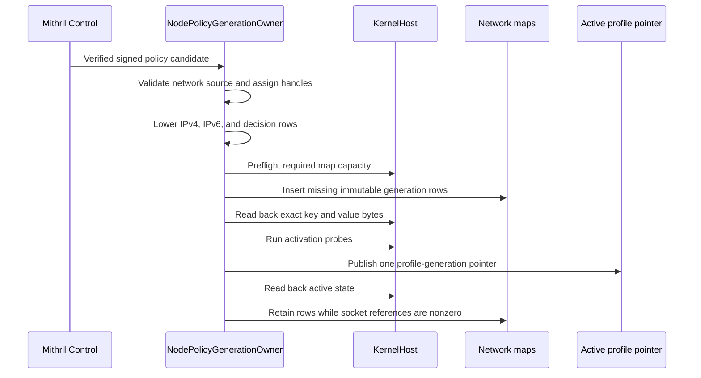
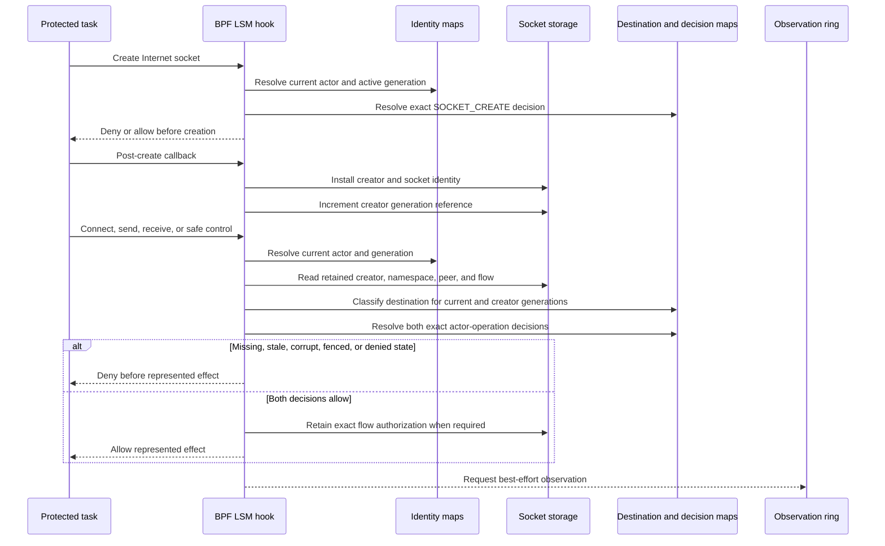
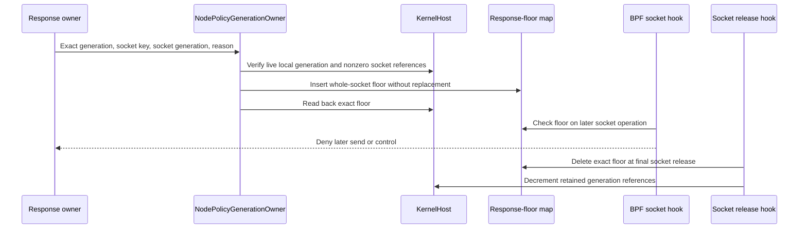
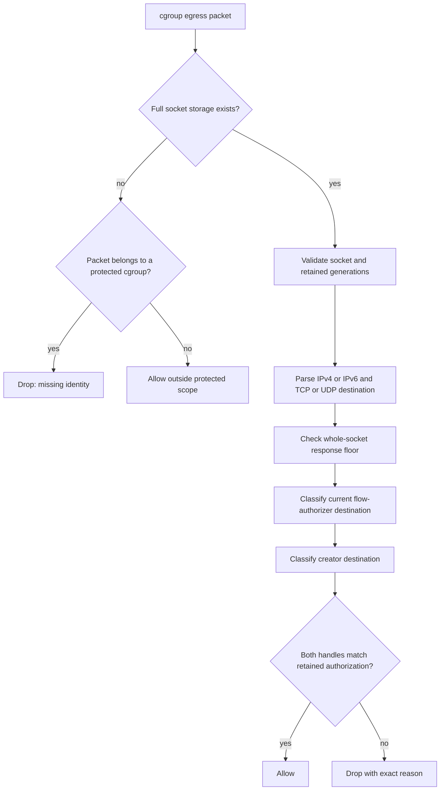
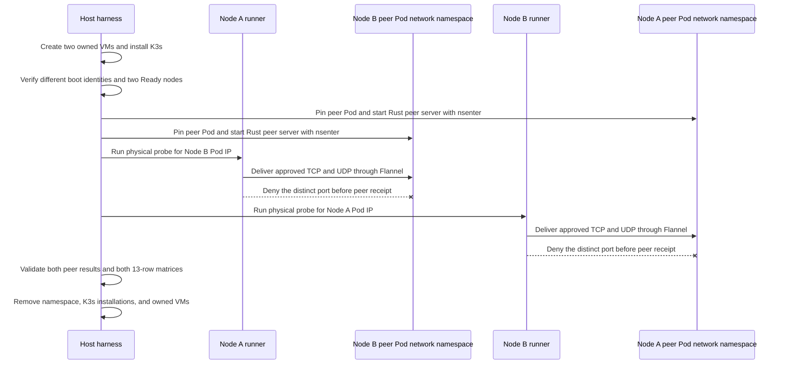

# Phase 5 Implementation Review Guide

Status: Source-grounded review guide for the current isolated worktree on
2026-08-19.

- Phase: [Process-Aware Network Plane](./phase-5-process-aware-network-plane.md)
- Architecture: [validated readable architecture](./policy-and-protection-algorithm-architecture-readable.md)
- Closure: [network fixture matrix](./phase-5-closure-matrix.md)
- Research basis: [Cilium and Tetragon network enforcement lessons](../../research/cilium-tetragon-network-enforcement-lessons.md)
- Manual proof: [acceptance runbook](./manual-testing/phase-5-manual-acceptance.md)

Berkeley Packet Filter (BPF) programs use Linux Security Module (LSM),
function-exit, function-entry, and cgroup egress hooks for the implemented
network path.

## Review Claim

The implementation closes one qualified x86_64 network tier. All 13 allocated
fixtures have physical `PASS` results in the single-host probe and in both
directions of the two-node K3s Flannel probe. Each row has a negative oracle,
a legitimate positive control, and the required lifecycle assertion.

The advertised path has these properties:

- signed TCP destination policy binds address prefix, port, profile
  generation, actor state, operation, and protocol;
- a created socket keeps creator authority in kernel socket storage;
- connect, send, and receive intersect current-actor and retained creator
  decisions;
- selected socket controls have a separate exact default;
- accepted-socket and cross-network-namespace transfers preserve creator,
  accepter, current-actor, and namespace authority;
- delegated requests preserve request identity and final destination;
- a local-output DNAT path enforces the final rewritten destination;
- a host source reaches a peer in the remote Pod network namespace through the
  tested K3s Flannel route without widening destination authority;
- a whole-socket response floor denies later use;
- final socket release removes response state and generation references; and
- the physical runner proves denial, a legitimate application control, server
  receipt, post-fence byte absence, and cleanup.

Do not infer any of these broader claims:

- a qualified final address for Pod-origin enforcement, another CNI, an
  arbitrary service mesh, SNAT, or dynamic route mutation;
- socket transfer authority for mechanisms beyond the tested Unix descriptor
  pass and `pidfd_getfd` transfer;
- delegated remote file systems beyond the tested local proxy request;
- DNS qname, answer, CNAME, compression, cardinality, or payload policy;
- TLS verb, bearer purpose, or provider-result semantics;
- raw, packet, TUN, AF_XDP, RDMA, vsock, netlink, SCTP, MPTCP, or arbitrary
  asynchronous network authority; or
- physical qualification on a non-x86 platform.

## Recommended Reading Order

1. Read the [phase result](./phase-5-process-aware-network-plane.md#phase-result)
   and [closure decision](./phase-5-closure-matrix.md#closure-decision). Start
   with the 13-row claim and its explicit topology and protocol limits.
2. Read the architecture chapters for process-aware network enforcement,
   final-destination policy, response floors, and delivery qualification in
   the [validated architecture](./policy-and-protection-algorithm-architecture-readable.md).
3. Read the upstream study in the
   [Cilium and Tetragon lessons](../../research/cilium-tetragon-network-enforcement-lessons.md).
   It explains the split between actor-time, socket-lifetime, and packet-time
   authority.
4. Review network policy input in
   [`source.rs`](../../../crates/mithril-control/src/policy/source.rs) and its
   closed validation in
   [`validation/network.rs`](../../../crates/mithril-control/src/policy/validation/network.rs).
5. Review deterministic destination and decision lowering in
   [`policy/network.rs`](../../../crates/mithril-node/src/policy/network.rs).
   Then follow generation staging, readback, publication, fencing, and
   retirement in
   [`policy.rs`](../../../crates/mithril-node/src/policy.rs).
6. Review the portable network ABI in
   [`abi/network.rs`](../../../crates/erebor-interceptor-abi/src/abi/network.rs)
   and the generated C view in
   [`erebor_interceptor_abi.h`](../../../bpf/erebor-interceptor/include/erebor_interceptor_abi.h).
7. Review map declarations in
   [`identity_maps.h`](../../../bpf/erebor-interceptor/programs/identity_maps.h).
   Follow the network decision helpers and direct network hooks in
   [`identity_network.bpf.h`](../../../bpf/erebor-interceptor/programs/identity_network.bpf.h).
8. Review the shared Internet and Unix socket dispatch in
   [`identity_ipc.bpf.h`](../../../bpf/erebor-interceptor/programs/identity_ipc.bpf.h).
   One hook owner selects the network path or the Unix IPC path.
9. Review cgroup program attachment and program selection in
   [`host.rs`](../../../crates/erebor-interceptor/src/host.rs). The Interceptor
   remains the only loader.
10. Finish with the assertion-bearing runner in
    [`effect/network.rs`](../../../crates/mithril-e2e/src/effect/network.rs),
    the managed child operations in
    [`effect/child.rs`](../../../crates/mithril-e2e/src/effect/child.rs), and
    the peer command in
    [`mithril_network_test.rs`](../../../crates/mithril-e2e/src/bin/mithril_network_test.rs).
11. Review two-node orchestration and peer namespace placement in
    [`two-node-network.sh`](../../../crates/mithril-e2e/harness/vm/two-node-network.sh),
    then run the [manual example](../../../examples/mithril-network-manual/README.md).

## Ownership Boundaries

| Owner | Owns | Does not own |
| --- | --- | --- |
| `mithril-control` network policy | Closed source fields, canonical prefixes, sorted protocol and port sets, DNS-mode validation, and rejection of unqualified namespace or service selectors. | Kernel maps, socket identity, packet parsing, or response execution. |
| `mithril-node::NodePolicyGenerationOwner` | Deterministic lowering, capacity and readback through the shared host, generation publication, socket-reference-aware retirement, and exact whole-socket response-floor installation. | BPF loading, current-task identity, or socket lifecycle callbacks. |
| `erebor-interceptor::KernelHostOwner` | Exclusive object load, required program selection, LSM and cgroup attachment, map access, pins, lease, capability checks, and cleanup. | Mithril policy meaning or a second decision engine. |
| Production BPF programs | Current actor lookup, socket storage, creator and current intersection, packet parsing, response-floor enforcement, reference accounting, hard closure, and observation requests. | Durable policy authorship, semantic DNS, TLS meaning, or provider results. |
| `mithril-e2e::NetworkTestRunner` | Signed disposable policy, managed child, local and remote-peer controls, exact syscall and server oracles, response-fence request, reference-release assertion, result classification, and cleanup. | A second enforcement implementation or broader support classification. |
| VM harness | Build, transfer, isolated kernel execution, exact node and Pod placement, evidence collection, postflight cleanup, and owned disposable-VM destruction. | Product policy, fixture result invention, distributed causality, or later-phase Control behavior. |

Mithril Node is the policy and response owner. The Interceptor is the only
kernel loader. The BPF programs are the physical decision owner. The runner
calls those production owners and asserts their results.

## Policy Model And Lowering

`NetworkPolicyV1` contains one selected DNS mode and a sorted bounded set of
destination records. Each destination record has ordered TCP or UDP
protocols, canonical IPv4 or IPv6 prefixes, up to eight non-overlapping port
ranges, and a final-address requirement.

Active validation rejects these inputs:

- an empty, unsorted, duplicate, or over-capacity destination set;
- a non-canonical prefix or a prefix that contains host bits;
- an empty, zero, overlapping, unsorted, or over-capacity port set;
- a network namespace selector;
- a service identity selector; and
- port 53 in `DENY_DNS_AND_USE_POLICY_RESOLVED_ADDRESSES` mode.

Node lowering assigns deterministic nonzero destination handles in document
order. It emits generation-scoped IPv4 and IPv6 longest-prefix-match keys.
The fixed key prefix includes profile generation and protocol before the
address prefix. One destination decision key then binds:

- profile generation;
- destination handle;
- active role;
- process state vector;
- entry kind;
- operation;
- TCP or UDP protocol; and
- binding lifecycle state.

This shape prevents an address match from becoming authority by itself. The
address and port select a destination class. The actor and operation still
need an exact physical decision.

## Policy Activation Flow



Capacity and readback failure occur before publication. Existing sockets keep
their retained generation. New roots use the published generation. Retirement
waits for the socket-reference map to reach zero.

## Socket Decision Flow



The connect, send, and receive hooks never authorize from current actor alone.
They validate the live socket state, retained network namespace, creator
generation, current generation, destination class, and response floor.

The shared socket hooks first select Internet or Unix behavior. Internet
families use the network owner. Unix stream sockets use the IPC owner. The
network control hooks check the live socket family before they act, so they do
not claim Unix socket controls.

## Accepted Socket Flow

The `socket_accept` LSM hook checks the listener operation before accept. The
`fexit/inet_csk_accept` program runs after the kernel returns the accepted
socket. It creates child socket storage from the listener state, assigns a new
socket identity, records the parent identity, and adds retained generation
references.

The physical fixture passes two accepted sockets over governed Unix
relationships. A narrow receiver cannot send or receive. An approved receiver
sends bytes that the client receives. The accepter and receiver keep the same
kernel socket alive, so one close does not release the retained generation
reference.

The namespace variant duplicates a live accepted socket with `pidfd_getfd`
into actors in private network namespaces. The narrow actor cannot send. The
approved actor sends, and its observation records different nonzero creator
and current network namespace identities.

## Response Fence Flow



The response scope is `WholeSocket`. The implementation does not claim
per-lineage attribution for queued bytes, retransmits, or shared transport
state. The physical probe checks a later send, shutdown, server byte absence,
and final reference release.

## Packet Program Flow



The packet program uses retained socket and flow state. It does not call a
current-task lookup. This is required because a packet-stage task can be
absent or unrelated to the originating actor.

The program rejects fragments, IPv6 extension-header paths, unsupported
protocols, zero ports, corrupt generations, missing protected socket state,
and destination-handle changes. It emits the
`PACKET_DROPPED_AFTER_REWRITE` physical result for a packet-stage drop.

The physical fixture installs probe-owned `nftables` local-output DNAT rules.
Both documentation-range addresses rewrite to `127.0.0.4`. The policy denies
the `198.18.0.1` flow after its final destination no longer matches retained
authority. The `198.18.0.2` control reaches the rewritten server. This result
proves the local DNAT placement.

The two-node harness adds one peer Pod to each exact K3s node. It resolves the
container process, enters that Pod network namespace, and runs the Rust peer
server there. The source host sends to the remote Pod IP, so the packet follows
the Flannel route. Both directions prove allowed TCP and UDP receipt plus
denied-port absence. This result does not prove Pod-origin enforcement,
another CNI, an arbitrary service mesh, SNAT, or dynamic route mutation.

## Two-Node CNI Proof Flow



## BPF Program Relationships

| Program or hook | Role | Required review point |
| --- | --- | --- |
| `lsm/socket_create` | Checks family, type, protocol, current actor, and exact socket-create policy before creation. | Preserve an earlier LSM denial. Reject an unrepresented Internet socket type or protocol. |
| `lsm/socket_post_create` | Dispatches Internet sockets to network state creation and Unix streams to IPC state creation. | State installs only after a successful create. The creator generation reference increments once. |
| `lsm/socket_connect` | Reads the explicit destination and retains a flow authorization. | Current and creator destinations and decisions must both allow. |
| `lsm/socket_sendmsg` | Uses an explicit datagram address or the retained connected peer. | No address fallback can widen a connected or unconnected path. |
| `lsm/socket_recvmsg` | Uses the retained connected peer for the qualified receive path. | The physical claim covers only the connected TCP receive control. |
| `lsm/socket_bind`, `socket_listen`, and `socket_accept` | Apply destination or exact control policy to Internet sockets. | Source support does not create a physical claim for every control variant. Unix sockets stay with IPC. |
| `fexit/inet_csk_accept` | Labels a returned accepted socket and records its parent socket. | The accepted-socket and namespace-transfer controls must preserve creator, accepter, current actor, and retained namespace authority. |
| `lsm/socket_setsockopt` | Allows only represented safe options to reach network control policy. | The qualified fixture proves `TCP_NODELAY`; other options do not inherit it. |
| `lsm/socket_shutdown` | Applies exact control policy and any response floor. | The probe proves post-fence denial. |
| `cgroup_skb/egress` | Checks retained flow state, packet destination, creator and flow-authorizer handles, and response floor without current-task context. | The local-output DNAT and host-to-remote-Pod Flannel controls prove the tested placements. Other topology claims need separate qualification. |
| `fentry/__sock_release` | Deletes the exact response floor, decrements creator and flow-authorizer references, and tombstones socket state. | The release fixture must observe a zero generation reference after close. |

## BPF Helper Walkthrough

- `bpf_sk_storage_get` reads and creates socket-owned state. The map uses
  `BPF_F_CLONE`, so kernel socket cloning carries the state with kernel socket
  lifetime instead of file descriptor lifetime.
- BPF Core Read operations obtain socket family, protocol, and network
  namespace fields from the live kernel object.
- `bpf_map_lookup_elem` reads generation descriptors, active actor state,
  destination classes, exact decisions, response floors, and reference rows.
- `bpf_sk_fullsock` converts the packet socket to the full socket used by
  socket storage.
- `bpf_skb_load_bytes` performs bounded IPv4, IPv6, TCP, and UDP reads. A
  malformed or unsupported shape drops on the protected path.
- `bpf_skb_cgroup_id` identifies an unlabelled protected packet. An execution
  set binding makes missing socket state a drop instead of an outside-scope
  allow.
- The shared observation helper reserves a ring record only after the physical
  result is known. Reservation loss cannot change allow or deny.

The verifier-sensitive destination, socket post-create, accepted-socket, and
control helpers are not inlined. They keep the BPF stack below the kernel
limit. Per-CPU scratch owns temporary destination and socket buffers.

## Map Lifecycle

| Map | Key/value ABI | Userspace writer | BPF writer | Readers | Lifetime |
| --- | --- | --- | --- | --- | --- |
| `network_ipv4_destination_classes` | `NetworkIpv4LpmKeyV1` / `NetworkDestinationClassV1` | `NodePolicyGenerationOwner` through `KernelHost` | None | Network LSM helpers and cgroup egress program | Immutable generation row. Installed and read back before publication. Deleted only after generation retirement. |
| `network_ipv6_destination_classes` | `NetworkIpv6LpmKeyV1` / `NetworkDestinationClassV1` | `NodePolicyGenerationOwner` through `KernelHost` | None | Network LSM helpers and cgroup egress program | Same lifecycle as the IPv4 trie. |
| `network_destination_decisions` | `NetworkDestinationDecisionKeyV1` / `PhysicalDecisionV1` | `NodePolicyGenerationOwner` through `KernelHost` | None | Network LSM helpers and packet decision path | Immutable generation row. Capacity and exact readback precede publication. |
| `network_socket_states` | Implicit kernel socket key / `NetworkSocketStateV1` | None | Post-create and accepted-socket paths create or update; flow use updates; release tombstones | Network LSM hooks, cgroup egress, and release | Kernel socket lifetime with clone support. It is not file descriptor or process lifetime. |
| `network_response_floors` | `NetworkResponseFloorKeyV1` / `NetworkResponseFloorV1` | `NodePolicyGenerationOwner` inserts an exact floor through `KernelHost` | Final socket release deletes the exact floor | Network LSM helpers and cgroup egress program | One live whole-socket fence. Insert does not replace an existing row. Release removes it. |
| `profile_generation_socket_refs` | Native `u64` / native `u64` | Node stages a zero row and deletes it after retirement | Socket creation and accepted-socket paths increment; flow-authorizer changes transfer; release decrements | Node fence validation and retirement; BPF generation validation | One row per policy generation. A nonzero value blocks generation retirement and proves a live socket holder. |

The network path also reads shared identity configuration, task, process,
binding, active-generation, generation-descriptor, default-decision, scratch,
and observation maps. Those maps keep their earlier-phase owners. Phase 5 does
not duplicate them.

## ABI Boundary

[`abi/network.rs`](../../../crates/erebor-interceptor-abi/src/abi/network.rs)
owns the portable Rust map keys, values, and closed enums. Address family,
protocol, socket state, and response scope use `TryFromBytes`; an invalid enum
value is rejected. `Unknown` is zero. Namespace identity contains only integer
fields, so every bit pattern is representable and it can use `FromBytes`.

Every map struct uses `repr(C)`, explicit reserved bytes, fixed-size arrays,
and layout tests. The tests check exact sizes, alignment, and selected field
offsets. The generated C header is checked against the Rust ABI during the
build. The BPF translation unit also has static layout assertions.

The effect observation ABI includes socket, creator generation, flow,
destination, peer, response scope, and packet physical-result fields. A reader
must supply the exact record size. It cannot decode a shorter prior record as
a current network event.

## Concurrency, Failure, And Cleanup

- Every LSM path preserves an earlier denial before it considers Mithril
  policy.
- Socket state is not an LRU authority cache. Kernel socket storage owns its
  lifetime.
- Creator and current generation references are validated independently. A
  flow-authorizer change transfers the reference without dropping the live
  creator reference.
- A missing or corrupt protected identity, socket state, generation,
  destination, decision, or packet scratch record fails closed.
- The final packet program uses retained state only. It never invents a
  packet-stage actor.
- A response floor uses exact socket key and socket generation. File
  descriptor reuse cannot match it.
- Release removes only the exact floor and decrements only the generations
  held by that socket.
- The physical runner rejects pre-existing paths and asserts cleanup of its
  pin root, lease, cgroup, and fixture directory.
- The single-node harness destroys only its owned VM. The two-node harness
  checks an ownership record for each exact VM before destruction. The
  completed runs left an unrelated running VM unchanged.

## Fixture Result Construction

`NetworkTestRunner::physical_probe` builds a signed network fixture policy from
the checked test key. It removes unrelated administrative, exception, and
default state. It adds only the exact network, token-read, process-transfer,
and Unix relationship rules needed by the fixture. This prevents an earlier
fixture family from becoming ambient authority.

The runner starts local TCP and UDP controls and eight managed actors in
dedicated cgroups. It then performs this assertion sequence:

1. An unclassified destination denies before connect. Signed IPv4 and IPv6
   TCP paths connect, send, receive, and reach their servers.
2. Connected and unconnected IPv4 and IPv6 UDP sends reach their servers.
   Resolver destinations and unrepresented families or protocols deny.
3. When a remote peer is present, its approved TCP and UDP destinations
   succeed. Its distinct denied port rejects the connection.
4. `TCP_NODELAY` succeeds, `SO_MARK` denies, and ordinary shutdown succeeds.
5. Clone and fork holders send on one socket. Final close releases the retained
   reference. A later socket has a new generation.
6. A narrow actor receives a passed accepted socket but cannot send or receive.
   An approved actor receives another accepted socket and sends bytes.
7. A whole-socket floor on the passed socket denies the approved receiver and
   the accepter. The client receives no post-fence bytes.
8. `pidfd_getfd` duplicates accepted sockets into private network namespaces.
   The narrow actor cannot send. The approved actor sends, and its event keeps
   distinct creator and current namespace identities.
9. A governed local proxy passes a request identity and final destination to a
   delegate. The forbidden server receives nothing. The approved server
   receives the delegated bytes.
10. Zero, end-of-file, I/O error, partial, mapped, inherited-descriptor,
   governed-read, and governed-map results remain separate from denied network
   use and provider receipt.
11. Probe-owned local-output DNAT rewrites two documentation-range addresses.
    The forbidden final-address mismatch denies. The approved rewritten flow
    reaches its server.
12. The original socket receives an exact whole-socket response floor. Later
    send, clone send, and shutdown deny. The server receives no later bytes.
13. The Interceptor, actor cgroups, lease, pins, rewrite table, transport
    endpoints, and fixture files clean up.

Only after every assertion passes does the runner return the JSON bundle. The
fixture array contains 13 unique `PASS` rows. A false physical assertion makes
the probe fail and prevents a pass result.

The two-node harness starts one peer server inside each peer Pod network
namespace and invokes the same runner on the opposite host. It requires the
peer's TCP and UDP receipt and the absence of a denied connection before it
accepts either direction.

## Test Layers

| Layer | Source | What it proves |
| --- | --- | --- |
| Policy validation and compilation | [`validation/network.rs`](../../../crates/mithril-control/src/policy/validation/network.rs), [`policy_compilation.rs`](../../../crates/mithril-control/tests/policy_compilation.rs), and [`policy/network.rs`](../../../crates/mithril-node/src/policy/network.rs) | Closed source, canonical prefixes, bounded ports, selected DNS mode, deterministic handles, generation-scoped tries, and actor-operation decision keys. |
| Node lifecycle tests | Tests beside [`NodePolicyGenerationOwner`](../../../crates/mithril-node/src/policy.rs) | Capacity, staging, readback, publication, response-floor validation, socket-reference-aware retirement, and row deletion. |
| ABI and Interceptor tests | [`abi/network.rs`](../../../crates/erebor-interceptor-abi/src/abi/network.rs) and [`bundled.rs`](../../../crates/erebor-interceptor/src/bundled.rs) | Closed enums and layout, required maps and hooks, creator/current intersection, socket lifetime, Unix owner separation, and packet use of retained state. |
| Rust physical fixture tests | [`effect/network.rs`](../../../crates/mithril-e2e/src/effect/network.rs) | Signed fixture compilation, closed unique result matrix, managed-child protocol, and assertion-bearing physical sequence. |
| Manual example | [`mithril-network-manual`](../../../examples/mithril-network-manual/README.md) | A readable single-host command that uses the production runner and does not own VM lifecycle. |
| Disposable VM harness | [`run.sh`](../../../crates/mithril-e2e/harness/vm/run.sh) and [`two-node-network.sh`](../../../crates/mithril-e2e/harness/vm/two-node-network.sh) | Explicit build, isolated kernel execution, exact two-node and peer-Pod placement, evidence collection, cross-probe compatibility, and cleanup. |

## Verification Route

Run the repository checks after the last Rust or BPF edit:

```sh
cargo fmt --all -- --check
cargo clippy -p erebor-interceptor -p mithril-e2e --all-targets -- -D warnings
cargo test -p mithril-e2e --lib
bash .github/scripts/verify-rust-ci.sh
```

Run the standalone physical example on a qualified host:

```sh
cargo build -p mithril-e2e --bin mithril-network-test
sudo examples/mithril-network-manual/run-network-probe.sh
```

Run the complete disposable-VM proof when the source, BPF object, kernel
record, or harness changes:

```sh
crates/mithril-e2e/harness/vm/run.sh \
  --output-directory /tmp/mithril-network-vm-review
```

Run the two-node CNI proof when the network route, peer fixture, or K3s harness
changes:

```sh
crates/mithril-e2e/harness/vm/two-node-network.sh \
  --output-directory /tmp/mithril-network-two-node-review
```

The physical results use run-scoped directories under `/tmp`; they are not
source artifacts. The platform was x86_64 Linux `6.8.0-137-generic`, cgroup
v2, BPF filesystem, runtime BPF Type Format, and active BPF LSM. Every network
Boolean oracle was true, and all 13 fixture rows were `PASS`. The two-node run
used the same kernel and source on two independently booted VMs. It observed
two Ready K3s nodes, delivered allowed TCP and UDP through Flannel in both
directions, observed no denied peer connection, and passed all 13 fixture rows
on each source node. The full repository CI script passed against the same
implementation source.

## Future And Unallocated Work

The [closure matrix](./phase-5-closure-matrix.md) is authoritative. Claim
expansion needs a new qualification outcome for:

- Pod-origin enforcement, CNIs beyond the tested K3s Flannel route, arbitrary
  service meshes, SNAT, and dynamic route mutation;
- socket transfer mechanisms beyond the tested Unix descriptor pass and
  `pidfd_getfd` path;
- delegated remote file systems beyond the tested local proxy protocol;
- bounded DNS payload policy, if selected; and
- broader protocol and asynchronous network paths.

A later evidence, detection, response, distributed, or provider phase cannot
widen the qualified network claim without its own physical proof.

## Review Checklist

- [ ] The reviewed claim is the single-host matrix plus the tested
      host-to-remote-Pod K3s Flannel route, not every network topology or
      protocol.
- [ ] Every advertised operation has a physical negative oracle and a
      legitimate positive control.
- [ ] Every allocated fixture has an exact `PASS` result and nonempty physical
      oracle.
- [ ] Destination rows are canonical, bounded, generation-scoped, and read
      back before publication.
- [ ] An address and port match still require exact actor-operation decisions.
- [ ] Connect, send, and receive intersect creator and current authority.
- [ ] Unix sockets remain with the IPC owner.
- [ ] Packet decisions use retained flow state and no fictional current task.
- [ ] Rewrite and route qualification stays limited to the tested local-output
      DNAT and host-to-remote-Pod K3s Flannel paths.
- [ ] A response floor binds exact socket identity and has whole-socket scope.
- [ ] Socket release removes the exact floor and retained references.
- [ ] DNS port denial is not described as DNS payload inspection.
- [ ] Allowed TLS channel activity is not described as a provider semantic
      result.
- [ ] Cleanup removes only probe-owned pins, lease, cgroup, files, and VM.

## Source State And Guide Verification

This guide was checked against the current isolated worktree on 2026-08-19.
The documentation change does not modify Rust, BPF, ABI, build, or test source.

The single-node disposable-VM physical suite and bidirectional two-node K3s
Flannel suite passed after the last implementation edit. The Rust CI procedure
passed formatting, workspace check, and workspace clippy. Its workspace tests
then rejected the unchanged generated kernel qualification record as stale.
The user directed this source-only change not to commit the regenerated
SHA-256 or CI/CD qualification artifact. A separate workspace run passed every
other test with that exact bundle test excluded. The documentation diff check
and local link-target check passed after this guide was updated. The guide
records no broader result than the closure matrix.
