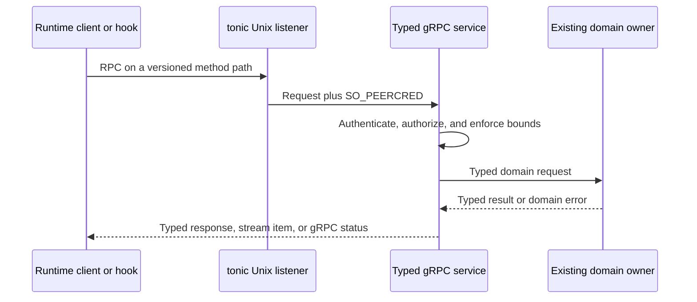
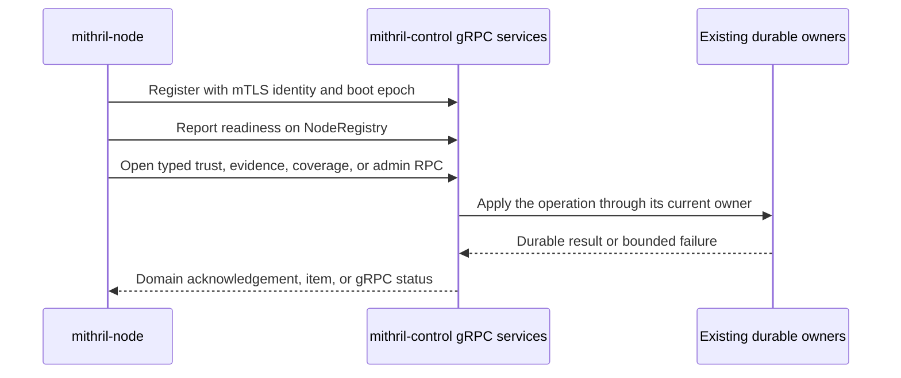

# Phase 6.1: gRPC Service And IPC Convergence

Status: Done. Automated acceptance passed on 2026-08-21. The manual runbook has
not been run.

Master: [Mithril Hugging Face Intrusion Prevention](./README.md)

Design: [Validated readable architecture](./policy-and-protection-algorithm-architecture-readable.md)

Manual acceptance: [Phase 6.1 runbook](./manual-testing/phase-6-1-manual-acceptance.md)

Implementation review: [Phase 6.1 review guide](./phase-6-1-implementation-review.md)

Environment setup: [shared setup guide](./manual-testing/environment-setup.md)

## Purpose

Replace the custom framed Protobuf IPC protocol with typed gRPC services.
Split the `mithril-control` to `mithril-node` channel by operation family
before Phase 6.2 adds policy delivery. Remove transport version fields and
generic message envelopes that duplicate gRPC and Protobuf behavior. Preserve
authentication, authorization, bounds, replay protection, durable cursors,
and current owner boundaries.

## Scope And Design Coverage

Mithril Chapters 5, 22, 30, and 32-35; Appendices A.3-A.7 and A.15.1. The
Erebor Runtime IPC migration is a cross-product prerequisite. It changes
transport and service routing only. It does not move Runtime or Mithril domain
ownership.

## Pre-implementation Source Baseline

- `erebor-runtime-ipc` generates messages with `prost-build`. It owns a custom
  frame header, `Envelope`, message-kind strings, correlation fields, generic
  headers, and transport protocol constants.
- Erebor daemon control, Codex hooks, the Runtime interception broker, and the
  read-only Mithril observation endpoint use the custom frame over Unix
  sockets.
- The checked source still contains the Linux ptrace process guard and includes
  a standalone copy of the IPC codec in its binary. The phase must remove or
  close that active dependency before it can claim that all supported IPC
  uses gRPC.
- `mithril-control` already uses tonic and mTLS. Its one `NodeControl.OpenStream`
  RPC multiplexes registration, readiness, trust, administrative execution,
  evidence, and coverage through `NodeEnvelope` and `ControlEnvelope`.
- Transport fields repeat information already present in the gRPC method,
  Protobuf package, HTTP/2 stream, TLS peer, and gRPC metadata.

The source baseline does not prove that the ptrace process guard is absent.
Implementation must remove its supported launch and configuration path, or
stop as `Blocked`. It must not keep the custom protocol as an undocumented
exception.

## Implemented Outcome

The Runtime package now has 12 typed services and 60 methods. The Mithril
Control package has six typed services and eight methods. Generated descriptor
tests freeze the exact service, method, request, response, and streaming
inventory.

Runtime local services use the common tonic Unix transport. The transport
adds the kernel-reported PID, UID, and GID to request extensions and applies a
4 MiB message limit. The daemon applies its existing five-second request
timeout and 32-request per-connection limit. Hook and administrative streams
use bounded channels with eight entries.

The daemon dispatcher, generic envelopes, frame codecs, message-kind strings,
transport-version switches, standalone guard codec, and ptrace process-guard
launch path are absent. Stale ptrace configuration fails closed. The hook
service uses the kernel peer identity, `/proc` executable and ancestry checks,
session registration, and one-use peer replay state. It does not accept a
client ticket as authority.

Mithril observation keeps UID, PID, and cgroup authorization. Mithril node
control keeps mTLS node binding, boot epochs, trust generations, evidence WAL
cursors, coverage revisions, replay checks, and durable acknowledgements.
No durable owner moved because of the transport migration.

## Fixed Transport And Ownership Rules

Each product boundary keeps one versioned Protobuf API package and declares
multiple typed gRPC services in that package. The generated method path and
package version identify the service contract. The RPC request and response
types identify the message kind. gRPC metadata carries bounded request
metadata. gRPC status carries transport and request failure. Unary,
client-streaming, server-streaming, and bidirectional-streaming RPCs are used
only when the domain flow needs that shape.

gRPC does not replace application semantics. Keep node boot and label epochs,
trust generations, request IDs, policy anti-rollback sequences, evidence WAL
cursors, coverage revisions, artifact schema versions, digests, and durable
acknowledgement rules. Remove only generic transport versions, message-kind
dispatch, manual correlation, and generic stream sequence that no domain
contract needs.

Local services continue to use Unix sockets. The server must propagate
`SO_PEERCRED` data into request extensions before authorization. Socket owner,
mode, UID, cgroup scope, request size, response size, concurrency, timeout,
and shutdown limits remain explicit. Remote node services continue to use
mTLS. A Protobuf field, request value, or metadata value cannot override the
authenticated local or TLS peer identity.





## Deliverables

### D6.1.1 — Close the ptrace protocol exception

Remove the Linux ptrace process-guard launch path, its standalone IPC module,
and its build artifact from supported production configuration and packaging.
A stale configuration that requests the removed backend must fail validation.
It must not fall back to an ungoverned allow path.

If an approved non-ptrace Runtime guard still consumes the guard contract,
move its typed messages into a `RuntimeGuardService` and use the common tonic
Unix transport. Do not retain a standalone codec or a second transport for
that service.

Before deletion, map each current process-guard acceptance claim to its
remaining approved owner or mark that capability unsupported. Do not claim
that gRPC replaces ptrace enforcement. If an advertised Runtime behavior still
requires the process guard and no approved owner provides it, stop the phase
and request an explicit product decision.

### D6.1.2 — One generated gRPC contract owner

Make `erebor-runtime-ipc` the generated gRPC contract owner for supported
local Runtime services. Use tonic and Protobuf service definitions. Remove the
custom frame, codecs, generic envelope helpers, message-kind constants,
generic header validation, and standalone codec after the last supported
consumer moves.

Keep one bounded client and server setup for Unix transport. Reuse it across
service families. It owns connection setup, message-size limits, deadlines,
cancellation, graceful shutdown, and peer-credential propagation. It does not
own domain authorization or state.

### D6.1.3 — Typed Erebor daemon services

Replace the daemon's message-kind dispatcher with typed services that follow
the existing owners: daemon lifecycle, agents, sessions and attach streams,
filesystem operations, approvals, policies, surfaces, runners, and context
delivery. Use unary RPCs for one request and one result. Use server streams for
logs, events, and evidence. Use bidirectional streams only for attach or input
flows that require independent traffic in both directions.

Keep the CLI and `erebor-runtime-client` as thin generated-client wrappers.
Keep idempotency keys in bounded gRPC metadata only for methods whose current
owner requires them. Do not create one replacement `Execute` RPC with a
payload union.

### D6.1.4 — Typed guard, hook, and observation services

When a supported non-ptrace Runtime guard remains, replace its envelope with a
`RuntimeGuardService`. Keep its admission, effect-decision, lifecycle, and
authorization owners unchanged. If no supported guard remains, remove its
service and messages instead of shipping an unused API.

Replace the Codex hook envelope with a `HookService` whose RPCs use the
existing peer-evidence, event, result, and rejection types. Keep hook
authorization with the existing session broker. Use the kernel peer identity
and registered process ancestry. Do not keep a client ticket that duplicates
that authority.

Replace the Mithril observation envelope with one unary
`RuntimeObservationService.GetSnapshot` RPC. Preserve socket mode, allowed
UID, `SO_PEERCRED`, cgroup-scope verification, response bounds, readiness,
coverage, and newest-event truncation. A gRPC success status does not make an
unauthorized snapshot valid.

### D6.1.5 — Typed Mithril node services

Replace `NodeControl.OpenStream`, `NodeEnvelope`, and `ControlEnvelope` with
operation-specific services:

- `NodeRegistry` for registration and readiness;
- `NodeTrust` for trust watch and acknowledgement;
- `NodeEvidence` for evidence batches and durable acknowledgements;
- `NodeCoverage` for coverage reports and acknowledgements;
- typed administrative resolution and arm streams that contain only their
  matching request and result types.

Do not create an empty policy service in this phase. Phase 6.2 adds a dedicated
policy delivery and activation-acknowledgement service without reopening the
other service contracts.

The node continues to initiate outbound connections. Use a separate typed
stream where Control must send work to a node behind the outbound connection.
Do not add a node listener or a second node-control channel owner.

Bind every RPC to the mTLS node identity and its current boot epoch. Remove
repeated node identity and connection fields when transport context supplies
them. Keep a field when it is part of a durable record, a reconnect boundary,
or an anti-replay check.

### D6.1.6 — Protocol and error simplification

Remove `PROTOCOL_VERSION`, `DAEMON_CONTROL_PROTOCOL_VERSION`,
`CONTROL_PROTOCOL_VERSION`, frame versions, per-message transport-version
fields, message-kind strings, generic payload bytes, and generic envelope
sequence fields from supported IPC.

Use versioned package and service names for incompatible API generations. Use
normal Protobuf compatibility rules for additive fields, reserve removed
fields and method names, and reject incompatible packages or unavailable
methods through gRPC. Do not add a second in-message protocol-version switch.

Map authentication, authorization, invalid input, conflict, missing state,
resource exhaustion, deadline, cancellation, unavailable service, and
internal failure to stable gRPC codes with structured safe details. Do not
expose secrets, policy source, evidence payloads, filesystem paths, or raw
internal errors in status text.

### D6.1.7 — Atomic migration and deletion

Cut over each service family with its client, server, tests, and packaging in
one change. Do not run legacy and gRPC protocols on the same endpoint. Do not
add a fallback from gRPC to the custom frame. Delete the old dispatcher and
wire types after all supported families move.

Preserve socket paths when this does not weaken ownership or create protocol
ambiguity. A stale client must receive a bounded connection or method failure.
It must not be interpreted as another service family.

### D6.1.8 — End-to-end transport proof

Run the complete Runtime daemon/client, hook, attach, stream, local Mithril
observation, node registration, trust, evidence, coverage, administrative
execution, reconnect, shutdown, and packaging tests through generated gRPC
clients and servers. Prove that no supported binary links or calls the custom
frame codec, envelope dispatcher, or standalone process-guard protocol.

Repeat the Phase 6 evidence outage and replay cases. Prove that stream
cancellation, HTTP/2 flow control, a slow consumer, or a reconnect cannot
acknowledge uncommitted evidence, reuse a boot identity, relax authorization,
or change a physical decision.

## Checkpoint

All supported Erebor local IPC and Mithril node-control traffic uses typed
gRPC services. No supported path uses the custom frame or a generic payload
envelope. The next phase can add policy delivery to its dedicated service
without expanding a shared message union.

## Required Tests

- Generated-descriptor tests that list the approved packages, services,
  methods, request types, response types, and streaming shapes.
- Static closure tests that reject a supported reference to `Envelope`,
  `AsyncFrameCodec`, `SyncFrameCodec`, message-kind constants, transport
  protocol constants, the standalone codec, or the ptrace process-guard
  launch path.
- Daemon unary, server-streaming, cancellation, deadline, idempotency, restart,
  stale-client, and graceful-shutdown tests. Hook and administrative tests
  cover bidirectional streaming.
- Unix peer UID, PID, cgroup, socket owner, socket mode, wrong-service,
  oversized request, oversized response, concurrency, and backpressure tests.
- Hook session mismatch, peer replay, unregistered executable, wrong peer,
  oversized event, unavailable broker, cancellation, and result-routing tests.
- Node wrong-CA, wrong-node, expired identity, boot reuse, reconnect, trust
  replay, evidence replay, durable acknowledgement, coverage revision, slow
  consumer, cancellation, and service-isolation tests.
- Existing Runtime and Mithril end-to-end tests with identical legitimate
  controls and no new physical-effect claim.
- Phase 6.1 owns no new Appendix C fixture ID. Its named transport and
  cutover tests remain mandatory.

## Acceptance

- Every supported IPC operation has one typed gRPC method and one current
  domain owner.
- No supported server dispatches a generic payload union or message-kind
  string.
- Local peer credentials and remote mTLS identities remain authorization
  inputs and cannot be overridden by request data.
- Generic transport versions and sequences are absent. Domain generations,
  cursors, digests, request IDs, and replay rules remain where required.
- The ptrace process-guard IPC exception and its supported launch path are
  absent. A remaining non-ptrace Runtime guard uses the common typed gRPC
  transport, or the phase result is `Blocked`.
- No dual protocol, downgrade path, hidden compatibility listener, or second
  durable owner remains.

## Excluded

Kubernetes CRD reconciliation, policy compilation, signed candidate rollout,
durable Control policy inventory, graph construction, findings, response,
provider connectors, public network APIs, and a replacement enforcement
mechanism for any removed ptrace-only capability. Phase 6.2 owns Control
policy and evidence convergence.

## Phase Result

```text
State: Done.
Validated architecture revision/digest: 51807f12113391872ee90ce2469869db18bc4d25e9b4b1f39eb01fcaefb4fe1e.
Completed deliverable IDs: D6.1.1-D6.1.8.
Files and durable owners changed: Runtime Protobuf and tonic transport; daemon gRPC adapters and generated-client wrapper; Codex hook transport and peer replay registry; Mithril observation service; Mithril Control service adapters; mithril-node typed clients. No durable owner changed.
Upstream-adoption dossier IDs used: none.
Fixture cases and exact physical results: no new Appendix C fixture or physical result. The historical kernel qualification remains bound to its recorded pre-gRPC architecture digest.
Commands and exact source state covered: `rtk bash .github/scripts/verify-rust-ci.sh` passed at code commit f59fd04; `rtk cargo test -p erebor-runtime-e2e --test session_review` passed 2 tests; `rtk cargo test -p erebor-runtime-terminal --lib` passed 3 tests; `rtk cargo test -p mithril-e2e --lib` passed 70 tests.
Platform/kernel/runtime manifests: no new platform or kernel manifest. Existing packaging passed the repository closure scan.
Performance/capacity results: no new benchmark. Runtime and Mithril gRPC messages are limited to 4 MiB. The daemon limit is 32 requests per connection. Hook and administrative stream queues have eight entries.
Unsupported/degraded paths: Linux ptrace process-exec, file, and socket interception; existing-process adoption; and arbitrary terminal-child interposition remain unsupported. Filesystem overlay and owned-browser behavior remain, but they do not claim syscall interception.
Remaining work in this phase: the optional manual runbook has not been run. No source deliverable remains.
Next phase not authorized: yes.
```
