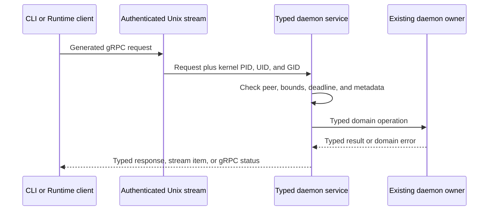
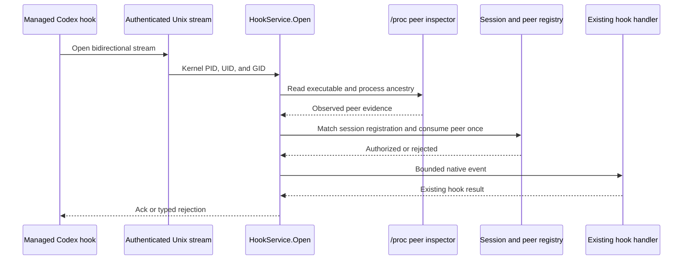
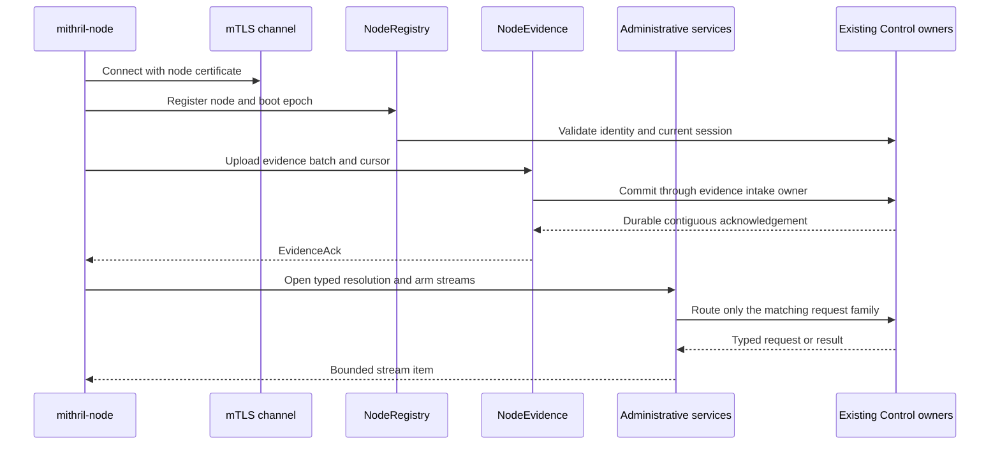

# Phase 6.1 Implementation Review Guide

Status: Source implementation is done. Automated acceptance passed on
2026-08-21. The [manual runbook](./manual-testing/phase-6-1-manual-acceptance.md)
has not been run.

Plan: [gRPC Service And IPC Convergence](./phase-6-1-grpc-service-and-ipc-convergence.md)

Deletion control: [Removed Code Replacement Map](./phase-6-1-removed-code-replacement-map.md)

## Review Goal

Verify that each supported IPC operation uses one generated gRPC method and
keeps its existing domain owner. Verify that local kernel peer credentials and
remote mTLS identity remain authorization inputs. Verify that the migration
did not add a second listener, protocol fallback, or durable owner.

Do not treat this transport change as physical process, file, or socket
enforcement. The removed ptrace-only capabilities are unsupported until a
separate Runtime integration uses the shared Interceptor.

## Recommended Reading Order

1. Read the [Runtime daemon contract](../../../crates/erebor-runtime-ipc/proto/erebor/runtime/ipc/v1/daemon.proto),
   [hook contract](../../../crates/erebor-runtime-ipc/proto/erebor/runtime/ipc/v1/hook.proto),
   and [observation contract](../../../crates/erebor-runtime-ipc/proto/erebor/runtime/ipc/v1/mithril.proto).
2. Read the [generated contract build](../../../crates/erebor-runtime-ipc/build.rs),
   [descriptor export](../../../crates/erebor-runtime-ipc/src/v1.rs), and
   [Unix transport](../../../crates/erebor-runtime-ipc/src/transport.rs).
3. Read the [daemon gRPC adapter](../../../crates/erebor-runtime-daemon/src/control/grpc.rs),
   then the [daemon state owner](../../../crates/erebor-runtime-daemon/src/control.rs)
   and [client wrapper](../../../crates/erebor-runtime-client/src/lib.rs).
4. Read the [Codex hook service](../../../crates/erebor-runtime-session/src/agents/codex/broker.rs)
   and [peer replay registry](../../../crates/erebor-runtime-session/src/agents/codex/ticket.rs).
5. Read the [Mithril observation service](../../../crates/mithril-node/src/local.rs).
6. Read the [Mithril Control contract](../../../crates/mithril-control/proto/erebor/mithril/control/v1/control.proto),
   [server assembly](../../../crates/mithril-control/src/server.rs),
   [service adapters](../../../crates/mithril-control/src/service.rs), and
   [node client](../../../crates/mithril-node/src/control.rs).
7. Finish with the [Runtime descriptor test](../../../crates/erebor-runtime-ipc/tests/contract.rs),
   [static closure test](../../../crates/erebor-runtime-ipc/tests/closure.rs),
   and [Mithril mTLS tests](../../../crates/mithril-node/tests/control_tls.rs).

## Contract Inventory

The `erebor.runtime.ipc.v1` package has 12 services and 60 methods. Ten daemon
services own lifecycle, agents, sessions, filesystems, context, administration,
approvals, policies, surfaces, and runners. `HookService.Open` is
bidirectional. `RuntimeObservationService.GetSnapshot` is unary.

The `erebor.mithril.control.v1` package has six services and eight methods:
`NodeRegistry`, `NodeTrust`, `NodeEvidence`, `NodeCoverage`,
`NodeAdministrativeResolution`, and `NodeAdministrativeArm`. Trust watch is a
server stream. Both administrative `Open` methods are bidirectional. The
other methods are unary.

The generated package name and gRPC method path are the protocol version and
operation identity. Domain versions remain in messages only when they protect
stored or replayed state.

## Ownership Map

| Boundary | Transport owner | Domain owner and state | Review invariant |
| --- | --- | --- | --- |
| Runtime Unix transport | `erebor-runtime-ipc::transport` | No domain state | `SO_PEERCRED` PID, UID, and GID enter tonic request extensions. The message limit is 4 MiB. |
| Daemon API | `erebor-runtime-daemon::control::grpc` | Existing daemon lifecycle, session, policy, approval, filesystem, surface, runner, context, and idempotency owners | A typed adapter calls the existing owner. The adapter does not persist a second result. |
| Runtime client | `erebor-runtime-client` | No durable state | The wrapper creates generated clients and applies deadlines, size limits, and bounded idempotency metadata. |
| Codex hook | `CodexHookService` and `HookService.Open` | Registered managed session, hook handlers, and one-use peer registry | Kernel peer identity and registered executable ancestry authorize the stream. Client data cannot create authority. |
| Runtime observation | `RuntimeObservationService.GetSnapshot` | Existing Mithril readiness, coverage, and newest-event owners | UID, PID, and cgroup checks complete before the bounded snapshot returns. The API is read-only. |
| Mithril node channel | tonic TLS server and generated node clients | Existing registration, trust, evidence, coverage, administrative resolution, and administrative arm owners | The certificate node identity and current boot epoch bind every operation. |
| Evidence acknowledgement | `NodeEvidence.Upload` | Existing Control evidence intake and node WAL owners | Only the durable contiguous Control result advances the node cursor. Reconnect does not create an acknowledgement. |

## Runtime Daemon Flow



The server keeps the existing five-second request timeout and a 32-request
per-connection limit. Per-UID stream limits remain in the daemon state owner.
Mutation idempotency remains durable in the existing store. The stored
response type is now typed, and legacy stored tags still deserialize.

## Codex Hook Flow



The client no longer sends a ticket, token, or ticket expiry. The service
rejects an unknown session, an unregistered executable, a mismatched peer, a
replayed peer, and an event larger than 32 KiB. The output queue has eight
entries. Stream cancellation drops the remaining work at the service
boundary.

## Mithril Node And Control Flow



The node still initiates the connection. Control does not add a node listener.
The split services keep the existing boot, trust, evidence, coverage, replay,
and administrative state. Evidence messages are limited to 4 MiB. Each
administrative stream queue has eight entries.

## Failure And Compatibility Boundaries

| Input or failure | Required behavior |
| --- | --- |
| Wrong service path | tonic returns `UNIMPLEMENTED`. No generic dispatcher receives the bytes. |
| Old framed bytes | The HTTP/2 endpoint rejects or closes the connection. No frame fallback runs. |
| Oversized daemon request | The request fails with the bounded tonic status before domain mutation. |
| Missing or wrong Unix peer | The service rejects before domain state changes. |
| Wrong or expired node certificate | Registration and later state changes reject. |
| Reused node boot or replayed evidence | Existing boot and cursor rules reject or return the prior durable result. |
| Stream cancellation | The bounded stream task stops. It cannot route into another service family. |
| Old controller handoff field | Strict deserialization rejects the unknown field. There is no numeric protocol switch. |
| Old ptrace configuration | Runtime validation rejects it. There is no ungoverned fallback. |

## Preserved Erebor Behavior

- Linux session controllers still apply no-new-privileges, resource limits,
  umask, supplementary groups, GID, and UID before workload start.
- Filesystem overlay, preimage, retention, promotion, revert, and recovery
  remain. They do not claim syscall policy enforcement.
- Owned-browser CDP launch and command mediation remain. Arbitrary
  terminal-child interposition is unsupported.
- Hook and app-server logical leases remain because authenticated callers use
  them. Guard-only physical tickets and leases are deleted.
- The portable terminal policy compiler and decision types remain for a later
  approved shared-Interceptor integration. They have no active process guard.
- Historical JSONL audit records remain readable. New no-interception sessions
  do not fabricate ptrace decisions.

## Deleted Or Unsupported Behavior

The implementation deletes the ptrace process-guard binary, launch path,
runtime broker, standalone codec, guard Protobuf contract, generic envelope,
frame header, async and sync frame codecs, daemon dispatcher, message-kind
strings, and transport protocol constants.

Linux ptrace process-exec, file-open, file-read, file-mutation, and
socket-connect interception are unsupported. Existing-process adoption and
arbitrary terminal-child interposition are also unsupported. A replacement
requires a separately approved Runtime owner that embeds the shared
Interceptor and proves authorization, attribution, lifecycle, recovery,
evidence, and physical effect.

## Verification Map

| Proof | Source |
| --- | --- |
| Exact Runtime descriptor inventory | [Runtime contract test](../../../crates/erebor-runtime-ipc/tests/contract.rs) |
| No custom frame, envelope, guard protocol, or launch path | [Static closure test](../../../crates/erebor-runtime-ipc/tests/closure.rs) |
| Wrong service, oversize, old frame, and shutdown | [Daemon control tests](../../../crates/erebor-runtime-daemon/src/control.rs) |
| Hook peer, ancestry, replay, bounds, routing, and cancellation | [Codex hook tests](../../../crates/erebor-runtime-session/src/agents/codex/broker.rs) |
| Observation UID, PID, cgroup, and response bounds | [Mithril observation tests](../../../crates/mithril-node/src/local.rs) |
| Exact Mithril descriptor inventory | [Mithril protocol tests](../../../crates/mithril-control/src/protocol.rs) |
| mTLS identity, boot, reconnect, replay, durable ack, service isolation, and cancellation | [Mithril Control TLS tests](../../../crates/mithril-node/tests/control_tls.rs) |
| Runtime observation coexistence | [Runtime coexistence test](../../../crates/mithril-node/tests/runtime_coexistence.rs) |

The final automated gate was:

```text
rtk bash .github/scripts/verify-rust-ci.sh
exit 0
```

The focused closure checks also passed:

```text
rtk cargo test -p erebor-runtime-e2e --test session_review
2 passed

rtk cargo test -p erebor-runtime-terminal --lib
3 passed

rtk cargo test -p mithril-e2e --lib
70 passed
```

No new performance benchmark or physical qualification ran. The current
architecture fixture registry uses digest
`51807f12113391872ee90ce2469869db18bc4d25e9b4b1f39eb01fcaefb4fe1e`.
The historical kernel result keeps its original digest because the gRPC
amendment does not change the qualified BPF surfaces.

## Reviewer Checklist

- [ ] Compare each Protobuf service with its generated descriptor test.
- [ ] Trace one daemon mutation into the existing idempotency and domain owner.
- [ ] Trace one daemon server stream through its per-UID permit lifetime.
- [ ] Verify that `UnixPeerIdentity` comes from the accepted socket, not a request.
- [ ] Trace one hook event through `/proc` inspection and one-use peer replay.
- [ ] Trace one observation request through UID, PID, and cgroup authorization.
- [ ] Trace one evidence retry from node WAL to durable Control acknowledgement.
- [ ] Verify that resolution and arm streams cannot route into each other.
- [ ] Run the descriptor and static closure tests after any contract edit.
- [ ] Confirm that no document or test claims gRPC replaces physical enforcement.

Completion of this work does not authorize the next phase.
