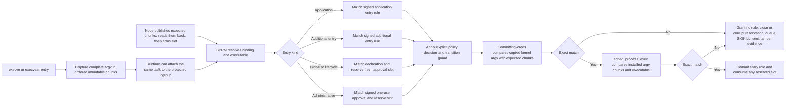

# Phase 6.2: Control Policy And Evidence Convergence

Status: Not done. The branch implements the approved capability-grounded
`WorkloadProtectionPolicy` and separate `WorkloadProtectionException`, their
Control and node lifecycles, Helm package, automated fixture, and independent
manual example. An earlier complete automated two-node physical fixture passed
at its recorded source state. The current working tree keeps ordinary signed
entry rows and canonical initial mount routes stable across runtime mount
events. It matches an ordinary entry by its signed canonical invocation path
and does not bind that entry row to an inode. BPF builds a live mount cache on
demand under a security-view epoch and separate runtime cache generation. BPF
publishes the cache state only after its security-view epoch, cache generation,
namespace-event, mount-count, and pending-mutation checks pass. Focused
distribution-runc and K3s-runc runs passed confirmed-mutation generation
advance, detached-event reuse, and stale-cache repair. Both runs stopped in
later lifecycle cases. No current Kubernetes run qualifies the runtime cache
generation. These results are not a complete physical result. The
implementation does not retire unreachable mount-cache rows explicitly. The
current public policy schema has an explicit
`applicationEntry`, a bounded set of `additionalEntries`, one
`administrativeEntry`, and `externalRole` as the fail-closed fallback. The
stock-`runc`, non-Kubernetes VM, and Kubernetes procedures prove independent
entry roles, reusable declarations, and guarded migration of a running process
to a replacement policy generation. The retained runtime gate also permits the
exact Control and Node recovery shapes without an executable digest. The
independent manual procedure passed on its recorded source. The physical
evidence-failure, watch-compaction, network-partition, storage-outage,
version-changed Kubernetes recovery, and authorized final-decommission cases
remain `Not run` or `Not done` on the current changed source.

Master: [Mithril Hugging Face Intrusion Prevention](./README.md)

Design: [Validated readable architecture](./policy-and-protection-algorithm-architecture-readable.md)

Cache design proposal: [Security-epoch-qualified mount cache](./phase-6-2-security-epoch-qualified-mount-cache-design.md)

Closure matrix: [Phase 6.2 closure matrix](./phase-6-2-closure-matrix.md)

Manual acceptance: [Phase 6.2 runbook](./manual-testing/phase-6-2-manual-acceptance.md)

Implementation review: [Phase 6.2 review guide](./phase-6-2-implementation-review.md)

Environment setup: [shared setup guide](./manual-testing/environment-setup.md)

Policy example: [independent entry roles](./phase-6-2-entry-policy-example.yaml)

## Purpose

Make Kubernetes custom resources the production desired-state source for
Mithril policy. Make `mithril-control` reconcile that source into immutable
signed candidates, distribute each candidate to the selected nodes, and move
the existing Phase 6 evidence intake into the production Control transaction.
Keep node activation and physical enforcement inside `mithril-node`. Give
Phase 7 one stable evidence and policy-provenance foundation on which it can
build the cross-node graph. Keep node enforcement after Kubernetes package
deletion unless an independently signed node decommission authorization
completes. Reject the exact attacker-created privileged Pod at admission and
retain a BPF incident floor for an admission bypass.

## Scope And Design Coverage

Chapters 5, 11-12, 22, 30, 32, and 34-37; Appendices A.8.1, A.11, and
A.15.1.

## Fixed Ownership And Data Flow

```text
WorkloadProtectionPolicy CRD base revision
  -> PolicyDesiredStateOwner in mithril-control
  -> capability-grounded validation and public-to-internal lowering
  -> internal closed PolicyDocumentV1
  -> PolicyCompiler validation, simulation, approval, and signature
  -> immutable rollout snapshot and signed node candidate
  -> typed mTLS NodePolicy delivery
  -> PolicyActivationOwner stage, readback, probes, and pointer publication
  -> authenticated node acknowledgement and Control rollout inventory

Linux capability authority
  -> Kubernetes or the OCI runtime puts a Linux capability in the process credentials
  -> the active Mithril role matches one exact named capability rule
  -> an Allow rule permits use of that existing capability
  -> a Deny rule rejects use of that capability
  -> Mithril does not add a capability that is absent from the process credentials
  -> the mount gate uses the exact SysAdmin decision and needs no second public mount rule

Known path-tree route
  -> Node holds the authenticated initial container mount snapshot
  -> Node records the compiled path prefix for each known mount-root source
  -> BPF uses the route when the target dentry or a source ancestor has one
  -> BPF does not compare mount ages for a routed path
  -> BPF uses the oldest unique mount only when no route exists
  -> BPF applies a task-root path denial before positive source-route authority
  -> an unresolved route and fallback deny under strict policy

WorkloadProtectionException CRD bounded request
  -> PolicyDesiredStateOwner validates the same-namespace base-policy grant and bounds
  -> PolicyRolloutOwner resolves the active base generation and exact target
  -> signed target-bound exception activation or revocation candidate
  -> ExceptionAuthorityOwner durable state and receipt recovery
  -> BPF effect gate atomic use consumption

Phase 6 node WAL and coverage
  -> typed mTLS NodeEvidence and NodeCoverage RPCs
  -> EvidenceIntakeOwner durable append and contiguous acknowledgement
  -> immutable accepted evidence for Phase 7 graph replay

Offline decommission signer
  -> minimal signed cluster, node, boot, expiry, and nonce authorization
  -> Control relays the artifact unchanged over the authenticated node session
  -> NodeDecommissionOwner verifies and durably consumes it
  -> Control removes scheduling readiness and quarantines the exact Node
  -> the node closes admission and removes owned hooks and pinned BPF state
  -> node readback and acknowledgement authorize projection cleanup
  -> Helm removal deletes only Kubernetes release objects

Unmatched privileged Pod CREATE
  -> KubernetesAdmissionOwner rejects dangerous fields before scheduling
  -> no Kubernetes metadata can act as an exception signature
  -> containerd's default CRI runtime invokes the retained Mithril OCI hook
  -> the hook rejects the exact hostile OCI shape before its initial process
  -> direct non-CRI starts bypass the CRI hook but not the retained BPF floor
  -> retained BPF state denies the hostile task's first covered effect

Mithril recovery after ordinary Helm deletion
  -> Helm installs the retained hook, OCI base spec, and containerd default-runtime configuration
  -> containerd, not an NRI service, owns hook invocation after installation
  -> the hook admits a version-changed Mithril installer with the retained installer command and host ownership shape
  -> the installer atomically replaces binaries, runtime configuration, and the exact recovery manifest
  -> Control and Node reopen their existing durable state and run only supported migrations
  -> Control continues the existing policy sequence and predecessor chain
  -> the hook permits only the exact Control and Node recovery commands and OCI shapes recorded by the new manifest
  -> neither recovery exception uses an executable digest
  -> Pod labels, annotations, namespaces, RuntimeClass, and Helm ownership grant no recovery authority
  -> the recovered node verifies retained BPF state and opens normal admission
```

The CRDs store desired state. They are not signed node artifacts, evidence
database, graph database, or activation acknowledgement store. A node does not
watch or parse the CRDs. Control does not write BPF maps or change a node's
active-generation pointer.

A base-policy update applies to running processes. Node first builds the new
immutable generation under an unreachable generation handle. Node reads back
all rows and runs the activation probes. Node then publishes the generation for
the live binding. At each running process's next protected effect, BPF acquires
that process's transition guard, applies the precompiled semantic role and
process-state translation, changes the active process generation, and evaluates
the effect with the new generation. Processes migrate independently. There is
no container-wide stop or workload-wide migration transaction.

Signed policy authority and runtime evidence have different lifetimes. A
signed policy generation changes only when Control accepts and signs a policy
change. Container creation, PID discovery, mount changes, exact-object
resolution, PostStart, exec, and container exit do not create a policy
generation. These events update or retire a separate binding-scoped runtime
snapshot. A runtime update must not delete, overwrite, or reinstall a signed
entry role or signed decision row.

## Intended Kubernetes Flow

```text
Operator configures where the mithril-node DaemonSet runs
  -> Control reads the live DaemonSet Pod template
  -> Control derives its node selector and required node affinity
  -> Control does not accept a separate Mithril node-pool selector

New or existing Node matches the derived DaemonSet constraints
  -> Node admission adds mithril.erebor.dev/not-ready:NoSchedule
  -> the mithril-node DaemonSet tolerates that quarantine taint
  -> mithril-node loads and verifies BPF state
  -> mithril-node registers its Kubernetes Node name over authenticated mTLS
  -> Control verifies the live Node, node session, boot, and readiness report
  -> Control adds the Mithril-ready label and removes the quarantine taint

Ready Node loses its session or BPF health
  -> Control removes the Mithril-ready label
  -> Control restores the quarantine taint
  -> the scheduler cannot place another protected Pod on that Node
  -> the last valid local generation continues to protect existing workloads

Node no longer matches the live DaemonSet constraints
  -> Control removes the Mithril-ready label
  -> Control removes the Mithril quarantine taint because the Node is outside the managed set
  -> admission no longer includes that Node in the derived protected scheduling set
  -> existing local authority is not erased by the selector change

Node becomes eligible again
  -> Control adds the quarantine taint before the node session becomes ready
  -> the DaemonSet starts mithril-node through its quarantine toleration
  -> the current exact node session must report complete readiness
  -> Control removes quarantine only after that report

Kubernetes replaces a Node object with the same name and a new UID
  -> Control clears the old readiness projection
  -> the new Node remains quarantined until Control binds its exact UID
  -> the physical policy chain keeps its live predecessor
  -> Control sends an exact REPLACE candidate that binds the new Node UID

Host reboots and its label epoch increases
  -> mithril-node opens the kernel owner before it registers
  -> mithril-node proves that old policy and exception authority is absent
  -> Control records the higher physical epoch and stales old-session rollouts
  -> old-epoch delivery and acknowledgements reject
  -> Control signs a higher-sequence root candidate for the new physical epoch

WorkloadProtectionPolicy CREATE or UPDATE
  -> PolicyDesiredStateOwner reads the namespaced CRD
  -> Control validates the Kubernetes-facing fields
  -> Control derives Kubernetes identity, capability, proof, and rollout facts
  -> Control lowers the resource to the internal closed policy document
  -> Control compiles, approves, and signs the base-policy revision
  -> Control records the immutable source revision
  -> no node receives a candidate until an exact scheduled workload selects it

Pod CREATE
  -> admission checks WorkloadProtectionPolicies in the Pod's namespace
  -> zero matching policies leaves the Pod outside this protected scheduling flow
  -> more than one matching policy rejects the Pod as ambiguous
  -> one matching policy makes the Pod protected
  -> admission reads the current mithril-node DaemonSet constraints
  -> admission adds those constraints and the Mithril-ready label as required affinity
  -> admission does not select an exact Node
  -> admission rejects nodeName and quarantine-taint toleration bypasses
  -> the Kubernetes scheduler chooses one ready Node from the constrained set

Pod or ephemeral-container UPDATE
  -> validating admission preserves the admitted Mithril policy annotations
  -> an unprotected scheduled Pod cannot enter a protected policy through an update
  -> a protected Pod cannot leave or replace its admitted policy through an update
  -> a matching new container must keep the admitted selector and image-pin contract

Scheduler submits the Pod binding
  -> binding admission verifies the selected Node against the same live constraints
  -> binding admission verifies the current Mithril-ready node session and boot
  -> Kubernetes persists Pod UID plus spec.nodeName
  -> Control observes the persisted binding and immutable Pod identity facts
  -> PolicyRolloutOwner creates an exact target for that Pod and Node
  -> Control delivers the exact signed policy and binding material only to that Node
  -> containerd's configured default CRI runtime invokes two ordered Mithril createRuntime hooks
  -> the first hook stages immutable container, cgroup, image, and Pod facts
  -> the first hook grants no runtime authority
  -> the second hook keeps the exact initial container process held
  -> mithril-node verifies CRI Created state and the staged immutable facts
  -> mithril-node verifies the scheduled Pod binding and active signed policy
  -> mithril-node stages, reads back, probes, and activates the exact policy generation
  -> mithril-node publishes the exact cgroup binding as PreparedContainer
  -> the runtime gate releases that process only after policy and binding readback
  -> BPF recognizes the exact prepared container binding
  -> every runtime action in that binding can complete implementation-specific setup
  -> runtime-created objects gain no independent or inherited workload authority
  -> createContainer validates the binding and materializes its signed entry declarations once
  -> the signed entry roles remain present for the binding and policy-generation lifetime
  -> runc completes pivot_root, final remounts, and masked-path mounts
  -> runc gives the host-side seccomp listener and process state to mithril-node
  -> container start releases runc's existing exec FIFO
  -> the initial application exec blocks in the kernel on the seccomp notification
  -> mithril-node validates the final mount view and builds a separate runtime snapshot
  -> mithril-node reads back the runtime snapshot and publishes its binding pointer once
  -> no signed policy or entry row changes during this runtime publication
  -> mithril-node continues the exact notification only after the runtime snapshot is usable
  -> BPF joins the signed entry declaration with the current clean runtime snapshot
  -> BPF authorizes the actual exec and atomically changes PREPARED to EXEC_PENDING
  -> the application entry installs only applicationEntry.role
  -> the first syscall from the new application image changes EXEC_PENDING to ACTIVE
  -> every later independent root starts with externalRole and no admitted-entry default
  -> an exec that matches exactly one declared additional entry installs only that entry's role
  -> the administrative workflow lowers its approval into one generic execution approval slot
  -> syscall-entry BPF writes one untrusted complete argv chunk capture before any cgroup, binding, role, policy, or slot check
  -> the capture grants no role, does not reserve a slot, and does not change the normal exec-file path
  -> a caller in a multithreaded process can prepare a task-local candidate; the transition guard and atomic slot reservation select one winner
  -> at the deny-capable bprm hook, BPF resolves the binding, entry, and executable and applies the normal entry authorization
  -> an entry that requires exact argv also matches the complete candidate capture with the expected immutable chunks and atomically reserves its execution approval slot
  -> the reservation consumes any selected bounded exception under the claim-slot receipt but grants no role
  -> the normal exec-chain policy remains active
  -> committing-creds BPF compares the complete copied kernel-owned argv with the expected immutable chunks
  -> successful-exec BPF compares the installed process image argv with the same chunks
  -> an exact final match consumes the slot and installs only its target role
  -> a late mismatch or read failure grants no role, consumes or corrupts the reservation, queues SIGKILL before user mode, and emits critical tamper evidence
  -> each declared lifecycle or health-probe invocation uses the same transaction with a fresh execution approval slot derived from its reusable declaration
  -> an unmatched or multiply matched external exec remains fail-closed
  -> explicit matching Deny decisions run before the admitted-entry default
  -> an applicable exception can authorize an explicitly denied action
  -> actions with no matching decision are allowed only for the exact admitted entry lineage
  -> cgroup membership alone does not grant entry authority

The shared exec transaction is one directed acyclic graph. Every entry uses the
same capture and verification spine. Entry-specific authorization adds facts to
the BPRM decision. It does not replace the spine or remove an existing check.



WorkloadProtectionException CREATE for the running Pod
  -> the API server authenticates and authorizes an exception writer
  -> PolicyDesiredStateOwner validates the same-namespace policy and grant
  -> Control requires the exact live Pod UID and matching container name
  -> Control bounds duration and uses to the named file grant
  -> PolicyRolloutOwner resolves the exact role, cells, base generation, Node, and boot
  -> PolicyRolloutOwner signs a candidate only for the scheduler-selected node
  -> ExceptionAuthorityOwner activates it without creating another base generation
  -> the BPF effect gate consumes uses atomically
  -> the node reports use, expiry, or revocation

WorkloadProtectionPolicy UPDATE for a running Pod
  -> PolicyDesiredStateOwner validates and persists the new source revision
  -> Control compiles and signs one new immutable target-bound generation
  -> Node installs the generation under keys that no live binding can reach
  -> Node reads back every row and runs controlled allow and deny probes
  -> Node stages exact old-to-new role and process-state migration rows
  -> Node publishes the new generation for the live binding
  -> each BPF effect migrates its running process under the process transition guard
  -> that effect uses the new generation after the guarded migration completes
  -> another process can remain on the complete old generation until its next protected effect

Live process migration cannot complete
  -> BPF does not combine old and new policy rows
  -> BPF denies the current effect
  -> BPF leaves the process on its last complete generation or in a fail-closed guarded state
  -> a later protected effect retries after the conflicting exec or process transition ends

Pod changes Node, UID, container identity, or policy match
  -> the old target cannot authorize the changed workload
  -> Control creates a new immutable target and candidate when the new state is valid
  -> the runtime gate remains closed until the selected Node activates that target

Pod or container terminates
  -> Control removes the exact target from the next desired snapshot
  -> Control returns a complete authenticated desired-bundle inventory to the selected node session
  -> mithril-node keeps the last valid policy while runtime inventory still reports a matching container lifetime
  -> mithril-node retires the exact cgroup binding after runtime inventory proves that lifetime is absent
  -> mithril-node records the stale profile and removes each binding owned by the exact profile generation and node session after reference readback permits removal
  -> a node restart restores retained enforcement before it reconciles the complete desired inventory again
  -> cleanup uses the stored profile, generation, node boot, and label epoch; a changed runtime binding alias cannot hide an owned kernel row
  -> cleanup does not inspect a deleted container root
  -> another Pod, container, Node, or boot cannot reuse the retired authority

WorkloadProtectionException target disappears or the request deletes
  -> Control sends a signed revocation for the exact exception instance
  -> ExceptionAuthorityOwner closes it without changing the base generation
  -> target disappearance keeps the accepted source but makes it terminal
  -> no result can reset a consumed-use counter or widen the base policy

WorkloadProtectionException expires or consumes its uses
  -> the BPF effect gate applies the signed deadline and use bound
  -> ExceptionAuthorityOwner records the exact terminal result
  -> the node reports the terminal result without a new authority grant
  -> no result can reset a consumed-use counter or widen the base policy

WorkloadProtectionPolicy deletion
  -> a Deleted event or a complete relist detects the missing object UID
  -> deletion uses the last accepted generation because Kubernetes does not increment generation
  -> Control removes the policy bundles from each complete desired node inventory
  -> Control sends no restrictive policy candidate and does not inspect a deleted container root
  -> each node keeps its last valid local policy while a matching runtime lifetime exists or Control is unavailable
  -> runtime inventory absence permits local binding and generation removal
  -> a recreated policy UID starts with a higher-sequence root candidate
  -> deletion or Control loss cannot erase the last valid local protection
```

The operator selects nodes only through the `mithril-node` DaemonSet Pod
template. The scheduler still selects the exact Node. Mithril adds requirements
that restrict the scheduler to the live, ready part of that derived set.

A `WorkloadProtectionPolicy` match defines whether a Pod enters this protected
flow. Control does not use a separate protected-tenant or protected-namespace
scope setting. The configured tenant and cluster identities bind provenance;
they do not select Pods.

## Deliverables

### D6.2.1 — Closed Kubernetes policy APIs

Replace the flattened CRD with the namespaced
`WorkloadProtectionPolicy.mithril.erebor.dev` CRD. Use group
`mithril.erebor.dev`, plural `workloadprotectionpolicies`, kind
`WorkloadProtectionPolicy`, served version `v1alpha1`, namespaced scope, and
one declared storage version. Its structural `.spec` contains only:

- one standard `podSelector`;
- `mode: Observe | Protect`;
- container matches by name, kind, and digest-pinned immutable image reference;
- one `applicationEntry` with one named execution-rule reference and one role;
- a bounded `additionalEntries` list with a unique name, closed entry kind,
  named execution-rule reference, and role for each entry;
- one `administrativeEntry` role and one conservative `externalRole`;
- named roles with canonical-path file rules, execution rules, exact Linux
  capability rules, explicit-address network rules, process-control rules, and
  Unix-stream role relationships; and
- named bounded `exceptionGrants` that refer only to named file rules.

The closed additional-entry kinds are `PostStart`, `PreStop`, `StartupProbe`,
`ReadinessProbe`, and `LivenessProbe`. Probe entry kinds apply only to an exec
probe. HTTP, TCP, gRPC, and lifecycle Sleep actions do not create an
in-container task. OCI prestart and the two qualified `createRuntime` calls are
runtime bootstrap activity under `PreparedContainer`. OCI poststop is runtime
cleanup and is not a workload entry.

Each `executionRule` field refers to one existing named rule in the referenced
role's unchanged `execution` list. The referenced rule must be a
non-recursive `Allow` rule that contains `Execute`. Only a rule referenced by
an entry can admit an independent root. Other execution rules remain effect
rules for an already admitted lineage. Reject a missing rule, a rule in
another role, a duplicate entry or rule reference, and a configuration in
which one exec matches more than one declared entry.

Define entry ambiguity only with facts that enforcement can observe. Control
rejects ambiguity that is visible in the policy. Node rederives the admission
keys for the exact container and rejects ambiguity or a required proof that is
missing in that container. A failed update keeps the previous active
generation. A new binding stays `PREPARED`. Physical aliasing does not merge
different canonical request-path keys unless the policy requests exact-object
matching. When it does, an unresolved object or conflicting object binding
prevents activation. BPF receives one complete, collision-free entry table. It
does not select by order, merge roles, or resolve an ambiguous entry.

Each entry installs only its referenced role. Roles do not inherit, union, or
fall back to the application role. A native descendant keeps the role of its
creator entry. The external role is the pre-admission and unmatched-entry
role. It never receives the admitted-entry default, and its execution rules
cannot admit an external exec. Only a declared entry match or a matching
execution approval slot can admit that exec. The administrative workflow
creates one such slot, and the administrative role is installed only after the
slot matches and is consumed.

Stock CRI does not prove that a matching exec is a PostStart, PreStop, or
probe request. The closed `kind` records the policy declaration. Kernel
evidence keeps the observed purpose as `UNKNOWN` and records the matched entry
ID separately. An ordinary runtime exec that does not match a declared entry
remains denied. An ordinary runtime exec with the same observable match as a
declared entry cannot be distinguished on the no-patch path. Record this
residual ambiguity and do not claim a purpose-to-task join.

Every Pod container must match exactly one container policy match. Reject an
unmatched or multiply matched container. Control derives cluster, namespace,
ServiceAccount, controller, Pod UID, container, selected Node, node UID, and
boot facts from Kubernetes. None of these derived facts is a user selector.

File and execution rules support non-recursive allow or deny and recursive
deny. Reject recursive allow until the legitimate Kubernetes runtime control
is physically qualified. The supported operations are `OpenRead`,
`OpenWrite`, `Read`, `Write`, `MmapRead`, `MmapWrite`, `Execute`,
`MmapExecute`, `Mprotect`, `Create`, `SetAttributes`, `Unlink`, `Link`, and
`Rename` in their applicable rule family.

Capability rules use the same named, per-rule action model as the other role
rules:

```yaml
capabilities:
  - name: allow-sys-admin
    capabilities: [SysAdmin]
    action: Allow
```

Each rule contains one or more exact Linux capability names and one `Allow` or
`Deny` action. The runtime must put an allowed capability in the process
credentials. Mithril authorizes its use but does not add it. A successful
mount needs the role's exact `SysAdmin` authorization. It does not need a
second public mount rule. Keep generic capability authority denial-only.

Network rules support IPv4 and IPv6 prefixes, TCP and UDP, port ranges,
final-address enforcement, and the qualified socket operations. Separate
address-free socket controls from destination rules. Unix-stream rules express
one role-to-role relationship for connect, send, and receive. Unmatched
Unix-stream relationships deny. Process-control rules support exact signal
numbers, including signal zero, against one exact target role and exact ptrace
denial. Positive general ptrace authority is not part of the API.

Add the namespaced `WorkloadProtectionException.mithril.erebor.dev` CRD. Use
plural `workloadprotectionexceptions`, kind `WorkloadProtectionException`, and
the same served and storage version. Its immutable `.spec` contains one local
policy reference, one named exception grant, one exact Pod name and UID, one
container name, one requested duration, and one requested use count. The
requested duration and use count cannot exceed the base grant. The resource
cannot contain an approval proof, compiled key, policy digest, node target, or
authority delta.

Lower each public `exceptionGrants` entry to one closed internal
`FileExceptionGrantTemplateV1` in the signed base policy. It binds the named
denied file rules and maximum duration and uses, but no Pod, node, active
instance, approver, or compiled key. Binding-time compilation creates the
conditional cells and generation-local handle. A
`WorkloadProtectionException` creates the exact runtime instance separately.

Use standard Kubernetes conditions with `observedGeneration`. Keep policy
status to bounded `desired`, `active`, `updating`, and `failed` rollout counts.
Keep exception status to `Pending`, `Active`, `Consumed`, `Expired`,
`Revoked`, or `Failed`. Do not put source digests, candidate digests,
signatures, per-node maps, receipts, or approval material in CRD status.

Require strict API field validation on both write paths. Unknown fields must
not reach stored state or a candidate. Reject duplicate names, unsupported
enums, invalid bounds, lossy conversions, invalid cross-references, and any
field outside the capability-grounded API before compilation.

Keep a restricted YAML form of the `WorkloadProtectionPolicy.spec` schema for
offline review, tests, and import. Offline YAML cannot activate production
Kubernetes policy. Add goldens that prove the stored CRD spec and offline form
produce the same internal policy for the same semantic input. Do not expose or
accept `PolicyDocumentV1` as the Kubernetes or offline operator schema.

Record one immutable source revision for each accepted policy or exception
object generation. It binds source kind, tenant and cluster identity, CRD UID,
namespace, name, generation, canonical spec digest, observed Kubernetes
resource version, and deletion state. A policy source revision binds its
internal policy digest. An exception source revision binds one separately
signed activation or revocation record; it does not change the base policy
document. Kubernetes `resourceVersion` is an opaque watch cursor. It is not a
policy version, signature sequence, or authority value. Derive tenant, cluster,
namespace UID, and object UID from authenticated Control configuration and
API-server records. A CRD field, label, annotation, or status cannot select its
own tenant.

Treat both CRDs, source revisions, policy rollout, policy candidate, exception
candidate, acknowledgement, evidence batch, and intake-receipt types as an
additive architecture amendment. Update the exact-type closure and canonical
goldens, and rerun the affected Phase 0 schema checks. The separately approved
`PreparedContainer` transition and the per-entry admission state are the BPF
ABI amendments in this phase. Do not rewrite a historical phase result. Phase
6.2 and later results bind the amended architecture and ABI digest.

### D6.2.2 — Desired-state reconciliation and signing

Add one `PolicyDesiredStateOwner` to `mithril-control`. It alone may accept a
policy or exception CRD revision and change policy or exception desired state.
It must use list/watch, recover from compaction by relisting, deduplicate
repeated events, reject stale UID or generation state, and reconstruct the
same desired revision after a Control restart. A complete relist must retire
each durable live source whose object UID is absent from the API snapshot. A
partial relist must not retire a source.

Require no more than one matching `WorkloadProtectionPolicy` for a Pod. If two
policies select the same Pod, report a conflict and do not activate either
conflicting revision for that Pod. Do not use name, creation time, YAML order,
priority, or “deny wins” to choose a policy. Keep the previous valid
non-conflicting generation active for existing targets.

Reconcile an exception only when its authorized stored source, policy, grant,
Pod UID, container, role, named file rule, requested duration, and requested
uses all match. Use separate exception-writer RBAC from base-policy writers.
The persisted API object proves accepted desired state under that RBAC; it does
not prove which human made the request. The CRD request is not a compiled
exception. The bound base-policy generation already contains the eligible
grant cells in an inactive state. `PolicyDesiredStateOwner` accepts the bounded
request. `PolicyRolloutOwner` derives the exact instance and target and signs
the activation candidate. Reject overlapping live exception instances for the
same grant and exact container.

Lower every accepted base policy into the existing internal
`PolicyDocumentV1`, including inactive cells for its named exception grants,
then run that policy through the existing `PolicyCompiler`. Preserve
closed-schema validation, capability checks, deterministic compilation,
legitimate-workload simulation, required approval, registry binding,
signature, anti-rollback, and rollback authorization. A successful Kubernetes
write is desired-state input. It is not proof that compilation, approval,
rollout, or activation succeeded.

The API server's accepted object under configured RBAC and any approval
required by the internal rollout are recorded separately. A watch event does
not prove which human made the change. Bind any required base-policy approval
to the exact policy source revision and any required exception approval to the
exact exception source, base-policy generation, grant, and target. The Control
signing key proves artifact authenticity. It does not invent a human approval.

Operate the `TrustBundleOwner` for policy signer rotation, revocation,
node-cache distribution, issuer sequence, and anti-rollback state. A node must
receive and verify an applicable trust generation before it can accept a
candidate signed by a new key. Revocation and key rotation cannot make an old
or partially delivered candidate current. Keep the policy-issuer sequence and
the target-bound candidate-distribution sequence as separate replay domains.

### D6.2.3 — Immutable targeting and rollout ownership

Add one `PolicyRolloutOwner` to `mithril-control`. It alone may create the
immutable target snapshot, assign the desired signed candidate to a node, and
change the Control rollout inventory. Resolve selectors against exact cluster,
namespace, controller, Pod, container, image, and node facts. Bind the base
policy source revision, internal policy digest, signed candidate digest,
rollout snapshot digest, and target identity. An exception uses a separate
target-bound candidate and does not alter the policy rollout snapshot.
`PolicyRolloutOwner` binds the exception source, active base-policy generation,
grant cells, Pod UID, container, selected Node, boot, duration, uses,
predecessor, and distribution sequence.

There is no cluster-wide atomic BPF update. Each node activates independently.
Control reports `PENDING`, `DELIVERED`, `STAGED`, `ACTIVE`, `REJECTED`,
`STALE`, or `UNKNOWN` for each target and applies the signed rollout stop
conditions. A mixed-generation rollout is visible and limits policy and
finding claims. It never appears as globally active.

### D6.2.4 — Secure node policy service

Add a `NodePolicy` service through the Phase 6.1 generated contract and
transport owner. Define bounded typed RPCs for candidate delivery, inventory,
acknowledgement, rejection, retirement, bounded exception activation,
exception revocation, exception receipt synchronization, and reconnect.
Control sends immutable signed candidates together with the referenced signed
profile, registry, and static compilation artifacts. Use content-addressed,
bounded, resumable chunks when the complete bundle exceeds one message. A node
may reuse an already durable artifact only after exact digest readback. The
node verifies tenant, trust, signature, every artifact digest, policy source
revision and candidate digests, policy-issuer sequence,
candidate-distribution sequence, target, expiry, capabilities, and
anti-rollback state before staging. Partial transfer cannot create a stageable
candidate.

Only `PolicyActivationOwner` may build the inactive node generation, read back
the complete state, run the controlled probes, and publish the active pointer
after it verifies that the expected pointer did not change. The acknowledgement
binds node identity, boot and label epochs, policy source revision, candidate
digest, node-bound generation digest, node-local profile-generation reference,
activation state, readback digest, and rejection reason. A delayed
acknowledgement from an old boot, target snapshot, or candidate cannot advance
the current rollout.

### D6.2.5 — Durable Control evidence intake

Consume the final Phase 6 WAL/upload contract through the typed Phase 6.1
`NodeEvidence` and `NodeCoverage` services. Do not add an envelope, transport
version switch, or compatibility dispatcher. Do not invalidate Phase 6 source
identities, WAL records, or accepted test results.

Extend the one Phase 6 `EvidenceIntakeOwner` in `mithril-control`. Keep its
durable acknowledgement contract and move its accepted records and cursor
into the versioned transactional Control store. It authenticates bounded Phase
6 evidence batches and durably appends immutable
`ObservationEnvelopeV1` and `CoverageIntervalV1` records by tenant, node,
boot, label epoch, source, source epoch, and sequence. A source epoch cannot
cross a label-epoch change. It rejects conflicting duplicates, invalid digests,
wrong tenant or node identity, unsupported schemas, and impossible sequence
transitions.

Control returns a contiguous acknowledgement only after the accepted records
and source cursor are in one durable commit. Duplicate delivery is idempotent.
Out-of-order delivery remains pending within a bounded window. Backpressure or
storage failure withholds the acknowledgement. The node truncates its WAL only
through the durable contiguous acknowledgement.

The intake owner does not rewrite source observations, close an unknown
coverage interval as healthy, build graph edges, or create findings. Phase 7
consumes only the immutable accepted records and intake cursors. Retain every
acknowledged record until Phase 7 installs and proves its declared retention,
reference, and consumer-watermark rules. An intake acknowledgement cannot make
Control's sole durable copy immediately eligible for deletion.

### D6.2.6 — Deletion, restart, and outage behavior

Policy deletion removes the policy from Control's complete desired-bundle
inventory. It does not create or deliver a restrictive policy candidate. A
node keeps the last valid local generation while a matching runtime lifetime
exists or Control is unavailable. Runtime inventory proves when the concrete
container lifetime is absent. The node then removes kernel bindings that match
the stored profile, generation, node boot, and label epoch. It does not depend
on the mutable runtime binding alias. It does not rediscover an entry point or
inspect a deleted container root.

This lifecycle adapts the checked Tetragon pattern. Tetragon keeps pinned
enforcement during a daemon outage, rebuilds current desired policy, and
removes replaced pinned state only after the rebuild succeeds. Its Pod cleanup
uses stored Pod, container, and cgroup identities. Mithril uses its stored
profile-generation owner tuple to find equivalent pinned membership, including
rows whose runtime alias replaced the scheduled authority alias. Mithril keeps
its signed activation and anti-rollback checks for desired policy changes, but
it does not model local stale-membership removal as a new policy. See
[persistent enforcement](https://tetragon.io/docs/concepts/enforcement/persistent-enforcement/),
[persistent gRPC policies](https://tetragon.io/docs/concepts/enforcement/persistent-grpc-policies/),
and [policy-filter state cleanup](https://github.com/cilium/tetragon/blob/main/pkg/policyfilter/state.go).

Exception deletion, target disappearance, or explicit revocation closes the
exact runtime instance through a signed revocation candidate. Expiry and
exhaustion become terminal through the signed deadline and use bound already
installed on the node. Control and the node preserve the consumed-use record.
The base policy generation does not change. A stale exception event or
recreated object cannot restore the old instance.

Control does not require or update a CRD finalizer. Forced object deletion,
namespace deletion, API-server loss, or Control loss cannot remove a node's
active protection.

Helm deletion follows the same rule. The chart has no pre-delete host cleanup
hook. An ordinary uninstall removes Kubernetes objects but leaves owned host
runtime hooks, the owned OCI base spec, the owned containerd default-runtime
configuration, and pinned BPF state. Containerd invokes the retained hook
directly. It does not depend on a retained NRI process or a RuntimeClass. A
missing node admission socket denies a matching protected start. The hook also
rejects the exact unmatched privileged-Pod OCI shape before its initial
process. It permits the exact Control and Node recovery commands and
security-sensitive OCI shapes recorded by the current manifest. Neither
recovery exception uses an executable digest. Control recovery requires the
exact command, non-root user and supplementary group, no Linux capabilities,
read-only root filesystem, and the recorded configuration and durable-state
mount destinations. Dynamic
Kubernetes volume source paths do not grant authority. The hook also permits a
version-changed Mithril installer when the installer command, retained owner,
host paths, writable mounts, privileges, and socket match the installed
integration. The installer can replace the hook binary, runtime configuration,
and recovery manifest. It cannot reset Control or Node durable state.
Kubernetes names, labels, annotations, namespaces, and Helm ownership are not
recovery authority. Retained BPF state continues to protect existing bindings
and denies the incident's first covered effect if a caller bypasses the CRI
path.

A normal reinstall mounts the same Control PVC and the same Node state
directory on each host. Control and Node own their respective migrations. A
migration must be explicit, bounded, and crash-safe. The owner must complete it
before it serves policy or opens admission. A failed or unsupported migration
keeps the original state intact and keeps admission fail-closed. The installer
does not create fresh policy authority. After restart, Control sends the next
sequence and names the previously active candidate as its predecessor.

A fresh Control PVC and a retained Node state directory do not form an upgrade
baseline. The Node retains issuer and distribution high-water values and the
active candidate, but fresh Control starts without that transaction history.
Its first root candidate is therefore a replay or an invalid predecessor. This
combination proves anti-replay rejection only. It cannot prove upgrade
continuity. A storage contract that cannot use an explicitly supported
migration is outside this upgrade path.

`NodeDecommissionOwner` accepts only an independently signed
`NodeDecommissionAuthorizationV1`. Its payload contains the cluster UID, node
ID, current node boot ID, expiry in UTC nanoseconds, and one nonce. The
envelope contains the signer key ID, Ed25519 algorithm, canonical payload, and
signature. Control stores and relays these bytes. It cannot sign or change
them. The node verifies every field, rejects a used nonce, and rejects while a
protected runtime binding is live. It durably records acceptance before any
physical change.

Control removes readiness and quarantines the exact Node before cleanup. The
node then closes runtime admission. It removes only the marked containerd
configuration, OCI base spec, hook documents, and hook binary that it owns. It
restarts containerd, reads back that the default runtime no longer invokes the
hook, removes its pinned BPF links and maps, and reads back absence. It durably
records completion and acknowledges the authorization. Only that
acknowledgement lets Control remove its Node label, identity annotations, and
quarantine taint. The operator removes Helm last. If Helm is removed first,
the host state stays active until the same owner or host entry point consumes
a valid authorization.

After a Control restart, relist, watch compaction, node reconnect, or network
partition, reconcile from the durable source, rollout, intake, and node
inventory records. Never trust watch delivery order or an in-memory cursor.
Use one versioned transactional Control store for source revisions, compiler
results, approvals, target snapshots, candidates, rollout transitions, node
acknowledgements, accepted evidence, and intake cursors. Use compare-and-swap
for mutable transitions. A failed or incompatible schema migration blocks the
affected writer and keeps local node policy unchanged.

The initial implementation has one logical writer for each new durable owner.
Phase 11 qualifies leader election, failover, backup, restore, and upgrade for
the advertised production mode.

### D6.2.7 — Status, tenancy, and operational limits

Write bounded policy status with `observedGeneration`, standard conditions,
and aggregate `desired`, `active`, `updating`, and `failed` rollout counts.
Write bounded exception status with `observedGeneration`, standard conditions,
and its current bounded state. Status is an informational projection of
Control-owned durable state. A status value cannot authorize a candidate,
exception, or activation. Keep source and candidate digests, signatures,
receipts, counters, and per-node inventory in the Control store.

Use least-privilege RBAC for cluster-wide policy and exception list/watch,
status updates, the exact `mithril-node` DaemonSet, and read-only namespace,
Pod, ServiceAccount,
and Node facts. Grant Node patch because built-in RBAC cannot restrict a patch
to individual fields. The readiness owner changes only the Mithril readiness
projection and quarantine taint. Control has no policy-spec or finalizer write
authority. There is no configured protected-namespace list. Separate the
base-policy writer, exception writer, Control service account, and node
identities that receive policy. A base-policy writer does not receive exception
write access by default, and an exception writer does not receive base-policy
write access by default. Reject cross-tenant acknowledgements and evidence. Expose
queue, storage, watch, compile, rollout, target, node, and evidence-cursor
health without policy source, evidence, or secret payloads in logs or metrics.

### D6.2.8 — End-to-end convergence proof

Run the execution-approval lightweight case through the same containerd shim
and `runc` versions as the paired Kubernetes case, but without a Kubernetes
control plane. Match the OCI process specification and the shim-driven exec
path. Put fixture-only mounts before the Kubernetes-equivalent mount suffix.
Keep the recursive-wildcard mount as the final sibling in both mount lists so
the lightweight case exercises the same synchronous BPF topology walk. Create
distinct host-side bind mounts for each Kubelet `volume-subpaths` source, and
use those mounts as the matching OCI bind sources. If the Kubernetes case
finds a pre-reservation or exec-transition
failure that the lightweight case does not reproduce, stop the Kubernetes
case. Add that exact condition and oracle to the lightweight case, make the
lightweight case pass, and only then rerun Kubernetes.

Run the recursive-wildcard reader during concurrent containerd exec
preparation. Record the `open_tree`, `fsconfig`, and `fsmount` activity. Compare
the target mount namespace inode, namespace event, and `mountinfo` digest
before and after the exec preparation. If runc creates only a detached mount
for executable sealing, require no target security-view invalidation and no
guard denial. Repeat the protected read and require
`PATH_TREE_POLICY_DENY`.

Use a separate case to attach a detached mount with `move_mount`. Require the
target view to become dirty before protected access can continue. Also cover
`FSCONFIG_CMD_RECONFIGURE`, attached `mount_setattr`, access through an
unattached mount FD, and shared-mount propagation. Keep every mount operation
in the evidence stream. Use a global fail-closed epoch when the affected
security view cannot be attributed exactly.

Create, update, roll back, delete, and recreate one policy while two selected
nodes disconnect, reconnect, restart, and reject selected candidates. Create,
consume, expire, revoke, delete, and attempt to replay one file exception.
Prove that each accepted source, policy candidate, and exception candidate is
canonical,
each active node generation has an unbroken provenance chain, stale messages
cannot win, and an invalid or unavailable update leaves the previous valid
generation active.

Upload Phase 6 evidence through duplicate, delayed, out-of-order, restart,
backpressure, and storage-failure variants. Prove that a node deletes no WAL
record before a durable contiguous Control acknowledgement and that the
accepted record set is stable input for Phase 7 replay.

### D6.2.9 — DaemonSet-derived node eligibility and readiness

Extend the existing Control Kubernetes client. Read one configured
`mithril-node` DaemonSet identity and derive eligible-node constraints only
from its live Pod template. Copy no operator-owned selector into another
Mithril configuration field. Reject an unsupported DaemonSet constraint
instead of interpreting it approximately.

Add Node admission and reconciliation for the
`mithril.erebor.dev/not-ready:NoSchedule` quarantine taint. Only Nodes that
match the live DaemonSet constraints enter this flow. The DaemonSet tolerates
the taint. A matching node is not ready for protected scheduling until the
authenticated `mithril-node` session names that Kubernetes Node and proves the
current boot, BPF state, identity state, and policy-admission readiness.

Project this Control decision through a bounded Mithril-ready Node label and
taint removal. Remove the label and restore the taint after session expiry,
boot change, or readiness loss. If a DaemonSet constraint change makes a Node
ineligible, remove both the ready label and the quarantine taint because the
Node is outside the managed set. Add the taint before a newly eligible Node can
be ready. The label is a scheduler projection. The authenticated Control
session remains the authority. Do not evict an existing protected Pod merely
because a `NoSchedule` taint is restored.

### D6.2.10 — Protected Pod and scheduler-binding admission

Serve Kubernetes admission from the existing `mithril-control` process. Do
not create another policy watcher or policy owner. On Pod create, resolve the
current namespaced `WorkloadProtectionPolicy` selectors against the admitted
Pod. No match leaves the Pod outside this flow. More than one match is an
ambiguous authority error. Remove the configured namespace list as a
protection selector; watch the cluster for namespaced policies, exceptions,
namespace identity, and protected Pod lifecycle facts.

Reserve the Mithril policy and source annotations for admission. Reject a Pod
that supplies either annotation. Validate Pod and ephemeral-container updates
without changing the scheduler binding. An unprotected scheduled Pod cannot
enter a protected policy through an update. A protected Pod update must keep
the admitted annotations, selector match, one container-entry match, and
digest-pinned protected images.

For one match, add the live DaemonSet node selector, its required node
affinity, and the Mithril-ready label as scheduling requirements. Combine the
requirements with the Pod's existing constraints. Never write `spec.nodeName`
or choose a node. Reject direct `nodeName`, quarantine-taint toleration, and
selector or affinity forms that can bypass the derived requirements.

Validate the scheduler's `pods/binding` request against the current derived
node set, ready label, authenticated session, Node UID, and boot identity.
After Kubernetes persists `Pod.spec.nodeName`, watch the exact Pod UID and
container facts. Admission is not policy delivery and must not report a Pod as
protected before the node-local runtime gate completes.

### D6.2.11 — Binding-driven policy delivery and runtime-start gate

Replace registration-time static workload inventory as the Kubernetes
targeting authority. Store each persisted Pod binding as immutable desired
workload material. Bind cluster, namespace, controller, ServiceAccount, Pod,
container, image, selected Node, and current node-session identity. Reconcile
again when the bound workload inventory changes even if the policy source
revision did not change.

Include the exact desired workload material in the signed node candidate. The
node verifies it before it creates dynamic local binding configuration. A node
must reject material for another Node, boot, Pod, profile, or candidate. Keep
non-Kubernetes static workload bindings available for the existing host mode;
they cannot authorize a Kubernetes Pod that Control did not observe as bound.

When the node receives the exact held initial PID, it snapshots the provisional
mount view. For each known mount-root source, it records the binding, profile
generation, topology generation, mount namespace, filesystem device, root
inode, and compiled path prefix. This record tells BPF which path to use during
preparation. It does not use the mount's creation order as policy authority.

The path graph is immutable generation content before this snapshot starts.
The existing held-initial-PID inode stage resolves each represented source
path to a state in that graph. It then publishes only dynamic, binding-scoped
inode routes. It does not rebuild the graph, change the generation digest, or
activate a second policy generation. The provisional entry-measurement pass
and the completed exact-object pass refer to the same immutable signed
generation. Each complete runtime materialization uses its own binding-scoped
runtime snapshot ID. A new policy generation is reserved only for a new signed
candidate.

The exact held PID is at the `createRuntime` stage. Its process root is still
the pre-container root. Node must open the configured OCI bundle root through
the held mount namespace. It rebases each bundle mountpoint to its container
path before it resolves graph states. It publishes provisional entry-time
routes and must not use `/proc/<pid>/root` for this admission snapshot. At the
approved initial-exec boundary, Node replaces the provisional dynamic rows
from the final container mount view before it publishes application-entry
authority.

BPF owns the pre-effect mount guard. Keep mount activity evidence separate
from the security-view epoch. Record every observed mount API operation. An
operation advances the affected namespace security epoch only when it can
change that namespace's visible topology or security attributes. An operation
with unknown attribution or possible propagation advances the global
fail-closed epoch. A concurrent, dirty, missing, or unresolved security view
denies. Node reconciles a dirty represented view from a complete verified
snapshot. Ring-buffer delivery supplies evidence only. It does not authorize
the operation or publish a route.

The BPF mount-cache state key and every mount-selection row key include the
captured security-view epoch and namespace identity. BPF builds a complete
cache generation before it marks that generation ready. It cannot reuse an
earlier generation only because the namespace event or kernel pointers did not
change. BPF uses the generation only after it rechecks the security-view epoch
and confirms that no relevant mount mutation is pending. The approved
classification and fallback rules are in the dated architecture correction
below.

For an initial Kubernetes submount, Node follows the source dentry ancestry
and records the inherited source path. For example, if the source root is
mounted at `/home/secret` and `source/models` is also mounted at
`/home/kubelet-attack`, the recorded route for the submount is
`/home/secret/models`. On access to `/home/kubelet-attack/secret`, BPF checks
`/home/secret/models/secret`.

A route stores up to 16 deduplicated state IDs from the compiled graph. It
does not store a new combined graph state. BPF advances all stored states,
combines their role-specific denial masks, and applies any denial. These
states keep `*` and `**` transitions active for later components and therefore
cover future descendants. Node refuses binding activation if one source needs
more than 16 states. If no route exists on the source dentry ancestry, BPF
selects the oldest unique mount as the canonical fallback. A later
in-container bind mount does not install a new policy route. A concurrent,
missing, or unresolved path denies under strict policy.

Helm installs the Mithril hook through containerd's default CRI runtime. The
installation owns one marked OCI base spec and one marked containerd
configuration fragment. It does not install a persistent NRI service, and it
does not require a Pod to select a RuntimeClass. Containerd therefore retains
the start gate when the Helm release and Mithril Pods are absent.

Use one stateless OCI adapter for two ordered `createRuntime` hook entries.
OCI requires deprecated `prestart` hooks to run before `createRuntime` and
requires `createContainer` hooks to run after `createRuntime`. Therefore,
those two hook stages cannot implement the required stage-then-gate order.
The first `createRuntime` call sends immutable container, cgroup, image, and
Pod facts without PID authority. The second call adds the exact held initial
PID. The node validates the root-owned endpoint, staged fact equality, live PID,
cgroup membership,
Pod UID, container name, image digest, selected Node, candidate, and active
generation. It creates and reads back the `PREPARED` cgroup binding and its
provisional dependencies, but it does not publish binding-specific application
authority. It then releases the hook. Timeout, mismatch, stale state,
unavailable node service, or unavailable exact candidate rejects the hook and
keeps container creation fail-closed.

The same adapter owns the retained incident gate. It reads the OCI bundle and
rejects the exact Phase 6.2 unmatched privileged-Pod shape before the initial
process. If the node socket is absent, it permits the exact Node recovery whose
command and security-sensitive OCI fields equal the retained Mithril recovery
manifest. It also permits the exact Control recovery whose command, non-root
user and supplementary group, empty capability sets, read-only root, and
required mount destinations equal the manifest. Neither exception uses an
executable digest. The Control
exception does not accept identity from a Pod name, namespace, label,
annotation, image name, or dynamic Kubernetes volume source path. The gate
also admits a version-changed installer whose command and host ownership shape
match the retained installation. The installer replaces the integration and
writes a new exact recovery manifest. The new Control and Node processes must
reopen their existing state and continue the policy chain. A caller cannot
create this authority with Kubernetes metadata. A direct containerd or OCI
caller can bypass the CRI base spec, so retained BPF enforcement remains the
final incident floor.

### D6.2.12 — Packaging and convergence proof

Package both CRDs, the admission Service, webhook configurations, TLS inputs,
DaemonSet taint toleration, Node identity input, Control permissions, health,
and bounded timeouts. RBAC can read the one DaemonSet and workload facts and
can patch Nodes because Kubernetes RBAC cannot restrict a patch to individual
fields. The readiness owner changes only the Mithril projection. Control can
update the two status subresources but cannot write either spec. Node
identities cannot modify Kubernetes policy, exceptions, or Node readiness.

Do not package a pre-delete cleanup DaemonSet or Job. Ordinary Helm deletion
is not decommission authority. Package the independent decommission public
key as host-provisioned node input. Control receives only signed artifacts and
relays them unchanged. Package an idempotent host integration owner that
installs and reads back the default-runtime containerd fragment, OCI base spec,
hook binary, and recovery manifest. The owner must retain these files during
ordinary uninstall. The node owns durable nonce consumption, exact owned-file
cleanup, containerd restart and readback, pin removal, and BPF absence readback.

For every Pod CREATE that has no matching policy, reject privileged mode,
host PID, host IPC, host networking, `CAP_SYS_ADMIN`, `CAP_BPF`,
`CAP_SYS_MODULE`, hostPath, host devices, and unsafe unconfined security
settings. This is the exact incident admission floor. Retained BPF state must
also deny the hostile unmatched task's first covered host-secret, mount,
device, privilege, process-control, or network effect when the API path is
bypassed. Phase 8 owns signed privileged exceptions and the complete runtime
field matrix.

Prove both structural schemas, policy-to-internal lowering, exception bounding
and consumption, DaemonSet selector and affinity derivation, selector change,
new-node quarantine, stale-session quarantine, Pod mutation, scheduler choice
among two eligible nodes, binding rejection, exact-node delivery, held
initial-task release,
timeout denial, restart recovery, Pod deletion, container restart, and policy
retirement. Prove that ordinary Helm deletion retains hooks and pins, that a
matching start and the exact hostile unmatched start fail closed without the
node process, and that a version-changed installer with the retained ownership
shape succeeds. Prove that the installer replaces the recovery manifest, that
the exact new Node starts, and that Control and Node reopen the same durable
state. The next candidate must continue the retained sequence and name the
retained active candidate as its predecessor. Prove that a changed ordinary
Node recovery OCI shape and a forged installer shape fail. Prove that an
unsupported state migration fails closed without a fresh root or state
deletion. Prove
that only a valid exact decommission artifact removes the retained
integration. Prove rejection for wrong key,
cluster, node, boot, expiry, reused nonce, live protected binding, forged
acknowledgement, and partial cleanup restart. Prove the exact hostile Pod
rejection and the retained BPF fallback before the two-node physical case.
Use API-server admission review objects and deterministic direct-runc runtime
gate tests in automated acceptance. Run those lightweight tests before the
current stock Kubernetes and containerd path on the retained two-node cluster.
If the physical path exposes a different result, reproduce that exact result
in the lightweight test before changing the implementation.

### D6.2.13 — Prepared-container runtime boundary

Extend the existing node binding owner. D6.2.1 owns the approved public entry
fields. Do not add a policy watcher, runtime-selected permission,
runtime-specific operation list, or generic process exemption. Containerd's
default CRI runtime invokes both ordered Mithril `createRuntime` hooks. The
first hook sends immutable
container, cgroup, image, and Pod facts to the node. The node keeps one
bounded, expiring staged record and grants no workload authority at this step.

`CreateContainer` validates the authority that later entries can use for the
exact binding and policy generation. The active signed candidate contains the
application entry, every additional-entry declaration and role, the
administrative role, and the external role. It does not contain future task
identities or runtime mount evidence. The node materializes the signed entry
rows for the binding once. Those rows remain until the binding retires or a
signed policy replacement changes them. A PostStart, PreStop, or probe process
does not exist when this hook runs. The initial-exec completion boundary below
owns runtime snapshot readiness. It does not own signed-role publication.

In the second hook, keep the exact initial task held. Require an exact
staged-record match, live PID and cgroup proof, CRI `Created` state,
scheduler-selected Pod
binding, current node session, active signed candidate, and generation
readback. Publish the exact binding as `PreparedContainer` only after all
checks succeed. A failed publication or response delivery must remove the new
binding and prepared state before the runtime can retry.

Bind `PreparedContainer` to the exact container binding lifetime. Do not bind
it to one runtime binary, syscall set, operation set, thread group, or helper
process shape. The held PID proves the initial cgroup lifetime and owns the
canonical initial entry before the node returns allow. It does not define the
runtime implementation after that point.

Here, `entry` is the boot-scoped task entry identity. It is not an exact
executable file or inode identity.

During `PREPARED`, BPF allows every governed action from a task that resolves
to the exact binding ID and nonce, node boot and label epoch, execution set,
profile generation, and live cgroup binding. A task without an identity first
receives the existing restricted external-root identity for that exact
binding. The action then uses the same prepared-binding bypass. This rule lets
`runc`, `crun`, `youki`, or another qualified runtime change its threads,
helpers, anonymous objects, IPC, or setup operations without a Mithril update.

Use one non-evictable kernel transition with `UNARMED`, `PREPARED`,
`EXEC_PENDING`, `ACTIVE`, `EXPIRED`, and fail-closed `CORRUPT` states. State,
not elapsed time, owns this boundary. Treat every governed effect from the
exact prepared binding as trusted node runtime infrastructure until a
signed-policy-approved application exec commits or the exact binding retires.
Do not identify the runtime
by a `runc`, `crun`, or `youki` syscall or operation sequence. Do not record
anonymous files, pipes, Unix endpoints, root handles, network destinations, or
other runtime-created objects as independent authority.

`EXEC_PENDING` reserves one exact task across the application exec path and
returns to `PREPARED` only when that exec fails before commit. The existing
identity lifecycle owner also keeps bounded per-task pending state for a
declared additional entry and the approved administrative path. A
runtime-internal exec that does not satisfy an entry match remains in
`PREPARED`. It does not activate workload authority. A task outside the exact
binding, container lifetime, or node session cannot use the prepared state.
The binding state is a trust-boundary state. It is not a workload policy
permission, exception, or transferable object authority.

A later runtime-created process gets a new restricted external identity when
it becomes visible in the exact binding. If one runtime bootstrap exec crossed
the cgroup attachment boundary, BPF can let only that exact task finish that
in-flight exec. This completion does not install an entry role. The task stays
prepared. Its next exec must match a declaration that `CreateContainer`
already installed. A failed or unmatched next exec remains fail-closed. Do
not match a runtime binary, helper path, file descriptor path, process name,
or lifecycle kind in BPF.

Match a declared entry with facts from the same kernel exec request. Node
serializes the signed raw argv as each argument followed by its NUL byte. It
divides the complete stream into ordered chunks of at most 4096 bytes. Node
allocates a fresh snapshot ID, inserts each expected chunk once with
`BPF_NOEXIST`, reads back the complete snapshot, and then publishes the slot
descriptor. The descriptor contains the snapshot ID, argument count, total
span, and chunk count. Node must not modify a published chunk. A publication
failure creates no armed slot and removes the rows that the failed publication
created.

At exec syscall entry, BPF captures the complete argv in task-local provisional
state before a cgroup, binding, role, policy, or slot check. It serializes each
argument with its trailing NUL byte into ordered chunks of at most 4096 bytes.
BPF inserts each chunk once under a fresh capture ID and marks the capture
complete only after it reads the terminating NULL argv pointer. Retain the
capture across an in-flight cgroup attachment. Remove it when that exec commits
or fails. A Mithril capture buffer must not become a smaller exec limit.

The capture is not an authorization decision. An entry with no argv condition
continues to use its signed executable rule if complete capture is unavailable.
BPF emits explicit incomplete-capture evidence in this case. An administrative,
probe, lifecycle, or later tool entry that includes exact argv cannot reserve
its execution approval slot without a complete byte-for-byte match with the
expected snapshot. Use captured `argv[0]` as the logical invocation path when
it is canonical and available.
Use the opened `linux_binprm.file` as the executable backing object. Accept only
a canonical absolute invocation path, and walk only exact signed path
transitions for entry admission. Run the normal opened-file policy gate first.
This split lets `/bin/sh` and another BusyBox applet select different declared
roles even when both paths resolve to the same backing executable. Do not add
`/bin/busybox` to the policy for this case. A relative, noncanonical, or
unmatched invocation path cannot install a declared role. Keep the
container-visible opened-file match for the initial application start because a
runtime can use an internal file-descriptor path for its held initial task. The
provisional chunk capture adds an integrity check. It does not add an execution
rule, change an entry match, or grant a role.

After activation, the runtime can inspect and then signal the exact initial
task to stop the container. A permitted read-only inspection prepares one
runtime-controller lineage for the exact binding and initial entry. Only that
lineage can signal that exact task. This authority does not install a role,
permit an exec, or supply admitted-entry default allow. It ends with the
runtime-controller lineage and cannot move to another binding or entry.

When the executable's container-visible path satisfies
`applicationEntry.executionRule`, atomically reserve the transition from the
exact initial task in the binding. A successful exec changes `PREPARED` to
`EXEC_PENDING` and installs the application entry's identity and role. The
first syscall from the new image changes `EXEC_PENDING` to `ACTIVE`. This
binding transition removes prepared authority from every task in that binding.
A failed exec restores only its own reservation.

A PostStart exec can occur before or after application activation. If it
matches one declared additional entry during `PREPARED`, record its exact
entry identity and independent role before exec commit. Prepared authority
still controls its effects until the binding becomes `ACTIVE`. If the task is
still live after activation, it uses only its declared role. A PreStop or exec
probe that starts after activation first receives `externalRole`. At the exec
boundary, an exact match to one additional entry can reserve the task. A
successful exec commits that entry and installs only its role. A failed exec
restores the restricted external state. No match or more than one match
denies. An additional-entry declaration stays installed and can authorize
multiple invocations. Each invocation gets a new task identity, process
identity, prepared association, and exec transaction.

The approved administrative path remains separate. The external root first
receives `externalRole`. Only the existing signed, bounded, one-use next-match
slot can reserve it as the administrative entry. Successful exec installs
`administrativeEntry.role`. An applicable compiled exception can authorize
the exact denied action. An ordinary `kubectl exec` or direct `crictl exec`
cannot install the administrative role. Syscall entry does not look up this
slot. The normal BPRM transaction resolves the live binding and executable,
matches the provisional complete argv to the slot, and reserves the slot.

After `ACTIVE`, every file, network, IPC, process, device, privilege, mount,
and exec effect checks explicit signed decisions first. An explicit matching
`DENY` blocks the action unless an applicable exception authorizes it. A
missing decision allows the action only when the actor has one committed
application, declared additional, or approved administrative entry identity.
The actor uses only that entry's installed role. A task that enters the cgroup
with no identity, an unmatched external identity, or an unresolved identity
remains fail-closed. Runtime-created objects have no residual prepared-state
grant.
Expiry, state mismatch, restart ambiguity, or readback failure denies the
effect and keeps node admission readiness closed until recovery proves one
exact state.

Use the same binary-match boundary as the checked Tetragon implementation.
Resolve the executable path from the current task root and match that signed
path. Do not require inode generation or an `EXACT` selector for workload
execution. Keep `EXACT` object identity for filesystem rules and the separate
administrative-exec approval path. After activation, resolve exact object
identity only when a signed selector explicitly requests `EXACT`.

## Approved OCI Hook Lifecycle Correction — 2026-09-03

State: **Superseded** by the approved initial-exec and mount-epoch architecture
below. Do not implement this `startContainer` helper or its communication
bridge. This section remains as historical analysis.

Yes—my recommended incremental design is to keep `createContainer` and add `startContainer`, with different responsibilities. More precisely, the full sequence uses three stages:

1. `createRuntime`: establish the host-side admission and hold.
2. `createContainer`: prepare provisional identity and the trusted bridge.
3. `startContainer`: reconcile the final mount view and release execution.

`createContainer` must stop meaning “mount state is final.”

## What happens now

1. Containerd asks runc to create the container.

2. runc creates the init process and installs the OCI specification mounts.

3. runc runs Mithril’s `createRuntime` hook.

4. The node loads the BPF policy maps and places the runc-init task in the prepared/held state.

5. runc runs Mithril’s `createContainer` hook.

6. Mithril reads the PID, bundle, cgroup, namespaces, and mount routes.

7. Mithril currently reconciles the mount epoch and treats that view as final.

8. Mithril releases `createContainer`.

9. runc then performs `pivot_root` cleanup:

```text
mount("", ".", MS_SLAVE | MS_REC)
umount(".", MNT_DETACH)
```

10. BPF observes those operations:

```text
clean_epoch   = 1
current_epoch = 3
```

11. No owner performs another reconciliation.

12. runc executes the application.

13. The application’s first marker write encounters the stale mount view and gets `UNRESOLVED_OBJECT`.

That is the lightweight r95–r97 failure.

## What both hooks would do

1. `createRuntime` establishes the signed admission and holds the task.

2. `createContainer` receives the OCI state while the host filesystem is still reachable.

3. `createContainer` performs only provisional work:

   - verify container ID, PID, cgroup, bundle, and annotations;
   - create the prepared identity;
   - install non-final policy data;
   - prepare or verify the trusted helper and node communication path that will remain available after pivot-root;
   - keep the application admission held.

4. `createContainer` returns.

5. runc performs its remaining mount operations.

6. BPF increments the mount epoch and leaves the mount view dirty.

7. This is safe because the application is still held and has not executed.

8. After root finalization, runc invokes `startContainer`.

9. The `startContainer` helper sends the same OCI identity to the node.

10. The node independently verifies the live PID, cgroup, namespace, and prior admission.

11. The node reads the now-final `/proc/<pid>/mountinfo`.

12. The node compares the mount routes with the BPF views.

13. The node applies the reconciliation proposal.

14. The node verifies:

```text
pending_mounts == 0
clean_epoch == current_epoch
all required mount-route digests match
task remains in the prepared state
```

15. The node atomically changes the task from prepared to active.

16. `startContainer` returns success.

17. The local runc source shows that runc then closes file descriptors and calls `execve`; it performs no further rootfs mount setup. [final hook and exec](/home/navid/go/src/github.com/Ereborlabs/erebor-runtime/runc/libcontainer/standard_init_linux.go:282)

18. The application’s first effect therefore uses the final, clean mount view.

## What this solves

It solves the startup mutation specifically:

```text
createContainer reconciliation
        ↓
runc changes mounts
        ↓
stale BPF view
```

becomes:

```text
createContainer preparation
        ↓
runc changes mounts
        ↓
startContainer final reconciliation
        ↓
application exec
```

The runc mount and unmount are no longer a race. They occur before the final reconciliation by construction.

## What it does not solve alone

Containerd can perform later mount preparation for `crictl exec` after the application is running. `startContainer` does not run for each ordinary runc exec.

That case still requires the persistent mount-mutation mechanism:

1. Containerd/runc starts an exec preparation.

2. BPF increments the global mount epoch.

3. The clean epoch no longer matches.

4. BPF refuses stale path authorization.

5. Reads during this dirty state fail closed with guard evidence.

6. The node reads the changed mount topology and reconciles it.

7. The clean epoch catches up.

8. Later protected reads return normal `PATH_TREE_POLICY_DENY`.

Thus `startContainer` fixes initial bootstrap, while the epoch/reconciliation mechanism protects later runtime mutations.

## What we have tested so far

1. Focused Rust unit tests and static harness tests passed.

2. Earlier lightweight runs reached the concurrent-exec test, but the old guard existed only during the extremely short pending syscall interval.

3. Lightweight r86 completed 16,384 reads before the mount epoch changed from `22` to `220`. No read overlapped the pending interval, so the intended guard oracle failed.

4. Kubernetes r13 successfully started the pod:

   - pod Ready;
   - zero restarts;
   - mounts succeeded;
   - protected paths denied;
   - control path allowed;
   - 566 normal policy denials;
   - zero unresolved events.

   It then stopped because it did not observe the required mutation collision.

5. Replacing the subshell read with `command : <path` removed one fork and exit per read.

6. The new FIFO and 32-exec driver were added but have not yet been qualified in Kubernetes.

7. The strict dirty-epoch latch made the later-mutation test deterministic in principle, but exposed the missing startup boundary first.

8. r95–r97 failed at the first application marker, before the application’s own mount commands or concurrent reads ran.

9. The actor trace showed runc-init issuing `mount` and `umount` after the `createContainer` release.

10. The local runc source confirmed that those operations are part of post-hook pivot-root cleanup.

No latest-shape Kubernetes run has happened yet.

## Proposed deliverables

If you approve this lifecycle structure, I will proceed in this order:

1. Add `startContainer` support while preserving `createRuntime`, `createContainer`, and every existing trace.

2. Change `createContainer` to provisional preparation only.

3. Implement the trusted post-pivot helper/IPC bridge.

4. Make `startContainer` perform final reconciliation and activation.

5. Add unit tests for:

   - lifecycle ordering;
   - no activation at `createContainer`;
   - dirty epoch after post-create mounts;
   - final reconciliation at `startContainer`;
   - failure when another mount occurs before activation;
   - failure when the helper or peer identity is incorrect.

6. Run the focused Rust and harness tests, then commit that deliverable.

7. Run the lightweight physical test and require:

   - runc post-create mount mutation observed;
   - start reconciliation succeeds;
   - first application marker succeeds;
   - all protected reads denied;
   - control read allowed;
   - no stable-state unresolved events;
   - every concurrent exec denied;
   - deliberate dirty-state reads fail closed;
   - post-reconciliation reads return normal policy denial.

8. Commit the completed lightweight deliverable.

9. Run Kubernetes only after lightweight passes the same state transitions and oracles.

10. If Kubernetes exposes a condition missing from lightweight, stop the Kubernetes cycle, add that exact condition to lightweight, and make lightweight pass first.

11. Commit Kubernetes harness/evidence and documentation separately.

This is an architecture/lifecycle change, so I need your approval before implementing it.

## Approved Initial-Exec And Mount-Epoch Architecture — 2026-09-03

State: **Superseded** by the policy and runtime-evidence separation below. Do
not implement this section as one design. The initial-exec hold and final-view
validation remain valid design inputs. The delayed signed-entry publication
and runtime-driven generation-row replacement rules are invalid.

This correction uses stock runc. It does not add a runc wrapper, runc patch,
container helper, container-mounted socket, or `startContainer` hook. Keep all
current execution and mount diagnostics.

### Initial PID completion boundary

1. Containerd asks stock runc to create the container.

2. runc creates the initial `runc init` process.

3. runc creates the namespaces and performs the early rootfs mounts.

4. runc runs the two ordered Mithril `createRuntime` hook entries.

5. The first entry stages immutable container, cgroup, image, and Pod facts.
   The second entry sends the exact held initial PID and OCI state to the node
   through the existing host path.

6. The node verifies the exact PID, PID lifetime, cgroup, container identity,
   signed policy candidate, and provisional namespace state. The node creates
   a `PREPARED` binding. It does not publish application-entry authority for
   this binding.

7. runc runs `createContainer`. The node validates the declared entries and
   stages candidate data. It keeps the binding-specific application-entry row
   absent. `createContainer` returns without declaring the mount view final.

8. runc performs its remaining rootfs work. This work includes `pivot_root`,
   final read-only remounts, and masked-path mounts.

9. runc installs the OCI seccomp filter that contains the `execve` and
   `execveat` user-notification rule.

10. The runc host parent sends the seccomp listener FD and OCI process state to
    the node through the OCI `listenerPath`. The socket is host-only. It is not
    mounted in the container.

11. runc completes create. The initial process waits on runc's start FIFO.

12. Containerd starts the container. runc opens the start FIFO.

13. The exact initial PID calls `execve` or `execveat` for the application.

14. The kernel blocks that syscall and sends one seccomp notification to the
    node. No application instruction has run.

15. The node validates the live notification ID, PID lifetime, cgroup, mount
    namespace, executable request, container identity, and `PREPARED` binding.
    The node reads the final mount topology and rejects any mismatch or pending
    mutation.

16. On success, the node rebuilds the final exact executable, exact-object,
    mount-view, and mount-route dependencies. It installs and reads back those
    dependencies. It writes the binding-specific application-entry rule last
    and reads it back. That final row is the application-authority publication
    point. The node then replies `CONTINUE` to the seccomp notification.

17. BPF evaluates the real exec request. BPF verifies the opened executable,
    invocation path, argv requirements, binding, generation, and entry rule.
    A successful transaction changes `PREPARED` to `EXEC_PENDING`.

18. The first syscall from the new application image proves that the image
    reached user space. BPF changes `EXEC_PENDING` to `ACTIVE` at this point.

The checked local stock-runc source fixes this order. `createContainer` returns
before `pivot_root` and the final rootfs operations
([rootfs order](../../../runc/libcontainer/rootfs_linux.go#L226)). The host
parent forwards the seccomp listener FD and OCI process state through
`listenerPath`
([listener transfer](../../../runc/libcontainer/process_linux.go#L940)). The
init process installs seccomp, waits on the existing exec FIFO, closes its
internal file descriptors, and then calls exec
([initial exec order](../../../runc/libcontainer/standard_init_linux.go#L234)).

A failure at stages 14 through 16 denies the syscall and publishes no
application role. A pre-point-of-no-return BPF failure at stage 17 denies the
exec. A later BPF mismatch grants no role and prevents a user-mode effect with
the existing fail-closed exec response. If the node fails after row publication
but before its `CONTINUE` response, the initial process remains blocked in the
kernel. Recovery must revalidate the complete transaction or revoke the
binding-specific row before it resolves the notification.

### Delayed binding publication

A policy generation can already be active for another container. The node
must not deactivate that shared generation. The delay applies to the new
container's binding-specific authority.

The binding-specific entry key contains the profile generation, binding ID,
entry atom, and source role. BPF has no application admission when that row is
absent. Stages 6 and 7 can verify signed immutable policy content and prepare
candidate rows, but they must not publish the new binding's usable
application-entry row. Stage 16 installs all dependencies first and writes the
binding-specific entry row last.

### Why earlier lightweight cases passed

Before implementation commit `27e7763`, the global mount snapshot rejected a
path decision only while a mount syscall was pending. It did not require the
clean epoch to equal the current epoch. A runc mount syscall could finish,
clear the pending counter, and let BPF rebuild from live kernel state without
a final node reconciliation.

Commit `27e7763` added the persistent `clean_epoch == current_epoch` guard.
The complete direct-runc lifecycle then exposed the missing boundary:

```text
createContainer reconciles epoch 1
  -> createContainer returns
  -> runc performs post-hook mount work
  -> current epoch becomes 3
  -> clean epoch remains 1
  -> the first application path effect returns UNRESOLVED_OBJECT
```

Focused Rust tests exercised state and map transitions. They did not execute
the complete stock-runc rootfs lifecycle. Lightweight r84 passed its
regression oracle because it reproduced `UNRESOLVED_OBJECT`; it did not prove
successful application startup. The earlier Kubernetes r13 reader ran after
the Pod was Running and Ready and did not guard the initial application exec
under the persistent clean-epoch rule.

The retained VM is `mithril-runtime-qualification-960031`. Retained directories
`/var/tmp/mithril-r96` through `/var/tmp/mithril-r102` remain on that VM. The
r97 failure is in `/var/tmp/mithril-r97/run.log`. The r98 through r100 mount
actor logs record the runc lifecycle. The r100 lifecycle log gives the clearest
post-`createContainer` mount sequence.

### Later runc exec correction

An ordinary later `runc exec` does not repeat initial rootfs setup. The local
runc setns-init path joins the existing namespaces and calls exec. The measured
`open_tree`, `fsconfig`, and `fsmount` calls came from runc executable sealing.
That code creates a detached overlayfs mount FD. It does not attach the mount
to the running container's mount namespace.

The observed global epoch change from 22 to 220 proves mount API activity. It
does not prove a change to the target container's mount topology. The prior
concurrent-exec oracle tested false global coupling. Do not add an initial-
mount reconciliation transaction to later exec on this evidence.

An application descendant inherits the initial seccomp filter. A stock-runc
later exec does not depend on that lineage. Its setns init installs the
configured filter for the new process
([setns filter](../../../runc/libcontainer/setns_init_linux.go#L94)). Its host
parent forwards the new listener FD
([setns listener](../../../runc/libcontainer/process_linux.go#L532)). Only the
exact initial PID in `PREPARED` uses stages 15 and 16. A later notification must
not publish initial-entry authority or start an initial-mount reconciliation.
The node validates the notification and container lifetime, then lets the
normal BPF entry transaction make the authorization decision. Loss of the
listener remains fail-closed.

### Mount activity and security-view epochs

Keep two logical facts separate:

1. The mount-activity evidence sequence records every observed `fsconfig`,
   `fsmount`, `open_tree`, `mount_setattr`, `mount`, `umount`, `pivot_root`, and
   `move_mount` operation. These records remain available for diagnostics and
   future features.

2. The security-view epoch advances only when an operation can change a
   represented namespace's visible topology or security attributes. Unknown
   attribution and possible mount propagation use the global fail-closed
   fallback.

Use this classification:

| Operation | Evidence record | Security-view invalidation |
| --- | --- | --- |
| `fsconfig` `SET_*` on a new context | Yes | No |
| `fsconfig` `CMD_CREATE` for a detached mount | Yes | No |
| `fsmount` that returns a detached mount FD | Yes | No |
| `open_tree` with `OPEN_TREE_CLONE` | Yes | No |
| `move_mount` that attaches or moves a mount | Yes | Affected namespace |
| `fsconfig` `CMD_RECONFIGURE` | Yes | Affected filesystem, or global fallback |
| `mount_setattr` on an attached mount | Yes | Affected namespace |
| `mount`, `umount`, or `pivot_root` | Yes | Affected namespace |
| Unknown target or possible propagation | Yes | Global fail-closed fallback |

This is not a syscall-name exemption. The implementation must distinguish a
new detached filesystem context from reconfiguration of an existing mounted
filesystem. Access through an unattached mount FD must remain fail-closed
unless separate exact authority exists. `move_mount` must invalidate the
destination security view before an attached mount becomes usable.

### Required qualification order

1. Unit tests must prove delayed binding publication, notification validation,
   entry-row-last publication, failure cleanup, and the first-syscall `ACTIVE`
   transition.

2. The lightweight direct-runc test must prove the post-`createContainer`
   mount sequence, the blocked initial exec, final reconciliation, first marker
   success, protected denials, and the allowed control.

3. The lightweight later-exec test must compare the target mount namespace
   inode, namespace event, and `mountinfo` digest before and after concurrent
   exec preparation. Detached runc sealing must remain visible as evidence and
   must not dirty the target security view.

4. A separate lightweight case must attach a detached mount with `move_mount`.
   It must prove that the target view becomes dirty before protected access can
   continue. It must also cover `FSCONFIG_CMD_RECONFIGURE`, attached
   `mount_setattr`, access through an unattached mount FD, and shared-mount
   propagation.

5. Kubernetes runs only after all paired lightweight cases pass. If Kubernetes
   exposes a condition that lightweight missed, stop the Kubernetes cycle. Add
   that exact condition to lightweight and make lightweight pass before the
   next Kubernetes run.

6. Preserve every temporary diagnostic stage until the approved implementation
   and qualification work determines its permanent evidence owner. Do not
   remove a trace as part of this correction.

No implementation, lightweight rerun, or Kubernetes rerun is authorized by
this documentation decision. Wait for explicit implementation approval.

## Approved Policy And Runtime-Evidence Separation — 2026-09-04

State: **Architecture correction accepted. Implementation and qualification
are partial.** This
section supersedes every earlier statement in this plan that does one of these
actions:

- Deletes or reinstalls signed policy rows because a container or mount event
  occurred.
- Treats a new PID, mount view, exact object, PostStart, exec, or container
  state as a new policy generation.
- Publishes an entry role only after final mount reconciliation.
- Stores signed entry semantics and mutable runtime object evidence in one row
  with one lifecycle.

The current interim implementation is not an accepted endpoint. Preserving an
old entry-admission row during replacement avoids one missing-role window. It
does not prove that the row contains current executable or mount evidence. It
also does not give signed authority and runtime evidence independent failure
and retirement rules.

### State separation

| State | Authority source | Change trigger | Lifetime |
| --- | --- | --- | --- |
| Signed policy generation | Signed Control candidate | Accepted policy change only | From verified activation until signed replacement and safe retirement |
| Signed entry declaration and role | Signed policy generation | Signed policy change; binding materialization does not change its content | Binding and signed-generation lifetime |
| Signed path graph, decisions, and defaults | Signed policy generation | Accepted policy change only | Signed-generation lifetime |
| Canonical initial mount route | Signed path graph plus the authenticated OCI root | Binding materialization or signed policy replacement | Binding and signed-generation lifetime |
| Runtime binding | Authenticated runtime and CRI facts | Container creation, restart, or exit | Exact container and cgroup lifetime |
| Live mount-cache generation | Verified live kernel mount facts | First mount-dependent effect, confirmed topology change, or stale ready-state repair | BPF-owned cache generation, security-view epoch, mount namespace, and task-root lifetime |
| Runtime readiness | BPF mutation guard and mount-cache publisher | Cache publication, dirty event, failure, or retirement | Mutable state for one live mount view |

The signed policy says which declaration, role, canonical initial route, path
rule, and decision can authorize an effect. The live runtime state says which
binding, mount namespace, topology, executable object, and path object the
effect uses. A BPF decision joins these two inputs. Neither input substitutes
for the other.

```text
active binding
  -> immutable signed policy generation
  -> signed entry declaration or effect rule
  -> stable canonical initial route, when the path requires that route
  -> current runtime-generation-qualified live mount cache
  -> live executable, path, or target object
  -> target role and physical decision
```

Missing signed policy denies because no authority exists. Missing, dirty, or
unresolved runtime evidence denies because the live object is not proved. A
runtime-evidence failure must not appear as a missing signed role.

### Earlier runtime-snapshot publication proposal

The demand-built BPF cache design below supersedes these steps for live mount
topology. Keep these steps as design input for runtime evidence that userspace
must publish in the future. Do not use these steps to reinstall a signed entry
row or a canonical initial route.

Use a separate monotonic runtime snapshot ID for each binding. Do not use the
signed policy generation as the runtime snapshot ID.

1. Mark the affected runtime view dirty before a relevant topology change can
   authorize an effect.
2. Resolve the complete candidate runtime row set from one verified live view.
3. Preflight capacity for the union of the active and candidate runtime keys.
4. Insert candidate rows under an unreachable runtime snapshot ID.
5. Read back and verify every candidate row.
6. Atomically publish the binding's active runtime snapshot ID and clean
   evidence epoch.
7. Retire old runtime rows only after no reader can select the old snapshot.
8. On failure, remove candidate-only runtime rows. Keep the signed policy
   generation and signed entry rows. Keep the runtime view dirty and deny or
   retain the held entry until reconciliation succeeds.

A concurrent PostStart or later exec cannot select the candidate before step
6. Before step 6, BPF sees the old snapshot. If a relevant mutation made that
snapshot dirty, the request waits at an available lifecycle gate or denies at
the BPF effect gate. After step 6, BPF sees only the complete new snapshot.
The request never sees a partly installed runtime snapshot. The signed role is
present in both cases.

### Initial entry and later runtime events

`createContainer` validates the signed candidate, the binding, and all declared
entries. It materializes stable binding-scoped signed entry rows and stable
canonical initial mount routes once. It sets no entry inode for an ordinary
canonical-path declaration. The hook returns with the live mount topology
uninitialized.

runc can then complete `pivot_root`, remounts, and masked-path mounts. Each
relevant mount operation advances the mutation epoch. The operation does not
change the signed policy rows or the canonical initial routes.

The first mount-dependent BPF gate can belong to PID 1 or PostStart. The gate
snapshots the mutation epoch, runtime cache generation, mount namespace event,
pending-mutation count, namespace root, and task root. It builds all candidate
mount rows before it publishes a ready cache state. It then rechecks the
mutation epoch, cache generation, namespace event, and pending-mutation count.
A failed recheck denies the original effect. A passed recheck publishes one
complete cache generation and evaluates the original effect. The gate never
permits an effect because the view is dirty.

Two concurrent first gates use the same qualified cache key. A gate can use a
complete ready generation. It must deny if the topology changes during its
build. The current implementation does not explicitly remove orphaned rows
from an old cache generation. Capacity-safe retirement remains required.

A tracked mutation records the namespace event and mount count before the
operation. The raw syscall exit hook compares both facts after the operation.
A confirmed topology change advances a separate BPF-owned runtime cache
generation before it clears the pending-mutation count. The next
mount-dependent effect builds under the new generation. A stale ready-state
mount count also rotates the cache generation and lets one compare-and-swap
winner build a complete replacement. A later PostStart, probe, lifecycle
entry, or ordinary exec uses the same signed declarations and canonical
routes. A runtime event or cache repair does not remove its role declaration.

The current experiment removes the seccomp notification from the active OCI
specification. The seccomp server code remains in the fixture for a possible
future hold. It is not an active policy or topology owner.

Container exit retires the runtime binding and its snapshots. It does not
retire the signed policy generation while another binding or typed holder uses
that generation. A new signed policy candidate creates a new policy generation
and uses the existing guarded process-migration design. A runtime event never
uses that policy replacement path.

### Current implementation gap

The current `EntryAdmissionRuleV1` ABI still contains an optional executable-
object field. The node writes zero to that field for an ordinary declared
entry. The stable row contains the signed target role, process-state vector,
admitted rule ID, binding ID, source role, and canonical invocation-path atom.
An explicit `EXACT` filesystem selector still uses the separate exact-object
policy path.

`NodePolicyGenerationOwner::reconcile_cri_exact_bindings` no longer needs an
entry inode before it publishes ordinary entry rows. Ordinary runtime
reconciliation keeps the entry rows and canonical initial routes unchanged.
BPF can now publish a runtime-generation-qualified live mount cache without a
userspace policy reinstall.

The cache state publication is atomic, but old candidate rows have no explicit
retirement owner. The distribution-runc case passed the cache assertions and
then stopped at the later external-cgroup precondition. The exact K3s-runc
1.4.2 case with object `r188` passed the current cache assertions and stopped
at the same later precondition. The current source has no Kubernetes result.

The current experiment shows that path and argument matching can admit the
ordinary entry without an entry inode. It does not prove that the inode was the
only startup blocker or that path-only entry matching is the final contract.
The result also proves event-only cache reuse and deterministic stale-cache
repair in focused direct-runc runs. It does not complete cache retirement, the
paired Kubernetes concurrent-read proof, or the complete phase acceptance
matrix.

## Checkpoint

An operator changes one `WorkloadProtectionPolicy` or requests one bounded
`WorkloadProtectionException`. Control deterministically lowers, compiles, and
signs the base policy or creates a signed exception activation. It distributes
each artifact only to the exact target and reports the real state. Nodes keep
sole ownership of physical policy activation and exception consumption.
Control durably accepts replayable Phase 6 evidence. No graph or finding is
created in this phase.

## Required Tests

- Both CRD structural schemas, strict field validation, version, unknown-field,
  size, count, namespace, immutability, cross-reference, and RBAC behavior
  tests.
- Application, additional-entry, administrative-entry, and external-role
  schema tests. Cover missing roles and rules, cross-role references,
  duplicate names and references, unsupported kinds, non-`Allow` entry rules,
  recursive entry rules, missing `Execute`, and multiply matched entries.
- Lowering tests must prove that each entry receives only its named role and
  that no role inherits or unions the application role. Native descendants
  must retain the role of their creator entry.
- Policy-spec-to-internal-policy golden equality and deterministic
  compile/sign tests. The public schema must contain no internal-only field.
- Policy create, update, duplicate event, stale UID, delete/recreate, forced
  removal, overlapping selector, watch close, compaction/relist, and Control
  restart tests.
- Container no-match and multiple-match rejection; image pinning; supported
  role, path, address, Unix-stream, signal, and ptrace lowering; and rejection
  of every deliberately absent field.
- Recursive deny behavior and recursive allow rejection until its Kubernetes
  runtime control passes physical qualification.
- Path-tree route tests must use both initial Kubernetes mount orders. They
  must cover a direct protected mount, a Kubernetes submount alias, a later
  in-container bind alias, `/home/*/secrets`, and `/srv/**/secrets`. The later
  bind must complete before its alias read returns `EACCES`. The lightweight
  test must reproduce each mount and result before the two-node Kubernetes
  test runs.
- Exception-writer RBAC, grant, exact Pod UID, container, duration, use bound,
  immutable spec, atomic consumption, expiry, revocation, deletion, stale
  event, overlap, replay, wrong base generation, wrong node or boot, and active
  task behavior after live base-generation migration tests.
- Compile, simulation, approval, signature, rollback, trust rotation, and
  invalid-update retention tests.
- Target snapshot drift, partial rollout, mixed generation, stop condition,
  partial artifact transfer/resume, stale acknowledgement, node reboot,
  reconnect, and capability rejection tests.
- Inactive generation, complete readback, controlled probes, one pointer
  publication, guarded per-process migration, retained birth and long-lived
  object generation, and no-Control-to-BPF-write tests.
- Evidence duplicate, conflicting duplicate, gap, reordering, bounded window,
  label-epoch/source-epoch transition, backpressure, durable acknowledgement,
  restart, and WAL truncation tests.
- Kubernetes condition projection, bounded rollout and exception status,
  tenant isolation, secret filtering, and status-is-not-authority tests.
- DaemonSet-derived selector and required-affinity tests, including an empty
  selector, unsupported affinity, selector change, node label change, and
  DaemonSet replacement.
- Node create mutation, quarantine reconciliation, readiness projection,
  authenticated node-name binding, boot change, stale session, and Control
  restart tests.
- Pod no-match, one-match, ambiguous-match, mutation composition, `nodeName`,
  toleration bypass, reserved annotation, bounded affinity, update and
  ephemeral-container bypass, scheduler binding, stale ready label, replaced
  Node UID, and wrong boot tests.
- Bound Pod inventory drift, same-policy new target, exact-node candidate,
  wrong-node rejection, Pod deletion, container restart, and name/UID reuse
  tests.
- OCI held-task valid release, missing candidate, invalid annotation, PID and
  cgroup mismatch, stale candidate, timeout, node restart, and fail-closed
  endpoint tests.
- Ordered createRuntime staging, immutable stage mismatch, stage expiry and
  capacity, no-authority-before-admission, exact initial-entry binding,
  prepared-state deadline, final mount-view validation, last-write publication
  of the binding-specific application entry, `PREPARED` to `EXEC_PENDING`
  transition at BPF exec, first-syscall transition to `ACTIVE`, restart
  readback, and response-delivery rollback tests.
- Runtime-independent prepared-entry tests for anonymous files, pipes, Unix
  endpoints, namespace setup, file access, network setup, and runtime-internal
  exec. Tests must show that another entry, container, external root, or
  expired state cannot use the prepared boundary. Tests must also show that
  the first signed-policy-approved exec activates normal enforcement and that
  no runtime-created object carries authority across that transition.
- PostStart-before-application, PostStart-after-application, PreStop, startup
  probe, readiness probe, and liveness probe exec tests. Each successful match
  must install only its declared role. Invoke at least one additional entry
  twice and prove that the declaration is reusable while both process
  identities and exec transactions are distinct. An unmatched ordinary
  `kubectl exec`, direct `crictl exec`, cgroup-entering task, failed exec, and
  ambiguous entry match must remain fail-closed.
- Approved administrative exec tests must prove that syscall-entry argv is
  provisional and captured before any cgroup, binding, role, policy, or slot
  check. An exec caller in a multithreaded process must be able to prepare a
  task-local candidate. The normal deny-capable BPRM transaction must resolve
  the live binding and executable. It must use the transition guard and atomic
  slot change to reserve one winner without granting a role. The match must not
  require `live_thread_refs == 1`. The reservation must consume any selected
  bounded exception under the claim-slot receipt. Both late hooks must match
  complete kernel-owned argv.
  They must prove final one-use slot consumption, installation of only
  `administrativeEntry.role`, explicit Deny precedence, applicable exception
  authorization, and denial of an ordinary exec without the slot. A late
  mismatch, failed read, failed exec, or changed process image must grant no
  role, consume or corrupt the reservation, queue `SIGKILL` before user mode,
  and emit critical tamper evidence.
- The existing `execve` and `execveat` syscall tracepoints and the BPRM
  transaction must emit evidence-only execution diagnostics. The diagnostic
  record must identify provisional capture, BPRM admission or reservation, the
  committing-creds check, and the successful-exec check. It must contain the
  task cookie when identity is available, exec-attempt sequence, syscall flags,
  pending state, slot state, first failed-predicate bit, expected executable
  tuple, and observed executable tuple. An all-zero observed tuple identifies
  an unresolved executable candidate. The tuple contains the mount-namespace
  inode, namespace mount ID, filesystem device, inode, and inode-lifetime
  generation. Diagnostic collection must not change a slot, grant a role, or
  change the enforcement result. Unit, lightweight, and Kubernetes tests must
  use the same record to identify an approval mismatch.
- The lightweight containerd test must use the Kubernetes systemd cgroup
  shape. It must capture provisional argv before cgroup attachment, retain the
  capture when the runtime moves the same task into the Pod slice and
  `cri-containerd` scope, and perform binding and slot lookup only in the BPRM
  transaction. The test must correlate all stages to the same task. This test
  reproduces the runtime ordering without making cgroup placement a syscall-
  capture prerequisite.
- PostStart, PreStop, startup, readiness, and liveness probe tests must use the
  same provisional capture, normal BPRM transaction, copied-argv verification,
  successful-image verification, and tamper response. A probe transaction must
  also match and reserve the fresh execution approval slot derived from its
  reusable declaration. Each invocation must have a distinct task-bound
  transaction. The declared probe remains reusable.
- Decommission tests must prove signature and target validation, durable
  one-use nonce consumption, live-binding refusal, restart recovery, owned-path
  cleanup, containerd restart and configuration readback, BPF absence readback,
  projection cleanup only after an exact node acknowledgement, and ordinary
  Helm deletion with retained enforcement.
- The hostile privileged-Pod test must include `privileged`, `hostPID`, a host
  `/` mount at `/host`, `CAP_SYS_ADMIN`, and a read of
  `/host/etc/shadow`. The lightweight admission test must reject the same
  PodSpec. The direct-runc test must prove that the retained default-runtime
  hook rejects the equivalent OCI shape before the process creates a marker.
  It must also prove admission of a version-changed installer with the retained
  ownership shape, exact recovery after manifest replacement, and rejection of
  a changed ordinary recovery or forged installer shape. The lightweight
  policy test must prove retained-sequence continuation and rejection of a
  fresh Control root against retained Node state. The lightweight BPF test must
  deny the same physical fallback effect. All lightweight cases must pass
  before the two-node Kubernetes test runs.
- Phase 6.2 owns no new Appendix C fixture ID. These named phase tests remain
  mandatory and Phase 11 must run them for each advertised Kubernetes mode.

## Acceptance

- The two CRDs are the sole production desired-state policy inputs in
  Kubernetes mode. The offline policy form produces the same internal policy
  as the stored policy spec and cannot activate it.
- The public schemas contain only qualified Kubernetes enforcement fields.
  Internal identity, proof, compiler, rollout, and finding fields do not appear.
- An exception can widen only one named file rule within its base grant,
  duration, use count, Pod UID, container, and authorized stored request.
- Control is the sole desired-state, rollout, and evidence-intake owner.
- A node is the sole owner of its active generation and BPF state.
- `ExceptionAuthorityOwner` and the BPF effect gate are the sole owners of
  exception instance state, receipts, recovery, and atomic use consumption.
- A failed, stale, partial, deleted, or unavailable update cannot silently
  remove the last valid protection.
- Durable intake acknowledgement is the only authority for node WAL
  truncation.
- Phase 7 receives immutable evidence and exact policy provenance without
  creating a second Kubernetes policy watcher or evidence writer.
- The live `mithril-node` DaemonSet is the sole node-pool definition. Mithril
  does not choose the scheduler's exact Node.
- A matching protected Pod cannot execute its initial application image until
  the selected node validates its final mount view, publishes its
  binding-specific application entry, and continues the exact seccomp
  notification. The BPF exec transaction changes the binding from `PREPARED`
  to `EXEC_PENDING`. The first application syscall changes it to `ACTIVE`.
- A known mount-root route controls path-tree evaluation without mount-age
  selection. The oldest unique mount controls only the fallback when no route
  exists. Both Kubernetes baseline mount orders and a later in-container bind
  must preserve the same denial.
- Detached mount construction emits mount activity evidence but does not
  invalidate an unrelated mount-namespace security view. An attachment,
  reconfiguration, attached mount-attribute change, or propagation event
  advances the affected security-view epoch. Unknown scope uses the global
  fail-closed fallback.
- The application entry, every declared additional entry, and the approved
  administrative entry install independent roles. No entry inherits or unions
  the application role.
- `externalRole` remains the role for an unmatched independent root and never
  receives the admitted-entry default.
- Helm deletion cannot remove host enforcement. Only a valid, exact,
  independently signed decommission authorization can do that.
- The exact hostile unmatched privileged Pod rejects at Kubernetes admission
  and at the retained containerd default-runtime gate. A version-changed
  Mithril installer with the retained ownership shape can replace the host
  integration. The exact new Node recovery reopens the existing durable state
  and continues the policy chain without another host service. A direct
  non-CRI bypass hits the retained BPF incident floor.

## Excluded

Native roles or state transitions; process-state bits; maximum native depth;
device, capability, BPF, mount, or arbitrary privilege grants; semantic
projected-token, container-image, named-volume, immutable-artifact, or content
identity; Kubernetes Service, Pod-selector, DNS, TLS, HTTP, provider, CNI, or
service-mesh destinations; pipes, Unix datagrams, shared memory, SysV IPC, and
generic asynchronous IPC; positive general ptrace; arbitrary errno; user
capability IDs, proof predicates, or node selectors; and exceptions for
network, IPC, device, privilege, or mount rules.

Graph edges, findings, detection packages, severity and finding routes,
notification routing, response actions, provider leases, provider-specific
evidence, the complete privileged-exception and typed unmatched-workload
matrix, and cross-node causal joins also remain excluded. Phase 7 owns the
graph and finding extension. Phase 8 consumes the Kubernetes object,
scheduler, runtime, and incident-floor facts established here for distributed
causality and adds authenticated audit history, signed privileged exceptions,
and the complete unmatched-workload floor.

## Administrative Exec Qualification Update — 2026-09-02

State: **Not done**. The current source does not provide an approved
administrative-exec claim. The architecture decision below is approved for
implementation.

The expanded lightweight direct-runc fixture uses the production Node and
Control approval owners. It denies the unapproved command, authenticates and
arms one exact signed slot, starts the matching command through stock runc,
checks role installation and slot cleanup, and then tries the same command as
a replay. The Node and Control administrative unit suites pass. The
lightweight fixture reaches the armed slot, but stock runc shares the exec
stub address space at syscall entry. The old BPF path therefore leaves the
task restricted and leaves the slot armed.

The prior replacement required BPF to compare the complete kernel-owned
argument image at a deny-capable pre-point-of-no-return `bprm` hook. A
disposable physical probe ran in retained VM
`mithril-runtime-qualification-3504827` on x86_64 Linux
`6.8.0-138-generic`. At sleepable `lsm/bprm_check_security`,
`point_of_no_return=0`, but the task `mm` and `bprm->mm` were different.
`bpf_probe_read_user` and `bpf_copy_from_user_task` both returned `-EFAULT`
for `bprm->p`. At `security_bprm_committing_creds`, the task had switched to
the copied argument image and the same address returned the expected command
bytes, but `point_of_no_return=1` and the hook could not deny the exec.

No Kubernetes rerun started after this lightweight failure. This follows the
paired qualification rule.

The approved replacement treats syscall-entry argv as a provisional candidate.
Syscall entry writes the complete candidate argv into ordered provisional
chunks before any cgroup, binding, role, policy, or slot check. The deny-capable
BPRM hook resolves those authorization facts, compares the complete capture
with the expected immutable snapshot when exact argv is required, and atomically
reserves the required slot without granting a role.
`security_bprm_committing_creds` compares the complete copied argv with the same
snapshot. `sched_process_exec` compares the successful process image argv with
that snapshot, consumes a reserved slot, and installs the role. A late mismatch
or read failure grants no role, closes the reservation, queues `SIGKILL` before
user mode, and emits critical evidence. The node only persists and reports the
result. Every entry uses this provisional and late-verification transaction.
Existing signed entry rules continue to decide admission. An entry with no argv
condition does not fail because an observation was incomplete. Administrative
and declared probe entries also require their execution approval slot. Probe
declarations remain reusable, and each invocation gets a new task-bound
transaction.

## Phase Result

```text
State: Not done. The current policy and exception implementation, PreparedContainer boundary, independent declared entry roles, package, automated fixture, and independent manual example are present. Earlier direct-runc and complete automated two-node Kubernetes procedures prove guarded live-process migration to a replacement base-policy generation. They do not prove the current separation between signed policy state and runtime mount-cache evidence. The current source keeps stable entry and canonical-route policy rows across runtime mount events. It now uses a separate BPF-owned runtime cache generation for confirmed topology changes and stale ready-state repair. Focused distribution-runc and K3s-runc VM runs passed those cache transitions but stopped in later, unrelated lifecycle cases. No current Kubernetes run proves the new cache generation. The current direct-runc retained-gate probe proves exact Control and Node recovery shapes without an executable digest. The physical evidence-failure variants, watch-compaction, network-partition, storage-outage, version-changed Kubernetes recovery, and authorized final decommission remain Not run.
Implemented deliverable scope: D6.2.1 through D6.2.4 implement and automate `applicationEntry`, `additionalEntries`, `administrativeEntry`, and `externalRole`; the recorded Kubernetes fixture exercised the declared entries physically but does not prove the approved administrative entry under the current contract. D6.2.5 has automated intake, WAL, and capacity proof plus one healthy physical stream, but lacks the physical failure variants. D6.2.6 through D6.2.10 passed their recorded automated Kubernetes physical cases. D6.2.13 is partial because the approved administrative transaction is not done. D6.2.11 includes the passing paired lightweight and Kubernetes known-route path walk. It is partial until the retained containerd gate, exact incident denial, measured recovery, and direct non-CRI fallback pass. D6.2.12 is partial until retained installation and authorized decommission pass.
Files and durable owners changed: the branch contains both namespaced CRDs and their Helm package; PolicyDesiredStateOwner; PolicyRolloutOwner; the exception desired-state path; TrustBundleOwner; KubernetesNodeReadinessOwner; KubernetesAdmissionOwner; KubernetesWorkloadInventoryOwner; one append-only ControlStore for policy, exception, node session, trust, rollout, acknowledgement, evidence, coverage, and cursor transactions; generated NodePolicy and ControlHealth services; NodePolicyDeliveryOwner; ExceptionAuthorityOwner; RuntimeAdmissionClient; RuntimeAdmissionServer; ScheduledRuntimeBindingV1; bounded runtime-fact staging in WorkloadBindingOwner; the node activation and cgroup-binding paths; the stateless two-stage OCI adapter; the PreparedContainer binding ABI and BPF transition owner; current hook ownership; the two-node fixture; and the independent manual example. The retained containerd integration owner and measured recovery gate are not implemented.
Upstream-adoption dossier IDs used: none.
Fixture cases and exact physical results: the complete non-Kubernetes VM procedure passed with runc 1.3.4. It recorded PREPARED to ACTIVE, the declared application entry, five additional-entry roles, role-specific Deny decisions, and external-entry denial. It invoked the PostStart declaration twice. Both invocations used the same role and rule. They had distinct host PIDs, task cookies, process-state IDs, and execution IDs. The policy did not list libc or the ELF loader. Identity, observe-mode effect, protect-mode effect, kernel, and network probes also passed. The recorded direct-runc run used the same running application across a base-policy replacement. Its next protected effect migrated that process to the complete replacement generation. A later child exec used the replacement generation and retained the application role and entry rule. The run also passed Node-owner restart, inactive-generation retirement after holder exit, pinned-program upgrade, and owned-resource cleanup. Its evidence is `/var/tmp/mithril-runtime-qualification-3504827/generation-migration-runc-repro-run9-20260902/evidence/runc-entry-role-runtime-probe.json`. The focused replacement-exception run also passed under the replacement generation. Its evidence is `target/mithril-replacement-generation-lightweight-20260902-r12/replacement-generation-exception-probe.json`. The recorded complete two-node Kubernetes fixture passed with Kubernetes v1.35.5+k3s1 and containerd v2.2.3-k3s1. It updated the policy of one running Pod, observed the same application process use the replacement policy at its next protected effect, and allowed a later child exec under the replacement generation. The Pod stayed Ready with zero restarts during that migration. The same run proved scheduler-selected exact delivery, runtime and Pod lifetime replacement, bounded exception use and retirement, Control and Node restart recovery, host boot and label-epoch advance, desired-inventory cleanup, and fresh root activation. The run first removed the prior Helm release while it retained the host runtime integration. It then recovered the recorded Control and Node shapes through that retained gate. Its direct-runc gate probe allowed version-changed Control and Node binaries with the same exact shapes. It rejected changed recovery shapes before process start. The Kubernetes evidence is `target/mithril-generation-migration-kubernetes-20260902-d`. The direct-runc gate result is `target/mithril-generation-migration-kubernetes-20260902-d/runc-retained-runtime-gate-probe.json`. These records do not prove the 2026-09-04 policy and runtime-evidence separation. The latest fresh-image Kubernetes attempt passed the earlier missing-role point but failed before the protected Pod started its concurrent recursive read loop. It is an incomplete result.
Earlier fixture cases and exact physical results: the direct-runc application-start lane passed with runc 1.3.4. It recorded PREPARED to ACTIVE, the path-approved application entry, an application-default dependency read, no exact executable object, libc and the ELF loader absent from policy, successful exit, and owned-resource cleanup. The focused protected-start lane passed with Kubernetes v1.35.5+k3s1 and containerd 2.2.3-k3s1. It replaced Mithril and the protected Pod in the retained two-VM cluster. The policy contained `/bin/sh` as its sole execution selector. Fresh Pod UID `078ffde6-6ef9-4268-a7da-3a398e2f205e` ran as container `05bb1cc19d8b5bed04ae9058053cd907effcb18956ab65162f67f75e2daa707e` on `ubuntu-b1bfec97`. Policy revision `5c8ab1236e1d26a7bb8ec0b9bed7bda91bdabfebd669c41533c244da957afb5d` activated binding `0044aed1-8c6e-877a-a0e6-84fffdaf54c9`. The exact admitted entry reached ACTIVE. Later BusyBox applet execs received `APPLICATION_DEFAULT_ALLOW` without an exact object key or composite atom. The explicit matching Deny blocked its target. A direct CRI exec into the same container cgroup failed with `UNSUPPORTED_OBJECT`, `DENIED_BEFORE_EFFECT`, and kernel result `-13`. It did not create its marker. The result is `/tmp/phase-6-2-shell-only-entry-20260825-run13/protected-start-result.json`. These earlier results do not prove declared additional entries or the administrative entry. The complete current fixture and independent manual case prove the declared additional entries under the earlier contract. They do not prove the approved administrative transaction or the new probe argv-verification requirement. The prior old-API Kubernetes run remains partial historical evidence.
Automated verification: PreparedContainer ABI, application-default ABI, compiled BPF object, independent entry roles, repeated entry admission, complete desired-inventory validation, live-runtime retention, terminal pending-exec retirement, crash-safe stale-profile cleanup, node observation, binary WAL migration, capacity policy, Control connection reuse, VM-harness behavior, diff checks, and the complete non-Kubernetes VM procedure passed at their recorded source checkpoints. The current repository Rust gate passes. Current focused checks compile and load the new BPF object. The distribution-runc and K3s-runc VM cases prove confirmed-mutation generation advance, detached-activity generation stability, and deterministic stale-cache repair before later fixture failures. No current complete direct-runc lifecycle or Kubernetes result proves the corrected separation. The lightweight suites execute the Rust owners and fixture command paths. They do not read source text as a capability oracle.
Platform/kernel/runtime manifests: the Helm package contains both generated closed CRDs, separate writer and Control RBAC, the exact DaemonSet reader Role, the Control Deployment and Service, fail-closed admission webhooks, the node DaemonSet, and two atomically owned `createRuntime` hook registrations. It does not yet install the approved retained containerd default-runtime integration. The complete result records Kubernetes v1.35.5+k3s1, containerd v2.2.3-k3s1, the two eligible Nodes, and the scheduler-selected Node. The scenario removed its workload namespace, policy, exception, Pods, and marker state. The VMs, K3s cluster, and current Mithril release remain available for the next physical variant.
Performance/capacity results: no new benchmark. Runtime stages are limited to 128 records and 30 seconds. PreparedContainer is designed for one exact binding and one application activation. Evidence gRPC messages are limited to 4 MiB. Policy gRPC messages are limited to 128 KiB. The Control pending evidence window is limited to 4,096 records. The node reader queue retains 65,535 records by default. The binary node WAL retains 10,000 records by default. Both node bounds are configurable. WAL capacity policy is configurable as `BLOCK` or `REWRITE`. Queue loss, capacity blocks, rewritten records, and rewritten bytes have explicit health metrics and durable coverage gaps. Health reports fixed counts and booleans only.
Unsupported/degraded paths: approved administrative exec is Not done because the reservation and late kernel-owned argv verification transaction is not implemented or physically qualified. Declared probe entries are not qualified against the same late verification requirement. The physical evidence-failure, watch-compaction, network-partition, storage-outage, version-changed Kubernetes recovery, and authorized final-decommission cases are Not run on the current changed source. Phase 7 graph and finding behavior is not present.
Remaining work in this phase: complete the split of immutable signed policy rows from binding-scoped runtime evidence. Retire unreachable mount-cache rows without making them addressable. Capture the intermittent stale-state path if it recurs. Complete the direct-runc lifecycle, then qualify initial entry, PostStart, later exec, relevant mount mutation, cache-repair races, and failure races in Kubernetes. Also complete the later administrative-exec fixture path and apply the same transaction to declared probes. Run the physical evidence-failure and outage matrix. Run a Kubernetes recovery with version-changed Control and Node images. Run the authorized final-decommission case.
Next phase not authorized: yes.
```
