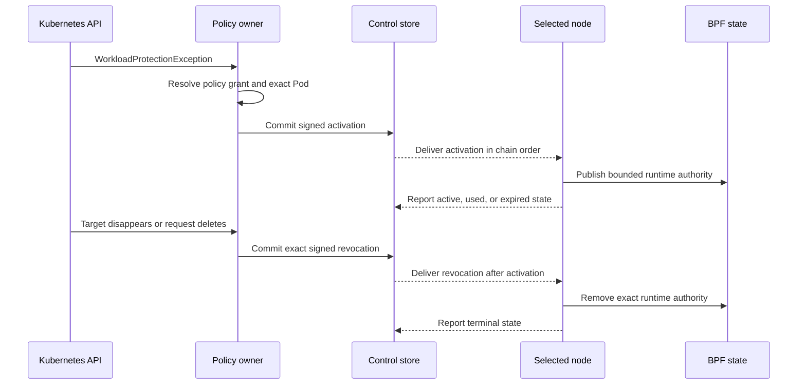
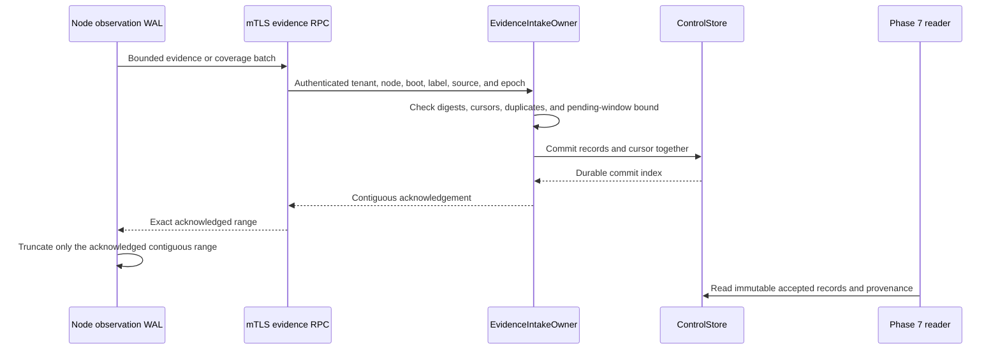
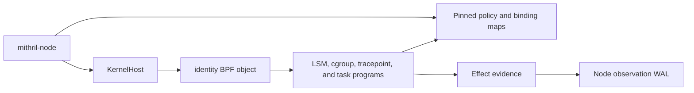

# Phase 6.2 Implementation Review Guide

Status: Current implementation guide. The source implements the separate
`WorkloadProtectionPolicy` and `WorkloadProtectionException` APIs. Automated
tests cover their closed schemas, lowering, reconciliation, delivery,
retirement, restart, and node-session boundaries. The current source has not
passed the complete physical procedure. The last physical run used the old API
and stopped under the superseded runtime-bootstrap model. The current source
implements the `PreparedContainer` trust boundary and the exact admitted-entry
default. The direct stock-runtime and focused protected Kubernetes
application-start results passed. The remaining physical matrix is not proved.

Plan: [Control Policy And Evidence Convergence](./phase-6-2-control-policy-and-evidence-convergence.md)

Design: [Validated readable architecture](./policy-and-protection-algorithm-architecture-readable.md)

## Review Goal

Verify that Kubernetes desired state has one Control owner. Verify that the
live `mithril-node` DaemonSet defines the eligible node set. Verify that the
Kubernetes scheduler selects the exact node. Verify that Control sends signed
workload material only to that node. Verify that the node holds the initial
container process until policy and cgroup-binding activation. Verify that one
durable Control transaction owns policy provenance, rollout state, trust state,
accepted evidence, and intake cursors. Verify that each node still owns its
physical generation and Berkeley Packet Filter (BPF) state.

Do not treat the deterministic two-node Control test as a physical two-node
kernel result. Do not claim that this work creates a Phase 7 graph or finding.
The BPF application binary interface (ABI) and BPF programs add one
`PreparedContainer` transition to the existing execution-set binding. They add
no runtime-object authority map or runtime-specific operation list. After
activation, cgroup membership alone grants no authority. The default requires
the exact admitted entry identity stored in the binding.

## Recommended Reading Order

1. Read the [Helm package contract](../../../packaging/mithril/helm/README.md),
   [DaemonSet](../../../packaging/mithril/helm/templates/daemonset.yaml),
   [webhook registrations](../../../packaging/mithril/helm/templates/admission-webhooks.yaml),
   and [Control RBAC](../../../packaging/mithril/helm/templates/control-rbac.yaml).
2. Read the [Kubernetes policy API](../../../crates/mithril-control/src/policy/kubernetes.rs),
   the [policy CRD](../../../packaging/mithril/helm/crds/mithril.erebor.dev_workloadprotectionpolicies.yaml),
   the [exception CRD](../../../packaging/mithril/helm/crds/mithril.erebor.dev_workloadprotectionexceptions.yaml),
   and the [API contract tests](../../../crates/mithril-control/tests/kubernetes_policy_api.rs).
3. Read the [Control configuration](../../../crates/mithril-control/src/config.rs)
   and [Control startup](../../../crates/mithril-control/src/main.rs).
4. Read the [DaemonSet node owner](../../../crates/mithril-control/src/policy/kubernetes_nodes.rs)
   and [Kubernetes workload admission](../../../crates/mithril-control/src/policy/kubernetes_workloads.rs).
5. Read the [policy desired-state and rollout owners](../../../crates/mithril-control/src/policy/reconciliation.rs)
   and the [exception desired-state owner](../../../crates/mithril-control/src/policy/kubernetes_exceptions.rs).
6. Read the [policy compiler](../../../crates/mithril-control/src/policy/compiler.rs),
   [signature types](../../../crates/mithril-control/src/policy/signature.rs), and
   [closed source types](../../../crates/mithril-control/src/policy/source.rs).
7. Read the [durable Control store](../../../crates/mithril-control/src/store.rs)
   and the [trust owner](../../../crates/mithril-control/src/trust.rs).
8. Read the [generated Control contract](../../../crates/mithril-control/proto/erebor/mithril/control/v1/control.proto),
   [service adapters](../../../crates/mithril-control/src/service.rs), and
   [server assembly](../../../crates/mithril-control/src/server.rs).
9. Read the [node configuration binding](../../../crates/mithril-node/src/config.rs),
   [node Control client](../../../crates/mithril-node/src/control.rs),
   [node policy delivery owner](../../../crates/mithril-node/src/policy_delivery.rs),
   [node event loop](../../../crates/mithril-node/src/node.rs), and
   [node generation owner](../../../crates/mithril-node/src/policy.rs).
10. Read the [OCI adapter](../../../crates/mithril-node/src/bin/mithril_oci_hook.rs),
    [runtime admission socket](../../../crates/mithril-node/src/runtime_admission.rs),
    [CRI identity verification](../../../crates/mithril-node/src/identity/runtime.rs),
    [cgroup binding owner](../../../crates/mithril-node/src/identity/binding.rs),
    [shared identity ABI](../../../crates/erebor-interceptor-abi/src/abi/identity.rs),
    [effect decision owner](../../../bpf/erebor-interceptor/programs/identity_effects.bpf.h),
    [network decision owner](../../../bpf/erebor-interceptor/programs/identity_network.bpf.h),
    and [PreparedContainer BPF owner](../../../bpf/erebor-interceptor/programs/identity_prepared_container.h).
11. Read the [Control evidence intake](../../../crates/mithril-control/src/evidence.rs)
   and [node observation WAL](../../../crates/mithril-node/src/observation/wal.rs).
12. Finish with the [Kubernetes API tests](../../../crates/mithril-control/tests/kubernetes_policy_api.rs),
   [reconciliation tests](../../../crates/mithril-control/tests/control_policy_reconciliation.rs),
   [contract test](../../../crates/mithril-control/tests/contract.rs), and
   [mutual Transport Layer Security tests](../../../crates/mithril-node/tests/control_tls.rs).

## Ownership Map

| State or effect | Creator | Only mutator | Durable location or effect boundary | Main proof |
| --- | --- | --- | --- | --- |
| Accepted policy source revision | `PolicyDesiredStateOwner` | `ControlStore` transaction | Append-only Control commit | Canonical CRD and offline source equality; stale UID and generation tests |
| Accepted exception and retirement revision | `PolicyDesiredStateOwner` | `ControlStore` transaction | Append-only Control commit | Bounded request, exact-target disappearance, replay, and tamper tests |
| Compiled and signed artifact | `PolicyDesiredStateOwner` | `ControlStore` transaction | Source-revision keyed artifact | Deterministic compile, signature, and issuer anti-rollback tests |
| Eligible node constraints | Kubernetes operator | Live `mithril-node` DaemonSet Pod template | Kubernetes DaemonSet | Empty, selector, affinity, and selector-change tests |
| Node readiness projection | `KubernetesNodeReadinessOwner` | `KubernetesNodeReadinessOwner` | Mithril Node label, annotations, and quarantine taint | No-session, ready-session, and selector-change tests |
| Protected Pod mutation and update validation | `KubernetesAdmissionOwner` | Kubernetes admission transaction | Persisted Pod affinity and Mithril annotations | Profile match, composition, reserved annotation, update bypass, and admission-patch tests |
| Exact scheduler binding | Kubernetes scheduler | Kubernetes API server | Pod UID and `spec.nodeName` | Binding validation code and physical manual oracle |
| Bound workload inventory | `KubernetesWorkloadInventoryOwner` | `ControlPlane` API-only inventory | Exact Pod, container, image, Node, and node-session facts | API-only authority and inventory drift tests |
| Target snapshot and node candidate | `PolicyRolloutOwner` | `ControlStore` transaction | Immutable snapshot, bundle, and rollout records | Target conflict, exact-node, mixed rollout, restart, and stale acknowledgement tests |
| Trust generation and acknowledgement | `TrustBundleOwner` | `ControlStore` transaction | Trust generation and boot-bound acknowledgement records | Rotation, revocation, restart, and current-trust gating tests |
| Node policy, exception, transfer, and cleanup state | `NodePolicyDeliveryOwner` | `NodePolicyDeliveryOwner` | Node state directory | Incremental transfer, exact readback, restart, session retirement, and terminal cleanup tests |
| Active node generation and BPF maps | `NodePolicyGenerationOwner` and existing activation path | `mithril-node` | Node-local inactive generation and active-pointer compare-and-swap | Readback, probe, pointer, and retained-generation tests |
| Runtime admission request | `mithril-oci-hook` and `RuntimeAdmissionClient` | `RuntimeAdmissionServer` | Root-owned mode-0600 Unix socket | Stock-state parser, active-owner, unavailable endpoint, convergence hold, and timeout tests |
| Staged runtime facts | First `createRuntime` request | `WorkloadBindingOwner` | Bounded node memory only; no kernel authority | Missing, expiry, changed-head, changed-cgroup, and no-PID-authority tests |
| Runtime container binding | `ScheduledRuntimeBindingV1` and node binding owner | Node binding owner | BPF cgroup and task maps plus node delivery state | Exact signed target, policy identity, CRI match, distinct lifetime, and reuse-rejection tests |
| Prepared-container state | Node binding owner publishes one held binding | BPF prepared-container transition | Exact binding, held host TGID, initial entry, deadline, and one exec activation | ABI, compiled-object, node transition, recovery, and required physical tests |
| Accepted evidence and coverage | `EvidenceIntakeOwner` | `ControlStore` transaction | Immutable records, coverage reports, and contiguous cursors | Duplicate, gap, reorder, backpressure, storage-failure, and restart tests |
| Node WAL truncation | Node WAL owner | Node WAL owner after durable Control acknowledgement | Node WAL | Durable contiguous acknowledgement and replay tests |
| Operational health | `ControlPlane` projection | Existing owners supply counts | Authenticated `ControlHealth.Get` response | Generated contract and bounded health snapshot tests |

The custom resource definition (CRD) stores desired state. It does not store a
signed node candidate or an activation acknowledgement. Control does not write
node BPF maps. A node does not watch the CRD. The scheduler selects the exact
node. Mithril admission only restricts the eligible set.

## Simplicity Review Decisions

The review assigned the admission listener and request dispatch to
`KubernetesAdmissionOwner`. It assigned the cluster inventory loop and exact
target construction to `KubernetesWorkloadInventoryOwner`. It assigned the
runtime socket lifecycle and request dispatch to `RuntimeAdmissionServer`,
client framing to `RuntimeAdmissionClient`, and signed target resolution to
`ScheduledRuntimeBindingV1`. These changes remove lifecycle free functions
from the reviewed paths.

`PolicyDesiredStateOwner` and `PolicyRolloutOwner` remain separate. The first
owner accepts and compiles durable source authority. The second owner derives
exact workload targets and advances node rollout state. A merge would combine
two authority and recovery boundaries in one large owner.

`RuntimeAdmissionServer` and `RuntimeAdmissionReceiver` also remain separate.
The server owns the socket and concurrent request tasks. The receiver gives
the node event loop one bounded request stream. A merge would couple socket
I/O to policy convergence without removing state or a handoff.

`WorkloadBindingOwner` owns first-hook stages because it already owns CRI
identity, cgroup lifetime, and held-root publication. A second stage owner
would duplicate the exact comparison and cleanup boundary. The OCI adapter
remains stateless and cannot grant authority.

The implementation already uses `schemars` and `kube` derives for the CRD,
`json-patch` for admission patches, and `serde` for closed protocol and state
types. The remaining private helpers implement bounded Kubernetes, cgroup, or
canonical-identity rules. A general-purpose replacement would not preserve
those fail-closed contracts. The review added no new abstraction package.

Comments identify non-obvious ownership, ordering, scheduler, replay, and
fail-closed decisions. Direct matches, validation expressions, and wiring do
not have comments that repeat the code.

## Policy Convergence Flow


The admission owner reads the live DaemonSet for each Node, Pod, and binding
decision. The Pod mutation combines the DaemonSet selector and required
affinity with the Pod's existing requirements. It adds the Control-owned ready
label. It rejects `spec.nodeName`, the quarantine toleration, and conflicting
selectors. It bounds the combined required-affinity terms. It reserves the
Mithril profile and source annotations. It does not choose one node.

The mutating Pod webhook runs only on CREATE. A validating webhook checks Pod
and ephemeral-container updates. An unprotected scheduled Pod cannot enter a
protected profile through an update. A protected Pod must keep its admitted
profile, source revision, selector match, and image-pin contract.

`KubernetesWorkloadInventoryOwner` lists all Pods, Nodes, Namespaces, and
Service Accounts. It accepts only persisted protected Pods with
`spec.nodeName`. It creates exact target facts for each matching container.
The facts bind the Pod UID, controller UID, ServiceAccount UID, digest-pinned
image, Node name, Node UID, node ID, boot ID, and label epoch. An inventory
change creates a new target snapshot without a policy source change.

`NodePolicy` uses resumable content-addressed chunks. A complete bundle is at
most the declared protocol bound. A partial transfer is not stageable. The node
reads each durable object by its exact digest before reuse. A node rejects
signed workload material for another node, boot, label epoch, profile, source
revision, or candidate.

The node checks the tenant, trust generation, signature, source digest,
candidate digest, artifact digests, issuer sequence, distribution sequence,
target, expiry, capabilities, and predecessor. A delayed acknowledgement
cannot change a newer candidate or a different boot session.

## Exception Convergence Flow



The exception owner accepts one namespaced request for one named base-policy
file grant. The request names one Pod UID and one container. Control derives
the selected node, boot, label epoch, active base generation, compiled cells,
deadline, and remaining use bound. The request cannot contain compiled keys,
digests, signatures, or node authority.

The accepted source stays accepted when its exact Pod target disappears.
Control commits a target-retirement transaction and signs a `REVOKE`
candidate for the original target. The store requires the latest complete
workload snapshot to prove that the target is absent. A partial inventory
cannot retire the target. A pending activation stays ahead of its revocation.
Reappearance does not activate the same exception object again. The operator
must create a new object UID.

## Node Eligibility Flow

Control reads `spec.template.spec.nodeSelector` and required node affinity from
the live `mithril-node` DaemonSet. Control rejects a DaemonSet that sets
`spec.nodeName` or uses an unsupported required-affinity operator. An empty
selector includes all nodes. There is no Control node-pool selector.

Node admission removes forged Mithril readiness and adds
`mithril.erebor.dev/not-ready:NoSchedule` to an eligible Node without a current
session. The DaemonSet tolerates this taint. The node supplies its Kubernetes
Node name through the downward API and authenticates with its unique mutual
Transport Layer Security identity. Control binds the node name and Node UID to
that session. Control adds readiness and removes quarantine only after the
current session reports kernel, identity, Control, and admission readiness.
The readiness projection requires the exact Node name and Node UID. A new Node
cannot inherit an old session through name reuse.

A session expiry removes readiness and restores quarantine. A same-name Node
UID replacement clears readiness, but it does not reset the physical policy
chain. Control creates an exact `REPLACE` candidate that names the live
predecessor and binds the new UID.

A higher label epoch is the physical reset boundary. The node opens the kernel
owner first and proves that old policy and exception authority is absent. The
node includes the canonical absence digest in its authenticated registration.
Control records the session advance, rejects old-epoch delivery and
acknowledgement messages, settles old exception state conservatively, and
permits a higher-sequence root activation. A lower label epoch or a different
boot ID at the same label epoch rejects. A normal reconnect keeps the same boot
ID and label epoch.

A DaemonSet selector change removes the Mithril projection from nodes that are
no longer eligible. The readiness owner removes both the ready label and the
Mithril quarantine taint because the node is outside the managed set. If the
node becomes eligible again, Control adds the quarantine taint before a new
ready session can remove it. A `NoSchedule` taint stops new scheduling. It does
not evict a running Pod or remove its last active local policy.

## Runtime Admission Flow

The Node Resource Interface (NRI) hook-injector supplies the Open Container
Initiative (OCI) hook calls. The node uses the Container Runtime Interface
(CRI) for live container facts. The host thread group identifier (TGID)
identifies the held initial process.

[runtime hook configuration](../../../packaging/mithril/helm/templates/runtime-hook-configmap.yaml) NRI CreateContainer injects two ordered Mithril `createRuntime` hooks
  -> [`request_with_cgroup`](../../../crates/mithril-node/src/bin/mithril_oci_hook.rs) the first hook stages immutable container, cgroup, image, and Pod facts
  -> [`stage_runtime_admission`](../../../crates/mithril-node/src/identity/binding.rs) the node stores one bounded stage and grants no runtime authority

[`RuntimeAdmissionServer`](../../../crates/mithril-node/src/runtime_admission.rs) The second OCI `createRuntime` hook holds the exact initial task
  -> [`verify_runtime_preparation`](../../../crates/mithril-node/src/identity/binding.rs) the node matches the staged facts and verifies CRI `Created` state
  -> [`prepare_runtime_start`](../../../crates/mithril-node/src/node.rs) the node verifies the scheduled Pod binding and active signed policy
  -> [`publish_held_activated_root`](../../../crates/mithril-node/src/identity/binding.rs) the node publishes `PreparedContainer` for the exact binding and held host TGID
  -> [`install_late_activation_target`](../../../crates/mithril-node/src/identity/binding.rs) the node reads back the binding and active generation
  -> [`RuntimeAdmissionEnvelope::deliver`](../../../crates/mithril-node/src/runtime_admission.rs) the hook returns allow

[`prepared_container_actor_is_exact`](../../../bpf/erebor-interceptor/programs/identity_prepared_container.h) Trusted runtime setup uses the exact prepared binding and initial runtime entry
  -> [`resolved_identity_effect_gate`](../../../bpf/erebor-interceptor/programs/identity_effects.bpf.h) BPF permits runtime implementation details without a runtime-specific operation list
  -> [`ExecutionSetBindingStateV1`](../../../crates/erebor-interceptor-abi/src/abi/identity.rs) runtime-created files, pipes, sockets, and handles receive no independent authority
  -> [`prepared_container_binding_is_prepared`](../../../bpf/erebor-interceptor/programs/identity_prepared_container.h) another binding, another entry, a later external root, or an expired state rejects

[`prepared_exec_policy_gate`](../../../bpf/erebor-interceptor/programs/identity_effects.bpf.h) The first application exec resolves through the active signed policy
  -> [`prepared_container_reserve_activation`](../../../bpf/erebor-interceptor/programs/identity_prepared_container.h) the exact task changes `PREPARED` to `EXEC_PENDING`
  -> [`prepared_container_commit_activation`](../../../bpf/erebor-interceptor/programs/identity_prepared_container.h) the successful process-exec tracepoint changes `EXEC_PENDING` to `ACTIVE`
  -> [`complete_failed_exec`](../../../bpf/erebor-interceptor/programs/identity_exec.bpf.h) a failed exec restores only its own reservation
  -> [`apply_effect_decision`](../../../bpf/erebor-interceptor/programs/identity_effects.bpf.h) explicit matching decisions run before the admitted-entry default
  -> [`prepared_container_application_actor_is_exact`](../../../bpf/erebor-interceptor/programs/identity_prepared_container.h) cgroup-only, external, and different entries cannot use the default

The node socket accepts only root peers. The socket parent is root-owned and
not group-writable or world-writable. The socket has mode `0600`.
`RuntimeAdmissionServer` rejects a second live owner and removes only a stale
socket. The server bounds the request size, queue, response size, and request
time.

The first call stores the exact container, cgroup, image, Pod, sandbox,
profile, and current authority-head facts for at most 30 seconds. The in-memory
table holds at most 128 records. The call makes no kernel or durable state
change. The second call must match that exact stage. It also verifies the live
full container ID, generation, working directory, and effective path.

The exact prepared entry is part of the node trusted computing base. BPF does
not infer the runtime from a `runc`, `crun`, or `youki` syscall sequence. A
runtime-internal exec that does not satisfy the signed policy remains
`PREPARED`. The binding has one 10-second monotonic deadline. The first exec
that satisfies the signed policy changes the binding to `ACTIVE` at exec
commit. No runtime-created object has a separate grant that can survive this
transition. The active application checks explicit decisions first. A matching
Deny blocks unless an applicable exception authorizes it. A missing decision
allows only for the exact admitted entry lineage.

A canonical request can stay pending while Control observes the binding and
the node receives the candidate. The node event loop continues policy delivery
during this hold. The socket retries the same immutable request until the
candidate becomes active or the absolute request deadline expires.

A container restart derives a new binding ID from the signed scheduling
authority and the new runtime container ID. The node retires the prior binding
before it publishes the replacement.

The runtime gate rejects malformed input, a missing or expired stage, a changed
stage, and an already-used runtime identity without authority publication. A
canonical request that has no exact local target stays pending only until the
bounded deadline. This rule also keeps an unknown but canonical identity
fail-closed. An unavailable socket, silent owner, identity mismatch, CRI
mismatch, publication failure, or persistence failure returns a nonzero hook
result. No source test replaces the physical stock-runtime ordering oracle.

The socket owner gives each request one absolute deadline and one cancellation
signal. The node checks cancellation before and after every awaited CRI step,
before and after kernel publication, after durable publication, and before it
returns the response. A late cancellation removes the new kernel binding and
restores the prior durable delivery state. The node marks itself unhealthy if
that rollback fails.

The node splits policy transfer, coverage, and acknowledgement work into
bounded steps. Each unary Control call has a local one-second deadline. While
the node waits for a unary reply, the event loop continues to answer runtime
admission. Trust and administrative streams keep their stream lifetime. They
do not use the unary deadline.

## Evidence Transaction Flow



The pending window contains at most 4,096 evidence records for one identity.
An out-of-order batch can become durable without advancing the contiguous
acknowledgement. A storage error withholds the acknowledgement. A conflicting
duplicate rejects. The intake owner does not close unknown coverage as healthy
and does not create graph edges or findings.

## Trust, Restart, And Deletion Flow

Trust generations and acknowledgements use the same store as policy and
evidence. A trust acknowledgement binds the node, generation, boot identity,
and label epoch. A revoked key cannot become current again. Policy and evidence
RPCs require the current trust generation for that node session.

Control rebuilds source, artifact, target, bundle, rollout, trust, evidence,
coverage, and cursor state by replaying the append-only commit chain. Each
commit binds its index, predecessor digest, transaction, and digest. Control
writes the file, calls `fsync`, renames it, and calls `fsync` on the parent
directory. A corrupt chain or incompatible record blocks store open.

CRD deletion and exact-target disappearance create signed restrictive-terminal
candidates. Each terminal candidate names the exact viable predecessor and
uses the normal node stage, readback, probe, and pointer path. Deletion alone
does not erase a node generation. Kubernetes deletion can keep the same object
generation. The store accepts only the exact accepted-to-deleting transition
at that generation. A complete relist retires a durable live source that is
absent from the API snapshot. A partial relist does not retire a source.

An active terminal acknowledgement can authorize chain cleanup only when no
later viable candidate depends on that terminal. Control stores this decision
in the acknowledgement transaction. The node stores the authorization before
it removes the terminal bundle, transfer state, active pointer, and generation.
Control then suppresses the closed chain from later inventory. A recreated
policy object receives a higher issuer sequence and a new root `ACTIVATE`.
If a successor already depends on the terminal, cleanup stays denied and the
node continues that predecessor chain. Rejected and stale descendants do not
become viable heads.

## Kubernetes And Tenancy Boundary

The CRD is namespaced, has one served storage version, and has a closed
structural schema with string, list, and object bounds. The supported write
path uses strict field validation and supplies the canonical submitted-spec
digest. Control rejects a stored spec that differs from that submitted digest.

Control derives tenant, cluster, and namespace identity from configuration and
API records. A policy field, annotation, label, or status cannot select its own
tenant. A matching policy in the Pod namespace selects protection. There is no
separate protected-tenant or protected-namespace configuration.

The Helm ClusterRole can read policies, exceptions, Namespaces, Pods,
ServiceAccounts, and Nodes across the cluster. It can patch policy and
exception status. It cannot create, update, patch, or delete desired state.
Separate writer roles own policy and exception input. The namespaced Role
restricts DaemonSet access to `mithril-node`. Control has Node patch permission
because built-in RBAC cannot grant field-level patch permission. The readiness
owner patches only the Mithril label, four identity annotations, and the
quarantine taint. The node service account has no token and no Kubernetes
permissions.

Status is a bounded projection. Policy status has the observed generation,
aggregate desired, active, updating, and failed counts, and standard
conditions. Exception status has the observed generation, one bounded state,
and standard conditions. Status has no digest, signature, receipt, compiled
cell, or per-node array. A status change cannot sign, distribute, activate, or
consume authority.

## Operational Health Boundary

`ControlHealth.Get` uses the existing mTLS listener. The caller needs an
enrolled, registered node session with the current trust generation. The reply
contains only fixed counters and booleans. It reports reconciliation work,
Control commit state, watch and relist state, compile results, target and
rollout counts, node session counts, and evidence cursor and pending counts.

The desired-state owner processes one cluster-wide CRD watch. It relists after
a watch closure or compaction. `KubernetesWorkloadInventoryOwner` uses one
bounded cluster inventory loop. The Node readiness owner reads every page of
the Node snapshot before it starts a watch. `watch_healthy` is true only when
the cluster watch is active after a successful relist.

## Packaging Boundary

The chart mounts one host-provisioned node configuration and mTLS identity on
each selected host. The downward API overrides the Kubernetes Node name. In
Kubernetes mode, the node reads `/proc/self/cgroup` and binds the
effect-controller cgroup to its actual DaemonSet Pod lifetime. One static Pod
cgroup path is not accepted as scheduling authority.

The Control Deployment mounts its configuration, durable volume, and separate
admission TLS Secret. The admission certificate authenticates
`mithril-control.<namespace>.svc`. The chart requires the CA bundle and registers
fail-closed Node mutation, Pod CREATE mutation, Pod UPDATE validation, and
Pod-binding validation webhooks. Kubernetes and server request timeouts are
bounded. The chart rejects an OCI client timeout that has no outer runtime
margin. The HTTPS `/healthz` route contains no policy payload.

The node image contains `mithril-node` and `mithril-oci-hook`. A chart-owned
host installer publishes each path by atomic same-directory rename. It installs
the binary and two ordered `createRuntime` hook documents. Cleanup removes the
fact stage before the preparation hook and the binary. Adjacent ownership
markers bind the three exact paths to the Helm release. Disable and uninstall
remove only matching owned paths. A bounded pre-delete cleanup Job waits for
selected-node cleanup before it deletes the cleanup DaemonSet. Foreign or
unmarked files fail closed and stay in place.

CRI-O can consume the standard hook directory. Containerd needs the stock Node
Resource Interface hook-injector. The chart does not patch the container
runtime and does not install a custom runtime binary.

## BPF Boundary

This phase adds the bounded `PreparedContainer` state to the BPF ABI and the
existing identity BPF object. Userspace publishes it through the existing
[`KernelHost`](../../../crates/erebor-interceptor/src/host.rs). BPF owns the
initial-entry claim, deadline, exec reservation, and application activation.
The Linux Security Module (LSM) effect programs remain in the
[`identity` BPF object](../../../bpf/erebor-interceptor/programs/identity.bpf.c).



| Map | Key and value ABI | Userspace writer | BPF writer | Readers | Lifetime |
| --- | --- | --- | --- | --- | --- |
| `active_profile_generations` | `Id128V1 -> u64` | Node policy generation owner | None | Node binding owner and effect gates | Pinned for the current kernel owner; terminal cleanup removes the exact profile pointer |
| `profile_generation_descriptors` | `u64 -> ProfileGenerationDescriptorV1` | Node policy generation owner | None | Node recovery, binding owner, and effect gates | Pinned until generation retirement and reference readback permit removal |
| `execution_set_bindings` | `u64 cgroup ID -> ExecutionSetBindingStateV1` | Node binding owner | Task lifecycle and prepared-container programs update exact transitions | Node recovery and effect gates | Pinned for the exact runtime cgroup lifetime |
| `binding_activation_targets` | `BindingActivationTargetKeyV1 -> ExecutionSetBindingStateV1` | Node binding owner | None | Node recovery and runtime gate | Pinned until the exact binding and generation retire |
| `exception_runtime_states` | `ExceptionRuntimeStateKeyV1 -> ExceptionRuntimeStateV1` | Node exception owner | Effect gate consumes uses under the map value lock | Node recovery and exception gate | Pinned until the instance is terminal and durable receipts permit cleanup |
| `exception_handle_bindings` | `ExceptionHandleBindingKeyV1 -> ExceptionHandleBindingV1` | Node policy and exception owners | None | Exception gate and recovery | Pinned for the exact compiled handle and active instance |
| `exception_use_receipts` | Receipt identity -> bounded use receipt | Node exception receipt owner | Effect gate emits use receipts | Node receipt recovery | Pinned until the durable exception WAL records the receipt |

| Prepared-container program group | Hook and context | Reads and writes | Physical result |
| --- | --- | --- | --- |
| Initial-entry claim | `lsm/task_alloc` and the first protected effect | Reads the cgroup binding and held host TGID. Writes the task, entry, process, and exact prepared-entry identity. | A TGID mismatch or failed state publication returns the configured denial. |
| Runtime effect gate | Existing file, network, IPC, process, device, privilege, and mount LSM hooks | Reads the exact binding, entry, generation, and deadline. It writes no runtime-object authority. | The exact prepared entry can finish setup. All other protected actors use normal policy or receive the configured denial. |
| Exec evaluation | `lsm/bprm_check_security` | Reads the active signed policy. Writes the pending exec and reserves the exact task only for a policy-permitted exec. | A runtime-internal policy miss stays `PREPARED`. A policy-permitted exec can continue as `EXEC_PENDING`. |
| Exec completion | `tracepoint/sched/sched_process_exec` and exec syscall exit tracepoints | Commits `ACTIVE` after a successful exec or restores `PREPARED` after a pre-commit failure. | `ACTIVE` closes prepared-runtime trust. A corrupt or expired transition stays fail-closed. |
| Active application effect | Existing file, network, IPC, process, device, privilege, mount, exec, and io_uring hooks | Resolves explicit signed decisions and the stored admitted entry identity. | An explicit matching Deny blocks before the default. An applicable exception can authorize that Deny. A missing decision allows only for the exact admitted entry. |
| Binding retirement | `raw_tracepoint/cgroup_release` | Changes a non-active prepared state to `EXPIRED` and clears the exec cookie. | The released cgroup cannot start or continue prepared-runtime work. |

A bpffs pin keeps a map or link alive after the loader process exits. A
process restart does not remove a pin. `KernelHost` validates and reuses the
owned pin set. The node delivery and generation owners remove only exact rows
after readback proves that their authority is terminal. A boot loses the bpffs
objects. Startup then requires the old-session absence proof before Control can
open a new root chain.

The ABI readers use `FromBytes::read_from_bytes` for all-bit-valid exact-size
values such as `u64`. They use `TryFromBytes::try_read_from_bytes` for types
that contain checked enum states. Both methods reject the wrong byte size. A
rejected value becomes a typed node identity or policy error before a map
change. Review the exact map declarations and effect-gate lookups in
[`identity_maps.h`](../../../bpf/erebor-interceptor/programs/identity_maps.h).

## ABI And Protocol Boundary

This implementation adds the Kubernetes source types, Control store records,
policy delivery messages, one authenticated health method, and the internal
`PreparedContainer` ABI states. It uses the generated
`erebor.mithril.control.v1` contract. It does not add a public policy field,
generic envelope, frame protocol, or compatibility dispatcher.

The BPF change reuses existing Linux Security Module (LSM), lifecycle, and
exec hooks. It adds checked fields to the existing execution-set binding and
pending-exec values. It does not add a runtime-object map. The evidence record
and coverage messages remain the Phase 6 types.

## Failure Boundaries

| Input or failure | Required behavior |
| --- | --- |
| Missing or invalid live DaemonSet constraints | Node, Pod, or binding admission rejects; stale readiness cannot authorize a new protected Pod |
| Node without an exact current name-and-UID session | Control removes readiness and adds the quarantine taint |
| Protected Pod with `spec.nodeName`, quarantine toleration, reserved annotation, or excessive affinity product | Pod admission rejects before persistence |
| Pod or ephemeral-container update changes protection state | Validating admission rejects the update and keeps scheduling unchanged |
| Scheduler selects an ineligible or stale Node | Binding admission rejects before the binding persists |
| Unknown or silently pruned CRD field | Strict decode or submitted-spec digest rejects before compilation |
| Stale UID, generation, historical replay, or watch event | Durable source ordering rejects; the prior valid rollout remains |
| Duplicate policy match or exact workload claim | Conflict rejects; no precedence rule selects a winner |
| Compile or signature failure | No candidate or rollout is created for that source revision |
| Partial or corrupt bundle | Node does not create a stageable pending activation |
| Wrong tenant, target, boot, label, trust, or sequence | Service or node rejects before rollout advancement |
| First `createRuntime` facts exceed stage bounds | The node records no stage and publishes no kernel state |
| Early valid second `createRuntime` request | The socket holds the request while the exact candidate converges, within the configured deadline |
| Missing, expired, or changed first stage | The second hook rejects before CRI inspection or kernel publication |
| Missing candidate, silent node owner, or second socket owner | The bounded socket or OCI deadline returns denial; the runtime does not receive an allow result |
| Malformed, mismatched, changed, or reused runtime identity | The node rejects without publishing or reusing a binding |
| `PreparedContainer` deadline, held-TGID mismatch, wrong binding, wrong entry, or later external root | BPF denies and does not activate the application |
| Runtime-created object after `ACTIVE` | The effect checks explicit policy and exception authority, then uses the exact admitted-entry default when no decision matches; no prepared-state grant remains |
| Mixed rollout | Status reports exact per-state counts; it does not claim global activation |
| Exact target disappears while an exception is active | Control keeps the source accepted and sends an exact signed revocation; it does not refund uses or retarget the request |
| Runtime admission caller cancels after publication starts | The node removes the exact new binding and restores the prior durable state; an incomplete rollback closes readiness |
| Node disconnect or Control outage | The last valid node generation stays active |
| Same-name Node gets a new UID | Readiness closes until the new API object binds; the next policy candidate names the live physical predecessor |
| Higher label epoch after proved map loss | Control stales the old session and permits a higher-sequence root; old-epoch delivery and acknowledgements reject |
| Watch closure or compaction | Control completes every list page, retires absent durable sources, and starts a new watch. A partial relist retires nothing |
| Control restart | The store replays the commit chain; in-memory watch state is rebuilt |
| CRD deletion or forced object removal | A Deleted event or complete relist creates retirement. No direct BPF removal occurs; only a valid signed retirement can change node policy |
| Active terminal has no viable successor | The acknowledgement authorizes durable node cleanup and Control suppresses the closed chain from inventory |
| Evidence gap within the bound | Batch stays pending; the contiguous acknowledgement does not advance |
| Evidence storage failure | No acknowledgement returns; the node keeps its WAL records |
| Conflicting evidence duplicate | Intake rejects and preserves the first immutable record |
| Health request from an untrusted session | mTLS, registration, or current-trust checks reject |

## Verification Map

| Proof | Source |
| --- | --- |
| Closed CRD, generated manifest equality, canonical source equality, silent-prune rejection, and status bound | [Kubernetes policy API tests](../../../crates/mithril-control/tests/kubernetes_policy_api.rs) |
| DaemonSet derivation, complete Node snapshot, scheduler choice, quarantine, exact Node UID readiness, empty constraints, and selector change | [Kubernetes node tests](../../../crates/mithril-control/src/policy/kubernetes_nodes.rs) |
| Policy match, additive and bounded Pod constraints, reserved annotations, Pod update bypass rejection, selector-consistent image pinning, admission patch, and health | [Kubernetes workload tests](../../../crates/mithril-control/src/policy/kubernetes_workloads.rs) |
| Policy and exception create, update, conflict, stale state, target disappearance, chain order, node UID rebind, physical epoch reset, terminal cleanup, restart, and tamper rejection | [Control reconciliation tests](../../../crates/mithril-control/tests/control_policy_reconciliation.rs) |
| Exact generated gRPC inventory, including `ControlHealth.Get` | [Control contract test](../../../crates/mithril-control/tests/contract.rs) |
| Commit chain, compare-and-swap transitions, evidence atomicity, pending bounds, restart replay, and trust persistence | [Control store tests](../../../crates/mithril-control/src/store.rs) |
| Evidence identity, duplicate, reorder, cursor, coverage, and stable Phase 7 query | [Evidence intake tests](../../../crates/mithril-control/src/evidence.rs) |
| Trust install, acknowledgement, revocation, anti-rollback, and restart | [Trust owner tests](../../../crates/mithril-control/src/trust.rs) |
| mTLS identity, boot session, trust gate, policy chunk, acknowledgement, evidence, and service isolation | [Control TLS tests](../../../crates/mithril-node/tests/control_tls.rs) |
| Incremental chunk assembly, signature and digest checks, pending recovery, old-session cleanup, terminal cleanup, exact target inspection, and acknowledgement replay | [Node policy delivery tests](../../../crates/mithril-node/src/policy_delivery.rs) |
| Existing inactive generation, readback, probes, and pointer activation | [Node policy tests](../../../crates/mithril-node/src/policy.rs) |
| Signed scheduling authority, exact policy and runtime identity, immutable two-hook stage matching, held-TGID publication, distinct container lifetime, active socket ownership, convergence hold, unavailable endpoint, and timeout denial | [Runtime admission and binding tests](../../../crates/mithril-node/src/identity/binding.rs) |
| OCI state parsing, cgroup-v2 path parsing, fact-only first hook, and held-PID second hook | [OCI adapter tests](../../../crates/mithril-node/src/bin/mithril_oci_hook.rs) |
| Direct stock-runc PREPARED-to-ACTIVE transition, admitted-entry default, absent dependency rules, and cleanup | [Stock-runc VM probe](../../../crates/mithril-e2e/src/effect/runc.rs) |
| Fresh protected Pod, exact target and runtime binding, admitted-entry default, explicit matching Deny, and retained-cluster resource replacement | [Protected-start lane](../../../crates/mithril-e2e/harness/vm/two-node-convergence.sh) |
| Webhook TLS, rules, deadlines, health probes, DaemonSet identity and hook inputs, and least-privilege RBAC | [Helm render test](../../../packaging/mithril/helm/tests/verify.sh) |
| Exact two-node target, task lifetime, Node UID replacement, host epoch, selector lifecycle, exception target retirement, terminal cleanup, and no-root replay | [Physical fixture](../../../crates/mithril-e2e/harness/vm/two-node-convergence.sh) |
| Independent operator flow for exact target, runtime lifetime, exception target retirement, terminal cleanup, restart, and fresh root | [Manual example](../../../examples/mithril-kubernetes-convergence-manual/run.sh) |

Current focused checks passed:

```text
rtk bash .github/scripts/verify-rust-ci.sh
The current-source format, workspace check, strict Clippy, and full workspace
test gate passed.

rtk bash packaging/mithril/helm/tests/verify.sh
Hook ownership checks passed. One chart linted. The render contract passed.

rtk bash crates/mithril-e2e/harness/vm/test.sh
VM harness behavior checks passed.

rtk bash examples/mithril-kubernetes-convergence-manual/test.sh
Manual example behavior checks passed.
```

The direct stock-runc VM probe also passed with runc 1.3.4. Its result records
libc and the ELF loader as root-filesystem dependencies that are absent from
policy.

The focused protected-start lane passed on Kubernetes v1.35.5+k3s1 and
containerd 2.2.3-k3s1. It reused the two owned VMs and their K3s cluster. It
removed the prior Mithril and protected-workload resources before it installed
their replacements. Fresh Pod UID
`491f2f7d-4ee3-41fc-ac63-d5b5d80b6cd4` activated policy revision
`320cbb30d5da57262e156cfbb4823009eaec5ba67b40a5ba05b659e67d40449f`.
The admitted entry received default authority for an unlisted action. The
explicit matching Deny blocked the protected target. Exact object matching was
not requested. The result is
`/tmp/phase-6-2-kubernetes-default-allow-20260825-run10/protected-start-result.json`.

These checks execute production owners and fixture command paths. The shell
behavior suites do not parse Rust or shell source as a capability oracle. They
do not replace the physical fixture or manual run.

## Verification Limits

The current source has not passed the complete physical two-node fixture or
the independent manual example. The direct stock-runc and focused protected
Kubernetes application-start lanes have passed. Both complete Kubernetes
flows contain exact target, runtime task, exception target-retirement,
terminal cleanup, restart, and fresh-root oracles. The automated fixture also
contains same-name Node UID replacement, DaemonSet exclusion and re-entry, and
a host boot and label-epoch change.
The cases after protected application start remain `Not run` until a physical
execution records their results.

The last physical two-node run used the superseded flattened API and runtime
boundary. It passed
readiness, typed RBAC review, admission mutation and bypass rejection,
scheduler selection, selected-node delivery, policy activation, runtime
binding, Control acknowledgement, and durable evidence intake. Stock `runc`
then used an anonymous file write and IPC access that have no typed authority.
BPF denied both operations. The runtime reported start failure. The application
did not run.

The previous stock-runtime failure remains the regression oracle. The direct
lane now closes that regression without a runtime-specific operation list,
dependency allow rules, or an object-authority map. The focused protected
Kubernetes start also closes the application-start regression through the
production Kubernetes path. Watch-compaction, network-partition,
storage-outage, and physical evidence failure variants remain `Not run`. There
is no new performance result.

This work adds no Appendix C fixture ID. Phase 7 graph and finding behavior is
not present.

## Reviewer Checklist

- [ ] Compare the generated CRD with the committed Helm CRD.
- [ ] Change the DaemonSet selector and trace the readiness projection change.
- [ ] Replace a Node UID under the same name and verify that readiness does not transfer.
- [ ] Verify that Pod admission composes constraints and does not set `spec.nodeName`.
- [ ] Verify that Pod and ephemeral-container updates cannot add, remove, or replace protection.
- [ ] Trace the scheduler-selected Pod binding through current-session validation.
- [ ] Trace one CRD generation into one immutable source revision.
- [ ] Trace one persisted Pod UID and selected Node into one target snapshot.
- [ ] Trace one source revision through compilation, signature, and exact-node delivery.
- [ ] Verify that a duplicate profile or workload claim creates no candidate.
- [ ] Trace one candidate through bounded chunks and exact node digest readback.
- [ ] Trace node activation through inactive state, probes, and one pointer compare-and-swap.
- [ ] Trace one held OCI PID through CRI verification and exact cgroup publication.
- [ ] Verify that the binding readback contains the exact held host TGID.
- [ ] Trace `PREPARED` through a runtime-internal exec that does not satisfy policy.
- [ ] Trace a policy-approved exec through `EXEC_PENDING` to `ACTIVE`.
- [ ] Verify that a runtime-created pipe or handle has no prepared-state grant after `ACTIVE`.
- [ ] Verify that the exact admitted entry receives default allow when no decision matches.
- [ ] Move an unlabeled or external task into the cgroup and verify fail-closed denial.
- [ ] Verify that a missing candidate stays pending only until the runtime deadline.
- [ ] Verify that a second runtime socket owner cannot replace the live node owner.
- [ ] Verify that container restart retires the old runtime binding.
- [ ] Verify that Control changes rollout state only after the exact authenticated acknowledgement.
- [ ] Trace one evidence retry from the node WAL to a durable contiguous acknowledgement.
- [ ] Verify that an out-of-order evidence batch does not advance the acknowledgement.
- [ ] Restart Control and compare the rebuilt source, rollout, trust, evidence, and cursor state.
- [ ] Trace terminal acknowledgement, cleanup authorization, empty inventory,
      restart, no closed-root replay, and fresh-root recreation.
- [ ] Remove an exception target and verify exact revocation without use refund.
- [ ] Verify that a complete relist retires a missing source and a partial relist does not.
- [ ] Inspect the health reply and confirm that it contains no policy, evidence, or secret payload.
- [ ] Confirm that no Control path writes BPF maps or the node active pointer.
- [ ] Confirm that the node service account has no token or Kubernetes RBAC.
- [ ] Run the final repository gate after any Rust change.

## Source State

This guide covers the current phase branch after the policy API, exception,
rollout, node-session, node cleanup, Helm hook, automated fixture, and manual
example deliverables. Reviewers must compare the guide with the checked-out
source. The physical verification limits above remain part of the result.

Completion of this work does not authorize the next phase.
