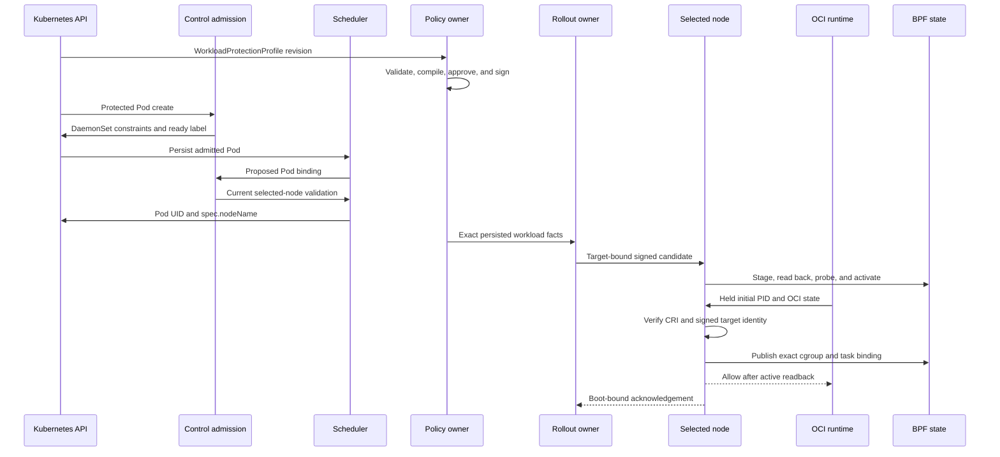
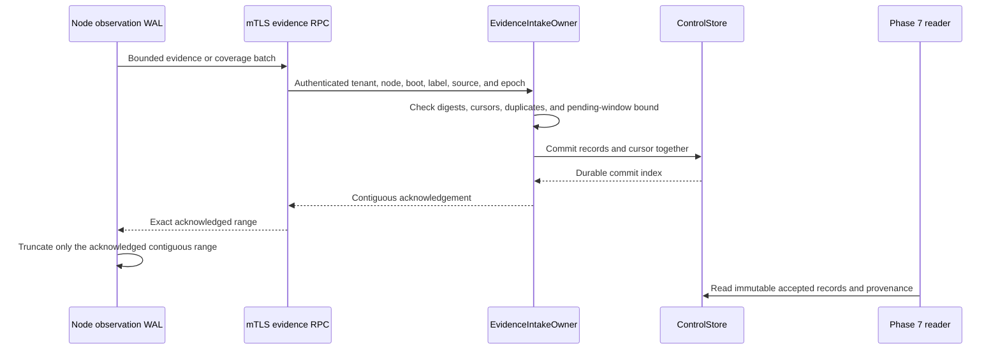

# Phase 6.2 Implementation Review Guide

Status: Source implementation and automated acceptance are complete at code
commit `781ee425320ce75cd6b7bf786e06cb23f36b6b91`. The final repository gate
passed on 2026-08-22. The
[manual runbook](./manual-testing/phase-6-2-manual-acceptance.md) has not run.

Plan: [Control Policy And Evidence Convergence](./phase-6-2-control-policy-and-evidence-convergence.md)

Design: [Validated readable architecture](./policy-and-protection-algorithm-architecture-readable.md)

## Review Goal

Verify that Kubernetes desired state has one Control owner. Verify that the
live `mithril-node` DaemonSet defines the eligible node set. Verify that the
Kubernetes scheduler selects the exact node. Verify that Control sends signed
workload material only to that node. Verify that the node holds the initial
container process until policy and cgroup-binding activation. Verify that one
durable Control transaction owns policy provenance, rollout state, trust state,
accepted evidence, and intake cursors. Verify that each node still owns its
physical generation and Berkeley Packet Filter (BPF) state.

Do not treat the deterministic two-node Control test as a physical two-node
kernel result. Do not claim that this work creates a Phase 7 graph or finding.
The BPF ABI and BPF programs did not change.

## Recommended Reading Order

1. Read the [Helm package contract](../../../packaging/mithril/helm/README.md),
   [DaemonSet](../../../packaging/mithril/helm/templates/daemonset.yaml),
   [webhook registrations](../../../packaging/mithril/helm/templates/admission-webhooks.yaml),
   and [Control RBAC](../../../packaging/mithril/helm/templates/control-rbac.yaml).
2. Read the [Kubernetes policy API](../../../crates/mithril-control/src/policy/kubernetes.rs),
   the [committed CRD](../../../packaging/mithril/helm/crds/mithril.erebor.dev_workloadprotectionprofiles.yaml),
   and the [desired-state owner](../../../crates/mithril-control/src/policy/reconciliation.rs).
3. Read the [Control configuration](../../../crates/mithril-control/src/config.rs)
   and [Control startup](../../../crates/mithril-control/src/main.rs).
4. Read the [DaemonSet node owner](../../../crates/mithril-control/src/policy/kubernetes_nodes.rs)
   and [Kubernetes workload admission](../../../crates/mithril-control/src/policy/kubernetes_workloads.rs).
5. Read the [desired-state and rollout owners](../../../crates/mithril-control/src/policy/reconciliation.rs).
6. Read the [policy compiler](../../../crates/mithril-control/src/policy/compiler.rs),
   [signature types](../../../crates/mithril-control/src/policy/signature.rs), and
   [closed source types](../../../crates/mithril-control/src/policy/source.rs).
7. Read the [durable Control store](../../../crates/mithril-control/src/store.rs)
   and the [trust owner](../../../crates/mithril-control/src/trust.rs).
8. Read the [generated Control contract](../../../crates/mithril-control/proto/erebor/mithril/control/v1/control.proto),
   [service adapters](../../../crates/mithril-control/src/service.rs), and
   [server assembly](../../../crates/mithril-control/src/server.rs).
9. Read the [node configuration binding](../../../crates/mithril-node/src/config.rs),
   [node Control client](../../../crates/mithril-node/src/control.rs),
   [node policy delivery owner](../../../crates/mithril-node/src/policy_delivery.rs),
   [node event loop](../../../crates/mithril-node/src/node.rs), and
   [node generation owner](../../../crates/mithril-node/src/policy.rs).
10. Read the [OCI adapter](../../../crates/mithril-node/src/bin/mithril_oci_hook.rs),
    [runtime admission socket](../../../crates/mithril-node/src/runtime_admission.rs),
    [CRI identity verification](../../../crates/mithril-node/src/identity/runtime.rs),
    and [cgroup binding owner](../../../crates/mithril-node/src/identity/binding.rs).
11. Read the [Control evidence intake](../../../crates/mithril-control/src/evidence.rs)
   and [node observation WAL](../../../crates/mithril-node/src/observation/wal.rs).
12. Finish with the [Kubernetes API tests](../../../crates/mithril-control/tests/kubernetes_policy_api.rs),
   [reconciliation tests](../../../crates/mithril-control/tests/control_policy_reconciliation.rs),
   [contract test](../../../crates/mithril-control/tests/contract.rs), and
   [mutual Transport Layer Security tests](../../../crates/mithril-node/tests/control_tls.rs).

## Ownership Map

| State or effect | Creator | Only mutator | Durable location or effect boundary | Main proof |
| --- | --- | --- | --- | --- |
| Accepted policy source revision | `PolicyDesiredStateOwner` | `ControlStore` transaction | Append-only Control commit | Canonical CRD and offline source equality; stale UID and generation tests |
| Compiled and signed artifact | `PolicyDesiredStateOwner` | `ControlStore` transaction | Source-revision keyed artifact | Deterministic compile, signature, and issuer anti-rollback tests |
| Eligible node constraints | Kubernetes operator | Live `mithril-node` DaemonSet Pod template | Kubernetes DaemonSet | Empty, selector, affinity, and selector-change tests |
| Node readiness projection | `KubernetesNodeReadinessOwner` | `KubernetesNodeReadinessOwner` | Mithril Node label, annotations, and quarantine taint | No-session, ready-session, and selector-change tests |
| Protected Pod mutation and update validation | `KubernetesAdmissionOwner` | Kubernetes admission transaction | Persisted Pod affinity and Mithril annotations | Profile match, composition, reserved annotation, update bypass, and admission-patch tests |
| Exact scheduler binding | Kubernetes scheduler | Kubernetes API server | Pod UID and `spec.nodeName` | Binding validation code and physical manual oracle |
| Bound workload inventory | `KubernetesWorkloadInventoryOwner` | `ControlPlane` in-memory inventory | Exact Pod, container, image, Node, and node-session facts | Same-policy inventory drift test |
| Target snapshot and node candidate | `PolicyRolloutOwner` | `ControlStore` transaction | Immutable snapshot, bundle, and rollout records | Target conflict, exact-node, mixed rollout, restart, and stale acknowledgement tests |
| Trust generation and acknowledgement | `TrustBundleOwner` | `ControlStore` transaction | Trust generation and boot-bound acknowledgement records | Rotation, revocation, restart, and current-trust gating tests |
| Node policy cache and pending activation | `NodePolicyDeliveryOwner` | `NodePolicyDeliveryOwner` | Node state directory | Partial transfer, digest readback, restart, and acknowledgement replay tests |
| Active node generation and BPF maps | `NodePolicyGenerationOwner` and existing activation path | `mithril-node` | Node-local inactive generation and active-pointer compare-and-swap | Readback, probe, pointer, and retained-generation tests |
| Runtime admission request | `mithril-oci-hook` and `RuntimeAdmissionClient` | `RuntimeAdmissionServer` | Root-owned mode-0600 Unix socket | Stock-state parser, active-owner, unavailable endpoint, convergence hold, and timeout tests |
| Runtime container binding | `ScheduledRuntimeBindingV1` and node binding owner | Node binding owner | BPF cgroup and task maps plus node delivery state | Exact signed target, policy identity, CRI match, distinct lifetime, and reuse-rejection tests |
| Accepted evidence and coverage | `EvidenceIntakeOwner` | `ControlStore` transaction | Immutable records, coverage reports, and contiguous cursors | Duplicate, gap, reorder, backpressure, storage-failure, and restart tests |
| Node WAL truncation | Node WAL owner | Node WAL owner after durable Control acknowledgement | Node WAL | Durable contiguous acknowledgement and replay tests |
| Operational health | `ControlPlane` projection | Existing owners supply counts | Authenticated `ControlHealth.Get` response | Generated contract and bounded health snapshot tests |

The custom resource definition (CRD) stores desired state. It does not store a
signed node candidate or an activation acknowledgement. Control does not write
node BPF maps. A node does not watch the CRD. The scheduler selects the exact
node. Mithril admission only restricts the eligible set.

## Simplicity Review Decisions

The review assigned the admission listener and request dispatch to
`KubernetesAdmissionOwner`. It assigned the cluster inventory loop and exact
target construction to `KubernetesWorkloadInventoryOwner`. It assigned the
runtime socket lifecycle and request dispatch to `RuntimeAdmissionServer`,
client framing to `RuntimeAdmissionClient`, and signed target resolution to
`ScheduledRuntimeBindingV1`. These changes remove lifecycle free functions
from the reviewed paths.

`PolicyDesiredStateOwner` and `PolicyRolloutOwner` remain separate. The first
owner accepts and compiles durable source authority. The second owner derives
exact workload targets and advances node rollout state. A merge would combine
two authority and recovery boundaries in one large owner.

`RuntimeAdmissionServer` and `RuntimeAdmissionReceiver` also remain separate.
The server owns the socket and concurrent request tasks. The receiver gives
the node event loop one bounded request stream. A merge would couple socket
I/O to policy convergence without removing state or a handoff.

The implementation already uses `schemars` and `kube` derives for the CRD,
`json-patch` for admission patches, and `serde` for closed protocol and state
types. The remaining private helpers implement bounded Kubernetes, cgroup, or
canonical-identity rules. A general-purpose replacement would not preserve
those fail-closed contracts. The review added no new abstraction package.

Comments remain limited to behavior that is not clear from the type or
operation, such as Kubernetes deletion retaining the last generation.

## Policy Convergence Flow



The admission owner reads the live DaemonSet for each Node, Pod, and binding
decision. The Pod mutation combines the DaemonSet selector and required
affinity with the Pod's existing requirements. It adds the Control-owned ready
label. It rejects `spec.nodeName`, the quarantine toleration, and conflicting
selectors. It bounds the combined required-affinity terms. It reserves the
Mithril profile and source annotations. It does not choose one node.

The mutating Pod webhook runs only on CREATE. A validating webhook checks Pod
and ephemeral-container updates. An unprotected scheduled Pod cannot enter a
protected profile through an update. A protected Pod must keep its admitted
profile, source revision, selector match, and image-pin contract.

`KubernetesWorkloadInventoryOwner` lists all Pods, Nodes, Namespaces, and
Service Accounts. It accepts only persisted protected Pods with
`spec.nodeName`. It creates exact target facts for each matching container.
The facts bind the Pod UID, controller UID, ServiceAccount UID, digest-pinned
image, Node name, Node UID, node ID, boot ID, and label epoch. An inventory
change creates a new target snapshot without a policy source change.

`NodePolicy` uses resumable content-addressed chunks. A complete bundle is at
most the declared protocol bound. A partial transfer is not stageable. The node
reads each durable object by its exact digest before reuse. A node rejects
signed workload material for another node, boot, label epoch, profile, source
revision, or candidate.

The node checks the tenant, trust generation, signature, source digest,
candidate digest, artifact digests, issuer sequence, distribution sequence,
target, expiry, capabilities, and predecessor. A delayed acknowledgement
cannot change a newer candidate or a different boot session.

## Node Eligibility Flow

Control reads `spec.template.spec.nodeSelector` and required node affinity from
the live `mithril-node` DaemonSet. Control rejects a DaemonSet that sets
`spec.nodeName` or uses an unsupported required-affinity operator. An empty
selector includes all nodes. There is no Control node-pool selector.

Node admission removes forged Mithril readiness and adds
`mithril.erebor.dev/not-ready:NoSchedule` to an eligible Node without a current
session. The DaemonSet tolerates this taint. The node supplies its Kubernetes
Node name through the downward API and authenticates with its unique mutual
Transport Layer Security identity. Control binds the node name and Node UID to
that session. Control adds readiness and removes quarantine only after the
current session reports kernel, identity, Control, and admission readiness.
The readiness projection requires the exact Node name and Node UID. A new Node
cannot inherit an old session through name reuse.

A session expiry or boot change removes readiness and restores quarantine. A
DaemonSet selector change removes the Mithril projection from nodes that are no
longer eligible. A `NoSchedule` taint stops new scheduling. It does not evict a
running Pod or remove its last active local policy.

## Runtime Admission Flow

The chart installs a stateless Open Container Initiative (OCI) prestart adapter
and a protected-Pod annotation filter. The adapter reads one bounded stock OCI
state object from standard input. It derives the live cgroup from
`/proc/<pid>/cgroup`. It sends the container ID, initial PID, cgroup, and OCI
annotations to the node socket. The adapter has a client deadline. The OCI
hook entry has a larger runtime deadline.

The node socket accepts only root peers. The socket parent is root-owned and
not group-writable or world-writable. The socket has mode `0600`.
`RuntimeAdmissionServer` rejects a second live owner and removes only a stale
socket. The server bounds the request size, queue, response size, and request
time.

One early valid hook call stays pending while Control observes the binding and
the node polls for the candidate. The node event loop continues policy delivery
during this hold. The node returns `POLICY_CONVERGENCE_PENDING` only to its
local socket owner. The socket owner retries the same immutable request until
the candidate becomes active or the request deadline expires.

After convergence, the node verifies the stock Container Runtime Interface
(CRI) record. It requires the `Created` state, full container ID, sandbox ID,
namespace, Pod UID, container name, profile ID, image digest, and cgroup. It
also validates the source-revision annotation shape. It then publishes the
held PID as the sole initial root for the exact cgroup. It records the runtime
binding in durable policy-delivery state before it allows the runtime. A
container restart derives a new binding ID from the signed scheduling
authority and the new runtime container ID. It retires the previous binding.

The runtime gate rejects malformed input and an already-used runtime identity
without a convergence retry. A canonical request that has no exact local
target stays pending only until the bounded deadline. This rule also keeps an
unknown but canonical identity fail-closed. An unavailable socket, silent
owner, identity mismatch, CRI mismatch, publication failure, or persistence
failure returns a nonzero hook result. No source test replaces the physical
stock-runtime ordering oracle.

## Evidence Transaction Flow



The pending window contains at most 4,096 evidence records for one identity.
An out-of-order batch can become durable without advancing the contiguous
acknowledgement. A storage error withholds the acknowledgement. A conflicting
duplicate rejects. The intake owner does not close unknown coverage as healthy
and does not create graph edges or findings.

## Trust, Restart, And Deletion Flow

Trust generations and acknowledgements use the same store as policy and
evidence. A trust acknowledgement binds the node, generation, boot identity,
and label epoch. A revoked key cannot become current again. Policy and evidence
RPCs require the current trust generation for that node session.

Control rebuilds source, artifact, target, bundle, rollout, trust, evidence,
coverage, and cursor state by replaying the append-only commit chain. Each
commit binds its index, predecessor digest, transaction, and digest. Control
writes the file, calls `fsync`, renames it, and calls `fsync` on the parent
directory. A corrupt chain or incompatible record blocks store open.

CRD deletion creates a signed monotonic retirement candidate. The candidate
retains the last restrictive policy as its terminal state and uses the normal
node stage, readback, probe, and pointer path. Deletion alone does not erase a
node generation. A recreated CRD has a new UID and uses the terminal candidate
as its exact predecessor. Kubernetes deletion can keep the same object
generation. The store accepts only the exact accepted-to-deleting transition
at that generation. A complete relist retires a durable live source that is
absent from the API snapshot. A partial relist does not retire a source.

## Kubernetes And Tenancy Boundary

The CRD is namespaced, has one served storage version, and has a closed
structural schema with string, list, and object bounds. The supported write
path uses strict field validation and supplies the canonical submitted-spec
digest. Control rejects a stored spec that differs from that submitted digest.

Control derives tenant, cluster, and namespace identity from configuration and
API records. A policy field, annotation, label, or status cannot select its own
tenant. A matching profile in the Pod namespace selects protection. There is
no separate protected-tenant or protected-namespace configuration.

The Helm ClusterRole can read profiles, Namespaces, Pods, ServiceAccounts, and
Nodes across the cluster. It can patch profile status. It cannot create,
update, patch, or delete policy desired state. The namespaced Role restricts
DaemonSet access to `mithril-node`. Control has Node patch permission because
built-in RBAC cannot grant field-level patch permission. The readiness owner
patches only the Mithril label, four identity annotations, and the quarantine
taint. The node service account has no token and no Kubernetes permissions.

Status is a bounded projection. It has the observed generation, source and
candidate digests, aggregate rollout counts, and six fixed conditions. It has
no per-node array. A status change cannot sign, distribute, or activate policy.

## Operational Health Boundary

`ControlHealth.Get` uses the existing mTLS listener. The caller needs an
enrolled, registered node session with the current trust generation. The reply
contains only fixed counters and booleans. It reports reconciliation work,
Control commit state, watch and relist state, compile results, target and
rollout counts, node session counts, and evidence cursor and pending counts.

The desired-state owner processes one cluster-wide CRD watch. It relists after
a watch closure or compaction. `KubernetesWorkloadInventoryOwner` uses one
bounded cluster inventory loop. The Node readiness owner reads every page of
the Node snapshot before it starts a watch. `watch_healthy` is true only when
the cluster watch is active after a successful relist.

## Packaging Boundary

The chart mounts one host-provisioned node configuration and mTLS identity on
each selected host. The downward API overrides the Kubernetes Node name. In
Kubernetes mode, the node reads `/proc/self/cgroup` and binds the
effect-controller cgroup to its actual DaemonSet Pod lifetime. One static Pod
cgroup path is not accepted as scheduling authority.

The Control Deployment mounts its configuration, durable volume, and separate
admission TLS Secret. The admission certificate authenticates
`mithril-control.<namespace>.svc`. The chart requires the CA bundle and registers
fail-closed Node mutation, Pod CREATE mutation, Pod UPDATE validation, and
Pod-binding validation webhooks. Kubernetes and server request timeouts are
bounded. The chart rejects an OCI client timeout that has no outer runtime
margin. The HTTPS `/healthz` route contains no policy payload.

The node image contains `mithril-node` and `mithril-oci-hook`. An init container
installs the hook binary and protected-Pod hook definition on the host. CRI-O
can consume the standard hook directory. Containerd needs the stock Node
Resource Interface hook-injector. The chart does not patch the container
runtime and does not install a custom runtime binary.

## ABI And Protocol Boundary

This implementation adds the Kubernetes source types, Control store records,
policy delivery messages, and one authenticated health method. It uses the
generated `erebor.mithril.control.v1` contract. It does not add a generic
envelope, frame protocol, or compatibility dispatcher.

No BPF map, BPF program, kernel hook, or frozen ABI type changed. The node uses
the existing generation-building and active-pointer path. The evidence record
and coverage messages remain the Phase 6 types.

## Failure Boundaries

| Input or failure | Required behavior |
| --- | --- |
| Missing or invalid live DaemonSet constraints | Node, Pod, or binding admission rejects; stale readiness cannot authorize a new protected Pod |
| Node without an exact current name-and-UID session | Control removes readiness and adds the quarantine taint |
| Protected Pod with `spec.nodeName`, quarantine toleration, reserved annotation, or excessive affinity product | Pod admission rejects before persistence |
| Pod or ephemeral-container update changes protection state | Validating admission rejects the update and keeps scheduling unchanged |
| Scheduler selects an ineligible or stale Node | Binding admission rejects before the binding persists |
| Unknown or silently pruned CRD field | Strict decode or submitted-spec digest rejects before compilation |
| Stale UID, generation, historical replay, or watch event | Durable source ordering rejects; the prior valid rollout remains |
| Duplicate profile ID or exact workload claim | Conflict rejects; no precedence rule selects a winner |
| Compile or signature failure | No candidate or rollout is created for that source revision |
| Partial or corrupt bundle | Node does not create a stageable pending activation |
| Wrong tenant, target, boot, label, trust, or sequence | Service or node rejects before rollout advancement |
| Early valid OCI prestart request | The socket holds the request while the exact candidate converges, within the configured deadline |
| Missing candidate, silent node owner, or second socket owner | The bounded socket or OCI deadline returns denial; the runtime does not receive an allow result |
| Malformed, mismatched, or reused runtime identity | The node rejects without publishing or reusing a binding |
| Mixed rollout | Status reports exact per-state counts; it does not claim global activation |
| Node disconnect or Control outage | The last valid node generation stays active |
| Watch closure or compaction | Control completes every list page, retires absent durable sources, and starts a new watch. A partial relist retires nothing |
| Control restart | The store replays the commit chain; in-memory watch state is rebuilt |
| CRD deletion or forced object removal | A Deleted event or complete relist creates retirement. No direct BPF removal occurs; only a valid signed retirement can change node policy |
| Evidence gap within the bound | Batch stays pending; the contiguous acknowledgement does not advance |
| Evidence storage failure | No acknowledgement returns; the node keeps its WAL records |
| Conflicting evidence duplicate | Intake rejects and preserves the first immutable record |
| Health request from an untrusted session | mTLS, registration, or current-trust checks reject |

## Verification Map

| Proof | Source |
| --- | --- |
| Closed CRD, generated manifest equality, canonical source equality, silent-prune rejection, and status bound | [Kubernetes policy API tests](../../../crates/mithril-control/tests/kubernetes_policy_api.rs) |
| DaemonSet derivation, complete Node snapshot, scheduler choice, quarantine, exact Node UID readiness, empty constraints, and selector change | [Kubernetes node tests](../../../crates/mithril-control/src/policy/kubernetes_nodes.rs) |
| Profile match, additive and bounded Pod constraints, reserved annotations, Pod update bypass rejection, selector-consistent image pinning, admission patch, and health | [Kubernetes workload tests](../../../crates/mithril-control/src/policy/kubernetes_workloads.rs) |
| Create, update, conflict, stale state, bound inventory drift, exact node, mixed rollout, restart, retirement, recreation, stale acknowledgement, and two-node provenance | [Control reconciliation tests](../../../crates/mithril-control/tests/control_policy_reconciliation.rs) |
| Exact generated gRPC inventory, including `ControlHealth.Get` | [Control contract test](../../../crates/mithril-control/tests/contract.rs) |
| Commit chain, compare-and-swap transitions, evidence atomicity, pending bounds, restart replay, and trust persistence | [Control store tests](../../../crates/mithril-control/src/store.rs) |
| Evidence identity, duplicate, reorder, cursor, coverage, and stable Phase 7 query | [Evidence intake tests](../../../crates/mithril-control/src/evidence.rs) |
| Trust install, acknowledgement, revocation, anti-rollback, and restart | [Trust owner tests](../../../crates/mithril-control/src/trust.rs) |
| mTLS identity, boot session, trust gate, policy chunk, acknowledgement, evidence, and service isolation | [Control TLS tests](../../../crates/mithril-node/tests/control_tls.rs) |
| Durable chunk assembly, signature and digest checks, pending activation, recovery, and acknowledgement replay | [Node policy delivery tests](../../../crates/mithril-node/src/policy_delivery.rs) |
| Existing inactive generation, readback, probes, and pointer activation | [Node policy tests](../../../crates/mithril-node/src/policy.rs) |
| Signed scheduling authority, exact policy and runtime identity, distinct container lifetime, active socket ownership, convergence hold, unavailable endpoint, and timeout denial | [Runtime admission tests](../../../crates/mithril-node/src/runtime_admission.rs) |
| OCI state parsing and cgroup-v2 path parsing | [OCI adapter tests](../../../crates/mithril-node/src/bin/mithril_oci_hook.rs) |
| Webhook TLS, rules, deadlines, health probes, DaemonSet identity and hook inputs, and least-privilege RBAC | [Helm render test](../../../packaging/mithril/helm/tests/verify.sh) |

Focused closure checks passed for code commit `781ee42`:

```text
cargo test -p mithril-control --lib
63 passed in the final repository gate

cargo test -p mithril-node --lib
129 passed

cargo test -p mithril-node --bin mithril-oci-hook
2 passed

bash packaging/mithril/helm/tests/verify.sh
1 chart linted; render contract passed

bash .github/scripts/verify-rust-ci.sh
Passed the repository format, check, clippy, and full workspace test gate
```

The first review gate exposed test-only strict-Clippy failures. The test was
corrected, and the complete gate passed. An earlier complete gate had one
transient browser discovery failure with `WouldBlock`; the isolated test and
the next complete gate passed.

## Verification Limits

The physical two-node manual run has not run. There is no new live Kubernetes
API-server, RBAC denial, watch-compaction, network-partition, kernel, platform,
performance, or capacity result. The deterministic two-node test exercises two
Control targets and their provenance. It does not exercise two physical BPF
instances.

The readable architecture file digest is
`0c87aaf6c2d0347e06b53ce0ccb9f69577a9b248a4a90463082335d7865d77ae`.
This work adds no Appendix C fixture ID. Phase 7 graph and finding behavior is
not present.

## Reviewer Checklist

- [ ] Compare the generated CRD with the committed Helm CRD.
- [ ] Change the DaemonSet selector and trace the readiness projection change.
- [ ] Replace a Node UID under the same name and verify that readiness does not transfer.
- [ ] Verify that Pod admission composes constraints and does not set `spec.nodeName`.
- [ ] Verify that Pod and ephemeral-container updates cannot add, remove, or replace protection.
- [ ] Trace the scheduler-selected Pod binding through current-session validation.
- [ ] Trace one CRD generation into one immutable source revision.
- [ ] Trace one persisted Pod UID and selected Node into one target snapshot.
- [ ] Trace one source revision through compilation, signature, and exact-node delivery.
- [ ] Verify that a duplicate profile or workload claim creates no candidate.
- [ ] Trace one candidate through bounded chunks and exact node digest readback.
- [ ] Trace node activation through inactive state, probes, and one pointer compare-and-swap.
- [ ] Trace one held OCI PID through CRI verification and exact cgroup publication.
- [ ] Verify that a missing candidate stays pending only until the runtime deadline.
- [ ] Verify that a second runtime socket owner cannot replace the live node owner.
- [ ] Verify that container restart retires the old runtime binding.
- [ ] Verify that Control changes rollout state only after the exact authenticated acknowledgement.
- [ ] Trace one evidence retry from the node WAL to a durable contiguous acknowledgement.
- [ ] Verify that an out-of-order evidence batch does not advance the acknowledgement.
- [ ] Restart Control and compare the rebuilt source, rollout, trust, evidence, and cursor state.
- [ ] Verify that deletion and recreation preserve the candidate predecessor chain.
- [ ] Verify that a complete relist retires a missing source and a partial relist does not.
- [ ] Inspect the health reply and confirm that it contains no policy, evidence, or secret payload.
- [ ] Confirm that no Control path writes BPF maps or the node active pointer.
- [ ] Confirm that the node service account has no token or Kubernetes RBAC.
- [ ] Run the final repository gate after any Rust change.

Completion of this work does not authorize the next phase.
