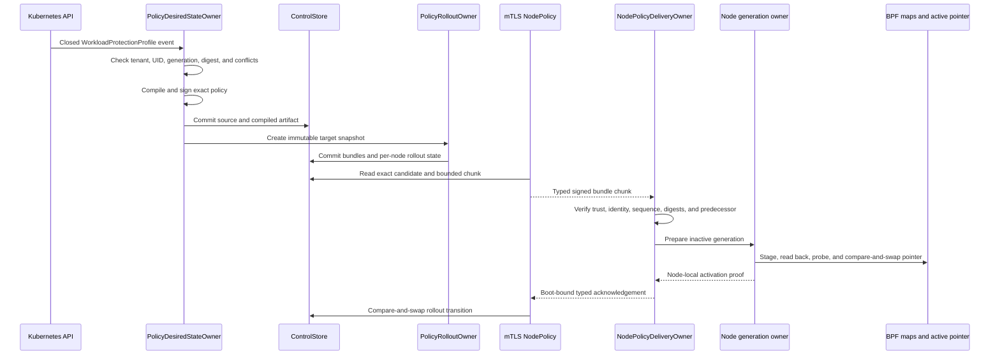
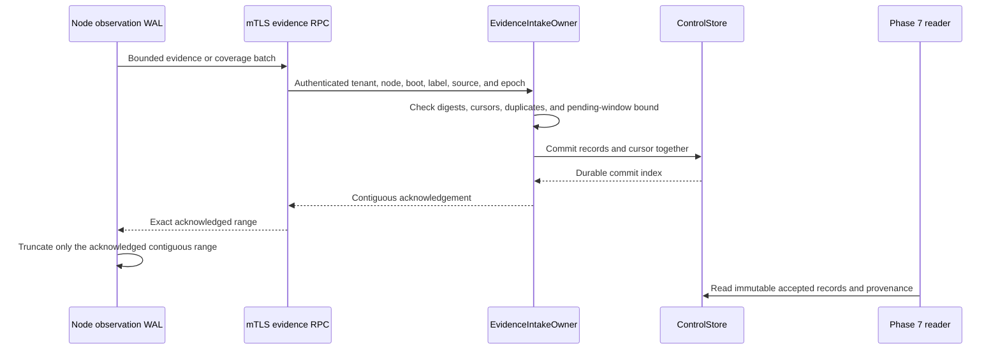

# Phase 6.2 Implementation Review Guide

Status: Source implementation is done through commit
`f26d622c13d4a25970df44d1bd3481eaaaff3a9f`. Focused automated acceptance
passed on 2026-08-22. The final repository gate and the
[manual runbook](./manual-testing/phase-6-2-manual-acceptance.md) have not been
run at this source state.

Plan: [Control Policy And Evidence Convergence](./phase-6-2-control-policy-and-evidence-convergence.md)

Design: [Validated readable architecture](./policy-and-protection-algorithm-architecture-readable.md)

## Review Goal

Verify that Kubernetes desired state has one Control owner. Verify that one
durable Control transaction owns policy provenance, rollout state, trust state,
accepted evidence, and intake cursors. Verify that each node still owns its
physical generation and BPF state.

Do not treat the deterministic two-node Control test as a physical two-node
kernel result. Do not claim that this work creates a Phase 7 graph or finding.
The BPF ABI and BPF programs did not change.

## Recommended Reading Order

1. Read the [Kubernetes policy API](../../../crates/mithril-control/src/policy/kubernetes.rs),
   the [committed CRD](../../../packaging/mithril/helm/crds/mithril.erebor.dev_workloadprotectionprofiles.yaml),
   and the [Control RBAC](../../../packaging/mithril/helm/templates/control-rbac.yaml).
2. Read the [Control configuration](../../../crates/mithril-control/src/config.rs)
   and [Control startup](../../../crates/mithril-control/src/main.rs).
3. Read the [desired-state and rollout owners](../../../crates/mithril-control/src/policy/reconciliation.rs).
4. Read the [policy compiler](../../../crates/mithril-control/src/policy/compiler.rs),
   [signature types](../../../crates/mithril-control/src/policy/signature.rs), and
   [closed source types](../../../crates/mithril-control/src/policy/source.rs).
5. Read the [durable Control store](../../../crates/mithril-control/src/store.rs)
   and the [trust owner](../../../crates/mithril-control/src/trust.rs).
6. Read the [generated Control contract](../../../crates/mithril-control/proto/erebor/mithril/control/v1/control.proto),
   [service adapters](../../../crates/mithril-control/src/service.rs), and
   [server assembly](../../../crates/mithril-control/src/server.rs).
7. Read the [node Control client](../../../crates/mithril-node/src/control.rs),
   [node policy delivery owner](../../../crates/mithril-node/src/policy_delivery.rs),
   [node event loop](../../../crates/mithril-node/src/node.rs), and
   [node generation owner](../../../crates/mithril-node/src/policy.rs).
8. Read the [Control evidence intake](../../../crates/mithril-control/src/evidence.rs)
   and [node observation WAL](../../../crates/mithril-node/src/observation/wal.rs).
9. Finish with the [Kubernetes API tests](../../../crates/mithril-control/tests/kubernetes_policy_api.rs),
   [reconciliation tests](../../../crates/mithril-control/tests/control_policy_reconciliation.rs),
   [contract test](../../../crates/mithril-control/tests/contract.rs), and
   [mTLS tests](../../../crates/mithril-node/tests/control_tls.rs).

## Ownership Map

| State or effect | Creator | Only mutator | Durable location or effect boundary | Main proof |
| --- | --- | --- | --- | --- |
| Accepted policy source revision | `PolicyDesiredStateOwner` | `ControlStore` transaction | Append-only Control commit | Canonical CRD and offline source equality; stale UID and generation tests |
| Compiled and signed artifact | `PolicyDesiredStateOwner` | `ControlStore` transaction | Source-revision keyed artifact | Deterministic compile, signature, and issuer anti-rollback tests |
| Target snapshot and node candidate | `PolicyRolloutOwner` | `ControlStore` transaction | Immutable snapshot, bundle, and rollout records | Target conflict, mixed rollout, restart, stale acknowledgement, and two-node tests |
| Trust generation and acknowledgement | `TrustBundleOwner` | `ControlStore` transaction | Trust generation and boot-bound acknowledgement records | Rotation, revocation, restart, and current-trust gating tests |
| Node policy cache and pending activation | `NodePolicyDeliveryOwner` | `NodePolicyDeliveryOwner` | Node state directory | Partial transfer, digest readback, restart, and acknowledgement replay tests |
| Active node generation and BPF maps | `NodePolicyGenerationOwner` and existing activation path | `mithril-node` | Node-local inactive generation and active-pointer compare-and-swap | Readback, probe, pointer, and retained-generation tests |
| Accepted evidence and coverage | `EvidenceIntakeOwner` | `ControlStore` transaction | Immutable records, coverage reports, and contiguous cursors | Duplicate, gap, reorder, backpressure, storage-failure, and restart tests |
| Node WAL truncation | Node WAL owner | Node WAL owner after durable Control acknowledgement | Node WAL | Durable contiguous acknowledgement and replay tests |
| Operational health | `ControlPlane` projection | Existing owners supply counts | Authenticated `ControlHealth.Get` response | Generated contract and bounded health snapshot tests |

The CRD stores desired state. It does not store a signed node candidate or an
activation acknowledgement. Control does not write node BPF maps. A node does
not watch the CRD.

## Policy Convergence Flow



`NodePolicy` uses resumable content-addressed chunks. A complete bundle is at
most the declared protocol bound. A partial transfer is not stageable. The node
reads each durable object by its exact digest before reuse.

The node checks the tenant, trust generation, signature, source digest,
candidate digest, artifact digests, issuer sequence, distribution sequence,
target, expiry, capabilities, and predecessor. A delayed acknowledgement
cannot change a newer candidate or a different boot session.

## Evidence Transaction Flow



The pending window contains at most 4,096 evidence records for one identity.
An out-of-order batch can become durable without advancing the contiguous
acknowledgement. A storage error withholds the acknowledgement. A conflicting
duplicate rejects. The intake owner does not close unknown coverage as healthy
and does not create graph edges or findings.

## Trust, Restart, And Deletion Flow

Trust generations and acknowledgements use the same store as policy and
evidence. A trust acknowledgement binds the node, generation, boot identity,
and label epoch. A revoked key cannot become current again. Policy and evidence
RPCs require the current trust generation for that node session.

Control rebuilds source, artifact, target, bundle, rollout, trust, evidence,
coverage, and cursor state by replaying the append-only commit chain. Each
commit binds its index, predecessor digest, transaction, and digest. Control
writes the file, calls `fsync`, renames it, and calls `fsync` on the parent
directory. A corrupt chain or incompatible record blocks store open.

CRD deletion creates a signed monotonic retirement candidate. The candidate
retains the last restrictive policy as its terminal state and uses the normal
node stage, readback, probe, and pointer path. Deletion alone does not erase a
node generation. A recreated CRD has a new UID and uses the terminal candidate
as its exact predecessor.

## Kubernetes And Tenancy Boundary

The CRD is namespaced, has one served storage version, and has a closed
structural schema with string, list, and object bounds. The supported write
path uses strict field validation and supplies the canonical submitted-spec
digest. Control rejects a stored spec that differs from that submitted digest.

Control derives tenant, cluster, and namespace identity from configuration and
API records. A policy field, annotation, label, or status cannot select its own
tenant. The Helm role can read policy resources and can update only status and
finalizers. It can read the namespaced workload facts and cluster node facts
needed for target resolution. It cannot create, update, or delete policy spec.

Status is a bounded projection. It has the observed generation, source and
candidate digests, aggregate rollout counts, and six fixed conditions. It has
no per-node array. A status change cannot sign, distribute, or activate policy.

## Operational Health Boundary

`ControlHealth.Get` uses the existing mTLS listener. The caller needs an
enrolled, registered node session with the current trust generation. The reply
contains only fixed counters and booleans. It reports reconciliation work,
Control commit state, watch and relist state, compile results, target and
rollout counts, node session counts, and evidence cursor and pending counts.

The reconciler processes one watch stream for each configured namespace. It
does not add a second work queue. `reconcile_in_flight` is therefore bounded by
the configured namespace count. `watch_healthy` is true only when every
configured namespace has an active watch after a successful relist.

## ABI And Protocol Boundary

This implementation adds the Kubernetes source types, Control store records,
policy delivery messages, and one authenticated health method. It uses the
generated `erebor.mithril.control.v1` contract. It does not add a generic
envelope, frame protocol, or compatibility dispatcher.

No BPF map, BPF program, kernel hook, or frozen ABI type changed. The node uses
the existing generation-building and active-pointer path. The evidence record
and coverage messages remain the Phase 6 types.

## Failure Boundaries

| Input or failure | Required behavior |
| --- | --- |
| Unknown or silently pruned CRD field | Strict decode or submitted-spec digest rejects before compilation |
| Stale UID, generation, or watch event | Durable source ordering rejects; the prior valid rollout remains |
| Duplicate profile ID or exact workload claim | Conflict rejects; no precedence rule selects a winner |
| Compile or signature failure | No candidate or rollout is created for that source revision |
| Partial or corrupt bundle | Node does not create a stageable pending activation |
| Wrong tenant, target, boot, label, trust, or sequence | Service or node rejects before rollout advancement |
| Mixed rollout | Status reports exact per-state counts; it does not claim global activation |
| Node disconnect or Control outage | The last valid node generation stays active |
| Watch closure or compaction | Control relists durable desired state and starts a new watch |
| Control restart | The store replays the commit chain; in-memory watch state is rebuilt |
| CRD deletion or finalizer removal | No direct BPF removal occurs; only a valid signed retirement can change node policy |
| Evidence gap within the bound | Batch stays pending; the contiguous acknowledgement does not advance |
| Evidence storage failure | No acknowledgement returns; the node keeps its WAL records |
| Conflicting evidence duplicate | Intake rejects and preserves the first immutable record |
| Health request from an untrusted session | mTLS, registration, or current-trust checks reject |

## Verification Map

| Proof | Source |
| --- | --- |
| Closed CRD, generated manifest equality, canonical source equality, silent-prune rejection, status bound, and RBAC | [Kubernetes policy API tests](../../../crates/mithril-control/tests/kubernetes_policy_api.rs) |
| Create, update, conflict, stale state, mixed rollout, restart, retirement, recreation, stale acknowledgement, and two-node provenance | [Control reconciliation tests](../../../crates/mithril-control/tests/control_policy_reconciliation.rs) |
| Exact generated gRPC inventory, including `ControlHealth.Get` | [Control contract test](../../../crates/mithril-control/tests/contract.rs) |
| Commit chain, compare-and-swap transitions, evidence atomicity, pending bounds, restart replay, and trust persistence | [Control store tests](../../../crates/mithril-control/src/store.rs) |
| Evidence identity, duplicate, reorder, cursor, coverage, and stable Phase 7 query | [Evidence intake tests](../../../crates/mithril-control/src/evidence.rs) |
| Trust install, acknowledgement, revocation, anti-rollback, and restart | [Trust owner tests](../../../crates/mithril-control/src/trust.rs) |
| mTLS identity, boot session, trust gate, policy chunk, acknowledgement, evidence, and service isolation | [Control TLS tests](../../../crates/mithril-node/tests/control_tls.rs) |
| Durable chunk assembly, signature and digest checks, pending activation, recovery, and acknowledgement replay | [Node policy delivery tests](../../../crates/mithril-node/src/policy_delivery.rs) |
| Existing inactive generation, readback, probes, and pointer activation | [Node policy tests](../../../crates/mithril-node/src/policy.rs) |

Focused closure checks passed at source commit `f26d622`:

```text
rtk cargo test -p mithril-control --test contract --test control_policy_reconciliation --test kubernetes_policy_api
14 passed

rtk cargo clippy -p mithril-control --all-targets -- -D warnings
No issues found
```

Earlier implementation commits also passed the focused `mithril-control` and
`mithril-node` library, integration, and strict clippy suites. The final
repository gate must run after the last Rust edit.

## Verification Limits

The physical two-node manual run has not run. There is no new live Kubernetes
API-server, RBAC denial, watch-compaction, network-partition, kernel, platform,
performance, or capacity result. The deterministic two-node test exercises two
Control targets and their provenance. It does not exercise two physical BPF
instances.

The architecture fixture registry digest is
`51807f12113391872ee90ce2469869db18bc4d25e9b4b1f39eb01fcaefb4fe1e`.
This work adds no Appendix C fixture ID. Phase 7 graph and finding behavior is
not present.

## Reviewer Checklist

- [ ] Compare the generated CRD with the committed Helm CRD.
- [ ] Trace one CRD generation into one immutable source revision.
- [ ] Trace one source revision through compilation, signature, and target snapshot.
- [ ] Verify that a duplicate profile or workload claim creates no candidate.
- [ ] Trace one candidate through bounded chunks and exact node digest readback.
- [ ] Trace node activation through inactive state, probes, and one pointer compare-and-swap.
- [ ] Verify that Control changes rollout state only after the exact authenticated acknowledgement.
- [ ] Trace one evidence retry from the node WAL to a durable contiguous acknowledgement.
- [ ] Verify that an out-of-order evidence batch does not advance the acknowledgement.
- [ ] Restart Control and compare the rebuilt source, rollout, trust, evidence, and cursor state.
- [ ] Verify that deletion and recreation preserve the candidate predecessor chain.
- [ ] Inspect the health reply and confirm that it contains no policy, evidence, or secret payload.
- [ ] Confirm that no Control path writes BPF maps or the node active pointer.
- [ ] Run the final repository gate after any Rust change.

Completion of this work does not authorize the next phase.
