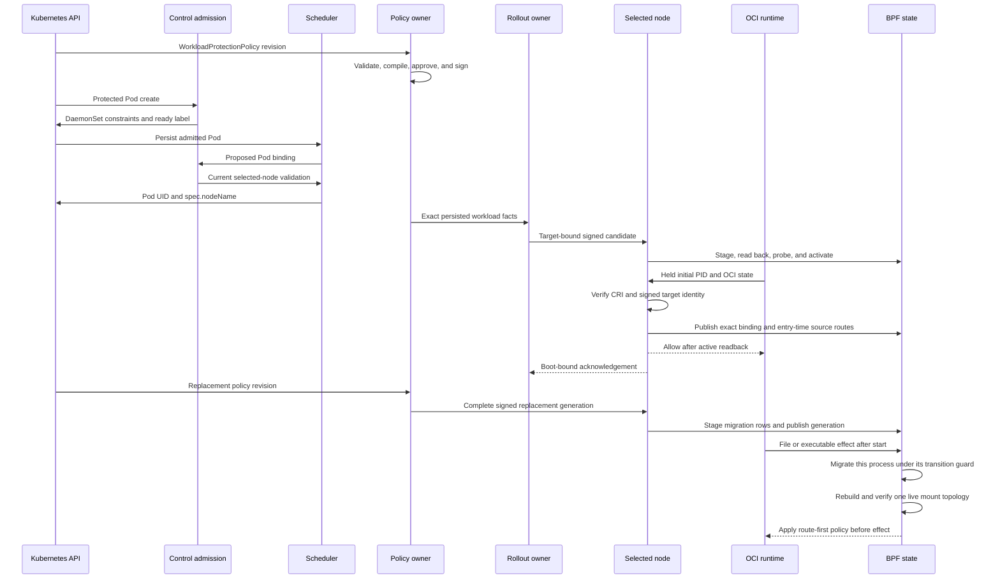
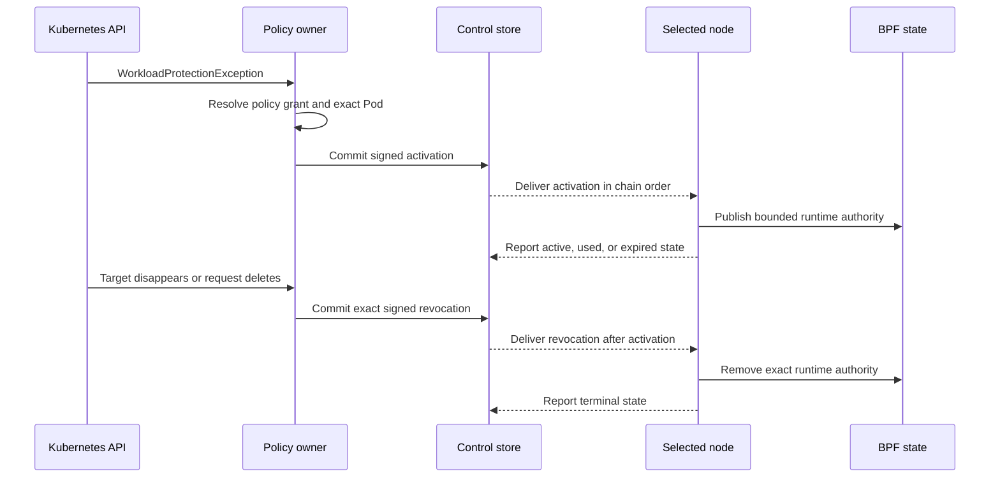
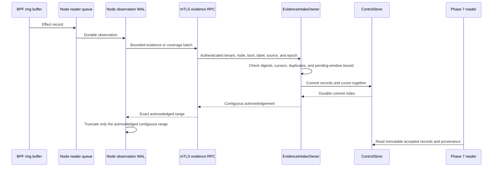
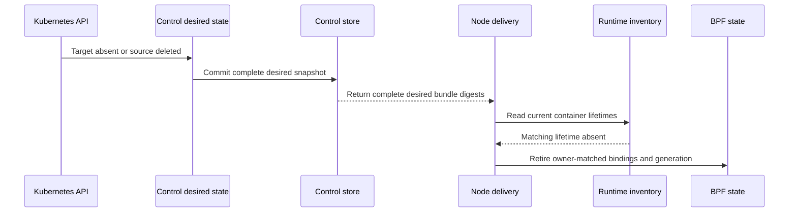
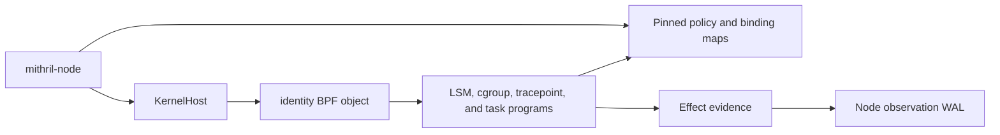

# Phase 6.2 Implementation Review Guide

Status: Current implementation guide with unresolved cache retirement and
physical qualification gaps.
The source implements the separate `WorkloadProtectionPolicy` and
`WorkloadProtectionException` APIs. Earlier recorded lightweight and
Kubernetes results prove guarded migration for an actual signed policy
replacement. The current working tree keeps ordinary signed entry rows and
canonical initial mount routes stable across runtime mount events. BPF builds
the live mount cache on demand under a separate BPF-owned runtime cache
generation. Focused distribution-runc and K3s-runc runs passed the cache
transitions. Both runs stopped in later lifecycle cases. No current complete
direct-runc or Kubernetes result qualifies this change.

Plan: [Control Policy And Evidence Convergence](./phase-6-2-control-policy-and-evidence-convergence.md)

Design: [Validated readable architecture](./policy-and-protection-algorithm-architecture-readable.md)

Mount-cache design: [Independent runtime mount-cache generation](./phase-6-2-security-epoch-qualified-mount-cache-design.md)

## Review Goal

Verify that Kubernetes desired state has one Control owner. Verify that the
live `mithril-node` DaemonSet defines the eligible node set. Verify that the
Kubernetes scheduler selects the exact node. Verify that Control sends signed
workload material only to that node. Verify that the node holds the initial
container process until policy and cgroup-binding activation. Verify that one
durable Control transaction owns policy provenance, rollout state, trust state,
accepted evidence, and intake cursors. Verify that each node still owns its
physical generation and Berkeley Packet Filter (BPF) state.

Do not treat the deterministic two-node Control test as a physical two-node
kernel result. Do not claim that this work creates a Phase 7 graph or finding.
The BPF application binary interface (ABI) and BPF programs add one
`PreparedContainer` transition to the existing execution-set binding. They add
no runtime-object authority map or runtime-specific operation list. After
activation, cgroup membership alone grants no authority. The default requires
the exact admitted entry identity stored in the binding.

## Architecture Correction: Signed Policy And Runtime Evidence

The accepted end state gives signed policy authority and runtime evidence
different owners, identifiers, mutation rules, and lifetimes. A policy
generation changes only after Control accepts and signs a policy change. A
container event or mount event changes only binding-scoped runtime state.

The implementation removes the invalid runtime-event policy replacement path.
An ordinary entry rule uses its signed canonical invocation path and argument
condition. Its exact-object fields are zero. An explicit `EXACT` filesystem
selector continues to use the separate exact-object policy path.

### Intended end state

[`PolicyDesiredStateOwner`](../../../crates/mithril-control/src/policy/reconciliation.rs) Control creates a signed candidate only for a policy change
  -> [`NodePolicyGenerationOwner::install`](../../../crates/mithril-node/src/policy.rs) the node stages, verifies, and publishes the immutable signed generation
  -> [`WorkloadBindingOwner`](../../../crates/mithril-node/src/identity/binding.rs) the node binds the authenticated container to that generation and publishes its stable ordinary entry rows
  -> [`NodePolicyGenerationOwner::reconcile_cri_exact_bindings`](../../../crates/mithril-node/src/policy.rs) ordinary runtime reconciliation retains the entry rows and canonical initial mount routes
  -> [`global_mount_epoch_snapshot`](../../../bpf/erebor-interceptor/programs/identity_path.bpf.h) the first mount-dependent BPF gate reads the BPF-owned security-view epoch and requires zero pending mutations
  -> [`canonical_mount_cache_generation_snapshot`](../../../bpf/erebor-interceptor/programs/identity_path.bpf.h) BPF reads the independent runtime cache generation
  -> [`ensure_canonical_mount_cache`](../../../bpf/erebor-interceptor/programs/identity_path.bpf.h) BPF reads the kernel namespace event, namespace identity, namespace mount count, and task walk root
  -> [`canonical_mount_cache_build_step`](../../../bpf/erebor-interceptor/programs/identity_path.bpf.h) BPF inserts the complete candidate row set under the captured security-view epoch and runtime cache generation
  -> [`publish_canonical_mount_cache_state`](../../../bpf/erebor-interceptor/programs/identity_path.bpf.h) BPF publishes `READY` only after the namespace event, security-view epoch, cache generation, pending count, and namespace mount count remain valid
  -> [`selected_mount_for_root`](../../../bpf/erebor-interceptor/programs/identity_path.bpf.h) BPF selects rows only through the current ready cache generation
  -> [`synchronous_mount_snapshot_unchanged`](../../../bpf/erebor-interceptor/programs/identity_path.bpf.h) BPF rechecks the namespace event, security-view epoch, cache generation, and pending count before it applies the policy result
  -> Not implemented: a lifecycle owner retires candidate and ready rows that no current runtime cache generation can select

[`mount_mutation_effect`](../../../bpf/erebor-interceptor/programs/identity_effects.bpf.h) An LSM mount hook accepts one tracked mutation
  -> [`begin_global_mount_mutation`](../../../bpf/erebor-interceptor/programs/identity_path.bpf.h) BPF increments the pending-mutation count and then advances the security-view epoch before the kernel operation
  -> [`begin_mount_mutation`](../../../bpf/erebor-interceptor/programs/identity_path.bpf.h) BPF records the namespace address, namespace event, namespace mount count, and namespace inode in task storage
  -> [`erebor_mount_mutation_sys_exit`](../../../bpf/erebor-interceptor/programs/identity_path.bpf.h) the raw syscall exit hook finishes the same task's mutation attempt
  -> [`finish_mount_mutation`](../../../bpf/erebor-interceptor/programs/identity_path.bpf.h) BPF advances the runtime cache generation when the namespace event or mount count changed
  -> [`finish_mount_mutation`](../../../bpf/erebor-interceptor/programs/identity_path.bpf.h) BPF clears the pending-mutation count after the generation change
  -> [`ensure_canonical_mount_cache`](../../../bpf/erebor-interceptor/programs/identity_path.bpf.h) the next mount-dependent effect builds the current runtime cache generation

[`ensure_canonical_mount_cache`](../../../bpf/erebor-interceptor/programs/identity_path.bpf.h) A cache hit finds a `READY` state with a stale namespace mount count
  -> [`advance_canonical_mount_cache_generation`](../../../bpf/erebor-interceptor/programs/identity_path.bpf.h) one compare-and-swap winner advances the runtime cache generation
  -> [`canonical_mount_cache_build_step`](../../../bpf/erebor-interceptor/programs/identity_path.bpf.h) the winner inserts a complete replacement row set under the new generation
  -> [`publish_canonical_mount_cache_state`](../../../bpf/erebor-interceptor/programs/identity_path.bpf.h) the winner publishes the replacement `READY` state after all race checks pass
  -> [`synchronous_mount_snapshot_unchanged`](../../../bpf/erebor-interceptor/programs/identity_path.bpf.h) the original effect rechecks the replacement generation before it applies the policy result

[`mount_cache_build_failure`](../../../bpf/erebor-interceptor/programs/identity_path.bpf.h) A cache build fails after candidate insertion
  -> [`advance_canonical_mount_cache_generation`](../../../bpf/erebor-interceptor/programs/identity_path.bpf.h) BPF advances the generation again and makes the failed candidate rows unreachable
  -> Not implemented: a lifecycle owner retires the unreachable candidate rows

[`ensure_canonical_mount_cache`](../../../bpf/erebor-interceptor/programs/identity_path.bpf.h) A concurrent stale-cache repair loses the compare-and-swap
  -> Partial [`mount_cache_trace_failure`](../../../bpf/erebor-interceptor/programs/identity_path.bpf.h) BPF denies the current effect at stage 18, and an external caller can retry

The ready state is the atomic publication point. A candidate row does not
authorize an effect without that state. A concurrent PostStart, PID 1, or exec
gate can build or use the same complete generation-qualified cache. A changed
kernel namespace event during one operation denies that operation. The event
is not part of persistent cache identity.

`mount_global_mutation_epoch` is the BPF-owned security-view mutation fence.
`canonical_mount_cache_generation` is the BPF-owned runtime cache publication
identity. The raw kernel namespace event is a transient race fence. Both BPF
identifiers are global. This scope can cause an unrelated represented namespace
to rebuild its cache after a relevant mutation or cache repair. It cannot make
an old generation current.

The active OCI path does not use the retained seccomp server. The BPF gate
owns runtime topology initialization. Only a signed policy replacement creates
a new policy generation and invokes guarded running-process migration.

## Recommended Reading Order

1. Read the [Helm package contract](../../../packaging/mithril/helm/README.md),
   [DaemonSet](../../../packaging/mithril/helm/templates/daemonset.yaml),
   [webhook registrations](../../../packaging/mithril/helm/templates/admission-webhooks.yaml),
   and [Control RBAC](../../../packaging/mithril/helm/templates/control-rbac.yaml).
2. Read the [Kubernetes policy API](../../../crates/mithril-control/src/policy/kubernetes.rs),
   the [policy CRD](../../../packaging/mithril/helm/crds/mithril.erebor.dev_workloadprotectionpolicies.yaml),
   the [exception CRD](../../../packaging/mithril/helm/crds/mithril.erebor.dev_workloadprotectionexceptions.yaml),
   and the [API contract tests](../../../crates/mithril-control/tests/kubernetes_policy_api.rs).
3. Read the [Control configuration](../../../crates/mithril-control/src/config.rs)
   and [Control startup](../../../crates/mithril-control/src/main.rs).
4. Read the [DaemonSet node owner](../../../crates/mithril-control/src/policy/kubernetes_nodes.rs)
   and [Kubernetes workload admission](../../../crates/mithril-control/src/policy/kubernetes_workloads.rs).
5. Read the [policy desired-state and rollout owners](../../../crates/mithril-control/src/policy/reconciliation.rs)
   and the [exception desired-state owner](../../../crates/mithril-control/src/policy/kubernetes_exceptions.rs).
6. Read the [policy compiler](../../../crates/mithril-control/src/policy/compiler.rs),
   [signature types](../../../crates/mithril-control/src/policy/signature.rs), and
   [closed source types](../../../crates/mithril-control/src/policy/source.rs).
7. Read the [durable Control store](../../../crates/mithril-control/src/store.rs)
   and the [trust owner](../../../crates/mithril-control/src/trust.rs).
8. Read the [generated Control contract](../../../crates/mithril-control/proto/erebor/mithril/control/v1/control.proto),
   [service adapters](../../../crates/mithril-control/src/service.rs), and
   [server assembly](../../../crates/mithril-control/src/server.rs).
9. Read the [node configuration binding](../../../crates/mithril-node/src/config.rs),
   [node Control client](../../../crates/mithril-node/src/control.rs),
   [node policy delivery owner](../../../crates/mithril-node/src/policy_delivery.rs),
   [node event loop](../../../crates/mithril-node/src/node.rs), and
   [node generation owner](../../../crates/mithril-node/src/policy.rs).
10. Read the [retained runtime gate](../../../crates/mithril-node/src/runtime_gate.rs),
    [runtime integration owner](../../../crates/mithril-node/src/runtime_integration.rs),
    [OCI adapter](../../../crates/mithril-node/src/bin/mithril_oci_hook.rs),
    [runtime admission socket](../../../crates/mithril-node/src/runtime_admission.rs),
    [CRI identity verification](../../../crates/mithril-node/src/identity/runtime.rs),
    [cgroup binding owner](../../../crates/mithril-node/src/identity/binding.rs),
    [shared identity ABI](../../../crates/erebor-interceptor-abi/src/abi/identity.rs),
    [effect decision owner](../../../bpf/erebor-interceptor/programs/identity_effects.bpf.h),
    [network decision owner](../../../bpf/erebor-interceptor/programs/identity_network.bpf.h),
    and [PreparedContainer BPF owner](../../../bpf/erebor-interceptor/programs/identity_prepared_container.h).
11. Read the [Control evidence intake](../../../crates/mithril-control/src/evidence.rs),
   [node observation ingress](../../../crates/mithril-node/src/observation.rs),
   and [node observation WAL](../../../crates/mithril-node/src/observation/wal.rs).
12. Finish with the [Kubernetes API tests](../../../crates/mithril-control/tests/kubernetes_policy_api.rs),
   [reconciliation tests](../../../crates/mithril-control/tests/control_policy_reconciliation.rs),
   [contract test](../../../crates/mithril-control/tests/contract.rs), and
   [mutual Transport Layer Security tests](../../../crates/mithril-node/tests/control_tls.rs).

## Ownership Map

| State or effect | Creator | Only mutator | Durable location or effect boundary | Main proof |
| --- | --- | --- | --- | --- |
| Accepted policy source revision | `PolicyDesiredStateOwner` | `ControlStore` transaction | Append-only Control commit | Canonical CRD and offline source equality; stale UID and generation tests |
| Accepted exception and retirement revision | `PolicyDesiredStateOwner` | `ControlStore` transaction | Append-only Control commit | Bounded request, exact-target disappearance, replay, and tamper tests |
| Compiled and signed artifact | `PolicyDesiredStateOwner` | `ControlStore` transaction | Source-revision keyed artifact | Deterministic compile, signature, and issuer anti-rollback tests |
| Eligible node constraints | Kubernetes operator | Live `mithril-node` DaemonSet Pod template | Kubernetes DaemonSet | Empty, selector, affinity, and selector-change tests |
| Node readiness projection | `KubernetesNodeReadinessOwner` | `KubernetesNodeReadinessOwner` | Mithril Node label, annotations, and quarantine taint | No-session, ready-session, and selector-change tests |
| Protected Pod mutation and update validation | `KubernetesAdmissionOwner` | Kubernetes admission transaction | Persisted Pod affinity and Mithril annotations | Profile match, composition, reserved annotation, update bypass, and admission-patch tests |
| Exact scheduler binding | Kubernetes scheduler | Kubernetes API server | Pod UID and `spec.nodeName` | Binding validation code and physical manual oracle |
| Bound workload inventory | `KubernetesWorkloadInventoryOwner` | `ControlPlane` API-only inventory | Exact Pod, container, image, Node, and node-session facts | API-only authority and inventory drift tests |
| Target snapshot and node candidate | `PolicyRolloutOwner` | `ControlStore` transaction | Immutable snapshot, bundle, and rollout records | Target conflict, exact-node, mixed rollout, restart, and stale acknowledgement tests |
| Trust generation and acknowledgement | `TrustBundleOwner` | `ControlStore` transaction | Trust generation and boot-bound acknowledgement records | Rotation, revocation, restart, and current-trust gating tests |
| Node policy, exception, transfer, and cleanup state | `NodePolicyDeliveryOwner` | `NodePolicyDeliveryOwner` | Node state directory | Incremental transfer, complete desired inventory, exact readback, restart, session retirement, and stale-profile cleanup tests |
| Active signed node generation and BPF policy rows | `NodePolicyGenerationOwner` and existing activation path | `mithril-node` only after a signed policy candidate | Node-local inactive generation and one active-pointer publication after expected-pointer readback | Readback, probe, pointer, retained-generation, and stable-entry-row tests |
| Live process generation migration | `NodePolicyGenerationOwner` creates semantic old-to-new rows | BPF updates one process and state vector under its transition guard | `process_generation_migrations`, `process_states`, and `process_state_vectors` | Migration-row unit tests, replacement-generation lightweight probes, and the complete Kubernetes fixture |
| Binding-scoped runtime evidence | Held OCI admission creates the binding and canonical initial routes | BPF mutation hooks and the path resolver create live cache generations | Binding rows, canonical initial routes, and the BPF-owned cache-generation-qualified mount cache | Stable-row readback and focused direct-runc cache tests; explicit unreachable-cache-row retirement is not implemented |
| Entry-time known-source routes | Held OCI admission and `NodePolicyGenerationOwner` | `mithril-node` changes rows only for binding materialization or a signed policy replacement | Binding-scoped `canonical_mount_roots` rows | Route-order tests and stable canonical-route readback in the direct-runc probe |
| Post-start live mount topology | BPF file or executable hook chain | BPF mutation hooks and path resolver | Live kernel mount namespace, transient namespace event, BPF-owned security-view epoch, runtime cache generation, pending count, and ready cache | Distribution-runc and K3s-runc cache transitions passed before later lifecycle failures; current Kubernetes proof is incomplete |
| Retained runtime integration and recovery manifest | `RuntimeIntegrationOwner` | `RuntimeIntegrationOwner`; signed node decommission owns final removal | Host containerd fragment, OCI base spec, hook binary, and recovery manifest | Runtime integration unit tests, direct-runc retained-gate probe, and two-node reinstall |
| Runtime admission request | `mithril-oci-hook` and `RuntimeAdmissionClient` | `RuntimeAdmissionServer` | Root-owned mode-0600 Unix socket | Stock-state parser, active-owner, unavailable endpoint, convergence hold, and timeout tests |
| Staged runtime facts | First `createRuntime` request | `WorkloadBindingOwner` | Bounded node memory only; no kernel authority | Missing, expiry, changed-head, changed-cgroup, and no-PID-authority tests |
| Runtime container binding | `ScheduledRuntimeBindingV1` and node binding owner | Node binding owner | BPF cgroup and task maps plus node delivery state | Exact signed target, policy identity, CRI match, distinct lifetime, and reuse-rejection tests |
| Prepared-container state | Node binding owner publishes one held binding | BPF prepared-container transition | Exact binding, held host TGID, initial entry, deadline, and one exec activation | ABI, compiled-object, node transition, recovery, and required physical tests |
| Accepted evidence and coverage | `EvidenceIntakeOwner` | `ControlStore` transaction | Immutable records, coverage reports, and contiguous cursors | Duplicate, gap, reorder, backpressure, storage-failure, and restart tests |
| Node reader queue | Effect reader | `EffectObservationWorker` | Bounded 65,535-record in-memory queue by default | Capacity, queue-loss metric, durable gap, and transient-lag tests |
| Node WAL records and truncation | Node WAL owner | Node WAL owner after durable Control acknowledgement | Checksummed binary frames with Protocol Buffers payloads; 10,000 retained records by default | Migration, capacity policy, exact acknowledgement, replay, and corruption tests |
| Operational health | `ControlPlane` projection | Existing owners supply counts | Authenticated `ControlHealth.Get` response | Generated contract and bounded health snapshot tests |

The custom resource definition (CRD) stores desired state. It does not store a
signed node candidate or an activation acknowledgement. Control does not write
node BPF maps. A node does not watch the CRD. The scheduler selects the exact
node. Mithril admission only restricts the eligible set.

## Simplicity Review Decisions

The review assigned the admission listener and request dispatch to
`KubernetesAdmissionOwner`. It assigned the cluster inventory loop and exact
target construction to `KubernetesWorkloadInventoryOwner`. It assigned the
runtime socket lifecycle and request dispatch to `RuntimeAdmissionServer`,
client framing to `RuntimeAdmissionClient`, and signed target resolution to
`ScheduledRuntimeBindingV1`. These changes remove lifecycle free functions
from the reviewed paths.

`PolicyDesiredStateOwner` and `PolicyRolloutOwner` remain separate. The first
owner accepts and compiles durable source authority. The second owner derives
exact workload targets and advances node rollout state. A merge would combine
two authority and recovery boundaries in one large owner.

`RuntimeAdmissionServer` and `RuntimeAdmissionReceiver` also remain separate.
The server owns the socket and concurrent request tasks. The receiver gives
the node event loop one bounded request stream. A merge would couple socket
I/O to policy convergence without removing state or a handoff.

`WorkloadBindingOwner` owns first-hook stages because it already owns CRI
identity, cgroup lifetime, and held-root publication. A second stage owner
would duplicate the exact comparison and cleanup boundary. The OCI adapter
remains stateless and cannot grant authority.

The implementation already uses `schemars` and `kube` derives for the CRD,
`json-patch` for admission patches, and `serde` for closed protocol and state
types. The remaining private helpers implement bounded Kubernetes, cgroup, or
canonical-identity rules. A general-purpose replacement would not preserve
those fail-closed contracts. The review added no new abstraction package.

Comments identify non-obvious ownership, ordering, scheduler, replay, and
fail-closed decisions. Direct matches, validation expressions, and wiring do
not have comments that repeat the code.

## Policy Convergence Flow



The admission owner reads the live DaemonSet for each Node, Pod, and binding
decision. The Pod mutation combines the DaemonSet selector and required
affinity with the Pod's existing requirements. It adds the Control-owned ready
label. It rejects `spec.nodeName`, the quarantine toleration, and conflicting
selectors. It bounds the combined required-affinity terms. It reserves the
Mithril profile and source annotations. It does not choose one node.

The mutating Pod webhook runs only on CREATE. A validating webhook checks Pod
and ephemeral-container updates. An unprotected scheduled Pod cannot enter a
protected profile through an update. A protected Pod must keep its admitted
profile, source revision, selector match, and image-pin contract.

`KubernetesWorkloadInventoryOwner` lists all Pods, Nodes, Namespaces, and
Service Accounts. It accepts only persisted protected Pods with
`spec.nodeName`. It creates exact target facts for each matching container.
The facts bind the Pod UID, controller UID, ServiceAccount UID, digest-pinned
image, Node name, Node UID, node ID, boot ID, and label epoch. An inventory
change creates a new target snapshot without a policy source change.

`NodePolicy` uses resumable content-addressed chunks. A complete bundle is at
most the declared protocol bound. A partial transfer is not stageable. The node
reads each durable object by its exact digest before reuse. A node rejects
signed workload material for another node, boot, label epoch, profile, source
revision, or candidate.

The node checks the tenant, trust generation, signature, source digest,
candidate digest, artifact digests, issuer sequence, distribution sequence,
target, expiry, capabilities, and predecessor. A delayed acknowledgement
cannot change a newer candidate or a different boot session.

`NodePolicyGenerationOwner` installs a replacement generation under keys that
the live binding cannot reach. It reads back the generation and runs the
controlled probes. It derives migration rows only for semantic roles and
process-state bits that exist in both complete generations. It stages the live
binding target before it publishes the generation pointer. The normal Node
reload path retains the prior verified generation semantics, so it can create
the old-to-new rows during a live Control update.

At the next protected effect, BPF compares the process generation with the
published binding generation. BPF acquires the existing process transition
guard. It verifies the source descriptor, process state vector, target
descriptor, and migration row. It updates the process and its state vector,
releases the guard, and evaluates that same effect with the replacement
generation. Another process migrates at its own next protected effect. A
missing row or a concurrent transition denies the current effect.

At held entry admission, Node opens the OCI bundle root through the held mount
namespace. Node rebases container mountpoints and installs existing graph-prefix
states for known source roots. Node does not rebuild these routes after start.
For each later file or executable decision, BPF snapshots the global
security-view epoch and runtime cache generation. BPF requires zero pending
mutations. BPF reads the live namespace event and uses the ready cache for that
epoch, generation, and task walk root. A cache miss builds all rows before BPF
publishes the ready state. A ready-state mount-count mismatch lets one
compare-and-swap winner advance the cache generation and build a replacement.
BPF uses an admitted route before the oldest-mount fallback. BPF rechecks the
namespace event, security-view epoch, cache generation, and pending count before
the decision. A race or unresolved path denies. The observation ring records
evidence only.

## Exception Convergence Flow



The exception owner accepts one namespaced request for one named base-policy
file grant. The request names one Pod UID and one container. Control derives
the selected node, boot, label epoch, active base generation, compiled cells,
deadline, and remaining use bound. The request cannot contain compiled keys,
digests, signatures, or node authority.

The accepted source stays accepted when its exact Pod target disappears.
Control commits a target-retirement transaction and signs a `REVOKE`
candidate for the original target. The store requires the latest complete
workload snapshot to prove that the target is absent. A partial inventory
cannot retire the target. A pending activation stays ahead of its revocation.
Reappearance does not activate the same exception object again. The operator
must create a new object UID.

## Node Eligibility Flow

Control reads `spec.template.spec.nodeSelector` and required node affinity from
the live `mithril-node` DaemonSet. Control rejects a DaemonSet that sets
`spec.nodeName` or uses an unsupported required-affinity operator. An empty
selector includes all nodes. There is no Control node-pool selector.

Node admission removes forged Mithril readiness and adds
`mithril.erebor.dev/not-ready:NoSchedule` to an eligible Node without a current
session. The DaemonSet tolerates this taint. The node supplies its Kubernetes
Node name through the downward API and authenticates with its unique mutual
Transport Layer Security identity. Control binds the node name and Node UID to
that session. Control adds readiness and removes quarantine only after the
current session reports kernel, identity, Control, and admission readiness.
The readiness projection requires the exact Node name and Node UID. A new Node
cannot inherit an old session through name reuse.

A session expiry removes readiness and restores quarantine. A same-name Node
UID replacement clears readiness, but it does not reset the physical policy
chain. Control creates an exact `REPLACE` candidate that names the live
predecessor and binds the new UID.

A higher label epoch is the physical reset boundary. The node opens the kernel
owner first and proves that old policy and exception authority is absent. The
node includes the canonical absence digest in its authenticated registration.
Control records the session advance, rejects old-epoch delivery and
acknowledgement messages, settles old exception state conservatively, and
permits a higher-sequence root activation. A lower label epoch or a different
boot ID at the same label epoch rejects. A normal reconnect keeps the same boot
ID and label epoch.

A DaemonSet selector change removes the Mithril projection from nodes that are
no longer eligible. The readiness owner removes both the ready label and the
Mithril quarantine taint because the node is outside the managed set. If the
node becomes eligible again, Control adds the quarantine taint before a new
ready session can remove it. A `NoSchedule` taint stops new scheduling. It does
not evict a running Pod or remove its last active local policy.

## Runtime Admission Flow

The chart installs a containerd drop-in and an Open Container Initiative (OCI)
base specification for the default Container Runtime Interface (CRI) runtime.
The base specification prepends two `createRuntime` hooks and one
`createContainer` hook. The node uses CRI for live container facts. The host
thread group identifier (TGID) identifies the held initial process.

[`RuntimeIntegrationOwner::install`](../../../crates/mithril-node/src/runtime_integration.rs) The privileged chart installer publishes the hook, base specification, drop-in, and recovery manifest
  -> [`OciBaseSpecOwner::build`](../../../crates/mithril-node/src/runtime_integration.rs) the base specification prepends the three ordered hook calls
  -> [`RuntimeIntegrationOwner::restart`](../../../crates/mithril-node/src/runtime_integration.rs) the installer restarts the active configured container runtime only when the base specification or drop-in changed
  -> [`RuntimeIntegrationOwner::read_back`](../../../crates/mithril-node/src/runtime_integration.rs) the installer verifies every owned file and the active containerd import

[`RetainedRuntimeGate::decide`](../../../crates/mithril-node/src/runtime_gate.rs) The retained hook runs before the node admission socket is available
  -> [`OciRuntimeConfigV1::is_hostile_incident`](../../../crates/mithril-node/src/runtime_gate.rs) the hook denies the exact hostile OCI shape before its process starts
  -> [`RuntimeRecoveryManifestV1::recovery_decision`](../../../crates/mithril-node/src/runtime_gate.rs) the hook permits an exact Node or Control recovery command and security shape from the retained manifest
  -> [`RuntimeControlRecoveryEntryV1::matches`](../../../crates/mithril-node/src/runtime_gate.rs) Control recovery requires the exact non-root user, supplementary group, empty capabilities, read-only root, namespace shape, and mount destinations
  -> [`RuntimeRecoveryEntryV1::matches`](../../../crates/mithril-node/src/runtime_gate.rs) Node recovery requires the exact command, host namespace, capabilities, and source-bound mounts
  -> [`RuntimeRecoveryEntryV1::matches_installer`](../../../crates/mithril-node/src/runtime_gate.rs) a version-changed installer requires the retained owner, host paths, socket, privileges, and writable mounts
  -> [`RetainedRuntimeDecisionV1::DenyUnavailable`](../../../crates/mithril-node/src/runtime_gate.rs) any other protected or non-sandbox start denies while node admission is unavailable

Neither recovery entry contains an executable digest. The manifest binds the
command and security-sensitive OCI shape. Dynamic Kubernetes volume source
paths do not authorize Control recovery. The Control entry binds only the
required mount destinations and access modes because Kubernetes assigns the
host-side volume paths.

[`OciBaseSpecOwner::build`](../../../crates/mithril-node/src/runtime_integration.rs) Containerd invokes the first two ordered Mithril `createRuntime` hooks
  -> [`request_with_cgroup`](../../../crates/mithril-node/src/bin/mithril_oci_hook.rs) the first hook stages immutable container, cgroup, image, and Pod facts
  -> [`stage_runtime_admission`](../../../crates/mithril-node/src/identity/binding.rs) the node stores one bounded stage and grants no runtime authority

[`RuntimeAdmissionServer`](../../../crates/mithril-node/src/runtime_admission.rs) The second OCI `createRuntime` hook holds the exact initial task
  -> [`verify_runtime_preparation`](../../../crates/mithril-node/src/identity/binding.rs) the node matches the staged facts and verifies CRI `Created` state
  -> [`prepare_runtime_start`](../../../crates/mithril-node/src/node.rs) the node verifies the scheduled Pod binding and active signed policy
  -> [`publish_held_activated_root`](../../../crates/mithril-node/src/identity/binding.rs) the node publishes `PreparedContainer` for the exact binding and held host TGID
  -> [`install_late_activation_target`](../../../crates/mithril-node/src/identity/binding.rs) the node reads back the binding and active generation
  -> [`RuntimeAdmissionEnvelope::deliver`](../../../crates/mithril-node/src/runtime_admission.rs) the hook returns allow

[`prepared_container_actor_is_exact`](../../../bpf/erebor-interceptor/programs/identity_prepared_container.h) Trusted runtime setup uses the exact prepared binding and initial runtime entry
  -> [`resolved_identity_effect_gate`](../../../bpf/erebor-interceptor/programs/identity_effects.bpf.h) BPF permits runtime implementation details without a runtime-specific operation list
  -> [`ExecutionSetBindingStateV1`](../../../crates/erebor-interceptor-abi/src/abi/identity.rs) runtime-created files, pipes, sockets, and handles receive no independent authority
  -> [`prepared_container_binding_is_prepared`](../../../bpf/erebor-interceptor/programs/identity_prepared_container.h) another binding, another entry, a later external root, or an expired state rejects

[`prepared_exec_policy_gate`](../../../bpf/erebor-interceptor/programs/identity_effects.bpf.h) The first application exec resolves through the active signed policy
  -> [`prepared_container_reserve_activation`](../../../bpf/erebor-interceptor/programs/identity_prepared_container.h) the exact task changes `PREPARED` to `EXEC_PENDING`
  -> [`prepared_container_commit_activation`](../../../bpf/erebor-interceptor/programs/identity_prepared_container.h) the successful process-exec tracepoint changes `EXEC_PENDING` to `ACTIVE`
  -> [`complete_failed_exec`](../../../bpf/erebor-interceptor/programs/identity_exec.bpf.h) a failed exec restores only its own reservation
  -> [`apply_effect_decision`](../../../bpf/erebor-interceptor/programs/identity_effects.bpf.h) explicit matching decisions run before the admitted-entry default
  -> [`prepared_container_application_actor_is_exact`](../../../bpf/erebor-interceptor/programs/identity_prepared_container.h) cgroup-only, external, and different entries cannot use the default

The node socket accepts only root peers. The socket parent is root-owned and
not group-writable or world-writable. The socket has mode `0600`.
`RuntimeAdmissionServer` rejects a second live owner and removes only a stale
socket. The server bounds the request size, queue, response size, and request
time.

The first call stores the exact container, cgroup, image, Pod, sandbox,
profile, and current authority-head facts for at most 30 seconds. The in-memory
table holds at most 128 records. The call makes no kernel or durable state
change. The second call must match that exact stage. It also verifies the live
full container ID, generation, working directory, and effective path.

The exact prepared entry is part of the node trusted computing base. BPF does
not infer the runtime from a `runc`, `crun`, or `youki` syscall sequence. A
runtime-internal exec that does not satisfy the signed policy remains
`PREPARED`. The binding has one 10-second monotonic deadline. The first exec
that satisfies the signed policy changes the binding to `ACTIVE` at exec
commit. No runtime-created object has a separate grant that can survive this
transition. The active application checks explicit decisions first. A matching
Deny blocks unless an applicable exception authorizes it. A missing decision
allows only for the exact admitted entry lineage.

A canonical request can stay pending while Control observes the binding and
the node receives the candidate. The node event loop continues policy delivery
during this hold. The socket retries the same immutable request until the
candidate becomes active or the absolute request deadline expires.

A container restart derives a new binding ID from the signed scheduling
authority and the new runtime container ID. The node retires the prior binding
before it publishes the replacement.

The runtime gate rejects malformed input, a missing or expired stage, a changed
stage, and an already-used runtime identity without authority publication. A
canonical request that has no exact local target stays pending only until the
bounded deadline. This rule also keeps an unknown but canonical identity
fail-closed. An unavailable socket, silent owner, identity mismatch, CRI
mismatch, publication failure, or persistence failure returns a nonzero hook
result. No source test replaces the physical stock-runtime ordering oracle.

The socket owner gives each request one absolute deadline and one cancellation
signal. The node checks cancellation before and after every awaited CRI step,
before and after kernel publication, after durable publication, and before it
returns the response. A late cancellation removes the new kernel binding and
restores the prior durable delivery state. The node marks itself unhealthy if
that rollback fails.

The node splits policy transfer, coverage, and acknowledgement work into
bounded steps. Each unary Control call has a local one-second deadline. While
the node waits for a unary reply, the event loop continues to answer runtime
admission. Trust and administrative streams keep their stream lifetime. They
do not use the unary deadline.

## Evidence Transaction Flow

[EffectObservationIngress](../../../crates/mithril-node/src/observation.rs) The effect reader submits one kernel event without waiting for durable storage
  -> [EffectObservationWorker](../../../crates/mithril-node/src/observation.rs) the bounded queue drains events into the durable observation owner
  -> [EvidenceWal](../../../crates/mithril-node/src/observation/wal.rs) the node appends one checksummed binary frame with the original Protocol Buffers payload
  -> [NodeControlConnection](../../../crates/mithril-node/src/control.rs) the node sends a bounded batch on the existing registered Control connection
  -> [EvidenceIntakeOwner](../../../crates/mithril-control/src/evidence.rs) Control validates and commits records with the contiguous cursor
  -> [EvidenceWal](../../../crates/mithril-node/src/observation/wal.rs) the node deletes only the exact acknowledged prefix



The reader queue retains 65,535 records by default. A queue overflow increments
the dropped-event metric and records a durable `ReaderQueueOverflow` gap. The
durable write-ahead log (WAL) retains 10,000 records by default. Both bounds
are configurable. The `BLOCK` capacity policy preserves all unacknowledged
records and closes evidence health when capacity is exhausted. The `REWRITE`
policy removes the oldest unacknowledged record that is not in the in-flight
batch. It records the exact loss as a durable `WalCapacity` gap. It increments
rewritten-record and byte metrics. The WAL uses versioned checksummed binary
frames. Evidence payloads keep the Protocol Buffers bytes used by the Control
service.

The evidence RPC shares the registered node connection with policy and health
work. A healthy drain does not register a second node session. A disconnect
replays the exact in-flight WAL batch after reconnection.

The pending window contains at most 4,096 evidence records for one identity.
An out-of-order batch can become durable without advancing the contiguous
acknowledgement. A storage error withholds the acknowledgement. A conflicting
duplicate rejects. The intake owner does not close unknown coverage as healthy
and does not create graph edges or findings.

## Trust, Restart, And Deletion Flow

Trust generations and acknowledgements use the same store as policy and
evidence. A trust acknowledgement binds the node, generation, boot identity,
and label epoch. A revoked key cannot become current again. Policy and evidence
RPCs require the current trust generation for that node session.

Control rebuilds source, artifact, target, bundle, rollout, trust, evidence,
coverage, and cursor state by replaying the append-only commit chain. Each
commit binds its index, predecessor digest, transaction, and digest. Control
writes the file, calls `fsync`, renames it, and calls `fsync` on the parent
directory. A corrupt chain or incompatible record blocks store open.

[PolicyDesiredStateOwner](../../../crates/mithril-control/src/policy/reconciliation.rs) A policy target disappears or an accepted policy source is deleted
  -> [ControlStore](../../../crates/mithril-control/src/store.rs) Control commits the next complete desired target snapshot
  -> [NodePolicy inventory](../../../crates/mithril-control/src/service.rs) Control returns the complete desired bundle digests for the authenticated node session
  -> [NodePolicyDeliveryOwner](../../../crates/mithril-node/src/policy_delivery.rs) the node compares durable active bundle digests with the complete desired inventory
  -> [WorkloadBindingOwner](../../../crates/mithril-node/src/identity/binding.rs) runtime inventory keeps the profile while a matching concrete container lifetime exists
  -> [NodeChassis](../../../crates/mithril-node/src/node.rs) the node records one stale profile after runtime absence
  -> [NodePolicyGenerationOwner](../../../crates/mithril-node/src/policy.rs) the node removes bindings owned by the exact profile generation and node session, then removes generation state after reference readback permits removal



CRD deletion and exact-target disappearance remove the affected bundles from
Control's complete desired inventory. They create no policy candidate.
Deletion alone does not erase a node generation. Kubernetes deletion can keep
the same object generation. The store accepts only the exact
accepted-to-deleting transition at that generation. A complete relist retires
a durable live source that is absent from the API snapshot. A partial relist
does not retire a source.

The node compares its durable bundle digests with the complete inventory for
its authenticated boot and label epoch. It retains a stale profile while a
matching runtime container lifetime exists. After runtime inventory proves
that lifetime is absent, the node records the retirement and removes bindings
that match the stored profile, generation, node boot, and label epoch. This
match does not depend on the mutable runtime binding alias. The node waits for
generation-reference readback and removes the generation.
A pending exec retains generation authority only while its state is `Unknown`,
`Preparing`, or `CommitPending`. A terminal `PrePonrFailed`, `PostPonrFatal`,
`Success`, or `OutcomeUnknown` row remains durable evidence. The terminal row
does not retain policy authority after all live references are absent.
A crash restores the retained generation and repeats reconciliation. Cleanup
uses stored binding identities. It does not inspect the deleted container
root. A recreated policy object receives a higher issuer sequence and a new
root `ACTIVATE`.

## Kubernetes And Tenancy Boundary

The CRD is namespaced, has one served storage version, and has a closed
structural schema with string, list, and object bounds. The supported write
path uses strict field validation and supplies the canonical submitted-spec
digest. Control rejects a stored spec that differs from that submitted digest.

Control derives tenant, cluster, and namespace identity from configuration and
API records. A policy field, annotation, label, or status cannot select its own
tenant. A matching policy in the Pod namespace selects protection. There is no
separate protected-tenant or protected-namespace configuration.

The Helm ClusterRole can read policies, exceptions, Namespaces, Pods,
ServiceAccounts, and Nodes across the cluster. It can patch policy and
exception status. It cannot create, update, patch, or delete desired state.
Separate writer roles own policy and exception input. The namespaced Role
restricts DaemonSet access to `mithril-node`. Control has Node patch permission
because built-in RBAC cannot grant field-level patch permission. The readiness
owner patches only the Mithril label, four identity annotations, and the
quarantine taint. The node service account has no token and no Kubernetes
permissions.

Status is a bounded projection. Policy status has the observed generation,
aggregate desired, active, updating, and failed counts, and standard
conditions. Exception status has the observed generation, one bounded state,
and standard conditions. Status has no digest, signature, receipt, compiled
cell, or per-node array. A status change cannot sign, distribute, activate, or
consume authority.

## Operational Health Boundary

`ControlHealth.Get` uses the existing mTLS listener. The caller needs an
enrolled, registered node session with the current trust generation. The reply
contains only fixed counters and booleans. It reports reconciliation work,
Control commit state, watch and relist state, compile results, target and
rollout counts, node session counts, and evidence cursor and pending counts.

The desired-state owner processes one cluster-wide CRD watch. It relists after
a watch closure or compaction. `KubernetesWorkloadInventoryOwner` uses one
bounded cluster inventory loop. The Node readiness owner reads every page of
the Node snapshot before it starts a watch. `watch_healthy` is true only when
the cluster watch is active after a successful relist.

## Packaging Boundary

The chart mounts one host-provisioned node configuration and mTLS identity on
each selected host. The downward API overrides the Kubernetes Node name. In
Kubernetes mode, the node reads `/proc/self/cgroup` and binds the
effect-controller cgroup to its actual DaemonSet Pod lifetime. One static Pod
cgroup path is not accepted as scheduling authority.

The Control Deployment mounts its configuration, durable volume, and separate
admission TLS Secret. The admission certificate authenticates
`mithril-control.<namespace>.svc`. The chart requires the CA bundle and registers
fail-closed Node mutation, Pod CREATE mutation, Pod UPDATE validation, and
Pod-binding validation webhooks. Kubernetes and server request timeouts are
bounded. The chart rejects an OCI client timeout that has no outer runtime
margin. The HTTPS `/healthz` route contains no policy payload.

The node image contains `mithril-node` and `mithril-oci-hook`. A chart-owned
host installer publishes the hook binary, recovery manifest, OCI base
specification, and containerd drop-in by atomic same-directory rename. Adjacent
ownership markers bind those exact paths to the Helm release. The installer
generates the base specification from the host runtime's stock specification.
It adds no custom runtime binary.

The containerd drop-in selects the owned base specification for the default
CRI `runc` runtime. This selection covers protected and unprotected CRI starts
without a RuntimeClass. The retained gate allows a healthy node to make the
normal admission decision. It uses the recovery manifest only while the node
socket is unavailable.

Ordinary Helm uninstall leaves the runtime integration and pinned BPF state on
the host. Only the independently signed node decommission flow can remove both
from the default configuration. Foreign or unmarked files fail closed and stay
in place.

## BPF Boundary

This phase adds the bounded `PreparedContainer` state to the BPF ABI and the
existing identity BPF object. The current cache change also expands
`MountMutationAttemptV1` to preserve one mutation's namespace evidence until
syscall exit. Userspace publishes prepared state through the existing
[`KernelHost`](../../../crates/erebor-interceptor/src/host.rs). BPF owns the
initial-entry claim, deadline, exec reservation, and application activation.
The Linux Security Module (LSM) effect programs remain in the
[`identity` BPF object](../../../bpf/erebor-interceptor/programs/identity.bpf.c).



| Map | Key and value ABI | Userspace writer | BPF writer | Readers | Lifetime |
| --- | --- | --- | --- | --- | --- |
| `active_profile_generations` | `Id128V1 -> u64` | Node policy generation owner | None | Node binding owner and effect gates | Pinned for the current kernel owner; stale-profile retirement removes the exact profile pointer after runtime absence |
| `profile_generation_descriptors` | `u64 -> ProfileGenerationDescriptorV1` | Node policy generation owner | None | Node recovery, binding owner, and effect gates | Pinned until generation retirement and reference readback permit removal |
| `process_generation_migrations` | `ProcessGenerationMigrationKeyV1 -> ProcessGenerationMigrationV1` | Node policy generation owner | None | BPF effect, exec, fork, and io_uring gates | Pinned by the kernel owner; rows belong to the target generation and retire with that generation |
| `execution_set_bindings` | `u64 cgroup ID -> ExecutionSetBindingStateV1` | Node binding owner | Task lifecycle and prepared-container programs update exact transitions | Node recovery and effect gates | Pinned for the exact runtime cgroup lifetime |
| `binding_activation_targets` | `BindingActivationTargetKeyV1 -> ExecutionSetBindingStateV1` | Node binding owner | None | Node recovery and runtime gate | Pinned until the exact binding and generation retire |
| `pending_execs` | `u64 task cookie -> PendingExecV1` | None | Exec LSM and tracepoint programs update exact exec states | BPF effect and exec programs, node generation retirement, and node inspection | Pinned terminal evidence can outlive policy authority; only an in-flight state retains generation authority |
| `entry_admission_rules` | `EntryAdmissionRuleKeyV1 -> EntryAdmissionRuleV1` | Node policy generation owner | None | BPF exec gate | An ordinary declared entry stores its signed role, invocation-path atom, and argument condition. Its exact-object fields are zero. The row remains stable until binding or signed-generation retirement. |
| `exact_file_objects` | `ExactFileObjectKeyV1 -> ExactObjectBindingV1` | Node policy generation owner for explicit exact-object selectors | None | BPF effect and device gates | An explicit exact-object row follows its selector and binding lifetime. It does not supply ordinary entry admission. |
| `canonical_mount_roots` | `CanonicalMountRootKeyV1 -> CanonicalMountRootV1` | Node held-entry admission | None | BPF known-route walker | A row is stable across ordinary runtime mount events. Binding retirement or a signed policy replacement can change its reachable set. |
| `mount_security_views` | `u32 mount namespace inode -> MountSecurityViewStateV1` | Node initializes the represented view | BPF mount hooks update mutation state | Node reconciliation and BPF path gates | The represented namespace and binding own the row lifetime. |
| `canonical_mount_cache` and `canonical_mount_cache_states` | Private native-endian key with namespace address, namespace-root unique mount ID, `security_view_epoch`, `cache_generation`, task walk root, and optional candidate root; selected mount or namespace mount count plus ready state | None | BPF path resolver | BPF path resolver and qualification readers | Pinned bounded caches. BPF publishes a ready state after complete row insertion and final race checks. No owner explicitly retires unreachable generations. |
| `canonical_mount_cache_generation` | Native-endian zero `u32 -> u64` | Node initializes the row to one if it is absent | BPF mutation completion and stale-cache repair advance the value | BPF path resolver and qualification readers | Pinned for the kernel-owner lifetime. The current value makes all prior cache generations unreachable. |
| `mount_global_mutation_epoch`, `mount_global_clean_epoch`, and `mount_global_pending_mutations` | Native-endian zero `u32 -> u64` | Node initializes the rows | BPF mount hooks update the security-view epoch and pending count; reconciliation updates the clean epoch | BPF synchronous path and exact-object stability checks | Pinned for the kernel-owner lifetime. The mutation epoch supplies `security_view_epoch`; the kernel namespace event remains a transient race fence. |
| `mount_mutation_attempts` | BPF task-storage key to native-endian 32-byte `MountMutationAttemptV1` | None | BPF mount hooks create and finish one task-scoped attempt | BPF raw syscall exit and task-exit hooks | BPF task storage. The kernel removes the value with the task. A completed attempt clears its active field. |
| `exception_runtime_states` | `ExceptionRuntimeStateKeyV1 -> ExceptionRuntimeStateV1` | Node exception owner | Effect gate consumes uses under the map value lock | Node recovery and exception gate | Pinned until the instance is terminal and durable receipts permit cleanup |
| `exception_handle_bindings` | `ExceptionHandleBindingKeyV1 -> ExceptionHandleBindingV1` | Node policy and exception owners | None | Exception gate and recovery | Pinned for the exact compiled handle and active instance |
| `exception_use_receipts` | Receipt identity -> bounded use receipt | Node exception receipt owner | Effect gate emits use receipts | Node receipt recovery | Pinned until the durable exception WAL records the receipt |

| BPF program group | Hook and context | Reads and writes | Physical result |
| --- | --- | --- | --- |
| Initial-entry claim | `lsm/task_alloc` and the first protected effect | Reads the cgroup binding and held host TGID. Writes the task, entry, process, and exact prepared-entry identity. | A TGID mismatch or failed state publication returns the configured denial. |
| Runtime effect gate | Existing file, network, IPC, process, device, privilege, and mount LSM hooks | Reads the exact binding, entry, generation, and deadline. It writes no runtime-object authority. | The exact prepared entry can finish setup. All other protected actors use normal policy or receive the configured denial. |
| Exec evaluation | `lsm/bprm_check_security` | Reads the active signed policy. Writes the pending exec and reserves the exact task only for a policy-permitted exec. | A runtime-internal policy miss stays `PREPARED`. A policy-permitted exec can continue as `EXEC_PENDING`. |
| Exec completion | `tracepoint/sched/sched_process_exec` and exec syscall exit tracepoints | Commits `ACTIVE` after a successful exec or restores `PREPARED` after a pre-commit failure. | `ACTIVE` closes prepared-runtime trust. A corrupt or expired transition stays fail-closed. |
| Active application effect | Existing file, network, IPC, process, device, privilege, mount, exec, and io_uring hooks | Compares the active process generation with the published binding generation. A mismatch resolves one precompiled migration row and updates the process plus state vector under the process transition guard. File and executable hooks then rebuild and verify the live mount topology synchronously. | The same effect uses the replacement generation after migration. An explicit matching Deny blocks before the default. An applicable exception can authorize that Deny. A missing migration or unresolved path denies. |
| Mount-mutation entry | `lsm/sb_mount`, `lsm/sb_umount`, `lsm/pivot_root`, and `lsm/move_mount` | Records activity. Increments the global pending count and security-view epoch. Stores the namespace address, event, mount count, and inode for the task. | A denied policy result blocks the kernel operation. An accepted result keeps later mount-dependent effects fail-closed until mutation completion. |
| Mount-mutation completion | `tracepoint/raw_syscalls/sys_exit` and `tracepoint/sched/sched_process_exit` | Compares the current namespace event and mount count with the task-scoped attempt. Advances the runtime cache generation after a confirmed change. Clears the pending count. | A changed topology makes the prior cache generation unreachable before a later effect can use it. |
| Mount-cache build and repair | Existing file and executable LSM hooks | Reads the security-view epoch, runtime cache generation, pending count, namespace event, mount count, and walk root. Inserts candidate rows and publishes one complete ready state. A stale ready count lets one compare-and-swap winner rotate the generation. | The hook evaluates the original effect only with a complete current cache. A race, failed build, or concurrent repair loser denies the effect. |
| Binding retirement | `raw_tracepoint/cgroup_release` | Changes a non-active prepared state to `EXPIRED` and clears the exec cookie. | The released cgroup cannot start or continue prepared-runtime work. |

A bpffs pin keeps a map or link alive after the loader process exits. A
process restart does not remove a pin. `KernelHost` validates and reuses the
owned pin set. The node delivery and generation owners remove only exact rows
after readback proves that their authority is terminal. A boot loses the bpffs
objects. Startup then requires the old-session absence proof before Control can
open a new root chain.

The ABI readers use `FromBytes::read_from_bytes` for all-bit-valid exact-size
values such as `u64`. They use `TryFromBytes::try_read_from_bytes` for types
that contain checked enum states. Both methods reject the wrong byte size. A
rejected value becomes a typed node identity or policy error before a map
change. Review the exact map declarations and effect-gate lookups in
[`identity_maps.h`](../../../bpf/erebor-interceptor/programs/identity_maps.h).

## ABI And Protocol Boundary

This implementation adds the Kubernetes source types, Control store records,
policy delivery messages, one authenticated health method, and the internal
`PreparedContainer` ABI states. The live-update amendment adds the 32-byte
`ProcessGenerationMigrationKeyV1` and the 16-byte
`ProcessGenerationMigrationV1`. The generated C header and BPF static
assertions verify those sizes. The key binds the source generation, target
generation, source state bits, source role, and source process-state-vector
handle. The value supplies the target state bits, target role, and target
process-state-vector handle. It uses the generated
`erebor.mithril.control.v1` contract. It does not add a public policy field,
generic envelope, frame protocol, or compatibility dispatcher.

The runtime cache amendment expands `MountMutationAttemptV1` from 8 bytes to
32 bytes. The native-endian value stores the mount namespace address, raw
namespace event, namespace mount count, namespace inode, active field, and
explicit reserved bytes. The Rust size test, generated C header, and BPF static
assertion require the exact 32-byte layout. BPF task storage is the producer and
consumer. Userspace does not parse or authorize from this value.

The BPF change reuses existing Linux Security Module (LSM), lifecycle, and
exec hooks. It adds checked fields to the existing execution-set binding and
pending-exec values. It does not add a runtime-object map. The evidence record
and coverage messages remain the Phase 6 types.

## Failure Boundaries

| Input or failure | Required behavior |
| --- | --- |
| Missing or invalid live DaemonSet constraints | Node, Pod, or binding admission rejects; stale readiness cannot authorize a new protected Pod |
| Node without an exact current name-and-UID session | Control removes readiness and adds the quarantine taint |
| Protected Pod with `spec.nodeName`, quarantine toleration, reserved annotation, or excessive affinity product | Pod admission rejects before persistence |
| Pod or ephemeral-container update changes protection state | Validating admission rejects the update and keeps scheduling unchanged |
| Scheduler selects an ineligible or stale Node | Binding admission rejects before the binding persists |
| Unknown or silently pruned CRD field | Strict decode or submitted-spec digest rejects before compilation |
| Stale UID, generation, historical replay, or watch event | Durable source ordering rejects; the prior valid rollout remains |
| Duplicate policy match or exact workload claim | Conflict rejects; no precedence rule selects a winner |
| Compile or signature failure | No candidate or rollout is created for that source revision |
| Partial or corrupt bundle | Node does not create a stageable pending activation |
| Wrong tenant, target, boot, label, trust, or sequence | Service or node rejects before rollout advancement |
| Replacement generation has no exact semantic migration row | BPF denies the current effect and does not evaluate a mixture of old and new policy rows |
| Another process or exec transition holds the process guard | BPF denies the current effect; that process can retry migration at a later protected effect |
| First `createRuntime` facts exceed stage bounds | The node records no stage and publishes no kernel state |
| Early valid second `createRuntime` request | The socket holds the request while the exact candidate converges, within the configured deadline |
| Missing, expired, or changed first stage | The second hook rejects before CRI inspection or kernel publication |
| Missing candidate, silent node owner, or second socket owner | The bounded socket or OCI deadline returns denial; the runtime does not receive an allow result |
| Node admission is unavailable during an exact Control or Node recovery | The retained gate permits only a manifest-bound command and security-sensitive OCI shape; it does not check an executable digest |
| Recovery command, user, capabilities, namespaces, mount set, or access mode differs | The retained gate denies before the process starts |
| Malformed, mismatched, changed, or reused runtime identity | The node rejects without publishing or reusing a binding |
| `PreparedContainer` deadline, held-TGID mismatch, wrong binding, wrong entry, or later external root | BPF denies and does not activate the application |
| Runtime-created object after `ACTIVE` | The effect checks explicit policy and exception authority, then uses the exact admitted-entry default when no decision matches; no prepared-state grant remains |
| Mixed rollout | Status reports exact per-state counts; it does not claim global activation |
| Exact target disappears while an exception is active | Control keeps the source accepted and sends an exact signed revocation; it does not refund uses or retarget the request |
| Runtime admission caller cancels after publication starts | The node removes the exact new binding and restores the prior durable state; an incomplete rollback closes readiness |
| Node disconnect or Control outage | The last valid node generation stays active |
| Same-name Node gets a new UID | Readiness closes until the new API object binds; the next policy candidate names the live physical predecessor |
| Higher label epoch after proved map loss | Control stales the old session and permits a higher-sequence root; old-epoch delivery and acknowledgements reject |
| Watch closure or compaction | Control completes every list page, retires absent durable sources, and starts a new watch. A partial relist retires nothing |
| Control restart | The store replays the commit chain; in-memory watch state is rebuilt |
| CRD deletion or forced object removal | A Deleted event or complete relist removes the profile from complete desired inventory. The node retains live runtime protection and removes stale membership after runtime absence |
| Complete desired inventory omits a local profile | The node waits for matching runtime lifetimes to end, records one stale profile, removes owner-matched bindings and generation state, and retries after a crash. A changed runtime binding alias cannot hide an owned kernel row |
| Reader queue reaches its configured record capacity | The reader increments the dropped-event metric and persists a coverage gap. It does not wait for exact reader synchronization |
| WAL reaches its configured byte or record capacity under `BLOCK` | The node preserves unacknowledged records, increments the capacity-block metric, records a durable gap, and closes evidence health |
| WAL reaches capacity under `REWRITE` | The node removes the oldest non-in-flight unacknowledged record, increments rewrite metrics, and sends the durable loss gap before later records |
| Evidence gap within the bound | Batch stays pending; the contiguous acknowledgement does not advance |
| Evidence storage failure | No acknowledgement returns; the node keeps its WAL records |
| Conflicting evidence duplicate | Intake rejects and preserves the first immutable record |
| Health request from an untrusted session | mTLS, registration, or current-trust checks reject |

## Verification Map

| Proof | Source |
| --- | --- |
| Closed CRD, generated manifest equality, canonical source equality, silent-prune rejection, and status bound | [Kubernetes policy API tests](../../../crates/mithril-control/tests/kubernetes_policy_api.rs) |
| DaemonSet derivation, complete Node snapshot, scheduler choice, quarantine, exact Node UID readiness, empty constraints, and selector change | [Kubernetes node tests](../../../crates/mithril-control/src/policy/kubernetes_nodes.rs) |
| Policy match, additive and bounded Pod constraints, reserved annotations, Pod update bypass rejection, selector-consistent image pinning, admission patch, and health | [Kubernetes workload tests](../../../crates/mithril-control/src/policy/kubernetes_workloads.rs) |
| Policy and exception create, update, conflict, stale state, target disappearance, current desired selection, node UID rebind, physical epoch reset, restart, and tamper rejection | [Control reconciliation tests](../../../crates/mithril-control/tests/control_policy_reconciliation.rs) |
| Exact generated gRPC inventory, including `ControlHealth.Get` | [Control contract test](../../../crates/mithril-control/tests/contract.rs) |
| Commit chain, compare-and-swap transitions, evidence atomicity, pending bounds, restart replay, and trust persistence | [Control store tests](../../../crates/mithril-control/src/store.rs) |
| Evidence identity, duplicate, reorder, cursor, coverage, and stable Phase 7 query | [Evidence intake tests](../../../crates/mithril-control/src/evidence.rs) |
| Trust install, acknowledgement, revocation, anti-rollback, and restart | [Trust owner tests](../../../crates/mithril-control/src/trust.rs) |
| mTLS identity, boot session, trust gate, policy chunk, acknowledgement, evidence replay, connection reuse, and service isolation | [Control TLS tests](../../../crates/mithril-node/tests/control_tls.rs) |
| Reader queue capacity, transient lag, durable queue gap, WAL capacity policies, binary migration, acknowledgement reuse, and capacity metrics | [Node observation tests](../../../crates/mithril-node/src/observation.rs) and [WAL tests](../../../crates/mithril-node/src/observation/wal.rs) |
| Incremental chunk assembly, complete desired inventory, signature and digest checks, pending recovery, old-session cleanup, stale-profile cleanup, exact target inspection, and acknowledgement replay | [Node policy delivery tests](../../../crates/mithril-node/src/policy_delivery.rs) |
| Existing inactive generation, readback, probes, pointer publication, semantic migration rows, live reload, and terminal pending-exec retirement | [Node policy tests](../../../crates/mithril-node/src/policy.rs) |
| Guarded process migration at effect, exec, fork, and io_uring gates | [BPF migration helper](../../../bpf/erebor-interceptor/programs/identity_maps.h), [effect gate](../../../bpf/erebor-interceptor/programs/identity_effects.bpf.h), and [task helper](../../../bpf/erebor-interceptor/programs/identity_task_helpers.h) |
| Signed scheduling authority, exact policy and runtime identity, immutable two-hook stage matching, held-TGID publication, distinct container lifetime, active socket ownership, convergence hold, unavailable endpoint, and timeout denial | [Runtime admission and binding tests](../../../crates/mithril-node/src/identity/binding.rs) |
| OCI state parsing, cgroup-v2 path parsing, fact-only first hook, and held-PID second hook | [OCI adapter tests](../../../crates/mithril-node/src/bin/mithril_oci_hook.rs) |
| Retained integration publication, readback, exact Control and Node recovery shapes, version-independent matching, and changed-shape rejection | [Runtime integration tests](../../../crates/mithril-node/src/runtime_integration.rs), [runtime gate tests](../../../crates/mithril-node/src/runtime_gate.rs), and [retained-gate VM probe](../../../crates/mithril-e2e/src/effect/runc.rs) |
| Direct-runc PREPARED-to-ACTIVE transition, stable ordinary entry rows, stable canonical initial routes, guarded running-process migration, replacement-generation child exec, owner restart, terminal exec-failure evidence, generation retirement, independent roles, external-entry denial, and cleanup | [Runc entry-role VM probe](../../../crates/mithril-e2e/src/effect/runc.rs) |
| Security-view epoch and runtime cache-generation key parsing, ready-state parsing, and exact ready-key selection | [Mount-cache qualification helpers](../../../crates/mithril-e2e/src/effect/support.rs) |
| Known-route selection before mount age, BPF-owned topology initialization, confirmed-mutation generation advance, event-only cache reuse, exact ready-key stability, stale ready-state repair, wildcard denials, synchronous control allow, and exact evidence parsing | [Runc entry-role VM probe](../../../crates/mithril-e2e/src/effect/runc.rs) and [protected-start lane](../../../crates/mithril-e2e/harness/vm/two-node-convergence.sh) |
| Fresh protected Pod, exact target and runtime binding, sole shell entry selector, later BusyBox applet default, explicit matching Deny, direct CRI external-entry denial, and retained-cluster resource replacement | [Protected-start lane](../../../crates/mithril-e2e/harness/vm/two-node-convergence.sh) |
| Webhook TLS, rules, deadlines, health probes, DaemonSet identity and hook inputs, and least-privilege RBAC | [Helm render test](../../../packaging/mithril/helm/tests/verify.sh) |
| Exact two-node target, live running-process migration, task lifetime, Node UID replacement, host epoch, selector lifecycle, exception target retirement, desired-inventory cleanup, retained integration recovery, and no-root inspection | [Physical fixture](../../../crates/mithril-e2e/harness/vm/two-node-convergence.sh) |
| Independent operator flow for exact target, runtime lifetime, exception target retirement, desired-inventory cleanup, restart, and fresh root | [Manual example](../../../examples/mithril-kubernetes-convergence-manual/run.sh) |

The following focused checks passed at their recorded source checkpoints:

```text
rtk bash .github/scripts/verify-rust-ci.sh
The recorded-source format, workspace check, strict Clippy, and full workspace
test gate passed.

rtk bash packaging/mithril/helm/tests/verify.sh
Hook ownership checks passed. One chart linted. The render contract passed.

rtk bash crates/mithril-e2e/harness/vm/test.sh
VM harness behavior checks passed.

rtk bash examples/mithril-kubernetes-convergence-manual/test.sh
Manual example behavior checks passed.

rtk env MITHRIL_VM_SSH_USER=ubuntu MITHRIL_VM_SSH_PRIVATE_KEY=/home/navid/.ssh/id_rsa crates/mithril-e2e/harness/vm/two-node-convergence.sh --output-directory target/mithril-generation-migration-kubernetes-20260902-d --reuse-environment target/mithril-generation-migration-kubernetes-20260902-c/retained-environment.json --keep-vms
Two-node Kubernetes policy convergence passed.
```

For the current working tree, the repository Rust gate passed after the final
Rust edit:

```text
rtk bash .github/scripts/verify-rust-ci.sh
Format, workspace check, strict Clippy, and complete workspace tests passed.
```

The current direct-runc case passed in retained VM
`mithril-runtime-qualification-3504827`. Its result is
`/var/tmp/mithril-runtime-qualification-3504827/generation-migration-runc-repro-run9-20260902/evidence/runc-entry-role-runtime-probe.json`.
The same application process used generation 1 before replacement. Its next
protected effect migrated it to generation 2. A later child exec used
generation 2. The case also passed both Kubernetes mount orders, the later
in-container bind, wildcard denials, the unrelated control path, owner restart,
generation retirement, pinned-program upgrade, and owned-resource cleanup.

The focused replacement-exception case passed. Its result is
`target/mithril-replacement-generation-lightweight-20260902-r12/replacement-generation-exception-probe.json`.
It proved that a running process uses an exception after migration to the
active replacement generation.

The complete two-node Kubernetes case passed on Kubernetes v1.35.5+k3s1 and
containerd v2.2.3-k3s1. Its result is
`target/mithril-generation-migration-kubernetes-20260902-d/two-node-convergence.json`.
The same running application migrated to the replacement generation at its
next protected effect. A later child exec used the replacement generation and
kept the application role. The Pod stayed Ready with zero restarts. The run
also passed runtime and Pod lifetime replacement, Node restart, Control
restart, host reboot, exception lifecycle, desired-inventory cleanup, and
fresh-root activation.

These recorded results predate the current policy and runtime-evidence
separation.

The mount-hook trace records the protected `/proc/scsi` mount. The trace shows
the runc `mount` syscall, the `security_sb_mount` hook, the tracked mutation
branch, the committed mount, and advances in the namespace event, namespace
mount count, and global security-view epoch. The normal `/proc/scsi` operation
is not outside the BPF hook set. The trace does not identify the intermittent
condition that produced the earlier 30-to-31 stale ready state.

The distribution-runc probe with BPF object `r185` loaded through the real
kernel verifier. It passed detached-exec cache stability and deterministic
stale ready-state repair. The repair kept the security-view epoch and
`mountinfo` digest stable. It advanced the runtime cache generation, published
a new protected ready-key set, returned `PATH_TREE_POLICY_DENY`, and reported
no `UNRESOLVED_OBJECT`. The probe then stopped in the later external-cgroup
case because the expected cgroup path was absent. Its partial output is
`/var/tmp/mithril-runtime-qualification-3098320/r185-stock-runc` on VM
`mithril-runtime-qualification-3098320`.

The K3s-runc probe with BPF object `r188` also loaded through the real kernel
verifier. It passed the prepublication generation check, confirmed post-create
cache-generation advance, detached-exec stability, and deterministic
stale-cache repair. It then stopped in the later external-cgroup case because
the expected runtime cgroup was absent. Its partial output is
`/var/tmp/mithril-runtime-qualification-3098320/r188-k3s-prepublication` on the
same retained VM.

These partial runs prove the cache transitions. They do not prove the complete
direct-runc lifecycle. The paired Kubernetes case has not run with this
implementation.

The retained runtime gate result is
`target/mithril-generation-migration-kubernetes-20260902-d/runc-retained-runtime-gate-probe.json`.
It allowed exact Control, Node, and installer recovery shapes without an
executable digest. It allowed version-changed Control and Node binaries with
the same exact shapes. It rejected changed shapes before process start.

These checks execute production owners and fixture command paths. The shell
behavior suites do not parse Rust or shell source as a capability oracle. They
do not replace the physical fixture or manual run.

## Verification Limits

The recorded complete automated two-node fixture passed at its changed
production and harness source checkpoint. It covered exact target, running-process
migration, runtime task replacement, exception target retirement,
desired-inventory cleanup, restart, fresh-root activation, same-name Node UID
replacement, DaemonSet exclusion and re-entry, and a host boot and label-epoch
change. Its final fresh Node Pods were ready with zero container restarts and
one Control connection each. The result is
`target/mithril-generation-migration-kubernetes-20260902-d`.

That result predates the dirty working-tree changes and the accepted policy and
runtime-evidence separation. Do not treat it as current proof of the corrected
design.

The two retained Kubernetes VMs and the lightweight VM remain available. No
verification step destroyed them.

The current distribution-runc fixture passes the cache assertions and then
stops at the later external-cgroup precondition. The current K3s-runc fixture
passes the cache assertions and then stops at the later administrative exec.
The current Kubernetes fixture has not run with the runtime cache generation.
These gaps keep the complete physical result not done.

The direct lane and Kubernetes fixture close the previous stock-runtime
regression without a runtime-specific operation list, dependency allow rules,
or an object-authority map. The independent manual result applies to its
recorded source. The watch-compaction, network-partition, storage-outage,
physical evidence-failure, version-changed Kubernetes recovery, and authorized
final-decommission variants remain `Not run`. There is no new performance
result.

This work adds no Appendix C fixture ID. Phase 7 graph and finding behavior is
not present.

## Reviewer Checklist

- [ ] Compare the generated CRD with the committed Helm CRD.
- [ ] Change the DaemonSet selector and trace the readiness projection change.
- [ ] Replace a Node UID under the same name and verify that readiness does not transfer.
- [ ] Verify that Pod admission composes constraints and does not set `spec.nodeName`.
- [ ] Verify that Pod and ephemeral-container updates cannot add, remove, or replace protection.
- [ ] Trace the scheduler-selected Pod binding through current-session validation.
- [ ] Trace one CRD generation into one immutable source revision.
- [ ] Trace one persisted Pod UID and selected Node into one target snapshot.
- [ ] Trace one source revision through compilation, signature, and exact-node delivery.
- [ ] Verify that a duplicate profile or workload claim creates no candidate.
- [ ] Trace one candidate through bounded chunks and exact node digest readback.
- [ ] Trace node activation through inactive state, probes, readback, and active-pointer publication.
- [ ] Trace one running process through guarded migration to a replacement generation at its next protected effect.
- [ ] Trace one held OCI PID through CRI verification and exact cgroup publication.
- [ ] Verify that a runtime event does not delete, overwrite, reinstall, or republish a signed policy row.
- [ ] Trace one cache key through namespace identity, security-view epoch, runtime cache generation, task walk root, candidate-row insertion, ready-state publication, and selected-row validation.
- [ ] Race PostStart and a later exec against cache construction. Verify that each request uses one complete ready cache or denies after a changed race fence.
- [ ] Change only the raw namespace event. Verify that the next request uses the same ready key and rechecks the new event before its decision.
- [ ] Complete a tracked topology mutation. Verify that the security-view epoch and runtime cache generation advance before the pending count clears.
- [ ] Corrupt only a ready-state mount count. Verify that one compare-and-swap winner advances the runtime cache generation and publishes a complete replacement.
- [ ] Verify that a failed replacement build advances the runtime cache generation and does not publish its candidate rows.
- [ ] Confirm that unreachable cache rows do not authorize an effect and record that their explicit retirement is not implemented.
- [ ] Trace the held entry-time view into one `canonical_mount_roots` row.
- [ ] Trace one later bind through the BPF mutation guard and live mount scan.
- [ ] Confirm that no ring-buffer consumer can complete a path decision.
- [ ] Verify that the binding readback contains the exact held host TGID.
- [ ] Trace `PREPARED` through a runtime-internal exec that does not satisfy policy.
- [ ] Trace a policy-approved exec through `EXEC_PENDING` to `ACTIVE`.
- [ ] Verify that a runtime-created pipe or handle has no prepared-state grant after `ACTIVE`.
- [ ] Verify that the exact admitted entry receives default allow when no decision matches.
- [ ] Move an unlabeled or external task into the cgroup and verify fail-closed denial.
- [ ] Verify that a missing candidate stays pending only until the runtime deadline.
- [ ] Verify that a second runtime socket owner cannot replace the live node owner.
- [ ] Verify that container restart retires the old runtime binding.
- [ ] Verify that Control changes rollout state only after the exact authenticated acknowledgement.
- [ ] Trace one evidence retry from the node WAL to a durable contiguous acknowledgement.
- [ ] Verify that an out-of-order evidence batch does not advance the acknowledgement.
- [ ] Restart Control and compare the rebuilt source, rollout, trust, evidence, and cursor state.
- [ ] Trace complete desired inventory, runtime absence, stale-profile cleanup,
      restart, no deleted-root inspection, and fresh-root recreation.
- [ ] Remove an exception target and verify exact revocation without use refund.
- [ ] Verify that a complete relist retires a missing source and a partial relist does not.
- [ ] Inspect the health reply and confirm that it contains no policy, evidence, or secret payload.
- [ ] Confirm that no Control path writes BPF maps or the node active pointer.
- [ ] Confirm that the node service account has no token or Kubernetes RBAC.
- [ ] Run the final repository gate after any Rust change.

## Source State

This guide covers the source state committed with this guide. Its parent
checkpoint is `8c66f0c3`. Git stash object
`487a32fcdd873f43b84c9a157fa0a8e9d3b5e793` preserves the tracked state before
the earlier security-epoch cache experiment. The source implements stable
ordinary entry rows, stable canonical initial routes, and the independent
BPF-owned runtime cache generation. Explicit unreachable-cache-row retirement
is not implemented. The current Kubernetes proof is incomplete. Reviewers
must compare this guide with the checked-out source.

Completion of this work does not authorize the next phase.
