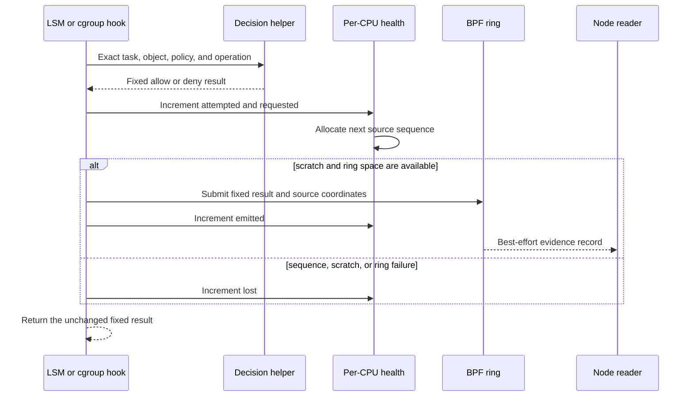
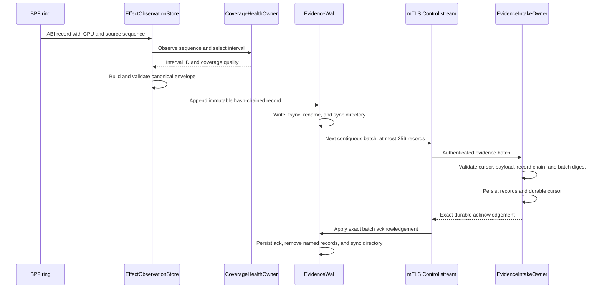
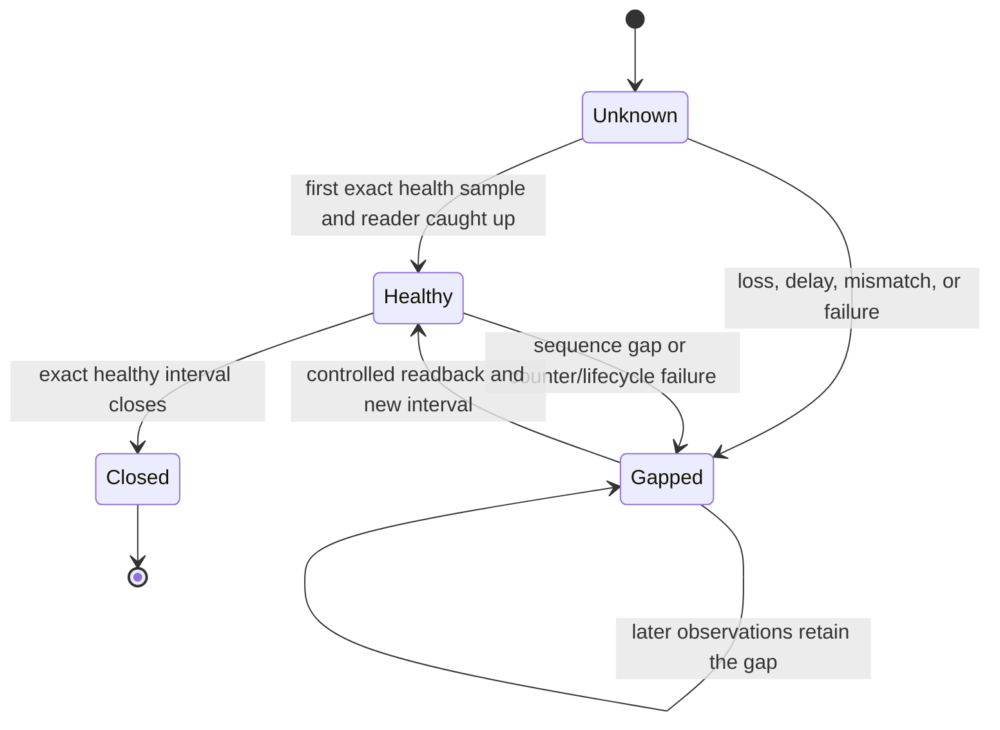

# Phase 6 Implementation Review Guide

Status: Complete source-grounded review guide for the current checked source
on 2026-08-19.

- Phase: [Durable Evidence, Coverage, And Recovery](./phase-6-durable-evidence-coverage-and-recovery.md)
- Architecture: [validated readable architecture](./policy-and-protection-algorithm-architecture-readable.md)
- BPF audit: [evidence and recovery audit](../../research/mithril-bpf-evidence-recovery-audit.md)
- Manual proof: [acceptance runbook](./manual-testing/phase-6-manual-acceptance.md)

## Review Claim

The implementation adds one durable, loss-aware evidence path to the existing
Mithril node and Control stream. It does not add another kernel loader, node
process, policy owner, or transport.

The implemented path has these properties:

- the BPF program fixes the physical result before it allocates an evidence
  sequence or reserves ring space;
- each emitted kernel record contains its CPU and nonzero per-CPU sequence;
- the node converts the record to one bounded canonical envelope with a
  deterministic observation identifier;
- the node writes one immutable, hash-chained WAL record and synchronizes it
  before upload;
- Control validates and synchronizes the record and cursor before it sends an
  acknowledgement;
- the node deletes only the exact contiguous batch named by that durable
  acknowledgement;
- source loss, reader failure, WAL failure, delayed Control, restart, and
  kernel state mismatch produce durable coverage gaps;
- a gapped interval cannot support a negative conclusion;
- retained identity, policy, mount, task, socket, and response state is
  recovered from exact owners, not from a PID, name, or cache; and
- local finding windows are deterministic for duplicate, late, reordered, and
  contradictory input.

Do not infer any of these broader claims:

- distributed causality, provider conclusions, notification, or response;
- a negative conclusion across an open, unknown, or gapped interval;
- recovery of authority from WAL records;
- payload inspection for secrets or raw administrative arguments;
- loss-free telemetry when the ring or WAL is full; or
- physical qualification on a platform other than the recorded x86_64 tier.

## Recommended Reading Order

1. Read the [phase result](./phase-6-durable-evidence-coverage-and-recovery.md#phase-result).
   Start with the exact physical record and the unsupported paths.
2. Read the [BPF audit](../../research/mithril-bpf-evidence-recovery-audit.md).
   It records the pre-change properties, gaps, and constraints from the
   production programs and the checked-in Cilium and Tetragon sources.
3. Review the portable event and health ABI in
   [`abi.rs`](../../../crates/erebor-interceptor-abi/src/abi.rs) and the C view
   in
   [`erebor_interceptor_abi.h`](../../../bpf/erebor-interceptor/include/erebor_interceptor_abi.h).
4. Review decision accounting in
   [`identity_effects.bpf.h`](../../../bpf/erebor-interceptor/programs/identity_effects.bpf.h).
   Verify that the caller supplies the fixed result before
   `emit_effect_observation` allocates a sequence or calls
   `bpf_ringbuf_reserve`.
5. Review the shared evidence contract and validation in
   [`evidence/model.rs`](../../../crates/mithril-control/src/evidence/model.rs).
   Then review kernel normalization in
   [`observation/model.rs`](../../../crates/mithril-node/src/observation/model.rs).
6. Review immutable WAL append, batch selection, acknowledgement, and replay
   in
   [`observation/wal.rs`](../../../crates/mithril-node/src/observation/wal.rs).
7. Review coverage transitions and the negative-claim rule in
   [`observation/coverage.rs`](../../../crates/mithril-node/src/observation/coverage.rs).
8. Review reader integration and WAL error classification in
   [`observation.rs`](../../../crates/mithril-node/src/observation.rs).
9. Review evidence source epoch ownership in
   [`epoch.rs`](../../../crates/mithril-node/src/epoch.rs). Then follow node
   startup, upload, reconciliation, and readiness changes in
   [`node.rs`](../../../crates/mithril-node/src/node.rs).
10. Review the existing mTLS stream extension in
    [`control.rs`](../../../crates/mithril-node/src/control.rs),
    [`control.proto`](../../../crates/mithril-control/proto/erebor/mithril/control/v1/control.proto),
    and
    [`service.rs`](../../../crates/mithril-control/src/service.rs).
11. Review Control's durable validation and acknowledgement owner in
    [`evidence.rs`](../../../crates/mithril-control/src/evidence.rs).
12. Review exact kernel manifest and identity reconciliation in
    [`host.rs`](../../../crates/erebor-interceptor/src/host.rs) and
    [`identity/native.rs`](../../../crates/mithril-node/src/identity/native.rs).
13. Review deterministic local windows in
    [`observation/window.rs`](../../../crates/mithril-node/src/observation/window.rs).
14. Finish with physical assertions in
    [`effect.rs`](../../../crates/mithril-e2e/src/effect.rs), network recovery
    assertions in
    [`effect/network.rs`](../../../crates/mithril-e2e/src/effect/network.rs),
    and the disposable VM owners in
    [`run.sh`](../../../crates/mithril-e2e/harness/vm/run.sh) and
    [`two-node-network.sh`](../../../crates/mithril-e2e/harness/vm/two-node-network.sh).

## Ownership Boundaries

| Owner | Owns | Does not own |
| --- | --- | --- |
| Production BPF programs | The physical decision, per-CPU sequence allocation, ring submission, and exact attempted, requested, emitted, lost, classifier-miss, and unresolved counters. | WAL storage, Control delivery, negative conclusions, or policy authorship. |
| `KernelHostOwner` | The exclusive pin-root lease, object load or exact recovery, maps, links, pins, manifest identities, and live readback. | Mithril evidence meaning or policy recovery. |
| `NativeSecurityStateOwner` | Boot and label epoch checks, retained task reconciliation, and failure-counter delta checks. | BPF loading, WAL replay, or finding windows. |
| `NodePolicyGenerationOwner` and existing lifecycle owners | Immutable policy generations, active pointers, references, mount views, exceptions, sockets, and response floors. | Reconstruction from evidence records. |
| `EffectObservationStore` | Ring decode, canonicalization, recent local output, durable WAL append, coverage sampling, and acknowledgement application. | The physical decision or Control durability. |
| `CoverageHealthOwner` | Durable per-source intervals, counter equations, gap reasons, revisions, and negative-claim eligibility. | Repair by inference or distributed coverage. |
| `NodeEpochs` | Durable label and evidence source epochs and the production evidence WAL directory identity. | Kernel boot identity or Control cursors. |
| `NodeControlConnector` | Evidence and coverage messages on the authenticated node stream and exact stream identity, nonce, and sequence checks. | Durable Control acceptance. |
| Shared Control evidence model | Canonical envelope, payload, proof, coverage, sensitivity, identifier, and validation types used by both Control and Node. | Kernel record normalization or durable storage. |
| `EvidenceIntakeOwner` | Control-side record validation, hash-chain validation, durable storage, contiguous cursors, coverage revisions, and acknowledgements. | Node WAL deletion or physical enforcement. |
| `DeterministicLocalWindowOwner` | Fixed sequence windows, stable identifiers, deterministic revisions, contradiction state, and coverage qualification. | Detection package evaluation or distributed graph joins. |
| Physical runners | Production-owner startup, deliberate saturation and restart, syscall or packet oracles, result capture, and owned cleanup. | A second implementation or release-record ownership. |

Mithril Node remains the single gatherer. The Interceptor remains the single
kernel loader. Control acknowledges only data that its evidence owner made
durable.

## BPF Decision And Observation Order

The kernel program returns the result selected by the policy path even when
the health map is absent, the sequence is exhausted, scratch storage is
absent, or ring reservation fails.



The accounting equations are:

```text
attempted = suppressed + requested
requested = emitted + lost
```

The current kernel path requests every represented effect, so `suppressed` is
zero in the recorded physical result. The field remains explicit in the ABI
and coverage equation. A counter regression or equation failure creates a
gap.

## Canonical Observation Contract

The Control evidence model owns the canonical envelope and its validation.
Node imports that model and adds only kernel normalization.
`ObservationCanonicalizer` binds the tenant, logical source, evidence source
epoch, node boot identity, CPU source, sequence, payload schema, payload, and
proof quality. `ObservationEnvelopeV1::validate` recomputes the observation
identifier. It rejects a changed payload, zero identity, zero epoch, zero
sequence, invalid bound, or inconsistent identifier. `EvidenceIdV1` is a type
alias for the ABI `Id128V1`; standard `From` conversions replace local
high-word and low-word converters.

The payload is a bounded typed field set. Validation rejects duplicate keys,
unknown or invalid shapes, excessive bytes, and values that exceed their
declared sensitivity contract. Secret bytes and raw administrative argument
bytes are not fields in the normal kernel payload.

The ring record digest provides transport integrity for the normalization
input. The WAL adds a separate record hash chain and batch digest.

## Durable Append And Upload Flow



WAL recovery starts from the durable acknowledgement's last record digest.
It reads segments in cursor order and validates every cursor, payload digest,
previous-record digest, record digest, and canonical envelope. A torn,
corrupt, missing, reordered, or over-capacity WAL fails closed.

Batch selection uses the encoded protobuf length. It does not estimate frame
size from payload length. Control rechecks the complete accepted hash chain
when it opens the evidence directory, and it verifies the complete persisted
coverage report before it uses the coverage cursor.

Control accepts an identical retry of the last batch. It rejects a different
record at an existing cursor, a noncontiguous batch, a stale coverage
revision, a bad digest, or a batch from a stream that does not own the current
node session.

## Coverage State And Negative Claims

Coverage is durable per CPU-derived source. Each interval has an immutable
identifier, source epoch, first and last sequence, opening and closing
counters, state, gap reasons, and revision.



The implemented gap reasons are source sequence gap, decoder error, ring loss,
classifier miss, unresolved effect, reader delay, reader stopped, WAL failure,
WAL capacity, Control delay, kernel state mismatch, unclean restart, and
counter regression. The first record for a CPU is compared with the opening
health counter. A first sequence greater than the next expected sequence
creates a gap.

An interval supports a negative claim only when it is complete and healthy.
A local window is ready only when eligible intervals cover its complete fixed
sequence range. Later reader catch-up does not edit a gapped interval into a
healthy interval.

## Recovery And Map Lifecycle

The evidence WAL is not an authority store. Recovery uses the owners that
already hold physical state:

| State | Recovery source | Rejection condition |
| --- | --- | --- |
| Interceptor maps and links | Pinned map and link handles plus startup manifest | Lease change, missing pin, map ID or layout change, link or program ID change, or program-tag change. |
| Native tasks | Retained task storage inspected through the native identity owner | Boot or label epoch change, invalid identity configuration, or new reconciliation failure. |
| Policy generations | Durable immutable generation records, active pointer, and retained references | Partial generation, readback mismatch, stale pointer, or referenced retirement. |
| Objects and mount views | Exact object keys and retained mount topology | PID, path spelling, or cache-only reconstruction. |
| Sockets and response floors | Retained socket storage, generation references, and exact behavior | Socket name or file-descriptor-number inference. |
| Exception consumption | Append-only exception records and exact receipts | Uncertain active consumption; it is conservatively exhausted. |
| Evidence source | Persisted source epoch plus WAL and coverage state | WAL or coverage exists without its source epoch. |

`verify_live_manifest` runs during node reconciliation. It verifies the lease,
each map ID and layout, each link ID, each program ID, and each program tag.
Failure closes kernel and evidence claims before later evidence can use the
state.

Identity reconciliation compares cumulative failure counters before and after
the reconciliation operation. Historical retained counts remain visible, but
a new failure in the current pass rejects recovery.

The recovered network state uses the same minimal Phase 5 ABI. The 136-byte
socket value retains only fields read by policy, evidence, recovery, or final
cleanup. The 8-byte response value stores only its closed whole-socket scope;
row existence is the fence. Recovery does not reconstruct removed metadata.

### BPF Evidence Map Lifecycle

| Map | Kernel shape | Writer | Reader | Lifetime and recovery |
| --- | --- | --- | --- | --- |
| `effect_observations` | 4 MiB ring buffer; each submitted value is one 536-byte `effect_observation_v1` | Production effect helpers submit a copy after the physical result and source sequence are fixed. | `KernelHostOwner` builds the sole `EffectObservationReader`; Node decodes each record. | The map is pinned with the Interceptor object and must match the startup manifest. Buffered records are evidence, not authority. Restart gaps coverage instead of guessing unread records. |
| `effect_observation_health` | Per-CPU array with one `u32` key `0` and one 64-byte `effect_observation_health_v1` value per CPU | Production effect helpers update attempted, suppressed, requested, emitted, lost, classifier-miss, unresolved, and next-sequence fields. | Node sums the per-CPU values for local health and reads each CPU value for exact coverage accounting. | The map is pinned and recovered only when its ID, type, key size, value size, capacity, and manifest match. Counter regression, missing state, or a changed map closes coverage and readiness. |

## Deterministic Local Windows

The local window owner groups observations by source, source epoch, and a
fixed sequence width. A stable digest identifies the window. A second digest
binds its state, sorted observation identifiers, and sorted coverage interval
identifiers into a deterministic revision.

The revision is the digest itself. The owner does not derive a separate
numeric revision by truncating digest bytes.

Duplicate input has no effect because the owner uses sets. Reordered input
has no effect because the owner sorts by source sequence and digest. Two
different observation identifiers for one source sequence mark the window
`CONTRADICTED`. Incomplete evidence or a gapped interval marks it
`COVERAGE_INSUFFICIENT`. A window remains `OPEN` until every sequence in its
fixed range has exactly one observation and complete eligible coverage spans
the same range.

## Failure Review Table

| Failure | Enforcement result | Evidence result | Recovery rule |
| --- | --- | --- | --- |
| Ring full | Fixed allow or deny is unchanged. | `lost` rises and coverage gaps. | A new interval needs exact health and reader catch-up. |
| WAL full | Fixed allow or deny is unchanged. | Append fails with `WAL_CAPACITY`; negative claim closes. | Ack or retention action may free space; the old gap remains. |
| WAL corruption | Retained kernel restrictions remain. | WAL open or replay fails closed. | Do not skip, reorder, or reconstruct the corrupt record. |
| Reader stop | Retained kernel restrictions remain. | Coverage gets `READER_STOPPED`; node exits its evidence path. | Restart and controlled readback open a later interval. |
| Control outage | Retained kernel restrictions remain. | WAL retains data within its bound; delayed Control gaps coverage after the configured bound. | Resume from the durable contiguous ack. |
| Link, program, map, or lease drift | Existing kernel behavior is not used as a healthy claim. | Coverage gets `KERNEL_STATE_MISMATCH`; readiness closes. | Recover only the exact pinned identities. |
| Node restart | Pinned restrictions and retained holders remain. | Open intervals become gapped for unclean restart. | Reconcile exact state, then open a new healthy interval. |
| Duplicate or reordered upload | No enforcement change. | Control returns the identical ack only for the identical last batch; other cursor changes reject. | Node retains records until the exact ack. |

## Test Strategy

The Rust tests execute public behavior and durable state. They do not inspect
Rust or C implementation source text.

The tests cover:

- ABI sizes, offsets, compiled BPF object content, required programs, and map
  layouts;
- canonical identifiers, payload bounds, serialization, and changed-payload
  rejection;
- WAL append, rotation bounds, replay, acknowledgement, duplicate ack,
  corruption, and capacity;
- counter equations, sequence gaps, reader and restart gaps, and
  negative-claim eligibility;
- deterministic duplicate, reorder, contradiction, and coverage-insufficient
  windows;
- Control mTLS stream identity, durable intake, duplicate delivery, bad
  chains, coverage revisions, and acknowledgement;
- retained map, link, program, task, generation, mount, socket, response-floor,
  and exception state; and
- physical saturation, fixed deny and allow controls, exact restart state,
  packet absence, and cleanup.

## Physical Review Commands

Run the disposable single-node and applicable two-node proofs from the
repository root:

```sh
crates/mithril-e2e/harness/vm/run.sh \
  --output-directory /tmp/mithril-phase6-physical

crates/mithril-e2e/harness/vm/two-node-network.sh \
  --output-directory /tmp/mithril-phase6-two-node
```

Use the K3s lane when a node-start or CRI integration change needs physical
coverage:

```sh
crates/mithril-e2e/harness/vm/run.sh --with-k3s \
  --skip-administrative-exec \
  --output-directory /tmp/mithril-phase6-k3s
```

The [manual runbook](./manual-testing/phase-6-manual-acceptance.md) records the
source state, platform, results, and result paths for the closure runs.

## Verification Record

The final source-only workspace command passed. Repository verification passed
formatting, checks, Clippy, and all ordinary tests. The separate release-record
freshness assertion was not part of this source-only delivery.

The single-node K3s run with the checked source passed. Its evidence is in
`/tmp/mithril-phase6-simplicity-20260819-r2`. The run covered native and
Kubernetes identity, CRI OBSERVE and PROTECT effects, kernel qualification,
effect observation, local enforcement, saturation, restart recovery, network
enforcement, benchmarks, cleanup, and legitimate controls.

The final two-node K3s run passed in both directions and removed both VMs. Its
evidence is in `/tmp/mithril-phase6-two-node-simplicity-20260819-r1`. The
result records remain outside the repository.

## Source Verification Boundary

Run the repository gate after the last Rust edit:

```sh
bash .github/scripts/verify-rust-ci.sh
```

The source-only verification command may exclude only
`verification_bundle_is_frozen_only_for_recorded_physical_surfaces` when the
release owner has not refreshed its qualification record. That exclusion does
not weaken the source tests. The phase result must record the exact boundary.

## Reviewer Checklist

- Confirm the result is fixed before sequence allocation and ring reserve.
- Confirm every emitted source sequence is nonzero and CPU-scoped.
- Recompute one canonical observation ID and one WAL record chain.
- Corrupt one retained record and confirm replay fails.
- Confirm Control synchronizes the cursor before it acknowledges the batch.
- Confirm a gap remains in history after a later healthy interval opens.
- Confirm a gapped window cannot support a negative claim.
- Replace or remove one live pin in a disposable environment and confirm the
  manifest check closes readiness.
- Restart with a live task, socket, response floor, mount view, and policy
  generation; confirm exact state and post-restart behavior.
- Confirm all physical result files remain outside the repository.
