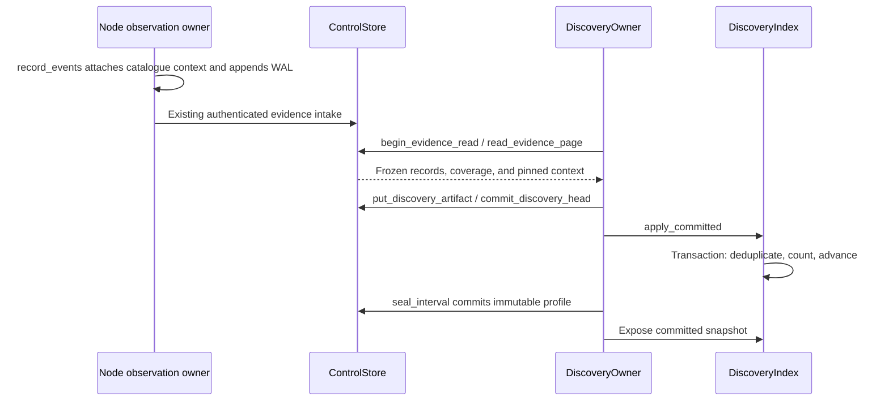
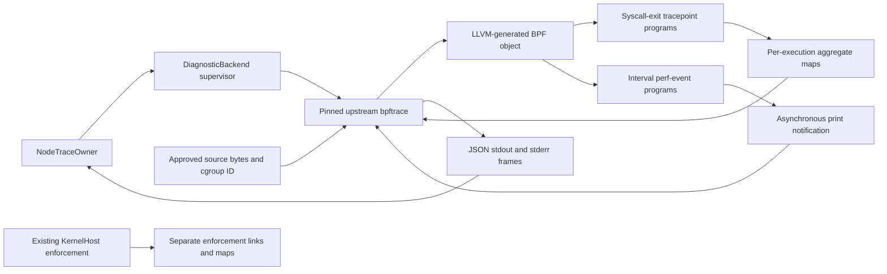

# Non-UI Branch Implementation Review

This guide covers the non-UI changes on `codex/mithril-ui`. Read the linked
flows first. Then use the owner, storage, BPF, and test sections to check each
boundary. Araphor is the product name. Existing crate names remain unchanged.

This guide describes the source implementation, not the approved target
architecture. Use the [phase plan](README.md) for implementation order and
the DuckDB/subscription contracts. Source tests below do not qualify that
target until they run against its implementation.

## Intended end state

Accepted evidence produces bounded, replayable behavior profiles and scoped
context. Diagnostic capture adds measurements for an exact workload lifetime.
The target puts retained data in AnalysisStore and keeps policy, trace grants,
and source authentication in Control. The default deployment embeds the data
crate in Control. Agents and the console will use the same owners. Neither a
query nor a diagnostic measurement grants policy authority.

Current scope: Discovery contracts, durable derivation, and offline AnalysisStore
proof are implemented. Live Control intake still uses its existing store.
Diagnostic contracts, execution, transport, and projection are implemented.
Diagnostic physical qualification is incomplete. Public SQL,
trace CLI/API, assessment submission, classification, proposal generation, and
declarative captures are not delivered by these changes.

## Linked implementation flows

### Recorded input and storage selection

This route follows the event blocks in the
[recorded-input plan](phase-7-1-contracts-and-offline-proof.md). Its fixture
limits still apply. Later live work does not turn synthetic input into field
evidence.

[pilot corpus](../../../../crates/mithril-e2e/fixtures/discovery/pilot.json) Engineer selects a frozen synthetic workload case. No production trace is supplied.<br>
-> Partial [manifest](../../../../crates/mithril-e2e/fixtures/discovery/manifest.json) Engineer pins source revision, target inputs, and permitted data scope. The inputs are fixture data.<br>
-> [DiscoveryInputManifestV1::validate](../../../../crates/mithril-control/src/discovery/model.rs) Input adapter validates the existing envelope and coverage records.<br>
-> Partial [derive_recorded](../../../../crates/mithril-control/src/discovery/recorded.rs) Adapter joins owner-supplied actor and resource bindings. Current joins use supplied fixture bindings.<br>
-> [DiscoveryOwner::derive_recorded](../../../../crates/mithril-control/src/discovery/recorded.rs) Owner builds exact atoms and a sealed snapshot.<br>
-> [simulate_recorded](../../../../crates/mithril-control/src/discovery/recorded.rs) Native compiler and PolicySimulator evaluate reconstructable keys.<br>
-> Partial [run_discovery_offline](../../../../crates/mithril-e2e/src/discovery.rs) Output includes unknown cases and a replay manifest. It contains a fixture candidate preview, not a generated proposal.

[derive_recorded](../../../../crates/mithril-control/src/discovery/recorded.rs) Required resource or role binding is absent.<br>
-> [derive_recorded](../../../../crates/mithril-control/src/discovery/recorded.rs) Adapter preserves the observation as unresolved.<br>
-> Partial [simulate_recorded](../../../../crates/mithril-control/src/discovery/recorded.rs) Preview omits invented resource or authority. The proposal builder is not implemented.<br>
-> Partial [recorded-input result](phase-7-1-contracts-and-offline-proof.md#completion-gate) Engineer records the exact owner/protocol change needed.<br>
-> Implemented outside the recorded-input delivery: [DiscoveryOwner::advance](../../../../crates/mithril-control/src/discovery/live.rs) replaces the historical wait for the reviewed live owner contract. The next flow shows that implementation.

[derive_recorded](../../../../crates/mithril-control/src/discovery/recorded.rs) Replay input or context conflicts at the same record ID.<br>
-> [derive_recorded](../../../../crates/mithril-control/src/discovery/recorded.rs) Replay returns a typed mismatch.<br>
-> [DiscoveryOwner](../../../../crates/mithril-control/src/discovery/recorded.rs) No live lookup repairs the recorded input.<br>
-> [DiscoveryDigestV1](../../../../crates/mithril-control/src/discovery/model.rs) Corrected input creates a new bundle digest.

[storage_compare](../../../../crates/mithril-e2e/harness/discovery/storage_compare.py) Engineer compares embedded stores on the same generated input.<br>
-> [measure](../../../../crates/mithril-e2e/harness/discovery/storage_compare.py) Experiment measures deduplication, micro-batches, context queries, and recovery.<br>
-> Partial [measure](../../../../crates/mithril-e2e/harness/discovery/storage_compare.py) Evaluator checks equal counts, canonical output, and measured resource use. Measurements apply to the recorded hosts.<br>
-> [native qualification](../../../../crates/mithril-e2e/src/discovery/storage.rs) SQLite passes the native storage and isolated-worker gates.<br>
-> [DiscoveryIndex](../../../../crates/mithril-control/src/discovery/index.rs) Durable discovery uses SQLite. Live Control interference remains a deployment limit.

The next route is the offline DuckDB proof. It does not replace the live
Control intake or the SQLite discovery projection.

[manifest](../../../../crates/mithril-e2e/fixtures/discovery/manifest.json) Engineer supplies the bounded recorded source, coverage, and duplicate.<br>
-> [DiscoveryOwner::derive_recorded](../../../../crates/mithril-control/src/discovery/recorded.rs) Existing owner derives the expected accepted count and snapshot digest.<br>
-> [run_discovery_offline](../../../../crates/mithril-e2e/src/discovery.rs) Existing case checks exact counts, replay, and native preview against the frozen oracle.<br>
-> [run_discovery_storage_contract](../../../../crates/mithril-e2e/src/discovery/storage_contract.rs) New case frames validated fixture records for the public data owner.<br>
-> [AnalysisStore::accept_validated_batch](../../../../crates/araphor-data/src/analysis/mod.rs) One transaction commits new records and the contiguous source receipt. An identical retry is a no-op; different content fails.<br>
-> [AnalysisStore::accept_validated_coverage](../../../../crates/araphor-data/src/analysis/mod.rs) A second transaction commits the report bytes and coverage revision.<br>
-> [AnalysisStore::source_status](../../../../crates/araphor-data/src/analysis/mod.rs) A locked read returns the exact source receipt, retained count, and digest-checked report.<br>
-> [AnalysisStore::open](../../../../crates/araphor-data/src/analysis/mod.rs) Reopen preserves store identity, revisions, receipt, report, and count.<br>
-> [storage-contract result](../../../../crates/mithril-e2e/src/discovery/storage_contract.rs) Case records nonzero cursors, revisions, counts, and digests; the independent Control policy state remains unchanged.

[inspect_read_only_shape](../../../../crates/araphor-data/src/analysis/admission.rs) DuckDB-dialect parser rejects unauthorized SQL shape and external access.<br>
-> [safe_received_at_lower_bound](../../../../crates/araphor-data/src/analysis/admission.rs) Optimization keeps a lower bound only when the predicate implies it; tests compare with full authorized input.<br>
-> [analysis_sql_worker_isolated_from_data_store](../../../../crates/araphor-data/src/analysis/mod.rs) Separate-process test checks an OS-limited in-memory worker without opening the data store. This is not QueryOwner or a public SQL API.

### Durable evidence, profiles, and context

This route describes the current source. The
[data-store plan](phase-7-2-data-store.md) defines the target storage contract.

[main](../../../../crates/mithril-control/src/main.rs) Control starts configured discovery.<br>
-> [DiscoveryOwner::open](../../../../crates/mithril-control/src/discovery/live.rs) DiscoveryOwner validates scope, supported sources, and quotas.<br>
-> [runtime checkpoint recovery](../../../../crates/mithril-control/src/discovery/runtime.rs) ControlStore opens the bounded derivation checkpoint.<br>
-> [ControlStore::read_evidence_page](../../../../crates/mithril-control/src/store/evidence_read.rs) bounded reader supplies committed evidence and pinned context.<br>
-> [DiscoveryOwner::advance](../../../../crates/mithril-control/src/discovery/live.rs) ControlStore commits a durable exported-page reference.<br>
-> [DiscoveryIndex::apply_committed](../../../../crates/mithril-control/src/discovery/index.rs) one selected-DB transaction deduplicates input, updates counts, and advances progress.<br>
-> [DiscoveryOwner::seal_interval](../../../../crates/mithril-control/src/discovery/live.rs) derivation seals checked canonical atoms and their input manifest.<br>
-> [ControlStore::commit_discovery_head](../../../../crates/mithril-control/src/store/discovery.rs) ControlStore commits the snapshot head.<br>
-> [DiscoveryOwner::read_snapshot](../../../../crates/mithril-control/src/discovery/live.rs) query index exposes only the committed snapshot and matching digest.<br>
-> [DiscoveryOwner::context_view](../../../../crates/mithril-control/src/discovery/context.rs) context builder joins versioned owner documents and rule/runbook references.<br>
-> [ContextPacket](../../../../crates/mithril-control/src/discovery/investigation.rs) packet preserves conflicts, missing facts, provenance, and disclosure classes.

[DiscoveryOwner::advance](../../../../crates/mithril-control/src/discovery/live.rs) Source gap, binding conflict, or limit occurs.<br>
-> [export and aggregation](../../../../crates/mithril-control/src/discovery/index.rs) derivation records affected intervals and exact incomplete counts.<br>
-> [DiscoveryOwner::seal_interval](../../../../crates/mithril-control/src/discovery/live.rs) derivation seals Partial or stops with a typed failure.<br>
-> [immutable artifact owner](../../../../crates/mithril-control/src/store/discovery.rs) previous complete snapshots remain unchanged.<br>
-> [BehaviorAtomV1](../../../../crates/mithril-control/src/discovery/model.rs) no overflow becomes a directory or wildcard rule.

[DiscoveryOwner::run](../../../../crates/mithril-control/src/discovery/runtime.rs) Control restarts or configured derivation is disabled.<br>
-> [ControlStore::recover_discovery_artifacts](../../../../crates/mithril-control/src/store/discovery.rs) recovery validates referenced artifacts before resuming.<br>
-> [runtime checkpoint recovery](../../../../crates/mithril-control/src/discovery/runtime.rs) enabled derivation resumes separate export and aggregation cursors.<br>
-> [DiscoveryIndex::rebuild_index](../../../../crates/mithril-control/src/discovery/index/recovery.rs) missing query state is rebuilt from retained authoritative artifacts.<br>
-> [ControlStore::recover_discovery_artifacts](../../../../crates/mithril-control/src/store/discovery.rs) orphan cleanup removes only unreferenced artifacts within the store.<br>
-> Not implemented: discovery expires only its own exported bundle references. No automatic export-reference expiry entry point exists. Orphan cleanup is not expiry of a referenced bundle.<br>
-> [bounded evidence reader](../../../../crates/mithril-control/src/store/evidence_read.rs) shared evidence consumption state remains unchanged.

### Diagnostic backend qualification

This route follows the [backend plan](../../araphor-observability/phase-1-contracts-and-backend.md).

[guest.sh](../../../../crates/mithril-e2e/harness/observability/guest.sh) Engineer selects the supported bpftrace build and platform.<br>
-> [guest.sh](../../../../crates/mithril-e2e/harness/observability/guest.sh) qualification records executable, libraries, kernel, architecture, and BTF.<br>
-> [ObservabilityQualification](../../../../crates/mithril-e2e/src/observability.rs) Interceptor proof starts one reviewed fixture on a disposable test host.<br>
-> [SupervisedChild::run](../../../../crates/erebor-interceptor/src/diagnostic.rs) proof records attachment readiness, output, limits, and process identity.<br>
-> [CaseResult::verify](../../../../crates/mithril-e2e/src/observability.rs) proof requests cancellation and verifies probe/resource removal.

[SupervisedChild](../../../../crates/erebor-interceptor/src/diagnostic.rs) Parent or child exits during preparation or collection.<br>
-> [DiagnosticCapture::drop](../../../../crates/erebor-interceptor/src/diagnostic.rs) cleanup closes only resources owned by that execution.<br>
-> [ResourceSnapshot](../../../../crates/mithril-e2e/src/observability.rs) proof verifies that enforcement links and maps did not change.<br>
-> [CaseResult::verify](../../../../crates/mithril-e2e/src/observability.rs) missing cleanup or an unbounded child blocks backend qualification.

[DiagnosticMode::Compile](../../../../crates/erebor-interceptor/src/diagnostic.rs) Caller submits source for a read-only check.<br>
-> [DiagnosticBackend::isolate_filesystem](../../../../crates/erebor-interceptor/src/diagnostic.rs) compiler-only checks run without attach authority.<br>
-> [DiagnosticFrame](../../../../crates/erebor-interceptor/src/diagnostic.rs) diagnostics identify unsupported probes or unresolved runtime requirements.<br>
-> [DiagnosticBackend::command](../../../../crates/erebor-interceptor/src/diagnostic.rs) check does not invoke bpftrace --dry-run or claim an attachment proof.

### Owned capture

This route follows the [owned-capture plan](../../araphor-observability/phase-2-owned-capture.md).
The route exists in source. The two combined physical cases listed under
verification remain open.

[TraceOwner::accept](../../../../crates/mithril-control/src/observability/owner.rs) TraceOwner accepts an authorized request.<br>
-> [ControlPlane::resolve_trace_targets](../../../../crates/mithril-control/src/service.rs) target resolver freezes authorized workload/container/node lifetimes.<br>
-> [TraceOwner](../../../../crates/mithril-control/src/observability/owner.rs) ControlStore commits source, grant, target snapshot, and dispatch identities.<br>
-> [NodeDiagnostics](../../../../crates/mithril-control/src/service.rs) authenticated node-control service sends the bounded execution grant.<br>
-> [NodeTraceOwner::admit](../../../../crates/mithril-node/src/observability.rs) Node records intent and revalidates each lifetime before attachment.<br>
-> [DiagnosticBackend::start](../../../../crates/erebor-interceptor/src/diagnostic.rs) Interceptor runs the reviewed or separately privileged script.<br>
-> [TraceSpool::append](../../../../crates/mithril-node/src/observability.rs) Node appends output to its bounded diagnostic spool.<br>
-> [TraceOwner::append](../../../../crates/mithril-control/src/observability/owner.rs) Control deduplicates batches and commits artifacts before acknowledging.

[NodeTraceOwner::capture](../../../../crates/mithril-node/src/observability.rs) Identity changes, the lease expires, or cancellation arrives.<br>
-> [NodeTraceOwner::capture](../../../../crates/mithril-node/src/observability.rs) Node stops that execution without following replacements.<br>
-> Partial [SupervisedChild::run](../../../../crates/erebor-interceptor/src/diagnostic.rs) Interceptor drains and verifies cleanup within the qualified limits. A missing resource identity produces Unknown, not Verified.<br>
-> [TraceOwner::append](../../../../crates/mithril-control/src/observability/owner.rs) Control records per-target result and remaining uncertainty.

[TraceOwner](../../../../crates/mithril-control/src/observability/owner.rs) Control or Node restarts after dispatch.<br>
-> [NodeTraceOwner::recover_inactive](../../../../crates/mithril-node/src/observability.rs) owner recovers the original execution identity.<br>
-> [NodeTraceOwner::admit](../../../../crates/mithril-node/src/observability.rs) duplicate dispatch does not spawn again.<br>
-> Partial [NodeTraceOwner::recover_inactive](../../../../crates/mithril-node/src/observability.rs) uncertain child state is reconciled or terminated, not rerun. Recovery records NodeRestarted and unknown cleanup; combined physical crash proof remains open.

The plan lists acceptance before resolution as a logical operation. Actual
callers resolve targets before `ControlPlane::accept_trace`. Acceptance checks
the frozen facts against current inventory. `TraceOwner::accept` commits those
facts; it does not resolve a name or broaden a cohort on retry.

## Owners and lifetime

| Owner and source | State, creator, and destruction | Inputs, outputs, and allowed writer | Contract proof |
| --- | --- | --- | --- |
| [NodePolicyGenerationOwner](../../../../crates/mithril-node/src/policy.rs) | Node owns the installed generations and immutable discovery catalogue. Catalogue replacement drops the old snapshot after readers release it. | Verified policy and measured exact objects produce the catalogue. Node refreshes the catalogue during policy and binding transitions. The observation batch reads one snapshot. | `discovery_catalog_pins_verified_coordinates_and_bounds_lookup` in [policy/discovery.rs](../../../../crates/mithril-node/src/policy/discovery.rs). |
| [EffectObservationStore](../../../../crates/mithril-node/src/observation.rs) | Node opens the existing observation owner and write-ahead log (WAL). Diagnostic capture does not own this log. | Kernel observations plus the catalogue produce optional decision context before WAL append. The existing observation owner remains the writer. | `discovery_context_old_and_new_wal_frames_reopen_without_reencoding` in [wal.rs](../../../../crates/mithril-node/src/observation/wal.rs). |
| [ControlStore](../../../../crates/mithril-control/src/store.rs) | Control opens one leased durable store. The last local lease owner explicitly unlocks it. Closing the owner does not delete durable records. | Existing transactions own CPU bindings, immutable artifact references, and bounded heads. Discovery and TraceOwner use these methods; neither writes the state image directly. | `discovery_store_lease_releases_after_last_owner_with_duplicate_descriptor` and `discovery_store_lease_inherited_guard_cannot_unlock_active_parent`. |
| [AnalysisStore](../../../../crates/araphor-data/src/analysis/mod.rs) | Offline proof opens one private DuckDB store and writer. Reopen retains its UUID, recovery epoch, and source receipts. | Public methods accept Control-validated identity, framed evidence, and coverage. This owner writes retained data only; it does not authenticate a Node or change policy. | [storage_contract.rs](../../../../crates/mithril-e2e/src/discovery/storage_contract.rs) and `analysis_store_commit_before_ack_survives_process_exit`. |
| [DiscoveryOwner](../../../../crates/mithril-control/src/discovery/mod.rs) | Configured runtime or an in-process caller opens the live owner. One admission guard bounds mutating work. Shutdown finishes the current bounded operation, then releases handles. | Bounded evidence pages and imported context produce export heads, profiles, and context packets. Stateless recorded-input methods need no live owner instance. | `discovery_derivation_runtime_disable_and_failure_leave_intake_active` in [runtime.rs](../../../../crates/mithril-control/src/discovery/runtime.rs). |
| [DiscoveryIndex](../../../../crates/mithril-control/src/discovery/index.rs) | Discovery opens the leased SQLite projection. Closing connections retains the database. Recovery can replace only this derived state. | One writer applies retained artifacts. Two query-only readers serve bounded reads. Authoritative artifacts, not SQL rows, determine recovery. | `discovery_index_replacement_keeps_prior_index_on_invalid_authority` in [recovery.rs](../../../../crates/mithril-control/src/discovery/index/recovery.rs). |
| [TraceOwner](../../../../crates/mithril-control/src/observability/owner.rs) | Control creates the owner over ControlStore. Accepted inputs and per-execution heads survive owner destruction. | Separate execution/read grants and optional host approval govern acceptance, append, cancellation, and disclosure. Only owner methods change trace heads. | `observability_recovery_commits_once_and_rejects_changed_output` and `observability_target_partial_cohort_never_widens_on_retry`. |
| [NodeTraceOwner](../../../../crates/mithril-node/src/observability.rs) | Node opens a private leased spool. Drop cancels and joins workers before kernel-host shutdown. Acknowledgement retires retained output; restart never respawns a retained identity. | Signed dispatch and an exact binding lease produce synced frames and a terminal result. Capture workers write output; the owner commits acknowledgement and retirement. | `observability_recovery_preserves_all_pages_and_never_respawns` and `observability_recovery_disk_full_retains_unacknowledged_terminal`. |
| [DiagnosticBackend / DiagnosticCapture](../../../../crates/erebor-interceptor/src/diagnostic.rs) | Node creates the backend. Each start owns one supervisor and child process group. Finish or Drop cancels, drains, kills if needed, and reaps. | Pinned executable, exact source, numeric cgroup ID, mode, and duration produce bounded frames and cleanup status. No policy state is writable through this API. | `observability_backend_cancel_and_forced_kill` and `observability_backend_parent_death_kills_child`. |

## Evidence to profile



### Identity and aggregation

Read [ObservationCanonicalizer](../../../../crates/mithril-node/src/observation/model.rs),
then [EvidenceDecisionContext](../../../../crates/mithril-control/src/evidence/model.rs),
then [pinned context](../../../../crates/mithril-control/src/store/discovery_context.rs).
The WAL cursor, original kernel sequence, CPU, and coverage revision are
different positions. Control persists each new stream's CPU binding before its
first segment. Legacy records without that fact remain unresolved.

Node joins only measured selectors from the verified policy generation. The
lookup key includes boot, generation, binding, role, state, entry rule, effect,
operation, exact object, and composite atom. A batch uses one immutable
catalogue. The catalogue has a 16 MiB limit; event context has a 16 KiB limit.
Missing, ambiguous, or oversized context preserves the base event with an
explicit reason. No event-time filesystem lookup supplies a guessed path.

Control checks the catalogue digest and coordinates. It joins retained policy
and workload facts, not the current workload with the same name. The join
checks tenant, node, boot, epoch, binding, profile version, and policy digest.
Runtime execution-set identity remains distinct from a signed selector slot.
Pinned context has a 32 KiB bound.

[Recorded derivation](../../../../crates/mithril-control/src/discovery/recorded.rs)
deduplicates by accepted-record identity and compares duplicate content.
Conflicting content fails. Independent repeated actions increase the count.
The atom key preserves actor, workload revision, decision key, coverage, effect,
and proof distinctions. Up to eight sorted evidence IDs represent one atom.
The interval admits at most one million records, 256 MiB of input, and 50,000
atoms. At the atom limit, new keys become unresolved; existing keys can still
increase their counts. No overflow rule becomes a wildcard.

`BehaviorAtomV1` marks an effect Prevented only when the decision is
DeniedBeforeEffect and the kernel result is negative. A zero return alone does
not prove successful completion. Count reduction is not classification.

`simulate_recorded` uses [PolicyCompiler](../../../../crates/mithril-control/src/policy/compiler.rs)
and the existing simulator for a supplied exact file/execute candidate. The
method does not discover intent, generate a policy, or activate a candidate.

### Durable storage and recovery

Read [evidence reads](../../../../crates/mithril-control/src/store/evidence_read.rs)
before [segment decoding](../../../../crates/mithril-control/src/evidence_segment.rs).
The store lock freezes bounds and opens at most four segment handles. Decoding
runs outside the lock. A page has at most 256 records and 1 MiB. Reclamation
before open returns `RetainedRangeExpired` with exact bounds. Reclamation after
open does not invalidate the open handle. Discovery never acknowledges the
shared evidence-consumption watermark.

[Artifact publication](../../../../crates/mithril-control/src/store/discovery.rs)
writes a private temporary file, syncs it, publishes the content-addressed
file, and syncs its directory before the head transaction. A head update checks
the expected predecessor. MessagePack artifacts have a SHA-256 digest and a
16 MiB limit. Logical quotas are 2 GiB per tenant and 8 GiB per process.
SQLite reserves 1 GiB of each participating tenant's logical budget. This
reserve is conservative accounting, not a measurement of that tenant's rows.

Current store metadata uses schema 6. Current SQLite uses schema 5, including
the trace tables. [Store migration](../../../../crates/mithril-control/src/store.rs)
checks the prior state and recovery copy. A future schema is rejected.
`StoreLease` records the acquiring process ID. An inherited guard cannot unlock
the parent's lease; the last owner in that process releases it explicitly.

| SQLite relation group | Meaning and writer |
| --- | --- |
| `source_progress`, `input_record`, `behavior_atom`, `profile_index` | `apply_committed` changes deduplication, exact counts, and progress in one transaction. Primary and unique keys replace redundant position indexes. |
| `context_document`, `context_progress` | Context import commits authority first. Projection replays those immutable revisions. |
| `revision_origin`, `revision_event`, `revision_prefix` | [project_revisions](../../../../crates/mithril-control/src/discovery/index/feed.rs) tracks projected origins and the common committed prefix. |
| `traces`, `trace_output`, `trace_measurements` | [project_trace](../../../../crates/mithril-control/src/discovery/index/trace.rs) replays accepted trace artifacts. Trace revisions do not increase physical-action counts. |

SQLite has one writer, eight pending writer admissions, and two readers. Reads
have a one-second deadline. Snapshot pages have at most 200 rows and 1 MiB.
The production methods run fixed bounded queries. The experiment's arbitrary
SQL worker is not a public production SQL endpoint.

[Runtime scheduling](../../../../crates/mithril-control/src/discovery/runtime.rs)
scans at most 32 sources per pass. It admits four active and 32 pending
intervals per process, and two active and eight pending intervals per tenant.
Export, aggregation, and snapshot positions remain separate. A retry after an
export commit reuses that artifact instead of counting records again. A late
coverage change can update the profile without adding action counts.

[Rebuild](../../../../crates/mithril-control/src/discovery/index/recovery.rs)
holds the index lease, replays retained authority into a candidate database,
checks integrity and counts, checkpoints and syncs it, then installs it through
a digest-bearing recovery marker. Recovery handles interrupted installation.
It does not delete authoritative input to make a corrupt projection usable.
Artifact recovery finishes before trace admission. Automatic expiry of
referenced discovery exports is absent; quota enforcement stops further work.

### Context and agent contracts

[Context import](../../../../crates/mithril-control/src/discovery/context.rs)
checks import/review access and stores immutable revisions. One document is
limited to 64 KiB. The catalogue permits 1,024 document identities and 8,192
revisions. Reads bind subject, lifetime, method, historical cutoff, and current
disclosure access. Conflicts and omissions remain visible. An expired latest
revision does not silently expose an older revision.

`context_view` admits at most 64 evidence references, 16 pinned references,
100 combined references, and 256 KiB. The packet states missing rollout and
owner-time proof explicitly. A bounded export is not a complete workload
profile. Imported text is data, not agent instructions or authority.

[Investigation contracts](../../../../crates/mithril-control/src/discovery/investigation.rs)
validate query shape, follow scope, evidence references, assessments, and
suggestions. A resume identity binds query, scope, disclosure revision, view,
projection epoch, expiry, and position. The public cursor codec and executor
are not implemented here. Reports bind the exact context digest and method.
Citation validity does not prove the cited claim. Missing evidence or model
refusal cannot become a benign classification. Suggestions do not execute.

## Trace request to retained output

```mermaid
sequenceDiagram
    participant C as ControlPlane / TraceOwner
    participant N as NodeChassis / NodeTraceOwner
    participant B as DiagnosticBackend
    participant P as bpftrace child
    participant S as ControlStore / DiscoveryIndex
    C->>S: Commit accepted source, grants, and targets
    N->>C: exchange_diagnostics
    C-->>N: Signed TraceDispatchV1
    N->>N: Verify dispatch, binding lease, and synced intent
    N->>B: start with exact source and cgroup ID
    B->>P: Execute checked inode; write source to stdin
    P-->>B: Attach notification and output
    B-->>N: Bounded frames
    N->>N: Sync spool; publish committed sequence
    N->>C: Exchange retained batch
    C->>S: Commit deduplicated output artifacts
    C-->>N: Durable acknowledgement
    N->>N: Commit terminal acknowledgement before reclaim
    S->>S: Project trace heads and typed measurements
```

### Authority and exact targets

Start with [TraceRequestV1](../../../../crates/mithril-control/src/observability/model.rs)
and [TraceOwner](../../../../crates/mithril-control/src/observability/owner.rs).
Source is UTF-8, has no NUL, and has a 64 KiB bound. A request has at most 16
resolved plus unresolved participants and at least one executable target.
Resolved targets bind Control workload facts, their digest, actual container
runtime ID, node boot, cgroup ID, binding ID, nonce, live interval, container
generation, and label epoch. A scheduled container ID is not a runtime ID.

An execution grant is not a read grant. Namespace-scoped execution requires
the exact reviewed recipe digest. Other source requires host-diagnostic
authority and a separate approval of the request and grant digests. A source
predicate is not a sandbox. An accepted retry cannot add replacement targets.
Unbound workloads are Unsupported. A known but unready node is Unavailable.

[TraceDispatchV1](../../../../crates/mithril-control/src/observability/dispatch.rs)
uses Ed25519 with the `ARAPHOR-TRACE-DISPATCH-V1` domain. The signature binds
the complete accepted request and target index. Node checks current signer
trust, issuer epoch, tenant, node, boot, and time. The
[NodeDiagnostics service](../../../../crates/mithril-control/src/service.rs)
also checks the existing mutually authenticated TLS session. Transport messages
are bounded at 8 MiB; two nonqueued admissions bound diagnostic RPC work.
There is no direct agent-to-Node endpoint.

[resolve_trace_target](../../../../crates/mithril-node/src/identity/binding.rs)
holds the original cgroup descriptor and checks the published binding before
attachment and during capture. Control resolution is bounded and times out.
Node does not follow a name, PID, or cgroup replacement. Partitioned execution
ends at its local deadline even if Control cannot deliver cancellation.

### Spool, retry, and shutdown

[NodeTraceOwner](../../../../crates/mithril-node/src/observability.rs) opens a
0700 directory with private files and a no-follow exclusive lease. At most two
active or unacknowledged executions occupy slots. Each slot reserves 68 MiB for
encoded output and 4 KiB for its terminal record before durable intent. The
allocation also preserves the configured evidence reserve and metadata budget.
The raw-output bound remains 16 MiB and 4,096 frames.

The owner syncs intent before spawn. It syncs each output frame before exposing
the committed sequence. Readers ignore an incomplete trailing JSON line, but
reject a malformed complete line. The terminal record uses a reserved file,
sync, rename, and directory sync. An active worker cannot expose an uncommitted
terminal result.

`poll_diagnostics` in [node.rs](../../../../crates/mithril-node/src/node.rs) runs
on the 500 ms diagnostic cadence. Storage work uses `spawn_blocking`; Control
RPC waits use the existing runtime-service path. This is not a claim that all
Control-loop latency is eliminated. The exchange sends at most one retained
output batch per call.

Control compares frames by sequence and bytes, not by batch boundaries. It
accepts identical regrouped retries and a late terminal record. Gaps or changed
duplicates fail. The current enrolled node can upload retained output from its
original execution boot after reconnect.

Node commits acknowledgement before reclaiming output. A failed acknowledgement
write preserves the output for retry. Up to 128 acknowledged identities remain
until expiry. A durable retirement cutoff prevents clock rollback from making
an old identity executable again. Recovery retains the original identity and
reports NodeRestarted with incomplete output and unknown cleanup. It never
uses restart as permission to spawn again.

[Trace projection](../../../../crates/mithril-control/src/discovery/index/trace.rs)
checks the current authoritative head and current read grant. A stale projection
does not bypass revocation. Output is bounded by the captured head's sequence.
Only reviewed output schemas produce typed measurements. Cumulative snapshots
remain separate snapshots; adding them would count the same events repeatedly.

## BPF programs and maps



### Actual script and launch code

The reviewed [failed-opens.bt](../../../../crates/mithril-e2e/fixtures/observability/failed-opens.bt)
contains:

```bpftrace
tracepoint:syscalls:sys_exit_openat
/cgroup == $1 && args.ret < 0/
{ @errors[args.ret] = count(); }
interval:s:1 { print(@errors); }
```

`$1` is the frozen numeric cgroup ID. The recipe records negative `openat`
returns for the current task in that cgroup. It does not cover every file-open
API. The [syscall-errors.bt](../../../../crates/mithril-e2e/fixtures/observability/syscall-errors.bt)
recipe uses `tracepoint:raw_syscalls:sys_exit` and keys counts by syscall ID and
raw return value. The `raw_syscalls` category does not make this a raw-tracepoint
program type.

[DiagnosticBackend::command](../../../../crates/erebor-interceptor/src/diagnostic.rs)
contains this launch sequence:

```rust
if mode == DiagnosticMode::Compile {
    command.arg("-d");
}
command.args(["-B", "none", "-f", "json", "-", &cgroup_id.to_string()]);
```

The executable is `/proc/self/fd/<checked descriptor>`, not a second lookup of
the configured path. `start` opens and hashes that inode. `SupervisedChild::run`
writes the exact source bytes to standard input and closes standard input.
There is no shell, generated C file, Rust parser, or Araphor BPF compiler.
The production [recipe manifest](../../../../crates/mithril-control/src/observability/recipe.rs)
binds exact source and output semantics; the `.bt` files are physical fixtures.

The referenced libbpf-rs `TracepointCategory` enum is not used by this path.
That enum supplies category strings to an attachment API for an already-loaded
program. It does not compile bpftrace source or discover the running kernel's
available events. Existing [KernelHost attachment](../../../../crates/erebor-interceptor/src/host.rs)
uses libbpf-rs `program.attach()` for supported object sections. Diagnostics
delegate compilation and attachment to the supervised bpftrace child. These
are separate loaders with separate resource ownership.

Upstream bpftrace parses the source and generates BPF with LLVM. Its
[versioned code generator](https://github.com/bpftrace/bpftrace/blob/v0.20.2/src/ast/passes/codegen_llvm.cpp)
assigns generated sections per probe. Araphor does not prescribe an ELF section
ABI. Its [attachment owner](https://github.com/bpftrace/bpftrace/blob/v0.20.2/src/attached_probe.cpp)
loads and attaches those programs. The qualified executable is the Ubuntu
0.20.2 build recorded in the backend plan, not an unpinned current release.

### Programs, guards, and physical effect

| Program / source | Type, section, hook, and context | Guard, maps, helpers, and result |
| --- | --- | --- |
| Failed-open event program | `BPF_PROG_TYPE_TRACEPOINT`; generated section for `tracepoint:syscalls:sys_exit_openat`; syscall-exit tracepoint context supplies `ret`. | `bpf_get_current_cgroup_id` supplies the equality predicate. Negative returns update `@errors` through map lookup/update. Generated tracing return is zero; it does not deny or replace the syscall result. |
| Syscall-error event program | `BPF_PROG_TYPE_TRACEPOINT`; generated section for `tracepoint:raw_syscalls:sys_exit`; context supplies `id` and `ret`. | Same cgroup and negative-return guards. Updates the composite-key `@errors` map. No enforcement effect. |
| Recipe interval programs | `BPF_PROG_TYPE_PERF_EVENT`; generated section for `interval:s:1`; timer event context. | Requests asynchronous map printing. Output uses a ring buffer when supported, otherwise perf-event output. Userspace reads map values. Printing is not an atomic event snapshot. No syscall decision changes. |
| [quiet.bt](../../../../crates/mithril-e2e/fixtures/observability/quiet.bt) | Perf-event program for `interval:ms:100`. | Assigns a local scalar. No user aggregate map or output is required. Proves that silence does not mean failed attachment. |
| [histogram.bt](../../../../crates/mithril-e2e/fixtures/observability/histogram.bt) | Perf-event program for `interval:ms:10`. | Increments the histogram bucket for 5 in `@x`; map lookup/update helpers support aggregation. Final userspace map printing is output, not a text readiness banner. |
| [partial-attach.bt](../../../../crates/mithril-e2e/fixtures/observability/partial-attach.bt) | Perf-event interval plus a generated `BPF_PROG_TYPE_KPROBE` section for deliberately missing `araphor_missing_hook_5f6d`; a valid kprobe would receive register context. | Interval updates `@x`; the missing hook cannot provide events for `@y`. Attachment failure requires cleanup of any preceding attachment. No successful capture is inferred from the first attached probe. |

These helper and type mappings come from the pinned upstream
[helper builder](https://github.com/bpftrace/bpftrace/blob/v0.20.2/src/ast/irbuilderbpf.cpp)
and attachment owner. Map lookup can miss. Insertion or asynchronous output can
fail. Neither failure proves complete capture. Araphor retains diagnostics and
uncertainty; it does not claim an exact kernel-loss counter when none is known.
The kernel verifier checks generated programs before attachment. Recipe digest
checks and target lifetime checks occur before the child starts. Failure there
rejects collection; the existing enforcement decision remains independent.

### Map ownership and lifetime

The table describes the reviewed recipes and qualification scripts. Upstream
owns generated binary layouts; Araphor consumes JSON, not these map bytes.
Integer map layouts use the target's native byte order. The qualified target
is x86-64. See upstream [map construction](https://github.com/bpftrace/bpftrace/blob/v0.20.2/src/map.cpp).

| Map | Key and value ABI | Userspace writer | BPF writer | Readers | Lifetime |
| --- | --- | --- | --- | --- | --- |
| Failed-open `@errors` | Signed 64-bit raw return key; per-CPU 64-bit count value. | bpftrace creates the map. Araphor never writes entries. | Syscall-exit event program. | bpftrace reduces per-CPU values for JSON output. | One child execution; no Araphor pin. |
| Syscall-error `@errors` | Two signed 64-bit key components: syscall ID and raw return; per-CPU 64-bit count. | bpftrace creates the map. | Syscall-exit event program. | bpftrace and then the typed JSON decoder. | One child execution; no Araphor pin. |
| Fixture `@x` histogram | Generated histogram bucket key; 64-bit count per CPU. | bpftrace creates the map. | Histogram interval program. | bpftrace final output. | Qualification child only; not a typed production recipe. |
| Partial-attach `@x` and `@y` | Keyless count uses a 32-bit zero key and 64-bit per-CPU count. | bpftrace creates the maps. | Interval and, only if attachment succeeded, kprobe program. | bpftrace. | Failure cleanup owns all resources created for this child. |
| Generated asynchronous output and loss state | Ring-buffer records, or perf-event-array CPU keys and event descriptors; internal loss state is compiler-owned. | bpftrace creates and configures the transport. | Generated print/output code writes notifications and supported loss state. | bpftrace emits JSON/stderr; supervisor reads pipes. | Same child lifetime. This transport is not the enforcement evidence ring. |
| Existing enforcement maps and links | Existing Interceptor ABI; unchanged by this branch. | Existing KernelHost and policy owners only. | Existing enforcement programs only. | Existing Node readers; qualification compares resource identities. | Existing pins retain objects until their owner removes them. Diagnostic cleanup does not remove these pins. |

A bpffs pin keeps a map or link alive after its loader exits. Process exit is
not a general pinned-object cleanup mechanism. The diagnostic child receives
a private read-only mount namespace; the supported scripts do not create pins.
The supervisor stops the child and checks removal of observed program/map IDs.
No observed IDs means cleanup is Unknown. Physical qualification additionally
compares host-wide resource snapshots and the enforcement baseline.

[KernelHost decommission](../../../../crates/erebor-interceptor/src/host.rs)
now waits up to one second for deferred map release after explicit teardown.
The owner still removes only its own enforcement resources. This change does
not transfer enforcement loading or pin ownership to bpftrace. The
[ownership amendment](../phase-0-artifacts/interceptor-ownership.md)
permits the separate supervised diagnostic loader.

### Supervision limits and readiness

The backend clears the inherited environment and fixes map/probe limits.
Capture permits 4,096 map keys, 16 probes, and 16 BPF programs. The process has
private mount/network namespaces, read-only device-restricted mounts, and
`no_new_privs`. Compile mode also removes capabilities. Capture remains
privileged; these controls are not an arbitrary-script sandbox.

The child has a private process group and a parent-death kill signal. The
supervisor preserves process identity until reaping. Nonblocking pipe reads
are bounded per pass. The frame channel holds 256 items; consumer saturation
stops capture instead of silently dropping output. A frame is at most 1 MiB.
The terminal result has a separate path.

Readiness requires the qualified `__BPFTRACE_NOTIFY_PROBES_ATTACHED` stderr
notification. Spawn and stdout are insufficient. Preparation has a ten-second
limit. Collection starts after readiness. Cancellation permits a five-second
drain, then kills and reaps remaining processes. Resource sampling records
bounded program/map ID sets and checks their disappearance for one second.
These checks cannot reconstruct an ID that was never observed.

## ABI and serialization boundaries

| Producer to consumer | Encoding and validity | Rejection or uncertainty |
| --- | --- | --- |
| Existing BPF effect record to [Node observation](../../../../crates/mithril-node/src/observation.rs) | Existing `EffectObservationV1` is a native-layout, all-bit-valid integer structure. `FromBytes::read_from_bytes` rejects a wrong size. Semantic normalization remains a separate check. | Bad records affect decode/coverage health; byte-length acceptance is not semantic proof. No kernel record layout changes in this branch. |
| Existing exact-file measurement to [KernelHost](../../../../crates/erebor-interceptor/src/host.rs) | `TryFromBytes::try_read_from_bytes` validates enum-bearing ABI values as well as size. This differs from all-bit-valid `FromBytes`. | The host returns its checked measurement error. This pre-existing decoder is a dependency, not a new diagnostic ABI. |
| Node observation to [Control protobuf](../../../../crates/mithril-control/proto/erebor/mithril/control/v1/control.proto) | Optional decision context is field 21. Fields 1–20 remain unchanged. Identity byte fields have exact 16-byte big-endian encoding. Original kernel sequence is separate from WAL cursor. | [Evidence model validation](../../../../crates/mithril-control/src/evidence/model.rs) checks schema, sizes, catalogue digest, IDs, object handle, effect, and operation. Invalid values return `EvidenceModelError`. Missing context remains explicit. |
| Evidence file to [bounded decoder](../../../../crates/mithril-control/src/evidence_segment.rs) | Existing protobuf frame; big-endian 32-bit length and CRC32C. Reader checks the frozen index, length, checksum, and protobuf decoding. | Changed frames return `ControlStore` errors. An open descriptor survives pathname unlink; it does not waive checksum validation. |
| Control owner to [artifact store](../../../../crates/mithril-control/src/store/discovery.rs) | Versioned MessagePack, SHA-256, bounded payload and dependencies. No cross-platform raw Rust struct serialization. | Typed `Discovery` codes distinguish schema, digest, quota, and reference failures. |
| Index positions to [SQLite](../../../../crates/mithril-control/src/discovery/index.rs) | Unsigned 64-bit positions use fixed eight-byte big-endian blobs where ordered full-range values are required. Constraints and checked arithmetic protect counts and uniqueness. | Overflow or mismatched replay fails the transaction; no partial count/progress commit. |
| Control dispatch to [Node](../../../../crates/mithril-control/src/observability/dispatch.rs) | Versioned typed request inside bounded diagnostic transport; Ed25519 signature over domain-separated complete inputs. | Session, trust, digest, scope, lifetime, or signature failure rejects execution through typed trace errors. |
| bpftrace to [TraceRecipeV1::measurements](../../../../crates/mithril-control/src/observability/recipe.rs) | Bounded raw frame bytes first; exact reviewed JSON map schema second. Integer keys/counts must be valid. Unknown stdout does not become a measurement. | Raw evidence remains available. Spoofed or unknown measurement shapes produce no typed row. Syscall ID `-1` remains unknown, not a guessed syscall. |

Raw negative syscall returns include kernel restart codes such as `-512`.
These values are not necessarily final userspace errno results. A cumulative
map snapshot is neither a complete action log nor proof of a successful or
prevented effect. Enforcement evidence supplies the separate decision proof.

## Verification route and limits

### Committed tests

| Read these tests | Contract to verify |
| --- | --- |
| [discovery/tests.rs](../../../../crates/mithril-control/src/discovery/tests.rs), [corpus.rs](../../../../crates/mithril-control/src/discovery/tests/corpus.rs) | Exact counts, conflicting duplicates, changed actors/images/objects, incomplete coverage, native preview, scoped resume, invalid reports, and citation limits. |
| [evidence_read.rs tests](../../../../crates/mithril-control/src/store/evidence_read.rs) | Frozen pages, retention races, bounds, store identity, and CPU metadata. |
| [store.rs tests](../../../../crates/mithril-control/src/store.rs), [artifact tests](../../../../crates/mithril-control/src/store/discovery.rs) | Migration, leases, synced references, orphan cleanup, quotas, and pinned workload/policy context. |
| [index.rs tests](../../../../crates/mithril-control/src/discovery/index.rs), [recovery.rs tests](../../../../crates/mithril-control/src/discovery/index/recovery.rs) | Atomic deduplication/counts/progress; invalid authority; index replacement across process exits. |
| [runtime.rs tests](../../../../crates/mithril-control/src/discovery/runtime.rs), [live.rs tests](../../../../crates/mithril-control/src/discovery/live.rs) | Separate checkpoints, nine process-crash boundaries, exact gaps, resource admission, disable/failure isolation, and rebuild. |
| [context.rs tests](../../../../crates/mithril-control/src/discovery/context.rs), [feed.rs tests](../../../../crates/mithril-control/src/discovery/index/feed.rs) | Cutoffs, disclosure, conflicts, context replay, and stable revision positions. |
| [roundtrip.rs](../../../../crates/mithril-e2e/src/discovery/roundtrip.rs) | `discovery_context_roundtrip_uses_verified_catalog_wal_and_mtls` and `discovery_derivation_profile_restart_uses_wal_and_mtls` use production owners with synthetic external inputs. |
| [storage.rs](../../../../crates/mithril-e2e/src/discovery/storage.rs) | Native SQLite bounds and isolated query-worker qualification. This is not a shipped arbitrary-SQL API. |
| [storage_contract.rs](../../../../crates/mithril-e2e/src/discovery/storage_contract.rs), [analysis/mod.rs tests](../../../../crates/araphor-data/src/analysis/mod.rs), [admission.rs tests](../../../../crates/araphor-data/src/analysis/admission.rs) | Offline DuckDB commits, duplicate rejection, reopen, coverage digest, post-commit process exit, SQL admission, authorized-input equivalence, and isolated worker. No live intake or QueryOwner proof. |

### Diagnostic tests and physical harnesses

| Read these tests or harnesses | Contract and limit |
| --- | --- |
| [diagnostic.rs tests](../../../../crates/erebor-interceptor/src/diagnostic.rs) | Executable/source checks, output bounds, quiet child, deadlines, cancellation, forced kill, and parent death. Process doubles do not prove real BPF attachment. |
| [owner.rs tests](../../../../crates/mithril-control/src/observability/owner.rs), [dispatch.rs tests](../../../../crates/mithril-control/src/observability/dispatch.rs) | Separate grants, complete signature binding, frozen partial cohorts, regrouped replay, changed frames, and late terminal. |
| [Node tests](../../../../crates/mithril-node/src/observability.rs) | Recovery does not respawn; only synced output is visible; allocation preserves the evidence reserve; disk-full acknowledgement retains output. |
| [service.rs tests](../../../../crates/mithril-control/src/service.rs), [contract.rs](../../../../crates/mithril-control/tests/contract.rs), [control_tls.rs](../../../../crates/mithril-e2e/src/control_tls.rs) | Authenticated dispatch/reconnect, current-session checks, durable output, and revocation. The mTLS test does not itself execute a kernel trace. |
| [trace.rs tests](../../../../crates/mithril-control/src/discovery/index/trace.rs), [recipe.rs tests](../../../../crates/mithril-control/src/observability/recipe.rs) | Rebuild preserves cumulative snapshots and grants. Unknown syscall values remain unknown. Spoofed schemas are rejected. |
| [observability.rs](../../../../crates/mithril-e2e/src/observability.rs), [test binary](../../../../crates/mithril-e2e/src/bin/mithril_observability_test.rs), [guest.sh](../../../../crates/mithril-e2e/harness/observability/guest.sh) | Automated physical backend cases on a disposable host; resource snapshots before and after each case. Not part of an ordinary unprivileged test run. |
| [pods.sh](../../../../crates/mithril-e2e/harness/observability/pods.sh), [pods.yaml](../../../../crates/mithril-e2e/fixtures/observability/pods.yaml), [k3s-syscall-map.json](../../../../crates/mithril-e2e/fixtures/observability/k3s-syscall-map.json) | Real target/foreign-Pod attribution for both recipes. This is backend attribution, not the complete Node-owned Pod replacement test. |
| [Host qualification](../../../../crates/mithril-e2e/src/platform/host.rs), [owned.sh](../../../../crates/mithril-e2e/harness/observability/owned.sh), [process fixture](../../../../crates/mithril-e2e/fixtures/process/observability.py) | Full Node/Control capture, five paired interference runs, and failure cases with physical enforcement checks. |
| [disk-full.sh](../../../../crates/mithril-e2e/harness/observability/disk-full.sh) | Physical bounded-filesystem proof that failed acknowledgement preserves output and a later retry succeeds. |

The source review recorded storage, crash, context and runtime proof.
Its shared-host interference run
measured intake p95 +16.9% and rollout p95 +7.7%. The owner remains disabled by
default. The result is not a no-interference guarantee.

The [backend result](../../araphor-observability/phase-1-contracts-and-backend.md)
records 16 physical cases on the pinned build. The
[owned-capture result](../../araphor-observability/phase-2-owned-capture.md)
records the passing quiet five-pair repeat, its earlier failed overhead run,
failure cases, disk-full case, and proof archive hashes. Zero measured loss
deltas do not prove uninterrupted coverage; the logs also retain readiness
gaps. These are prior automated physical results, not runs performed while
writing this guide.

**Not done:** complete Node-owned capture across real Pod replacement, and the
combined physical Node crash-before/after-spawn recovery cases. Separate backend
parent-death and spool-recovery tests do not close those combined gates.

For a new source verification run, use the existing commands. Keep physical
execution on an explicitly owned disposable host.

```sh
cargo test -p mithril-control discovery::
cargo test -p mithril-node discovery_
cargo test -p mithril-e2e discovery_
cargo test -p erebor-interceptor observability_backend_
cargo test -p mithril-control observability_
cargo test -p mithril-node observability_
cargo test -p mithril-e2e observability_
bash .github/scripts/verify-rust-ci.sh
```

## Remaining branch changes

The following inventory covers integration, dependency, fixture, and planning
changes that support the flows above. A plan link does not prove that its
future owner exists. UI code and the console-only plan family are excluded.

| Changed files | Review purpose and current boundary |
| --- | --- |
| [workspace Cargo.toml](../../../../Cargo.toml), [Cargo.lock](../../../../Cargo.lock), [Control manifest](../../../../crates/mithril-control/Cargo.toml), [data manifest](../../../../crates/araphor-data/Cargo.toml) | Pin the existing SQLite backend and the offline DuckDB data crate. DuckDB is not yet the live intake backend. |
| [Interceptor manifest](../../../../crates/erebor-interceptor/Cargo.toml), [Interceptor exports](../../../../crates/erebor-interceptor/src/lib.rs) | Add diagnostic process/mount/thread system calls and export the supervised backend. No new daemon or generic backend interface. |
| [Control build.rs](../../../../crates/mithril-control/build.rs), [Control exports](../../../../crates/mithril-control/src/lib.rs), [observability module](../../../../crates/mithril-control/src/observability/mod.rs), [Control errors](../../../../crates/mithril-control/src/error.rs) | Generate strict JSON support for decision-context protobuf types; expose owner contracts and typed errors. |
| [Control config](../../../../crates/mithril-control/src/config.rs), [signing-key reader](../../../../crates/mithril-control/src/policy/reconciliation.rs), [server](../../../../crates/mithril-control/src/server.rs) | Discovery is opt-in. Diagnostics require Discovery storage and a trusted configured signing key. Reuse the existing key reader. Register the bounded NodeDiagnostics service on existing authenticated transport. |
| [evidence intake](../../../../crates/mithril-control/src/evidence.rs) | Preserve CPU in accepted groups. Reject mixed or changed CPU before acceptance. New tests check decision-context transport and restart. |
| [Node config](../../../../crates/mithril-node/src/config.rs), [Node transport](../../../../crates/mithril-node/src/control.rs), [Node errors](../../../../crates/mithril-node/src/error.rs), [Node exports](../../../../crates/mithril-node/src/lib.rs), [identity exports](../../../../crates/mithril-node/src/identity/mod.rs) | Diagnostics default to absent. Validate the evidence reserve and qualification record. Add bounded exchange on the existing connection and export the target lease. |
| [e2e manifest](../../../../crates/mithril-e2e/Cargo.toml), [e2e exports](../../../../crates/mithril-e2e/src/lib.rs), [Discovery binary](../../../../crates/mithril-e2e/src/bin/mithril_discovery_test.rs), [experiment requirements](../../../../crates/mithril-e2e/harness/discovery/requirements.txt) | Register runnable qualification entry points. Move shared certificate/temp-directory support where binaries can use it. Keep comparison-only dependencies outside production Control. |
| [control_fixture.rs](../../../../crates/mithril-e2e/src/control_fixture.rs), [physical.rs](../../../../crates/mithril-e2e/src/physical.rs), [effect.rs](../../../../crates/mithril-e2e/src/effect.rs) | Reuse policy/TLS fixtures and bounded asynchronous waits from qualification binaries. Keep test-only effect code behind the test configuration. |
| [effect/support.rs](../../../../crates/mithril-e2e/src/effect/support.rs), [identity/fixture.rs](../../../../crates/mithril-e2e/src/identity/fixture.rs), [policy_delivery.rs](../../../../crates/mithril-node/src/policy_delivery.rs) | Existing test configurations explicitly set `diagnostics: None`. These edits do not change policy-delivery semantics. |
| [platform/shared.rs](../../../../crates/mithril-e2e/src/platform/shared.rs), [qualification checkpoint](../phase-6-2-closure-matrix.md) | Separate the 60-second Node startup bound from the 30-second operation bound. Report elapsed startup time. Reuse the shared platform for owned capture. The recorded 47 Host passes do not prove Kubernetes or direct-runc closure. |
| [plan index](../../README.md), [Discovery parent](README.md), [Observability parent](../../araphor-observability/README.md), [Mithril parent](../README.md) | Define the combined implementation order. Preserve each owner's scope and the difference between source availability and physical qualification. |
| [engine design](engine-design.md), [intelligence design](local-intelligence.md), [console/API contract](console-and-api.md) | Specify one shared context, assessment, query, and governed-action system. These non-UI contracts remain in scope. Model integration and public tool delivery are not implemented by a schema alone. |
| [research](research-and-demand.md), [verification contract](verification.md) | Record incident-inspired demand, upstream design references, and acceptance requirements. Research is not a claim that upstream runtime code was copied or deployed. |
| [proposal plan](phase-7-6-methods-and-preview.md), [classification plan](phase-7-7-agent-investigation-and-classification.md), [publication plan](phase-7-8-console-and-publication.md), [final qualification plan](phase-7-10-qualification.md) | Future Discovery work. No production proposal generator, classifier/model runner, assessment publication API, or new response authority exists in this branch. Console-only implementation is excluded from this guide. |
| [CLI/API plan](../../araphor-observability/phase-3-cli-api-and-console.md), [declarative capture plan](../../araphor-observability/phase-4-declarative-captures.md) | Future `araphor sql`, `araphor trace`, shared gRPC reads, and optional Kubernetes Trace resource. Internal Rust methods and Node RPC are not those public interfaces. |
| [Control/detection plan](README.md), [distributed causality plan](../phase-8-kubernetes-distributed-causality.md) | Plan amendments require later detection and graph owners to reuse shared storage and owner-qualified references. These amendments do not implement those owners. |
| [response plan](../phase-9-local-and-distributed-response.md), [provider plan](../phase-10-provider-connectors-and-recovery.md), [installation/conformance plan](../phase-11-production-installation-and-final-conformance.md) | Plan amendments keep approval, physical response, provider evidence, recovery, and deployment proof distinct. A diagnostic trace cannot substitute for those results. |

Node diagnostic enablement requires at least five paired runs, the exact
executable digest, kernel, architecture, CPU allocation, and an explicit allowed
overhead. The configured reserve is at least 256 MiB and covers the evidence
WAL limit plus metadata. Qualification input is an operator-supplied record,
not a cryptographically verified attestation of the measured run.

## Source state and guide verification

The offline AnalysisStore proof is committed on `codex/mithril-ui` at
`9a6f38f1`. The branch merge base with local `main` is
`a9586be0ccaa2f38022721c911302bab36585c43`. The new data-owner route
does not certify live Node intake, QueryOwner, or trace API frames.

The current offline runs are `storage-contract` and `offline-exact` under
`/tmp/araphor-proof.Ejt7yh/`. Both report `PASS`. The isolated SQL worker
test passed with `--ignored`. The storage case reports three retained events,
contiguous cursor 3, coverage revision 1, and commit revision 2. Physical
diagnostic results above are prior recorded runs, not fresh runs for this
offline proof.
