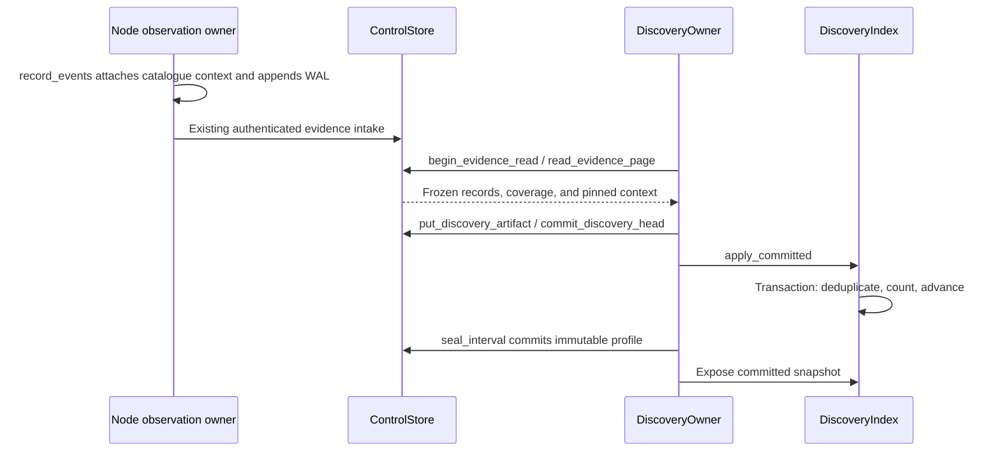
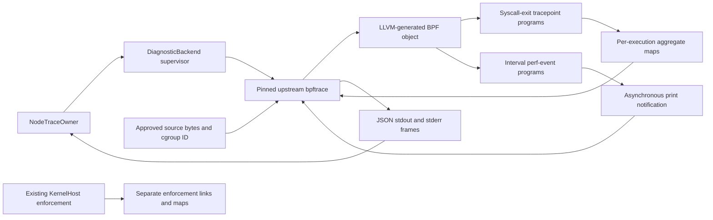

# Non-UI Branch Implementation Review

This guide covers the non-UI changes on `codex/mithril-ui`. Read the linked
flows first. Then use the owner, storage, BPF, and test sections to check each
boundary. Araphor is the product name. Existing crate names remain unchanged.

This guide describes the source implementation, not the approved target
architecture. Use the [phase plan](README.md) for implementation order and
the DuckDB/subscription contracts. Source tests below do not qualify that
target until they run against its implementation.

## Intended end state

Accepted evidence produces bounded, replayable behavior profiles and scoped
context. Diagnostic capture adds measurements for an exact workload lifetime.
The target puts retained data in AnalysisStore and keeps policy, trace grants,
and source authentication in Control. The default deployment embeds the data
crate in Control. Agents and the console will use the same owners. Neither a
query nor a diagnostic measurement grants policy authority.

Current scope: Discovery contracts, durable derivation, and offline AnalysisStore
proof are implemented. Default Control startup selects AnalysisStore for data
and keeps ControlStore for policy authority.
Diagnostic contracts, execution, transport, and projection are implemented.
Diagnostic physical qualification is incomplete. Public SQL,
trace CLI/API, assessment submission, classification, proposal generation, and
declarative captures are not delivered by these changes.

## Linked implementation flows

### Recorded input and storage selection

This route follows the event blocks in the
[recorded-input plan](phase-7-1-contracts-and-offline-proof.md). Its fixture
limits still apply. Later live work does not turn synthetic input into field
evidence.

[pilot corpus](../../../../crates/mithril-e2e/fixtures/discovery/pilot.json) Engineer selects a frozen synthetic workload case. No production trace is supplied.<br>
-> Partial [manifest](../../../../crates/mithril-e2e/fixtures/discovery/manifest.json) Engineer pins source revision, target inputs, and permitted data scope. The inputs are fixture data.<br>
-> [DiscoveryInputManifestV1::validate](../../../../crates/mithril-control/src/discovery/model.rs) Input adapter validates the existing envelope and coverage records.<br>
-> Partial [derive_recorded](../../../../crates/mithril-control/src/discovery/recorded.rs) Adapter joins owner-supplied actor and resource bindings. Current joins use supplied fixture bindings.<br>
-> [DiscoveryOwner::derive_recorded](../../../../crates/mithril-control/src/discovery/recorded.rs) Owner builds exact atoms and a sealed snapshot.<br>
-> [simulate_recorded](../../../../crates/mithril-control/src/discovery/recorded.rs) Native compiler and PolicySimulator evaluate reconstructable keys.<br>
-> Partial [run_discovery_offline](../../../../crates/mithril-e2e/src/discovery.rs) Output includes unknown cases and a replay manifest. It contains a fixture candidate preview, not a generated proposal.

[derive_recorded](../../../../crates/mithril-control/src/discovery/recorded.rs) Required resource or role binding is absent.<br>
-> [derive_recorded](../../../../crates/mithril-control/src/discovery/recorded.rs) Adapter preserves the observation as unresolved.<br>
-> Partial [simulate_recorded](../../../../crates/mithril-control/src/discovery/recorded.rs) Preview omits invented resource or authority. The proposal builder is not implemented.<br>
-> Partial [recorded-input result](phase-7-1-contracts-and-offline-proof.md#completion-gate) Engineer records the exact owner/protocol change needed.<br>
-> Implemented outside the recorded-input delivery: [DiscoveryOwner::advance](../../../../crates/mithril-control/src/discovery/live.rs) replaces the historical wait for the reviewed live owner contract. The next flow shows that implementation.

[derive_recorded](../../../../crates/mithril-control/src/discovery/recorded.rs) Replay input or context conflicts at the same record ID.<br>
-> [derive_recorded](../../../../crates/mithril-control/src/discovery/recorded.rs) Replay returns a typed mismatch.<br>
-> [DiscoveryOwner](../../../../crates/mithril-control/src/discovery/recorded.rs) No live lookup repairs the recorded input.<br>
-> [DiscoveryDigestV1](../../../../crates/mithril-control/src/discovery/model.rs) Corrected input creates a new bundle digest.

[storage_compare](../../../../crates/mithril-e2e/harness/discovery/storage_compare.py) Engineer compares embedded stores on the same generated input.<br>
-> [measure](../../../../crates/mithril-e2e/harness/discovery/storage_compare.py) Experiment measures deduplication, micro-batches, context queries, and recovery.<br>
-> Partial [measure](../../../../crates/mithril-e2e/harness/discovery/storage_compare.py) Evaluator checks equal counts, canonical output, and measured resource use. Measurements apply to the recorded hosts.<br>
-> [native qualification](../../../../crates/mithril-e2e/src/discovery/storage.rs) SQLite passes the native storage and isolated-worker gates.<br>
-> [DiscoveryIndex](../../../../crates/mithril-control/src/discovery/index.rs) Durable discovery uses SQLite. Live Control interference remains a deployment limit.

The next route is the offline DuckDB proof. It does not replace the live
Control intake or the SQLite discovery projection.

[manifest](../../../../crates/mithril-e2e/fixtures/discovery/manifest.json) Engineer supplies the bounded recorded source, coverage, and duplicate.<br>
-> [DiscoveryOwner::derive_recorded](../../../../crates/mithril-control/src/discovery/recorded.rs) Existing owner derives the expected accepted count and snapshot digest.<br>
-> [run_discovery_offline](../../../../crates/mithril-e2e/src/discovery.rs) Existing case checks exact counts, replay, and native preview against the frozen oracle.<br>
-> [run_discovery_storage_contract](../../../../crates/mithril-e2e/src/discovery/storage_contract.rs) New case frames validated fixture records for the public data owner.<br>
-> [AnalysisStore::accept_validated_batch](../../../../crates/araphor-data/src/analysis/mod.rs) One transaction commits new records and the contiguous source receipt. An identical retry is a no-op; different content fails.<br>
-> [AnalysisStore::accept_validated_coverage](../../../../crates/araphor-data/src/analysis/mod.rs) A second transaction commits the report bytes and coverage revision.<br>
-> [AnalysisStore::record_revision](../../../../crates/araphor-data/src/analysis/mod.rs) Each commit records affected relation revisions and the store revision in its transaction.<br>
-> [AnalysisStore::source_status](../../../../crates/araphor-data/src/analysis/mod.rs) A locked read returns the exact source receipt, retained count, and digest-checked report.<br>
-> [AnalysisStore::open](../../../../crates/araphor-data/src/analysis/mod.rs) Reopen preserves store identity, revisions, receipt, report, and count.<br>
-> [storage-contract result](../../../../crates/mithril-e2e/src/discovery/storage_contract.rs) Case records nonzero cursors, revisions, counts, and digests; the independent Control policy state remains unchanged.

### Offline retained-data inspection

[two-node setup](../../../../crates/mithril-e2e/harness/vm/two-node-convergence.sh)
copies the checked K3s configuration and authentication file before calling
[the guest installer](../../../../crates/mithril-e2e/harness/vm/guest.sh).
The installer requires both files. The
[shell regression](../../../../crates/mithril-e2e/harness/vm/test.sh) passes the
actual installer argument lists from both two-node callers to the guest parser.
An invalid version stops the check before host changes. This regression
reproduces the missing argument found during fresh physical setup.

[control_data_path](../../../../crates/mithril-e2e/harness/vm/two-node-outage-recovery.sh)
reads the current K3s `.spec.local.path` after checking the claim identity and
Node affinity. The caller then requires the exact generated local-path directory.
The shell test checks the actual Local-volume layout, foreign claim fields,
a different Node, and an unsupported volume source. This check does not import
or convert data.

[two-node outage harness](../../../../crates/mithril-e2e/harness/vm/two-node-outage-recovery.sh) The harness runs the lightweight startup and recovery cases and validates the retained local-path volume.<br>
-> [inspect_control_data](../../../../crates/mithril-e2e/harness/vm/two-node-outage-recovery.sh) Control has zero replicas and no Pod. The checker runs with Control's numeric user.<br>
-> [inspect-data.sh](../../../../crates/mithril-e2e/harness/vm/inspect-data.sh) A private mount exposes only the selected data directory at the checker path. The launcher drops to user and group 65532 before it starts the checker.<br>
-> [DataStoreQualification::inspect](../../../../crates/mithril-e2e/src/discovery/data_store/inspection.rs) The checker requires an existing data file and obtains the production owner's exclusive lease.<br>
-> [AnalysisStore::source_page](../../../../crates/araphor-data/src/analysis/read.rs) One fixed query returns at most 256 source identities for the requested tenant. Each identity must match its stored key.<br>
-> [SourceProof::read](../../../../crates/mithril-e2e/src/discovery/data_store/inspection.rs) Bounded owner reads check continuity and hash the exact retained frames.<br>
-> [DataStoreQualification::inspect](../../../../crates/mithril-e2e/src/discovery/data_store/inspection.rs) A baseline check requires the same store, epoch, tenant, source range, count, and digest. New appended records remain allowed.<br>
-> [DataStoreQualification::inspect](../../../../crates/mithril-e2e/src/discovery/data_store/inspection.rs) The checker verifies unchanged metadata, drops the owner, and writes a new proof with measured file usage.

This checker is a qualification command, not a public query service. It does
not copy a live database or claim that native database bytes stay unchanged.
Normal owner open can recover DuckDB's WAL. A live lease, missing store,
expired baseline, changed digest, foreign tenant, or exhausted bound fails the
check. A run reads at most 256 MiB across baseline and current evidence. The
source and proof limits are 1,024 sources and one MiB. Each source range has at
most one million records. No reader handle crosses a public owner call.

The private mount ends when the checker exits. K3s parent permissions remain
unchanged. No mount remains in the host namespace for directory cleanup to
traverse. [inspect-data-test.sh](../../../../crates/mithril-e2e/harness/vm/inspect-data-test.sh)
reproduces a root-only parent with temporary files. It checks user and group
65532, file ownership, parent permissions, checker error propagation, and no
remaining mount after success or failure. This Linux component test requires
root, but it needs no Kubernetes cluster and uses no deployment data.

`analysis_store_source_pages` checks pagination, tenant isolation, unchanged
revisions, and restart. `data_inspection_recovery` sends 300 records through
mTLS, stops Control, records a proof, appends one record after restart, and
checks the original prefix. It also checks live-owner refusal, invalid proofs,
missing data, read limits, and expired input. `inspection_arguments_are_scoped`
checks the CLI boundary. The
[shell test](../../../../crates/mithril-e2e/harness/vm/test.sh) checks wiring,
per-Node replay counts, and storage-fault cleanup with a test Kubernetes client.
[block_control_storage](../../../../crates/mithril-e2e/harness/vm/two-node-outage-recovery.sh)
sets the cleanup flag before the patch. A lost reply returns an error without
clearing that flag.
[restore_control_storage](../../../../crates/mithril-e2e/harness/vm/two-node-outage-recovery.sh)
keeps the flag after a failed removal and clears it after successful removal.
The regression checks both failures and a successful retry. This shell test
does not prove Kubernetes behavior. The updated physical storage/partition run
passed on `47edef4c`, including cleanup. Its result is
`/tmp/araphor-two-node-storage.ChbP3Nmp/outage-mount/result.json`. Exact retained
prefixes survive both outages. The read-only data fault stops evidence ACK
without stopping policy service. Node replay, partition recovery, API recovery,
and watch relist pass. This result does not replace the separate failed
mount-cache test or qualify full-quota performance and reserve adequacy.

The next route covers the data-owner implementation. The recovery case selects
the owner explicitly. The startup case uses ControlConfig and the default owner.

[AnalysisStore::open](../../../../crates/araphor-data/src/analysis/mod.rs) The owner opens one private DuckDB writer and rejects unsupported stored schemas under its lease.<br>
-> [AnalysisStore::read_page](../../../../crates/araphor-data/src/analysis/read.rs) A bounded read checks frame digests and reports a recorded expired range.<br>
-> [AnalysisStore::commit_context](../../../../crates/araphor-data/src/analysis/context.rs) The data owner commits an exact, tenant-scoped context version. A retry with different content conflicts.<br>
-> [AnalysisStore::register_processor](../../../../crates/araphor-data/src/analysis/progress.rs) A processor binds its class, source, method version, and retained start cursor.<br>
-> [AnalysisStore::commit_result](../../../../crates/araphor-data/src/analysis/progress.rs) One transaction checks expected progress and exact context/witness digests. It commits the result, references, and progress.<br>
-> [EvidenceRetentionOwner::retain](../../../../crates/araphor-data/src/analysis/retention.rs) One transaction deletes eligible raw rows, records expired ranges, and advances the retained floor. Required progress and live exact witnesses protect rows.<br>
-> [AnalysisStore::resume_optional](../../../../crates/araphor-data/src/analysis/progress.rs) An optional processor records an expired gap before it resumes. Its consumed cursor does not advance for the skipped input.<br>
-> [AnalysisStore::processor_health](../../../../crates/araphor-data/src/analysis/health.rs) One snapshot returns accepted and effective progress, lag, missing input, and its revision. An optional resume keeps the missing-coverage flag.<br>
-> [AnalysisStore::backup](../../../../crates/araphor-data/src/analysis/backup.rs) Maintenance drains readers, checkpoints, and closes all native connections while the directory lease remains held.<br>
-> [StorageLimitsV1::check_backup](../../../../crates/araphor-data/src/analysis/capacity.rs) The closed source size and manifest allowance must fit the data-file budget and ordinary free-space reserve.<br>
-> [AnalysisStore::copy_backup](../../../../crates/araphor-data/src/analysis/backup.rs) A closed database has no native WAL. A new synced copy and digest manifest preserve the committed revision.<br>
-> [AnalysisStore::reopen_backup](../../../../crates/araphor-data/src/analysis/backup.rs) The owner validates identity, schema, receipts, and references before it publishes reopened native connections.<br>
-> [AnalysisStore::restore](../../../../crates/araphor-data/src/analysis/backup.rs) A validated copy opens in an empty private directory with a new recovery epoch.

[AnalysisLease::acquire](../../../../crates/araphor-data/src/analysis/connection.rs) Restore obtains the same exclusive directory lease used by normal startup.<br>
-> [AnalysisStore::restore](../../../../crates/araphor-data/src/analysis/backup.rs) Restore requires no entry except the lease file, then creates and syncs `restore.pending` before copying.<br>
-> [StorageLimitsV1::check_copy](../../../../crates/araphor-data/src/analysis/capacity.rs) The same destination-space rule runs before restore creates the database file. Rejection retains the marker and blocks normal startup.<br>
-> [AnalysisStore::open_leased](../../../../crates/araphor-data/src/analysis/mod.rs) The internal restore path validates the copied store while retaining its lease.<br>
-> [AnalysisStore::restore](../../../../crates/araphor-data/src/analysis/backup.rs) Restore commits the new recovery epoch, removes the marker, and syncs the directory before returning the owner.<br>
-> [AnalysisStore::open_with_limits](../../../../crates/araphor-data/src/analysis/mod.rs) Normal startup rejects any pending marker before native open. An interrupted restore cannot expose the old epoch or create an empty fallback.

The marker contains no records. It gates restore readiness, not event delivery.
A copy, validation, or epoch-commit error leaves the marker and blocks startup.
Restore the unchanged backup into a new empty directory. Do not delete the
marker to activate the partial copy. An error after marker removal cannot
expose the old epoch; the epoch commit has already completed.

The copy check uses `statvfs` available bytes and checked arithmetic. It requires
the database size plus one quarter of that size, the configured policy reserve,
and the fixed write allowance. Restore uses its default storage limits. An
overflow or insufficient space returns `StorageCapacity` with `copy reserve`.
This sample does not reserve blocks against concurrent external writers.
`analysis_store_copy_limits` checks exact boundaries and overflow. The full-tmpfs
case in [capacity_recovery](../../../../crates/mithril-e2e/src/discovery/data_store.rs)
checks both backup and restore admission, no output database, retained restore marker,
startup refusal, usable source connections, and restore into a fresh destination.
The boundary test and eight enabled data-store tests passed. The existing tmpfs
harness passed both capacity cases on Linux 6.8.0-139-generic, x86_64. The log is
`/tmp/araphor-copy-qualification.iqcH0TQ0/disk-full-committed.log`; it records
clean commit `e7c771d2` and the test-binary digest. The full workspace gate passed
for that commit with `CARGO_BUILD_JOBS=2 bash .github/scripts/verify-rust-ci.sh`.
Formatting, compilation, strict Clippy, and tests passed. The data crate passed
45 tests with two ignored; Control passed 196 with two ignored; Mithril e2e
passed 115 with 249 ignored; Node passed 256 with one ignored. These checks do
not prove a native commit failure after admission or worst-case reserve sizing.

Backup closes the two cloned readers before their owning writer. Normal owner
drop uses the same order. Private connection guards return a typed error for
a closed slot; they cannot return a dummy database. The existing writer and
maintenance locks prevent data access during copy. Backup retains the data
lease, so another data owner cannot open the directory during maintenance.
`open_native` supplies the same resource settings at startup and reopen.
A copy error still attempts reopen. A failed reopen keeps data access closed
until restart. This path does not change Control policy persistence.

[AnalysisStore::commit_result](../../../../crates/araphor-data/src/analysis/progress.rs) The result, references, progress, and revisions are ready to commit.<br>
-> [AnalysisStore::crash_at](../../../../crates/araphor-data/src/analysis/crash.rs) A test child exits immediately before or after the production commit, without Rust cleanup.<br>
-> [AnalysisStore::open](../../../../crates/araphor-data/src/analysis/mod.rs) Native recovery and state validation restore either the complete prior state or the complete new state.<br>
-> [analysis_store_commit_crashes](../../../../crates/araphor-data/src/analysis/crash.rs) The test checks result and reference presence, consumed progress, revision notification, tenant isolation, and an exact retry.

[EvidenceRetentionOwner::retain](../../../../crates/araphor-data/src/analysis/retention.rs) Eligible deletion, expiry ranges, retained floor, and revisions are ready to commit.<br>
-> [AnalysisStore::crash_at](../../../../crates/araphor-data/src/analysis/crash.rs) A test child exits immediately before or after the production commit.<br>
-> [analysis_store_commit_crashes](../../../../crates/araphor-data/src/analysis/crash.rs) Reopen preserves the accepted cursor and live witness. Raw count and expiry agree with the recovered floor. Retry and a second reopen preserve the same result.

[AnalysisStore::commit_evidence](../../../../crates/araphor-data/src/analysis/mod.rs) New events, receipt progress, and relation revisions are ready to commit.<br>
-> [AnalysisStore::crash_at](../../../../crates/araphor-data/src/analysis/crash.rs) A test child exits immediately before or after the production commit, before notification.<br>
-> [analysis_store_input_crashes](../../../../crates/araphor-data/src/analysis/crash.rs) Reopen returns the exact prior or new records, receipt, and revisions. Retry adds no second effect.

[AnalysisStore::accept_validated_coverage](../../../../crates/araphor-data/src/analysis/mod.rs) A new coverage report and its receipt revision are ready to commit.<br>
-> [analysis_store_input_crashes](../../../../crates/araphor-data/src/analysis/crash.rs) The same exit boundaries preserve either the prior state or the exact report and coverage revision.

[AnalysisStore::commit_context](../../../../crates/araphor-data/src/analysis/context.rs) An exact context version and its relation revision are ready to commit.<br>
-> [analysis_store_input_crashes](../../../../crates/araphor-data/src/analysis/crash.rs) The same exit boundaries preserve either no version or the complete version, including its digest.

[AnalysisStore::record_recovery_floor](../../../../crates/araphor-data/src/analysis/backup.rs) A missing source range and its relation revision are ready to commit.<br>
-> [analysis_store_input_crashes](../../../../crates/araphor-data/src/analysis/crash.rs) The same exit boundaries preserve either no range or the exact range. Accepted and consumed cursors do not advance.

The exit hook and its module compile only under `cfg(test)`. The hook requires
the exact requested point and temporary store path. It adds no production
configuration, public API, or alternate writer. Eighteen cases cover nine commit
boundaries. Four further cases check restore readiness. The eight input cases
also check tenant isolation, unchanged
processor progress, no notification on duplicate retry, and a second reopen.
Input bodies are opaque data-owner fixtures, not Node or kernel evidence.
These cases do not cover interruption inside native commit, hardware power
loss, or every data mutation. Existing mTLS cases remain separate integration
proof.

[AnalysisStore::register_processor](../../../../crates/araphor-data/src/analysis/progress.rs) Registration inserts the fixed processor class and initial progress.<br>
-> [analysis_store_processor_crashes](../../../../crates/araphor-data/src/analysis/crash.rs) Before/after exits preserve either no registration or its complete state, with an exact retry.

[AnalysisStore::resume_optional](../../../../crates/araphor-data/src/analysis/progress.rs) Optional resume commits a missing range and resume floor together.<br>
-> [analysis_store_processor_crashes](../../../../crates/araphor-data/src/analysis/crash.rs) Before/after exits preserve the complete prior or new state. Consumed progress does not advance, and incomplete coverage remains explicit.

[AnalysisStore::retire_required](../../../../crates/araphor-data/src/analysis/retirement.rs) Retirement commits its audit record and unprocessed range together.<br>
-> [analysis_store_processor_crashes](../../../../crates/araphor-data/src/analysis/crash.rs) Before/after exits retain exact witnesses and consumed progress. Retry has one effect; registration cannot reactivate the retired version.

[AnalysisStore::restore](../../../../crates/araphor-data/src/analysis/backup.rs) Restore controls the pending marker, epoch commit, and readiness publication.<br>
-> [analysis_store_restore_crashes](../../../../crates/araphor-data/src/analysis/crash.rs) Four process exits prove repeated startup refusal for incomplete copies and a durable new epoch for the ready copy. Each case preserves the backup and permits restore into a fresh destination.<br>
-> [DataStoreQualification::startup](../../../../crates/mithril-e2e/src/discovery/data_store.rs) A pending-marker fixture disables data ACK through mTLS. Node retains input while policy RPCs work. The database bytes and marker remain unchanged.

The full workspace gate passed for `3121ea7d`. The data crate passed 44 tests
with two ignored; Control passed 196 with two ignored; Mithril e2e passed 114
with 248 ignored; Node passed 256 with one ignored. All 22 cases in the four
crash tests passed. The rebuilt CLI passed startup (18 checks) and recovery
(29 checks). Results are in
`/tmp/araphor-data-qualification.MtrjRy/restore-{startup,recovery}/result.json`.
These checks use temporary stores. Native commit failure after admission and
physical qualification remain open. The next route adds the Control process
interruption check; its verification is recorded separately.

[data_control_child](../../../../crates/mithril-e2e/src/discovery/data_store.rs) A child process loads ControlConfig and starts the production mTLS server.<br>
-> [ControlPlane::set_evidence_commit_hook](../../../../crates/mithril-control/src/service.rs) The child installs an exit callback available only with `test-fixtures`.<br>
-> [ControlPlane::receive_evidence_stream_group](../../../../crates/mithril-control/src/service.rs) The shared unary and stream path authenticates and validates input, then commits through EvidenceIntakeOwner.<br>
-> [data_control_child](../../../../crates/mithril-e2e/src/discovery/data_store.rs) The callback exits the process after commit and before the ACK can enter the response stream.<br>
-> [data_control_crash](../../../../crates/mithril-e2e/src/discovery/data_store.rs) The parent requires no ACK, reopens Node WAL, and checks the exact committed data and source receipt.<br>
-> [ControlPlane::receive_evidence_stream_group](../../../../crates/mithril-control/src/service.rs) Restarted Control accepts the retained duplicate and returns its durable cursor without another revision.<br>
-> [data_control_crash](../../../../crates/mithril-e2e/src/discovery/data_store.rs) Applying the ACK clears Node pending input. A new cursor commits once and survives a second data-store reopen. Policy state remains unchanged.

The callback defaults to absent. No configuration field or production exit
condition enables it. The test first sends an invalid batch and requires the
child to remain alive. The parent owns the child, sets readiness and exit
timeouts, and kills the child on an early test return. Existing server and TLS
fixtures supply the real owners. Before replay, the test reconciles the small
policy context fixture to completion so independent context commits cannot
change the revision assertion. This case tests the stream ACK path, not every
unary request shape, hardware power loss, or interruption inside native commit.

`data_control_crash` passed alone and with all eight enabled data-store tests.
Two tests remain ignored: the child helper and the separate tmpfs case. This
source state adds the optional fixture callback, shared TLS fixture entry, and
test-only Tokio process support. The full workspace gate passed for `6ec1afed`
with `CARGO_BUILD_JOBS=2 bash .github/scripts/verify-rust-ci.sh`. Formatting,
workspace checks, strict Clippy, and workspace tests passed. The data crate
passed 44 tests with two ignored; Control passed 196 with two ignored; Mithril
e2e passed 115 with 249 ignored; Node passed 256 with one ignored.

[data_commit_failure](../../../../crates/mithril-e2e/src/discovery/data_store.rs) The parent seeds a temporary store and starts one child for each commit and file-size limit.<br>
-> [data_commit_child](../../../../crates/mithril-e2e/src/discovery/data_store.rs) The child opens AnalysisStore, handles SIGXFSZ, and sets its soft file-size limit to zero or 64 bytes.<br>
-> [AnalysisStore::accept_validated_batch](../../../../crates/araphor-data/src/analysis/mod.rs) The evidence case reaches the native transaction commit.<br>
-> [AnalysisStore::commit_result](../../../../crates/araphor-data/src/analysis/progress.rs) The result case reaches the native transaction commit with progress and an exact witness.<br>
-> [data_commit_child](../../../../crates/mithril-e2e/src/discovery/data_store.rs) The child restores its limit, requires the WAL write error and no watch notification, then exits without cleanup.<br>
-> [data_commit_failure](../../../../crates/mithril-e2e/src/discovery/data_store.rs) The parent reopens the store, checks the prior state, retries once, checks duplicate replay, and reopens again.

The child uses the existing Rustix and Tokio APIs. No production hook or new
dependency supplies the failure. Each parent wait has a ten-second limit and
kills the child on early return. The native error must name the commit operation,
`File too large`, and `analysis.duckdb.wal`. The parent checks full metadata,
source status, exact prior bytes, absent result, and unchanged consumed progress
after failure. After successful retry, raw expiry preserves the result witness.
The four cases passed in the focused run. This test does not prove a torn write,
ENOSPC during commit, hardware power loss, or Control's mTLS error response.
All nine enabled data-store tests passed. Three helper or environment-specific
tests remain ignored. The full workspace gate passed for `c67d6588` with
`CARGO_BUILD_JOBS=2 bash .github/scripts/verify-rust-ci.sh`: formatting,
workspace checks, strict Clippy, and workspace tests. The data crate passed
45 tests with two ignored; Control passed 196 with two ignored; Node passed
256 with one ignored. No Rust source changed after this gate.

[data_intake_failure](../../../../crates/mithril-e2e/src/discovery/data_store.rs) The parent starts an isolated test process with a 20-second wait limit.<br>
-> [data_intake_child](../../../../crates/mithril-e2e/src/discovery/data_store.rs) The child selects the native commit fault in the existing capacity-recovery scenario.<br>
-> [DataStoreQualification::capacity_recovery](../../../../crates/mithril-e2e/src/discovery/data_store.rs) Production Node and Control owners accept one record through mTLS and prepare the next Node batch.<br>
-> [DataStoreQualification::capacity_recovery](../../../../crates/mithril-e2e/src/discovery/data_store.rs) A 64-byte process file-size limit causes the next native WAL commit to fail after storage admission.<br>
-> [EvidenceIntakeOwner::data_status](../../../../crates/mithril-control/src/evidence.rs) The evidence stream returns Internal with the native commit error, not an ACK.<br>
-> [DataStoreQualification::capacity_recovery](../../../../crates/mithril-e2e/src/discovery/data_store.rs) The child restores its limit, checks unchanged data, retries without restarting Control, and reopens the store.

The fault uses the existing Rustix and Tokio APIs in the child only. It adds
no production hook or dependency. The test requires `commit evidence`,
`File too large`, and `analysis.duckdb.wal` in the error. It checks no watch
notification, unchanged metadata and source status, readable prior bytes,
retained Node input, and a working policy RPC. Successful retry advances the
receipt once. A duplicate does not add a revision. Restart retains two records
at cursor 2. All eleven enabled data-store tests passed; four helpers or
environment-specific cases remain ignored. The full workspace gate passed for
`d2fce24f`. It passed formatting, workspace checks, strict Clippy, and workspace
tests, including 196 Control tests, 118 Mithril e2e tests, and 256 Node tests.
The first run stopped at the existing filesystem-reserve check. After removal
of stale generated binaries, the unchanged test reached the native commit fault
and passed. This case does not prove ENOSPC during commit or hardware power loss.
The shared capacity pair also passed on clean commit `d2fce24f`. Its log is
`/tmp/araphor-intake-qualification.hEEgehKt/disk-full-committed.log` and includes
the test-binary digest. The private tmpfs reached zero free bytes. The test
retained Node input, withheld ACK, and recovered two records at cursor 2.

[DataStoreQualification::load](../../../../crates/mithril-e2e/src/discovery/data_store.rs) The qualification CLI selects 64 groups of 4,096 synthetic records.<br>
-> [EffectObservationStore::bounded_ingestion_queue](../../../../crates/mithril-node/src/observation.rs) The fixture queues each group and runs the production Node worker on a blocking thread.<br>
-> [ControlConnection::send_evidence_group](../../../../crates/mithril-node/src/control.rs) Node sends its durable frames through the authenticated stream.<br>
-> [DataStoreQualification::load_tenants](../../../../crates/mithril-e2e/src/discovery/data_store.rs) The shared load runner checks policy inventory RPCs, durable ACKs, empty Node pending input, and duplicate replay.<br>
-> [AnalysisStore::read_page](../../../../crates/araphor-data/src/analysis/read.rs) Bounded reads reproduce the exact ordered input digest.<br>
-> [AnalysisStore::checkpoint](../../../../crates/araphor-data/src/analysis/backup.rs) The owner checkpoints before shutdown and validated reopen.

The fixture uses the production quotas and one source. It samples file sizes
after each group; these samples are not a continuous peak measurement. The
observed ACK time includes the intervening policy RPC. The result includes
all group samples and elapsed read, checkpoint, and restart times. The
`data_load_contract` test runs the same path with 8,192 records. Its focused run
passed. The larger CLI measurement passed for `769ddefb`; its result is recorded
in the data-store phase. The final workspace gate passed for that commit:
formatting, workspace checks, strict Clippy, and all workspace tests. Mithril
e2e passed 117 tests with 250 ignored. No Rust source changed after the gate.
This case does not qualify multi-tenant load, policy rollout under load,
worst-case payloads, full storage quotas, or maintenance reserve sizing.

[data_context_bounds](../../../../crates/mithril-e2e/src/discovery/data_store.rs)
checks 256 observations with exactly 16 KiB of decision context. The fixture
adds JSON whitespace to a verified catalog without changing its content.
[EvidenceWal::append](../../../../crates/mithril-node/src/observation/wal.rs)
rejects a context one byte above that limit without advancing pending input.
After WAL reopen, `next_batch` splits the records into two batches below the
three-MiB wire limit. Production Node and Control owners send and acknowledge
both batches through mTLS. After AnalysisStore reopen, bounded pages reproduce
the complete ordered frame digest. The focused test passed in 3.38 seconds.
This case does not qualify full-quota memory or the separate 128-KiB record
limit. The full workspace gate compiled for `6e4662b1` passed, including
124 enabled Mithril e2e tests. Tests ran serially. This gate does not cover
the later record-boundary test.

[intake_record_bounds](../../../../crates/mithril-control/src/evidence.rs)
calls the data-backed `EvidenceIntakeOwner::receive` with valid protobuf records
one byte below, exactly at, and one byte above 128 KiB. An unknown field supplies
the padding; decoding must preserve the original observation. The case checks
exact retained bytes, unchanged duplicate replay, and oversized rejection
without a receipt or revision change. Valid input then uses the rejected cursor.
Store reopen must preserve all accepted frames and the receipt. This component
case does not test mTLS transport or full-capacity memory. The focused Control
test passed in 0.83 seconds. The final workspace gate covering `c72a3b68`
passed, including this test. Its first run rejected `unwrap_err` under strict
Clippy. The test now
uses the existing fallible assertion pattern. No production API or limit changes.

[DataStoreQualification::quota](../../../../crates/mithril-e2e/src/discovery/data_store/quota.rs) The CLI selects the default two-GiB tenant quota.<br>
-> [AnalysisStore::register_processor](../../../../crates/araphor-data/src/analysis/progress.rs) Required progress protects the accepted raw input.<br>
-> [ControlConnection::send_evidence_batch](../../../../crates/mithril-node/src/control.rs) Node sends one 1,024-record WAL batch through mTLS at a time.<br>
-> [DataStoreQualification::quota_with_limits](../../../../crates/mithril-e2e/src/discovery/data_store/quota.rs) The case requires logical-quota rejection with unchanged receipts, revision, and pending Node input. It checks policy access, retained duplicate replay, and the complete input digest.<br>
-> [AnalysisStore::commit_result](../../../../crates/araphor-data/src/analysis/progress.rs) A result advances required progress and retains one exact witness through maintenance admission.<br>
-> [EvidenceRetentionOwner::retain](../../../../crates/araphor-data/src/analysis/retention.rs) Sixteen bounded passes can expire eligible input after the fixture clock advances by 25 hours.<br>
-> [AnalysisStore::checkpoint](../../../../crates/araphor-data/src/analysis/backup.rs) Native checkpoint completes before replay.<br>
-> [DataStoreQualification::quota_with_limits](../../../../crates/mithril-e2e/src/discovery/data_store/quota.rs) Replay receives a durable ACK. Restart preserves exact replayed frames, the result, receipt, and witness.

[DataStoreQualification::rollout_load](../../../../crates/mithril-e2e/src/discovery/data_store/rollout.rs) The CLI selects 32 idle/loaded rollout pairs on temporary stores.<br>
-> [DataStoreQualification::load_group](../../../../crates/mithril-e2e/src/discovery/data_store.rs) The existing bounded Node worker creates 4,096 records for each pair.<br>
-> [PolicyDesiredStateOwner::reconcile](../../../../crates/mithril-control/src/policy/reconciliation.rs) Each idle and loaded operation commits a new policy generation through the production owner.<br>
-> [DataStoreQualification::rollout_step](../../../../crates/mithril-e2e/src/discovery/data_store/rollout.rs) The Node client checks inventory and fetches the exact signed bundle over mTLS.<br>
-> [OutagePolicyFixture::active_acknowledgement](../../../../crates/mithril-e2e/src/control_fixture.rs) The fixture supplies an activation report. No kernel policy is installed.<br>
-> [ControlPlane](../../../../crates/mithril-control/src/service.rs) The policy service authenticates the report and commits the rollout transition through its existing owner.<br>
-> [DataStoreQualification::rollout_pairs](../../../../crates/mithril-e2e/src/discovery/data_store/rollout.rs) Each rollout reaches one Active target. Loaded operations start after evidence submission and before reading its ACK. The case checks exact retained bytes and unchanged source state on replay.<br>
-> [DataStoreQualification::rollout_pairs](../../../../crates/mithril-e2e/src/discovery/data_store/rollout.rs) Restart preserves evidence source state and every recorded rollout transition.

The shared fixture registration and activation-report methods are moved from
`control_tls.rs`; their values are unchanged. Independent context projection
remains active. Replay compares source state, not the global data revision.
Each sample records idle rollout, loaded rollout, and observed evidence ACK
times. ACK time includes the policy operation before the ACK is read; it is
not the evidence commit time. These are synthetic Control-rollout measurements,
not physical activation or a completed performance comparison.
The runner alternates idle-first and loaded-first pairs. Each sample records
`loaded_first`. It accepts only even pair counts from two through 32. A loaded
operation completes its ACK and duplicate replay before a following idle
operation starts. This order balances the increasing policy history. The
production Control snapshot commit remains unchanged. The order assertion
failed before this correction and passed after it; the focused case took
2.53 seconds. The release case passed on `7bdf5797` with 16 pairs in each
order, 64 Active transitions, and 131,072 records. Its binary SHA-256 is
`8d790a437a6f10c27b31311eda4b6f9b38f61b14a580f2703a33e5ad2c3c718d`.
The pilot directory contains `balanced-rollout-smoke.json` and its resource
log. Host workspace tests ran concurrently. The full gate then passed on
`7bdf5797` with two build jobs and serial tests: formatting, workspace checks,
strict Clippy, and all workspace tests. Data passed 49 tests with two ignored;
Control passed 196 with two ignored; Mithril e2e passed 123 with 251 ignored;
Node passed 256 with one ignored. No Rust source changed during the gate.
Three later release runs passed after this branch's build and test jobs ended.
Each run has 16 pairs in each order, 64 Active transitions, and 131,072 records.
The pilot directory contains `balanced-rollout-{1,2,3}.json` and their resource
logs. Loaded mean time increases by 7.96, 3.98, and 5.79 percent. The maximum
observed ACK is 214.647 milliseconds. The data-store plan records every run's
means, percentiles, elapsed time, and whole-process RSS. The unrelated VM and
desktop applications remain active. These results do not show removal of the
intake cost. The five-percent discovery rule needs enabled/disabled runs at
equal input; this idle/intake comparison does not prove that rule. No physical
activation or full-capacity memory pass is claimed.
`data_rollout_load` passed with two pairs and four transitions. It also checks
invalid pair counts and refusal to replace an existing result. All 16 enabled
data-store tests and four enabled outage tests passed with serial execution.
The ignored subprocess, filesystem, and release-only cases are not claimed by
these runs. The release case passed on `9ecffced` with 32 pairs, 64 Active
transitions, and 131,072 exact evidence records. Its binary SHA-256 is
`d4bd13e7937528c4deff66550e2641cc54f28142de7d781f32b59e4fd92272fc`.
The pilot directory contains `rollout-smoke.json` and its resource log.
The case took 15.73 seconds with 188,896 KiB whole-process peak RSS. Host
workspace tests ran concurrently; this result is not a clean performance
baseline or a physical activation proof. The full gate passed on `9ecffced`
with two build jobs and serial tests. Formatting, workspace checks, strict
Clippy, and workspace tests passed. Data passed 49 tests with two ignored;
Control passed 196 with two ignored; Mithril e2e passed 123 with 251 ignored;
Node passed 256 with one ignored. No Rust source changed during the gate.
Three subsequent pilot runs passed after host build and test jobs finished.
Their `rollout-{1,2,3}.json` and resource logs remain in the pilot directory.
Loaded mean rollout time exceeds idle mean time by 6.2–6.4 percent. The
data-store phase records all measurements and the pending investigation.
This is an idle-versus-intake comparison, not a discovery-off/on comparison.
No five-percent performance or physical activation pass is claimed.

`data_quota_recovery` uses the same runner with a two-MiB tenant quota. The CLI
keeps production defaults. Neither result proves global saturation, worst-case
payloads, concurrent rollout, or a physical filesystem reserve. The runner
uses temporary stores and leaves deployment data unchanged.

[DataStoreQualification::quota_failure](../../../../crates/mithril-e2e/src/discovery/data_store/quota.rs)
retains the bounded samples when an unexpected ACK error stops quota intake.
The `FAIL` result distinguishes the last observed ACK from the unknown final
store receipt. Samples record ACK arrival before Node applies that ACK, plus
database, WAL, and total file bytes. `data_quota_failure` checks the error record
and refusal to replace a prior result. This report is not a recovery pass.

[AnalysisStore::check_required](../../../../crates/araphor-data/src/analysis/retention.rs)
groups active required processors by tenant and source before joining events.
The minimum consumed cursor protects the union of their unprocessed input.
Each event contributes once to the tenant byte total. The accepted-cursor check
still limits the source age calculation. `analysis_store_required_scopes`
checks multiple processors, unequal progress, retirement, optional processors,
and foreign tenants. `analysis_store_required_plan` checks the actual prepared
query with the pinned DuckDB engine. The old query produced `LEFT_DELIM_JOIN`
and grouped by event cursor. The regression failed before the SQL change and
passed after it. No ledger, cache, schema, quota, or timeout changes are added.
The larger quota case must run again before throughput is qualified.

The full workspace gate passed on `020d09a2` with two build jobs and serial
test execution. The data crate passed 49 tests with two ignored; Control passed
196 with two ignored; Mithril e2e passed 121 with 251 ignored; Node passed 256
with one ignored. Formatting, workspace checks, and strict Clippy also passed.
The same full gate also passed for the failure-report change in `224c98dc`.
Mithril e2e passed 122 tests with 251 ignored. Other suite counts are unchanged.
No Rust source changed during that run.
The release CLI passed startup (18 checks) and recovery (29 checks) on the
four-vCPU, 8-GiB pilot VM. Results, resource logs, and the source/build manifest
are in `/tmp/araphor-pilot-qualification.TmOyPeOh/`. The binary SHA-256 is
`67809fc7fc881b39cfcf63e2f310fea120f55c9e28541038ed27f9679d591042`.
These small synthetic cases do not qualify full capacity or physical effects.

The [data_control_crash](../../../../crates/mithril-e2e/src/discovery/data_store.rs)
child always uses serial test execution. Its readiness marker starts on a new
line because the test harness can leave its test name on the current line.
The parent still requires the exact marker and child exit code 73. The serial
case failed in 10.06 seconds before this correction and passed in 1.47 seconds
after it. No readiness or crash timeout was increased.

[DataStoreQualification::tenant_load](../../../../crates/mithril-e2e/src/discovery/data_store.rs)
selects two tenants and 32 groups per tenant. Both CLI load cases now use
`load_tenants`. Each Node has a distinct certificate, tenant, and boot ID.
The fixture combines its temporary certificate roots for the shared server.
It waits for each tenant's exact trust-context record through
[ControlServerFixture::wait_context](../../../../crates/mithril-e2e/src/control_fixture.rs).
Control projects one tenant per timer pass. Starting the replay check before
that projection finished caused a valid context commit to change its metadata
baseline. The fixture now waits for the actual records, not a fixed delay.
Both groups are sent before concurrent policy RPC and ACK waits. After both
commits, duplicate replay must leave all metadata unchanged. Each tenant's
bounded reads must reproduce its own input digest. Foreign-tenant reads must
report an absent source. Checkpoint and reopen preserve both source states.
The result has one source entry per tenant and one sample per group and tenant.
ACK times include the policy RPC and both group-send calls. File sizes are
samples, not continuous peaks. `data_tenant_load` uses 16,384 total records and
checks invalid group and tenant counts. Each sample also records Node generation
time. No production owner or API changes are added. The final workspace gate
passed for `c69dba4a` after the generation-time field was restored. It passed
formatting, workspace checks, strict Clippy, and workspace tests. Control passed
196 tests with two ignored. Mithril e2e passed 119 tests with 251 ignored.
The final CLI also passed with 262,144 records and 64 generation-time samples.
Its result is
`/tmp/araphor-tenant-qualification.7tmi4y0w/final-tenants/result.json`.
The binary SHA-256 is
`26a1957c9993a6ace4b209753f8f19a5c2522c94793878d634fcd9f0ed1ce13c`.
This CLI ran during workspace tests. Its timings are not a clean performance
baseline. The phase result records the earlier pair of load measurements and
their host limits. Capacity, rollout, old-writer removal, and physical proof
remain open.

The full workspace gate passed for `cb8417f8`, including all twelve cases in
`analysis_store_commit_crashes` and `analysis_store_input_crashes`. The data
crate passed 42 tests with two ignored; Control passed 196 with two ignored;
Mithril e2e passed 114 with 248 ignored; Node passed 256 with one ignored.
No production data or existing deployment was used for these crash checks.

[NodeChassis](../../../../crates/mithril-node/src/node.rs) The connected Node selects one WAL source per second, including sources without pending records.<br>
-> [EffectObservationStore::evidence_floor](../../../../crates/mithril-node/src/observation.rs) The owner reads one ordered source and its durable acknowledged cursor, then releases the WAL lock.<br>
-> [ControlConnection::report_evidence_floor](../../../../crates/mithril-node/src/control.rs) The existing mTLS connection sends a bounded NodeEvidence.ReportFloor request.<br>
-> [NodeEvidence::report_floor](../../../../crates/mithril-control/src/service.rs) Control checks the current session and trust under shared intake admission. Blocking work runs outside the RPC executor.<br>
-> [EvidenceIntakeOwner::receive_floor](../../../../crates/mithril-control/src/evidence.rs) The same source-authentication helper used by batches resolves the original durable session and exact data binding.<br>
-> [AnalysisStore::record_recovery_floor](../../../../crates/araphor-data/src/analysis/backup.rs) One transaction records known missing ranges after a stale restore. It does not advance a source receipt.<br>
-> [AnalysisStore::recovery_gaps](../../../../crates/araphor-data/src/analysis/health.rs) A source-scoped read returns at most 256 exact missing ranges after the supplied cursor.<br>
-> [AnalysisStore::processor_health](../../../../crates/araphor-data/src/analysis/health.rs) Recovery loss takes precedence over ordinary lag or expiry. The read does not create a receipt or advance progress.

The gap and processor-health reads are fixed internal data-owner methods,
not public SQL or gRPC reads. The report is an internal authenticated Node RPC.
Its reply is not an evidence ACK. Only the existing evidence ACK path can
truncate Node WAL. The floor means the last cursor excluded from Node replay,
including acknowledged bytes that can remain in a partly retained segment.
The ordered source walk uses constant output space. A failed report keeps its
cursor for retry. Reconnect and end of the walk restart at the first source.
No scan checkpoint or second durable owner is added. Reports do not authorize
cursor skipping after loss. Exact missing ranges remain available in data health.

Read `wal_floor_replay` in
[wal.rs](../../../../crates/mithril-node/src/observation/wal.rs) for empty sources,
unacknowledged input, rejected ACKs, source ordering, conversion, and restart.
The existing `data_stream_flushes_without_tail` mTLS test in
[control_tls.rs](../../../../crates/mithril-e2e/src/control_tls.rs) also checks
missing trust ACK, malformed reports, stale nonce, foreign Node, changed boot,
unchanged receipts, tenant isolation, and idempotent floor reports.
`data_store_recovery` in
[data_store.rs](../../../../crates/mithril-e2e/src/discovery/data_store.rs) restores
an empty backup and reports the actual Node WAL floor through mTLS. It retries
after restart and verifies the same gap without a fabricated accepted receipt.

Processor health uses one bounded reader transaction. It returns no native
connection. `cursor_lag` compares the accepted cursor with the larger of the
consumed cursor and optional resume floor. `incomplete` remains true after a
recorded processor or recovery gap. Runtime failure supervision is not part
of this progress read. Explicit required-package retirement follows the next
Control configuration route.

[ControlConfig::validate](../../../../crates/mithril-control/src/config.rs) The operator supplies at most 32 explicit `data_retirements` in trusted startup configuration. Control rejects duplicate scopes and requests outside an allowed Node and tenant.<br>
-> [ControlConfig::open_analysis](../../../../crates/mithril-control/src/config.rs) Control opens the data owner and applies each request before it enables intake.<br>
-> [AnalysisStore::retire_required](../../../../crates/araphor-data/src/analysis/retirement.rs) One transaction compares consumed progress and accepted cutoff, records missing coverage, and retires the exact processor scope.<br>
-> [AnalysisStore::processor_retirement](../../../../crates/araphor-data/src/analysis/retirement.rs) A scoped read returns the change ID, reason, cutoff, original progress, and commit revision.<br>
-> [AnalysisStore::validate_state](../../../../crates/araphor-data/src/analysis/schema.rs) Restart rejects an inconsistent retirement record or an absent required missing range.

This route uses the existing administrative configuration boundary. It is not
a public request-authentication API. The data method requires an authorized
Control caller. Control retains policy authority. Retirement does not advance
consumed progress, alter source ACKs, or remove exact witness pins. The retained
state prevents re-registration of the same processor and method version.
A matching retirement retry returns its original revision, including after
later intake. A changed request conflicts. Startup then leaves data unavailable
while policy RPCs retain their independent owner. Invalid configuration fails
configuration validation before either owner starts. Requests commit one at a
time; a later request failure does not undo an earlier committed retirement.

Retirement adds bounded fields to the existing processor row and uses the
existing processor-gap relation. The current development schema is 5. Older
schemas are rejected without import or migration. The reason and change ID
count toward the existing logical data quota.

[AnalysisStore::read_page](../../../../crates/araphor-data/src/analysis/read.rs)
ends a retained page before the next recorded expiry. The page returns the
gap's first cursor as its continuation. A read at that cursor returns explicit
expiry. Thus a later expired row does not hide an earlier retained witness.
An unexplained missing row still rejects the page.
The SQL upper cursor is the minimum of that boundary and the first cursor
plus 256, with saturating addition. The range permits one page and one
look-ahead record. The continuity check includes that look-ahead record.
Output limits remain 256 records and 1 MiB.
`analysis_store_bounded_read` in
[analysis tests](../../../../crates/araphor-data/src/analysis/mod.rs) checks
two full pages, a final row, an empty tail, foreign scope, restart, the exact
byte boundary, and a missing look-ahead cursor. The regression, all 45 enabled
data-owner tests, and all ten enabled data-store mTLS tests passed. The full
workspace gate passed for `a604315a`. The repeated load result is recorded in the
data-store phase result.

The [retirement tests](../../../../crates/araphor-data/src/analysis/retirement.rs)
check expected progress and cutoff, tenant isolation, quota rollback, retained
witnesses, replay after new input, terminal registration, replacement method
registration, empty-input retirement, and corrupt retirement recovery.
`analysis_store_retention_respects_progress_and_witnesses` checks retained
records on both sides of an expired interval.
[data_retirement_startup](../../../../crates/mithril-e2e/src/discovery/data_store.rs)
uses production configuration and mTLS. It checks rejected foreign/duplicate
scopes, the request-count bound, policy RPCs during a stale request, retained
Node input, successful retirement, resumed intake, and restart replay.
The six data e2e tests passed on the final rebuilt binaries. The final workspace
gate passed formatting, compilation, strict Clippy, and 39 data-crate tests
with two ignored after the last retained-witness assertion update. The full
gate passed for `61b6ee89`, including 195 Control tests and 112 lightweight
e2e tests. The complete data-store phase remains not done.

[ControlPlane::run_context](../../../../crates/mithril-control/src/service.rs) The server starts an independent context task when both stores are available.<br>
-> [ControlContextOwner::reconcile](../../../../crates/mithril-control/src/store/context.rs) One blocking worker reads at most 16 entries per tick and cycles through configured tenants.<br>
-> [ControlStore::next_context](../../../../crates/mithril-control/src/store/context.rs) Control reads an exact committed policy source/document pair, trust generation, or current rollout transition.<br>
-> [ControlStore::encode_context](../../../../crates/mithril-control/src/store/context.rs) Serialization rejects a body above 32 KiB before allocating the body.<br>
-> [AnalysisStore::commit_context](../../../../crates/araphor-data/src/analysis/context.rs) After the Control lock is released, the data transaction inserts an exact version or verifies its retained digest.<br>
-> [AnalysisStore::context_version](../../../../crates/araphor-data/src/analysis/context.rs) An exact tenant-scoped read returns the retained copy or no row.

Control remains the policy, trust, and rollout authority. The data crate does
not import Control types. Policy bodies contain `source` and `document`.
The source generation, trust generation, or rollout transition number remains
the owner revision. A rollout can start at revision zero. A source revision ID,
trust digest, or candidate ID gives the exact lifetime key. Both validity
bounds are null. A copied timestamp does not prove an activation interval.
Missing versions remain Unknown. In particular, the reconciler cannot recover
a rollout transition that Control replaced before it read that transition.

The task shares the server's lifetime. It skips missed timer ticks and runs
blocking reads and commits outside Tokio executor threads. A failed entry
advances the scan cursor and is retried on the next pass. Other entries can
continue. A worker panic resets the in-memory scan. Neither failure exits the
policy server. Restart repeats bounded reads and exact commits; it needs no
outbox, persisted projection cursor, or cross-store transaction. The scan is
linear per configured tenant; large multi-tenant scan performance is unqualified.

Read `control_context_bounded_replay` for bounded scans, tenant isolation,
restart, unchanged Control state, and an oversized body followed by a valid
body. Read `data_context_projection` in
[data_store.rs](../../../../crates/mithril-e2e/src/discovery/data_store.rs) for
the background server route, complete policy bytes, initial rollout revision
zero, source replacement, retained prior copies, restart, and policy RPCs.
`analysis_store_context_versions` checks null validity, exact zero revisions,
invalid interval rejection, digest conflicts, and restart. This review covers
`61b6ee89` plus the context projection and schema 5 changes in this commit.
Formatting, workspace checks, strict Clippy, and the data-crate tests passed.
All seven data e2e tests and the context component test passed on the final
rebuilt binaries. The full workspace test run continues. The startup baseline
is read after server shutdown drains blocking workers. Thus an independent
context commit before that drain is not reported as a recovery mutation.

[AnalysisStore::storage_health](../../../../crates/araphor-data/src/analysis/health.rs)
checks readable store metadata and samples physical storage usage. Its intake
and maintenance capacity fields reuse physical admission checks. They do not
include tenant logical quotas or reserve space for the next operation.
Retention health is separate. A lagging processor does not make storage
unhealthy. Authenticated floor reports record recovery loss but do not grant
permission to skip input or advance an ACK.

[EvidenceRetentionOwner::retain](../../../../crates/araphor-data/src/analysis/retention.rs) A required processor has not consumed a row, or a live witness names it.<br>
-> [EvidenceRetentionOwner::retain](../../../../crates/araphor-data/src/analysis/retention.rs) The transaction keeps that row. An expired row can be deleted on a later call after its protection ends.<br>
-> [AnalysisStore::read_page](../../../../crates/araphor-data/src/analysis/read.rs) A read distinguishes committed expiry from an unexplained missing row.

The retention transaction reads one minimum active required cursor for the
exact tenant and source. Candidates cannot exceed that cursor or the accepted
cursor. With no active required processor, only the accepted bound applies.
A direct join excludes each row that has a live exact witness. The query does
not build an intermediate group for every candidate cursor.
`analysis_store_required_plan` checks the actual intake and retention SQL.
Its retention assertion failed before this change and passes after it.
All eight retention-owner tests pass. The progress/witness test also checks
unequal required cursors, overlapping witnesses, optional progress, and a
foreign tenant. All 15 enabled data-store e2e tests also passed with serial
execution; four subprocess or filesystem cases remain ignored.
The full workspace gate passed on `7d7b1acc` with two build jobs and serial
tests. Data passed 49 tests with two ignored; Control passed 196 with two
ignored; Mithril e2e passed 122 with 251 ignored; Node passed 256 with one ignored.
Formatting, workspace checks, and strict Clippy also passed. The rebuilt release
CLI passed startup (18 checks) and recovery (29 checks) on the pilot VM.
Their `bounded-*` results are in `/tmp/araphor-pilot-qualification.TmOyPeOh/`.
The release quota retry passed on the same source. Its `bounded-quota.json`
and `bounded-quota-resources.log` are in that directory. The tenant quota
rejected a complete batch after 4,328,448 accepted records without changing
receipts, revision, or pending Node input. The full retained-input digest
matched. A result with one exact witness committed through maintenance
admission. Retention permitted replay to cursor 4,329,472. Restart preserved
the result, receipt, witness, and replayed frames. The old writer remained empty.
The run took 2,057.58 seconds; its maximum successful ACK was 3.142 seconds.
Peak whole-process RSS was 539,568 KiB, including Node, Control, and DuckDB.
This value does not prove the analysis-only memory limit. Host workspace tests
overlapped this run, so its timings are not a clean performance baseline.
Global saturation, worst-case payloads, concurrent rollout, physical reserve
adequacy, repeated performance, and old-writer removal remain unqualified.

[analysis_store_thread_memory](../../../../crates/araphor-data/src/analysis/capacity.rs)
adds an ignored, release-only component memory check. Four scoped calling
threads use the public batch API with one request in flight. The test reaches
the default tenant logical quota within 8,192 batches. Other capacity errors
fail the test. A rejected batch must leave its source receipt unchanged.
The test checks
receipts after each batch, checkpoint, the last frame, and reopen. It reads
Linux process high-water RSS and reports native memory categories on failure.
Run it alone; other tests would share its process peak. The release check
failed with default allocator settings at cursor 804,864 and 290,000 KiB peak
RSS. The same executable passed with `MALLOC_ARENA_MAX=1` in 47.52 seconds.
The data-store plan records its executable digest and logs.
[AnalysisStore::open_native](../../../../crates/araphor-data/src/analysis/connection.rs)
sets the native bulk-deallocation release threshold to zero. The initial
buffer target was 128 MiB. The process-wide allocator policy is unchanged.
The earlier one-million-row regression passed without an allocator environment override:
216,100 KiB peak RSS and 52.24 seconds. The native-setting assertion also passes.
The release mTLS data-store suite also passes 16 tests with four ignored in
15.10 seconds. Its log and executable digest are in the data-store plan.
The full workspace gate passed for `3a03e307` with serial test execution.
The longer temporary diagnostic failed
the memory limit at 4,024,320 rows with 273,232 KiB peak RSS. Its checkpoint
and reopen checks passed. The native-setting change does not satisfy
full-capacity memory qualification. The extended repository regression in
`083212f6` failed at cursor 3,915,776 with 264,796 KiB high-water RSS in its
failure sample. The external log reports 282,312 KiB for the whole process.
The data-store plan records native categories, the executable digest, and logs.
Its workspace gate passed formatting, compilation, strict Clippy, and 49 data
tests, then stopped after the native target changed. It is not a full pass.
The owner now sets a 64-MiB buffer target to leave space for other allocations.
The unchanged full-quota regression passes in 517.52 seconds with 194,040 KiB
peak RSS, including checkpoint and reopen. The native-setting test passes.
All 49 non-ignored release data tests pass. The release mTLS data-store suite
passes 16 tests with four ignored. The full workspace gate passed for
`a0f620da` with serial test execution. Data passed 49 tests with three ignored;
Control passed 196 with two ignored; Mithril e2e passed 123 with 251 ignored;
Node passed 256 with one ignored. This gate excludes the later context-boundary
test addition.
This result qualifies the isolated tenant-quota workload, not concurrent
readers, global saturation, largest payloads, or embedded Node and Control
memory. The data-store plan records the exact digests and logs.
The later full-path quota run on `a0f620da` failed its five-second ACK deadline
after a last observed ACK of 3,971,072. Peak whole-process RSS was 222,276 KiB.
The timeout cause is not confirmed. This failure prevents full-path acceptance
of the memory setting; it does not change the earlier component result.

[analysis_store_global_memory](../../../../crates/araphor-data/src/analysis/capacity.rs)
reuses `check_thread_memory` with five tenants. Four calling threads send one
batch at a time. The test requires the default global logical quota to reject
input before any tenant quota does. Metadata and receipts must not change on
rejection. Every tenant's final frame and receipt must survive checkpoint and
reopen. The same 256-MiB process limit applies. This ignored release test has
not passed yet. It does not prove concurrent-reader or mTLS behavior.
The runner retains one native-memory and storage sample per 64 batches. An
unexpected write error reports the latest sample, its batch number, the failed
batch, and prior successful cursors. This report needs no read from a connection
invalidated by the failure. Prior successful cursors are not a final receipt.
The ignored test also enables only the native `Checkpoint` log on stdout.
This log reports row-group checkpoint and merge operations without retaining
a growing in-memory log. The pinned native code rebuilds the whole index
after a merge changes row IDs. A merge can combine partially filled groups
without a preceding raw-event deletion. This path is a failure hypothesis,
not a confirmed cause. Production logging and compaction settings are unchanged.
The diagnostic addition compiles in release mode on `e3e223b9`. The ignored
global-capacity run fails after 1,032.01 seconds at batch 7,335. The prior
successful cursors total 7,511,040 records; they are not the failed batch's
final durable state. The last sample reports 43.25 MiB of in-memory-table
buffers. An events merge precedes the fatal checkpoint allocation failure.
Peak process RSS is 195,076 KiB. The phase plan records the complete sample
and logs. A lower WAL checkpoint threshold is the next hypothesis, not a
proven remedy. The unchanged gRPC repeat finished as recorded below.
`open_native` now selects a 16-MiB WAL checkpoint threshold at open and reopen.
The 64-MiB engine target and 256-MiB process bound are unchanged. The native
settings assertion and all 49 enabled release data tests pass. All 17 enabled
release data-store gRPC tests pass. The phase plan records exact digests and
logs. The global-capacity regression fails on `fdc9f982` after 1,286.24 seconds.
Prior successful cursors total 7,871,488 records. The sampled in-memory-table
usage falls to 16.5 MiB, but a checkpoint still cannot allocate a 256-KiB block
within the 64-MiB engine limit. Peak process RSS is 193,904 KiB. The phase plan
records the exact sample and logs. This setting is not a capacity remedy.
The final workspace gate and full-capacity gRPC rerun remain pending.
The release build for `c72a3b68` passed. After the host filesystem reserve was
restored by removing generated incremental compiler cache, the unchanged release
data suite passed 49 tests with four ignored. The shared tenant run passed in
462.97 seconds with 204,692 KiB peak RSS. It preserves the original quota,
receipt, checkpoint, final-frame, and reopen checks. The global run failed
after 1,128.08 seconds. Evidence commit returned a fatal native checkpoint
error: a 256-KiB allocation exceeded the 64-MiB engine budget. Peak process RSS
was 195,120 KiB. The failure occurred before successful global-quota rejection;
it is not a process-RSS-limit failure. The test did not report pre-error native
categories or final accepted cursors. The phase plan records the retained logs.
The unchanged gRPC quota repeat failed without competing task builds or loads.
After 2,121.59 seconds, `check_witnesses` returned a native allocation error
under the 64-MiB engine limit. Whole-process peak RSS was 226,504 KiB. This
repeat did not reproduce the ACK timeout. The source flow places the error
after quota rejection, duplicate replay, and complete retained-frame comparison.
It did not emit a result JSON or accepted count. Neither global capacity nor
full-path quota behavior is qualified. The phase plan records the retained logs.
The final workspace gate passed for the Rust source in `c72a3b68`: formatting,
compilation, strict Clippy, and serial workspace tests. Data passed 49 tests
with four ignored; Control passed 197 with two ignored; Mithril e2e passed 124
with 251 ignored; Node passed 256 with one ignored. The phase plan retains the
earlier failed runs. Keep builds separate from subprocess test execution.
The mocked VM harness checks and isolated non-root inspection prerequisite
also pass. They do not prove current-source Kubernetes storage recovery.

The preceding temporary diagnostic crossed 256 MiB at 804,864 rows with four
calling threads. Its peak was 292,132 KiB. The same input reached the tenant
quota with one calling thread at 249,792 KiB, and with four threads plus
`MALLOC_ARENA_MAX=1` at 228,816 KiB. The data-store plan records the exact
artifacts and limits. These are post-validation storage diagnostics, not mTLS
proof. The allocator setting is not a production change or a qualified remedy.

On the same release source, three single-tenant and three two-tenant load runs
passed on the pilot VM. Each run submits 262,144 records to a new temporary
store. Host build and test jobs finished before these runs; the unrelated VM
and desktop applications remain active. No cache is cleared. The existing load
flow checks exact bytes, replay, receipts, restart, and tenant isolation.
Whole-case times range from 12.33 to 12.81 seconds for one tenant and 12.52 to
12.83 seconds for two tenants. No policy read exceeded 8.199 milliseconds.
The data-store phase records all six runs and measurement limits. Their
`bounded-load-{1,2,3}` and `bounded-tenants-{1,2,3}` JSON results and resource
logs are in the pilot directory. These repetitions do not prove a policy
rollout under load or repeated full-quota performance.

[EvidenceIntakeOwner::new](../../../../crates/mithril-control/src/evidence.rs) The explicit data-backed constructor rejects accepted, pending, or coverage state in the old Control evidence store. The owner validates Node batches and commits evidence and coverage only to AnalysisStore. Its component tests check exact frames, replay, old Control-store isolation, and restart.<br>
-> [ControlPlane::from_intake](../../../../crates/mithril-control/src/service.rs) The service accepts the selected intake owner and keeps the same Control policy and trust store.<br>
-> [DataStoreQualification::recovery](../../../../crates/mithril-e2e/src/discovery/data_store.rs) The mTLS case submits Node WAL records, leaves an ACK unread, restarts the owners, and retries the same bytes. The case passed 23 checks with the selected data owner.<br>

[ControlConfig::into_parts](../../../../crates/mithril-control/src/config.rs) Control starts with its existing policy store and refuses old evidence receipts before it creates the data store.<br>
-> [AnalysisStore::open](../../../../crates/araphor-data/src/analysis/mod.rs) One private writer opens at `evidence_directory/analysis`. Restart checks the schema version and required tables and columns. Restart does not create missing tables.<br>
-> [AnalysisStore::validate_state](../../../../crates/araphor-data/src/analysis/schema.rs) Before intake, recovery checks source bindings, receipts, coverage, frame and result digests, context versions, progress, references, expiry ranges, and relation revisions. An acknowledged position must have a retained row or a recorded expiry.<br>
-> [EvidenceIntakeOwner::new](../../../../crates/mithril-control/src/evidence.rs) Intake shares that data handle. The default process does not start the superseded discovery projection.<br>
-> [DataStoreQualification::startup](../../../../crates/mithril-e2e/src/discovery/data_store.rs) The test uses configuration loading and mTLS to check exact frames, durable ACK, replay, and unchanged policy state.<br>
-> [serve](../../../../crates/mithril-control/src/server.rs) Control runs retention with the existing service. Shutdown drops the timer; a bounded blocking pass can finish and release its data handle.<br>
-> [EvidenceIntakeOwner::run_retention](../../../../crates/mithril-control/src/evidence.rs) A one-second timer calls the data owner through the existing clock seam. A failed pass retries without stopping policy service.<br>
-> [EvidenceRetentionOwner::sweep](../../../../crates/araphor-data/src/analysis/retention.rs) One pass visits at most 16 sources and removes at most 256 eligible rows per source. The pass checkpoints after deletion. Failure blocks intake until a later pass and checkpoint succeed.<br>
-> [AnalysisStore::check_required](../../../../crates/araphor-data/src/analysis/retention.rs) A new batch cannot exceed the required-input age or tenant byte reservation.

[NodeEvidence::open](../../../../crates/mithril-control/src/service.rs) An authenticated Node sends evidence on an open stream.<br>
-> [ControlPlane::admit_evidence](../../../../crates/mithril-control/src/service.rs) The service checks the session and current trust before group assembly. Evidence and coverage use eight permits per process and two per tenant UUID.<br>
-> [EvidenceAdmission](../../../../crates/mithril-control/src/evidence/admission.rs) Semaphore guards bound group assembly and blocking work. Excess work returns ResourceExhausted. Idle streams hold no guard.<br>
-> [NodeEvidence::open](../../../../crates/mithril-control/src/service.rs) One task reads requests directly. A group flushes on its tail, input closure, or a 50-ms deadline. Framed payload is at most 4 MiB.<br>
-> [EvidenceIntakeOwner::receive_group](../../../../crates/mithril-control/src/evidence.rs) Blocking validation checks all records, source, CPU, continuity, and the 4,096-record group limit before the store writer lock.<br>
-> [AnalysisStore::accept_validated_batch](../../../../crates/araphor-data/src/analysis/mod.rs) A durable commit precedes the ACK. The blocking closure releases its admission guard before client output can wait.

[AnalysisStore::commit_evidence](../../../../crates/araphor-data/src/analysis/mod.rs)
reads retained SHA-256 digests for the admitted cursor range in one statement.
The range contains at most 4,096 rows. The pinned DuckDB appender inserts new
rows. An explicit flush precedes the contiguous-cursor scan. The same transaction
commits rows, receipt, and revisions. A conflict rolls back all appended rows.
`analysis_store_bulk_rollback` checks a conflict at the last row of a full batch,
then retry and restart. An exact retry does not send a revision notification.

[AnalysisStore::writer](../../../../crates/araphor-data/src/analysis/connection.rs) A data mutation reserves one of nine writer permits before it waits for the single connection.<br>
-> [AnalysisConnection](../../../../crates/araphor-data/src/analysis/connection.rs) One operation runs and at most eight wait. The guard releases the connection and permit on return or error.<br>
-> [EvidenceIntakeOwner::data_status](../../../../crates/mithril-control/src/evidence.rs) Excess admission returns ResourceExhausted. It does not become an ACK.<br>

[AnalysisStore::reader](../../../../crates/araphor-data/src/analysis/connection.rs) A bounded read reserves one of 16 read permits and one of two private connections.<br>
-> [AnalysisStore::read_page](../../../../crates/araphor-data/src/analysis/read.rs) A read transaction freezes receipt, expiry, revision, and row statements together. Source-status reads use the same snapshot rule.<br>
-> [AnalysisStore::checkpoint](../../../../crates/araphor-data/src/analysis/backup.rs) Checkpoint and backup hold the writer, then wait for all read guards to close. Normal data writes do not take this maintenance lock.<br>

AnalysisStore creates and closes all three native connections. Its directory
lease drops after those connections. These guards are private; callers receive
bounded values, not connections or retained snapshots. No guard spans client I/O.
A queued read keeps its selected reader when both readers are busy. There is
no shared queue or fairness guarantee between those two connections.
`analysis_store_admission_bounds` checks full queues, rejection without commit,
permit release, and writes during read saturation. `analysis_store_snapshot_maintenance`
checks a stable snapshot during append and expiry, checkpoint wait, and restart.

[AnalysisLease::drop](../../../../crates/araphor-data/src/analysis/connection.rs)
explicitly unlocks the data lease after the native connections close. Closing
only the file descriptor is insufficient when another process inherited a
duplicate. The guard records its acquiring process ID. An inherited guard
cannot unlock the parent's active lease. `analysis_store_lease_release` checks
duplicate-descriptor release and the process-ID guard. This rule matches the
existing ControlStore lease; it adds no new persistence format.

[ControlConfig::into_parts](../../../../crates/mithril-control/src/config.rs) Configuration supplies the data-file budget and policy free-space reserve.<br>
-> [AnalysisStore::open_with_limits](../../../../crates/araphor-data/src/analysis/mod.rs) The owner sets native memory, thread, temporary-file, and WAL checkpoint limits.<br>
-> Partial [AnalysisStore::require_capacity](../../../../crates/araphor-data/src/analysis/capacity.rs) Writer admission checks directory usage and available filesystem bytes. It does not reserve physical blocks.<br>
-> [AnalysisStore::require_retention](../../../../crates/araphor-data/src/analysis/mod.rs) Unhealthy retention checks maintenance capacity first. Exhausted capacity remains a capacity error; other retention failures remain unavailable.<br>
-> [AnalysisStore::commit_evidence](../../../../crates/araphor-data/src/analysis/mod.rs) A new row requires ordinary capacity. An exact durable retry can use maintenance admission without a new commit.<br>
-> [EvidenceIntakeOwner::data_status](../../../../crates/mithril-control/src/evidence.rs) Capacity rejection returns ResourceExhausted. Node keeps unacknowledged input.<br>
-> [data_capacity_retry](../../../../crates/mithril-e2e/src/discovery/data_store.rs) The mTLS test checks unchanged revision, available policy RPCs, restart with normal limits, and durable retry ACK.

The test also accepts a record before restarting with an unmet filesystem
reserve. A production retention sweep marks retention unhealthy. Evidence and
coverage still return ResourceExhausted without a commit or notification.
`analysis_store_sweep_failure` keeps the non-capacity error check.

[StorageLimitsV1](../../../../crates/araphor-data/src/analysis/capacity.rs)
defaults to an 8-GiB file budget and a 256-MiB policy reserve. Ordinary work
leaves a 256-MiB write allowance below the file budget. Its free-space check
requires the policy reserve, that allowance, and 25 percent of the disk budget.
Maintenance requires the policy reserve and write allowance. Retention,
checkpoint, and result commits use this path so processing can release input.
The check samples space; it cannot constrain unrelated filesystem writers.
Native limits are a 64-MiB memory target, two threads, a 16-MiB WAL checkpoint
threshold, and a 128-MiB temporary-directory limit. No RSS limit is claimed.

`open_native` pins DuckDB core 1.5.5 through Rust binding 1.10505.0. It enables
`vacuum_rebuild_indexes` at startup and backup reopen with a `u64::MAX`
threshold. Primary keys remain present. Native compaction can rebuild their
indexes instead of retaining deleted payload indefinitely. The setting does
not remove logical quotas or native resource limits. The
[upstream option](https://github.com/duckdb/duckdb/pull/21769) is experimental;
index-rebuild cost and large-store recovery remain qualification requirements.
Checkpoint can retain a partly deleted row group. Repeated reuse, not file
shrinkage after every DELETE, is the physical storage contract.
[`analysis_store_physical_reuse`](../../../../crates/araphor-data/src/analysis/retention.rs)
loads five 8-MiB cycles of poorly compressible raw data through the public
owner. Each cycle uses the production retention sweep and keeps one exact
witness. After the first two cycles, the test checks a fixed file-growth bound.
It then expires the witness, checks native block reclamation, and reopens the
store with the same receipt and retained floor. This is temporary-file component
proof, not full-disk, throughput, or Kubernetes qualification.

`storage_usage` visits at most 4,096 directory entries and rejects non-file,
non-directory entries. It reports logical-or-allocated file bytes, allocated
bytes, and available filesystem bytes. Native WAL, temporary files, and managed
backups count toward usage. `backup` accepts only `.duckdb` files directly in
the private `AnalysisStore/backups` directory. The owner creates this directory
under the writer lock and syncs its parent. The directory scan reserves two new file entries, plus
one entry when the backup directory is absent. `check_backup` charges the
database size, one quarter of that size, and 4,096 manifest bytes before copying.
The projected usage must pass ordinary file and free-space admission. The copy
does not replace an existing file. A failed partial copy stays charged on the
next scan and after restart. No backup registry, deletion task, or configuration
option is added. Operators can copy both completed files outside the managed
directory. Restore accepts such an external copy without changing its format.
`analysis_store_backup_quota` checks destination scope, charged copies, quota
rejection without new output, unchanged prior backup, restart, and external
restore. `analysis_store_copy_limits` checks exact projected limits and overflow.
`analysis_store_backup_window` checks that a failed manifest write leaves the
partial database copy charged. The mTLS full-filesystem case now rejects managed
backup at filesystem admission; external restore rejects at the copy-reserve
check. On `4ca9827f`, all 37 selected component tests, twelve enabled storage
e2e cases, and the full Rust CI gate passed. The physical harness also passed
with retention unhealthy and zero available bytes. Its log is
`/tmp/araphor-backup-qualification.mL74XGfq/disk-full-retention.log`.
The rebuilt CLI passed startup (18 checks) and recovery (29 checks); its
results are in `retention-startup/result.json` and `retention-recovery/result.json`
under the same directory. These checks cover managed backup admission and
the shared retention-status correction, not the whole storage phase.
`analysis_store_capacity_bounds` uses a sparse temporary file, not a full disk.
`analysis_store_native_limits` reads the actual DuckDB settings. Physical
reclamation and reserve adequacy still require the physical storage case.

[`DataStoreQualification::capacity_recovery`](../../../../crates/mithril-e2e/src/discovery/data_store.rs)
is the shared scenario for `data_capacity_recovery` and `data_full_disk`.
The first creates a sparse quota file. The second allocates every free block
on an empty, task-owned 1-GiB tmpfs and checks `ENOSPC`. A production retention
sweep then detects the full filesystem before intake. Neither changes a
production owner or existing deployment data. Both use Node WAL and mTLS
intake. Rejection leaves the receipt, revision, accepted frame, and pending
Node batch unchanged. A policy RPC still works. After padding release, a new
evidence stream retries without a Control restart. A duplicate has no second
effect; store reopen retains both records and cursor 2.
The [disk-full harness](../../../../crates/mithril-e2e/harness/discovery/disk-full.sh)
runs the capacity-retry and lightweight quota cases before the full-filesystem
case. Its log includes
source state, kernel, test-binary digest, capacity samples, and exact receipts.
The harness unmounts only its temporary filesystem. This is real filesystem
exhaustion with synthetic mTLS input. It is not hardware power-loss, native
commit-failure, reserve-sizing, or Kubernetes partition proof.

[AnalysisStore::logical_usage](../../../../crates/araphor-data/src/analysis/quota.rs) DuckDB totals variable bytes and a fixed 256-byte charge for each tenant-owned row.<br>
-> [AnalysisStore::check_logical](../../../../crates/araphor-data/src/analysis/quota.rs) A mutating transaction checks global and tenant bytes and per-family revision counts before commit.<br>
-> [AnalysisStore::check_witnesses](../../../../crates/araphor-data/src/analysis/quota.rs) A result transaction checks unique live raw witnesses and pinned context against the tenant witness budget.<br>
-> [AnalysisStore::logical_pressure](../../../../crates/araphor-data/src/analysis/quota.rs) Logical usage reaches 90 percent of the ordinary limit.<br>
-> [EvidenceRetentionOwner::retain](../../../../crates/araphor-data/src/analysis/retention.rs) The existing bounded pass removes eligible raw rows while it preserves required progress and live witnesses.

All twelve tenant-owned relations contribute to logical bytes, including
source metadata, references, and gaps. Ordinary writes leave 25 percent of
the configured 8-GiB global and 2-GiB tenant budgets for results and maintenance.
The 512-MiB witness limit charges shared dependencies once. Reference rows
also have ordinary logical charges. Context, results, and coverage each have
a 1,024-revision tenant bound and a 4,096-revision global bound.
`check_witnesses` uses semi-joins to tenant-scoped references. The raw join uses
the tenant, source key, and cursor. The context join uses the complete context
identity. Multiple references do not multiply the retained-row charge. Raw
references stop contributing at their expiry time; context references remain.
`analysis_store_witness_limits` rejects a correlated `DELIM_JOIN` query plan.
The assertion failed on the preceding correlated query and passes with these
joins. This small regression does not qualify full-capacity result commits.
The full workspace gate passed for `38da332c`, including formatting,
compilation, strict Clippy, and serial workspace tests. Data passed 49 tests
with four ignored; Control passed 197 with two ignored; Mithril e2e passed
124 with 251 ignored; Node passed 256 with one ignored. The phase plan records
the command, timings, and log. The default-capacity gRPC rerun and the separate
global checkpoint failure remain open.
The release data suite also passed 49 tests with four ignored. The release
data-store gRPC suite passed 17 tests with four ignored. These isolated VM
runs use the same Rust source. The phase plan records executable digests,
commands, environment, and logs. They do not qualify full-capacity operation.
The owner computes usage from native columns inside the write transaction;
there is no separate accounting ledger to recover. A quota failure rolls back
rows, references, progress, and receipts together. Size-reducing raw retention
does not need logical admission. The aggregate scan is proportional to retained
rows; performance qualification is still required.
`analysis_store_logical_limits` proves tenant/global boundaries, isolation,
no-op retry, and restart through context commits. `analysis_store_witness_limits`
proves exact raw/context charges, shared references, result rollback, reserved
processor capacity, and logical-pressure cleanup after witness expiry.
`analysis_store_revision_limits` uses an uncommitted count fixture to check
1,024/1,025 and 4,096/4,097. It is not a recovery or digest-validation proof.
The mTLS `data_capacity_retry` test also rejects a one-byte tenant quota, then
restarts with normal limits and accepts the same Node batch.

[EvidenceWal::next_batches](../../../../crates/mithril-node/src/observation/wal.rs)
uses the same byte and record limits. `wal_bounds_group_records` checks the
Node split. `intake_bounds_group_records` checks rejection without a commit.
`admission_releases_exact_capacity` checks tenant/process limits, shared UUID
spellings, and guard release. `data_stream_flushes_without_tail` uses mTLS and
an open input stream to check deadline ACKs and duplicate retries.

[DataStoreQualification::reopen_data](../../../../crates/mithril-e2e/src/discovery/data_store.rs)
waits for the old data lease during qualification restart. It retries only an
active-lease error and stops after five seconds. `data_reopen_preserves_errors`
checks that wait and immediate corruption failure. AnalysisStore closes its
database connection before it releases the lease. This wait is test lifecycle
coordination; it is not a production corruption retry or an empty-store fallback.

[ControlConfig::into_parts](../../../../crates/mithril-control/src/config.rs) Data recovery fails.<br>
-> [ControlPlane::without_intake](../../../../crates/mithril-control/src/service.rs) Policy and trust retain their durable owner. No old evidence writer replaces the failed data owner.<br>
-> [ControlPlane::receive_evidence_stream_group](../../../../crates/mithril-control/src/service.rs) Evidence returns Unavailable without an ACK. Coverage uses the same unavailable result.<br>
-> [DataStoreQualification::startup](../../../../crates/mithril-e2e/src/discovery/data_store.rs) The test checks that Node retains unacknowledged input and policy inventory remains available under unsupported schema, missing table, and corrupt file failures.

[DataStoreQualification::recovery](../../../../crates/mithril-e2e/src/discovery/data_store.rs) The test clock advances while optional discovery remains disabled.<br>
-> [AnalysisStore::check_required](../../../../crates/araphor-data/src/analysis/retention.rs) Required progress protects raw input. The age bound rejects a new batch without a receipt change. Node retains the batch, and policy RPCs remain available.<br>
-> [AnalysisStore::commit_result](../../../../crates/araphor-data/src/analysis/progress.rs) A result transaction advances required progress and retains one exact witness. Node retries its retained batch and receives a durable ACK.<br>
-> [EvidenceRetentionOwner::sweep](../../../../crates/araphor-data/src/analysis/retention.rs) The service timer removes eligible rows without a manual retention call.<br>
-> [AnalysisStore::resume_optional](../../../../crates/araphor-data/src/analysis/progress.rs) The optional processor records the expired range before resuming.<br>
-> [AnalysisStore::read_result](../../../../crates/araphor-data/src/analysis/progress.rs) A tenant-scoped read checks the retained result digest.<br>
-> [AnalysisStore::restore](../../../../crates/araphor-data/src/analysis/backup.rs) The case checks result, witness, coverage, and receipt preservation after expiry. A stale backup reports purged Node input as Partial.

`IntakeClock` is a clock boundary, not a scheduling owner. Production uses
`SystemIntakeClock`. The e2e case uses an atomic test clock. Control still owns
authentication and ACK. The test calls production store, processor, retention,
and backup methods. It does not implement their transactions.

[RetentionLimitsV1](../../../../crates/araphor-data/src/analysis/retention.rs)
defaults to 24 hours and 2 GiB of raw data per tenant. Control configuration
exposes these limits as `data_retention.raw_max_age_ns` and
`data_retention.raw_max_bytes`. AnalysisStore checks required-input protection
after appender flush and before receipt commit. An exact retained retry remains
valid at the bound. Pending rows count toward protected bytes; an old pending
gap alone does not age-block gap repair. This check does not enforce all-family
logical quotas or a physical filesystem reserve.

`analysis_store_sweep_pages` checks a 16-source page and its continuation.
`analysis_store_sweep_failure` checks intake rejection after a failed pass and
recovery after repair. It also holds a read transaction that blocks native
checkpointing. A pass with no further deletion cannot clear that failure.
`analysis_store_required_limits` checks age, protected
bytes across two sources, exact retry, and gap repair. All use temporary stores.

[inspect_read_only_shape](../../../../crates/araphor-data/src/analysis/admission.rs) DuckDB-dialect parser rejects unauthorized SQL shape and external access.<br>
-> [ReadOnlyGuard::parse](../../../../crates/araphor-data/src/analysis/admission.rs) The bound check reuses the admitted syntax tree; it does not parse the statement a second time.<br>
-> [safe_received_at_bound](../../../../crates/araphor-data/src/analysis/admission.rs) Optimization keeps a lower bound only when the predicate implies it; tests compare with full authorized input.<br>
-> [analysis_sql_worker_isolation](../../../../crates/araphor-data/src/analysis/mod.rs) Separate-process test checks an OS-limited in-memory worker without opening the data store. This is not QueryOwner or a public SQL API.

### Durable evidence, profiles, and context

This route describes the superseded library path. Default startup does not run
this path. Its replacement uses the shared data owner. The
[data-store plan](phase-7-2-data-store.md) defines the target storage contract.

[DiscoveryOwner::run](../../../../crates/mithril-control/src/discovery/runtime.rs) A direct library caller starts the old discovery owner.<br>
-> [DiscoveryOwner::open](../../../../crates/mithril-control/src/discovery/live.rs) DiscoveryOwner validates scope, supported sources, and quotas.<br>
-> [runtime checkpoint recovery](../../../../crates/mithril-control/src/discovery/runtime.rs) ControlStore opens the bounded derivation checkpoint.<br>
-> [ControlStore::read_evidence_page](../../../../crates/mithril-control/src/store/evidence_read.rs) bounded reader supplies committed evidence and pinned context.<br>
-> [DiscoveryOwner::advance](../../../../crates/mithril-control/src/discovery/live.rs) ControlStore commits a durable exported-page reference.<br>
-> [DiscoveryIndex::apply_committed](../../../../crates/mithril-control/src/discovery/index.rs) one selected-DB transaction deduplicates input, updates counts, and advances progress.<br>
-> [DiscoveryOwner::seal_interval](../../../../crates/mithril-control/src/discovery/live.rs) derivation seals checked canonical atoms and their input manifest.<br>
-> [ControlStore::commit_discovery_head](../../../../crates/mithril-control/src/store/discovery.rs) ControlStore commits the snapshot head.<br>
-> [DiscoveryOwner::read_snapshot](../../../../crates/mithril-control/src/discovery/live.rs) query index exposes only the committed snapshot and matching digest.<br>
-> [DiscoveryOwner::context_view](../../../../crates/mithril-control/src/discovery/context.rs) context builder joins versioned owner documents and rule/runbook references.<br>
-> [ContextPacket](../../../../crates/mithril-control/src/discovery/investigation.rs) packet preserves conflicts, missing facts, provenance, and disclosure classes.

[DiscoveryOwner::advance](../../../../crates/mithril-control/src/discovery/live.rs) Source gap, binding conflict, or limit occurs.<br>
-> [export and aggregation](../../../../crates/mithril-control/src/discovery/index.rs) derivation records affected intervals and exact incomplete counts.<br>
-> [DiscoveryOwner::seal_interval](../../../../crates/mithril-control/src/discovery/live.rs) derivation seals Partial or stops with a typed failure.<br>
-> [immutable artifact owner](../../../../crates/mithril-control/src/store/discovery.rs) previous complete snapshots remain unchanged.<br>
-> [BehaviorAtomV1](../../../../crates/mithril-control/src/discovery/model.rs) no overflow becomes a directory or wildcard rule.

[DiscoveryOwner::run](../../../../crates/mithril-control/src/discovery/runtime.rs) Control restarts or configured derivation is disabled.<br>
-> [ControlStore::recover_discovery_artifacts](../../../../crates/mithril-control/src/store/discovery.rs) recovery validates referenced artifacts before resuming.<br>
-> [runtime checkpoint recovery](../../../../crates/mithril-control/src/discovery/runtime.rs) enabled derivation resumes separate export and aggregation cursors.<br>
-> [DiscoveryIndex::rebuild_index](../../../../crates/mithril-control/src/discovery/index/recovery.rs) missing query state is rebuilt from retained authoritative artifacts.<br>
-> [ControlStore::recover_discovery_artifacts](../../../../crates/mithril-control/src/store/discovery.rs) orphan cleanup removes only unreferenced artifacts within the store.<br>
-> Not implemented: discovery expires only its own exported bundle references. No automatic export-reference expiry entry point exists. Orphan cleanup is not expiry of a referenced bundle.<br>
-> [bounded evidence reader](../../../../crates/mithril-control/src/store/evidence_read.rs) shared evidence consumption state remains unchanged.

### Diagnostic backend qualification

This route follows the [backend plan](../../araphor-observability/phase-1-contracts-and-backend.md).

[guest.sh](../../../../crates/mithril-e2e/harness/observability/guest.sh) Engineer selects the supported bpftrace build and platform.<br>
-> [guest.sh](../../../../crates/mithril-e2e/harness/observability/guest.sh) qualification records executable, libraries, kernel, architecture, and BTF.<br>
-> [ObservabilityQualification](../../../../crates/mithril-e2e/src/observability.rs) Interceptor proof starts one reviewed fixture on a disposable test host.<br>
-> [SupervisedChild::run](../../../../crates/erebor-interceptor/src/diagnostic.rs) proof records attachment readiness, output, limits, and process identity.<br>
-> [CaseResult::verify](../../../../crates/mithril-e2e/src/observability.rs) proof requests cancellation and verifies probe/resource removal.

[SupervisedChild](../../../../crates/erebor-interceptor/src/diagnostic.rs) Parent or child exits during preparation or collection.<br>
-> [DiagnosticCapture::drop](../../../../crates/erebor-interceptor/src/diagnostic.rs) cleanup closes only resources owned by that execution.<br>
-> [ResourceSnapshot](../../../../crates/mithril-e2e/src/observability.rs) proof verifies that enforcement links and maps did not change.<br>
-> [CaseResult::verify](../../../../crates/mithril-e2e/src/observability.rs) missing cleanup or an unbounded child blocks backend qualification.

[DiagnosticMode::Compile](../../../../crates/erebor-interceptor/src/diagnostic.rs) Caller submits source for a read-only check.<br>
-> [DiagnosticBackend::isolate_filesystem](../../../../crates/erebor-interceptor/src/diagnostic.rs) compiler-only checks run without attach authority.<br>
-> [DiagnosticFrame](../../../../crates/erebor-interceptor/src/diagnostic.rs) diagnostics identify unsupported probes or unresolved runtime requirements.<br>
-> [DiagnosticBackend::command](../../../../crates/erebor-interceptor/src/diagnostic.rs) check does not invoke bpftrace --dry-run or claim an attachment proof.

### Owned capture

This route follows the [owned-capture plan](../../araphor-observability/phase-2-owned-capture.md).
The route exists in source. The two combined physical cases listed under
verification remain open.

[TraceOwner::accept](../../../../crates/mithril-control/src/observability/owner.rs) TraceOwner accepts an authorized request.<br>
-> [ControlPlane::resolve_trace_targets](../../../../crates/mithril-control/src/service.rs) target resolver freezes authorized workload/container/node lifetimes.<br>
-> [TraceOwner](../../../../crates/mithril-control/src/observability/owner.rs) ControlStore commits source, grant, target snapshot, and dispatch identities.<br>
-> [NodeDiagnostics](../../../../crates/mithril-control/src/service.rs) authenticated node-control service sends the bounded execution grant.<br>
-> [NodeTraceOwner::admit](../../../../crates/mithril-node/src/observability.rs) Node records intent and revalidates each lifetime before attachment.<br>
-> [DiagnosticBackend::start](../../../../crates/erebor-interceptor/src/diagnostic.rs) Interceptor runs the reviewed or separately privileged script.<br>
-> [TraceSpool::append](../../../../crates/mithril-node/src/observability.rs) Node appends output to its bounded diagnostic spool.<br>
-> [TraceOwner::append](../../../../crates/mithril-control/src/observability/owner.rs) Control deduplicates batches and commits artifacts before acknowledging.

[NodeTraceOwner::capture](../../../../crates/mithril-node/src/observability.rs) Identity changes, the lease expires, or cancellation arrives.<br>
-> [NodeTraceOwner::capture](../../../../crates/mithril-node/src/observability.rs) Node stops that execution without following replacements.<br>
-> Partial [SupervisedChild::run](../../../../crates/erebor-interceptor/src/diagnostic.rs) Interceptor drains and verifies cleanup within the qualified limits. A missing resource identity produces Unknown, not Verified.<br>
-> [TraceOwner::append](../../../../crates/mithril-control/src/observability/owner.rs) Control records per-target result and remaining uncertainty.

[TraceOwner](../../../../crates/mithril-control/src/observability/owner.rs) Control or Node restarts after dispatch.<br>
-> [NodeTraceOwner::recover_inactive](../../../../crates/mithril-node/src/observability.rs) owner recovers the original execution identity.<br>
-> [NodeTraceOwner::admit](../../../../crates/mithril-node/src/observability.rs) duplicate dispatch does not spawn again.<br>
-> Partial [NodeTraceOwner::recover_inactive](../../../../crates/mithril-node/src/observability.rs) uncertain child state is reconciled or terminated, not rerun. Recovery records NodeRestarted and unknown cleanup; combined physical crash proof remains open.

The plan lists acceptance before resolution as a logical operation. Actual
callers resolve targets before `ControlPlane::accept_trace`. Acceptance checks
the frozen facts against current inventory. `TraceOwner::accept` commits those
facts; it does not resolve a name or broaden a cohort on retry.

## Owners and lifetime

| Owner and source | State, creator, and destruction | Inputs, outputs, and allowed writer | Contract proof |
| --- | --- | --- | --- |
| [NodePolicyGenerationOwner](../../../../crates/mithril-node/src/policy.rs) | Node owns the installed generations and immutable discovery catalogue. Catalogue replacement drops the old snapshot after readers release it. | Verified policy and measured exact objects produce the catalogue. Node refreshes the catalogue during policy and binding transitions. The observation batch reads one snapshot. | `discovery_catalog_pins_verified_coordinates_and_bounds_lookup` in [policy/discovery.rs](../../../../crates/mithril-node/src/policy/discovery.rs). |
| [EffectObservationStore](../../../../crates/mithril-node/src/observation.rs) | Node opens the existing observation owner and write-ahead log (WAL). Diagnostic capture does not own this log. | Kernel observations plus the catalogue produce optional decision context before WAL append. The existing observation owner remains the writer. | `discovery_context_old_and_new_wal_frames_reopen_without_reencoding` in [wal.rs](../../../../crates/mithril-node/src/observation/wal.rs). |
| [ControlStore](../../../../crates/mithril-control/src/store.rs) | Control opens one leased durable store. The last local lease owner explicitly unlocks it. Closing the owner does not delete durable records. | Existing transactions own CPU bindings, immutable artifact references, and bounded heads. Discovery and TraceOwner use these methods; neither writes the state image directly. | `discovery_store_lease_releases_after_last_owner_with_duplicate_descriptor` and `discovery_store_lease_inherited_guard_cannot_unlock_active_parent`. |
| [AnalysisStore](../../../../crates/araphor-data/src/analysis/mod.rs) | Offline proof opens one private DuckDB store and writer. Reopen retains its UUID, recovery epoch, and source receipts. The data owner also stores context versions, processor results, exact references, expiry ranges, and backup metadata. | Public methods accept Control-validated identity, framed evidence, and coverage. The data owner cannot authenticate a Node or change policy. | [storage_contract.rs](../../../../crates/mithril-e2e/src/discovery/storage_contract.rs), [context.rs tests](../../../../crates/araphor-data/src/analysis/context.rs), [retention.rs tests](../../../../crates/araphor-data/src/analysis/retention.rs), and `analysis_store_crash_replay`. |
| [DiscoveryOwner](../../../../crates/mithril-control/src/discovery/mod.rs) | Configured runtime or an in-process caller opens the live owner. One admission guard bounds mutating work. Shutdown finishes the current bounded operation, then releases handles. | Bounded evidence pages and imported context produce export heads, profiles, and context packets. Stateless recorded-input methods need no live owner instance. | `discovery_derivation_runtime_disable_and_failure_leave_intake_active` in [runtime.rs](../../../../crates/mithril-control/src/discovery/runtime.rs). |
| [DiscoveryIndex](../../../../crates/mithril-control/src/discovery/index.rs) | Discovery opens the leased SQLite projection. Closing connections retains the database. Recovery can replace only this derived state. | One writer applies retained artifacts. Two query-only readers serve bounded reads. Authoritative artifacts, not SQL rows, determine recovery. | `discovery_index_replacement_keeps_prior_index_on_invalid_authority` in [recovery.rs](../../../../crates/mithril-control/src/discovery/index/recovery.rs). |
| [TraceOwner](../../../../crates/mithril-control/src/observability/owner.rs) | Control creates the owner over ControlStore. Accepted inputs and per-execution heads survive owner destruction. | Separate execution/read grants and optional host approval govern acceptance, append, cancellation, and disclosure. Only owner methods change trace heads. | `observability_recovery_commits_once_and_rejects_changed_output` and `observability_target_partial_cohort_never_widens_on_retry`. |
| [NodeTraceOwner](../../../../crates/mithril-node/src/observability.rs) | Node opens a private leased spool. Drop cancels and joins workers before kernel-host shutdown. Acknowledgement retires retained output; restart never respawns a retained identity. | Signed dispatch and an exact binding lease produce synced frames and a terminal result. Capture workers write output; the owner commits acknowledgement and retirement. | `observability_recovery_preserves_all_pages_and_never_respawns` and `observability_recovery_disk_full_retains_unacknowledged_terminal`. |
| [DiagnosticBackend / DiagnosticCapture](../../../../crates/erebor-interceptor/src/diagnostic.rs) | Node creates the backend. Each start owns one supervisor and child process group. Finish or Drop cancels, drains, kills if needed, and reaps. | Pinned executable, exact source, numeric cgroup ID, mode, and duration produce bounded frames and cleanup status. No policy state is writable through this API. | `observability_backend_cancel_and_forced_kill` and `observability_backend_parent_death_kills_child`. |

## Evidence to profile


```mermaid
sequenceDiagram
    participant N as Node observation owner
    participant S as ControlStore
    participant D as DiscoveryOwner
    participant Q as DiscoveryIndex
    N->>N: record_events attaches catalogue context and appends WAL
    N->>S: Existing authenticated evidence intake
    D->>S: begin_evidence_read / read_evidence_page
    S-->>D: Frozen records, coverage, and pinned context
    D->>S: put_discovery_artifact / commit_discovery_head
    D->>Q: apply_committed
    Q->>Q: Transaction: deduplicate, count, advance
    D->>S: seal_interval commits immutable profile
    D->>Q: Expose committed snapshot
```

### Identity and aggregation

Read [ObservationCanonicalizer](../../../../crates/mithril-node/src/observation/model.rs),
then [EvidenceDecisionContext](../../../../crates/mithril-control/src/evidence/model.rs),
then [pinned context](../../../../crates/mithril-control/src/store/discovery_context.rs).
The WAL cursor, original kernel sequence, CPU, and coverage revision are
different positions. Control persists each new stream's CPU binding before its
first segment. Legacy records without that fact remain unresolved.

Node joins only measured selectors from the verified policy generation. The
lookup key includes boot, generation, binding, role, state, entry rule, effect,
operation, exact object, and composite atom. A batch uses one immutable
catalogue. The catalogue has a 16 MiB limit; event context has a 16 KiB limit.
Missing, ambiguous, or oversized context preserves the base event with an
explicit reason. No event-time filesystem lookup supplies a guessed path.

Control checks the catalogue digest and coordinates. It joins retained policy
and workload facts, not the current workload with the same name. The join
checks tenant, node, boot, epoch, binding, profile version, and policy digest.
Runtime execution-set identity remains distinct from a signed selector slot.
Pinned context has a 32 KiB bound.

[Recorded derivation](../../../../crates/mithril-control/src/discovery/recorded.rs)
deduplicates by accepted-record identity and compares duplicate content.
Conflicting content fails. Independent repeated actions increase the count.
The atom key preserves actor, workload revision, decision key, coverage, effect,
and proof distinctions. Up to eight sorted evidence IDs represent one atom.
The interval admits at most one million records, 256 MiB of input, and 50,000
atoms. At the atom limit, new keys become unresolved; existing keys can still
increase their counts. No overflow rule becomes a wildcard.

`BehaviorAtomV1` marks an effect Prevented only when the decision is
DeniedBeforeEffect and the kernel result is negative. A zero return alone does
not prove successful completion. Count reduction is not classification.

`simulate_recorded` uses [PolicyCompiler](../../../../crates/mithril-control/src/policy/compiler.rs)
and the existing simulator for a supplied exact file/execute candidate. The
method does not discover intent, generate a policy, or activate a candidate.

### Durable storage and recovery

Read [evidence reads](../../../../crates/mithril-control/src/store/evidence_read.rs)
before [segment decoding](../../../../crates/mithril-control/src/evidence_segment.rs).
The store lock freezes bounds and opens at most four segment handles. Decoding
runs outside the lock. A page has at most 256 records and 1 MiB. Reclamation
before open returns `RetainedRangeExpired` with exact bounds. Reclamation after
open does not invalidate the open handle. Discovery never acknowledges the
shared evidence-consumption watermark.

[Artifact publication](../../../../crates/mithril-control/src/store/discovery.rs)
writes a private temporary file, syncs it, publishes the content-addressed
file, and syncs its directory before the head transaction. A head update checks
the expected predecessor. MessagePack artifacts have a SHA-256 digest and a
16 MiB limit. Logical quotas are 2 GiB per tenant and 8 GiB per process.
SQLite reserves 1 GiB of each participating tenant's logical budget. This
reserve is conservative accounting, not a measurement of that tenant's rows.

Current store metadata uses schema 6. Current SQLite uses schema 5, including
the trace tables. [Store migration](../../../../crates/mithril-control/src/store.rs)
checks the prior state and recovery copy. A future schema is rejected.
`StoreLease` records the acquiring process ID. An inherited guard cannot unlock
the parent's lease; the last owner in that process releases it explicitly.

| SQLite relation group | Meaning and writer |
| --- | --- |
| `source_progress`, `input_record`, `behavior_atom`, `profile_index` | `apply_committed` changes deduplication, exact counts, and progress in one transaction. Primary and unique keys replace redundant position indexes. |
| `context_document`, `context_progress` | Context import commits authority first. Projection replays those immutable revisions. |
| `revision_origin`, `revision_event`, `revision_prefix` | [project_revisions](../../../../crates/mithril-control/src/discovery/index/feed.rs) tracks projected origins and the common committed prefix. |
| `traces`, `trace_output`, `trace_measurements` | [project_trace](../../../../crates/mithril-control/src/discovery/index/trace.rs) replays accepted trace artifacts. Trace revisions do not increase physical-action counts. |

SQLite has one writer, eight pending writer admissions, and two readers. Reads
have a one-second deadline. Snapshot pages have at most 200 rows and 1 MiB.
The production methods run fixed bounded queries. The experiment's arbitrary
SQL worker is not a public production SQL endpoint.

[Runtime scheduling](../../../../crates/mithril-control/src/discovery/runtime.rs)
scans at most 32 sources per pass. It admits four active and 32 pending
intervals per process, and two active and eight pending intervals per tenant.
Export, aggregation, and snapshot positions remain separate. A retry after an
export commit reuses that artifact instead of counting records again. A late
coverage change can update the profile without adding action counts.

[Rebuild](../../../../crates/mithril-control/src/discovery/index/recovery.rs)
holds the index lease, replays retained authority into a candidate database,
checks integrity and counts, checkpoints and syncs it, then installs it through
a digest-bearing recovery marker. Recovery handles interrupted installation.
It does not delete authoritative input to make a corrupt projection usable.
Artifact recovery finishes before trace admission. Automatic expiry of
referenced discovery exports is absent; quota enforcement stops further work.

### Context and agent contracts

[Context import](../../../../crates/mithril-control/src/discovery/context.rs)
checks import/review access and stores immutable revisions. One document is
limited to 64 KiB. The catalogue permits 1,024 document identities and 8,192
revisions. Reads bind subject, lifetime, method, historical cutoff, and current
disclosure access. Conflicts and omissions remain visible. An expired latest
revision does not silently expose an older revision.

`context_view` admits at most 64 evidence references, 16 pinned references,
100 combined references, and 256 KiB. The packet states missing rollout and
owner-time proof explicitly. A bounded export is not a complete workload
profile. Imported text is data, not agent instructions or authority.

[Investigation contracts](../../../../crates/mithril-control/src/discovery/investigation.rs)
validate query shape, follow scope, evidence references, assessments, and
suggestions. A resume identity binds query, scope, disclosure revision, view,
projection epoch, expiry, and position. The public cursor codec and executor
are not implemented here. Reports bind the exact context digest and method.
Citation validity does not prove the cited claim. Missing evidence or model
refusal cannot become a benign classification. Suggestions do not execute.

## Trace request to retained output

```mermaid
sequenceDiagram
    participant C as ControlPlane / TraceOwner
    participant N as NodeChassis / NodeTraceOwner
    participant B as DiagnosticBackend
    participant P as bpftrace child
    participant S as ControlStore / DiscoveryIndex
    C->>S: Commit accepted source, grants, and targets
    N->>C: exchange_diagnostics
    C-->>N: Signed TraceDispatchV1
    N->>N: Verify dispatch, binding lease, and synced intent
    N->>B: start with exact source and cgroup ID
    B->>P: Execute checked inode; write source to stdin
    P-->>B: Attach notification and output
    B-->>N: Bounded frames
    N->>N: Sync spool; publish committed sequence
    N->>C: Exchange retained batch
    C->>S: Commit deduplicated output artifacts
    C-->>N: Durable acknowledgement
    N->>N: Commit terminal acknowledgement before reclaim
    S->>S: Project trace heads and typed measurements
```

### Authority and exact targets

Start with [TraceRequestV1](../../../../crates/mithril-control/src/observability/model.rs)
and [TraceOwner](../../../../crates/mithril-control/src/observability/owner.rs).
Source is UTF-8, has no NUL, and has a 64 KiB bound. A request has at most 16
resolved plus unresolved participants and at least one executable target.
Resolved targets bind Control workload facts, their digest, actual container
runtime ID, node boot, cgroup ID, binding ID, nonce, live interval, container
generation, and label epoch. A scheduled container ID is not a runtime ID.

An execution grant is not a read grant. Namespace-scoped execution requires
the exact reviewed recipe digest. Other source requires host-diagnostic
authority and a separate approval of the request and grant digests. A source
predicate is not a sandbox. An accepted retry cannot add replacement targets.
Unbound workloads are Unsupported. A known but unready node is Unavailable.

[TraceDispatchV1](../../../../crates/mithril-control/src/observability/dispatch.rs)
uses Ed25519 with the `ARAPHOR-TRACE-DISPATCH-V1` domain. The signature binds
the complete accepted request and target index. Node checks current signer
trust, issuer epoch, tenant, node, boot, and time. The
[NodeDiagnostics service](../../../../crates/mithril-control/src/service.rs)
also checks the existing mutually authenticated TLS session. Transport messages
are bounded at 8 MiB; two nonqueued admissions bound diagnostic RPC work.
There is no direct agent-to-Node endpoint.

[resolve_trace_target](../../../../crates/mithril-node/src/identity/binding.rs)
holds the original cgroup descriptor and checks the published binding before
attachment and during capture. Control resolution is bounded and times out.
Node does not follow a name, PID, or cgroup replacement. Partitioned execution
ends at its local deadline even if Control cannot deliver cancellation.

### Spool, retry, and shutdown

[NodeTraceOwner](../../../../crates/mithril-node/src/observability.rs) opens a
0700 directory with private files and a no-follow exclusive lease. At most two
active or unacknowledged executions occupy slots. Each slot reserves 68 MiB for
encoded output and 4 KiB for its terminal record before durable intent. The
allocation also preserves the configured evidence reserve and metadata budget.
The raw-output bound remains 16 MiB and 4,096 frames.

The owner syncs intent before spawn. It syncs each output frame before exposing
the committed sequence. Readers ignore an incomplete trailing JSON line, but
reject a malformed complete line. The terminal record uses a reserved file,
sync, rename, and directory sync. An active worker cannot expose an uncommitted
terminal result.

`poll_diagnostics` in [node.rs](../../../../crates/mithril-node/src/node.rs) runs
on the 500 ms diagnostic cadence. Storage work uses `spawn_blocking`; Control
RPC waits use the existing runtime-service path. This is not a claim that all
Control-loop latency is eliminated. The exchange sends at most one retained
output batch per call.

Control compares frames by sequence and bytes, not by batch boundaries. It
accepts identical regrouped retries and a late terminal record. Gaps or changed
duplicates fail. The current enrolled node can upload retained output from its
original execution boot after reconnect.

Node commits acknowledgement before reclaiming output. A failed acknowledgement
write preserves the output for retry. Up to 128 acknowledged identities remain
until expiry. A durable retirement cutoff prevents clock rollback from making
an old identity executable again. Recovery retains the original identity and
reports NodeRestarted with incomplete output and unknown cleanup. It never
uses restart as permission to spawn again.

[Trace projection](../../../../crates/mithril-control/src/discovery/index/trace.rs)
checks the current authoritative head and current read grant. A stale projection
does not bypass revocation. Output is bounded by the captured head's sequence.
Only reviewed output schemas produce typed measurements. Cumulative snapshots
remain separate snapshots; adding them would count the same events repeatedly.

## BPF programs and maps


```mermaid
flowchart LR
    N[NodeTraceOwner] --> D[DiagnosticBackend supervisor]
    D --> U[Pinned upstream bpftrace]
    S[Approved source bytes and cgroup ID] --> U
    U --> O[LLVM-generated BPF object]
    O --> T[Syscall-exit tracepoint programs]
    O --> I[Interval perf-event programs]
    T --> M[Per-execution aggregate maps]
    I --> A[Asynchronous print notification]
    M --> U
    A --> U
    U --> J[JSON stdout and stderr frames]
    J --> N
    E[Existing KernelHost enforcement] --> EM[Separate enforcement links and maps]
```

### Actual script and launch code

The reviewed [failed-opens.bt](../../../../crates/mithril-e2e/fixtures/observability/failed-opens.bt)
contains:

```bpftrace
tracepoint:syscalls:sys_exit_openat
/cgroup == $1 && args.ret < 0/
{ @errors[args.ret] = count(); }
interval:s:1 { print(@errors); }
```

`$1` is the frozen numeric cgroup ID. The recipe records negative `openat`
returns for the current task in that cgroup. It does not cover every file-open
API. The [syscall-errors.bt](../../../../crates/mithril-e2e/fixtures/observability/syscall-errors.bt)
recipe uses `tracepoint:raw_syscalls:sys_exit` and keys counts by syscall ID and
raw return value. The `raw_syscalls` category does not make this a raw-tracepoint
program type.

[DiagnosticBackend::command](../../../../crates/erebor-interceptor/src/diagnostic.rs)
contains this launch sequence:

```rust
if mode == DiagnosticMode::Compile {
    command.arg("-d");
}
command.args(["-B", "none", "-f", "json", "-", &cgroup_id.to_string()]);
```

The executable is `/proc/self/fd/<checked descriptor>`, not a second lookup of
the configured path. `start` opens and hashes that inode. `SupervisedChild::run`
writes the exact source bytes to standard input and closes standard input.
There is no shell, generated C file, Rust parser, or Araphor BPF compiler.
The production [recipe manifest](../../../../crates/mithril-control/src/observability/recipe.rs)
binds exact source and output semantics; the `.bt` files are physical fixtures.

The referenced libbpf-rs `TracepointCategory` enum is not used by this path.
That enum supplies category strings to an attachment API for an already-loaded
program. It does not compile bpftrace source or discover the running kernel's
available events. Existing [KernelHost attachment](../../../../crates/erebor-interceptor/src/host.rs)
uses libbpf-rs `program.attach()` for supported object sections. Diagnostics
delegate compilation and attachment to the supervised bpftrace child. These
are separate loaders with separate resource ownership.

Upstream bpftrace parses the source and generates BPF with LLVM. Its
[versioned code generator](https://github.com/bpftrace/bpftrace/blob/v0.20.2/src/ast/passes/codegen_llvm.cpp)
assigns generated sections per probe. Araphor does not prescribe an ELF section
ABI. Its [attachment owner](https://github.com/bpftrace/bpftrace/blob/v0.20.2/src/attached_probe.cpp)
loads and attaches those programs. The qualified executable is the Ubuntu
0.20.2 build recorded in the backend plan, not an unpinned current release.

### Programs, guards, and physical effect

| Program / source | Type, section, hook, and context | Guard, maps, helpers, and result |
| --- | --- | --- |
| Failed-open event program | `BPF_PROG_TYPE_TRACEPOINT`; generated section for `tracepoint:syscalls:sys_exit_openat`; syscall-exit tracepoint context supplies `ret`. | `bpf_get_current_cgroup_id` supplies the equality predicate. Negative returns update `@errors` through map lookup/update. Generated tracing return is zero; it does not deny or replace the syscall result. |
| Syscall-error event program | `BPF_PROG_TYPE_TRACEPOINT`; generated section for `tracepoint:raw_syscalls:sys_exit`; context supplies `id` and `ret`. | Same cgroup and negative-return guards. Updates the composite-key `@errors` map. No enforcement effect. |
| Recipe interval programs | `BPF_PROG_TYPE_PERF_EVENT`; generated section for `interval:s:1`; timer event context. | Requests asynchronous map printing. Output uses a ring buffer when supported, otherwise perf-event output. Userspace reads map values. Printing is not an atomic event snapshot. No syscall decision changes. |
| [quiet.bt](../../../../crates/mithril-e2e/fixtures/observability/quiet.bt) | Perf-event program for `interval:ms:100`. | Assigns a local scalar. No user aggregate map or output is required. Proves that silence does not mean failed attachment. |
| [histogram.bt](../../../../crates/mithril-e2e/fixtures/observability/histogram.bt) | Perf-event program for `interval:ms:10`. | Increments the histogram bucket for 5 in `@x`; map lookup/update helpers support aggregation. Final userspace map printing is output, not a text readiness banner. |
| [partial-attach.bt](../../../../crates/mithril-e2e/fixtures/observability/partial-attach.bt) | Perf-event interval plus a generated `BPF_PROG_TYPE_KPROBE` section for deliberately missing `araphor_missing_hook_5f6d`; a valid kprobe would receive register context. | Interval updates `@x`; the missing hook cannot provide events for `@y`. Attachment failure requires cleanup of any preceding attachment. No successful capture is inferred from the first attached probe. |

These helper and type mappings come from the pinned upstream
[helper builder](https://github.com/bpftrace/bpftrace/blob/v0.20.2/src/ast/irbuilderbpf.cpp)
and attachment owner. Map lookup can miss. Insertion or asynchronous output can
fail. Neither failure proves complete capture. Araphor retains diagnostics and
uncertainty; it does not claim an exact kernel-loss counter when none is known.
The kernel verifier checks generated programs before attachment. Recipe digest
checks and target lifetime checks occur before the child starts. Failure there
rejects collection; the existing enforcement decision remains independent.

### Map ownership and lifetime

The table describes the reviewed recipes and qualification scripts. Upstream
owns generated binary layouts; Araphor consumes JSON, not these map bytes.
Integer map layouts use the target's native byte order. The qualified target
is x86-64. See upstream [map construction](https://github.com/bpftrace/bpftrace/blob/v0.20.2/src/map.cpp).

| Map | Key and value ABI | Userspace writer | BPF writer | Readers | Lifetime |
| --- | --- | --- | --- | --- | --- |
| Failed-open `@errors` | Signed 64-bit raw return key; per-CPU 64-bit count value. | bpftrace creates the map. Araphor never writes entries. | Syscall-exit event program. | bpftrace reduces per-CPU values for JSON output. | One child execution; no Araphor pin. |
| Syscall-error `@errors` | Two signed 64-bit key components: syscall ID and raw return; per-CPU 64-bit count. | bpftrace creates the map. | Syscall-exit event program. | bpftrace and then the typed JSON decoder. | One child execution; no Araphor pin. |
| Fixture `@x` histogram | Generated histogram bucket key; 64-bit count per CPU. | bpftrace creates the map. | Histogram interval program. | bpftrace final output. | Qualification child only; not a typed production recipe. |
| Partial-attach `@x` and `@y` | Keyless count uses a 32-bit zero key and 64-bit per-CPU count. | bpftrace creates the maps. | Interval and, only if attachment succeeded, kprobe program. | bpftrace. | Failure cleanup owns all resources created for this child. |
| Generated asynchronous output and loss state | Ring-buffer records, or perf-event-array CPU keys and event descriptors; internal loss state is compiler-owned. | bpftrace creates and configures the transport. | Generated print/output code writes notifications and supported loss state. | bpftrace emits JSON/stderr; supervisor reads pipes. | Same child lifetime. This transport is not the enforcement evidence ring. |
| Existing enforcement maps and links | Existing Interceptor ABI; unchanged by this branch. | Existing KernelHost and policy owners only. | Existing enforcement programs only. | Existing Node readers; qualification compares resource identities. | Existing pins retain objects until their owner removes them. Diagnostic cleanup does not remove these pins. |

A bpffs pin keeps a map or link alive after its loader exits. Process exit is
not a general pinned-object cleanup mechanism. The diagnostic child receives
a private read-only mount namespace; the supported scripts do not create pins.
The supervisor stops the child and checks removal of observed program/map IDs.
No observed IDs means cleanup is Unknown. Physical qualification additionally
compares host-wide resource snapshots and the enforcement baseline.

[KernelHost decommission](../../../../crates/erebor-interceptor/src/host.rs)
now waits up to one second for deferred map release after explicit teardown.
The owner still removes only its own enforcement resources. This change does
not transfer enforcement loading or pin ownership to bpftrace. The
[ownership amendment](../phase-0-artifacts/interceptor-ownership.md)
permits the separate supervised diagnostic loader.

### Supervision limits and readiness

The backend clears the inherited environment and fixes map/probe limits.
Capture permits 4,096 map keys, 16 probes, and 16 BPF programs. The process has
private mount/network namespaces, read-only device-restricted mounts, and
`no_new_privs`. Compile mode also removes capabilities. Capture remains
privileged; these controls are not an arbitrary-script sandbox.

The child has a private process group and a parent-death kill signal. The
supervisor preserves process identity until reaping. Nonblocking pipe reads
are bounded per pass. The frame channel holds 256 items; consumer saturation
stops capture instead of silently dropping output. A frame is at most 1 MiB.
The terminal result has a separate path.

Readiness requires the qualified `__BPFTRACE_NOTIFY_PROBES_ATTACHED` stderr
notification. Spawn and stdout are insufficient. Preparation has a ten-second
limit. Collection starts after readiness. Cancellation permits a five-second
drain, then kills and reaps remaining processes. Resource sampling records
bounded program/map ID sets and checks their disappearance for one second.
These checks cannot reconstruct an ID that was never observed.

## ABI and serialization boundaries

| Producer to consumer | Encoding and validity | Rejection or uncertainty |
| --- | --- | --- |
| Existing BPF effect record to [Node observation](../../../../crates/mithril-node/src/observation.rs) | Existing `EffectObservationV1` is a native-layout, all-bit-valid integer structure. `FromBytes::read_from_bytes` rejects a wrong size. Semantic normalization remains a separate check. | Bad records affect decode/coverage health; byte-length acceptance is not semantic proof. No kernel record layout changes in this branch. |
| Existing exact-file measurement to [KernelHost](../../../../crates/erebor-interceptor/src/host.rs) | `TryFromBytes::try_read_from_bytes` validates enum-bearing ABI values as well as size. This differs from all-bit-valid `FromBytes`. | The host returns its checked measurement error. This pre-existing decoder is a dependency, not a new diagnostic ABI. |
| Node observation to [Control protobuf](../../../../crates/mithril-control/proto/erebor/mithril/control/v1/control.proto) | Optional decision context is field 21. Fields 1–20 remain unchanged. Identity byte fields have exact 16-byte big-endian encoding. Original kernel sequence is separate from WAL cursor. | [Evidence model validation](../../../../crates/mithril-control/src/evidence/model.rs) checks schema, sizes, catalogue digest, IDs, object handle, effect, and operation. Invalid values return `EvidenceModelError`. Missing context remains explicit. |
| Evidence file to [bounded decoder](../../../../crates/mithril-control/src/evidence_segment.rs) | Existing protobuf frame; big-endian 32-bit length and CRC32C. Reader checks the frozen index, length, checksum, and protobuf decoding. | Changed frames return `ControlStore` errors. An open descriptor survives pathname unlink; it does not waive checksum validation. |
| Control owner to [artifact store](../../../../crates/mithril-control/src/store/discovery.rs) | Versioned MessagePack, SHA-256, bounded payload and dependencies. No cross-platform raw Rust struct serialization. | Typed `Discovery` codes distinguish schema, digest, quota, and reference failures. |
| Index positions to [SQLite](../../../../crates/mithril-control/src/discovery/index.rs) | Unsigned 64-bit positions use fixed eight-byte big-endian blobs where ordered full-range values are required. Constraints and checked arithmetic protect counts and uniqueness. | Overflow or mismatched replay fails the transaction; no partial count/progress commit. |
| Control dispatch to [Node](../../../../crates/mithril-control/src/observability/dispatch.rs) | Versioned typed request inside bounded diagnostic transport; Ed25519 signature over domain-separated complete inputs. | Session, trust, digest, scope, lifetime, or signature failure rejects execution through typed trace errors. |
| bpftrace to [TraceRecipeV1::measurements](../../../../crates/mithril-control/src/observability/recipe.rs) | Bounded raw frame bytes first; exact reviewed JSON map schema second. Integer keys/counts must be valid. Unknown stdout does not become a measurement. | Raw evidence remains available. Spoofed or unknown measurement shapes produce no typed row. Syscall ID `-1` remains unknown, not a guessed syscall. |

Raw negative syscall returns include kernel restart codes such as `-512`.
These values are not necessarily final userspace errno results. A cumulative
map snapshot is neither a complete action log nor proof of a successful or
prevented effect. Enforcement evidence supplies the separate decision proof.

## Verification route and limits

### Committed tests

| Read these tests | Contract to verify |
| --- | --- |
| [discovery/tests.rs](../../../../crates/mithril-control/src/discovery/tests.rs), [corpus.rs](../../../../crates/mithril-control/src/discovery/tests/corpus.rs) | Exact counts, conflicting duplicates, changed actors/images/objects, incomplete coverage, native preview, scoped resume, invalid reports, and citation limits. |
| [evidence_read.rs tests](../../../../crates/mithril-control/src/store/evidence_read.rs) | Frozen pages, retention races, bounds, store identity, and CPU metadata. |
| [store.rs tests](../../../../crates/mithril-control/src/store.rs), [artifact tests](../../../../crates/mithril-control/src/store/discovery.rs) | Migration, leases, synced references, orphan cleanup, quotas, and pinned workload/policy context. |
| [index.rs tests](../../../../crates/mithril-control/src/discovery/index.rs), [recovery.rs tests](../../../../crates/mithril-control/src/discovery/index/recovery.rs) | Atomic deduplication/counts/progress; invalid authority; index replacement across process exits. |
| [runtime.rs tests](../../../../crates/mithril-control/src/discovery/runtime.rs), [live.rs tests](../../../../crates/mithril-control/src/discovery/live.rs) | Separate checkpoints, nine process-crash boundaries, exact gaps, resource admission, disable/failure isolation, and rebuild. |
| [context.rs tests](../../../../crates/mithril-control/src/discovery/context.rs), [feed.rs tests](../../../../crates/mithril-control/src/discovery/index/feed.rs) | Cutoffs, disclosure, conflicts, context replay, and stable revision positions. |
| [roundtrip.rs](../../../../crates/mithril-e2e/src/discovery/roundtrip.rs) | `discovery_context_roundtrip_uses_verified_catalog_wal_and_mtls` and `discovery_derivation_profile_restart_uses_wal_and_mtls` use production owners with synthetic external inputs. |
| [storage.rs](../../../../crates/mithril-e2e/src/discovery/storage.rs) | Native SQLite bounds and isolated query-worker qualification. This is not a shipped arbitrary-SQL API. |
| [storage_contract.rs](../../../../crates/mithril-e2e/src/discovery/storage_contract.rs), [analysis/mod.rs tests](../../../../crates/araphor-data/src/analysis/mod.rs), [admission.rs tests](../../../../crates/araphor-data/src/analysis/admission.rs) | Offline DuckDB commits, duplicate rejection, reopen, coverage digest, post-commit process exit, SQL admission, authorized-input equivalence, and isolated worker. No live intake or QueryOwner proof. |
| [context.rs tests](../../../../crates/araphor-data/src/analysis/context.rs), [retention.rs tests](../../../../crates/araphor-data/src/analysis/retention.rs), [progress.rs tests](../../../../crates/araphor-data/src/analysis/progress.rs), [backup.rs tests](../../../../crates/araphor-data/src/analysis/backup.rs) | Temporary databases prove exact context versions and corrupt-body rejection, required-progress protection, exact witness expiry, byte-pressure cleanup, optional gaps, bounded restart state, result progress, and backup/restore. These tests do not prove production intake or physical disk reuse. |

### Diagnostic tests and physical harnesses

| Read these tests or harnesses | Contract and limit |
| --- | --- |
| [diagnostic.rs tests](../../../../crates/erebor-interceptor/src/diagnostic.rs) | Executable/source checks, output bounds, quiet child, deadlines, cancellation, forced kill, and parent death. Process doubles do not prove real BPF attachment. |
| [owner.rs tests](../../../../crates/mithril-control/src/observability/owner.rs), [dispatch.rs tests](../../../../crates/mithril-control/src/observability/dispatch.rs) | Separate grants, complete signature binding, frozen partial cohorts, regrouped replay, changed frames, and late terminal. |
| [Node tests](../../../../crates/mithril-node/src/observability.rs) | Recovery does not respawn; only synced output is visible; allocation preserves the evidence reserve; disk-full acknowledgement retains output. |
| [service.rs tests](../../../../crates/mithril-control/src/service.rs), [contract.rs](../../../../crates/mithril-control/tests/contract.rs), [control_tls.rs](../../../../crates/mithril-e2e/src/control_tls.rs) | Authenticated dispatch/reconnect, current-session checks, durable output, and revocation. The mTLS test does not itself execute a kernel trace. |
| [trace.rs tests](../../../../crates/mithril-control/src/discovery/index/trace.rs), [recipe.rs tests](../../../../crates/mithril-control/src/observability/recipe.rs) | Rebuild preserves cumulative snapshots and grants. Unknown syscall values remain unknown. Spoofed schemas are rejected. |
| [observability.rs](../../../../crates/mithril-e2e/src/observability.rs), [test binary](../../../../crates/mithril-e2e/src/bin/mithril_observability_test.rs), [guest.sh](../../../../crates/mithril-e2e/harness/observability/guest.sh) | Automated physical backend cases on a disposable host; resource snapshots before and after each case. Not part of an ordinary unprivileged test run. |
| [pods.sh](../../../../crates/mithril-e2e/harness/observability/pods.sh), [pods.yaml](../../../../crates/mithril-e2e/fixtures/observability/pods.yaml), [k3s-syscall-map.json](../../../../crates/mithril-e2e/fixtures/observability/k3s-syscall-map.json) | Real target/foreign-Pod attribution for both recipes. This is backend attribution, not the complete Node-owned Pod replacement test. |
| [Host qualification](../../../../crates/mithril-e2e/src/platform/host.rs), [owned.sh](../../../../crates/mithril-e2e/harness/observability/owned.sh), [process fixture](../../../../crates/mithril-e2e/fixtures/process/observability.py) | Full Node/Control capture, five paired interference runs, and failure cases with physical enforcement checks. |
| [disk-full.sh](../../../../crates/mithril-e2e/harness/observability/disk-full.sh) | Physical bounded-filesystem proof that failed acknowledgement preserves output and a later retry succeeds. |

The source review recorded storage, crash, context and runtime proof.
Its shared-host interference run
measured intake p95 +16.9% and rollout p95 +7.7%. The owner remains disabled by
default. The result is not a no-interference guarantee.

The [backend result](../../araphor-observability/phase-1-contracts-and-backend.md)
records 16 physical cases on the pinned build. The
[owned-capture result](../../araphor-observability/phase-2-owned-capture.md)
records the passing quiet five-pair repeat, its earlier failed overhead run,
failure cases, disk-full case, and proof archive hashes. Zero measured loss
deltas do not prove uninterrupted coverage; the logs also retain readiness
gaps. These are prior automated physical results, not runs performed while
writing this guide.

**Not done:** complete Node-owned capture across real Pod replacement, and the
combined physical Node crash-before/after-spawn recovery cases. Separate backend
parent-death and spool-recovery tests do not close those combined gates.

For a new source verification run, use the existing commands. Keep physical
execution on an explicitly owned disposable host.

```sh
cargo test -p mithril-control discovery::
cargo test -p mithril-node discovery_
cargo test -p mithril-e2e discovery_
cargo test -p erebor-interceptor observability_backend_
cargo test -p mithril-control observability_
cargo test -p mithril-node observability_
cargo test -p mithril-e2e observability_
bash .github/scripts/verify-rust-ci.sh
```

## Remaining branch changes

The following inventory covers integration, dependency, fixture, and planning
changes that support the flows above. A plan link does not prove that its
future owner exists. UI code and the console-only plan family are excluded.

| Changed files | Review purpose and current boundary |
| --- | --- |
| [workspace Cargo.toml](../../../../Cargo.toml), [Cargo.lock](../../../../Cargo.lock), [Control manifest](../../../../crates/mithril-control/Cargo.toml), [data manifest](../../../../crates/araphor-data/Cargo.toml) | Pin the existing SQLite backend and the offline DuckDB data crate. DuckDB is not yet the live intake backend. |
| [Interceptor manifest](../../../../crates/erebor-interceptor/Cargo.toml), [Interceptor exports](../../../../crates/erebor-interceptor/src/lib.rs) | Add diagnostic process/mount/thread system calls and export the supervised backend. No new daemon or generic backend interface. |
| [Control build.rs](../../../../crates/mithril-control/build.rs), [Control exports](../../../../crates/mithril-control/src/lib.rs), [observability module](../../../../crates/mithril-control/src/observability/mod.rs), [Control errors](../../../../crates/mithril-control/src/error.rs) | Generate strict JSON support for decision-context protobuf types; expose owner contracts and typed errors. |
| [Control config](../../../../crates/mithril-control/src/config.rs), [signing-key reader](../../../../crates/mithril-control/src/policy/reconciliation.rs), [server](../../../../crates/mithril-control/src/server.rs) | Discovery is opt-in. Diagnostics require Discovery storage and a trusted configured signing key. Reuse the existing key reader. Register the bounded NodeDiagnostics service on existing authenticated transport. |
| [evidence intake](../../../../crates/mithril-control/src/evidence.rs) | Preserve CPU in accepted groups. Reject mixed or changed CPU before acceptance. New tests check decision-context transport and restart. |
| [Node config](../../../../crates/mithril-node/src/config.rs), [Node transport](../../../../crates/mithril-node/src/control.rs), [Node errors](../../../../crates/mithril-node/src/error.rs), [Node exports](../../../../crates/mithril-node/src/lib.rs), [identity exports](../../../../crates/mithril-node/src/identity/mod.rs) | Diagnostics default to absent. Validate the evidence reserve and qualification record. Add bounded exchange on the existing connection and export the target lease. |
| [e2e manifest](../../../../crates/mithril-e2e/Cargo.toml), [e2e exports](../../../../crates/mithril-e2e/src/lib.rs), [Discovery binary](../../../../crates/mithril-e2e/src/bin/mithril_discovery_test.rs), [experiment requirements](../../../../crates/mithril-e2e/harness/discovery/requirements.txt) | Register runnable qualification entry points. Move shared certificate/temp-directory support where binaries can use it. Keep comparison-only dependencies outside production Control. |
| [control_fixture.rs](../../../../crates/mithril-e2e/src/control_fixture.rs), [physical.rs](../../../../crates/mithril-e2e/src/physical.rs), [effect.rs](../../../../crates/mithril-e2e/src/effect.rs) | Reuse policy/TLS fixtures and bounded asynchronous waits from qualification binaries. Keep test-only effect code behind the test configuration. |
| [effect/support.rs](../../../../crates/mithril-e2e/src/effect/support.rs), [identity/fixture.rs](../../../../crates/mithril-e2e/src/identity/fixture.rs), [policy_delivery.rs](../../../../crates/mithril-node/src/policy_delivery.rs) | Existing test configurations explicitly set `diagnostics: None`. These edits do not change policy-delivery semantics. |
| [platform/shared.rs](../../../../crates/mithril-e2e/src/platform/shared.rs), [qualification checkpoint](../phase-6-2-closure-matrix.md) | Separate the 60-second Node startup bound from the 30-second operation bound. Report elapsed startup time. Reuse the shared platform for owned capture. The recorded 47 Host passes do not prove Kubernetes or direct-runc closure. |
| [plan index](../../README.md), [Discovery parent](README.md), [Observability parent](../../araphor-observability/README.md), [Mithril parent](../README.md) | Define the combined implementation order. Preserve each owner's scope and the difference between source availability and physical qualification. |
| [engine design](engine-design.md), [intelligence design](local-intelligence.md), [console/API contract](console-and-api.md) | Specify one shared context, assessment, query, and governed-action system. These non-UI contracts remain in scope. Model integration and public tool delivery are not implemented by a schema alone. |
| [research](research-and-demand.md), [verification contract](verification.md) | Record incident-inspired demand, upstream design references, and acceptance requirements. Research is not a claim that upstream runtime code was copied or deployed. |
| [proposal plan](phase-7-6-methods-and-preview.md), [classification plan](phase-7-7-agent-investigation-and-classification.md), [publication plan](phase-7-8-console-and-publication.md), [final qualification plan](phase-7-10-qualification.md) | Future Discovery work. No production proposal generator, classifier/model runner, assessment publication API, or new response authority exists in this branch. Console-only implementation is excluded from this guide. |
| [CLI/API plan](../../araphor-observability/phase-3-cli-api-and-console.md), [declarative capture plan](../../araphor-observability/phase-4-declarative-captures.md) | Future `araphor sql`, `araphor trace`, shared gRPC reads, and optional Kubernetes Trace resource. Internal Rust methods and Node RPC are not those public interfaces. |
| [Control/detection plan](README.md), [distributed causality plan](../phase-8-kubernetes-distributed-causality.md) | Plan amendments require later detection and graph owners to reuse shared storage and owner-qualified references. These amendments do not implement those owners. |
| [response plan](../phase-9-local-and-distributed-response.md), [provider plan](../phase-10-provider-connectors-and-recovery.md), [installation/conformance plan](../phase-11-production-installation-and-final-conformance.md) | Plan amendments keep approval, physical response, provider evidence, recovery, and deployment proof distinct. A diagnostic trace cannot substitute for those results. |

Node diagnostic enablement requires at least five paired runs, the exact
executable digest, kernel, architecture, CPU allocation, and an explicit allowed
overhead. The configured reserve is at least 256 MiB and covers the evidence
WAL limit plus metadata. Qualification input is an operator-supplied record,
not a cryptographically verified attestation of the measured run.

## Source state and guide verification

This review covers `codex/mithril-ui` at `c2e4d3ed` plus explicit required
processor retirement and retained-prefix reads. The startup command passed 16 checks; recovery
passed 23 checks. Their results are in `/tmp/araphor-retention.NH24lk/`. QueryOwner and trace API
frames are not qualified by these changes.

The current offline runs are `storage-contract` and `offline-exact` under
`/tmp/araphor-simplify.bO8mk9/`. Both report `PASS`. The isolated SQL worker
test passed with `--ignored`. The storage case reports three retained events,
contiguous cursor 3, coverage revision 1, and commit revision 2. Physical
diagnostic results above are prior recorded runs, not fresh runs for this
offline proof.
The current `data-store-recovery` command passed 23 checks. Its result is
`/tmp/araphor-retention.NH24lk/recovery/result.json`. It records cursor 4,
retained floor 2, one retained witness plus one new event, and backup revision 9. The database
uses 8,663,040 bytes after checkpoint; its native WAL is absent. These small
fixture measurements are not a throughput or physical-reuse qualification.
`cargo test -p araphor-data --lib` passed 19 tests with two ignored.
`analysis_store_result_progress` includes tenant and corrupt-body checks.
The full workspace procedure passed for `658c16c3`. The run for `5c86f3d`
failed in the old SQLite 50,000-atom replay test with `OperationInterrupted`
while decoding atom samples. The integrity runs passed that test but failed
startup during a data-lease race. The qualification now waits for that lease;
startup and recovery passed again. The `be877df` gate passed formatting,
compilation, and strict Clippy but failed the unchanged SQLite 50,000-atom test
with `OperationInterrupted`. The concurrent Mithril e2e suite passed 110 tests
with 247 ignored. The final workspace gate passed for `666d1c99`.
The final workspace gate also passed at `f2c2db33`, including 25 data-crate tests
with two ignored and 110 Mithril e2e tests with 247 ignored.
The connection-change final gate passed at `d806c2dd`.
For that change, formatting, compilation, and strict Clippy passed. The data
crate passed 27 tests with two ignored. All four data e2e tests passed with
the new connections, as did `data_backed_intake_acks_only_the_analysis_commit`.
The four current data e2e tests passed, including `data_stream_flushes_without_tail`
and `data_reopen_preserves_errors`. The Node and Control record-bound tests
passed. `admission_releases_exact_capacity` passed with canonical tenant keys.
The 13 data-store tests passed with native batch insertion, including
`analysis_store_bulk_rollback`. The 4,096-record Control test passed in 0.52
seconds. Its prior per-record implementation took 31.46 seconds in an earlier
run. These timings are local test observations, not a release capacity claim.
The data-owner suite passed 21 tests with two ignored. The
`analysis_rejects_broken_state` test changes 16 receipt, source, context, result,
reference, and revision fields in temporary stores. Reopen rejects each change.
The 20 `analysis_store_` tests passed with storage admission. All five data e2e
tests passed, including `data_capacity_retry`. The final workspace gate passed
formatting, compilation, strict Clippy, and 29 data-crate tests with two ignored.
That workspace run failed at the capacity test's second startup assertion.
A concurrent rerun exposed a held data lease. The data owner now uses the
existing process-owned explicit unlock rule. The 24 `analysis_store_` tests
passed with logical quotas, quota-driven retention, and duplicate-descriptor
lease release. The full concurrent Mithril e2e suite then passed 111 tests with
247 ignored. The final workspace gate for `ae7d342c` passed formatting,
compilation, strict Clippy, and 33 data-crate tests with two ignored. It failed
the unchanged SQLite 50,000-atom test with `OperationInterrupted` during
atom-sample decoding. Control passed 194 tests, failed one, and ignored two.
The health changes passed 26 `analysis_store_` tests and all five data e2e
tests. `analysis_store_processor_health` checks required lag, optional expiry
and resume, recovery loss, tenant isolation, restart, and separate physical
capacity and retention failure. `analysis_store_recovery_pages` checks the
256-range bound and continuation, invalid identity, and tenant isolation.
The recovery e2e case now passes 26 checks through production owners. Its
three new checks prove required lag, optional missing coverage, and durable
recovery gaps without a fabricated source receipt. The earlier command
artifacts above do not contain those new checks. The final workspace gate
passed for `4c9fca1f`: formatting, compilation, strict Clippy, and workspace
tests. The data crate passed 35 tests with two ignored. Control passed 195
tests with two ignored, including the SQLite 50,000-atom case. Aggregate
scan performance, trace reservation, crash injection, and physical qualification
remain open.
The 16 `analysis_store_` tests passed with scheduled retention and required-input
limits. The current mTLS `data_store_startup` and `data_store_recovery` tests
passed. The recovery test checks automatic expiry and rejected-input retry
while policy RPCs remain available. These tests do not qualify physical disk reuse.

The backup changes passed 28 `analysis_store_` tests and all five data e2e
tests, including the post-backup mTLS assertion. Read
`analysis_store_backup_window` and `analysis_store_closed_access` in
[backup.rs](../../../../crates/araphor-data/src/analysis/backup.rs) for reader
drain, post-backup writes, copy/manifest failure, unchanged prior backup,
closed-access errors, the held lease, identity validation, and restart.
The recovery case now passes 27 checks. The same authenticated connection
retries its retained batch after backup without changing ACK or store revision.
The final workspace gate passed for `c2e4d3ed`: formatting, compilation, strict
Clippy, and all workspace tests. The data crate passed 37 tests with two ignored.
Control passed 195 tests with two ignored.
The tests use temporary stores. They do not qualify physical disk reclamation,
disk-full recovery reserves, or all process-crash boundaries.

The final workspace gate passed for `373474f`: formatting, workspace checks,
strict Clippy, and workspace tests. The data crate passed 41 tests with two
ignored; Control passed 196 with two ignored; Mithril e2e passed 113 with
247 ignored; Node passed 255 with one ignored. The explicit ignored SQL-worker
isolation test also passed. The rebuilt qualification CLI passed startup
(16 checks), recovery (27 checks), storage contract (nine checks), and the exact
offline case. Results are in
`/tmp/araphor-data-qualification.MtrjRy/{startup,recovery,storage,offline}/result.json`.
Recovery reports accepted cursor 4, retained floor 2, two retained events,
backup revision 12, an 8,400,896-byte database, and no native WAL after
checkpoint. These results use temporary stores and synthetic input. They do
not qualify physical storage/partition recovery, full-disk reserves, large-index
compaction cost, or every process-crash boundary.

The paired capacity tests passed on Linux 6.8.0-139-generic, x86_64. The log at
`/tmp/araphor-data-qualification.MtrjRy/disk-full-committed.log` identifies clean
commit `db51fcea` and the executable digest. Actual tmpfs
exhaustion left zero free bytes; intake rejected the batch without a new
receipt or revision. Policy reads and accepted evidence reads still worked.
Padding release permitted retry without a Control restart. The reopened store
contains two records at cursor 2 and commit revision 3. The seven enabled
data-store tests also passed. The full workspace gate passed for `db51fcea`:
formatting, compilation, strict Clippy, and workspace tests. The data crate
passed 41 tests with two ignored; Control passed 196 with two ignored;
Mithril e2e passed 114 with 248 ignored; Node passed 255 with one ignored.
Reserve adequacy, failure inside native commit, and Kubernetes partition
recovery remain unqualified by these tests.

The authenticated floor report passed `wal_floor_replay` and all eight targeted
data/mTLS tests. Fresh CLI artifacts are in
`/tmp/araphor-data-qualification.MtrjRy/floor-{startup,recovery}/result.json`.
Startup passed 16 checks; recovery passed 29. The stale-backup case uses the
actual Node WAL floor and production mTLS RPC, not a direct gap mutation.
Repeated reporting after restart preserves the same gap and does not create
an accepted receipt. Full workspace CI passed for `a50c42d9`: formatting,
workspace checks, strict Clippy, and workspace tests. The data crate passed
41 tests with two ignored; Control passed 196 with two ignored; Mithril e2e
passed 114 with 248 ignored; Node passed 256 with one ignored.
The CLI binary SHA-256 for these artifacts is
`8dfb226c5147f347c0803b011c0dfb85a5188677f20c5631bd7e7e8f806ca9cf`.
These tests do not prove Kubernetes scheduling of the periodic Node report.
