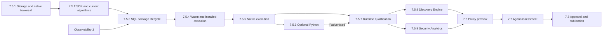

# Phase 7.5: Graphs, Findings, And Notifications

Implement deterministic local detection, policy provenance, mandatory routing,
and provider-neutral authority records inside Mithril Control.
Extend the same owners with installable algorithms and detectors through one
SDK and package contract. Parent: [Control and detection](../README.md).

## Intended end state

The same accepted inputs produce the same graph and finding revisions.
Every conclusion retains its coverage and policy limits. Notification retries
and human-acknowledgement deadlines survive restart. No finding or lease record
grants policy or physical authority.

## Implementation flow

```text
The shared reader returns committed evidence and frozen coverage
  -> GraphAndFindingOwner validates exact identities and package inputs
  -> graph joins retain proof quality and contradiction branches
  -> qualified packages commit immutable finding revisions
  -> NotificationRouter commits route, deadline, and delivery state
  -> shared query projections expose committed owner records

Late evidence or a source gap arrives
  -> the graph owner creates a linked revision without changing retained facts
  -> incomplete negative results remain Unknown
  -> routing preserves required action and human-acknowledgement obligations

Control restarts or a notification sink fails
  -> each owner restores its committed checkpoint
  -> deterministic replay deduplicates retained input
  -> routing resumes with its original deadline
  -> intake continues within required-processing retention bounds
  -> installed enforcement remains independent
```

## Approved extension and child phases

The user approved the SDK and execution direction for this plan on 2026-10-09.
Native graph storage, direct large-graph reads, bounded native DuckDB traversal,
and the portable analysis contract and Rust SDK are **Done**. Child phases
7.5.3 through 7.5.9 below are **Not done**. The added current-algorithm migration
in 7.5.2 is **Not done** and must pass before 7.5.3.
The completed graph and notification results remain below; those results do not
qualify package execution.

Use one versioned analysis contract for typed inputs, parameters, named outputs,
evidence, and checkpoints. Supply a Rust SDK first. Use Wasm components with
Wasmtime as the default compiled target. Keep SQL on the existing evaluator.
Supply a native target for qualified workloads and dependencies. Python is an
optional target; compiled algorithms do not require it. The SDK hides transport
bindings. Host owners enforce authorization, limits, validation, and commits.

| Child phase | Deliverable | Entry gate |
| --- | --- | --- |
| [7.5.1 Native graph storage and traversal](phase-7-5-1-native-graph-storage.md) | Complete the retained native-row TODOs below, direct large-graph reads, and bounded native DuckDB traversal. | Existing graph owners and tests. |
| [7.5.2 Analysis contract and SDK](phase-7-5-2-analysis-contract-and-sdk.md) | Portable SDK and contract inventory; migrate current discovery, context integration, and HF-PROC/HF-DW/HF-XNODE computation into shared SDK code used by existing Rust callers. | 7.5.1. |
| [7.5.3 Package lifecycle](phase-7-5-3-package-lifecycle.md) | Local SQL installation, dependency evaluation, atomic state, updates, and CLI/agent inspection. | 7.5.2, including algorithm equivalence, and Observability 3. |
| [7.5.4 Wasm execution](phase-7-5-4-wasm-execution.md) | Embedded Wasmtime, installed execution of the shared algorithms, runtime equivalence, and production dispatch replacement. | 7.5.3. |
| [7.5.5 Native execution](phase-7-5-5-native-execution.md) | Isolated compiled workers under the same model and package contract. | 7.5.4. |
| [7.5.6 Optional Python execution](phase-7-5-6-python-execution.md) | A bundled interpreter and locked dependencies when Python support is selected. | 7.5.5; optional for the core release. |
| [7.5.7 Package qualification](phase-7-5-7-package-qualification.md) | Integrated current-algorithm migration, package installation, replay, isolation, and paired incident proof. | 7.5.5; also 7.5.6 if Python is advertised. |
| [7.5.8 Discovery Engine algorithms](phase-7-5-8-discovery-engine-algorithms.md) | All pinned upstream system/network discovery, aggregation, summaries, recommendations, and candidate-conversion algorithms as packages. | 7.5.7. |
| [7.5.9 Security Analytics algorithms](phase-7-5-9-security-analytics-algorithms.md) | All pinned upstream rule, aggregate, correlation, vector, indicator, and monitor-decision algorithms as packages. | 7.5.7; independent of 7.5.8. |

The core order is 7.5.1 through 7.5.5, then 7.5.7. Include 7.5.6 before 7.5.7
only if Python is advertised. Each entry gate must pass its own checks; final
qualification does not replace them. After 7.5.7, 7.5.8 and 7.5.9 can proceed
independently. Both are required for the requested full algorithm scope.



The [algorithm inventory](algorithm-coverage.md) pins the three source revisions,
names current migration items and upstream families, and defines the completion
gate. Phase 7.5.2 completes the contract requirements audit and current-algorithm
conversion with production equivalence. Phase 7.5.4 proves the same algorithms
through installed Wasm execution. Phases 7.5.8 and 7.5.9 implement the upstream
catalogue. Missing algorithms remain Not done. Missing
deployment inputs are recorded separately. Package computation can complete
without policy activation; 7.6 and
7.8 retain preview and publication authority.

```text
Operator installs a built package for an authorized scope
  -> AnalysisPackageOwner validates the descriptor and locked dependencies
  -> AnalysisStore records the admitted revision and eligible exports

Accepted evidence changes a model input
  -> AnalysisPackageOwner selects pinned inputs and a compatible implementation
  -> the existing extractor returns bounded authorized data and closes readers
  -> the selected evaluator returns datasets, evidence references, and next state
  -> DiscoveryOwner or GraphAndFindingOwner validates domain results
  -> AnalysisStore commits results, checkpoints, references, and progress together
  -> NotificationRouter applies existing mandatory routes

Evaluation fails or its grant expires
  -> the execution owner stops work and releases temporary resources
  -> AnalysisStore retains the last complete commit
  -> the package owner records incomplete coverage without reporting a negative
```

`AnalysisPackageOwner` is a proposed owner in `araphor-data`, embedded with the
existing owners. It adds no service or database. Control retains grant and trust
decisions. Package installation cannot attach probes, change policy, or execute
a response. Existing bpftrace collection remains available without this work.

Keep computations in SQL or ordinary algorithm code. Package metadata declares
interfaces, dependencies, artifacts, and limits; it does not repeat filter, join,
or aggregation logic. CLI and agent descriptions use the same descriptor.
Local folders and built files are sufficient for installation. OCI transport
remains optional and requires the existing registry plan's owner; it is not an
entry gate for these child phases.

The [algorithm evaluation](../algorithm-and-detection-extension-evaluation.md)
and [package design](../extensible-security-packages-design.md) retain research
and examples. This section and its child phases own the selected execution
direction. Earlier native-first and mandatory Python-to-Wasm choices are not
requirements. Use small modules and functions, shared bindings and validation,
and Rust or platform tests. Continue in the primary checkout; add no worktree.

### Plan expansion result

**Done** for documentation on 2026-10-09. The phase is an expanded directory
with seven child plans. Parent links, research decisions, and the verification
matrix point to this plan. Checks pass for local links, anchors, Markdown fences,
whitespace, child structure, and removal of references to the old leaf path.
The historical result body and all seven storage TODOs are preserved exactly.
No runtime code, dependency, incident test, or benchmark changed or ran.
Implementation remains **Not done** for the new child phases.

The earlier algorithm-scope update assigned all seven current migration items
to 7.5.4 and added 7.5.8 and 7.5.9. The revised scope above moves computation
conversion into 7.5.2. There are now nine child plans. The
source inventory and new phases are recorded; algorithm implementation and
full per-function coverage remain **Not done**. This update changes plans only.
The plan update is **Done**. Checks pass for 15 Markdown files, 125 local links
and anchors, fences, whitespace, nine child structures, and algorithm IDs.
Historical results and the storage checklist remain unchanged.
`git diff --check` passes. No algorithm test or benchmark ran for this
documentation update.

### Consistency review result

**Done** for the plan review. Each of the nine child phases ends with its scope
and an expected example. SDK contract work, SQL installation, compiled dispatch,
current migration, runtime qualification, and upstream development have separate
completion points. The public API prerequisite and later policy handoff are
explicit. Python remains optional.

Checks pass for 15 Markdown files, 126 local links and anchors, phase structure,
end examples, and an acyclic dependency graph with and without Python. Historical
results and storage TODOs remain unchanged. The diff whitespace check passes.
No Rust, runtime, physical, or performance test ran for this documentation edit.
New implementation phases remain **Not done**.

### Algorithm migration order update

**Done** for the approved plan change on 2026-10-10. The 7.5.2 follow-up now owns
all seven current algorithm items, production adapters, and equivalence through
trusted Rust calls. Its completed portable SDK result remains unchanged. The
extended phase is **Not done**. Phase 7.5.3 requires that follow-up; 7.5.4 owns
installed Wasm execution, runtime equivalence, and replacement of built-in
dispatch. The inventories, verification tables, and qualification plan use the
same boundaries.

Checks pass for 11 changed Markdown files, 199 local links and anchors, code
fences, and exact preservation of all seven moved checklist items. Independent
review found no scope or status conflict. `git diff --check` passes. This update
changes plans and supporting records only. No Rust or runtime test ran.

## Entry gate and owners

Require Phase 7.4. GraphAndFindingOwner owns graph and finding revisions;
NotificationRouter owns delivery state; the authority owner owns signed
provider-neutral records. AnalysisStore owns durable data.
Use shared segment reads, transactional results, and retention from Phase 7.2.
Register exact witnesses through AnalysisStore; whole-segment charges and
pin/delete serialization apply. Do not add a graph-owned raw archive.
Enabled security packages are required processors. They use accepted evidence
and owner-qualified context without waiting for optional discovery profiles.
Their failure raises unhealthy coverage; their protected retention bounds,
not a separate lag timer, govern intake backpressure.
Implement the graph, finding and notification data owners in `crates/araphor-data`;
keep signed provider-neutral authority records in Control. No second service,
incident graph, source collector, or query database is required.

Status: **Not done** for the complete package scope. Native graph storage,
traversal, and the portable analysis contract and Rust SDK are **Done**. The
[SDK result](phase-7-5-2-analysis-contract-and-sdk.md#portable-sdk-result) records
its source, tests, and limits. The current-algorithm follow-up in 7.5.2, package
lifecycle, and installed execution remain pending.
The nine review corrections are **Done**. They pass the focused Rust checks,
final shared Rust procedure, and fresh lightweight and paired physical
incidents at `6beb143d`. The owned qualification VM is removed.

Implement `GraphAndFindingOwner` under proposed `src/graph/` and
`NotificationRouter` under proposed `src/notification/` in `araphor-data`.
Reuse policy provenance and authorization-proof owners. Each graph result
transaction commits its input manifest, revisions, witness references and
processor progress through AnalysisStore. Compute outside the transaction.

## Review correction TODOs

The review covers source `ace760dd`. Keep each correction in its current
owner. Use small owner modules and short functions. Reuse shared validation
and reads. Do not add a service, database, dependency, worktree, or shell test.

- [x] **1. Bind human acknowledgement to the expected finding revision.**
  `NotificationRouter::acknowledge` must reject a stale acknowledgement.
  Test an acknowledgement retry after a new finding revision arrives.
- [x] **2. Keep delivery attempts bounded for the current finding revision.**
  Keep completed evidence in immutable context history. Keep a pending
  attempt and its captured input. Test more than 48 delivered revisions and
  restart without losing the retry budget or original deadline.
- [x] **3. Isolate notification failures.**
  Control must attempt routing and delivery independently. Router scans must
  continue after one failed item and retry that item on a later scan.
  Test a tenant at its storage limit beside a tenant with available capacity.
- [x] **4. Apply escalation route changes to current obligations.**
  Compare the approved escalation reference during scheduling. Keep the
  original deadline, finding marker, retry budget, and pending attempt.
  Test a missing route added later and an escalation-only route update.
- [x] **5. Check graph input expiry before the unchanged-input return.**
  Test the normal `process` path after the witness deadline and raw retention.
  Require the linked result to report `RETAINED_INPUT_EXPIRED`.
- [x] **6. Retry a failed graph refresh before clearing failure health.**
  Test the normal `process` path while the context provider still fails.
  Clear `ProcessingFailed` only after a successful refresh.
  Keep a failed source from stopping healthy sources in the same page.
  Return the first typed error after processing the remaining sources.
  Retry failed older windows before new evidence can clear failure health.
  Test an older window outside the next input overlap.
- [x] **7. Preserve replay rejection across issuer removal and reintroduction.**
  Reuse the historical issuer, sequence epoch, and key ID check. Test a
  still-valid, unseen old sequence after the issuer returns with a key alias.
- [x] **8. Permit existing replay windows at capacity.**
  Apply the count limit only when a new window is necessary. Test an existing
  window at the 256-window limit and reject a new window at that limit.
- [x] **9. Remove repeated full scans from notification routing.**
  Read a bounded current-finding batch once. Use scoped related-obligation
  reads. Keep canonical latest-revision selection and bounded memory.
  Test duplicate windows, page continuation, and more than 256 findings.

Each correction requires a focused Rust regression. The final shared Rust
procedure must run after the last source or test edit. Performance remains
**UNQUALIFIED**. This work does not approve a performance test or benchmark.

## Native graph storage improvement TODOs

Status: **Done**. [7.5.1](phase-7-5-1-native-graph-storage.md) owns this checklist.
The previous finding reader decoded complete graph snapshots.
Store native graph rows so the existing owners can select records directly.
Expose exact join keys through the shared query views for authorized clients,
including agents. Reuse `GraphAndFindingOwner`, its validation rules, and the
existing VTab. AnalysisStore remains the durable owner.

- [x] **1. Store native graph rows.** Reuse the existing result metadata.
  Add versioned subject, relationship, and finding tables keyed by `result_id`.
  Preserve complete identities, lifetimes, evidence, branches, facts, input
  manifests, positions, deadlines, and package checkpoints. Keep one
  authoritative stored graph representation.
- [x] **2. Extend the atomic commit.** Update `AnalysisStore::commit_graph` in
  `crates/araphor-data/src/analysis/progress.rs`. Commit graph rows, evidence
  and context references, progress, revisions, and quota charges together.
  Keep graph computation outside the transaction. An identical retry must
  return the original receipt. A changed retry must fail.
- [x] **3. Replace snapshot scans with native reads.** Update
  `crates/araphor-data/src/graph/read.rs` and the AnalysisStore graph readers
  to fetch bounded selected rows. Select the latest version per source window,
  then the latest finding across those windows. A replacement window must stop
  contributing findings that it removed. Preserve the progress-linked
  snapshot and exact historical result reads.
- [x] **4. Feed the existing VTab directly.** Update trusted query extraction
  in `crates/araphor-data/src/analysis/extraction.rs` and the graph projections
  in `crates/araphor-data/src/query/graph.rs` to read the required native rows.
  Expose typed join keys for subjects, relationship endpoints, and finding
  subjects. Preserve exact tenant, graph version, and subject lifetime identity.
  Preserve whole-version authorization before row selection, sensitivity
  checks, cancellation, and byte limits. Close durable readers before SQL
  evaluation. Client SQL must receive detached authorized rows.
- [x] **5. Reconstruct snapshots for existing APIs.** Build `GraphSnapshotV1`
  from stored rows for snapshot, replay, and export requests. Preserve
  deterministic ordering, historical result references, and the existing
  JSON output from generic result reads. Do not retain a second complete
  snapshot body beside the native graph rows.
- [x] **6. Update recovery and existing-data handling.** Extend schema
  validation, quota reconstruction, and backup/restore checks. Convert all
  retained graph versions through a checked schema migration. Preserve result
  IDs, commit revisions, progress, and references. Validate exact reconstruction
  before retiring old bodies. Check temporary disk use. Preserve originals if
  conversion fails.
- [x] **7. Verify the complete path.** Add focused Rust tests for snapshot
  round trips, exact retries, overlapping windows, typed joins, authorization,
  rollback, reopen, migration, quotas, and backup/restore. Keep notification
  references valid after migration and restore. Reuse the existing lightweight
  and physical qualification cases. Run the lightweight case before the paired
  physical case and run the shared Rust procedure after the final source or
  test edit.

Keep the code in the existing owners, with small modules and short functions.
Share validation, row encoding, and reconstruction between reads, retries, and
migration. Work in the primary checkout. Use Rust or platform tests.

The native storage baseline is complete and committed as `91afc657`. Result
metadata keeps the version header and a separate JSON encoding field. Finding and query readers do not
load the encoding field. Exact JSON reads use that field with the native rows
and check that the reconstructed snapshot has the same values. Earlier focused
checks pass 32 native tests, one
schema-permission test, and ten graph query tests. Read the source record and
logs in `/tmp/araphor-native-storage.j8wJmf`. The existing dense notification
case also passes with 257 findings across 33 source windows. Read
`dense-split.log`. Earlier reads reached a deadline or failed native allocation.
The current reader separates key selection, version validation, and bounded
payload reads. The memory limit remains 64 MiB and the deadline remains one
second. The full lightweight case and Clippy pass on the recorded source. Read
`lightweight-qualified/result.json`, `lightweight-qualified.log`, and
`clippy-final.log` in the same evidence directory. The paired physical Rust case
passes. Read `physical/result.json`, `physical-test.log`, and the resource and VM
cleanup receipts. The earlier shared Rust procedure fails the existing
`control_graph_context_and_result_bounds_keep_required_progress` test with
`AnalysisReadDeadline`. It reports 378 passed, one failed, and three ignored
Araphor tests. Later workspace tests do not run. Read `rust-ci-qualified.log`.
The focused test also reproduces the failure. The unbounded finding read
measured an unused JSON output limit. It now skips that byte accounting. The
existing large-context test passes after the correction.

Final qualification passes on `source-state-complete2.json`, which covers 1,330
files with SHA-256
`ea747ca3d8ea338a09b5e515874aa6fffa9134ab29a68489d311dbb354b06479`.
The final shared Rust procedure returns zero after the last source edit. It
passes formatting, workspace check, strict Clippy, and all workspace tests.
The Araphor Data suite reports 379 passed, zero failed, and three ignored.
Read `rust-ci-complete2.log`, with SHA-256
`3e24ef3f8341e606a48adf26ac9b23bc093c14574b8b59f37b3d5047ce802ee2`.
The full lightweight case passes before its fresh physical pair. Read
`lightweight-complete2/result.json` and `physical-complete2/result.json` in
the same evidence directory. The
[storage result](phase-7-5-1-native-graph-storage.md#result) records their hashes,
platform, physical effects, matching coverage limits, and cleanup receipts.
The full incident, physical cross-node behavior, provider effects, and
performance remain unqualified. SDK authoring was pending on this storage
source. The [SDK result](phase-7-5-2-analysis-contract-and-sdk.md#result) records
the later contract implementation. Package execution remains pending.

## Required changes

### Immutable graph and finding revisions

Implement canonical subjects/objects/observations/edges, proof-quality-aware
joins, contradiction branches, deterministic windows, finding revisions, and
byte-identical replay in the `GraphAndFindingOwner`. Process parentage never
crosses nodes; time alone never creates an exact edge. Keep graph state in
AnalysisStore, not in CRDs or nodes. The graph schema, versioning, and
store are node-agnostic. Phase 8 extends this same owner with Kubernetes
cross-node edges; it does not add a second graph builder.

### Core detection packages

Implement `HF-PROC-001` and `HF-DW-001`, plus the schema, state machine, and
replay contract of `HF-XNODE-001`. Phase 8 completes `HF-XNODE-001` with its
Kubernetes sources and physical multi-node proof. Each package declares exact
inputs, coverage predicate, window, state machine, finding result, replay ID,
and no invented provider semantics.

### Notification router

Deliver sensitivity-filtered finding revisions with route authorization,
retry, dedupe, sink health, and failure evidence. Notification cannot mutate a
finding, policy, actor role, or response plan.

Use the same accepted-evidence references and finding revisions as discovery,
the local defender, and the console. NotificationRouter owns routing state;
neither DiscoveryOwner nor an agent may create a parallel escalation queue.
Approved routing configuration sets a minimum priority, human-acknowledgement
deadline, bounded retry policy, and escalation route for qualified findings.
Model priority is advisory and cannot reduce that floor or defer delivery.
An approved advisory route can also request human review of a submitted model
concern. It must identify that concern as unconfirmed; it cannot create a
proved finding or response authorization.

Persist the finding/revision/route key, routing-policy revision, delivery
attempt/result, deadline, and authorized human acknowledgement. Agent receipt
and sink acceptance do not satisfy human acknowledgement. Restart retains the
deadline; duplicate delivery does not create a second obligation. Route failure
and overdue acknowledgement remain visible until handled by the configured
policy. Revisions with a new required action get their own obligation.

Implement scoped reads and the human-acknowledgement operation on this owner.
Phase 7.8 exposes those methods through the shared Control API.
Acknowledgement is not finding closure, response approval,
or policy authority. No model call is required to route a critical finding.

### Provider-neutral authority records

Implement approval/request/lease/audit-handle records and signed proof
validation without storing credential secrets. CLI names and process paths
grant no authority. Exact provider issuance/use joins remain Phase 10.

### Policy provenance

Join each observation to its exact CRD source revision, signed candidate,
target snapshot, node-bound generation, and activation acknowledgement when
those records exist. Persist this join as
`PolicyObservationProvenanceV1`. A missing or mixed rollout state limits the
finding and negative claim. Graph and package code may read Phase 6.2 policy
inventory but cannot change desired state, sign or distribute a candidate,
update CRD status, or activate a node generation.

## Acceptance and verification

Replay local credential, executable, file, network, and authority-pivot events
for `HF-001` through `HF-012` under loss/late/duplicate/contradiction variants.
Findings and uncertainty must be stable and explain the exact prevented,
allowed, payload-unobservable, contextual, or outside-authority stage.

- Replay duplicate, late, reordered, gapped, and contradictory input. Preserve
  canonical graph/finding digests and exact package input manifests.
- Persist graph versions, finding revisions, package checkpoints, routing
  cursors, and data references in AnalysisStore. Keep signed authority records with
  their Control authority owner and project exact revisions into context.
  Reopen the data store without changing retained IDs or source positions.
- Test complete, partial, stale, and mixed policy rollout joins.
- Test foreign-tenant references, signed-proof mismatch, expiry, and replay.
- Test route failure, duplicate delivery, missing human acknowledgement,
  restart, model refusal, and a benign model label on a critical finding.
  None may reset or discharge the required escalation deadline.
- Rerun `AUTHORIZATION-REPLAY-004`, `HF-LOCAL-001`,
  `HF-004-RESULT-001`, and `HF-011-READ-RESULT-001` through package replay.
- Use the [Phase 7 runbook](../../manual-testing/phase-7-manual-acceptance.md)
  for the graph, provenance, routing, and authority checks.
- Run focused `control_graph_`, `control_notification_`, and
  `control_authority_` tests, then `bash .github/scripts/verify-rust-ci.sh`.
  Test names are implementation requirements; require nonzero case counts.

### End-to-end deliverable

Add `graph-notification` to `mithril_discovery_test` and implement it under
`crates/mithril-e2e/src/discovery/`. Use production intake, graph and router
owners. A test double can supply the external notification sink and clock,
not finding construction or routing decisions. Commit evidence, generate a
finding, fail the first delivery, restart, retry, and pass the human deadline.
Require one obligation with the original deadline. Compare canonical findings
after duplicate/reordered delivery. A benign model report cannot lower priority.

```sh
cargo run -p mithril-e2e --bin mithril_discovery_test -- --case graph-notification --output-directory /tmp/araphor-graph
```

Run the matching physical incident case only after this lightweight result.
Store graph/finding IDs, evidence digests, route attempts, deadline, human
receipt and source coverage in result.json.

## Exclusions and stop point

No new Appendix C fixture ID, cross-node physical claim, provider issuance
binding, source publication, or response actuation. Mithril 8 extends this
graph with Kubernetes causality; Mithril 10 supplies provider bindings.
Stop before the detection-recipe and proposal work in Phase 7.6.
The child phases add the package runtime and detector installation. Phase 7.6
retains investigation recipes, proposal construction, and exact policy preview.
Phase 7.5.8 produces candidate datasets and exports before preview exists.
Packages can return typed analysis results; they cannot approve or activate a
policy. Optional Python and OCI support do not block the core path. Performance
remains unqualified until a separately approved workload and limits are tested.

## Implementation result

Status: **Done**. All nine review corrections and the fresh lightweight and
paired physical incidents pass at `6beb143d`. The owned VM cleanup passes.
This result covers the corrections at `6beb143d`. It does not qualify the later
storage or traversal changes. Read the storage checklist and 7.5.1 result for
those changes.
The retained implementation and qualification record below covers the earlier
source. The earlier graph and notification source is `dd7e52b5`. The final workspace Rust
procedure passes at `44368ec5` after the existing authorization assertion
correction. The production owners and paired incident source are identical
between those commits.

### Review correction result

The graph, context, and notification corrections are committed at
`7915e7ae532cd4979f5ac1dfe8830d5dcfea487b`. The shared Control and Node replay
corrections are committed at `6beb143d7810f8bbf10c949c84c4c180d6d04b78`.
All work uses the primary checkout. No worktree or shell test is added.
The new production modules have at most 258 lines. The existing owners keep
validation, retention, immutable history, quotas, and transaction boundaries.
The context writer, context decoder, graph context references, notification
scheduling, and replay-key checks have one shared implementation each.

The three additional graph cases first fail with the expected conditions:
a healthy source remains at cursor zero after another source fails; a failed
older window keeps its old finding after new evidence; an expired overlapping
window returns an invalid-witness error. Read
`/tmp/mithril-review-fixes-graph-red-workspace-v2-20261008.log` and its source
receipt, `/tmp/mithril-review-fixes-graph-red-source-20261008.json`.
The final process-path regressions pass after the owner corrections.

The focused workspace command uses `control_` and passes every required group:
39 `control_graph_`, 20 `control_notification_`, and eight `control_authority_`
cases. The shared Node authorization command passes 12 cases. Read
`/tmp/mithril-review-fixes-control-green-20261008.log` and
`/tmp/mithril-review-fixes-node-20261008.log`.

```sh
CARGO_INCREMENTAL=0 CARGO_BUILD_JOBS=2 CARGO_PROFILE_DEV_DEBUG=0 CARGO_PROFILE_TEST_DEBUG=0 RUST_TEST_THREADS=4 cargo test --workspace --all-targets --all-features control_ -- --nocapture
CARGO_INCREMENTAL=0 CARGO_BUILD_JOBS=2 CARGO_PROFILE_DEV_DEBUG=0 CARGO_PROFILE_TEST_DEBUG=0 RUST_TEST_THREADS=4 cargo test --workspace --all-targets --all-features identity::authorization -- --nocapture
CARGO_INCREMENTAL=0 CARGO_BUILD_JOBS=2 CARGO_PROFILE_DEV_DEBUG=0 CARGO_PROFILE_TEST_DEBUG=0 RUST_TEST_THREADS=4 bash .github/scripts/verify-rust-ci.sh
```

The final shared Rust procedure passes formatting, workspace check, Clippy
with warnings denied, and all-target, all-feature tests. Its 76 top-level suites
report 1726 passed, zero failed, and 546 ignored. Nested crash subprocess
results are not added to this count. The full procedure includes the incident
round-trip and finding-density cases. Read
`/tmp/mithril-review-fixes-rust-ci-v2-20261008.log`,
`/tmp/mithril-review-fixes-rust-ci-result-20261008.json`, and
`/tmp/mithril-review-fixes-source-20261008.json` for exact source hashes and
verification settings. Rust debug assertions remain enabled. Debug information
and incremental compilation are disabled to reduce generated storage.

The final workspace build passes at the same source. The freshly built
production-owner CLI passes this command:

```sh
target/debug/mithril_discovery_test --case graph-notification --output-directory /tmp/mithril-review-fixes-lightweight-final-20261008
```

Read `/tmp/mithril-review-fixes-build-final-20261008.log`,
`/tmp/mithril-review-fixes-lightweight-final-20261008.log`,
`/tmp/mithril-review-fixes-lightweight-final-20261008/result.json`, and
`/tmp/mithril-review-fixes-lightweight-final-receipt-20261008.json`.
The receipt records the exact CLI SHA-256 and arguments. Accepted cursors are
`[0, 0, 2, 2]`; acknowledgements are `[null, null, 2, 2]`. Canonical replay is
equal. An injected transaction failure keeps graph progress unchanged.
The result retains 12 recorded incident cards and the 257-finding check.
Notification restart, retry, and human acknowledgement keep the original
deadline.

The paired Rust physical case passes one test with zero failures and 694
filtered cases on Linux `6.8.0-142-generic` with K3s `v1.35.5+k3s1`.
The existing VM helper builds current production images and copies the test
and helper binaries. Host and guest SHA-256 values match. Imported Node and
Control image identities match the fresh host images. Read
`/tmp/mithril-review-fixes-physical-provenance-20261008.json`.
The guest runs the existing Rust entry point:

```sh
"$MITHRIL_TEST_BIN" discovery::graph_notification::physical::graph_notification_incident --exact --ignored --nocapture --test-threads=1
```

Read `/tmp/mithril-review-fixes-physical-20261008.log`,
`/tmp/mithril-review-fixes-physical-invocation-20261008.json`, and
`/tmp/mithril-review-fixes-physical-20261008/result.json`.
The protected open returns errno 13 and zero bytes. The benign read returns
errno zero and 558 bytes. The graph decision matches the lightweight
`initial-health-missing` condition. It reports `PREVENTED` and
`COVERAGE_INSUFFICIENT`, with missing ancestry, policy provenance, and source
coverage. These limits prevent a complete malicious-lineage or policy claim.
The owner exposes 255 current findings. The exact selected notification
lifecycle has seven transitions. It keeps the original deadline through
restart, retry, overdue acknowledgement, and human acknowledgement.
Original volumes, store reopen, immutable graph replay, and zero pending
evidence are verified. No complete Hugging Face incident is claimed.

Both exact test namespaces are absent. The owned VM name and UUID, work
directory, and retained state record are absent. The unrelated running VM
keeps its UUID and state. Read
`/tmp/mithril-review-fixes-vm-cleanup-20261008.json`. All 59 frozen owner-source
files and seven existing helper-source hashes remain unchanged after the
physical case. The final Rust procedure still covers this source.

Performance remains **UNQUALIFIED**. Interleaved finding result IDs can cause
repeated immutable point reads because the materializer caches one snapshot.
No benchmark or additional cache is added. Full HDF5, Jinja, token, cloud,
controller, provider-binding, response, and cross-node physical environments
remain outside this qualification boundary.

### Discovery isolation failure

The unchanged test fails at source
`638987ce1bac0f22c746141f14c3eba467e0c395` with this command:

```sh
rtk cargo test -p mithril-e2e --lib discovery::isolation::tests::discovery_owner_service_isolation -- --exact --nocapture
```

The test returns exit code 101 with 0 passed, 1 failed, and 691 filtered tests.
One run removes evidence before the raw query. The next run returns
`RetainedRangeExpired { first_cursor: 1, last_cursor: 1 }` through trace output.
The error starts in `araphor-data/src/analysis/raw.rs` and passes through
`araphor-observability/src/error.rs`.

The test sets the shared raw age to one nanosecond. Control runs a periodic
retention sweep with the wall clock. The sweep can remove evidence or
diagnostic output before the test reads that input. Diagnostic output uses
the same retention policy. The correction must control the test clock and
prove diagnostic expiry. The correction must not exempt diagnostic output
or increase the retention age to conceal the race.

The correction is **Done** at
`03dbee33bcfd53014d550c95fb8eec8846f723e6`.
Control uses the intake clock for retention and diagnostic append. The default
clock remains the system clock. The isolation case uses a fixed clock. Its
one-nanosecond age limit remains unchanged. Each mode removes two evidence
records and then removes one diagnostic record at the next nanosecond.
The final diagnostic read must return `RetainedRangeExpired` for cursor 1.

The exact isolation test passes one case. The intake-clock test passes one
case. The trace-owner tests pass 11 cases. Formatting passes. The standalone
`owner-isolation` command passes both disabled and lagged discovery modes.
Read `/tmp/mithril-discovery-isolation-after-638987ce/result.json` for the
recorded cursors, counts, and expiry times. These checks cover the correction
patch on source `638987ce`, which matches the committed five-file change.

### Committed owner deliverables

| Deliverable | Result and source |
| --- | --- |
| Checked context updates and bounded reads | **Done** at `df94c2e0fb7c1fbed381a725d44dcd019fab284e`, `b1d5450d2925be0fe97b9629c0d242bec493007c`, and `f48ed13092d08a995494de5407eb6ea48ecde3d1`. The existing context transaction checks the exact next owner revision and retains an identical retry. Current heads use a bounded native page. |
| Graph owner, retained results, Control facts, and runtime wiring | **Done** at core source `5f55fba58bced4501d1753a136d4822f2998ec2e` and correction `9f71b53b006c2bbdedfa46fc7b9190c5b1f18b5e`. Thirty graph/query cases and two Control cases pass. |
| Data notification router | **Done** at `8810c9d2014ed8e89c96a5649fb348a2844e7344` and bounded correction `d9ba9308e7c42b8bbe956e604d111d1696887336`. Ten focused cases pass after the correction. Each attempt retains its exact context revision through restart. A route update retains the finding retry budget and human deadline. |
| Control authority, durable grants, and shared signed-proof validation | **Done** at `6eaa1655b00ffc9e05d5bfd8dc4f69fea774a4c9`. Six authority cases, one grant-revocation case, and 12 Node proof and replay regressions pass. |
| Query projections | **Done** at `7854457b8c63b9f592ddd9c68c63554d8cbce5e8`. The query family passes 144 cases. Eight graph query cases pass after the outcome correction. |
| Lightweight incident | **Done** at `870e8c072714ea772f1f0eef75ec09f2a30ed97c` and final source `dd7e52b500ba6373125d90e4a2d649074798dd0f`. The fresh CLI case includes the 257-finding regression. The earlier Rust round-trip test also passes. |
| Paired physical incident | **Done** at `dd7e52b500ba6373125d90e4a2d649074798dd0f`. The Rust Kubernetes case passes one test with 694 filtered tests. |
| Final Rust procedure | **Done** at `44368ec549efac0a5eb8842c5cfe3be3a61f3ed0`. Formatting, workspace check, workspace Clippy, and all-target, all-feature tests pass. The final count is 1709 passed, zero failed, and 546 ignored across 76 top-level suites. |

The router patch passes `cargo check -p araphor-data -p mithril-control
--all-features --all-targets` without warnings in the isolated proof checkout.
Its focused command passes 9 cases with 319 filtered tests:

```sh
rtk proxy cargo test -p araphor-data --all-features --lib control_notification_ -- --test-threads=1
```

Read `/tmp/mithril-notification-foundation-check.log` and
`/tmp/mithril-notification-staged-unit.log`.

These focused commands cover the committed Control authority and grant code:

```sh
rtk proxy cargo test -p mithril-control --all-features --lib control_authority_ -- --test-threads=1
rtk proxy cargo test -p mithril-control --all-features --lib control_notification_ -- --test-threads=1
rtk proxy cargo test -p mithril-node --lib identity::authorization -- --test-threads=1
```

The counts are 6 passed with 172 filtered, 1 passed with 177 filtered, and
12 passed with 271 filtered. Read `/tmp/mithril-authority-commit-unit.log`,
`/tmp/mithril-control-notification-commit-unit.log`, and
`/tmp/mithril-authority-node-commit-regression.log`. These checks do not replace
the final Rust procedure.

### Production outcome interpretation

The lightweight case uses the production Node canonicalizer, WAL, and mutual
TLS intake. It exposed a missing finding for a real denied event before the
physical incident ran. The canonicalizer stores `EffectPhysicalResultV1` in
the accepted record's `decision` field. Denied-before-effect has value 1.
The initial graph code compared this field with policy decision `Deny`, whose
value is 2. Direct unit fixtures used the same wrong value and concealed the
error. The initial one-finding assertion failed. The final round-trip log
records the passing case after the correction.

The correction is **Done** at `9f71b53b006c2bbdedfa46fc7b9190c5b1f18b5e`.
The graph uses the existing physical outcome enum. Value 1 with a negative
kernel result gives `Prevented`. Value 2 gives `PacketDropped` with syscall,
provider, and content limits. Value 3 gives `TerminationQueued` with a completion
limit. Value 0 remains `Unknown`. Denied, dropped, and queued outcomes cannot
supply credential-byte or direct channel-completion proof. Node is unchanged.
The owner also supplies `snapshot_result(tenant, result_id)` for an exact
immutable graph/finding bundle.

These focused commands pass after the correction:

```sh
rtk cargo test -p araphor-data --all-features control_graph_ -- --nocapture
rtk cargo test -p mithril-control --all-features control_graph_ -- --nocapture
```

The Data count is 30 passed with 307 filtered: 22 graph owner cases and eight
query cases. The Control unit count is two passed with 175 filtered. Read
`/tmp/mithril-graph-normalized-data-unit.log` and
`/tmp/mithril-graph-normalized-control-unit.log`. The exact staged correction
also passes `cargo check -p araphor-data -p mithril-control --all-features
--all-targets` without warnings in the isolated proof checkout. Read
`/tmp/mithril-graph-normalized-staged-check.log`.

The query commands are:

```sh
rtk cargo test -p araphor-data --all-features query_ -- --nocapture
rtk cargo test -p araphor-data --all-features control_graph_query_ -- --nocapture
```

The first count is 144 passed with 192 filtered. The second count is eight
passed with 329 filtered after the physical outcome correction. Read
`/tmp/mithril-graph-query-verification-20261008.txt` for the query receipt.
That file is a receipt, not a complete test log.

### Rust incident tests and checkout cleanup

The lightweight case uses `crates/mithril-e2e/src/discovery/graph_notification.rs`.
Replay and physical cases use Rust in
`crates/mithril-e2e/src/discovery/graph_notification/`. The physical incident
uses the existing Kubernetes platform test framework. The added shell entry
is removed at `2fe83ce0e24da6bf90fdebea83bc26f313266681`.
No new shell test framework remains.

All work continues in the provided primary checkout. The two proof worktrees,
`discovery-retention-proof` and `mithril-graph-proof`, are removed. Each of the
five modified retention files was equal to its committed file at `03dbee33`.
The graph proof checkout was clean, and its commit was already an ancestor
of `main`. The test-refactor worktree was not changed.

### Lightweight incident result

These commands pass at `870e8c072714ea772f1f0eef75ec09f2a30ed97c`:

```sh
rtk proxy cargo run -p mithril-e2e --bin mithril_discovery_test -- --case graph-notification --output-directory /tmp/mithril-graph-notification-lightweight-20261008
rtk proxy cargo test -p mithril-e2e --lib graph_notification_roundtrip -- --nocapture --test-threads=1
```

The Rust test passes one case with 693 filtered tests. Read
`/tmp/mithril-graph-notification-lightweight.log`,
`/tmp/mithril-graph-notification-roundtrip.log`, and
`/tmp/mithril-graph-notification-lightweight-20261008/result.json`.
The case runs production Node canonicalization, WAL, mutual TLS intake,
AnalysisStore, graph, Control context, authority, and notification owners with
optional discovery disabled. Reordered duplicate delivery produces accepted
cursors `[0, 0, 2, 2]` and acknowledgements `[null, null, 2, 2]`.
The pending range returns `UNAVAILABLE` until the earlier range is accepted.
Canonical replay values remain equal. An injected result-commit failure does
not advance graph progress.

The result retains 12 recorded incident cards, nine read-result variants,
five send-stage variants, and four local coverage and activation contracts.
Signed proof mismatch, expiry, replay, foreign scope, and store restart remain
explicit. The notification has one obligation and the original deadline,
`1791400000000000100`. Its transitions are unrouted, required route, failed
delivery, restart, retry, overdue human acknowledgement, and human
acknowledgement. A benign model label and agent receipt do not discharge it.

This result qualifies recorded package replay. It does not reproduce the full
HDF5, Jinja, token, cloud, or controller environment. The two-node fixture
qualifies schema and owner replay only. Cross-node physical causality and
provider issuance remain unqualified.

### Final source corrections

`2917354f10db3a89a955e6b1a3c757000d49ae0a` resolves graph lint errors.
The Kubernetes fact check keeps the same invalid-input predicate. Two fixtures
use references instead of cloned one-element slices. The graph library passes
Clippy, and the Kubernetes partial-stage test passes one case with 336 filtered.

`6aeb308b98985134d2ff05206389612ecbde56a5` resolves the remaining owner and
fixture lint errors. The new CBOR decode error uses the existing boxed-source
pattern. It preserves the error source, status, and retry result. Existing Node
policy callers are unchanged. Rust fixtures propagate missing values and lock
errors. Pending intake uses an explicit `Err(ControlRpc)` pattern.

Data, Control, Node, and E2E pass this command after those corrections:

```sh
rtk proxy cargo clippy -p araphor-data -p mithril-control -p mithril-node -p mithril-e2e --all-targets --all-features -- -D warnings
```

Read `/tmp/mithril-graph-owner-clippy-final-boxed.log`.
The router passes nine cases with 328 filtered, authority passes six with
172 filtered, and Node proof and replay pass 12 with 271 filtered. Read
`/tmp/mithril-notification-test-lint-unit.log`,
`/tmp/mithril-authority-boxed-unit.log`, and
`/tmp/mithril-authority-boxed-node-regression.log`.
These checks do not replace the final repository procedure.

### Physical finding count failure

The lightweight CLI case passes again at
`6aeb308b98985134d2ff05206389612ecbde56a5`:

```sh
rtk proxy cargo run -p mithril-e2e --bin mithril_discovery_test -- --case graph-notification --output-directory /tmp/mithril-graph-notification-lightweight-6aeb308
```

Read `/tmp/mithril-graph-notification-lightweight-frozen.log` and
`/tmp/mithril-graph-notification-lightweight-6aeb308/result.json`.
The production images and Rust test binary in the existing qualification VM
match the source receipt in
`/tmp/mithril-graph-notification-provenance-6aeb308.json`.

The paired Rust physical case reaches accepted Node evidence through the WAL
and mutual TLS intake. A denied file open returns errno 13 and zero bytes.
The benign read returns errno zero and positive bytes. The committed physical
graph decision matches the lightweight `initial-health-missing` decision.
The finding state is `COVERAGE_INSUFFICIENT`. The effect is `PREVENTED`, but
native ancestry, exact policy provenance, and source coverage remain missing.
The policy stage records `ACTIVATION_ACKNOWLEDGEMENT_MISSING`.
Routing then fails with `Notification { code: Limit, field: "obligation count" }`.
The test returns 0 passed, 1 failed, and exit code 101. It does not qualify the
notification lifecycle. Read `/tmp/mithril-graph-notification-physical.log` and
`/tmp/mithril-graph-notification-physical-observed-6aeb308.json`.
The existing VM runner sources `/var/tmp/mithril-manual.env` and runs this
Rust test:

```sh
"$MITHRIL_TEST_BIN" discovery::graph_notification::physical::graph_notification_incident --exact --ignored --nocapture --test-threads=1
```

Read `/tmp/mithril-graph-notification-physical-invocation-6aeb308.json` for the
exact VM UUID, provider operation, environment, input, output, and failure.

The router reads all current obligations into one tenant collection. It rejects
the 257th obligation. The physical tenant has at least 257 current findings;
the failed case did not export the exact total before resource cleanup.
The shared context quota is separate: 1024 retained revisions per tenant and
4096 retained revisions in the store. Those limits must remain unchanged.

This normal Rust case reproduces the exact count condition before the owner
correction:

```sh
rtk proxy cargo test -p mithril-e2e --lib graph_notification_dense_unrouted_limit -- --nocapture --test-threads=1
```

It passes one case with 694 filtered tests. It uses production Node WAL,
intake, graph, and routing owners. It derives 257 findings, requires the exact
limit error, retains 256 unrouted obligations, and leaves all findings intact.
Read `/tmp/mithril-graph-notification-density-light.log`.
The fixture patch for this reproduction against `6aeb308b` is retained at
`/tmp/mithril-graph-notification-density-before-6aeb308.patch`.
At that source, the correction and paired rerun are **Not done**.

The shared page and exact lookup correction is **Done** at
`b1d5450d2925be0fe97b9629c0d242bec493007c`.
`context_head_page` retains the existing 256-record and 1 MiB page bounds.
`context_head` reads one exact tenant, owner, entity, and lifetime head.
The graph supplies exact current and next finding receipts across overlapping
source windows. The store schema, context quotas, and existing aggregate methods
remain unchanged.

These commands each pass one case with 337 filtered tests:

```sh
rtk proxy cargo test -p araphor-data --all-features control_graph_context_head_pages -- --nocapture
rtk proxy cargo test -p araphor-data --all-features control_graph_committed_revision_retry_late_expiry_and_restart -- --nocapture
rtk proxy cargo test -p araphor-data --all-features control_graph_window_boundary_preserves_credential_join -- --nocapture
```

Read `/tmp/mithril-notification-pages-context-unit-20261008.log`,
`/tmp/mithril-notification-pages-late-unit-20261008.log`, and
`/tmp/mithril-notification-pages-overlap-unit-20261008.log`.
Data also passes Clippy with all targets and features and warnings denied.
Read `/tmp/mithril-notification-pages-clippy-20261008.log`.

The original router filter passes on the paging correction with nine cases and
329 filtered tests:

```sh
rtk proxy cargo test -p araphor-data --all-features --lib control_notification_ -- --test-threads=1
```

Read `/tmp/mithril-notification-paged-original-unit-20261008.log`.
At that check, the new count and restart regression, fresh lightweight incident,
and paired physical rerun are **Not done**.

The extended router filter passes ten cases with 329 filtered tests.
The added case checks continuation across a page with no visible state,
foreign page and finding scope, an old current-result reference, concern
deduplication after the first page, and exact human acknowledgement of a state
after that page. Read `/tmp/mithril-notification-paged-owner-unit-20261008.log`.
The command is the same `control_notification_` filter shown above.

The new dense Rust regression compiles, then returns `AnalysisReadDeadline`
after 300.43 seconds. The deadline error comes from the shared read control.
Its default stage deadline is one second. The test's total time does not set
that deadline. Read
`/tmp/mithril-notification-paged-density-read-deadline-20261008.log`.
The initial error does not identify the read operation. No deadline or quota
is increased to pass the case.
The stage rerun returns the same deadline error after 262.35 seconds inside
the first default `router.route` call. No store reopen or delivery has started.
Read `/tmp/mithril-notification-paged-density-stage-20261008.log`.
The related-state page used one head query and up to 256 body queries inside
one read stage. The correction must read one scoped native page and preserve
the existing key, body, page, cancellation, and deadline checks.

The shared reader correction is **Done** at
`f48ed13092d08a995494de5407eb6ea48ecde3d1`.
One scoped native query selects current heads and their exact bodies.
The existing row decoder validates each version before the page byte check.
A malformed body cannot become a false empty page at that check.
The returned page stays within 256 records and 1 MiB. Body validation stays
within 32 KiB. The native memory budget, deadline, cancellation, schema,
and context quotas remain unchanged.

These commands pass:

```sh
rtk proxy cargo test -p araphor-data --all-features --lib control_graph_context_head_pages -- --test-threads=1
rtk proxy cargo clippy -p araphor-data --all-targets --all-features -- -D warnings
```

The count is one passed with 338 filtered tests. Clippy returns exit code zero
without warnings. Read
`/tmp/mithril-notification-context-native-page-unit-20261008.log` and
`/tmp/mithril-notification-context-native-page-clippy-20261008.log`.
The dense case passes after this correction. At that run, the router and Rust
incident changes were pending in the primary checkout:

```sh
rtk proxy cargo test -p mithril-e2e --lib graph_notification_dense_progress_and_capacity -- --nocapture --test-threads=1
```

The count is one passed with 694 filtered tests. The run takes 1135.36 seconds.
Read `/tmp/mithril-notification-paged-density-native-page-20261008.log`.
The case derives 257 findings through production Node WAL and intake owners.
The first routing call commits 256 obligations. The case closes and reopens
the same AnalysisStore. It verifies the retained prefix, then commits the last
obligation through the default routing owner.

The selected finding retains failed delivery, retry, the original human
deadline, and human acknowledgement while the other 256 obligations remain
unchanged. A complete scan revisits an earlier key after a late canonical
finding revision and an approved route revision. The old finding receipt
remains immutable. An old human acknowledgement does not discharge the new
finding revision. The final delivery scan returns the existing
`StorageCapacity { resource: "tenant retained revisions" }` error at the
1024-revision quota. All 257 findings and obligations remain available.
No quota or read deadline is increased. This is a functional qualification.
At that check, the fresh lightweight incident and paired physical rerun are
**Not done**.

The final router filter passes after the native page correction and removal
of temporary test output:

```sh
rtk proxy env CARGO_INCREMENTAL=0 cargo test -p araphor-data --all-features --lib control_notification_ -- --test-threads=1
```

The count is ten passed with 329 filtered tests. The run takes 30.40 seconds.
Read `/tmp/mithril-notification-paged-owner-final-20261008.log`.
`CARGO_INCREMENTAL=0` disables the generated build cache. It does not change
test or storage behavior.

The final Data, Control, Node, and E2E Clippy command passes without warnings:

```sh
rtk proxy env CARGO_INCREMENTAL=0 cargo clippy -p araphor-data -p mithril-control -p mithril-node -p mithril-e2e --all-targets --all-features -- -D warnings
```

The run returns exit code zero in 17.59 seconds. Read
`/tmp/mithril-notification-paged-four-package-clippy-20261008.log`.
The first attempt found a redundant `Id128V1` conversion in the dense fixture.
The conversion is removed. Read
`/tmp/mithril-notification-paged-four-package-clippy-conversion-20261008.log`
for that failed attempt. The fresh lightweight result must cover this last
fixture edit.

A source review finds a missing assertion in the physical fixture. Its bounded
graph-processing loop can end before both incident cursors are consumed.
The fixture now requires both exact processor-health receipts before it checks
the benign record for absence of a finding. No production owner changes.
The first fresh lightweight run is stopped after this assertion edit, with
exit code 143. Read
`/tmp/mithril-graph-notification-lightweight-paged-interrupted-assertion-20261008.log`.
That interrupted run is not a passing result.
The same four-package Clippy command passes after the assertion edit in
18.90 seconds, without warnings. Workspace formatting also passes. Read
`/tmp/mithril-notification-paged-four-package-clippy-final-20261008.log`.

The router correction is committed at
`d9ba9308e7c42b8bbe956e604d111d1696887336`.
The Rust count, lifecycle, and physical assertion changes are committed at
`dd7e52b500ba6373125d90e4a2d649074798dd0f`.
The final Clippy and formatting checks cover these six source files.
The fresh lightweight and paired physical results are **Done**.
The two final result sections below state their commands and proof limits.

### Final lightweight result

This command passes on source
`dd7e52b500ba6373125d90e4a2d649074798dd0f`:

```sh
rtk proxy env CARGO_INCREMENTAL=0 cargo run -p mithril-e2e --bin mithril_discovery_test -- --case graph-notification --output-directory /tmp/mithril-graph-notification-lightweight-paged-final-v2-20261008
```

Read `/tmp/mithril-graph-notification-lightweight-paged-final-v2-20261008.log`
and `/tmp/mithril-graph-notification-lightweight-paged-final-v2-20261008/result.json`.
The result is `PASS`, qualification is `LIGHTWEIGHT`, and optional discovery
is disabled. It retains 12 incident cards, nine read-result variants, five
send-stage variants, and four local coverage and activation contracts.
Accepted cursors remain `[0, 0, 2, 2]`, and acknowledgements remain
`[null, null, 2, 2]`. The pending range is `UNAVAILABLE`. Canonical replay is
equal, and failed result commit preserves progress.

`NOTIFICATION-DENSITY-001` is `PASS`. It retains 257 findings and obligations,
the reopened store, the unchanged prefix, and progress to the last obligation.
The complete scan revisits the earlier finding and route revision 2.
The original deadline, priority floors, and attempts remain unchanged.
The page and work bounds remain 256. The quotas remain 1024 tenant revisions
and 4096 global revisions. The recorded error is `STORAGE_CAPACITY` for
`tenant retained revisions`. At that error, health retains 257 obligations,
zero unrouted obligations, and 256 overdue obligations.

The result does not qualify cross-node physical causality, provider issuance,
response execution, or performance. The paired physical result must use this
exact expected result and the matched source artifacts in
`/tmp/mithril-graph-notification-provenance-dd7e52b5.json`.
The command returns exit code zero. The expected result file has SHA-256
`6e1e0098e544ad98d1a3d0f3495089f0fbf4a324903b8e62aa6ca6a6bae16edf`.
Its copied guest file has the same hash.

### Final paired physical run

The matching Rust physical case starts on source `dd7e52b5` after the fresh
lightweight result passes. The existing VM is
`mithril-runtime-qualification-1337814`, UUID
`8512ec77-3d93-4376-842d-adebedb6620d`.
The host and guest binary hashes and image IDs match.
Read `/tmp/mithril-graph-notification-physical-invocation-dd7e52b5.json` for the
exact provider command, environment, source, test filter, input hash, and output.
Read `/tmp/mithril-graph-notification-physical-dd7e52b5.log` for the test log.
The paired lifecycle is **Done**. The Rust test returns exit code zero with
one passed, zero failed, and 694 filtered tests in 846.85 seconds.
The exact command is:

```sh
"$MITHRIL_TEST_BIN" discovery::graph_notification::physical::graph_notification_incident --exact --ignored --nocapture --test-threads=1
```

The run exports its graph input before notification completes. Read
`/tmp/mithril-graph-notification-physical-dd7e52b5/observed-graph-input.json`
and `observed-graph-decision.json` in the same directory.
The actual current finding count is 255. This rerun does not qualify a physical
count above 256. The exact count-limit condition remains qualified by the
257-finding production lightweight case.
The accepted denied and allowed records have cursors 806 and 815 in the same
exact source lifetime. Both are consumed before finding selection.
The original volume is used, and pending evidence is zero.
The graph decision matches `initial-health-missing`: `COVERAGE_INSUFFICIENT`,
`UNEXPECTED_EFFECT`, Critical, and `inspect-denied-effect`.
The native effect is `PREVENTED`, decision 1, with configured and kernel errno
`-13`. Task binding is exact, operation authority is pre-effect, and transport
integrity is authenticated. Temporal coverage is unknown. Native ancestry,
policy provenance, source coverage, and activation acknowledgement remain
missing. These limits must remain in the final result.

Read `/tmp/mithril-graph-notification-physical-dd7e52b5/result.json` and
`graph.json` in the same directory for the final copied artifacts.
The result is `PASS` with `KUBERNETES` qualification.
The protected open returns errno 13 and zero bytes. The benign read returns
errno zero and 558 bytes. Canonical replay is equal. ControlStore reopens
against the original volume. Pending evidence is zero.

The notification has the same result fields and seven transitions as the
lightweight notification. Its original deadline is `1791478501485624490`.
Critical priority, failed delivery, retry, overdue human acknowledgement,
and the human receipt remain in the retained obligation.
The other 254 obligations remain unchanged. Final health records 255
obligations, one human acknowledgement, and 254 unrouted obligations.
The test uses the exact current committed finding operation and retains one
obligation per finding, required action, and route.

This result qualifies one protected file-open denial and one benign read
through the real kernel, Node WAL, mutual TLS intake, Control context, graph,
and notification owners. It does not qualify HDF5, Jinja, projected-token
semantics, controller operations, remote payload, cloud effects, provider
issuance, cross-node physical causality, or performance.
The copied graph manifest equals the selected finding revision.
The paired decision and all seven transitions equal the fresh lightweight
contract. Read `qualification-receipt.json` in the same artifact directory
for each file hash and the exact namespace cleanup proof.
The two namespace API responses have empty `items` for
`mithril-pid-33808-523653838` and
`mithril-work-graph-notification-33808-523653838`.

### Verification storage recovery

The first full procedure at `6aeb308b` passes formatting, workspace check,
and workspace Clippy. Test compilation then fails with
`No space left on device` for the Control binary and E2E library test.
The log writer also fails. Read
`/tmp/mithril-graph-final-rust-ci-disk-6aeb308.log`; its capture note identifies
the part that the runner returned after the disk could no longer write the log.
This run does not qualify the full test suite.

No primary Cargo or Rust compiler process remained before cache removal.
The cleanup removes only 109 generated incremental-cache directories for the
five changed crates, with update times after this goal started. It recovers
`33123164160` bytes. Source, built binaries, native libraries, other crate
caches, and the test-refactor checkout remain available. Read
`/tmp/mithril-owned-incremental-cleanup-20261008.json` for each removed path.
The imported image export is also removed. Source was `6aeb308b` during cleanup.
That failure required a new run after this recovery.

After the final source builds stop at `dd7e52b5`, a second cleanup removes
nine new incremental-cache directories for the same five crates. Their path
inventory totals `7589453824` allocated bytes. Free storage rises from 15 GiB
to 21 GiB while VM file copies run. The separate test-refactor workspace is running
its own test binary and remains untouched. Source, final binaries, and images
remain available. Read
`/tmp/mithril-owned-incremental-cleanup-final-20261008.json` for the exact paths
and source. The final build uses `CARGO_INCREMENTAL=0`.

The owned VM cleanup is **Done**. The existing command is:

```sh
rtk proxy env XDG_STATE_HOME=/tmp/mithril-graph-notification-vm-state MITHRIL_VM_WORK_ROOT=/tmp/mithril-graph-notification-vm-work bash crates/mithril-e2e/harness/vm/manual.sh destroy
```

It returns exit code zero. The exact owned domain, work directory, and state
record are absent. Both owned namespaces were absent before VM removal.
Physical artifacts remain in `/tmp/mithril-graph-notification-physical-dd7e52b5/`.
Free host storage is 29 GiB after cleanup. Read
`/tmp/mithril-graph-notification-vm-cleanup-dd7e52b5.json` and its `.log` file.

### Final repository Rust procedure

Status: **Done** at `44368ec549efac0a5eb8842c5cfe3be3a61f3ed0`.
The final procedure passes after the last covered edit.
The first full procedure ran on code source
`dd7e52b500ba6373125d90e4a2d649074798dd0f` after the covered edits at that source:

```sh
rtk proxy env CARGO_INCREMENTAL=0 CARGO_BUILD_JOBS=2 RUST_TEST_THREADS=4 bash -c 'set -o pipefail
bash .github/scripts/verify-rust-ci.sh 2>&1 | tee /tmp/mithril-graph-final-rust-ci-dd7e52b5.log'
```

It runs workspace formatting, check, Clippy with all targets and features and
warnings denied, then tests with all targets and features. The environment
limits build and test concurrency and disables the incremental cache.
It does not omit packages, targets, features, or tests.
For that run, only the result and review documents differed from the code source.

Formatting, workspace check, and workspace Clippy pass. Test linking fills
the disk. The `erebor-codex-hook` test and `araphor-cli` library test return
linker signal 7, `Bus error`. The log writer returns `No space left on device`.
The procedure returns exit code one. It does not qualify the full test suite.
The log ends inside a linker command. Read
`/tmp/mithril-graph-final-rust-ci-disk-dd7e52b5.json` for the capture note and
runner outcome after log capture stops.

No Cargo, Rust compiler, or Clippy process remains before cleanup.
The cleanup removes sixteen inactive test executables for the same five crates.
Each file was generated after this goal started and before the final code
commit. The path inventory totals `17411104768` allocated bytes. The final
physical binary and the final focused Data binary remain available.
No source, native library, image, or other workspace is removed.
Read `/tmp/mithril-owned-obsolete-test-binary-cleanup-dd7e52b5.json` for each
path, inode, size, time, and removal. Free storage is 17 GiB after cleanup.

The complete procedure ran again on unchanged source:

```sh
rtk proxy env CARGO_INCREMENTAL=0 CARGO_BUILD_JOBS=1 RUST_TEST_THREADS=4 bash -c 'set -o pipefail
bash .github/scripts/verify-rust-ci.sh 2>&1 | tee /tmp/mithril-graph-final-rust-ci-dd7e52b5-v2.log'
```

One build job reduces peak temporary link storage. All packages, targets,
features, and tests remain in the procedure.

Formatting, workspace check, workspace Clippy, and test compilation pass.
The E2E suite returns 168 passed, one failed, and 526 ignored in 1472.39 seconds.
Both `graph_notification_dense_progress_and_capacity` and
`graph_notification_roundtrip` pass. The procedure returns exit code 101.
It does not qualify the full workspace suite.

The failure is `identity::authorization_tests::invalid_auth_is_rejected`.
The test expects the old `Ed25519 verification failed` diagnostic.
The shared validator still rejects the changed signature with `verify_strict`.
Node retains the typed Control denial in `Error::AuthorizationProof` with
`PermissionDenied` and `NonRetryable`. Validation fails before replay acceptance.
The exact unchanged test reproduces the failure with zero passed, one failed,
and 694 filtered tests in 0.11 seconds:

```sh
rtk proxy env CARGO_INCREMENTAL=0 CARGO_BUILD_JOBS=1 cargo test -p mithril-e2e --lib identity::authorization_tests::invalid_auth_is_rejected -- --exact --nocapture --test-threads=1
```

Read `/tmp/mithril-authorization-invalid-original-dd7e52b5-20261009.log`.
The correction must check the exact typed denial and preserve the replay-WAL
assertion. It must not change the production validator or accept the signature.

The correction is **Done** at
`44368ec549efac0a5eb8842c5cfe3be3a61f3ed0`.
Only the existing `identity/authorization_tests.rs` assertion changes.
It requires Node `AuthorizationProof`, Control `Authority` with `Denied` and
`field: "intent signature"`, `PermissionDenied`, `NonRetryable`, and the typed
Control source. The replay WAL must still contain only its two owner records.
The production owners and graph-notification qualification source are identical
to `dd7e52b5`. The lightweight and physical receipts retain that exact source;
the final workspace procedure must also cover the corrected test source.

The existing authorization tests and E2E Clippy pass:

```sh
rtk proxy env CARGO_INCREMENTAL=0 CARGO_BUILD_JOBS=1 cargo test -p mithril-e2e --lib identity::authorization_tests:: -- --nocapture --test-threads=1
rtk proxy env CARGO_INCREMENTAL=0 CARGO_BUILD_JOBS=1 cargo clippy -p mithril-e2e --all-targets --all-features -- -D warnings
```

The tests return two passed, zero failed, and 693 filtered in 0.10 seconds.
Clippy returns exit code zero without warnings in 22.94 seconds.
Read `/tmp/mithril-authorization-typed-boundary-unit-20261009.log` and
`/tmp/mithril-authorization-typed-boundary-clippy-20261008.log`.

The complete Node suite also passes at `44368ec5`:

```sh
rtk proxy env CARGO_INCREMENTAL=0 CARGO_BUILD_JOBS=1 RUST_TEST_THREADS=4 cargo test -p mithril-node --all-targets --all-features
```

The library has 282 passed and one ignored test. Binary and integration tests
add 12 passed tests. The total is 294 passed, zero failed, and one ignored.
Read `/tmp/mithril-node-full-after-typed-authorization-44368ec5-20261008.log`.

That separate build leaves 4.0 GiB free. With no active Cargo or Rust compiler,
the cleanup removes its six inactive test executables. Each exact path comes
from the Node run's Cargo `Running` record. Each file is newer than the test
correction commit. The cleanup checks its parent, inode, size, time, and absence
from active process executables before removal. The path inventory totals
`4524412928` allocated bytes. Source, libraries, images, and result records
remain available. Free storage is 8.2 GiB after cleanup. Read
`/tmp/mithril-owned-node-preflight-binary-cleanup-44368ec5.json`.

The final complete procedure passes on the corrected test source:

```sh
rtk proxy env CARGO_INCREMENTAL=0 CARGO_BUILD_JOBS=1 RUST_TEST_THREADS=4 bash -c 'set -o pipefail
bash .github/scripts/verify-rust-ci.sh 2>&1 | tee /tmp/mithril-graph-final-rust-ci-44368ec5-v3-20261009.log'
```

Its source is `44368ec549efac0a5eb8842c5cfe3be3a61f3ed0`.
Only the result and review documents differ from that committed source.
The command retains all workspace packages, targets, features, and tests.

The runner returns exit code zero. Formatting, workspace check, and workspace
Clippy with warnings denied pass. Test compilation passes in 68 seconds.
All 76 top-level test suites pass: 1709 passed, zero failed, 546 ignored,
zero measured, and zero filtered tests. Each Cargo `Running` block contributes
its last test summary. The count excludes seven subprocess-helper summaries.
An independent read of the complete log gives the same totals.

| Suite | Final result |
| --- | --- |
| Data library | 336 passed, zero failed, three ignored; 245.08 seconds. |
| Control library | 177 passed, zero failed, one ignored; 11.44 seconds. |
| E2E library | 169 passed, zero failed, 526 ignored; 1410.29 seconds. Both graph-notification tests and both authorization tests pass. |
| Node library | 282 passed, zero failed, one ignored; 6.27 seconds. Node binary and integration suites add 12 passed tests. |

Read `/tmp/mithril-graph-final-rust-ci-44368ec5-v3-20261009.json` for the exact
command, source, suite rows, totals, and complete-log SHA-256. The log SHA-256 is
`5237dddaca340e7dd1a3ed57c456ab6b18944f985fdd5ca201b7ed0d477f7b4e`.
The final source differs from the qualified `dd7e52b5` tree only in the existing
authorization test assertion. No production owner, paired incident, Cargo,
CI, or verification-script file changes after the passing incident runs.
The lightweight and physical receipts retain their exact `dd7e52b5` source.
The final workspace procedure covers the corrected `44368ec5` test source.
Only the result and review documents change after this final Rust procedure.

Observability performance remains **UNQUALIFIED**. No performance test is
added by this approval.

## End scope and example

Complete when all required children pass: native graph storage, the SDK and
contract inventory, current algorithm migration, SQL package lifecycle, Wasm and
native execution, runtime qualification, and the full pinned Discovery Engine
and Security Analytics algorithm catalogues. Include Python only if advertised.
Each algorithm has implementation proof and a separate live-input readiness
record. Performance remains unqualified until its separately approved checks run.

Example at completion: an operator installs network discovery and finding
correlation packages over qualified inputs. The same installation exposes their
versioned summaries, candidate datasets, findings, and evidence through authorized
queries. Restart preserves checkpoints and required notification deadlines.
A candidate policy waits for the later preview, approval, and publication path;
a finding does not itself block an action. This scope adds no new cross-node
physical-prevention claim or automatic response authority.
