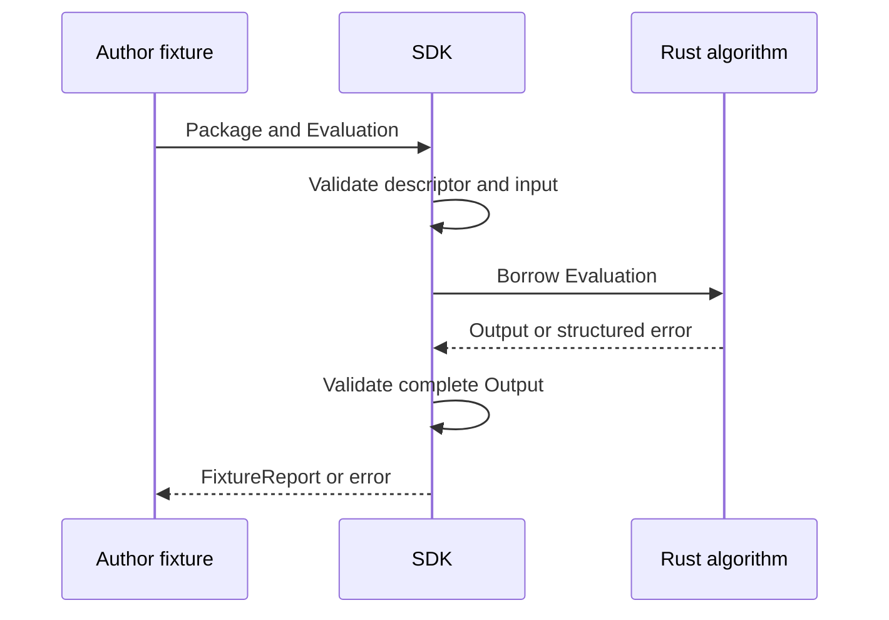

# Analysis Contract Review

The Rust SDK checks a declared analysis interface before and after a local
computation. The host declares the current HF detector interfaces and maps their
existing finding reasons. Read the [approved plan](phase-7-5-2-analysis-contract-and-sdk.md)
and the [portable SDK guide](../../../../../crates/araphor-analysis-sdk/README.md).

Source record: the primary checkout at `2b9fe8c`, with validation correction
`cb936bd`, graph fixture correction `d00fd54`, and detector example `fadacd5`.
Test error propagation is recorded in `2b9fe8c`. The original SDK commit is
`c85be1d7`; the host contract commit is `412c001b`.
The plan Result records the final source and verification evidence.
This review records the completed portable SDK scope. The added
[current-algorithm follow-up](phase-7-5-2-analysis-contract-and-sdk.md#current-algorithm-migration)
requires production adapters and shared computation. That work is **Not done**.

## Intended end state

An author declares typed inputs, parameters, outputs, evidence, reasons, and
checkpoint state once. Inspection and target declarations use the same package
descriptor. Local fixtures verify computation through the portable interface.
The host retains identity, authorization, proof, storage, and commit authority.
This scope stops before installation or executable target adapters.

## Linked implementation flow

These event blocks follow the approved plan. Links identify the current owners.

[FilesCount::package](../../../../../crates/araphor-analysis-sdk/examples/files_count.rs) Author builds a Rust analysis package. 
-> [Package::validate](../../../../../crates/araphor-analysis-sdk/src/descriptor.rs) The SDK checks declared model interfaces. 
-> [Package::interfaces](../../../../../crates/araphor-analysis-sdk/src/bindings.rs) The SDK generates the descriptor and versioned WIT and native interface declarations. 
-> [Package::build](../../../../../crates/araphor-analysis-sdk/src/descriptor.rs) The SDK writes `descriptor.json`, `analysis.wit`, and `analysis.h`. 
-> [Package::test](../../../../../crates/araphor-analysis-sdk/src/fixture.rs) The local Rust fixture runner checks the portable computation contract.

[Fixture](../../../../../crates/araphor-analysis-sdk/src/fixture.rs) Author tests an export against fixtures. 
-> [Evaluation](../../../../../crates/araphor-analysis-sdk/src/evaluation.rs) The fixture supplies typed inputs, evaluation context, parameters, and prior checkpoint. 
-> [ContractValidator::input](../../../../../crates/araphor-analysis-sdk/src/validation.rs) The SDK validates those values before computation. 
-> [FilesCount::evaluate](../../../../../crates/araphor-analysis-sdk/examples/files_count.rs) Ordinary algorithm code returns datasets and evidence references; stateful exports also return the next checkpoint. 
-> [ContractValidator::output](../../../../../crates/araphor-analysis-sdk/src/validation.rs) Shared contract validation checks the declared outputs and limits. 
-> [FixtureReport](../../../../../crates/araphor-analysis-sdk/src/fixture.rs) The test result identifies the export, implementation, fixture, package, and input revisions.

[SensitiveAccess::evaluate](../../../../../crates/araphor-analysis-sdk/examples/sensitive_access.rs) Author tests a detector against an exact baseline. 
-> [Evaluation::input](../../../../../crates/araphor-analysis-sdk/src/evaluation.rs) The function obtains named sensitive-read and baseline inputs. 
-> The detector requires complete baseline coverage with no selection limits. 
-> The detector compares each subject/resource pair with the baseline. 
-> A pair outside the baseline produces a finding, a typed reason with the baseline revision, and evidence to the event row. 
-> [Package::test](../../../../../crates/araphor-analysis-sdk/src/fixture.rs) The SDK checks the findings and returns the exact input revisions and coverage. 
-> An incomplete baseline returns `Incomplete`; it produces no report.

[Output](../../../../../crates/araphor-analysis-sdk/src/evaluation.rs) An export returns an invalid schema, reference, or checkpoint. 
-> [ContractValidator](../../../../../crates/araphor-analysis-sdk/src/validation.rs) Validation rejects the complete result with a structured error. 
-> [Package::test](../../../../../crates/araphor-analysis-sdk/src/fixture.rs) The fixture runner returns no report. It has no durable commit call. 
-> **Implemented outside this phase:** [AnalysisStore::commit_graph](../../../../../crates/araphor-data/src/analysis/progress.rs) remains the production graph commit owner. The SDK fixture does not call that owner.

**Not implemented:** executable artifact builds, runtime bindings, installation,
admission, scheduling, or detector activation. `build` writes declarations.
Its file writes are sequential; an I/O error can leave partial files.
`inspect` reads the descriptor and does not call algorithm code.

## Reading route and owners

Read the public [crate exports](../../../../../crates/araphor-analysis-sdk/src/lib.rs),
then the following owners in order. The SDK has no host store or Control dependency.

| Owner | Input, state, and output | Mutation and lifetime |
| --- | --- | --- |
| [Package, Model, Port](../../../../../crates/araphor-analysis-sdk/src/model.rs) | Identity, revision, named schemas, dependencies, reasons, limits, and state version. | The author owns these values. Validation does not load dependencies or execute code. |
| [Evaluation](../../../../../crates/araphor-analysis-sdk/src/evaluation.rs) | Named Arrow batches, revisions, coverage, source windows, parameters, context, and prior state. | The fixture owns the input. Computation borrows it for one call. |
| [Package::interfaces](../../../../../crates/araphor-analysis-sdk/src/bindings.rs) | One validated descriptor supplies JSON and both interface declarations. | Generated strings are owned return values. Inspection has no executable loader. |
| [ContractValidator](../../../../../crates/araphor-analysis-sdk/src/validation.rs) | Declared schemas and reduced evaluation limits. | A validator borrows the selected model. Its counters and reference sets end with validation. |
| [BatchBudget](../../../../../crates/araphor-analysis-sdk/src/validation/batch.rs) | Arrow batches, declared schemas, and data bounds. | Counters reject excess data. Range checks inspect selected non-null values without copying child buffers. |
| [Package::test](../../../../../crates/araphor-analysis-sdk/src/fixture.rs) | One fixture and one Rust function. | The function runs once after input checks. A report owns the checked output and copies revision metadata. |
| [GraphAndFindingOwner::analysis_package](../../../../../crates/araphor-data/src/graph/contract.rs) | Current HF package IDs and existing host types. | The host creates metadata only. It does not replace detector dispatch. |
| [FindingV1::analysis_reason](../../../../../crates/araphor-data/src/graph/contract.rs) | One existing host finding and an output row ordinal. | Host finding validation runs first. Conversion returns owned Arrow details without changing the finding. |

The Rust fixture runs trusted code in the test process. An error discards the
report; it does not undo arbitrary effects inside the author function. A panic
uses ordinary Rust behavior. Data limits do not enforce a process memory limit,
deadline, cancellation, or sandbox.

Detector authors use Arrow schemas and ordinary Rust functions. The
[detector example](../../../../../crates/araphor-analysis-sdk/examples/sensitive_access.rs)
uses named input lookup and Arrow column access. It borrows baseline and event
strings until result assembly. Arrow errors convert to the SDK error with `?`
and retain their source. No algorithm trait, rule language, or second schema
model is required. A zero-row finding output means no match in the supplied
events; the report still records input coverage. This example does not prove
malicious activity or preventive action.

## Data and validation route

[Package::validate](../../../../../crates/araphor-analysis-sdk/src/descriptor.rs)
checks contract version `1`, names, duplicate declarations, schema types,
checkpoint version, reason namespace, numeric tolerance, and positive limits.
Encoded descriptors have a 1 MiB bound. Local dependency bindings require the
exact package revision and equal input/output schemas. External resolution and
cycle checks belong to admission.

[ContractValidator::input](../../../../../crates/araphor-analysis-sdk/src/validation.rs)
requires every named input exactly once. Schemas include nullability and
metadata. Parameters have one row, or are absent for an empty parameter schema.
Source windows carry exact source bytes and ordered UTC bounds. Prior state can
be absent on the initial call. A supplied checkpoint must match its declaration.

[BatchBudget](../../../../../crates/araphor-analysis-sdk/src/validation/batch.rs)
checks batches, rows, Arrow memory bytes, and envelope text. Input, output, prior
state, and next state have separate budgets. Parameters use the input budget.
Evidence and reason details use the output budget. A limit error rejects the
result. No client SQL display limit truncates the computation input.

Arrow integer widths retain exact values. Timestamps use signed nanoseconds and
`UTC`; boot time can use exact `UInt64` with unit metadata. Lists, fixed-size
lists, structs, and binary fields represent nested or encoded data. Floating
values must be finite when selected and non-null. Range checks apply list
offsets and parent null masks to nested values. Physical Arrow validation and
memory bounds still cover retained backing storage. A `Null` field must be
nullable at every schema depth. A presence field distinguishes
a missing source value from a nullable value. The SDK validates tolerance
bounds; author assertions perform numeric result comparisons.

[ContractValidator::output](../../../../../crates/araphor-analysis-sdk/src/validation.rs)
checks every output, each global dataset row reference, duplicate evidence,
required evidence, namespaced reason codes, one-row reason details, and next
state. Named outputs can have different row counts. Input order is batch order,
then row order. Algorithms define output ordering and tie rules. Evidence refers
to named input rows. Retained prior results must be inputs when they supply
evidence; checkpoint rows cannot supply evidence.

## Host contract and graph boundary

[Current host descriptors](../../../../../crates/araphor-data/src/graph/contract.rs)
cover `HF-PROC-001`, `HF-DW-001`, and `HF-XNODE-001`, export `detect`, and revision
`1`. They declare records, coverage, coverage keys, facts, and a manifest.
Outputs declare subjects, relationships, findings, and branches. State declares
the existing `GraphPackageCheckpointV1`. Binary fields identify their host type
and encoding in schema metadata. Portable validation does not decode or approve
these host payloads.

[FindingV1::validate](../../../../../crates/araphor-data/src/graph/model.rs)
remains the host identity and evidence check before reason conversion.
[GraphAndFindingOwner::process](../../../../../crates/araphor-data/src/graph/live.rs)
still uses the existing detector path and
[commit_bounded_window](../../../../../crates/araphor-data/src/graph/commit.rs).
The SDK descriptors are not an installed-package dispatch path.

**Implemented outside this phase:** the host selects authorized native graph
rows through [traversal version checks](../../../../../crates/araphor-data/src/analysis/extraction/graph/traversal/versions.rs).
**Not implemented:** the production adapter from those rows into an SDK
`Evaluation`. The 7.5.2 follow-up owns this adapter and its production tests.
The fixture test proves that selected relations and a manifest can
retain exact versions, empty replacements, subject key bytes, source windows,
limits, and hop boundaries. Its computation joins relationship endpoints to
subjects within each version and returns per-version counts. Assertions inspect
that output. The keys are opaque fixture bytes; this test does not decode host
identities or test production extraction or traversal performance.

[FindingReasonV1](../../../../../crates/araphor-data/src/graph/model.rs) and its
[analysis mapping](../../../../../crates/araphor-data/src/graph/contract.rs) still
accept only the eleven current reasons and three HF package IDs. The SDK accepts
declared package namespaced reasons. **Not implemented:** general installed
reason storage and mapping. [Wasm execution](phase-7-5-4-wasm-execution.md) must
accept new namespaced reason codes and typed details while preserving historical
findings and their existing codes. A descriptor grants no physical authority.

## Target declarations and lifetimes

[WIT](../../../../../crates/araphor-analysis-sdk/src/bindings/analysis.wit)
declares versioned evaluation/result records and named Arrow IPC bytes. The only
host operation is `cancelled`; the package exports `evaluate`. **Not implemented:**
IPC encoding/decoding, component instantiation, cancellation enforcement, or
target execution. WIT parsing proves declaration syntax, not runtime behavior.

[The C header](../../../../../crates/araphor-analysis-sdk/src/bindings/analysis.h)
declares Arrow streams within one worker process. Request bytes and streams are
borrowed until `evaluate` returns. The callee does not release input streams.
Output must not borrow request storage. Consumers release received Arrow arrays;
the producer releases unread output streams and response buffers. Every call
requires response release, including errors. A second release must be harmless.
The return error code must equal `response.error.code`.
Panics and exceptions must not cross this boundary. **Not implemented:** native
entrypoint loading, pointer checks, transport, release enforcement, or isolation.
The C syntax test checks constants and declarations, not ABI execution or layout
compatibility across targets. This header defines no BPF or durable byte layout.

## Tests and verification limits

| Contract | Source tests |
| --- | --- |
| Example and input gating | [SDK tests](../../../../../crates/araphor-analysis-sdk/src/tests.rs): `count_fixture_builds`, `invalid_input_blocks_execution`, `batches_keep_all_rows`, `multiple_inputs_variable_outputs`. |
| Detector authoring | [Detection tests](../../../../../crates/araphor-analysis-sdk/src/tests/detection.rs): `detector_matches_exact_baseline`, `clean_access_has_none`, `detection_evidence_spans_batches`, `incomplete_baseline_blocks_detection`, `empty_baseline_retains_revision`, `named_inputs_ignore_order`, `missing_input_is_structured`. |
| Rejection and state | [Boundary tests](../../../../../crates/araphor-analysis-sdk/src/tests/boundaries.rs): `output_evidence_is_exact`, `checkpoint_version_and_schema`, `reason_namespace_and_details`, `limits_reject_complete_result`, `failure_returns_no_report`, `rejects_descriptor_duplicates`. |
| Precision and retained evidence | [Semantic tests](../../../../../crates/araphor-analysis-sdk/src/tests/semantics.rs): `nested_vectors_preserve_precision`, `missing_differs_from_null`, `prior_result_retains_evidence`, `rejects_nonfinite_parameters`, `invalid_output_blocks_report`. |
| Selected Arrow values | [Array tests](../../../../../crates/araphor-analysis-sdk/src/tests/arrays.rs): `sliced_lists_skip_hidden`, `struct_masks_nested_list`, `fixed_lists_skip_hidden`, `floats_check_selected_values`, `null_type_requires_nullable`. |
| Selected graph and composition | [Graph tests](../../../../../crates/araphor-analysis-sdk/src/tests/graph.rs): `graph_keeps_version_manifest`, `dependency_has_one_binding`. |
| Declaration consistency | [Binding tests](../../../../../crates/araphor-analysis-sdk/src/bindings/tests.rs): `declarations_share_descriptor`, `descriptor_size_is_bounded`, `wit_declaration_parses`, `native_declaration_compiles`. |
| Host mapping | [Host contract tests](../../../../../crates/araphor-data/src/graph/contract/tests.rs): `descriptor_preserves_owners`, `reason_codes_are_reversible`, `finding_requires_host_validation`. |

The source inventories cover [current algorithms](current-contract-inventory.md),
[Discovery Engine](discovery-contract-inventory.md), and
[Security Analytics](security-contract-inventory.md). They record later exports,
state, delegated operations, target constraints, and source differences. They do
not prove runtime ports, incident prevention, or performance. Read the plan
Result for executed checks. This guide adds no independent test-run claim.
