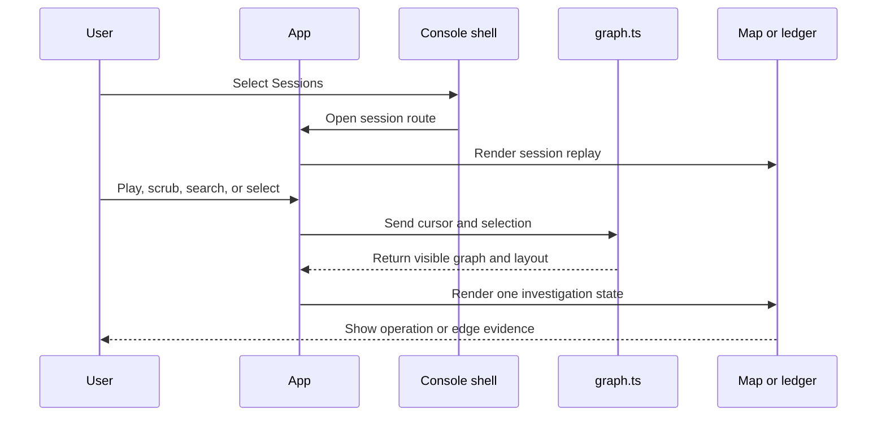

# Mithril console implementation review

This guide covers the isolated Mithril console fixture in `ui/mithril-console`. The fixture exists to test the product navigation and investigation model before graph, finding, and response APIs exist.

## Intended end state

An operator can move between Operations, Sessions, Findings, Policy rollout, Evidence, Response, and Release workspaces. An investigator can open an immutable session graph from a related workspace. The investigator can replay operations within one machine and across machines. An operation selection exposes operation evidence. An edge selection exposes the causal join. The map and ledger keep one investigation state.

The production end state requires durable graph, finding, and response APIs. Those APIs are not implemented in this package or in the source branch that this worktree uses.

## Implementation review flow

[App](src/App.tsx) The URL fragment selects one console workspace or one session route.

-> [ConsoleShell](src/Console.tsx) The shell keeps the product navigation, cluster scope, search entry, and fixture state around each workspace.

-> [ConsoleView](src/Console.tsx) The workspace route renders Operations, Sessions, Findings, Policy rollout, Evidence, Response, or Release.

-> [PoliciesView](src/Console.tsx) A policy selection opens its source, generation, activation, selector, default action, and rule set.

-> [PoliciesView](src/Console.tsx) Edit mode validates and saves one policy draft in browser memory.

-> [PoliciesView](src/Console.tsx) An Observe policy shows suggestions with retained evidence, confidence, and expected effect.

-> [PoliciesView](src/Console.tsx) Apply appends one suggested rule to the selected browser-memory draft.

-> [SessionsView](src/Console.tsx) A session selection exposes its graph revision, operation count, machine count, proof summary, and replay availability.

-> [App](src/App.tsx) The replay action opens the selected immutable session route.

[sessionGraph](src/data.ts) The fixture supplies one immutable session graph revision.

-> [visibleAtStep](src/graph.ts) The replay cursor projects the operations that exist at the selected event step.

-> [visibleEdges](src/graph.ts) The projection keeps only source-backed edges with visible endpoints.

-> [createGraphLayout](src/graph.ts) The layout assigns one stable lane to each machine and one causal rank to each operation.

-> [GraphMap](src/App.tsx) The map renders operation cards and first-class causal edges in the machine lanes.

-> [OperationCard](src/App.tsx) An operation selection expands the operation evidence in the map.

-> [EdgeDetail](src/App.tsx) An edge selection shows the relationship, endpoints, join fields, and evidence records.

-> [EvidenceLedger](src/App.tsx) The ledger reads the same replay cursor and operation selection.

[SessionReplay](src/App.tsx) A replay timer advances the event cursor.

-> [GraphMap](src/App.tsx) The viewport follows the active causal front without changing operation positions.

-> [SessionReplay](src/App.tsx) Search, evidence filters, and machine focus change the investigation view.

-> [SessionReplay](src/App.tsx) The URL fragment records the revision, step, view, selection, and machine focus.

Not implemented: A product API loads a durable graph revision.

Not implemented: A product API loads findings and response plans.

Partial: [App](src/App.tsx) The URL fragment restores the console or session route after a page load. It does not restore the replay cursor, graph selection, or machine focus.

## Ownership

`App` owns the console route and transient notification. `ConsoleShell` owns no state. The shell sends navigation events to `App`.

`Console.tsx` owns the local selection and filter state for Sessions, Findings, Policy rollout, and Response. React creates and destroys this state with each workspace. No console state is durable.

`PoliciesView` owns editable policy copies and one active draft. A save replaces the selected browser-memory copy. The save does not compile, sign, deliver, or activate a policy candidate.

`PoliciesView` also owns the applied-suggestion set. Apply does not change Observe mode. Apply does not write policy state outside the page.

`consoleData.ts` owns the console design fixture. The fixture contains posture metrics, sessions, findings, policy rollout, evidence health, response simulation, and release qualification records.

`SessionReplay` owns the replay cursor, playback state, view, selection, search text, evidence filter, and machine focus. React creates and destroys this state with the session route. No replay state is durable.

`data.ts` owns the design fixture. The fixture contains the machines, operations, causal edges, join fields, proof strength, and evidence references. The user interface does not change the fixture.

`graph.ts` owns pure graph projection and layout functions. These functions do not write application state. `graph.test.ts` verifies replay visibility, multiple causal parents, an acyclic session slice, selected-rank expansion, and edge geometry.

`GraphMap` owns map rendering. Native Scalable Vector Graphics (SVG) paths render the edges. React elements render the operation cards, lane labels, edge inspection points, and contextual details.

`EvidenceLedger` owns the alternate text view. It reads the same state that the map reads. It does not create a second selection model.

## Data flow



The replay cursor controls visibility. A timestamp does not create an edge. The fixture defines each causal edge and its proof strength.

The map uses a left-to-right causal rank. Each edge in the fixture has a lower source rank than target rank. The pure tests verify this condition for the session slice.

Direct edges use a solid line. Contextual edges use a dashed line. Both edge types have text labels and keyboard-focusable inspection points. Color is supplementary.

The selected operation expands at its existing causal rank. Later ranks move to create space. The selected operation stays in its machine lane.

## Verification route

[graph.test.ts](src/graph.test.ts) verifies the pure projection and layout contracts.

[session-replay.spec.ts](e2e/session-replay.spec.ts) verifies console navigation, browser interaction, and responsive contracts. The suite uses Chromium at desktop, tablet, and mobile viewport sizes. The suite also checks Operations, the map, and the ledger for critical accessibility violations.

Use these commands:

```sh
npm run check
npm test
npm run build
npm run test:e2e
```

## Source state and limits

This guide covers the uncommitted `ui/mithril-console` files in the `codex/mithril-ui` worktree. The worktree starts from source revision `4078112242986588274e4cecfba0c2300c429103`.

The implementation is a fixture-only user interface. It does not prove backend graph construction, durable revision storage, finding evaluation, response execution, or recovery behavior. It does not change the phase 6.2 worktree.
