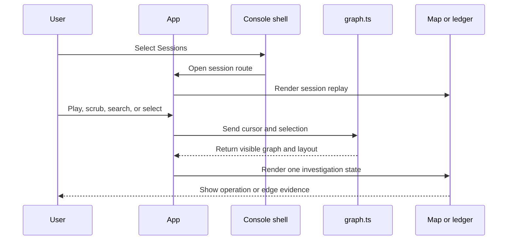
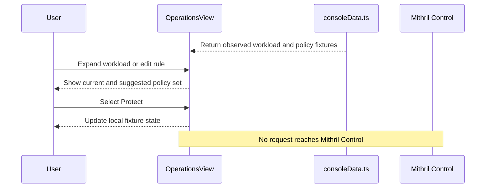

# Mithril console implementation review

This guide covers the isolated Mithril console fixture in `ui/mithril-console`. The fixture tests workload protection, policy review, product navigation, and causal investigation before product APIs exist.

## Intended end state

An operator can inspect one workload and its observed effects. The operator can review current and suggested policies in the workload context. A qualified production path can compile, sign, deliver, probe, and activate the selected policy set. An investigator can open an immutable session graph from a related workspace. The graph shows the exact stopped effect. A separate counterfactual view can explain an incident-grounded path without changing evidence. An incorrect-decision review can prepare a bounded exception without allowing the effect.

The production end state requires durable graph, finding, and response APIs. Those APIs are not implemented in this package or in the source branch that this worktree uses.

## Implementation review flow

[App](src/App.tsx) The URL fragment selects one console workspace or one session route.

-> [ConsoleShell](src/Console.tsx) The shell keeps the product navigation, cluster scope, search entry, and fixture state around each workspace.

-> [ConsoleView](src/Console.tsx) The workspace route renders Operations, Sessions, Findings, Policy rollout, Evidence, Response, Agent, or Release.

-> [OperationsView](src/Console.tsx) Workload protection shows the mode, effect volume, coverage, footprint, and suggestion count for each workload.

-> [OperationsView](src/Console.tsx) A workload selection expands its current policies and new suggestions in place.

-> [OperationsView](src/Console.tsx) An inline edit changes one browser-memory policy rule.

-> [OperationsView](src/Console.tsx) Add policy creates one operator-authored policy in the current browser-memory set.

-> [OperationsView](src/Console.tsx) Remove policy requires confirmation and removes one current or suggested policy from browser memory.

-> [OperationsView](src/Console.tsx) Protect moves the workload suggestions into its current browser-memory policy set.

-> [PoliciesView](src/Console.tsx) A policy selection opens its source, generation, activation, selector, default action, and rule set.

-> [PoliciesView](src/Console.tsx) Edit mode validates and saves one policy draft in browser memory.

-> [PoliciesView](src/Console.tsx) An Observe policy shows suggestions with retained evidence, confidence, and expected effect.

-> [PoliciesView](src/Console.tsx) Apply appends one suggested rule to the selected browser-memory draft.

-> [AgentView](src/Console.tsx) A question receives one bounded fixture answer and an optional route to supporting evidence.

-> [SessionsView](src/Console.tsx) A session selection exposes its graph revision, operation count, machine count, proof summary, and replay availability.

-> [App](src/App.tsx) The replay action opens the selected immutable session route.

[sessionGraph](src/data.ts) The fixture supplies one immutable session graph revision.

-> [visibleAtStep](src/graph.ts) The replay cursor projects the operations that exist at the selected event step.

-> [visibleEdges](src/graph.ts) The projection keeps only source-backed edges with visible endpoints.

-> [createGraphLayout](src/graph.ts) The layout assigns one stable lane to each machine and one causal rank to each operation.

-> [GraphMap](src/App.tsx) The map renders operation cards and first-class causal edges in the machine lanes.

-> [OperationCard](src/App.tsx) An operation selection expands the operation evidence in the map.

-> [OperationCard](src/App.tsx) The denied file effect shows the exact stop point.

-> [CounterfactualPath](src/App.tsx) Show if allowed renders a hypothetical incident path outside the graph data.

-> [SessionReplay](src/App.tsx) Review incorrect stop records a local reason for one bounded exception review.

-> [EdgeDetail](src/App.tsx) An edge selection shows the relationship, endpoints, join fields, and evidence records.

-> [EvidenceLedger](src/App.tsx) The ledger reads the same replay cursor and operation selection.

[SessionReplay](src/App.tsx) A replay timer advances the event cursor.

-> [GraphMap](src/App.tsx) The viewport follows the active causal front without changing operation positions.

-> [SessionReplay](src/App.tsx) Search, evidence filters, and machine focus change the investigation view.

-> [SessionReplay](src/App.tsx) The URL fragment records the revision, step, view, selection, and machine focus.

Not implemented: A product API loads a durable graph revision.

Not implemented: A product API loads findings and response plans.

Not implemented: Protect compiles, signs, delivers, probes, or activates a policy candidate.

Not implemented: An incorrect-stop review creates or authorizes a durable exception.

Partial: [App](src/App.tsx) The URL fragment restores the console or session route after a page load. It does not restore the replay cursor, graph selection, or machine focus.

## Ownership

`App` owns the console route and transient notification. `ConsoleShell` owns no state. The shell sends navigation events to `App`.

`Console.tsx` owns the local selection and filter state for Workload protection, Sessions, Findings, Policy rollout, and Response. React creates and destroys this state with each workspace. No console state is durable.

`OperationsView` owns the workload mode, current rule set, suggestion set, expanded workload, active inline edit, new-policy draft, and removal confirmation. Add, edit, remove, and Protect change only these React values. A suggested-policy removal decreases the Protect count. No action calls Mithril Control.

`PoliciesView` owns editable policy copies and one active draft. A save replaces the selected browser-memory copy. The save does not compile, sign, deliver, or activate a policy candidate.

`PoliciesView` also owns the applied-suggestion set. Apply does not change Observe mode. Apply does not write policy state outside the page.

`AgentView` owns the local conversation. `agentReply` maps a question to fixture guidance and one console route. The agent does not call a model, external tool, policy API, or response API.

`consoleData.ts` owns the console design fixture. The fixture contains workload observations, workload policy rules, posture metrics, sessions, findings, policy rollout, evidence health, response simulation, and release qualification records.

`SessionReplay` owns the replay cursor, playback state, view, selection, search text, evidence filter, machine focus, counterfactual visibility, and incorrect-stop review. React creates and destroys this state with the session route. No replay state is durable.

`data.ts` owns the design fixture. The fixture contains the machines, operations, causal edges, join fields, proof strength, and evidence references. The user interface does not change the fixture.

`graph.ts` owns pure graph projection and layout functions. These functions do not write application state. `graph.test.ts` verifies replay visibility, multiple causal parents, an acyclic session slice, selected-rank expansion, and edge geometry.

`GraphMap` owns map rendering. Native Scalable Vector Graphics (SVG) paths render the edges. React elements render the operation cards, lane labels, edge inspection points, and contextual details.

`CounterfactualPath` reads one stop position from the layout. The component does not read or write `sessionGraph.edges`. The component marks every continuation node as hypothetical.

`EvidenceLedger` owns the alternate text view. It reads the same state that the map reads. It does not create a second selection model.

## Data flow



The workload flow is separate from the immutable graph flow.



The replay cursor controls visibility. A timestamp does not create an edge. The fixture defines each causal edge and its proof strength.

The map uses a left-to-right causal rank. Each edge in the fixture has a lower source rank than target rank. The pure tests verify this condition for the session slice.

Direct edges use a solid line. Contextual edges use a dashed line. Both edge types have text labels and keyboard-focusable inspection points. Color is supplementary.

The selected operation expands at its existing causal rank. Later ranks move to create space. The selected operation stays in its machine lane.

The counterfactual branch starts at the denied operation position. The branch uses separate React data. The branch does not add, remove, or replace a causal edge. The browser test compares the recorded edge count before and after the branch appears.

The incorrect-stop review keeps the actor, object, operation, policy, and graph result visible. The local review proposes one actor, one object, one operation, and one expiring grant. The review does not update a workload policy.

## Incident grounding

The workload fixtures use the official [OpenAI incident summary](https://openai.com/index/hugging-face-incident-and-the-road-ahead/) and [technical report](https://cdn.openai.com/pdf/67869394-cb91-4c12-888c-5cbd85c7814c/OpenAI-Hugging-Face%20Incident-Technical-Report.pdf) as design inputs.

The `datasets-server` suggestions cover sensitive `/proc` reads, parser-launched commands, public command polling, and Kubernetes credential escalation. The `spaces-builder` suggestions cover shared-service relay paths and public repository writes. The database and Hub rules cover unmatched database clients, production credentials, and repository writes. These records are incident-grounded fixtures. The user interface does not claim that Mithril observed these records in a live Hugging Face environment.

## Verification route

[graph.test.ts](src/graph.test.ts) verifies the pure projection and layout contracts.

[session-replay.spec.ts](e2e/session-replay.spec.ts) verifies workload protection, policy-set addition, inline editing, confirmed removal, console navigation, browser interaction, and responsive contracts. The suite verifies that a suggested-policy removal changes the Protect count. The suite verifies that the counterfactual branch does not change the recorded edge count. The suite uses Chromium at desktop, tablet, and mobile viewport sizes. The suite also checks Workload protection, the map, and the ledger for critical accessibility violations.

Use these commands:

```sh
npm run check
npm test
npm run build
npm run test:e2e
```

## Source state and limits

This guide covers the committed `ui/mithril-console` files in the `codex/mithril-ui` worktree. The implementation starts from source revision `4078112242986588274e4cecfba0c2300c429103`. The implementation commits are `a28115f6`, `21a80113`, `a09dc043`, `949356f0`, `ce193791`, `8586f4ec`, `f1509fdb`, and `755710b1`.

The implementation is a fixture-only user interface. It does not prove backend graph construction, durable revision storage, finding evaluation, response execution, or recovery behavior. It does not change the phase 6.2 worktree.
